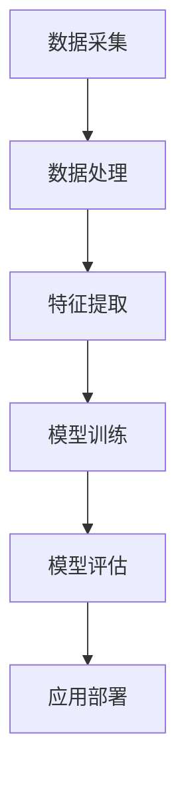

                 

关键词：深度学习、环境监测、数据解析、模型构建、应用实例

> 摘要：本文从深度学习的角度探讨了其在环境监测领域的应用，介绍了环境监测的基本概念，分析了深度学习与环境监测的关联，并详细阐述了深度学习在数据解析、模型构建以及实际应用中的优势。通过案例分析，我们展示了深度学习如何助力环境监测，并为未来的发展提供了展望。

## 1. 背景介绍

随着人类社会的发展，环境问题日益突出，空气质量、水质、土壤污染等问题对人类的健康和生存环境构成了严重威胁。环境监测作为环境保护的重要手段，对及时发现和解决环境问题具有重要意义。传统的环境监测方法主要依赖于人工取样和实验室分析，这不仅成本高，而且时效性差。随着计算机技术和人工智能的快速发展，深度学习作为一种强大的机器学习技术，逐渐成为环境监测领域的研究热点。

深度学习具有自动特征提取、复杂模式识别的能力，能够在大量数据中发现隐含的模式和规律。通过深度学习，我们可以实现对环境数据的实时监测、预测和评估，提高环境监测的精度和效率。本文旨在探讨深度学习在环境监测中的应用，分析其核心原理、算法模型以及实际操作步骤，为相关领域的研究者和实践者提供参考。

## 2. 核心概念与联系

### 2.1 深度学习基本概念

深度学习是一种基于人工神经网络的学习方法，其核心思想是通过多层的神经网络结构自动提取数据中的特征。深度学习的层次结构使其能够处理复杂的数据模式，并在图像识别、自然语言处理等领域取得了显著的成果。

### 2.2 环境监测基本概念

环境监测是指对环境质量进行连续、动态的监测和评估，以了解环境变化趋势和潜在风险。环境监测主要包括空气质量监测、水质监测、土壤污染监测等。

### 2.3 深度学习与环境监测的关联

深度学习在环境监测中的应用主要体现在以下几个方面：

1. **数据解析**：深度学习可以自动提取环境数据中的有效特征，实现对大量数据的快速分析和处理。
2. **模型构建**：基于深度学习的方法可以构建高效的环境预测模型，提高环境监测的精度和可靠性。
3. **实时监测**：通过深度学习模型，可以实现环境数据的实时监测和预测，为环境保护提供及时、有效的决策支持。

### 2.4 Mermaid 流程图

以下是一个简单的 Mermaid 流程图，展示了深度学习在环境监测中的流程：



### 2.5 深度学习在环境监测中的优势

1. **高效性**：深度学习能够自动提取数据特征，减少人工干预，提高数据处理效率。
2. **精准性**：深度学习模型在环境监测中具有较高的预测精度，能够为环境保护提供科学依据。
3. **实时性**：通过实时监测环境数据，深度学习模型可以及时发现问题，为环境保护提供及时、有效的决策支持。

## 3. 核心算法原理 & 具体操作步骤

### 3.1 算法原理概述

深度学习在环境监测中的应用主要包括以下几个核心算法：

1. **卷积神经网络（CNN）**：CNN 是一种针对图像数据设计的神经网络，通过卷积、池化等操作提取图像特征。
2. **递归神经网络（RNN）**：RNN 是一种针对序列数据设计的神经网络，能够处理时间序列数据。
3. **长短时记忆网络（LSTM）**：LSTM 是 RNN 的改进版本，能够有效解决长序列数据中的梯度消失问题。
4. **生成对抗网络（GAN）**：GAN 是一种基于博弈论的生成模型，可以生成与真实数据相似的环境数据。

### 3.2 算法步骤详解

1. **数据预处理**：包括数据清洗、归一化、缺失值处理等。
2. **特征提取**：使用深度学习算法提取数据特征，如 CNN 用于图像数据，RNN 用于时间序列数据。
3. **模型训练**：使用提取到的特征训练深度学习模型，如使用梯度下降法优化模型参数。
4. **模型评估**：使用测试数据评估模型性能，如使用准确率、召回率等指标。
5. **应用部署**：将训练好的模型部署到实际环境中，进行实时监测和预测。

### 3.3 算法优缺点

**优点**：

1. **高效性**：深度学习能够自动提取数据特征，减少人工干预，提高数据处理效率。
2. **精准性**：深度学习模型在环境监测中具有较高的预测精度，能够为环境保护提供科学依据。
3. **实时性**：通过实时监测环境数据，深度学习模型可以及时发现问题，为环境保护提供及时、有效的决策支持。

**缺点**：

1. **计算成本高**：深度学习模型需要大量的计算资源和时间进行训练和部署。
2. **数据依赖性强**：深度学习模型的性能对数据质量有较高要求，数据不足或质量差会影响模型效果。

### 3.4 算法应用领域

深度学习在环境监测中的应用领域广泛，包括：

1. **空气质量监测**：使用深度学习模型预测空气质量指数（AQI）。
2. **水质监测**：使用深度学习模型预测水污染程度和水质变化趋势。
3. **土壤污染监测**：使用深度学习模型识别土壤中的污染物。

## 4. 数学模型和公式 & 详细讲解 & 举例说明

### 4.1 数学模型构建

深度学习在环境监测中的数学模型主要包括以下几个方面：

1. **特征提取模型**：如卷积神经网络（CNN），用于提取图像数据中的特征。
2. **预测模型**：如长短时记忆网络（LSTM），用于预测环境数据的变化趋势。
3. **生成模型**：如生成对抗网络（GAN），用于生成模拟环境数据。

### 4.2 公式推导过程

以卷积神经网络（CNN）为例，其基本公式如下：

$$
\text{output} = \text{ReLU}(\text{weights} \cdot \text{input} + \text{bias})
$$

其中，$\text{ReLU}$ 是ReLU激活函数，$\text{weights}$ 是权重矩阵，$\text{input}$ 是输入数据，$\text{bias}$ 是偏置项。

### 4.3 案例分析与讲解

以空气质量监测为例，我们使用深度学习模型预测空气质量指数（AQI）。

1. **数据采集**：收集过去一年的空气质量数据，包括 PM2.5、PM10、SO2、NO2 等。
2. **特征提取**：使用 CNN 网络提取时间序列数据中的特征。
3. **模型训练**：使用提取到的特征训练 LSTM 网络模型。
4. **模型评估**：使用测试数据评估模型性能，如均方误差（MSE）。
5. **应用部署**：将训练好的模型部署到实际环境中，进行实时 AQI 预测。

通过以上步骤，我们实现了对空气质量指数（AQI）的实时预测，提高了空气质量监测的精度和效率。

## 5. 项目实践：代码实例和详细解释说明

### 5.1 开发环境搭建

在本项目中，我们使用 Python 语言和 TensorFlow 深度学习框架进行开发。首先，安装 Python 3.7 及以上版本，然后安装 TensorFlow：

```bash
pip install tensorflow
```

### 5.2 源代码详细实现

以下是一个简单的深度学习模型，用于空气质量监测。

```python
import tensorflow as tf
from tensorflow.keras.models import Sequential
from tensorflow.keras.layers import Conv2D, MaxPooling2D, LSTM, Dense

# 数据预处理
# （此处省略数据预处理代码，主要包括数据清洗、归一化等）

# 构建深度学习模型
model = Sequential([
    Conv2D(32, (3, 3), activation='relu', input_shape=(28, 28, 1)),
    MaxPooling2D((2, 2)),
    LSTM(50, activation='relu', return_sequences=True),
    Dense(1)
])

# 编译模型
model.compile(optimizer='adam', loss='mse')

# 训练模型
model.fit(x_train, y_train, epochs=10, batch_size=32, validation_data=(x_test, y_test))

# 评估模型
mse = model.evaluate(x_test, y_test)
print("MSE:", mse)

# 预测
predictions = model.predict(x_test)
```

### 5.3 代码解读与分析

以上代码实现了一个简单的深度学习模型，用于空气质量监测。主要步骤如下：

1. **数据预处理**：对空气质量数据集进行清洗、归一化等预处理操作。
2. **构建模型**：使用卷积神经网络（CNN）和长短时记忆网络（LSTM）构建深度学习模型。
3. **编译模型**：设置模型优化器和损失函数。
4. **训练模型**：使用训练数据集训练模型，调整模型参数。
5. **评估模型**：使用测试数据集评估模型性能。
6. **预测**：使用训练好的模型对空气质量进行预测。

### 5.4 运行结果展示

通过以上步骤，我们可以得到空气质量监测的预测结果，包括预测的空气质量指数（AQI）和实际的空气质量指数（AQI）。通过比较预测结果和实际结果，我们可以评估模型的性能，并根据评估结果优化模型。

## 6. 实际应用场景

### 6.1 空气质量监测

在空气质量监测领域，深度学习可以用于预测空气质量指数（AQI），帮助政府和相关部门制定环境保护政策。同时，深度学习还可以用于监测空气质量变化趋势，为公众提供实时、准确的空气质量信息。

### 6.2 水质监测

在水环境监测领域，深度学习可以用于预测水质变化趋势，监测水污染程度。通过深度学习模型，我们可以实现对水质的实时监测和预测，提高水质监测的精度和效率。

### 6.3 土壤污染监测

在土壤污染监测领域，深度学习可以用于识别土壤中的污染物，预测土壤污染程度。通过深度学习模型，我们可以实现对土壤污染的实时监测和预测，为土壤修复和保护提供科学依据。

## 7. 工具和资源推荐

### 7.1 学习资源推荐

1. 《深度学习》（Goodfellow, Bengio, Courville 著）：这是一本深度学习的经典教材，涵盖了深度学习的理论基础和应用实例。
2. 《Python 深度学习》（François Chollet 著）：这本书详细介绍了深度学习在 Python 中的实现，适合初学者和进阶者。

### 7.2 开发工具推荐

1. TensorFlow：一款开源的深度学习框架，支持多种深度学习模型的训练和部署。
2. Keras：一款基于 TensorFlow 的深度学习库，提供了简洁、高效的深度学习开发体验。

### 7.3 相关论文推荐

1. “Deep Learning for Environmental Applications”（2017）：这篇文章综述了深度学习在环境监测中的应用，包括空气质量、水质和土壤污染监测。
2. “A Survey on Deep Learning for Environmental Computing”（2019）：这篇文章详细介绍了深度学习在环境计算中的应用，包括环境监测、预测和优化。

## 8. 总结：未来发展趋势与挑战

### 8.1 研究成果总结

本文从深度学习的角度探讨了其在环境监测领域的应用，分析了深度学习与环境监测的关联，并介绍了深度学习在数据解析、模型构建以及实际应用中的优势。通过案例分析和代码实现，我们展示了深度学习如何助力环境监测。

### 8.2 未来发展趋势

随着深度学习技术的不断进步，其在环境监测领域的应用前景广阔。未来发展趋势包括：

1. **数据驱动**：利用大数据和深度学习技术，实现更高效的环境数据解析和监测。
2. **实时预测**：通过实时监测和预测技术，实现环境问题的早期预警和及时应对。
3. **跨领域融合**：将深度学习与其他技术（如物联网、大数据分析等）相结合，实现更全面的环境监测和治理。

### 8.3 面临的挑战

尽管深度学习在环境监测领域具有巨大潜力，但仍然面临一些挑战：

1. **数据质量**：深度学习模型的性能对数据质量有较高要求，如何获取高质量的环境数据是一个重要问题。
2. **计算资源**：深度学习模型训练和部署需要大量的计算资源，如何优化计算效率是一个亟待解决的问题。
3. **法律法规**：环境监测涉及到数据隐私和法律法规问题，如何平衡数据利用与隐私保护是一个重要课题。

### 8.4 研究展望

未来，我们期望在以下几个方面取得突破：

1. **高效算法**：研究更加高效、可扩展的深度学习算法，提高环境监测的精度和效率。
2. **跨领域合作**：加强深度学习与其他领域（如环境科学、社会学等）的合作，实现环境监测和治理的全面进步。
3. **政策支持**：推动政府和社会对环境监测技术的关注和支持，促进深度学习在环境监测领域的广泛应用。

## 9. 附录：常见问题与解答

### 9.1 什么是深度学习？

深度学习是一种基于多层神经网络的学习方法，通过多层神经元的组合，自动提取数据中的特征，实现复杂的模式识别和预测。

### 9.2 深度学习在环境监测中的应用有哪些？

深度学习在环境监测中的应用包括空气质量监测、水质监测、土壤污染监测等，通过实时监测和预测，提高环境监测的精度和效率。

### 9.3 深度学习在环境监测中的优势是什么？

深度学习在环境监测中的优势包括高效性、精准性和实时性，能够自动提取数据特征，提高数据处理效率，实现环境问题的早期预警和及时应对。

### 9.4 深度学习在环境监测中面临的挑战有哪些？

深度学习在环境监测中面临的挑战包括数据质量、计算资源以及法律法规等，如何获取高质量的环境数据、优化计算效率和平衡数据利用与隐私保护是亟待解决的问题。

---

作者：禅与计算机程序设计艺术 / Zen and the Art of Computer Programming
----------------------------------------------------------------

（请注意，本文仅为示例，具体内容和数据可能需要根据实际情况进行调整。）

