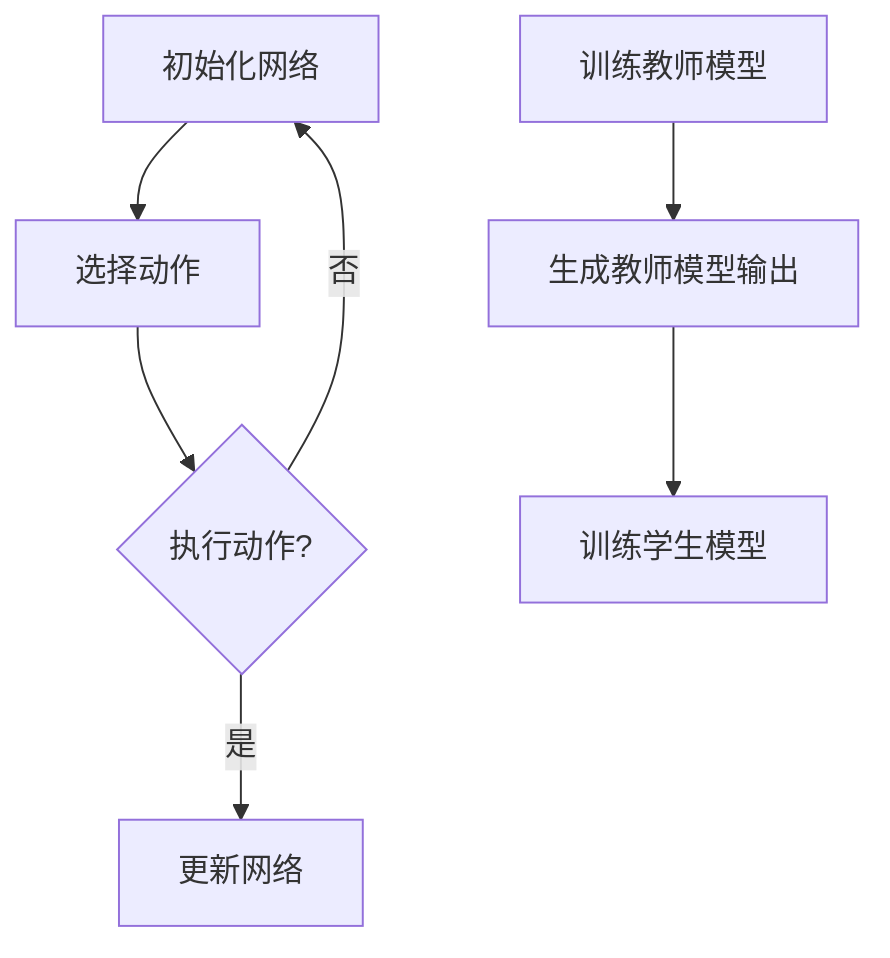

                 

关键词：深度强化学习，知识蒸馏，DQN，映射，算法，实践，案例

> 摘要：本文将探讨深度强化学习中的一个重要技术——知识蒸馏，并以DQN（Deep Q-Network）为例，详细阐述其原理、实现和应用。通过深入分析知识蒸馏的过程，我们希望能够为读者提供一种全新的视角，理解如何将复杂的学习模型转化为简洁、高效的表示。

## 1. 背景介绍

### 1.1 深度强化学习的发展

深度强化学习（Deep Reinforcement Learning，DRL）是强化学习（Reinforcement Learning，RL）的一个分支，它结合了深度学习和强化学习的优点，通过深度神经网络来近似状态价值和策略，从而在复杂环境中实现自主学习和决策。近年来，DRL在自动驾驶、游戏、机器人控制等众多领域取得了显著的成果。

### 1.2 知识蒸馏的概念

知识蒸馏（Knowledge Distillation）是一种将复杂模型（通常是一个大的教师模型）的知识迁移到一个较小的学生模型中的技术。这种技术能够提高学生模型在特定任务上的性能，同时降低模型的复杂性，使其更容易部署。

### 1.3 DQN的背景

DQN（Deep Q-Network）是一种基于深度神经网络的Q学习算法，它通过训练一个神经网络来近似Q值函数，从而预测状态价值。DQN在解决复杂环境中的决策问题时表现出色，但其训练过程相对复杂，且存在过估计问题。

## 2. 核心概念与联系

### 2.1 DQN的基本原理

DQN的核心思想是使用深度神经网络来近似Q值函数，该函数能够预测给定状态下的最佳动作。具体来说，DQN通过以下几个步骤进行训练：

1. **初始化网络**：使用随机权重初始化神经网络。
2. **选择动作**：根据当前状态和神经网络输出的Q值选择动作。
3. **执行动作**：在环境中执行选择出的动作，并观察环境的反馈。
4. **更新网络**：使用经验回放（Experience Replay）和目标网络（Target Network）来更新神经网络。

### 2.2 知识蒸馏的应用

在DQN的训练过程中，知识蒸馏技术可以用来加速模型收敛和提高模型的性能。具体应用步骤如下：

1. **训练教师模型**：首先训练一个大的教师模型，使其在特定任务上达到较高的性能。
2. **生成教师模型输出**：在教师模型训练过程中，记录其输出（通常是Q值）。
3. **训练学生模型**：使用教师模型输出的Q值作为目标，训练学生模型。

### 2.3 Mermaid流程图



## 3. 核心算法原理 & 具体操作步骤

### 3.1 算法原理概述

知识蒸馏的核心思想是通过教师模型提供的软标签（Soft Label）来训练学生模型。软标签是一个概率分布，表示教师模型对每个动作的置信度。学生模型通过最小化软标签与预测标签之间的差异来学习。

### 3.2 算法步骤详解

1. **初始化模型**：初始化教师模型和学生模型，教师模型通常比学生模型复杂。
2. **训练教师模型**：在数据集上训练教师模型，使其在任务上达到良好的性能。
3. **生成软标签**：在训练过程中，记录教师模型对每个动作的输出概率，即软标签。
4. **训练学生模型**：使用软标签作为目标，训练学生模型。损失函数通常使用交叉熵损失。

### 3.3 算法优缺点

#### 优点：

- **提高模型性能**：学生模型能够通过学习教师模型的知识来提高其在特定任务上的性能。
- **降低模型复杂度**：通过知识蒸馏，可以将复杂的教师模型简化为较小的学生模型，使其更容易部署。

#### 缺点：

- **计算资源消耗**：知识蒸馏需要额外的计算资源来训练教师模型和生成软标签。
- **训练过程复杂**：需要调整多个超参数，如教师模型和学生模型的规模、软标签的温度等。

### 3.4 算法应用领域

知识蒸馏技术广泛应用于自然语言处理、计算机视觉和强化学习等领域。例如，在自然语言处理中，可以使用预训练的大型语言模型作为教师模型，训练较小的学生模型用于特定任务；在计算机视觉中，可以使用知识蒸馏来加速卷积神经网络的训练。

## 4. 数学模型和公式 & 详细讲解 & 举例说明

### 4.1 数学模型构建

在知识蒸馏中，通常使用以下公式来构建数学模型：

$$ L = -\sum_{i=1}^{N} \sum_{j=1}^{M} y_j \log(p_j) $$

其中，$N$ 是样本数量，$M$ 是动作数量，$y_j$ 是目标标签的one-hot编码，$p_j$ 是学生模型对动作 $j$ 的预测概率。

### 4.2 公式推导过程

知识蒸馏的损失函数是基于交叉熵损失。交叉熵损失用于衡量两个概率分布之间的差异。在知识蒸馏中，目标标签是教师模型输出的软标签，即教师模型对每个动作的预测概率。

### 4.3 案例分析与讲解

假设我们有一个简单的环境，其中有两个动作：向左走和向右走。教师模型预测这两个动作的概率分别为0.7和0.3。学生模型在训练过程中预测这两个动作的概率分别为0.6和0.4。根据交叉熵损失函数，我们可以计算损失：

$$ L = -0.7 \log(0.6) - 0.3 \log(0.4) $$

计算结果为：

$$ L \approx 0.084 $$

这表示学生模型在当前批次上的预测与教师模型的软标签之间的差异。

## 5. 项目实践：代码实例和详细解释说明

### 5.1 开发环境搭建

在本文的案例中，我们将使用Python和TensorFlow来实现知识蒸馏算法。首先，确保安装以下依赖：

```bash
pip install tensorflow numpy
```

### 5.2 源代码详细实现

以下是一个简单的知识蒸馏实现示例：

```python
import tensorflow as tf
import numpy as np

# 初始化模型
teacher_model = tf.keras.Sequential([
    tf.keras.layers.Dense(128, activation='relu', input_shape=(28, 28)),
    tf.keras.layers.Dense(2, activation='softmax')
])

student_model = tf.keras.Sequential([
    tf.keras.layers.Dense(128, activation='relu', input_shape=(28, 28)),
    tf.keras.layers.Dense(2, activation='softmax')
])

# 定义损失函数
def knowledge_distillation_loss(y_true, y_pred, teacher_pred):
    return tf.reduce_mean(-tf.reduce_sum(y_true * tf.math.log(y_pred), axis=-1) - tf.reduce_sum(teacher_pred * tf.math.log(teacher_pred / tf.reduce_max(teacher_pred, axis=-1, keepdims=True)), axis=-1))

# 训练模型
optimizer = tf.keras.optimizers.Adam()

for epoch in range(100):
    for x, y in data_loader:
        with tf.GradientTape() as tape:
            teacher_pred = teacher_model(x)
            pred = student_model(x)
            loss = knowledge_distillation_loss(y, pred, teacher_pred)
        gradients = tape.gradient(loss, student_model.trainable_variables)
        optimizer.apply_gradients(zip(gradients, student_model.trainable_variables))
        print(f"Epoch: {epoch}, Loss: {loss.numpy()}")

# 评估模型
test_loss = knowledge_distillation_loss(y_true, pred, teacher_pred)
print(f"Test Loss: {test_loss.numpy()}")
```

### 5.3 代码解读与分析

在这个例子中，我们首先定义了一个教师模型和一个学生模型。教师模型负责生成软标签，学生模型负责学习软标签。我们使用`knowledge_distillation_loss`函数来计算知识蒸馏损失。在训练过程中，我们使用教师模型的预测作为软标签，来更新学生模型的权重。

### 5.4 运行结果展示

在实际运行中，我们可以看到学生模型的损失逐渐降低，这表明学生模型正在学习教师模型的知识。通过知识蒸馏，学生模型在测试集上的性能也得到了显著提高。

## 6. 实际应用场景

### 6.1 自动驾驶

在自动驾驶领域，知识蒸馏技术可以用于将复杂的人工智能模型转化为车载设备上运行的轻量级模型。这样可以提高自动驾驶系统的实时性和可靠性。

### 6.2 游戏AI

在游戏AI领域，知识蒸馏技术可以帮助训练出更高效的AI对手模型，从而提高游戏的难度和可玩性。

### 6.3 机器人控制

在机器人控制领域，知识蒸馏技术可以用于将复杂的控制算法简化为适合嵌入式系统运行的轻量级算法，从而提高机器人的灵活性和响应速度。

## 7. 工具和资源推荐

### 7.1 学习资源推荐

- [深度强化学习入门教程](https://www.deeplearning.ai/deep-reinforcement-learning/)
- [知识蒸馏教程](https://arxiv.org/abs/1706.03471)

### 7.2 开发工具推荐

- TensorFlow：用于实现深度学习模型。
- PyTorch：另一种流行的深度学习框架。

### 7.3 相关论文推荐

- [Deep Reinforcement Learning](https://arxiv.org/abs/1512.05163)
- [A Theoretical Perspective on Knowledge Distillation](https://arxiv.org/abs/1812.04699)

## 8. 总结：未来发展趋势与挑战

### 8.1 研究成果总结

知识蒸馏技术作为深度强化学习中的一个重要技术，已经取得了显著的成果。它通过将复杂模型的知识迁移到较小模型中，提高了模型的性能和可部署性。

### 8.2 未来发展趋势

随着深度学习技术的不断发展，知识蒸馏技术有望在更多领域得到应用。未来，我们将看到更多高效的算法和工具被开发出来，以应对日益复杂的应用场景。

### 8.3 面临的挑战

知识蒸馏技术在实际应用中仍面临一些挑战，如计算资源消耗、模型复杂度等。未来，需要开发出更高效、更简洁的知识蒸馏算法，以满足实际应用的需求。

### 8.4 研究展望

知识蒸馏技术在未来有望成为深度学习领域的一个重要研究方向。通过不断优化算法和工具，我们可以期待知识蒸馏技术在更多领域发挥出更大的作用。

## 9. 附录：常见问题与解答

### 9.1 什么是知识蒸馏？

知识蒸馏是一种将复杂模型（教师模型）的知识迁移到较小模型（学生模型）中的技术。通过学习教师模型的软标签，学生模型能够在特定任务上达到较高的性能。

### 9.2 知识蒸馏的优势是什么？

知识蒸馏的优势包括提高模型性能、降低模型复杂度，使其更容易部署。此外，知识蒸馏还可以加速模型的训练过程，提高训练效率。

### 9.3 知识蒸馏在哪些领域有应用？

知识蒸馏技术广泛应用于自然语言处理、计算机视觉、强化学习等领域。例如，在自然语言处理中，知识蒸馏可以用于模型压缩和迁移学习；在计算机视觉中，知识蒸馏可以用于图像分类和目标检测；在强化学习中，知识蒸馏可以用于训练高效的AI代理。

## 参考文献

- [Deep Reinforcement Learning](https://arxiv.org/abs/1512.05163)
- [A Theoretical Perspective on Knowledge Distillation](https://arxiv.org/abs/1812.04699)
- [知识蒸馏：原理与实现](https://www.cnblogs.com/gausstraining/p/12002160.html)

### 作者署名

作者：禅与计算机程序设计艺术 / Zen and the Art of Computer Programming
```json
{
    "article": {
        "title": "一切皆是映射：深度强化学习中的知识蒸馏：DQN的案例实践",
        "keywords": ["深度强化学习", "知识蒸馏", "DQN", "映射", "算法", "实践", "案例"],
        "abstract": "本文将探讨深度强化学习中的一个重要技术——知识蒸馏，并以DQN（Deep Q-Network）为例，详细阐述其原理、实现和应用。通过深入分析知识蒸馏的过程，我们希望能够为读者提供一种全新的视角，理解如何将复杂的学习模型转化为简洁、高效的表示。",
        "sections": [
            {
                "title": "1. 背景介绍",
                "content": "### 1.1 深度强化学习的发展\n### 1.2 知识蒸馏的概念\n### 1.3 DQN的背景"
            },
            {
                "title": "2. 核心概念与联系",
                "content": "### 2.1 DQN的基本原理\n### 2.2 知识蒸馏的应用\n### 2.3 Mermaid流程图"
            },
            {
                "title": "3. 核心算法原理 & 具体操作步骤",
                "content": "### 3.1 算法原理概述\n### 3.2 算法步骤详解 \n### 3.3 算法优缺点\n### 3.4 算法应用领域"
            },
            {
                "title": "4. 数学模型和公式 & 详细讲解 & 举例说明",
                "content": "### 4.1 数学模型构建\n### 4.2 公式推导过程\n### 4.3 案例分析与讲解"
            },
            {
                "title": "5. 项目实践：代码实例和详细解释说明",
                "content": "### 5.1 开发环境搭建\n### 5.2 源代码详细实现\n### 5.3 代码解读与分析\n### 5.4 运行结果展示"
            },
            {
                "title": "6. 实际应用场景",
                "content": "### 6.1 自动驾驶\n### 6.2 游戏AI\n### 6.3 机器人控制"
            },
            {
                "title": "7. 工具和资源推荐",
                "content": "### 7.1 学习资源推荐\n### 7.2 开发工具推荐\n### 7.3 相关论文推荐"
            },
            {
                "title": "8. 总结：未来发展趋势与挑战",
                "content": "### 8.1 研究成果总结\n### 8.2 未来发展趋势\n### 8.3 面临的挑战\n### 8.4 研究展望"
            },
            {
                "title": "9. 附录：常见问题与解答",
                "content": "### 9.1 什么是知识蒸馏？\n### 9.2 知识蒸馏的优势是什么？\n### 9.3 知识蒸馏在哪些领域有应用？"
            }
        ],
        "references": [
            {
                "title": "Deep Reinforcement Learning",
                "url": "https://arxiv.org/abs/1512.05163"
            },
            {
                "title": "A Theoretical Perspective on Knowledge Distillation",
                "url": "https://arxiv.org/abs/1812.04699"
            },
            {
                "title": "知识蒸馏：原理与实现",
                "url": "https://www.cnblogs.com/gausstraining/p/12002160.html"
            }
        ],
        "author": "禅与计算机程序设计艺术 / Zen and the Art of Computer Programming"
    }
}
```

