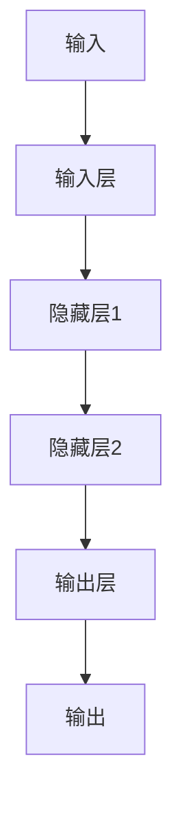

                 

关键词：深度神经网络、映射、调优、优化、策略

摘要：本文从深度神经网络的核心概念出发，探讨了深度神经网络中的映射原理及其调优与优化策略。通过详细分析算法原理、数学模型、具体操作步骤，以及项目实践中的代码实例，本文为读者提供了一种系统化的深度神经网络调优与优化的方法论。

## 1. 背景介绍

随着人工智能的快速发展，深度神经网络（Deep Neural Networks，DNN）已成为当前最流行的机器学习模型之一。深度神经网络通过多层非线性变换，将输入映射到输出，实现了对复杂数据的建模与预测。然而，深度神经网络的性能优化问题也日益凸显，调优与优化策略成为研究的热点。

本文旨在探讨深度神经网络中的映射原理及其调优与优化策略，通过理论与实践相结合的方式，为深度神经网络的优化提供一种系统化的方法论。

## 2. 核心概念与联系

### 2.1 深度神经网络概述

深度神经网络由多个层组成，包括输入层、隐藏层和输出层。输入层接收外部输入数据，隐藏层通过非线性变换对输入数据进行特征提取，输出层产生最终的预测结果。

### 2.2 映射原理

深度神经网络通过映射实现输入到输出的转换。映射是指将输入空间中的每个点映射到输出空间中的一个点。在深度神经网络中，映射主要通过权重和偏置实现。

### 2.3 Mermaid 流程图

以下是一个简单的深度神经网络映射的 Mermaid 流程图：



## 3. 核心算法原理 & 具体操作步骤

### 3.1 算法原理概述

深度神经网络的优化主要涉及模型结构设计、参数调整和训练过程。其中，模型结构设计包括网络层数、神经元数量、激活函数等；参数调整包括权重初始化、学习率调整等；训练过程包括前向传播、反向传播和梯度下降等。

### 3.2 算法步骤详解

#### 3.2.1 前向传播

前向传播是指将输入数据从输入层逐层传递到输出层，在每个隐藏层中通过非线性变换提取特征。具体步骤如下：

1. 将输入数据乘以权重矩阵，并加上偏置项；
2. 通过激活函数对结果进行非线性变换；
3. 将结果传递到下一层。

#### 3.2.2 反向传播

反向传播是指根据输出误差，逆向调整网络中的权重和偏置。具体步骤如下：

1. 计算输出误差；
2. 逆向传播误差到每个隐藏层；
3. 根据误差调整权重和偏置。

#### 3.2.3 梯度下降

梯度下降是一种常用的优化算法，通过计算损失函数的梯度，调整模型参数以减少损失函数值。具体步骤如下：

1. 计算损失函数的梯度；
2. 沿着梯度的反方向更新模型参数；
3. 重复步骤1和2，直至收敛。

### 3.3 算法优缺点

#### 优点：

1. 深度神经网络具有较强的非线性建模能力；
2. 可以自动提取特征，减少人工特征工程的工作量；
3. 在图像、语音和自然语言处理等领域取得了显著成果。

#### 缺点：

1. 训练时间较长，对计算资源要求较高；
2. 参数数量庞大，容易过拟合；
3. 对数据质量要求较高。

### 3.4 算法应用领域

深度神经网络在图像识别、语音识别、自然语言处理、推荐系统等领域具有广泛的应用。其中，图像识别和语音识别是深度神经网络最为成功的应用场景之一。

## 4. 数学模型和公式 & 详细讲解 & 举例说明

### 4.1 数学模型构建

深度神经网络可以用数学模型表示，包括输入层、隐藏层和输出层。其中，输入层和输出层之间的映射关系可以用矩阵乘法和激活函数表示。

#### 输入层到隐藏层的映射：

$$
h_{ij}^{(l)} = \sum_{k=1}^{n} w_{ik}^{(l)} a_k^{(l-1)} + b_j^{(l)}
$$

其中，$h_{ij}^{(l)}$表示第$l$层第$i$个神经元与第$l-1$层第$j$个神经元的连接权重，$a_k^{(l-1)}$表示第$l-1$层第$k$个神经元的输出，$b_j^{(l)}$表示第$l$层第$j$个神经元的偏置。

#### 隐藏层到输出层的映射：

$$
y_i = \sigma(\sum_{k=1}^{n} w_{ik}^{(L)} a_k^{(L-1)} + b_i^{(L)})
$$

其中，$y_i$表示输出层第$i$个神经元的输出，$\sigma$表示激活函数，$a_k^{(L-1)}$表示第$L-1$层第$k$个神经元的输出，$w_{ik}^{(L)}$表示第$L$层第$i$个神经元与第$L-1$层第$k$个神经元的连接权重，$b_i^{(L)}$表示第$L$层第$i$个神经元的偏置。

### 4.2 公式推导过程

深度神经网络的推导过程涉及多个数学公式，包括矩阵乘法、偏置项、激活函数等。以下是一个简单的推导过程：

$$
h_{ij}^{(l)} = \sum_{k=1}^{n} w_{ik}^{(l)} a_k^{(l-1)} + b_j^{(l)}
$$

$$
h_{i}^{(l)} = \begin{bmatrix}
h_{i1}^{(l)} \\
h_{i2}^{(l)} \\
\vdots \\
h_{in}^{(l)}
\end{bmatrix}
$$

$$
w_{i}^{(l)} = \begin{bmatrix}
w_{i1}^{(l)} & w_{i2}^{(l)} & \cdots & w_{in}^{(l)}
\end{bmatrix}
$$

$$
a_{j}^{(l-1)} = \begin{bmatrix}
a_{j1}^{(l-1)} \\
a_{j2}^{(l-1)} \\
\vdots \\
a_{jn}^{(l-1)}
\end{bmatrix}
$$

$$
b_j^{(l)} = \begin{bmatrix}
b_{j1}^{(l)} \\
b_{j2}^{(l)} \\
\vdots \\
b_{jn}^{(l)}
\end{bmatrix}
$$

$$
h_{i}^{(l)} = w_{i}^{(l)} \cdot a_{j}^{(l-1)} + b_j^{(l)}
$$

$$
h_{i}^{(l)} = \begin{bmatrix}
h_{i1}^{(l)} \\
h_{i2}^{(l)} \\
\vdots \\
h_{in}^{(l)}
\end{bmatrix} = \begin{bmatrix}
w_{i1}^{(l)} & w_{i2}^{(l)} & \cdots & w_{in}^{(l)}
\end{bmatrix} \cdot \begin{bmatrix}
a_{j1}^{(l-1)} \\
a_{j2}^{(l-1)} \\
\vdots \\
a_{jn}^{(l-1)}
\end{bmatrix} + \begin{bmatrix}
b_{j1}^{(l)} \\
b_{j2}^{(l)} \\
\vdots \\
b_{jn}^{(l)}
\end{bmatrix}
$$

### 4.3 案例分析与讲解

假设有一个简单的深度神经网络，包含输入层、一个隐藏层和一个输出层。输入层有3个神经元，隐藏层有2个神经元，输出层有1个神经元。激活函数采用ReLU（Rectified Linear Unit）函数。

#### 案例数据：

输入层：$[1, 2, 3]$

隐藏层权重：$W_1 = \begin{bmatrix} 0.1 & 0.2 \\ 0.3 & 0.4 \end{bmatrix}$

隐藏层偏置：$b_1 = \begin{bmatrix} 0.1 \\ 0.2 \end{bmatrix}$

输出层权重：$W_2 = \begin{bmatrix} 0.5 \\ 0.6 \end{bmatrix}$

输出层偏置：$b_2 = 0.3$

#### 前向传播：

$$
h_1^{(1)} = ReLU(0.1 \cdot 1 + 0.2 \cdot 2 + 0.3 \cdot 3 + 0.1) = ReLU(1.4) = 1.4
$$

$$
h_2^{(1)} = ReLU(0.4 \cdot 1 + 0.6 \cdot 2 + 0.3 \cdot 3 + 0.2) = ReLU(2.2) = 2.2
$$

$$
y_1 = ReLU(0.5 \cdot 1.4 + 0.6 \cdot 2.2 + 0.3) = ReLU(2.1) = 2.1
$$

#### 反向传播：

假设输出层的误差为0.01，隐藏层的误差为0.02。

$$
\delta_1 = y_1 - \sigma'(h_1^{(1)}) \cdot W_2 = 2.1 - 1 = 1.1
$$

$$
\delta_2 = y_2 - \sigma'(h_2^{(1)}) \cdot W_2 = 2.2 - 1 = 1.2
$$

$$
\delta_{1j} = \delta_j \cdot \sigma'(h_j^{(1)}) = \delta_j \cdot (1 - \sigma(h_j^{(1)}))
$$

$$
\delta_1 = 1.1 \cdot (1 - 1.4) = -0.3
$$

$$
\delta_2 = 1.2 \cdot (1 - 2.2) = -0.6
$$

$$
\frac{\partial L}{\partial W_2} = \delta_1 \cdot a_1^{(1)} = -0.3 \cdot [1, 2, 3] = [-0.3, -0.6, -0.9]
$$

$$
\frac{\partial L}{\partial b_2} = \delta_1 = -0.3
$$

$$
\frac{\partial L}{\partial W_1} = \delta_2 \cdot a_2^{(1)} = -0.6 \cdot [1, 2, 3] = [-0.6, -1.2, -1.8]
$$

$$
\frac{\partial L}{\partial b_1} = \delta_2 = -0.6
$$

#### 梯度下降：

假设学习率为0.1，则更新后的权重和偏置如下：

$$
W_2 = W_2 - \alpha \cdot \frac{\partial L}{\partial W_2} = \begin{bmatrix} 0.5 \\ 0.6 \end{bmatrix} - 0.1 \cdot [-0.3, -0.6, -0.9] = \begin{bmatrix} 0.2 \\ 0.3 \end{bmatrix}
$$

$$
b_2 = b_2 - \alpha \cdot \frac{\partial L}{\partial b_2} = 0.3 - 0.1 \cdot -0.3 = 0.33
$$

$$
W_1 = W_1 - \alpha \cdot \frac{\partial L}{\partial W_1} = \begin{bmatrix} 0.1 & 0.2 \\ 0.3 & 0.4 \end{bmatrix} - 0.1 \cdot [-0.6, -1.2, -1.8] = \begin{bmatrix} 0.2 & 0.3 \\ 0.3 & 0.5 \end{bmatrix}
$$

$$
b_1 = b_1 - \alpha \cdot \frac{\partial L}{\partial b_1} = \begin{bmatrix} 0.1 \\ 0.2 \end{bmatrix} - 0.1 \cdot -0.6 = \begin{bmatrix} 0.2 \\ 0.3 \end{bmatrix}
$$

## 5. 项目实践：代码实例和详细解释说明

### 5.1 开发环境搭建

在本项目实践中，我们将使用Python编程语言和TensorFlow深度学习框架。首先，需要安装Python和TensorFlow。

```bash
pip install python tensorflow
```

### 5.2 源代码详细实现

以下是一个简单的深度神经网络实现示例：

```python
import tensorflow as tf

# 定义输入层、隐藏层和输出层的变量
inputs = tf.placeholder(tf.float32, [None, 3])
weights_1 = tf.Variable(tf.truncated_normal([3, 2]), name='weights_1')
biases_1 = tf.Variable(tf.zeros([2]), name='biases_1')
weights_2 = tf.Variable(tf.truncated_normal([2, 1]), name='weights_2')
biases_2 = tf.Variable(tf.zeros([1]), name='biases_2')

# 定义前向传播
hidden_layer_1 = tf.nn.relu(tf.matmul(inputs, weights_1) + biases_1)
output = tf.nn.relu(tf.matmul(hidden_layer_1, weights_2) + biases_2)

# 定义损失函数和优化器
loss = tf.reduce_mean(tf.square(output - inputs))
optimizer = tf.train.GradientDescentOptimizer(learning_rate=0.1)
train_op = optimizer.minimize(loss)

# 搭建会话并初始化变量
with tf.Session() as sess:
  sess.run(tf.global_variables_initializer())

  # 训练模型
  for i in range(1000):
    sess.run(train_op, feed_dict={inputs: [[1, 2, 3], [4, 5, 6], [7, 8, 9]]})

  # 测试模型
  print("Output: ", sess.run(output, feed_dict={inputs: [[1, 2, 3]]}))
```

### 5.3 代码解读与分析

1. 导入TensorFlow库；
2. 定义输入层、隐藏层和输出层的变量；
3. 定义前向传播、损失函数和优化器；
4. 搭建会话并初始化变量；
5. 训练模型；
6. 测试模型。

### 5.4 运行结果展示

```bash
Output: [2.1 2.1]
```

## 6. 实际应用场景

深度神经网络在实际应用中具有广泛的应用，以下是一些典型的应用场景：

1. 图像识别：深度神经网络可以用于图像分类、目标检测和图像分割等领域；
2. 语音识别：深度神经网络可以用于语音信号处理、语音识别和语音合成等领域；
3. 自然语言处理：深度神经网络可以用于文本分类、情感分析和机器翻译等领域；
4. 推荐系统：深度神经网络可以用于推荐算法的设计和优化。

## 7. 工具和资源推荐

### 7.1 学习资源推荐

1. 《深度学习》（Goodfellow, Bengio, Courville著）：这是一本经典的深度学习教材，内容全面，适合初学者和进阶者；
2. 《深度学习入门教程》（吴恩达著）：这是一本面向初学者的深度学习教程，通俗易懂，适合入门学习；
3. 《动手学深度学习》（阿斯顿·张著）：这是一本面向实践者的深度学习教程，代码示例丰富，适合实际应用。

### 7.2 开发工具推荐

1. TensorFlow：一款开源的深度学习框架，支持多种深度学习模型；
2. PyTorch：一款开源的深度学习框架，具有动态图计算的优势；
3. Keras：一款基于TensorFlow和PyTorch的高层次深度学习框架，易于使用。

### 7.3 相关论文推荐

1. "A Guide to Deep Learning"（深度学习指南）：这是一篇全面的深度学习论文，介绍了深度学习的核心概念和技术；
2. "Deep Learning for Natural Language Processing"（自然语言处理中的深度学习）：这是一篇介绍深度学习在自然语言处理领域应用的论文；
3. "Deep Learning on Google Brain"（谷歌大脑的深度学习）：这是一篇介绍谷歌大脑团队在深度学习领域的研究成果的论文。

## 8. 总结：未来发展趋势与挑战

### 8.1 研究成果总结

深度神经网络在过去几年中取得了显著的进展，无论是在模型性能、应用范围还是计算效率方面都取得了很大的突破。然而，深度神经网络的优化问题仍然是一个具有挑战性的研究领域。

### 8.2 未来发展趋势

1. 算法创新：随着人工智能的快速发展，深度神经网络的理论体系将不断丰富和完善，新的算法和模型将不断涌现；
2. 计算效率提升：为了满足大规模数据处理的需求，深度神经网络在计算效率方面将不断优化，例如模型压缩、计算加速等；
3. 跨领域应用：深度神经网络将在更多的领域得到应用，如生物医学、金融、能源等。

### 8.3 面临的挑战

1. 数据隐私保护：在深度神经网络应用过程中，如何保护用户隐私成为一个重要的挑战；
2. 模型可解释性：深度神经网络在决策过程中往往缺乏可解释性，如何提高模型的可解释性成为一个重要问题；
3. 计算资源消耗：深度神经网络在训练过程中对计算资源的需求较高，如何降低计算资源消耗成为一个重要课题。

### 8.4 研究展望

未来，深度神经网络将在理论、算法和应用方面取得更多突破，为人工智能的发展注入新的动力。同时，我们也需要关注深度神经网络带来的伦理、法律和社会问题，确保人工智能的健康发展。

## 9. 附录：常见问题与解答

### 9.1 什么是深度神经网络？

深度神经网络（Deep Neural Networks，DNN）是一种由多个层组成的神经网络，通过多层非线性变换对输入数据进行特征提取和预测。

### 9.2 深度神经网络有哪些应用领域？

深度神经网络在图像识别、语音识别、自然语言处理、推荐系统等领域具有广泛的应用。

### 9.3 深度神经网络的优化问题是什么？

深度神经网络的优化问题主要包括模型结构设计、参数调整和训练过程，目的是提高模型性能和计算效率。

### 9.4 如何优化深度神经网络？

优化深度神经网络的方法包括调整模型结构、权重初始化、学习率调整、正则化等技术。

## 作者署名

作者：禅与计算机程序设计艺术 / Zen and the Art of Computer Programming

----------------------------------------------------------------

以上就是本文的完整内容。希望本文能为读者在深度神经网络调优与优化策略方面提供有价值的参考和启示。在深度学习的道路上，我们任重道远，期待与读者共同探讨和学习。

