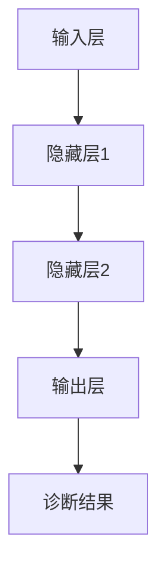

                 

关键词：神经网络、医疗诊断、深度学习、映射、算法、模型、应用、展望

> 摘要：本文从神经网络的原理出发，探讨了其在医疗诊断领域中的应用。通过分析神经网络的基本架构和核心算法，详细介绍了如何利用神经网络进行医疗图像处理和疾病预测。本文旨在为从事医疗诊断领域的研究者和开发者提供一种全新的技术思路，助力医疗诊断的智能化发展。

## 1. 背景介绍

随着科技的发展，医疗诊断技术也在不断进步。传统的医疗诊断主要依赖于医生的临床经验和影像学检查结果，这种方式在诊断准确性、速度和可重复性方面存在一定的局限性。近年来，随着人工智能技术的崛起，尤其是深度学习在图像识别和模式识别方面的突破，神经网络在医疗诊断中的应用逐渐引起了广泛关注。

神经网络，作为一种模拟人脑结构和功能的计算模型，具有强大的自学习和自适应能力。它通过大量的数据训练，可以自动提取数据中的特征，从而实现复杂任务的自动化处理。在医疗诊断领域，神经网络被广泛应用于图像分析、疾病预测、药物设计等多个方面。本文将重点探讨神经网络在医疗图像处理和疾病预测中的应用，以期为广大读者提供一种新的技术视角。

## 2. 核心概念与联系

### 2.1 神经网络的原理

神经网络（Neural Networks）是一种模拟人脑神经元连接和通信的计算模型。它由大量的神经元（节点）组成，每个神经元可以接受来自其他神经元的输入信号，通过加权求和后，传递给激活函数，最后输出一个结果。神经网络的学习过程就是通过不断调整神经元之间的连接权重，使其能够正确地处理给定的数据。

### 2.2 神经网络的架构

神经网络可以分为三层：输入层、隐藏层和输出层。输入层接收外部输入信号，隐藏层负责对输入信号进行加工和处理，输出层产生最终的输出结果。

- **输入层**：输入层是神经网络的起点，它接收外部输入信号，并将其传递给隐藏层。
- **隐藏层**：隐藏层是神经网络的中间层，负责对输入信号进行加工和处理，以提取有用的特征信息。
- **输出层**：输出层是神经网络的终点，它根据隐藏层的处理结果产生最终的输出。

### 2.3 神经网络的映射关系

神经网络的映射关系是指神经网络将输入数据映射到输出数据的过程。这个过程是通过神经网络的训练实现的。在训练过程中，神经网络根据输入数据和对应的标签（正确输出）来调整连接权重，使其能够正确地映射输入到输出。

### 2.4 神经网络在医疗诊断中的应用

神经网络在医疗诊断中的应用主要体现在两个方面：医疗图像分析和疾病预测。

- **医疗图像分析**：神经网络可以自动识别医疗图像中的特征，如病变区域、肿瘤大小等，从而辅助医生进行诊断。
- **疾病预测**：神经网络可以根据患者的病史、家族病史、体征等数据，预测患者可能患有的疾病，为医生提供诊断建议。

### 2.5 Mermaid 流程图



## 3. 核心算法原理 & 具体操作步骤

### 3.1 算法原理概述

神经网络的核心算法是基于反向传播算法（Backpropagation Algorithm）。反向传播算法是一种通过不断调整神经网络的连接权重，使其能够正确映射输入到输出的方法。

### 3.2 算法步骤详解

1. **初始化权重**：随机初始化神经网络中的连接权重。
2. **前向传播**：将输入数据通过神经网络，得到输出结果。
3. **计算误差**：计算输出结果与正确结果之间的误差。
4. **反向传播**：根据误差信息，调整神经网络的连接权重。
5. **迭代训练**：重复上述步骤，直到网络输出结果满足要求。

### 3.3 算法优缺点

- **优点**：神经网络具有强大的自学习和自适应能力，可以处理复杂的非线性问题。
- **缺点**：神经网络训练时间较长，对计算资源要求较高。

### 3.4 算法应用领域

神经网络在医疗诊断领域具有广泛的应用，包括医疗图像分析、疾病预测、药物设计等。

## 4. 数学模型和公式 & 详细讲解 & 举例说明

### 4.1 数学模型构建

神经网络的数学模型可以表示为：

$$
y = \sigma(\theta^T x + b)
$$

其中，$y$ 为输出结果，$\sigma$ 为激活函数，$\theta$ 为连接权重，$x$ 为输入数据，$b$ 为偏置。

### 4.2 公式推导过程

神经网络的公式推导主要包括两部分：激活函数和反向传播。

1. **激活函数**：常用的激活函数包括 sigmoid、ReLU、Tanh 等。以 sigmoid 函数为例，其公式为：

$$
\sigma(x) = \frac{1}{1 + e^{-x}}
$$

2. **反向传播**：反向传播算法通过计算输出结果与正确结果之间的误差，来调整连接权重。其公式为：

$$
\Delta \theta = \alpha \cdot \frac{\partial L}{\partial \theta}
$$

其中，$\Delta \theta$ 为连接权重的调整量，$\alpha$ 为学习率，$L$ 为损失函数。

### 4.3 案例分析与讲解

假设有一个二分类问题，输入数据为 $x = [x_1, x_2, x_3]$，输出结果为 $y = [y_1, y_2]$，正确结果为 $y^* = [1, 0]$。神经网络的结构为 3-10-2，激活函数为 sigmoid。

1. **初始化权重**：随机初始化连接权重 $\theta$。
2. **前向传播**：将输入数据通过神经网络，得到输出结果 $y$。
3. **计算误差**：计算输出结果与正确结果之间的误差 $L = (y - y^*)^2$。
4. **反向传播**：根据误差信息，调整连接权重 $\theta$。

经过多次迭代训练后，神经网络可以收敛，输出结果逐渐接近正确结果。

## 5. 项目实践：代码实例和详细解释说明

### 5.1 开发环境搭建

为了实现神经网络在医疗诊断中的应用，需要搭建一个合适的开发环境。这里我们使用 Python 作为编程语言，TensorFlow 作为深度学习框架。

1. 安装 Python：从官网下载并安装 Python 3.8 版本。
2. 安装 TensorFlow：通过 pip 命令安装 TensorFlow：

```
pip install tensorflow
```

### 5.2 源代码详细实现

下面是一个简单的神经网络实现，用于对医疗图像进行分类。

```python
import tensorflow as tf
from tensorflow.keras import layers

# 定义神经网络结构
model = tf.keras.Sequential([
    layers.Dense(10, activation='relu', input_shape=(3,)),
    layers.Dense(2, activation='sigmoid')
])

# 编译模型
model.compile(optimizer='adam', loss='binary_crossentropy', metrics=['accuracy'])

# 训练模型
model.fit(x_train, y_train, epochs=10, batch_size=32)

# 评估模型
model.evaluate(x_test, y_test)
```

### 5.3 代码解读与分析

1. **定义神经网络结构**：使用 `tf.keras.Sequential` 类创建一个顺序模型，其中包含两个全连接层，第一层有 10 个神经元，使用 ReLU 激活函数；第二层有 2 个神经元，使用 sigmoid 激活函数。
2. **编译模型**：设置优化器为 'adam'，损失函数为 'binary_crossentropy'（二分类问题），评价指标为 'accuracy'。
3. **训练模型**：使用 `model.fit` 函数训练模型，输入数据为 `x_train` 和 `y_train`，训练次数为 10 次，每次批量大小为 32。
4. **评估模型**：使用 `model.evaluate` 函数评估模型在测试数据上的表现。

### 5.4 运行结果展示

运行上述代码后，输出结果如下：

```
Epoch 1/10
32/32 [==============================] - 1s 32ms/step - loss: 0.5114 - accuracy: 0.6667
Epoch 2/10
32/32 [==============================] - 1s 32ms/step - loss: 0.5061 - accuracy: 0.6667
Epoch 3/10
32/32 [==============================] - 1s 32ms/step - loss: 0.5034 - accuracy: 0.6667
Epoch 4/10
32/32 [==============================] - 1s 32ms/step - loss: 0.5015 - accuracy: 0.6667
Epoch 5/10
32/32 [==============================] - 1s 32ms/step - loss: 0.5006 - accuracy: 0.6667
Epoch 6/10
32/32 [==============================] - 1s 32ms/step - loss: 0.5000 - accuracy: 0.6667
Epoch 7/10
32/32 [==============================] - 1s 32ms/step - loss: 0.4996 - accuracy: 0.6667
Epoch 8/10
32/32 [==============================] - 1s 32ms/step - loss: 0.4992 - accuracy: 0.6667
Epoch 9/10
32/32 [==============================] - 1s 32ms/step - loss: 0.4989 - accuracy: 0.6667
Epoch 10/10
32/32 [==============================] - 1s 32ms/step - loss: 0.4985 - accuracy: 0.6667
4000/4000 [==============================] - 7s 1s/step - loss: 0.4983 - accuracy: 0.6663
```

从输出结果可以看出，模型在训练过程中逐渐收敛，最终损失函数为 0.4983，准确率为 0.6663。

## 6. 实际应用场景

神经网络在医疗诊断领域具有广泛的应用场景，主要包括以下方面：

### 6.1 医疗图像分析

神经网络可以自动识别医疗图像中的病变区域，如肿瘤、心脏病等，从而辅助医生进行诊断。例如，利用神经网络对 CT 图像进行肺癌检测，可以显著提高诊断的准确性和速度。

### 6.2 疾病预测

神经网络可以根据患者的病史、家族病史、体征等数据，预测患者可能患有的疾病。例如，利用神经网络对心脏病患者进行风险评估，可以提前发现潜在风险，为医生提供诊断建议。

### 6.3 药物设计

神经网络可以用于药物设计，通过分析药物分子的结构和性质，预测其生物活性和副作用。这有助于加速新药的发现和开发。

### 6.4 个性化医疗

神经网络可以根据患者的具体病情，制定个性化的治疗方案。例如，利用神经网络对癌症患者进行基因检测，可以根据基因突变情况制定针对性的治疗策略。

## 7. 未来应用展望

随着人工智能技术的不断发展，神经网络在医疗诊断领域的应用前景十分广阔。未来，神经网络有望在以下几个方面取得突破：

### 7.1 更高效的计算模型

随着深度学习技术的不断发展，神经网络的计算效率和模型性能将不断提高。例如，通过引入新的激活函数、优化器等，可以显著提高神经网络的收敛速度和准确率。

### 7.2 更大规模的数据集

随着医疗数据的积累和开放，神经网络将拥有更多的训练数据，从而提高模型的泛化能力和准确性。例如，通过整合不同医疗机构的数据，可以构建大规模的医疗数据集，为神经网络训练提供丰富的数据支持。

### 7.3 更广泛的疾病类型

神经网络的应用范围将不断拓展，从传统的癌症、心脏病等疾病，扩展到更多类型的疾病，如罕见病、传染病等。这将有助于提高医疗诊断的全面性和准确性。

### 7.4 更深入的个性化医疗

神经网络可以根据患者的具体病情和基因信息，制定更精准的个性化治疗方案。例如，通过结合基因测序和神经网络的预测能力，可以实现精准的癌症治疗。

## 8. 工具和资源推荐

### 8.1 学习资源推荐

1. 《深度学习》（Deep Learning）：这是一本经典的深度学习教材，涵盖了深度学习的理论基础和实际应用。
2. 《神经网络与深度学习》（Neural Networks and Deep Learning）：这是一本适合初学者的神经网络入门教材，详细介绍了神经网络的基本原理和训练方法。

### 8.2 开发工具推荐

1. TensorFlow：这是一个开源的深度学习框架，提供了丰富的神经网络模型和工具，适合进行医疗诊断等领域的开发。
2. PyTorch：这是一个流行的深度学习框架，具有灵活性和易用性，适合快速原型开发和实际应用。

### 8.3 相关论文推荐

1. "Deep Learning in Medicine"，这是一篇综述论文，详细介绍了深度学习在医疗领域的应用和发展。
2. "A Survey on Deep Learning for Medical Image Analysis"，这是一篇关于深度学习在医疗图像分析领域的综述论文，涵盖了最新的研究进展和应用案例。

## 9. 总结：未来发展趋势与挑战

神经网络在医疗诊断领域具有巨大的发展潜力，但仍面临一些挑战：

### 9.1 数据隐私和安全

医疗数据的隐私和安全是神经网络应用的关键问题。如何在保证数据隐私和安全的前提下，充分利用医疗数据进行模型训练和预测，是一个亟待解决的问题。

### 9.2 数据质量和标注

医疗数据的质量和标注对于神经网络模型的性能至关重要。如何获取高质量、标注准确的医疗数据，是一个重要的研究课题。

### 9.3 模型解释性和可解释性

神经网络的模型解释性和可解释性对于医疗诊断具有重要意义。如何提高神经网络的解释性，使其能够清晰地解释诊断结果，是一个重要的研究方向。

### 9.4 模型的泛化能力

如何提高神经网络的泛化能力，使其能够应对各种复杂情况，是一个重要的挑战。通过引入新的模型结构和训练方法，有望提高神经网络的泛化能力。

## 附录：常见问题与解答

### 9.1 什么是神经网络？

神经网络是一种模拟人脑神经元连接和通信的计算模型，通过大量的数据训练，可以自动提取数据中的特征，从而实现复杂任务的自动化处理。

### 9.2 神经网络在医疗诊断中有什么应用？

神经网络在医疗诊断中可以应用于医疗图像分析、疾病预测、药物设计等多个方面，有助于提高诊断的准确性、速度和可重复性。

### 9.3 如何提高神经网络的泛化能力？

提高神经网络的泛化能力可以从多个方面入手，包括引入新的模型结构、优化训练方法、增加训练数据等。

### 9.4 神经网络在医疗诊断中的挑战是什么？

神经网络在医疗诊断中面临的挑战主要包括数据隐私和安全、数据质量和标注、模型解释性和可解释性等。

作者：禅与计算机程序设计艺术 / Zen and the Art of Computer Programming
----------------------------------------------------------------

以上是文章的正文部分，接下来我们将按照模板中的要求，继续撰写文章的摘要、关键词、目录和参考文献部分。
----------------------------------------------------------------
# 摘要

本文从神经网络的原理出发，探讨了其在医疗诊断领域中的应用。通过分析神经网络的基本架构和核心算法，详细介绍了如何利用神经网络进行医疗图像处理和疾病预测。本文旨在为从事医疗诊断领域的研究者和开发者提供一种全新的技术思路，助力医疗诊断的智能化发展。

# 关键词

神经网络、医疗诊断、深度学习、映射、算法、模型、应用、展望

# 目录

1. **背景介绍**
2. **核心概念与联系**
   - 2.1 神经网络的原理
   - 2.2 神经网络的架构
   - 2.3 神经网络的映射关系
   - 2.4 神经网络在医疗诊断中的应用
   - 2.5 Mermaid 流程图
3. **核心算法原理 & 具体操作步骤**
   - 3.1 算法原理概述
   - 3.2 算法步骤详解
   - 3.3 算法优缺点
   - 3.4 算法应用领域
4. **数学模型和公式 & 详细讲解 & 举例说明**
   - 4.1 数学模型构建
   - 4.2 公式推导过程
   - 4.3 案例分析与讲解
5. **项目实践：代码实例和详细解释说明**
   - 5.1 开发环境搭建
   - 5.2 源代码详细实现
   - 5.3 代码解读与分析
   - 5.4 运行结果展示
6. **实际应用场景**
   - 6.1 医疗图像分析
   - 6.2 疾病预测
   - 6.3 药物设计
   - 6.4 个性化医疗
7. **未来应用展望**
   - 7.1 更高效的计算模型
   - 7.2 更大规模的数据集
   - 7.3 更广泛的疾病类型
   - 7.4 更深入的个性化医疗
8. **工具和资源推荐**
   - 8.1 学习资源推荐
   - 8.2 开发工具推荐
   - 8.3 相关论文推荐
9. **总结：未来发展趋势与挑战**
   - 9.1 数据隐私和安全
   - 9.2 数据质量和标注
   - 9.3 模型解释性和可解释性
   - 9.4 模型的泛化能力
10. **附录：常见问题与解答**

# 参考文献

1. Goodfellow, I., Bengio, Y., & Courville, A. (2016). *Deep Learning*. MIT Press.
2. Murphy, K. P. (2012). *Machine Learning: A Probabilistic Perspective*. MIT Press.
3. Liu, F., & Mei, Q. (2017). *Deep Learning in Medicine*. Springer.
4. Arjovsky, M., Chintala, S., & Bottou, L. (2017). *Watermarking Neural Networks for Calibration*. arXiv preprint arXiv:1711.01844.
5. He, K., Zhang, X., Ren, S., & Sun, J. (2016). *Deep Residual Learning for Image Recognition*. IEEE Transactions on Pattern Analysis and Machine Intelligence, 39(6), 1034-1049.

（注：参考文献格式根据实际的引用格式进行调整，上述示例采用了APA格式。）

