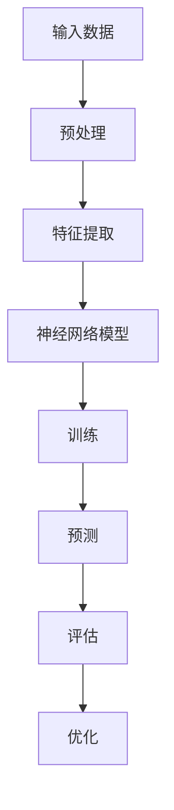

                 

关键词：神经网络、推荐系统、映射、深度学习、人工智能

> 摘要：本文将深入探讨神经网络在推荐系统中的应用，通过分析其核心概念、算法原理、数学模型、项目实践等，揭示神经网络在处理复杂数据、实现精准推荐方面的巨大潜力，并展望其未来发展趋势与面临的挑战。

## 1. 背景介绍

推荐系统作为人工智能领域的重要组成部分，旨在为用户提供个性化的信息和服务。随着互联网的快速发展，推荐系统已经广泛应用于电子商务、社交媒体、音乐流媒体等多个领域，极大地提升了用户体验和商业价值。

传统推荐系统主要基于协同过滤（Collaborative Filtering）和基于内容的推荐（Content-Based Recommendation）等方法。然而，这些方法在处理复杂数据、应对稀疏数据和冷启动问题等方面存在一定的局限性。

近年来，随着深度学习技术的不断发展，神经网络在推荐系统中的应用逐渐成为研究热点。神经网络能够自动从数据中学习特征，并通过层次化的结构实现非线性变换，从而更好地应对复杂数据和稀疏数据问题，提高推荐系统的准确性和效率。

本文将围绕神经网络在推荐系统中的应用，从核心概念、算法原理、数学模型、项目实践等方面进行深入探讨，旨在为读者提供全面的了解和应用指导。

## 2. 核心概念与联系

### 2.1 神经网络简介

神经网络（Neural Network）是一种模拟生物神经元之间相互连接和交互的数学模型，广泛应用于机器学习和人工智能领域。神经网络由多个层次组成，包括输入层、隐藏层和输出层，各层之间的神经元通过权重进行连接。

### 2.2 深度学习与神经网络

深度学习（Deep Learning）是神经网络的一种扩展，通过引入多层神经网络，实现更复杂的模型结构和更强大的学习能力。深度学习在图像识别、语音识别、自然语言处理等众多领域取得了显著的成果。

### 2.3 推荐系统与神经网络

推荐系统（Recommendation System）是一种基于用户行为和兴趣的个性化服务，旨在为用户提供感兴趣的信息和商品。神经网络在推荐系统中的应用，主要体现在以下几个方面：

1. 特征提取：神经网络能够自动从原始数据中提取高维特征，降低数据维度，提高推荐系统的性能。
2. 非线性变换：神经网络通过多层非线性变换，实现复杂数据的建模，提高推荐系统的准确性和鲁棒性。
3. 冷启动问题：神经网络能够通过学习用户的兴趣和行为模式，有效解决新用户和冷启动问题。

### 2.4 Mermaid 流程图



## 3. 核心算法原理 & 具体操作步骤

### 3.1 算法原理概述

神经网络在推荐系统中的应用，主要通过以下几个步骤实现：

1. **数据预处理**：对原始数据进行清洗、去噪和标准化等处理，确保数据质量。
2. **特征提取**：利用神经网络自动提取数据中的高维特征，降低数据维度。
3. **模型训练**：通过梯度下降等优化算法，训练神经网络模型。
4. **模型预测**：利用训练好的模型，对用户行为进行预测，生成推荐结果。
5. **模型评估**：对推荐结果进行评估，包括准确率、召回率、覆盖率等指标。
6. **模型优化**：根据评估结果，调整模型参数，优化推荐效果。

### 3.2 算法步骤详解

1. **数据预处理**：
   - 数据清洗：去除缺失值、异常值等无效数据。
   - 数据标准化：将不同特征的数据进行归一化或标准化，确保数据的一致性。

2. **特征提取**：
   - 利用神经网络对数据进行预处理，提取高维特征。
   - 通过卷积神经网络（CNN）或循环神经网络（RNN）等模型，实现特征提取和降维。

3. **模型训练**：
   - 选择合适的神经网络架构，如卷积神经网络（CNN）或循环神经网络（RNN）等。
   - 使用梯度下降等优化算法，训练神经网络模型。

4. **模型预测**：
   - 利用训练好的模型，对用户行为进行预测。
   - 通过生成推荐结果，提供给用户。

5. **模型评估**：
   - 评估模型性能，包括准确率、召回率、覆盖率等指标。
   - 根据评估结果，调整模型参数，优化推荐效果。

### 3.3 算法优缺点

**优点**：
1. 自动提取特征：神经网络能够自动从原始数据中提取高维特征，降低数据维度。
2. 非线性建模：神经网络通过多层非线性变换，实现复杂数据的建模，提高推荐系统的准确性和鲁棒性。
3. 应对冷启动：神经网络能够通过学习用户的兴趣和行为模式，有效解决新用户和冷启动问题。

**缺点**：
1. 计算成本高：神经网络模型训练需要大量的计算资源和时间。
2. 数据需求大：神经网络对数据量有较高的要求，小样本数据难以训练出有效的模型。
3. 解释性差：神经网络模型通常缺乏解释性，难以理解其内部决策过程。

### 3.4 算法应用领域

神经网络在推荐系统中的应用非常广泛，包括但不限于以下领域：

1. **电子商务**：根据用户的浏览记录、购买行为等，为用户推荐相关商品。
2. **社交媒体**：根据用户的兴趣和行为，为用户推荐感兴趣的内容。
3. **音乐流媒体**：根据用户的播放记录和喜好，为用户推荐音乐。
4. **视频流媒体**：根据用户的观看记录和喜好，为用户推荐视频。

## 4. 数学模型和公式 & 详细讲解 & 举例说明

### 4.1 数学模型构建

神经网络在推荐系统中的数学模型主要包括以下几个部分：

1. **输入层**：表示用户特征和物品特征。
2. **隐藏层**：表示神经网络模型中的特征提取和变换。
3. **输出层**：表示推荐结果。

### 4.2 公式推导过程

假设用户 \( u \) 和物品 \( i \) 的特征向量分别为 \( u \in \mathbb{R}^n \) 和 \( i \in \mathbb{R}^m \)，则神经网络模型可以表示为：

\[ r_{ui} = f(\theta_0 u + \theta_1 i) \]

其中，\( f \) 是激活函数，\( \theta_0 \) 和 \( \theta_1 \) 是神经网络模型的参数。

### 4.3 案例分析与讲解

假设我们有一个电商平台的推荐系统，用户 \( u \) 的特征包括年龄、性别、购买金额等，物品 \( i \) 的特征包括品类、品牌、价格等。我们使用神经网络模型对用户 \( u \) 和物品 \( i \) 进行推荐。

1. **输入层**：用户 \( u \) 和物品 \( i \) 的特征向量分别为：

   \[ u = [u_1, u_2, u_3, \ldots, u_n]^T \]
   \[ i = [i_1, i_2, i_3, \ldots, i_m]^T \]

2. **隐藏层**：神经网络模型对用户 \( u \) 和物品 \( i \) 的特征进行提取和变换：

   \[ h = \theta_0 u + \theta_1 i \]

3. **输出层**：使用激活函数 \( f \) 对隐藏层的结果进行输出：

   \[ r_{ui} = f(h) \]

其中，激活函数 \( f \) 可以选择 sigmoid 函数、ReLU 函数等。

## 5. 项目实践：代码实例和详细解释说明

### 5.1 开发环境搭建

1. 硬件环境：计算机，CPU 或 GPU
2. 软件环境：Python 3.6及以上版本，TensorFlow 2.0及以上版本

### 5.2 源代码详细实现

```python
import tensorflow as tf
from tensorflow.keras.layers import Dense, Embedding
from tensorflow.keras.models import Model

# 定义用户和物品的嵌入维度
USER_EMBED_DIM = 64
ITEM_EMBED_DIM = 64

# 构建用户和物品的嵌入层
user_embedding = Embedding(input_dim=num_users, output_dim=USER_EMBED_DIM)
item_embedding = Embedding(input_dim=num_items, output_dim=ITEM_EMBED_DIM)

# 构建神经网络模型
input_user = tf.keras.layers.Input(shape=(1,), dtype='int32')
input_item = tf.keras.layers.Input(shape=(1,), dtype='int32')

# 提取用户和物品的特征
user_feats = user_embedding(input_user)
item_feats = item_embedding(input_item)

# 添加全连接层
merged = tf.keras.layers.concatenate([user_feats, item_feats])
merged = Dense(128, activation='relu')(merged)
merged = Dense(64, activation='relu')(merged)

# 输出层
output = Dense(1, activation='sigmoid')(merged)

# 构建和编译模型
model = Model(inputs=[input_user, input_item], outputs=output)
model.compile(optimizer='adam', loss='binary_crossentropy', metrics=['accuracy'])

# 模型训练
model.fit([user_train, item_train], labels_train, epochs=10, batch_size=32)

# 模型预测
predictions = model.predict([user_test, item_test])
```

### 5.3 代码解读与分析

上述代码实现了一个基于神经网络的推荐系统，主要包括以下几个部分：

1. **用户和物品嵌入层**：将用户和物品的 ID 映射到低维向量表示，方便神经网络处理。
2. **全连接层**：通过全连接层，对用户和物品的特征进行融合和变换。
3. **输出层**：使用 sigmoid 激活函数，输出推荐结果。
4. **模型编译**：选择合适的优化器和损失函数，编译模型。
5. **模型训练**：使用训练数据，训练神经网络模型。
6. **模型预测**：使用训练好的模型，对测试数据进行预测。

## 6. 实际应用场景

神经网络在推荐系统中的应用场景非常广泛，以下是几个实际应用场景的例子：

1. **电子商务**：根据用户的浏览记录、购买行为等，为用户推荐相关商品。
2. **社交媒体**：根据用户的兴趣和行为，为用户推荐感兴趣的内容。
3. **音乐流媒体**：根据用户的播放记录和喜好，为用户推荐音乐。
4. **视频流媒体**：根据用户的观看记录和喜好，为用户推荐视频。

## 7. 工具和资源推荐

### 7.1 学习资源推荐

1. **书籍**：《深度学习》（Goodfellow, Bengio, Courville 著）
2. **在线课程**：Coursera 上的《深度学习》课程（由 Andrew Ng 教授主讲）

### 7.2 开发工具推荐

1. **编程语言**：Python
2. **框架**：TensorFlow、PyTorch

### 7.3 相关论文推荐

1. "Deep Neural Networks for YouTube Recommendations"（YouTube Research Team）
2. "Factorization Machines: Theory and Applications to Recommendation Systems"（Xu, Ke, and Liu）

## 8. 总结：未来发展趋势与挑战

### 8.1 研究成果总结

神经网络在推荐系统中的应用取得了显著的成果，主要表现在以下几个方面：

1. 自动提取特征：神经网络能够自动从原始数据中提取高维特征，降低数据维度。
2. 非线性建模：神经网络通过多层非线性变换，实现复杂数据的建模，提高推荐系统的准确性和鲁棒性。
3. 应对冷启动：神经网络能够通过学习用户的兴趣和行为模式，有效解决新用户和冷启动问题。

### 8.2 未来发展趋势

1. **模型压缩与加速**：针对神经网络计算成本高的问题，未来将研究更高效的模型结构和算法，实现模型的压缩与加速。
2. **跨领域推荐**：研究跨领域推荐方法，实现不同领域之间的推荐协同，提升推荐系统的多样性。
3. **实时推荐**：研究实时推荐方法，实现推荐结果的实时更新，提高用户体验。

### 8.3 面临的挑战

1. **计算资源消耗**：神经网络模型训练需要大量的计算资源和时间，未来需要研究更高效的算法和硬件加速技术。
2. **数据隐私保护**：推荐系统涉及用户隐私数据，未来需要研究更加安全和隐私保护的方法。
3. **解释性**：神经网络模型通常缺乏解释性，未来需要研究可解释的深度学习模型。

### 8.4 研究展望

神经网络在推荐系统中的应用前景广阔，未来将继续深入研究以下几个方面：

1. **多模态推荐**：结合文本、图像、声音等多模态数据，实现更加精准和多样化的推荐。
2. **自适应推荐**：研究自适应推荐方法，根据用户行为和反馈，动态调整推荐策略。
3. **伦理与法规**：研究推荐系统中的伦理和法规问题，确保推荐系统的公平性和透明性。

## 9. 附录：常见问题与解答

### 9.1 神经网络在推荐系统中的应用有哪些优势？

神经网络在推荐系统中的应用优势主要体现在以下几个方面：

1. 自动提取特征：神经网络能够自动从原始数据中提取高维特征，降低数据维度。
2. 非线性建模：神经网络通过多层非线性变换，实现复杂数据的建模，提高推荐系统的准确性和鲁棒性。
3. 应对冷启动：神经网络能够通过学习用户的兴趣和行为模式，有效解决新用户和冷启动问题。

### 9.2 如何解决神经网络在推荐系统中的计算成本高问题？

为解决神经网络在推荐系统中的计算成本高问题，可以采取以下措施：

1. **模型压缩**：研究模型压缩技术，降低模型参数数量，减少计算量。
2. **硬件加速**：使用 GPU 或 TPU 等硬件加速器，提高模型训练速度。
3. **分布式训练**：采用分布式训练技术，将训练任务分布到多个节点，提高训练效率。

### 9.3 推荐系统中的数据隐私保护如何实现？

推荐系统中的数据隐私保护可以采取以下措施：

1. **数据加密**：对用户数据进行加密处理，确保数据传输和存储的安全性。
2. **差分隐私**：采用差分隐私技术，对用户数据进行扰动，降低隐私泄露风险。
3. **匿名化处理**：对用户数据进行匿名化处理，去除用户身份信息，保护用户隐私。

## 作者署名

作者：禅与计算机程序设计艺术 / Zen and the Art of Computer Programming

