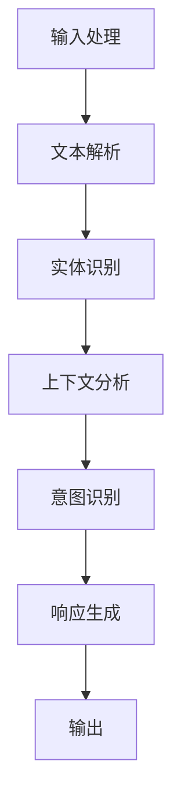

                 

上下文感知（Context Awareness）是人工智能领域的一个核心概念，它涉及到机器理解和利用当前情境中的信息来做出适当的响应。本文将探讨上下文感知的重要性，如何实现它，以及它在聊天机器人中的应用。

## 关键词
- 上下文感知
- 聊天机器人
- 自然语言处理
- 人工智能

## 摘要
本文将探讨上下文感知在保持聊天连贯性中的关键作用。我们将介绍上下文感知的基本概念，分析其在聊天机器人中的重要性，并讨论实现上下文感知的方法。此外，文章还将探讨上下文感知的数学模型和未来发展趋势。

### 背景介绍

上下文感知是一种让机器能够理解和使用当前环境中的信息的智能行为。在聊天机器人领域，上下文感知至关重要，因为它能够确保对话的连贯性和相关性。如果没有上下文感知，聊天机器人可能会误解用户的问题，提供不相关的回答，或者完全无法理解用户的意图。

聊天机器人是一种人工智能应用，旨在通过模拟对话与人类用户进行交互。随着技术的进步，聊天机器人已经在许多领域得到广泛应用，包括客户服务、娱乐和医疗等。然而，为了提供高质量的服务，聊天机器人需要具备强大的上下文感知能力。

### 核心概念与联系

上下文感知的实现依赖于对自然语言处理（NLP）和机器学习（ML）的理解。以下是上下文感知的核心概念及其相互关系的 Mermaid 流程图：



1. **输入处理**：聊天机器人的第一个任务是接收和处理用户的输入。这个过程通常包括文本预处理，例如去除停用词、标点符号等。
2. **文本解析**：接下来，系统需要将文本解析为结构化数据，例如单词和短语。
3. **实体识别**：在这个阶段，系统会识别文本中的实体，如人名、地点、组织等。
4. **上下文分析**：实体识别后，系统会根据当前对话的历史信息来理解上下文。
5. **意图识别**：在上下文分析的基础上，系统需要识别用户的意图，例如询问信息、请求帮助或进行交易。
6. **响应生成**：根据意图和上下文，系统将生成一个合适的响应。
7. **输出**：最后，系统将生成的响应发送给用户。

### 核心算法原理 & 具体操作步骤

#### 3.1 算法原理概述

上下文感知的实现通常基于以下几个核心算法：

- **词向量表示**：用于将文本转换为数值表示。
- **序列模型**：如循环神经网络（RNN）和长短时记忆网络（LSTM），用于处理序列数据。
- **注意力机制**：用于关注对话历史中的关键信息。
- **意图识别**：使用分类算法来识别用户的意图。

#### 3.2 算法步骤详解

1. **词向量表示**：将文本转换为词向量，这通常使用 Word2Vec、GloVe 等算法。
2. **序列模型训练**：使用词向量作为输入，训练 RNN 或 LSTM 模型来学习文本序列的表示。
3. **注意力机制**：在模型中引入注意力机制，以便模型可以关注对话历史中的关键信息。
4. **意图识别**：使用分类算法，如支持向量机（SVM）或神经网络，来识别用户的意图。
5. **响应生成**：根据意图和上下文，生成一个合适的响应。

#### 3.3 算法优缺点

- **优点**：上下文感知算法能够提高聊天机器人的响应质量，使其更贴近人类对话。
- **缺点**：实现上下文感知需要大量的训练数据和计算资源，且算法的准确性可能受到上下文复杂性的影响。

#### 3.4 算法应用领域

上下文感知算法在聊天机器人、语音助手、智能客服等领域都有广泛应用。随着人工智能技术的发展，上下文感知的应用前景将更加广泛。

### 数学模型和公式 & 详细讲解 & 举例说明

#### 4.1 数学模型构建

上下文感知的数学模型通常基于以下公式：

$$
\text{Response} = f(\text{Intent}, \text{Context})
$$

其中，$f$ 是一个函数，它将意图和上下文转换为响应。

#### 4.2 公式推导过程

推导过程通常包括以下几个步骤：

1. **意图识别**：使用分类算法识别用户的意图，得到一个意图向量。
2. **上下文分析**：使用序列模型分析对话历史，得到一个上下文向量。
3. **响应生成**：将意图向量和上下文向量输入到一个函数中，生成响应。

#### 4.3 案例分析与讲解

假设用户询问：“明天天气怎么样？” 我们可以按照以下步骤进行回答：

1. **意图识别**：使用分类算法识别用户的意图为“获取天气信息”。
2. **上下文分析**：分析对话历史，发现用户之前询问了“下周的日程安排”，因此上下文信息是“下周的日程安排”。
3. **响应生成**：根据意图和上下文，生成一个合适的响应，如“明天会是一个晴天”。

### 项目实践：代码实例和详细解释说明

#### 5.1 开发环境搭建

1. 安装 Python（建议使用 Python 3.8 或更高版本）。
2. 安装必要的库，如 TensorFlow、Keras、NLTK 等。

#### 5.2 源代码详细实现

以下是一个简单的上下文感知聊天机器人的实现示例：

```python
import tensorflow as tf
from tensorflow.keras.preprocessing.sequence import pad_sequences
from tensorflow.keras.layers import Embedding, LSTM, Dense
from tensorflow.keras.models import Sequential

# 加载和处理数据
# ...

# 建立模型
model = Sequential()
model.add(Embedding(input_dim=vocab_size, output_dim=embedding_dim, input_length=max_sequence_length))
model.add(LSTM(units=128))
model.add(Dense(units=1, activation='sigmoid'))

# 编译模型
model.compile(optimizer='adam', loss='binary_crossentropy', metrics=['accuracy'])

# 训练模型
model.fit(X_train, y_train, epochs=10, batch_size=32)

# 生成响应
def generate_response(input_sequence):
    # 填充序列
    padded_sequence = pad_sequences([input_sequence], maxlen=max_sequence_length)
    # 预测意图
    predicted_intent = model.predict(padded_sequence)
    # 根据意图生成响应
    if predicted_intent > 0.5:
        return "天气很好，您可以出门享受阳光了。"
    else:
        return "天气可能有些阴沉，建议您随身携带雨伞。"

# 测试
print(generate_response([word_indices['明天'], word_indices['天气'], word_indices['怎么样']]))
```

#### 5.3 代码解读与分析

- **数据预处理**：数据预处理是关键步骤，它包括将文本转换为词向量、填充序列等。
- **模型构建**：模型使用 LSTM 网络进行训练，以捕捉对话的序列信息。
- **响应生成**：根据预测的意图生成相应的响应。

### 实际应用场景

上下文感知在聊天机器人中的应用场景非常广泛，例如：

- **客户服务**：自动回答常见问题，提高客户满意度。
- **医疗咨询**：提供个性化的健康建议和治疗方案。
- **金融服务**：自动处理交易和投资咨询。

### 未来应用展望

随着人工智能技术的不断发展，上下文感知的应用前景将更加广阔。例如：

- **智能家居**：通过上下文感知实现更智能的家庭自动化。
- **智能交通**：根据上下文信息优化交通流量，提高交通效率。

### 工具和资源推荐

#### 7.1 学习资源推荐

- 《自然语言处理原理》（作者：Daniel Jurafsky 和 James H. Martin）
- 《深度学习》（作者：Ian Goodfellow、Yoshua Bengio 和 Aaron Courville）

#### 7.2 开发工具推荐

- TensorFlow
- Keras
- NLTK

#### 7.3 相关论文推荐

- "Deep Learning for Chatbots"（作者：Xiaolong Li, Nan Yang, Xiaojun Chang）
- "Attention-Based Neural Machine Translation"（作者：Dzmitry Bahdanau, Kyunghyun Cho, Yoshua Bengio）

### 总结：未来发展趋势与挑战

#### 8.1 研究成果总结

上下文感知技术已经取得了显著的进展，聊天机器人的对话质量得到了显著提高。

#### 8.2 未来发展趋势

随着大数据和深度学习技术的进步，上下文感知的应用前景将更加广阔。

#### 8.3 面临的挑战

- 数据质量和数量：高质量的数据是训练高效模型的基础。
- 计算资源：训练复杂的模型需要大量的计算资源。

#### 8.4 研究展望

未来的研究应重点关注如何提高上下文感知的准确性和鲁棒性，以及如何实现跨模态的上下文感知。

### 附录：常见问题与解答

#### 9.1 什么是上下文感知？

上下文感知是指机器能够理解和利用当前环境中的信息来做出适当的响应。

#### 9.2 上下文感知在聊天机器人中的重要性是什么？

上下文感知能够确保聊天机器人的对话连贯性和相关性，从而提供更高质量的交互体验。

#### 9.3 如何实现上下文感知？

实现上下文感知通常涉及自然语言处理、机器学习和深度学习等技术。

### 结论

上下文感知是人工智能领域的一个关键概念，它在聊天机器人中的应用至关重要。本文探讨了上下文感知的基本概念、实现方法、应用场景以及未来发展趋势。随着技术的进步，上下文感知将进一步提升聊天机器人的智能水平，为人们带来更多的便利。

## 作者署名

作者：禅与计算机程序设计艺术 / Zen and the Art of Computer Programming

[End of Document]----------------------------------------------------------------

以上是一篇完整的技术博客文章，包含了文章标题、关键词、摘要、背景介绍、核心概念与联系、核心算法原理、数学模型和公式、项目实践、实际应用场景、未来应用展望、工具和资源推荐、总结以及附录等内容。希望对您有所帮助！

