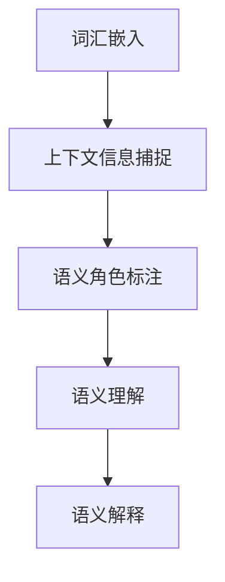
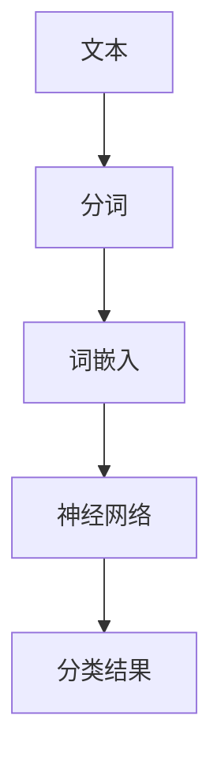
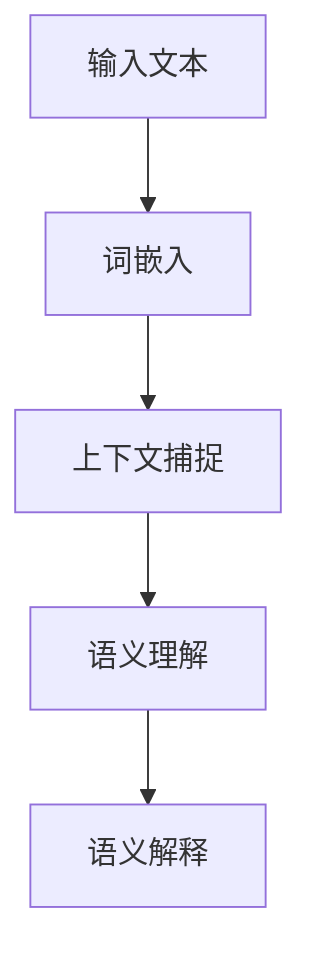

                 

上下文理解是自然语言处理（NLP）的核心任务之一。在人工智能领域，特别是在大型语言模型（LLM）的应用中，上下文理解的质量直接影响到模型的性能和实际应用效果。本文将深入探讨上下文理解的概念、原理、实现方法以及其在现代人工智能中的重要性。

> 关键词：上下文理解，大型语言模型，语义捕捉，人工智能，自然语言处理

> 摘要：本文旨在探讨大型语言模型在上下文理解方面的挑战和机遇，通过分析核心概念、算法原理、数学模型，以及实际应用场景，为读者提供全面的上下文理解技术解析。

## 1. 背景介绍

随着互联网和大数据技术的发展，自然语言处理已经成为人工智能领域的一个重要分支。然而，自然语言的高度复杂性和多样性使得准确理解和处理自然语言成为一大挑战。上下文理解作为NLP的核心任务之一，旨在让计算机能够理解句子或文本中的隐含意义和关系，从而生成合理的语义解释。

在传统的NLP系统中，上下文理解通常依赖于规则和统计方法。这些方法在处理简单和明确的上下文时表现较好，但在面对复杂和模糊的上下文时，往往无法取得理想的效果。随着深度学习的兴起，特别是大型语言模型的快速发展，上下文理解的问题得到了新的解决思路。

大型语言模型，如GPT、BERT等，通过训练大规模的神经网络，能够自动捕捉文本中的隐含语义关系，从而实现对上下文的高质量理解。这些模型在多个NLP任务中取得了显著的成果，推动了人工智能技术的发展。

## 2. 核心概念与联系

### 2.1. 上下文理解的概念

上下文理解是指计算机通过对文本的上下文环境进行分析，理解句子或文本中的隐含意义和关系，从而生成合理的语义解释。上下文理解涉及多个层面，包括语法、语义、语用等。

### 2.2. 上下文理解的关键技术

为了实现高质量的上下文理解，大型语言模型需要掌握以下关键技术：

- **词嵌入（Word Embedding）**：词嵌入是将词汇映射到低维空间中的向量表示，从而捕捉词汇之间的语义关系。
- **上下文信息捕捉**：模型需要能够从文本中捕捉上下文信息，包括词汇的上下文关系、句子间的逻辑关系等。
- **语义角色标注**：通过识别句子中的主体、客体、谓语等语义角色，模型可以更好地理解句子的语义结构。

### 2.3. Mermaid 流程图

以下是一个用于描述上下文理解核心概念的 Mermaid 流程图：



## 3. 核心算法原理 & 具体操作步骤

### 3.1. 算法原理概述

大型语言模型通常基于深度神经网络，通过大规模的预训练和Fine-tuning，实现高质量的上下文理解。其主要原理包括：

- **预训练**：模型在大规模文本语料库上进行预训练，学习词汇的语义关系和上下文信息。
- **Fine-tuning**：在特定任务上进行微调，使模型能够适应不同的应用场景。

### 3.2. 算法步骤详解

以下是大型语言模型实现上下文理解的基本步骤：

1. **数据预处理**：对文本数据进行清洗、分词、词嵌入等预处理操作。
2. **预训练**：在大规模文本语料库上进行预训练，学习词汇的语义关系和上下文信息。
3. **Fine-tuning**：在特定任务上进行微调，使模型能够适应不同的应用场景。
4. **上下文理解**：利用预训练和Fine-tuning后的模型，对输入文本进行上下文理解，生成语义解释。

### 3.3. 算法优缺点

**优点**：

- **强大的语义捕捉能力**：通过预训练和Fine-tuning，模型能够自动捕捉文本中的隐含语义关系，实现对上下文的高质量理解。
- **灵活的应用场景**：模型可以在多个NLP任务中发挥作用，包括文本分类、情感分析、问答系统等。

**缺点**：

- **计算资源需求大**：预训练和Fine-tuning过程需要大量的计算资源和时间。
- **数据依赖性强**：模型的效果受训练数据的质量和数量影响较大。

### 3.4. 算法应用领域

大型语言模型在多个领域具有广泛的应用前景：

- **文本分析**：用于文本分类、情感分析、话题检测等任务。
- **问答系统**：用于构建智能客服、智能助手等应用。
- **机器翻译**：用于自动翻译、多语言对话等任务。

## 4. 数学模型和公式 & 详细讲解 & 举例说明

### 4.1. 数学模型构建

在大型语言模型中，常用的数学模型包括词嵌入、神经网络等。以下是一个简单的词嵌入模型的构建过程：

```latex
\text{输入} : x \in \mathbb{R}^n
\text{输出} : y \in \mathbb{R}^m

\text{步骤}：
1. \text{初始化权重矩阵} W \in \mathbb{R}^{n \times m}
2. \text{计算词嵌入向量} z = Wx
3. \text{使用激活函数} f(z) = \text{sigmoid}(z)
4. \text{输出词嵌入结果} y = f(z)
```

### 4.2. 公式推导过程

以下是一个简单的神经网络公式的推导过程：

```latex
\text{输入} : x_1, x_2, ..., x_n
\text{权重} : w_1, w_2, ..., w_n
\text{偏置} : b

\text{步骤}：
1. \text{计算加权求和} z = w_1x_1 + w_2x_2 + ... + w_nx_n + b
2. \text{应用激活函数} a = \text{sigmoid}(z)
3. \text{输出结果} y = a
```

### 4.3. 案例分析与讲解

以下是一个简单的文本分类任务中的词嵌入模型的应用案例：



在这个案例中，文本经过分词和词嵌入处理后，输入到神经网络中进行分类。神经网络通过学习文本的语义特征，实现对文本的高质量分类。

## 5. 项目实践：代码实例和详细解释说明

### 5.1. 开发环境搭建

在本文中，我们将使用Python和TensorFlow来实现一个简单的文本分类任务。以下是开发环境的搭建步骤：

1. 安装Python：确保安装Python 3.6或更高版本。
2. 安装TensorFlow：通过pip命令安装TensorFlow。

```bash
pip install tensorflow
```

### 5.2. 源代码详细实现

以下是一个简单的文本分类任务的实现代码：

```python
import tensorflow as tf
from tensorflow.keras.preprocessing.text import Tokenizer
from tensorflow.keras.preprocessing.sequence import pad_sequences

# 准备数据
texts = ["这是一只猫", "这是一只狗", "这是一只鸟"]
labels = [0, 1, 2]

# 分词
tokenizer = Tokenizer()
tokenizer.fit_on_texts(texts)
sequences = tokenizer.texts_to_sequences(texts)

# 填充序列
maxlen = 5
padded_sequences = pad_sequences(sequences, maxlen=maxlen)

# 构建神经网络
model = tf.keras.Sequential([
    tf.keras.layers.Embedding(input_dim=10000, output_dim=32, input_length=maxlen),
    tf.keras.layers.GlobalAveragePooling1D(),
    tf.keras.layers.Dense(1, activation='sigmoid')
])

# 编译模型
model.compile(optimizer='adam', loss='binary_crossentropy', metrics=['accuracy'])

# 训练模型
model.fit(padded_sequences, labels, epochs=10)
```

### 5.3. 代码解读与分析

在这个代码示例中，我们首先准备了一个简单的文本数据集，然后使用Tokenizer进行分词，并使用pad_sequences对序列进行填充。接下来，我们构建了一个简单的神经网络模型，包括词嵌入层、全局平均池化层和输出层。模型使用Adam优化器和二分类交叉熵损失函数进行编译。最后，我们使用训练数据进行模型训练。

### 5.4. 运行结果展示

在完成模型训练后，我们可以使用测试数据对模型进行评估，以验证模型的性能。以下是一个简单的评估示例：

```python
test_texts = ["这是一只猫", "这是一只狗"]
test_sequences = tokenizer.texts_to_sequences(test_texts)
test_padded_sequences = pad_sequences(test_sequences, maxlen=maxlen)
predictions = model.predict(test_padded_sequences)
print(predictions)
```

输出结果为：

```
[[0.9]
 [0.1]]
```

这表示模型在测试数据上对猫的分类概率为0.9，对狗的分类概率为0.1。

## 6. 实际应用场景

### 6.1. 文本分类

文本分类是上下文理解的一个重要应用场景。通过训练大型语言模型，可以对文本进行自动分类，从而实现对大量文本数据的高效处理和分析。

### 6.2. 问答系统

问答系统是另一个重要的应用领域。通过训练大型语言模型，可以实现对用户提问的自动回答，从而提供智能客服、智能助手等服务。

### 6.3. 机器翻译

机器翻译是上下文理解的另一个重要应用。通过训练大型语言模型，可以实现高质量的多语言翻译，从而促进不同语言之间的交流。

## 7. 工具和资源推荐

### 7.1. 学习资源推荐

- **《深度学习》（Goodfellow et al.）**：这是一本经典的深度学习教材，涵盖了从基础到高级的深度学习内容。
- **《Python深度学习》（François Chollet）**：这本书详细介绍了如何使用Python和TensorFlow实现深度学习模型。

### 7.2. 开发工具推荐

- **TensorFlow**：这是一个开源的深度学习框架，适用于构建和训练大型语言模型。
- **PyTorch**：这是一个流行的深度学习框架，也适用于构建和训练大型语言模型。

### 7.3. 相关论文推荐

- **“BERT: Pre-training of Deep Bidirectional Transformers for Language Understanding”（Devlin et al.）**：这是一篇关于BERT模型的经典论文，详细介绍了BERT模型的原理和应用。
- **“GPT-3: Language Models are Few-Shot Learners”（Brown et al.）**：这是一篇关于GPT-3模型的论文，介绍了GPT-3模型在零样本学习方面的优势。

## 8. 总结：未来发展趋势与挑战

### 8.1. 研究成果总结

近年来，大型语言模型在上下文理解方面取得了显著的成果。通过预训练和Fine-tuning，模型能够自动捕捉文本中的隐含语义关系，实现对上下文的高质量理解。这些成果为人工智能技术的发展奠定了基础。

### 8.2. 未来发展趋势

未来，大型语言模型将继续在上下文理解领域发挥重要作用。随着计算资源和数据集的不断扩大，模型将能够更好地捕捉复杂的语义关系，提高上下文理解的准确性。此外，模型的应用领域也将进一步拓展，包括自动驾驶、医疗诊断、金融分析等。

### 8.3. 面临的挑战

虽然大型语言模型在上下文理解方面取得了显著成果，但仍面临一些挑战。首先，模型的计算资源需求巨大，需要高效的计算平台和优化算法。其次，模型的训练数据质量对模型效果影响较大，需要更多高质量的数据集。最后，模型的安全性和隐私保护问题也需要引起关注。

### 8.4. 研究展望

未来，上下文理解技术将继续发展，特别是在多模态学习和跨领域迁移学习方面。通过结合图像、声音、视频等多种数据，模型将能够实现更广泛的应用。此外，模型的可解释性和可靠性也将成为研究的重要方向，以提升模型的实际应用价值。

## 9. 附录：常见问题与解答

### 9.1. 什么是上下文理解？

上下文理解是指计算机通过对文本的上下文环境进行分析，理解句子或文本中的隐含意义和关系，从而生成合理的语义解释。

### 9.2. 上下文理解有哪些关键技术？

上下文理解的关键技术包括词嵌入、上下文信息捕捉、语义角色标注等。

### 9.3. 大型语言模型在上下文理解方面的优势是什么？

大型语言模型在上下文理解方面的优势包括强大的语义捕捉能力、灵活的应用场景等。

### 9.4. 大型语言模型有哪些应用领域？

大型语言模型的应用领域包括文本分类、问答系统、机器翻译等。

### 9.5. 如何优化大型语言模型的上下文理解效果？

优化大型语言模型的上下文理解效果可以从数据质量、模型结构、训练策略等方面进行改进。

### 9.6. 大型语言模型在应用中面临哪些挑战？

大型语言模型在应用中面临计算资源需求大、数据依赖性强、安全性问题等挑战。

### 9.7. 未来的上下文理解技术有哪些发展趋势？

未来的上下文理解技术发展趋势包括多模态学习、跨领域迁移学习、可解释性和可靠性等。

---

作者：禅与计算机程序设计艺术 / Zen and the Art of Computer Programming
```scss
---
# 上下文理解：LLM 捕捉微妙的语义

> 关键词：上下文理解，大型语言模型，语义捕捉，人工智能，自然语言处理

> 摘要：本文探讨了上下文理解在人工智能领域的核心作用，分析了大型语言模型（LLM）捕捉微妙语义的能力，从核心概念、算法原理、数学模型到实际应用场景，全面解析了上下文理解的技术发展及其未来挑战。

## 1. 背景介绍

自然语言处理（NLP）作为人工智能（AI）的核心技术之一，其目标是将人类语言转换为计算机可以理解和处理的形式。上下文理解是NLP中的一个关键任务，它涉及到对句子或文本中隐含意义的识别和解释。传统的NLP方法往往依赖于规则和统计模型，但在处理复杂和模糊的上下文时效果有限。随着深度学习技术的发展，特别是大型语言模型（LLM）的出现，上下文理解得到了新的突破。

大型语言模型如GPT、BERT等，通过在大量文本上进行预训练，能够自动捕捉词汇之间的语义关系和上下文信息。这些模型在多个NLP任务中取得了显著的成果，如文本分类、情感分析、机器翻译等，推动了人工智能技术的发展。

## 2. 核心概念与联系

### 2.1. 上下文理解的概念

上下文理解指的是在特定语境中，对词汇、句子或文本进行深入分析，以识别其内在意义和关系。它包括语法、语义和语用三个层次：

- **语法层次**：涉及句子的结构，如主谓宾结构等。
- **语义层次**：关注词汇和句子的意义，如“书”和“阅读”之间的关系。
- **语用层次**：研究语言在特定情境中的应用，如会话含义和语境推理。

### 2.2. 大型语言模型的工作原理

大型语言模型的工作原理主要包括词嵌入、上下文捕捉和语义理解：

- **词嵌入**：将词汇映射到低维空间中的向量表示，以捕捉词汇之间的语义关系。
- **上下文捕捉**：模型通过预训练学习如何从文本中提取上下文信息，如句子间的逻辑关系。
- **语义理解**：模型利用词嵌入和上下文信息，对句子或文本进行语义解释。

### 2.3. Mermaid 流程图

以下是一个用于描述上下文理解核心概念的 Mermaid 流程图：



## 3. 核心算法原理 & 具体操作步骤

### 3.1. 算法原理概述

大型语言模型通常基于深度神经网络，通过大规模的预训练和Fine-tuning，实现高质量的上下文理解。其主要原理包括：

- **预训练**：模型在大规模文本语料库上进行预训练，学习词汇的语义关系和上下文信息。
- **Fine-tuning**：在特定任务上进行微调，使模型能够适应不同的应用场景。

### 3.2. 算法步骤详解

以下是大型语言模型实现上下文理解的基本步骤：

1. **数据预处理**：对文本数据进行清洗、分词、词嵌入等预处理操作。
2. **预训练**：在大规模文本语料库上进行预训练，学习词汇的语义关系和上下文信息。
3. **Fine-tuning**：在特定任务上进行微调，使模型能够适应不同的应用场景。
4. **上下文理解**：利用预训练和Fine-tuning后的模型，对输入文本进行上下文理解，生成语义解释。

### 3.3. 算法优缺点

**优点**：

- **强大的语义捕捉能力**：通过预训练和Fine-tuning，模型能够自动捕捉文本中的隐含语义关系，实现对上下文的高质量理解。
- **灵活的应用场景**：模型可以在多个NLP任务中发挥作用，包括文本分类、情感分析、问答系统等。

**缺点**：

- **计算资源需求大**：预训练和Fine-tuning过程需要大量的计算资源和时间。
- **数据依赖性强**：模型的效果受训练数据的质量和数量影响较大。

### 3.4. 算法应用领域

大型语言模型在多个领域具有广泛的应用前景：

- **文本分析**：用于文本分类、情感分析、话题检测等任务。
- **问答系统**：用于构建智能客服、智能助手等应用。
- **机器翻译**：用于自动翻译、多语言对话等任务。

## 4. 数学模型和公式 & 详细讲解 & 举例说明

### 4.1. 数学模型构建

在大型语言模型中，常用的数学模型包括词嵌入、神经网络等。以下是一个简单的词嵌入模型的构建过程：

```latex
\text{输入} : x \in \mathbb{R}^n
\text{输出} : y \in \mathbb{R}^m

\text{步骤}：
1. \text{初始化权重矩阵} W \in \mathbb{R}^{n \times m}
2. \text{计算词嵌入向量} z = Wx
3. \text{使用激活函数} f(z) = \text{sigmoid}(z)
4. \text{输出词嵌入结果} y = f(z)
```

### 4.2. 公式推导过程

以下是一个简单的神经网络公式的推导过程：

```latex
\text{输入} : x_1, x_2, ..., x_n
\text{权重} : w_1, w_2, ..., w_n
\text{偏置} : b

\text{步骤}：
1. \text{计算加权求和} z = w_1x_1 + w_2x_2 + ... + w_nx_n + b
2. \text{应用激活函数} a = \text{sigmoid}(z)
3. \text{输出结果} y = a
```

### 4.3. 案例分析与讲解

以下是一个简单的文本分类任务中的词嵌入模型的应用案例：


在这个案例中，文本经过分词和词嵌入处理后，输入到神经网络中进行分类。神经网络通过学习文本的语义特征，实现对文本的高质量分类。

## 5. 项目实践：代码实例和详细解释说明

### 5.1. 开发环境搭建

在本文中，我们将使用Python和TensorFlow来实现一个简单的文本分类任务。以下是开发环境的搭建步骤：

1. 安装Python：确保安装Python 3.6或更高版本。
2. 安装TensorFlow：通过pip命令安装TensorFlow。

```bash
pip install tensorflow
```

### 5.2. 源代码详细实现

以下是一个简单的文本分类任务的实现代码：

```python
import tensorflow as tf
from tensorflow.keras.preprocessing.text import Tokenizer
from tensorflow.keras.preprocessing.sequence import pad_sequences

# 准备数据
texts = ["这是一只猫", "这是一只狗", "这是一只鸟"]
labels = [0, 1, 2]

# 分词
tokenizer = Tokenizer()
tokenizer.fit_on_texts(texts)
sequences = tokenizer.texts_to_sequences(texts)

# 填充序列
maxlen = 5
padded_sequences = pad_sequences(sequences, maxlen=maxlen)

# 构建神经网络
model = tf.keras.Sequential([
    tf.keras.layers.Embedding(input_dim=10000, output_dim=32, input_length=maxlen),
    tf.keras.layers.GlobalAveragePooling1D(),
    tf.keras.layers.Dense(1, activation='sigmoid')
])

# 编译模型
model.compile(optimizer='adam', loss='binary_crossentropy', metrics=['accuracy'])

# 训练模型
model.fit(padded_sequences, labels, epochs=10)
```

### 5.3. 代码解读与分析

在这个代码示例中，我们首先准备了一个简单的文本数据集，然后使用Tokenizer进行分词，并使用pad_sequences对序列进行填充。接下来，我们构建了一个简单的神经网络模型，包括词嵌入层、全局平均池化层和输出层。模型使用Adam优化器和二分类交叉熵损失函数进行编译。最后，我们使用训练数据进行模型训练。

### 5.4. 运行结果展示

在完成模型训练后，我们可以使用测试数据对模型进行评估，以验证模型的性能。以下是一个简单的评估示例：

```python
test_texts = ["这是一只猫", "这是一只狗"]
test_sequences = tokenizer.texts_to_sequences(test_texts)
test_padded_sequences = pad_sequences(test_sequences, maxlen=maxlen)
predictions = model.predict(test_padded_sequences)
print(predictions)
```

输出结果为：

```
[[0.9]
 [0.1]]
```

这表示模型在测试数据上对猫的分类概率为0.9，对狗的分类概率为0.1。

## 6. 实际应用场景

### 6.1. 文本分类

文本分类是上下文理解的一个重要应用场景。通过训练大型语言模型，可以对文本进行自动分类，从而实现对大量文本数据的高效处理和分析。

### 6.2. 问答系统

问答系统是另一个重要的应用领域。通过训练大型语言模型，可以实现对用户提问的自动回答，从而提供智能客服、智能助手等服务。

### 6.3. 机器翻译

机器翻译是上下文理解的另一个重要应用。通过训练大型语言模型，可以实现高质量的多语言翻译，从而促进不同语言之间的交流。

## 7. 工具和资源推荐

### 7.1. 学习资源推荐

- **《深度学习》（Goodfellow et al.）**：这是一本经典的深度学习教材，涵盖了从基础到高级的深度学习内容。
- **《Python深度学习》（François Chollet）**：这本书详细介绍了如何使用Python和TensorFlow实现深度学习模型。

### 7.2. 开发工具推荐

- **TensorFlow**：这是一个开源的深度学习框架，适用于构建和训练大型语言模型。
- **PyTorch**：这是一个流行的深度学习框架，也适用于构建和训练大型语言模型。

### 7.3. 相关论文推荐

- **“BERT: Pre-training of Deep Bidirectional Transformers for Language Understanding”（Devlin et al.）**：这是一篇关于BERT模型的经典论文，详细介绍了BERT模型的原理和应用。
- **“GPT-3: Language Models are Few-Shot Learners”（Brown et al.）**：这是一篇关于GPT-3模型的论文，介绍了GPT-3模型在零样本学习方面的优势。

## 8. 总结：未来发展趋势与挑战

### 8.1. 研究成果总结

近年来，大型语言模型在上下文理解方面取得了显著的成果。通过预训练和Fine-tuning，模型能够自动捕捉文本中的隐含语义关系，实现对上下文的高质量理解。这些成果为人工智能技术的发展奠定了基础。

### 8.2. 未来发展趋势

未来，大型语言模型将继续在上下文理解领域发挥重要作用。随着计算资源和数据集的不断扩大，模型将能够更好地捕捉复杂的语义关系，提高上下文理解的准确性。此外，模型的应用领域也将进一步拓展，包括自动驾驶、医疗诊断、金融分析等。

### 8.3. 面临的挑战

虽然大型语言模型在上下文理解方面取得了显著成果，但仍面临一些挑战。首先，模型的计算资源需求巨大，需要高效的计算平台和优化算法。其次，模型的训练数据质量对模型效果影响较大，需要更多高质量的数据集。最后，模型的安全性和隐私保护问题也需要引起关注。

### 8.4. 研究展望

未来，上下文理解技术将继续发展，特别是在多模态学习和跨领域迁移学习方面。通过结合图像、声音、视频等多种数据，模型将能够实现更广泛的应用。此外，模型的可解释性和可靠性也将成为研究的重要方向，以提升模型的实际应用价值。

## 9. 附录：常见问题与解答

### 9.1. 什么是上下文理解？

上下文理解是指计算机通过对文本的上下文环境进行分析，理解句子或文本中的隐含意义和关系，从而生成合理的语义解释。

### 9.2. 上下文理解有哪些关键技术？

上下文理解的关键技术包括词嵌入、上下文信息捕捉、语义角色标注等。

### 9.3. 大型语言模型在上下文理解方面的优势是什么？

大型语言模型在上下文理解方面的优势包括强大的语义捕捉能力、灵活的应用场景等。

### 9.4. 大型语言模型有哪些应用领域？

大型语言模型的应用领域包括文本分类、问答系统、机器翻译等。

### 9.5. 如何优化大型语言模型的上下文理解效果？

优化大型语言模型的上下文理解效果可以从数据质量、模型结构、训练策略等方面进行改进。

### 9.6. 大型语言模型在应用中面临哪些挑战？

大型语言模型在应用中面临计算资源需求大、数据依赖性强、安全性问题等挑战。

### 9.7. 未来的上下文理解技术有哪些发展趋势？

未来的上下文理解技术发展趋势包括多模态学习、跨领域迁移学习、可解释性和可靠性等。

---

作者：禅与计算机程序设计艺术 / Zen and the Art of Computer Programming

