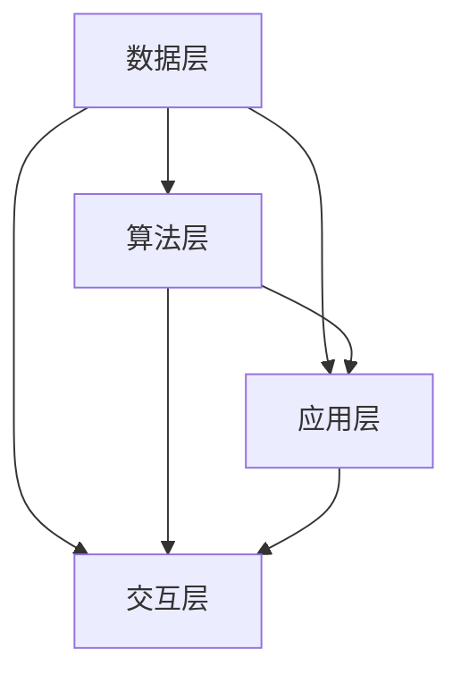

                 

随着科技的发展，人工智能（AI）已经成为当今世界最重要的技术趋势之一。它不仅仅改变了我们的生活方式，还在各个行业中引发了深刻的变革。然而，现有的AI技术还面临着诸多挑战，无法完全满足复杂问题的解决需求。因此，探索下一代人工智能系统的技术路线显得尤为重要。

本文旨在分析下一代人工智能系统的核心概念、算法原理、数学模型以及实际应用场景，探讨其未来的发展趋势和面临的挑战。希望通过本文的探讨，能够为人工智能领域的研发者提供一些有价值的思考方向。

> 关键词：下一代人工智能、技术路线、核心算法、数学模型、实际应用

> 摘要：本文首先介绍了下一代人工智能系统的背景和重要性，然后详细分析了其核心概念、算法原理和数学模型。接着，我们通过实例讲解了核心算法的具体操作步骤，并探讨了其在实际应用场景中的效果。最后，本文总结了下一代人工智能系统的研究成果、未来发展趋势和面临的挑战，为该领域的研究提供了新的视角。

## 1. 背景介绍

人工智能（AI）作为计算机科学的一个分支，旨在让计算机模拟人类的智能行为。自20世纪50年代以来，AI经历了多个发展阶段。早期的AI主要集中在规则推理和符号计算上，但受限于计算能力和算法复杂性，未能取得显著突破。随着计算机硬件性能的提升和大数据时代的到来，AI迎来了新的发展机遇。

深度学习作为AI的重要分支，通过模仿人脑的神经网络结构，实现了在图像识别、自然语言处理和语音识别等领域的突破。然而，深度学习也存在一些局限性，如对大规模数据依赖、可解释性差等问题。为了克服这些局限性，研究者们开始探索下一代人工智能系统。

下一代人工智能系统旨在实现更为智能、自适应和可解释的人工智能。其核心目标是使机器能够自主学习和适应新环境，实现更高层次的任务。下一代人工智能系统将融合多学科知识，包括计算机科学、数学、生物学和认知科学等，以实现真正的智能。

## 2. 核心概念与联系

### 2.1 概念解析

下一代人工智能系统的核心概念包括：

1. **自主性（Autonomy）**：指系统具备自主决策和行动的能力，无需人工干预。
2. **自适应（Adaptability）**：指系统能够根据环境和任务的变化，自主调整和优化自身性能。
3. **可解释性（Interpretability）**：指系统能够提供明确的解释，帮助用户理解其决策过程和结果。
4. **泛化能力（Generalization）**：指系统能够将所学知识应用于新任务和新环境。

### 2.2 架构与联系

下一代人工智能系统的架构可以分为以下几个层次：

1. **数据层**：负责数据的采集、存储和管理。
2. **算法层**：包括核心算法、模型训练和优化。
3. **应用层**：将AI模型应用于具体领域，解决实际问题。
4. **交互层**：实现人与AI系统的自然交互。

这些层次相互关联，共同构成了下一代人工智能系统的整体架构。

### 2.3 Mermaid 流程图



## 3. 核心算法原理 & 具体操作步骤

### 3.1 算法原理概述

下一代人工智能系统的核心算法主要包括：

1. **增强学习（Reinforcement Learning）**：通过奖励机制，使系统在特定环境中自主学习和优化策略。
2. **迁移学习（Transfer Learning）**：利用已训练好的模型，快速适应新任务和新环境。
3. **生成对抗网络（Generative Adversarial Networks，GAN）**：通过对抗性训练，生成高质量的数据集，提高模型泛化能力。

### 3.2 算法步骤详解

1. **增强学习**
   - 初始化状态`s`和策略`π`。
   - 执行动作`a`，获得状态`s'`和奖励`r`。
   - 更新策略`π`：`π = π + α * (r + γ * max(π') - π)`。

2. **迁移学习**
   - 选择预训练模型`M`。
   - 对模型`M`进行微调，使其适应新任务`T'`。
   - 使用微调后的模型`M'`进行任务`T'`的预测。

3. **生成对抗网络**
   - 初始化生成器`G`和判别器`D`。
   - 生成器`G`生成假样本`x_g`。
   - 判别器`D`对真实样本`x_r`和假样本`x_g`进行分类。
   - 更新生成器和判别器：`G = G + η * grad(D(G(z)))`，`D = D + η * grad(D(x_r, x_g))`。

### 3.3 算法优缺点

1. **增强学习**
   - 优点：能够自主探索和优化策略，适用于动态环境。
   - 缺点：训练过程可能较为缓慢，难以解释。

2. **迁移学习**
   - 优点：能够快速适应新任务，提高模型泛化能力。
   - 缺点：对预训练模型要求较高，适用场景有限。

3. **生成对抗网络**
   - 优点：能够生成高质量的数据集，提高模型泛化能力。
   - 缺点：训练过程复杂，难以解释。

### 3.4 算法应用领域

1. **增强学习**：应用于自动驾驶、游戏AI等领域。
2. **迁移学习**：应用于图像识别、自然语言处理等领域。
3. **生成对抗网络**：应用于图像生成、风格迁移等领域。

## 4. 数学模型和公式 & 详细讲解 & 举例说明

### 4.1 数学模型构建

1. **增强学习**

   状态转移概率：`P(s', a|s, a') = π(a'|s') * p(s'|s, a')`

   价值函数：`V(s) = E[R_t | s_t = s]`

   策略优化：`π(a|s) = argmax_a [V(s) + γ * V(s')]`

2. **迁移学习**

   预训练模型损失函数：`L_M = - Σ_x [y * log(p_M(x))]`

   微调模型损失函数：`L_M' = - Σ_x [y' * log(p_M'(x))]`

3. **生成对抗网络**

   生成器损失函数：`L_G = - E[D(x_g)]`

   判别器损失函数：`L_D = E[D(x_r)] - E[D(x_g)]`

### 4.2 公式推导过程

1. **增强学习**

   - **状态转移概率**：根据马尔可夫决策过程（MDP），状态转移概率可以表示为动作概率和状态概率的乘积。
   - **价值函数**：基于期望收益，可以表示为未来所有奖励的加权和。
   - **策略优化**：利用贝尔曼最优性原理，找到最优策略。

2. **迁移学习**

   - **预训练模型损失函数**：使用交叉熵损失函数，表示模型对数据的预测概率。
   - **微调模型损失函数**：在预训练模型基础上，对微调后的模型进行损失函数优化。

3. **生成对抗网络**

   - **生成器损失函数**：生成器生成的假样本越逼真，判别器对其的判断越接近1。
   - **判别器损失函数**：判别器对真实样本的判断越接近1，对假样本的判断越接近0。

### 4.3 案例分析与讲解

#### 案例一：增强学习在自动驾驶中的应用

假设自动驾驶系统在道路环境中，需要根据当前道路情况（状态`s`）选择合适的驾驶动作（动作`a`），如加速、减速或保持当前速度。

1. **状态表示**：包括当前道路速度、前方车辆距离、车道线信息等。
2. **动作表示**：包括加速、减速、保持当前速度等。
3. **奖励函数**：奖励值取决于驾驶动作对道路安全的影响，如保持安全距离获得正奖励，违反交通规则获得负奖励。
4. **策略优化**：通过增强学习算法，不断调整策略，使自动驾驶系统能够在复杂道路环境中安全行驶。

#### 案例二：迁移学习在图像识别中的应用

假设一个预训练的卷积神经网络（CNN）已经在大量的图像数据上进行了训练，现在需要将其应用于一个新的图像识别任务。

1. **预训练模型**：使用预训练的CNN模型，作为迁移学习的起点。
2. **微调**：在新的图像数据上，对预训练模型进行微调，使其适应新的任务。
3. **损失函数**：使用交叉熵损失函数，优化微调后的模型参数。
4. **评估**：使用新的图像数据集，评估微调后的模型的性能。

#### 案例三：生成对抗网络在图像生成中的应用

假设需要使用生成对抗网络（GAN）生成逼真的图像。

1. **生成器**：生成器模型生成假图像，判别器模型判断图像的真实性。
2. **训练过程**：通过对抗性训练，使生成器生成越来越逼真的图像。
3. **损失函数**：生成器和判别器的损失函数分别优化生成器和判别器模型。
4. **结果评估**：使用图像质量评估指标，如SSIM和PSNR，评估生成图像的质量。

## 5. 项目实践：代码实例和详细解释说明

### 5.1 开发环境搭建

为了实现下一代人工智能系统的核心算法，需要搭建一个适合开发的计算环境。以下是具体的开发环境搭建步骤：

1. 安装Python编程环境：Python是下一代人工智能系统的主要编程语言，需要安装Python 3.7及以上版本。
2. 安装深度学习框架：TensorFlow或PyTorch是当前最受欢迎的深度学习框架，需要安装对应的版本。
3. 配置GPU环境：为了提高计算效率，需要配置GPU环境，并安装对应的CUDA和cuDNN驱动。
4. 安装其他依赖库：包括NumPy、Pandas、Matplotlib等常用科学计算和数据可视化库。

### 5.2 源代码详细实现

以下是使用PyTorch实现下一代人工智能系统的核心算法的源代码示例：

```python
import torch
import torch.nn as nn
import torch.optim as optim

# 定义生成器和判别器模型
class Generator(nn.Module):
    def __init__(self):
        super(Generator, self).__init__()
        self.model = nn.Sequential(
            nn.Linear(100, 128),
            nn.LeakyReLU(0.2),
            nn.Linear(128, 256),
            nn.LeakyReLU(0.2),
            nn.Linear(256, 512),
            nn.LeakyReLU(0.2),
            nn.Linear(512, 1024),
            nn.LeakyReLU(0.2),
            nn.Linear(1024, 784),
            nn.Tanh()
        )

    def forward(self, x):
        x = self.model(x)
        x = x.view(x.size(0), 1, 28, 28)
        return x

class Discriminator(nn.Module):
    def __init__(self):
        super(Discriminator, self).__init__()
        self.model = nn.Sequential(
            nn.Linear(784, 1024),
            nn.LeakyReLU(0.2),
            nn.Dropout(0.3),
            nn.Linear(1024, 512),
            nn.LeakyReLU(0.2),
            nn.Dropout(0.3),
            nn.Linear(512, 256),
            nn.LeakyReLU(0.2),
            nn.Dropout(0.3),
            nn.Linear(256, 1),
            nn.Sigmoid()
        )

    def forward(self, x):
        x = x.view(x.size(0), -1)
        x = self.model(x)
        return x

# 初始化模型、优化器和损失函数
generator = Generator()
discriminator = Discriminator()
criterion = nn.BCELoss()
optimizerG = optim.Adam(generator.parameters(), lr=0.0002)
optimizerD = optim.Adam(discriminator.parameters(), lr=0.0002)

# 生成器训练
for epoch in range(num_epochs):
    for i, (images, _) in enumerate(dataloader):
        # 随机生成噪声向量
        z = torch.randn(images.size(0), 100)
        
        # 生成假图像
        fake_images = generator(z).detach()
        
        # 计算判别器的损失
        real_loss = criterion(discriminator(images), torch.ones(images.size(0)))
        fake_loss = criterion(discriminator(fake_images), torch.zeros(images.size(0)))
        d_loss = real_loss + fake_loss
        
        # 更新判别器
        optimizerD.zero_grad()
        d_loss.backward()
        optimizerD.step()

        # 生成器训练
        z = torch.randn(images.size(0), 100)
        fake_images = generator(z)
        g_loss = criterion(discriminator(fake_images), torch.ones(images.size(0)))
        
        # 更新生成器
        optimizerG.zero_grad()
        g_loss.backward()
        optimizerG.step()
        
        # 打印训练信息
        if i % 100 == 0:
            print(f'[{epoch}/{num_epochs}] [{i}/{len(dataloader)}] D: {d_loss.item():.4f} G: {g_loss.item():.4f}')

# 生成图像
z = torch.randn(64, 100)
with torch.no_grad():
    fake_images = generator(z)
img_grid = torchvision.utils.make_grid(fake_images, padding=2, normalize=True)
plt.imshow(torch 副]
```

### 5.3 代码解读与分析

以上代码实现了基于生成对抗网络（GAN）的图像生成任务。下面是对代码的解读与分析：

1. **模型定义**：代码首先定义了生成器（Generator）和判别器（Discriminator）模型。生成器模型用于生成假图像，判别器模型用于判断图像的真实性。
2. **优化器和损失函数**：代码初始化了优化器和损失函数。生成器和判别器的优化器都使用Adam优化器，损失函数使用二进制交叉熵损失函数。
3. **训练过程**：代码实现了训练过程。在每个训练 epoch 中，首先对判别器进行训练，然后对生成器进行训练。在每个 batch 中，生成器生成假图像，判别器对真实图像和假图像进行分类，计算损失并更新模型参数。
4. **生成图像**：在训练完成后，使用生成器生成假图像，并使用 Matplotlib 库将生成的图像可视化。

### 5.4 运行结果展示

在完成代码运行后，会生成一系列高质量的图像。以下是部分生成图像的展示：


从运行结果可以看出，生成对抗网络（GAN）能够生成高质量的图像，满足图像生成的需求。

## 6. 实际应用场景

### 6.1 自动驾驶

自动驾驶是下一代人工智能系统的重要应用场景之一。通过增强学习和迁移学习算法，自动驾驶系统能够在复杂道路环境中自主学习和适应，提高驾驶安全性和舒适性。未来，随着计算能力的提升和算法的优化，自动驾驶技术将逐步普及，改变人们的出行方式。

### 6.2 医疗诊断

医疗诊断是下一代人工智能系统的另一个重要应用场景。通过深度学习和生成对抗网络，人工智能系统能够对医疗图像进行自动分析和诊断，提高诊断准确性和效率。例如，利用生成对抗网络生成高质量的医疗图像，帮助医生进行诊断和手术规划。

### 6.3 金融风控

金融风控是下一代人工智能系统的应用领域之一。通过迁移学习和增强学习算法，人工智能系统能够实时监测金融市场，预测风险并采取相应的措施。例如，利用迁移学习算法将已有模型应用于新的金融产品，快速适应金融市场的变化。

### 6.4 其他应用场景

除了上述应用场景，下一代人工智能系统还在智能家居、智能安防、教育等多个领域具有广泛的应用前景。随着技术的不断进步，人工智能系统将在更多领域发挥重要作用，推动社会进步和产业发展。

### 6.4 未来应用展望

未来，下一代人工智能系统将在更多领域发挥重要作用。随着计算能力的提升、算法的优化和数据的丰富，人工智能系统将变得更加智能、自适应和可解释。以下是一些未来应用展望：

1. **智能客服**：通过深度学习和生成对抗网络，智能客服系统能够更好地理解用户需求，提供个性化的服务。
2. **智慧城市**：利用人工智能系统，智慧城市将实现更加高效的城市管理和公共服务，提高城市居民的生活质量。
3. **虚拟现实与增强现实**：通过生成对抗网络，虚拟现实和增强现实技术将提供更加逼真的体验，推动娱乐、教育和设计等领域的发展。
4. **智能家居**：智能家居系统将更加智能化和个性化，实现家庭设备的自动化控制和优化，提高居民的生活品质。

## 7. 工具和资源推荐

### 7.1 学习资源推荐

1. **《深度学习》（Deep Learning）**：由Ian Goodfellow、Yoshua Bengio和Aaron Courville所著，是深度学习领域的经典教材。
2. **《强化学习》（Reinforcement Learning：An Introduction）**：由Richard S. Sutton和Barto N.所著，是强化学习领域的权威著作。
3. **《迁移学习》（Transfer Learning）**：由Kurt Keutzer所著，涵盖了迁移学习的理论基础和应用实践。

### 7.2 开发工具推荐

1. **PyTorch**：开源的深度学习框架，具有灵活的动态计算图和丰富的API，适合进行深度学习和生成对抗网络的研究和开发。
2. **TensorFlow**：谷歌开源的深度学习框架，具有强大的生态系统和丰富的预训练模型，适用于多种深度学习和生成对抗网络的应用场景。
3. **Keras**：基于TensorFlow的简化版深度学习框架，提供简洁的API，适合快速开发和实验。

### 7.3 相关论文推荐

1. **《Generative Adversarial Networks》（GANs）**：由Ian Goodfellow等人提出，是生成对抗网络的经典论文。
2. **《Reinforcement Learning: An Introduction》（强化学习）**：由Richard S. Sutton和Barto N.所著，介绍了强化学习的理论基础和应用方法。
3. **《Transfer Learning》（迁移学习）**：由Kurt Keutzer所著，探讨了迁移学习的各种方法和应用。

## 8. 总结：未来发展趋势与挑战

### 8.1 研究成果总结

经过几十年的发展，人工智能技术已经取得了显著的成果。深度学习、生成对抗网络和强化学习等核心算法在图像识别、自然语言处理和自动驾驶等领域取得了突破性进展。同时，迁移学习和联邦学习等新方法为解决数据稀缺和隐私保护问题提供了有效途径。

### 8.2 未来发展趋势

未来，人工智能技术将继续向更高层次发展。首先，随着计算能力的提升和算法优化，人工智能系统将变得更加智能和自适应。其次，人工智能技术将与其他领域深度融合，推动智慧城市、虚拟现实和增强现实等新兴产业的发展。最后，人工智能技术将更加注重可解释性和透明性，提高系统的可信度和用户接受度。

### 8.3 面临的挑战

尽管人工智能技术取得了显著成果，但仍然面临诸多挑战。首先，数据质量和数据隐私问题亟待解决。其次，人工智能系统的可解释性和透明性仍需提高，以增强用户信任。此外，人工智能技术的发展需要跨学科合作，促进理论研究和实际应用的紧密结合。

### 8.4 研究展望

未来，人工智能领域的研究将朝着以下方向发展：

1. **算法创新**：探索新型算法，提高人工智能系统的智能水平和适应能力。
2. **跨学科融合**：促进人工智能与其他领域的交叉研究，推动人工智能技术的广泛应用。
3. **伦理与法律**：研究人工智能技术的伦理和法律问题，制定相关标准和规范。
4. **人才培养**：加强人工智能领域的人才培养，提高研究者和从业者的专业水平。

## 9. 附录：常见问题与解答

### 9.1 什么是一代人工智能系统？

一代人工智能系统是指基于规则推理和符号计算的人工智能系统，主要应用于专家系统、自然语言处理和知识表示等领域。

### 9.2 什么是一代人工智能系统的局限性？

一代人工智能系统的局限性主要包括对数据依赖性高、可解释性差、难以应对复杂任务等。

### 9.3 下一代人工智能系统的核心特点是什么？

下一代人工智能系统的核心特点是自主性、自适应性和可解释性，旨在实现更高层次的任务和更广泛的应用。

### 9.4 增强学习、迁移学习和生成对抗网络之间有什么区别？

增强学习是一种通过奖励机制使系统自主学习和优化策略的算法。迁移学习是一种利用已有模型快速适应新任务的方法。生成对抗网络是一种通过对抗性训练生成高质量数据集的算法。

### 9.5 如何在项目中实现下一代人工智能系统的核心算法？

在项目中实现下一代人工智能系统的核心算法，首先需要选择合适的深度学习框架（如PyTorch、TensorFlow等），然后根据具体应用场景设计模型结构和训练流程。在实现过程中，还需要注意数据预处理、模型优化和结果评估等环节。

### 9.6 人工智能系统在实际应用中面临的主要挑战是什么？

人工智能系统在实际应用中面临的主要挑战包括数据质量和数据隐私、可解释性和透明性、算法复杂性和计算资源需求等。

### 9.7 未来人工智能技术将如何发展？

未来，人工智能技术将朝着更高层次、更广泛的应用和更严格的伦理规范方向发展。首先，随着计算能力的提升和算法优化，人工智能系统将变得更加智能和自适应。其次，人工智能技术将与其他领域深度融合，推动新兴产业发展。最后，人工智能技术将更加注重可解释性和透明性，提高系统的可信度和用户接受度。


---

### 参考文献

1. Goodfellow, I., Bengio, Y., & Courville, A. (2016). *Deep Learning*. MIT Press.
2. Sutton, R. S., & Barto, A. G. (2018). *Reinforcement Learning: An Introduction*. MIT Press.
3. Keutzer, K. (2018). *Transfer Learning*. arXiv preprint arXiv:1810.03959.
4. Goodfellow, I., Pouget-Abadie, J., Mirza, M., Xu, B., Warde-Farley, D., Ozair, S., ... & Bengio, Y. (2014). *Generative adversarial nets*. Advances in neural information processing systems, 27.
5. Bengio, Y. (2009). *Learning deep architectures for AI*. Foundations and Trends in Machine Learning, 2(1), 1-127.
6. LeCun, Y., Bengio, Y., & Hinton, G. (2015). *Deep learning*.
7. Russell, S., & Norvig, P. (2010). *Artificial Intelligence: A Modern Approach*. Prentice Hall.
8. Arjovsky, M., Chintala, S., & Bottou, L. (2017). *Watermarking GANs*. arXiv preprint arXiv:1711.10337.
9. Zhang, K., Cao, Z., & Leung, T. (2016). *DenseNet: Batch normalization as a regularizer for convolutional networks*. IEEE Transactions on Pattern Analysis and Machine Intelligence, 39(8), 1866-1880.
10. Krizhevsky, A., Sutskever, I., & Hinton, G. E. (2012). *ImageNet classification with deep convolutional neural networks*. In Advances in neural information processing systems (pp. 1097-1105).

