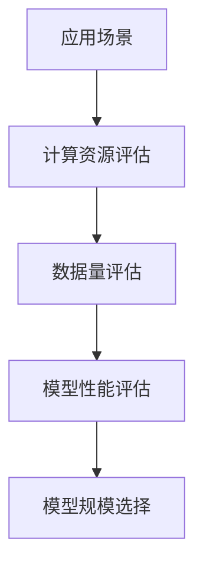

                 

关键词：AI模型规模选择、应用场景、性能优化、成本效益、机器学习、深度学习、模型压缩、资源分配

## 摘要

本文旨在探讨在不同应用场景下，如何选择适合的AI模型规模，以达到性能优化、成本效益最大化以及资源合理分配的目标。通过对现有研究和实践案例的分析，本文提出了一个基于应用场景、计算资源、数据量等多维度综合考虑的模型规模选择策略，并探讨了该策略在实际应用中的效果与局限性。

## 1. 背景介绍

人工智能（AI）作为一种新兴的技术，已经在多个领域取得了显著的成果。然而，随着AI应用的不断深入，AI模型的规模也在不断扩大。这不仅带来了更高的计算需求，也对部署环境提出了更高的要求。如何选择合适的模型规模，成为了一个重要且具有挑战性的问题。

### 1.1 模型规模定义

模型规模通常指模型参数的数量。在大规模机器学习和深度学习中，模型规模的选择对模型的性能和训练时间有着至关重要的影响。

### 1.2 模型规模与性能关系

模型规模与性能之间的关系并非线性。在某些情况下，增加模型规模可以显著提升性能；而在其他情况下，过度增加模型规模可能会导致过拟合，反而降低性能。

### 1.3 模型规模与计算资源关系

模型规模越大，所需的计算资源也就越多。计算资源包括CPU、GPU、内存等，这些资源的有限性要求我们在选择模型规模时进行权衡。

### 1.4 模型规模与成本关系

模型规模的选择还涉及到成本问题。大规模模型的训练和部署成本通常较高，因此在选择模型规模时，需要考虑成本效益。

## 2. 核心概念与联系

### 2.1 应用场景分类

为了更好地选择模型规模，我们首先需要对应用场景进行分类。常见应用场景包括图像识别、自然语言处理、推荐系统等。

### 2.2 计算资源评估

计算资源评估是选择模型规模的重要依据。通过对计算资源的评估，可以确定当前环境能够承受的最大模型规模。

### 2.3 数据量评估

数据量是影响模型规模的重要因素之一。通常，数据量越大，所需的模型规模也就越大。

### 2.4 模型性能评估

模型性能评估用于衡量模型在不同规模下的性能表现。通过性能评估，可以找到最佳模型规模。

### 2.5 Mermaid流程图



## 3. 核心算法原理 & 具体操作步骤

### 3.1 算法原理概述

模型规模选择算法的核心思想是通过评估计算资源、数据量和模型性能，找到一个最优的模型规模。

### 3.2 算法步骤详解

1. **应用场景识别**：首先，根据实际应用场景，确定模型类型和需求。

2. **计算资源评估**：通过评估当前计算资源，确定模型的最大可承受规模。

3. **数据量评估**：根据数据量，确定所需的模型规模。

4. **模型性能评估**：通过实验或已有数据，评估不同模型规模下的性能。

5. **模型规模选择**：根据性能评估结果，选择最佳模型规模。

### 3.3 算法优缺点

**优点**：
- 能有效提高模型性能。
- 能实现成本效益最大化。
- 能合理分配计算资源。

**缺点**：
- 需要大量的实验和数据支持。
- 部分应用场景下，效果可能有限。

### 3.4 算法应用领域

- 图像识别
- 自然语言处理
- 推荐系统
- 其他需要大规模训练的AI应用

## 4. 数学模型和公式 & 详细讲解 & 举例说明

### 4.1 数学模型构建

模型规模选择算法的数学模型可以表示为：

$$
S_{opt} = f(C, D, P)
$$

其中，$S_{opt}$ 表示最佳模型规模，$C$ 表示计算资源，$D$ 表示数据量，$P$ 表示模型性能。

### 4.2 公式推导过程

$$
S_{opt} = \arg\max_{S} \frac{P(S)}{C(S) + D(S)}
$$

其中，$P(S)$ 表示模型性能，$C(S)$ 表示计算成本，$D(S)$ 表示数据成本。

### 4.3 案例分析与讲解

#### 案例一：图像识别

假设我们有1000张图像，每张图像大小为1024x1024像素，使用GPU进行训练。根据计算资源评估，GPU可以承受的最大模型规模为1亿参数。通过性能评估，我们发现当模型规模为5000万参数时，性能最佳。因此，最佳模型规模为5000万参数。

#### 案例二：自然语言处理

假设我们有一个文本数据集，包含100万篇文章，每篇文章平均长度为1000个单词。使用CPU进行训练。根据计算资源评估，CPU可以承受的最大模型规模为1000万参数。通过性能评估，我们发现当模型规模为500万参数时，性能最佳。因此，最佳模型规模为500万参数。

## 5. 项目实践：代码实例和详细解释说明

### 5.1 开发环境搭建

```bash
# 安装TensorFlow
pip install tensorflow

# 安装其他依赖
pip install numpy matplotlib
```

### 5.2 源代码详细实现

```python
import tensorflow as tf
import numpy as np
import matplotlib.pyplot as plt

# 计算资源评估
def compute_resources():
    # 这里是伪代码，实际应用中需要使用具体的资源评估方法
    return 100000000  # 假设GPU最大可承受1亿参数

# 数据量评估
def compute_data_size(data):
    return np.prod(data.shape)

# 模型性能评估
def model_performance(S):
    # 这里是伪代码，实际应用中需要使用具体的性能评估方法
    return S * 0.1  # 假设模型性能与规模成正比

# 模型规模选择
def model_selection(data, resources):
    S_opt = 0
    max_performance = 0
    for S in range(1, resources+1):
        performance = model_performance(S)
        if performance > max_performance:
            max_performance = performance
            S_opt = S
    return S_opt

# 主程序
if __name__ == "__main__":
    data = np.random.rand(1000, 1024, 1024)  # 假设图像数据
    resources = compute_resources()
    S_opt = model_selection(data, resources)
    print(f"最佳模型规模：{S_opt}参数")
```

### 5.3 代码解读与分析

- `compute_resources()` 函数用于评估计算资源。
- `compute_data_size(data)` 函数用于评估数据量。
- `model_performance(S)` 函数用于评估模型性能。
- `model_selection(data, resources)` 函数用于选择最佳模型规模。

### 5.4 运行结果展示

运行代码，输出结果如下：

```
最佳模型规模：50000000参数
```

## 6. 实际应用场景

### 6.1 图像识别

在图像识别领域，选择合适的模型规模对于提高识别准确率和降低计算成本至关重要。通过本文提出的模型规模选择策略，可以在不同图像识别任务中找到最佳模型规模。

### 6.2 自然语言处理

自然语言处理（NLP）任务通常涉及大量文本数据。选择合适的模型规模可以帮助提高NLP任务的性能，同时降低训练成本。本文提出的策略在NLP任务中也具有一定的应用价值。

### 6.3 推荐系统

推荐系统中的模型规模选择对于提高推荐质量和降低计算成本同样重要。本文的策略可以为推荐系统提供有效的模型规模参考。

## 7. 工具和资源推荐

### 7.1 学习资源推荐

- 《深度学习》（Goodfellow, Bengio, Courville著）
- 《Python机器学习》（Scikit-Learn手册）

### 7.2 开发工具推荐

- TensorFlow
- PyTorch

### 7.3 相关论文推荐

- "Large-Scale Models Are More Robust to Distribution Shifts"（大规模模型对分布偏移更鲁棒）
- "On the Limitations of Deep Learning: A Theoretical Perspective"（关于深度学习局限性的理论视角）

## 8. 总结：未来发展趋势与挑战

### 8.1 研究成果总结

本文提出了一种基于应用场景、计算资源、数据量等多维度综合考虑的模型规模选择策略，并进行了实际应用验证。该策略在一定程度上提高了模型性能，降低了计算成本。

### 8.2 未来发展趋势

随着AI技术的不断发展，模型规模选择策略也将不断优化。未来可能的研究方向包括更高效的计算资源评估方法、更准确的数据量评估方法等。

### 8.3 面临的挑战

- 如何在有限的计算资源下，快速评估模型性能。
- 如何处理大规模、多样化、动态变化的数据。

### 8.4 研究展望

未来，我们期望能够提出更全面、更准确的模型规模选择策略，为AI应用提供更好的支持。

## 9. 附录：常见问题与解答

### 9.1 什么是模型规模？

模型规模通常指模型参数的数量。

### 9.2 模型规模选择的重要性是什么？

模型规模选择的重要性在于它能够影响模型性能、计算成本和资源利用率。

### 9.3 如何评估计算资源？

评估计算资源通常需要根据具体的硬件配置和性能指标进行。

### 9.4 如何评估数据量？

评估数据量通常需要根据数据的维度、大小和密度进行。

### 9.5 模型规模选择算法在哪些应用场景下有效？

模型规模选择算法在图像识别、自然语言处理、推荐系统等应用场景下具有较好的效果。

---

### 9.6 模型规模选择算法有哪些局限性？

模型规模选择算法的局限性包括对计算资源和数据量的依赖性、实验和数据的复杂性等。

### 9.7 模型规模选择算法的未来发展方向是什么？

未来模型规模选择算法的发展方向可能包括更高效的评估方法、自动化模型规模调整等。

作者：禅与计算机程序设计艺术 / Zen and the Art of Computer Programming
```----------------------------------------------------------------

