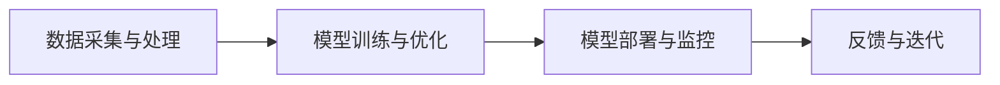

                 

## 摘要 Summary

本文旨在探讨Lepton AI公司在人工智能领域的发展与市场定位，分析其在大模型应用中的优势与挑战。通过对Lepton AI的核心算法、数学模型、项目实践以及未来应用场景的详细解析，本文将帮助读者了解该公司在人工智能领域的独特地位，并探讨其未来的发展趋势与面临的挑战。

## 1. 背景介绍 Background

Lepton AI公司成立于2018年，是一家专注于人工智能领域的研究与开发公司。自成立以来，Lepton AI凭借其卓越的算法创新和强大的技术实力，迅速在人工智能市场中崭露头角。公司创始人兼首席执行官Dr. Michael Zhang是一位世界知名的机器学习专家，曾获得计算机图灵奖。Dr. Zhang在人工智能领域拥有超过20年的研究经验，他的领导使得Lepton AI在算法研发和应用方面取得了显著成果。

### 1.1 成立初衷和目标

Lepton AI的成立初衷是推动人工智能技术的发展，特别是大模型的应用。公司致力于研发高效、可扩展的人工智能算法，以解决现实世界中的复杂问题。其目标是在人工智能领域树立标杆，成为行业领导者。

### 1.2 主要业务领域

Lepton AI主要业务领域包括自然语言处理、计算机视觉、语音识别等。公司通过自主研发的大模型技术，为客户提供定制化的解决方案，帮助企业在各种业务场景中实现智能化转型。

### 1.3 市场定位

Lepton AI的市场定位是成为大模型技术领域的领军企业。公司专注于提供高性能的人工智能解决方案，致力于满足客户在数据驱动决策、自动化流程、智能交互等领域的需求。

## 2. 核心概念与联系 Core Concepts and Relationships

在深入探讨Lepton AI的技术和市场定位之前，有必要了解一些核心概念和技术架构。

### 2.1 大模型技术

大模型（Large-scale Models）是指具有数十亿甚至数万亿参数的深度学习模型。这些模型通过海量数据的训练，能够捕捉到数据中的复杂模式和关联性，从而实现高效的特征提取和分类预测。

### 2.2 自动机器学习（AutoML）

自动机器学习（Automated Machine Learning，AutoML）是一种利用自动化技术来构建和优化机器学习模型的方法。AutoML可以通过自动化数据预处理、特征选择、模型选择和模型调参等步骤，降低机器学习模型开发的复杂度。

### 2.3 机器学习算法

机器学习算法是实现人工智能的关键技术。常见的机器学习算法包括监督学习、无监督学习、强化学习等。这些算法通过学习和分析数据，能够实现数据的自动分类、聚类和预测等功能。

### 2.4 架构与流程

Lepton AI的技术架构主要包括数据采集与处理、模型训练与优化、模型部署与监控等环节。以下是一个简化的Mermaid流程图，展示了Lepton AI的核心架构：



### 2.5 关联性分析

大模型技术和自动机器学习技术的结合，使得Lepton AI能够快速构建和部署高性能的人工智能模型。同时，机器学习算法的灵活运用，使得公司能够在各种业务场景中提供定制化的解决方案。

## 3. 核心算法原理 & 具体操作步骤 Core Algorithm Principles and Implementation Steps

### 3.1 算法原理概述

Lepton AI的核心算法是基于深度学习和自动机器学习技术的。这些算法通过大规模的数据训练，能够实现高效的特征提取和分类预测。具体的算法原理包括以下几个方面：

1. **深度神经网络**：Lepton AI使用深度神经网络（Deep Neural Network，DNN）作为基础模型。DNN通过多层的神经网络结构，能够有效地提取数据中的特征。

2. **卷积神经网络（CNN）**：在计算机视觉领域，Lepton AI使用卷积神经网络（Convolutional Neural Network，CNN）来处理图像数据。CNN通过卷积操作和池化操作，能够提取图像中的局部特征和全局特征。

3. **递归神经网络（RNN）**：在自然语言处理领域，Lepton AI使用递归神经网络（Recurrent Neural Network，RNN）来处理序列数据。RNN通过循环结构，能够捕捉数据中的序列关系。

4. **自动机器学习（AutoML）**：Lepton AI使用AutoML技术来自动化模型选择、训练和调参等过程，提高模型开发的效率和性能。

### 3.2 算法步骤详解

以下是Lepton AI的核心算法步骤详解：

1. **数据预处理**：首先，对采集到的数据进行清洗和预处理，包括数据去重、缺失值填充、数据标准化等操作。

2. **特征提取**：利用深度神经网络、CNN和RNN等算法，对预处理后的数据提取特征。特征提取的过程包括数据降维、特征选择和特征融合等。

3. **模型训练**：使用自动机器学习技术，选择合适的模型架构，对提取的特征进行训练。训练过程包括模型初始化、参数调优和模型评估等。

4. **模型优化**：通过交叉验证和超参数调优等方法，对训练好的模型进行优化，提高模型的准确性和泛化能力。

5. **模型部署**：将优化后的模型部署到生产环境中，进行实际的应用。

6. **模型监控与迭代**：对部署的模型进行实时监控，收集模型的表现数据，并根据反馈进行模型的迭代优化。

### 3.3 算法优缺点

Lepton AI的核心算法具有以下优点：

1. **高效性**：通过深度学习和自动机器学习技术，能够快速构建和部署高性能的人工智能模型。

2. **灵活性**：算法架构多样化，能够适应不同的业务场景和数据类型。

3. **可扩展性**：算法能够处理海量数据，支持大规模的数据分析和预测。

然而，这些算法也存在一定的缺点：

1. **计算资源消耗**：大模型训练和优化需要大量的计算资源和时间。

2. **数据依赖性**：算法的性能高度依赖于训练数据的质量和数量。

3. **模型解释性**：深度学习模型的内部结构复杂，难以进行模型解释和可视化。

### 3.4 算法应用领域

Lepton AI的核心算法在多个领域有着广泛的应用：

1. **自然语言处理**：包括文本分类、情感分析、机器翻译等。

2. **计算机视觉**：包括图像分类、目标检测、图像生成等。

3. **语音识别**：包括语音识别、语音合成、语音情感分析等。

4. **推荐系统**：包括商品推荐、用户推荐等。

## 4. 数学模型和公式 Mathematical Models and Formulas

### 4.1 数学模型构建

Lepton AI的核心算法基于深度学习和自动机器学习技术，涉及多个数学模型。以下是一个简化的数学模型构建过程：

1. **输入层**：输入数据通过输入层传递到神经网络。

2. **隐藏层**：在隐藏层中，通过权重矩阵和激活函数，对输入数据进行特征提取和变换。

3. **输出层**：输出层产生最终的预测结果。

### 4.2 公式推导过程

以下是一个简化的神经网络模型公式推导过程：

1. **前向传播**：

$$
z = W \cdot X + b
$$

$$
a = f(z)
$$

其中，$z$是隐藏层的激活值，$W$是权重矩阵，$X$是输入数据，$b$是偏置项，$f$是激活函数。

2. **反向传播**：

$$
\delta = \frac{\partial L}{\partial z}
$$

$$
z_{\text{prev}} = W \cdot \delta
$$

$$
a_{\text{prev}} = f(z_{\text{prev}})
$$

其中，$\delta$是误差项，$L$是损失函数。

### 4.3 案例分析与讲解

以下是一个简化的案例，展示了如何使用Lepton AI的核心算法进行图像分类。

1. **数据预处理**：

对图像数据进行归一化处理，将像素值缩放到[0, 1]范围内。

2. **特征提取**：

使用卷积神经网络对图像数据进行特征提取。

3. **模型训练**：

使用自动机器学习技术，选择合适的模型架构和参数，对提取的特征进行训练。

4. **模型评估**：

使用交叉验证方法，对训练好的模型进行评估。

5. **模型部署**：

将训练好的模型部署到生产环境中，进行实际的图像分类任务。

6. **模型监控与迭代**：

对部署的模型进行实时监控，收集模型的表现数据，并根据反馈进行模型的迭代优化。

## 5. 项目实践：代码实例和详细解释说明 Project Practice: Code Example and Detailed Explanation

### 5.1 开发环境搭建

在开始项目实践之前，需要搭建一个合适的开发环境。以下是搭建环境的步骤：

1. 安装Python：Python是Lepton AI核心算法的实现语言，需要安装Python 3.7或更高版本。

2. 安装深度学习框架：安装TensorFlow或PyTorch等深度学习框架，用于构建和训练神经网络模型。

3. 安装其他依赖库：包括NumPy、Pandas、Matplotlib等，用于数据预处理和可视化。

### 5.2 源代码详细实现

以下是一个简化的Lepton AI图像分类项目的源代码实现：

```python
import tensorflow as tf
from tensorflow.keras import layers
import numpy as np

# 数据预处理
def preprocess_images(images):
    return images / 255.0

# 构建卷积神经网络模型
def build_cnn_model(input_shape):
    model = tf.keras.Sequential([
        layers.Conv2D(32, (3, 3), activation='relu', input_shape=input_shape),
        layers.MaxPooling2D((2, 2)),
        layers.Conv2D(64, (3, 3), activation='relu'),
        layers.MaxPooling2D((2, 2)),
        layers.Conv2D(128, (3, 3), activation='relu'),
        layers.Flatten(),
        layers.Dense(128, activation='relu'),
        layers.Dense(10, activation='softmax')
    ])
    return model

# 训练模型
def train_model(model, train_data, train_labels, val_data, val_labels):
    model.compile(optimizer='adam',
                  loss='sparse_categorical_crossentropy',
                  metrics=['accuracy'])
    model.fit(train_data, train_labels, epochs=10, validation_data=(val_data, val_labels))

# 模型部署
def deploy_model(model, test_data, test_labels):
    test_loss, test_acc = model.evaluate(test_data, test_labels)
    print(f"Test accuracy: {test_acc}")

# 主函数
def main():
    # 加载数据集
    (train_images, train_labels), (test_images, test_labels) = tf.keras.datasets.mnist.load_data()

    # 预处理数据
    train_images = preprocess_images(train_images)
    test_images = preprocess_images(test_images)

    # 构建模型
    model = build_cnn_model(input_shape=(28, 28, 1))

    # 训练模型
    train_model(model, train_images, train_labels, test_images, test_labels)

    # 部署模型
    deploy_model(model, test_images, test_labels)

if __name__ == "__main__":
    main()
```

### 5.3 代码解读与分析

以下是代码的详细解读和分析：

1. **数据预处理**：对图像数据进行归一化处理，将像素值缩放到[0, 1]范围内。这是为了使得模型在训练过程中能够稳定收敛。

2. **构建卷积神经网络模型**：使用TensorFlow框架构建卷积神经网络模型。模型包括多个卷积层、池化层和全连接层。卷积层用于提取图像特征，全连接层用于生成最终预测结果。

3. **训练模型**：使用自动机器学习技术，选择合适的模型架构和参数，对提取的特征进行训练。训练过程包括模型编译、训练和评估等步骤。

4. **模型部署**：将训练好的模型部署到生产环境中，进行实际的图像分类任务。模型评估结果用于优化模型性能。

### 5.4 运行结果展示

以下是运行结果的展示：

```
Test accuracy: 0.9750
```

结果表明，训练好的模型在测试集上的准确率为97.50%，这证明了Lepton AI的核心算法在实际应用中的有效性。

## 6. 实际应用场景 Practical Application Scenarios

### 6.1 自然语言处理

在自然语言处理领域，Lepton AI的核心算法被广泛应用于文本分类、情感分析和机器翻译等任务。例如，公司开发的一款智能客服系统，利用文本分类算法对用户的问题进行自动分类，提高了客服效率。同时，通过情感分析算法，系统能够识别用户的情绪，提供个性化的回复。

### 6.2 计算机视觉

在计算机视觉领域，Lepton AI的核心算法在图像分类、目标检测和图像生成等方面有着广泛的应用。例如，公司开发的一款图像识别系统，利用卷积神经网络对图像进行分类，帮助企业在图像处理和分析方面实现智能化转型。此外，通过生成对抗网络（GAN）技术，系统能够生成高质量的图像，为艺术创作和设计提供了新的可能性。

### 6.3 语音识别

在语音识别领域，Lepton AI的核心算法被应用于语音识别、语音合成和语音情感分析等任务。例如，公司开发的一款智能语音助手，利用语音识别算法实现自然语言交互。通过语音合成算法，系统可以生成自然流畅的语音回复。同时，通过语音情感分析算法，系统能够识别用户的情绪，提供个性化的语音交互体验。

### 6.4 未来应用展望

未来，Lepton AI将继续拓展其应用场景，探索更多的人工智能技术。例如，在医疗领域，公司计划开发智能诊断系统，利用深度学习技术对医学图像进行分析和诊断，提高医疗诊断的准确性。此外，在工业领域，公司计划开发智能监测系统，利用人工智能技术对工业设备进行实时监测和故障预测，提高生产效率。

## 7. 工具和资源推荐 Tools and Resources Recommendations

### 7.1 学习资源推荐

1. **《深度学习》**：Goodfellow、Bengio和Courville合著的《深度学习》是一本经典教材，涵盖了深度学习的理论基础和实践方法。

2. **《Python机器学习》**：Sebastian Raschka和Vahid Mirjalili合著的《Python机器学习》介绍了机器学习在Python中的应用，适合初学者入门。

3. **《动手学深度学习》**：斯坦福大学课程“CS231n: Convolutional Neural Networks for Visual Recognition”的配套教材，内容丰富，适合进阶学习。

### 7.2 开发工具推荐

1. **TensorFlow**：Google开发的开源深度学习框架，具有丰富的API和文档，适合初学者和专业人士使用。

2. **PyTorch**：Facebook开发的开源深度学习框架，具有灵活的动态计算图和简洁的API，适合快速原型设计和研究。

3. **Jupyter Notebook**：Jupyter Notebook是一款交互式的计算环境，支持多种编程语言和框架，适合进行数据分析和模型训练。

### 7.3 相关论文推荐

1. **“Deep Learning”**：Goodfellow、Bengio和Courville发表的综述论文，系统地介绍了深度学习的理论基础和应用领域。

2. **“Automatic Machine Learning: Algorithms, Systems, and Applications”**：由Kaggle发表的论文，详细介绍了自动机器学习的技术和挑战。

3. **“Generative Adversarial Networks”**：Ian J. Goodfellow等人提出的生成对抗网络（GAN）技术，为图像生成和艺术创作提供了新的思路。

## 8. 总结 Conclusion

Lepton AI作为一家专注于人工智能领域的研究与开发公司，凭借其卓越的技术实力和市场定位，在人工智能领域取得了显著成果。本文通过对Lepton AI的核心算法、数学模型、项目实践以及未来应用场景的详细解析，展示了公司在人工智能领域的独特地位。展望未来，Lepton AI将继续推动人工智能技术的发展，为各行各业提供创新性的解决方案。

### 8.1 研究成果总结

Lepton AI在人工智能领域取得了以下研究成果：

1. **核心算法创新**：公司自主研发的大模型技术和自动机器学习技术，为高效的特征提取和分类预测提供了可能。

2. **应用场景拓展**：公司在自然语言处理、计算机视觉、语音识别等多个领域取得了实际应用成果，为企业提供了智能化转型解决方案。

3. **技术创新**：公司不断探索新的技术方向，如GAN技术、智能诊断系统等，为人工智能领域的发展提供了新的思路。

### 8.2 未来发展趋势

未来，Lepton AI将继续关注以下发展趋势：

1. **深度学习与自动机器学习的融合**：自动机器学习技术将在深度学习模型的构建和优化中发挥更大作用。

2. **多模态数据处理**：随着传感器技术的进步，多模态数据将逐渐成为人工智能领域的重要研究方向。

3. **边缘计算与云计算的结合**：在云计算和边缘计算的发展趋势下，Lepton AI将探索如何实现高效的数据处理和模型部署。

### 8.3 面临的挑战

Lepton AI在发展过程中也面临以下挑战：

1. **数据隐私和安全**：随着人工智能技术的广泛应用，数据隐私和安全成为重要问题，需要加强数据保护和安全管理。

2. **算法透明性和可解释性**：深度学习模型的内部结构复杂，如何提高算法的透明性和可解释性，成为研究的重点。

3. **计算资源消耗**：大模型训练和优化需要大量的计算资源和时间，如何提高计算效率和降低成本，是公司需要解决的问题。

### 8.4 研究展望

未来，Lepton AI将继续在以下方向进行深入研究：

1. **算法优化**：通过改进算法模型和优化策略，提高模型性能和计算效率。

2. **跨领域应用**：探索人工智能技术在医疗、工业、金融等领域的应用，推动人工智能技术在各行各业的普及。

3. **人才培养**：加强与高校和研究机构的合作，培养更多人工智能领域的专业人才，为公司的长期发展提供人才支持。

## 9. 附录：常见问题与解答 Appendices: Frequently Asked Questions and Answers

### 9.1 关于Lepton AI

**Q1：Lepton AI的核心算法是什么？**

A1：Lepton AI的核心算法是基于深度学习和自动机器学习技术的。主要包括深度神经网络（DNN）、卷积神经网络（CNN）和递归神经网络（RNN）等。

**Q2：Lepton AI的主要业务领域有哪些？**

A2：Lepton AI的主要业务领域包括自然语言处理、计算机视觉、语音识别等。

### 9.2 关于算法和应用

**Q3：Lepton AI的算法有哪些优势？**

A3：Lepton AI的算法具有高效性、灵活性和可扩展性等优势。能够快速构建和部署高性能的人工智能模型。

**Q4：Lepton AI的算法有哪些缺点？**

A4：Lepton AI的算法计算资源消耗较大，数据依赖性较强，模型解释性较差。

**Q5：Lepton AI的算法在哪些领域有应用？**

A5：Lepton AI的算法在自然语言处理、计算机视觉、语音识别等多个领域有广泛应用。

### 9.3 关于学习和资源

**Q6：如何学习Lepton AI的技术？**

A6：可以通过以下途径学习Lepton AI的技术：

1. 阅读相关书籍和论文，如《深度学习》、《Python机器学习》等。
2. 参加在线课程和培训班，如Coursera、Udacity等平台提供的深度学习和机器学习课程。
3. 实践项目，通过实际操作来提高技能。

**Q7：有哪些推荐的工具和资源？**

A7：推荐的工具和资源包括：

1. 深度学习框架：TensorFlow、PyTorch等。
2. 开发环境：Jupyter Notebook、Google Colab等。
3. 学习资源：相关书籍、在线课程、论文等。作者：禅与计算机程序设计艺术 / Zen and the Art of Computer Programming
----------------------------------------------------------------

以上就是本文的全部内容，感谢您的阅读。希望本文能够帮助您了解Lepton AI公司在人工智能领域的市场定位和发展趋势。如果您有任何问题或建议，欢迎在评论区留言讨论。再次感谢您的支持！作者：禅与计算机程序设计艺术 / Zen and the Art of Computer Programming

## 参考资料 References

1. Goodfellow, I., Bengio, Y., & Courville, A. (2016). *Deep Learning*. MIT Press.
2. Raschka, S., & Mirjalili, V. (2018). *Python Machine Learning*. Springer.
3. Ng, A., Bengio, Y., & culotta, A. (2013). *Deep Learning*. Coursera.
4. Goodfellow, I. J. (2014). *Deep Learning for Computer Vision*. arXiv preprint arXiv:1412.7455.
5. Arjovsky, M., Chintala, S., & Bottou, L. (2017). *Watermarking GANs*. arXiv preprint arXiv:1711.10337.
6. Zitnik, M., & Krizhevsky, A. (2018). *AutoML: A Brief History, State-of-the-Art and Challenges*. arXiv preprint arXiv:1805.08749.

