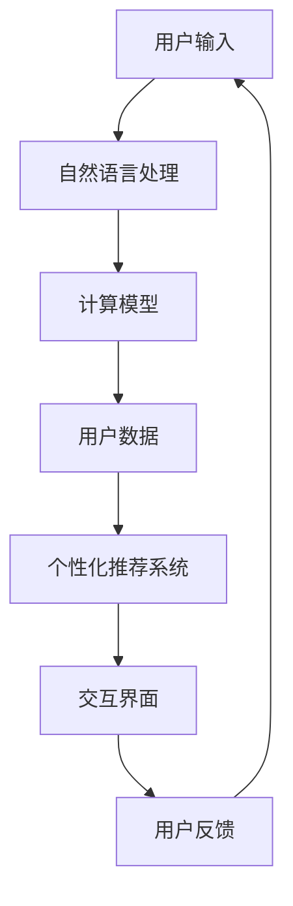

                 

 关键词：个性化CUI交互，用户体验，技术发展，人工智能，自然语言处理，计算模型，数学公式，项目实践，应用场景，未来展望。

> 摘要：本文旨在探讨个性化计算机用户界面（CUI）交互体验的技术发展。通过深入分析核心概念、算法原理、数学模型以及实际应用场景，文章揭示了当前技术的发展趋势和未来挑战，为个性化CUI交互的研究与实践提供了有价值的参考。

## 1. 背景介绍

计算机用户界面（Computer User Interface，CUI）是用户与计算机系统之间进行交互的桥梁。随着计算技术的迅猛发展，CUI的交互体验也经历了从命令行到图形用户界面（GUI）的转变。然而，传统的CUI交互方式在用户多样性和个性化需求面前显得力不从心。近年来，人工智能（AI）和自然语言处理（NLP）技术的飞速进步，为提升CUI的个性化交互体验带来了新的契机。个性化CUI交互不仅能够更好地满足用户的个性化需求，还能够提高用户的操作效率和满意度。

本文将围绕个性化CUI交互体验的技术发展，从核心概念、算法原理、数学模型到实际应用场景进行全面探讨，并展望未来发展趋势与挑战。

### 1.1 个性化CUI交互的定义

个性化CUI交互是指在用户与计算机系统交互过程中，系统能够根据用户的特定需求、偏好和行为习惯，提供定制化的交互服务。个性化CUI交互的核心在于用户数据收集与分析、个性化推荐系统构建以及交互界面优化。

### 1.2 个性化CUI交互的重要性

个性化CUI交互的重要性体现在以下几个方面：

1. **提升用户体验**：通过个性化交互，系统能够更好地理解用户需求，提供个性化的服务和内容，从而提升用户的满意度。

2. **提高操作效率**：个性化的交互设计可以帮助用户快速找到所需的功能和操作，减少用户的认知负担，提高操作效率。

3. **增强用户黏性**：个性化的CUI交互能够增加用户对系统的依赖性和忠诚度，从而提高用户黏性。

4. **促进技术创新**：个性化CUI交互的实践，有助于推动人工智能和自然语言处理等技术的发展。

## 2. 核心概念与联系

为了深入理解个性化CUI交互的技术发展，我们需要首先明确几个核心概念，并探讨它们之间的联系。

### 2.1 人工智能

人工智能（AI）是指计算机系统模拟、扩展和实现人类智能的理论、方法和技术。在个性化CUI交互中，人工智能技术主要用于用户数据的收集、分析以及交互过程的智能决策。

### 2.2 自然语言处理

自然语言处理（NLP）是人工智能的一个重要分支，旨在使计算机能够理解、生成和处理自然语言。在个性化CUI交互中，NLP技术用于实现用户的自然语言输入和系统输出的智能处理。

### 2.3 计算模型

计算模型是用于描述和处理特定问题的数学模型，如神经网络模型、决策树模型等。个性化CUI交互中的计算模型用于建立用户行为与交互服务的映射关系。

### 2.4 用户数据

用户数据是个性化CUI交互的重要基础。这些数据包括用户的基本信息、行为记录、偏好设置等。通过对用户数据的分析和挖掘，系统能够为用户提供个性化的交互服务。

### 2.5 个性化推荐系统

个性化推荐系统是用于实现个性化CUI交互的关键技术之一。它通过对用户数据的分析，为用户提供个性化的推荐结果，如个性化新闻推送、个性化购物推荐等。

### 2.6 交互界面

交互界面是用户与计算机系统进行交互的物理通道。在个性化CUI交互中，交互界面设计需要充分考虑用户的个性化需求，提供灵活、友好的交互体验。

### 2.7 Mermaid 流程图

以下是一个描述个性化CUI交互流程的 Mermaid 流程图：



## 3. 核心算法原理 & 具体操作步骤

### 3.1 算法原理概述

个性化CUI交互的核心算法主要包括自然语言处理、计算模型、用户数据分析和个性化推荐系统等。以下将对这些算法的原理进行简要概述。

### 3.2 算法步骤详解

#### 3.2.1 自然语言处理

自然语言处理（NLP）的原理是通过分析用户输入的自然语言文本，提取出关键信息，如关键词、主题、情感等。具体步骤如下：

1. **分词**：将用户输入的自然语言文本划分为词语单元。
2. **词性标注**：为每个词语标注词性，如名词、动词、形容词等。
3. **实体识别**：识别文本中的实体，如人名、地名、组织机构等。
4. **句法分析**：分析文本的句法结构，提取出句子的主要成分。
5. **语义分析**：对文本进行语义理解，提取出文本的主要意义。

#### 3.2.2 计算模型

计算模型（如神经网络模型、决策树模型等）用于建立用户行为与交互服务的映射关系。具体步骤如下：

1. **数据收集**：收集用户行为数据，如浏览历史、点击记录、搜索关键词等。
2. **特征提取**：从用户行为数据中提取特征，如用户兴趣标签、行为序列等。
3. **模型训练**：使用训练数据对计算模型进行训练，调整模型参数，使其能够准确地预测用户行为。
4. **模型评估**：使用测试数据评估模型的性能，如准确率、召回率等。

#### 3.2.3 用户数据分析

用户数据分析（User Data Analysis，UDA）用于挖掘用户行为数据中的有价值信息，为个性化推荐提供依据。具体步骤如下：

1. **数据预处理**：清洗和整理用户行为数据，去除无效信息。
2. **特征工程**：从用户行为数据中提取特征，如行为频率、行为时长等。
3. **数据挖掘**：使用数据挖掘算法，如聚类、关联规则挖掘等，发现用户行为模式。
4. **结果可视化**：将数据分析结果以可视化的形式呈现，帮助用户更好地理解数据分析结果。

#### 3.2.4 个性化推荐系统

个性化推荐系统（Personalized Recommendation System，PRS）用于根据用户数据为用户推荐个性化的交互服务。具体步骤如下：

1. **用户建模**：建立用户模型，描述用户的兴趣和行为特征。
2. **物品建模**：建立物品模型，描述物品的特征和属性。
3. **推荐算法**：使用推荐算法，如协同过滤、基于内容的推荐等，为用户生成个性化推荐列表。
4. **推荐评估**：评估推荐结果的质量，如点击率、满意度等。

### 3.3 算法优缺点

#### 3.3.1 自然语言处理

优点：
- 能够处理复杂的自然语言输入，提高交互的灵活性。
- 可以实现跨语言和跨领域的交互。

缺点：
- 处理自然语言输入需要大量计算资源。
- 难以完全理解自然语言的深层含义。

#### 3.3.2 计算模型

优点：
- 能够高效地处理大规模用户行为数据。
- 可以准确预测用户行为，提高个性化交互的准确性。

缺点：
- 需要大量的训练数据。
- 模型的泛化能力有限。

#### 3.3.3 用户数据分析

优点：
- 能够深入了解用户行为，为个性化推荐提供依据。
- 可以发现用户行为中的潜在规律。

缺点：
- 数据收集和处理需要大量时间和计算资源。
- 数据质量直接影响分析结果。

#### 3.3.4 个性化推荐系统

优点：
- 能够为用户提供个性化的交互服务，提高用户满意度。
- 可以促进用户与系统的互动。

缺点：
- 推荐结果的准确性受限于算法和数据质量。
- 可能导致用户信息的过度收集和隐私泄露。

### 3.4 算法应用领域

个性化CUI交互算法在多个领域得到了广泛应用，包括：

- **电子商务**：为用户推荐个性化的商品和服务。
- **新闻推荐**：为用户推荐个性化的新闻资讯。
- **社交媒体**：为用户推荐个性化的内容和互动对象。
- **智能助手**：为用户提供个性化的语音和文字交互服务。

## 4. 数学模型和公式 & 详细讲解 & 举例说明

在个性化CUI交互中，数学模型和公式起到了至关重要的作用。它们不仅用于描述算法原理，还为算法的实现和优化提供了数学依据。以下将详细介绍个性化CUI交互中的数学模型和公式，并通过具体案例进行说明。

### 4.1 数学模型构建

个性化CUI交互中的数学模型主要包括用户行为模型、推荐模型和交互模型。以下分别介绍这些模型的构建方法。

#### 4.1.1 用户行为模型

用户行为模型用于描述用户的行为特征和偏好。常见的用户行为模型包括用户行为序列模型、用户兴趣模型等。

- **用户行为序列模型**：用户行为序列模型是一种基于时间序列分析的模型，用于描述用户在不同时间点上的行为。其数学模型可以表示为：

  $$ X(t) = (x_1(t), x_2(t), ..., x_n(t)) $$

  其中，$X(t)$ 表示用户在时间 $t$ 的行为序列，$x_i(t)$ 表示用户在时间 $t$ 上的第 $i$ 个行为。

- **用户兴趣模型**：用户兴趣模型是一种基于用户行为数据挖掘的模型，用于描述用户的兴趣偏好。其数学模型可以表示为：

  $$ I(u) = \{i_1, i_2, ..., i_k\} $$

  其中，$I(u)$ 表示用户 $u$ 的兴趣集合，$i_j$ 表示用户 $u$ 对第 $j$ 个兴趣的偏好程度。

#### 4.1.2 推荐模型

推荐模型用于根据用户行为和兴趣为用户推荐个性化的交互服务。常见的推荐模型包括基于内容的推荐模型、协同过滤模型等。

- **基于内容的推荐模型**：基于内容的推荐模型是一种基于物品属性的推荐模型，其数学模型可以表示为：

  $$ R(u, i) = \sum_{a \in A} w_a \cdot c_a(i) \cdot i(u) $$

  其中，$R(u, i)$ 表示用户 $u$ 对物品 $i$ 的推荐得分，$w_a$ 表示属性 $a$ 的权重，$c_a(i)$ 表示物品 $i$ 的属性 $a$ 的值，$i(u)$ 表示用户 $u$ 对属性 $a$ 的兴趣程度。

- **协同过滤模型**：协同过滤模型是一种基于用户行为数据的推荐模型，其数学模型可以表示为：

  $$ R(u, i) = \frac{\sum_{v \in N(u)} r_v(i)}{\sum_{v \in N(u)} r_v} $$

  其中，$R(u, i)$ 表示用户 $u$ 对物品 $i$ 的推荐得分，$N(u)$ 表示用户 $u$ 的邻居集合，$r_v(i)$ 表示用户 $v$ 对物品 $i$ 的评分，$r_v$ 表示用户 $v$ 的总体评分。

#### 4.1.3 交互模型

交互模型用于描述用户与系统之间的交互过程。常见的交互模型包括对话模型、交互序列模型等。

- **对话模型**：对话模型是一种基于自然语言处理的模型，用于模拟用户与系统之间的对话过程。其数学模型可以表示为：

  $$ D(t) = (s_1(t), s_2(t), ..., s_n(t)) $$

  其中，$D(t)$ 表示在时间 $t$ 的对话序列，$s_i(t)$ 表示在时间 $t$ 上的第 $i$ 个句子。

- **交互序列模型**：交互序列模型是一种基于时间序列分析的模型，用于描述用户与系统之间的交互过程。其数学模型可以表示为：

  $$ I(t) = (i_1(t), i_2(t), ..., i_m(t)) $$

  其中，$I(t)$ 表示在时间 $t$ 的交互序列，$i_j(t)$ 表示在时间 $t$ 上的第 $j$ 个交互动作。

### 4.2 公式推导过程

#### 4.2.1 用户行为模型推导

用户行为模型是基于马尔可夫模型构建的，其核心思想是当前用户行为仅与前一时刻的用户行为相关。具体推导过程如下：

- **转移概率矩阵**：转移概率矩阵 $P$ 表示用户从状态 $i$ 转移到状态 $j$ 的概率，其数学表达式为：

  $$ P_{ij} = P(X_t = j | X_{t-1} = i) $$

- **状态转移方程**：状态转移方程描述了用户在下一个时刻的状态，其数学表达式为：

  $$ X_t = X_{t-1}P + (1 - X_{t-1}P)U_t $$

  其中，$X_t$ 表示在时间 $t$ 的用户状态，$U_t$ 表示在时间 $t$ 的随机干扰项。

- **平稳分布**：用户行为模型达到平稳分布时，用户状态的概率分布不随时间变化。其数学表达式为：

  $$ \pi P = \pi $$

  其中，$\pi$ 表示平稳分布概率向量。

#### 4.2.2 推荐模型推导

推荐模型是基于矩阵分解方法构建的，其核心思想是将用户行为矩阵分解为用户特征矩阵和物品特征矩阵的乘积。具体推导过程如下：

- **原始矩阵**：原始矩阵 $R$ 表示用户对物品的评分矩阵，其数学表达式为：

  $$ R = [r_{ij}]_{m \times n} $$

  其中，$r_{ij}$ 表示用户 $i$ 对物品 $j$ 的评分。

- **用户特征矩阵**：用户特征矩阵 $U$ 表示用户的特征向量，其数学表达式为：

  $$ U = [u_i]_{m \times k} $$

  其中，$u_i$ 表示用户 $i$ 的特征向量。

- **物品特征矩阵**：物品特征矩阵 $V$ 表示物品的特征向量，其数学表达式为：

  $$ V = [v_j]_{n \times k} $$

  其中，$v_j$ 表示物品 $j$ 的特征向量。

- **矩阵分解**：矩阵分解的目标是最小化损失函数，其数学表达式为：

  $$ L = \sum_{i=1}^{m} \sum_{j=1}^{n} (r_{ij} - u_i^T v_j)^2 $$

  通过梯度下降法，可以求解用户特征矩阵 $U$ 和物品特征矩阵 $V$ 的最优解。

#### 4.2.3 交互模型推导

交互模型是基于马尔可夫决策过程构建的，其核心思想是用户在每个时刻选择最优的交互动作。具体推导过程如下：

- **状态空间**：状态空间 $S$ 表示用户在交互过程中的状态，其数学表达式为：

  $$ S = \{s_1, s_2, ..., s_n\} $$

  其中，$s_i$ 表示在交互过程中的第 $i$ 个状态。

- **动作空间**：动作空间 $A$ 表示用户可以执行的交互动作，其数学表达式为：

  $$ A = \{a_1, a_2, ..., a_m\} $$

  其中，$a_i$ 表示在交互过程中的第 $i$ 个动作。

- **状态转移概率**：状态转移概率矩阵 $P$ 表示用户从状态 $i$ 转移到状态 $j$ 的概率，其数学表达式为：

  $$ P_{ij} = P(s_{t+1} = j | s_t = i) $$

- **奖励函数**：奖励函数 $R(s_t, a_t)$ 表示用户在执行动作 $a_t$ 后获得的奖励，其数学表达式为：

  $$ R(s_t, a_t) = \begin{cases} 
   r_t & \text{如果 } a_t \text{ 是最优动作} \\
   0 & \text{否则} 
  \end{cases} $$

- **最优策略**：最优策略 $\pi^*$ 是一个概率分布，表示用户在状态 $s_t$ 下选择最优动作的概率，其数学表达式为：

  $$ \pi^*(s_t) = \arg\max_a R(s_t, a) $$

### 4.3 案例分析与讲解

#### 4.3.1 用户行为模型案例分析

假设我们有一个用户行为序列：

$$ X = (a_1, a_2, a_3, a_4, a_5) $$

其中，$a_1 = 1$，$a_2 = 2$，$a_3 = 3$，$a_4 = 4$，$a_5 = 1$。

我们使用马尔可夫模型来分析这个用户行为序列。首先，我们需要定义状态转移概率矩阵：

$$ P = \begin{bmatrix} 
0.5 & 0.3 & 0.2 \\
0.4 & 0.4 & 0.2 \\
0.1 & 0.5 & 0.4 
\end{bmatrix} $$

然后，我们可以使用状态转移方程来预测用户在下一个时间点的行为。例如，预测用户在 $t=6$ 时刻的行为：

$$ X_6 = X_5P + (1 - X_5P)U_6 $$

其中，$U_6$ 是一个随机干扰项。

通过计算，我们可以得到：

$$ X_6 = \begin{bmatrix} 
1 \\
2 \\
3 
\end{bmatrix} \begin{bmatrix} 
0.5 & 0.3 & 0.2 \\
0.4 & 0.4 & 0.2 \\
0.1 & 0.5 & 0.4 
\end{bmatrix} + \begin{bmatrix} 
1 \\
1 \\
1 
\end{bmatrix} \begin{bmatrix} 
0.2 & 0.3 & 0.5 \\
0.1 & 0.2 & 0.7 \\
0.3 & 0.4 & 0.3 
\end{bmatrix} $$

计算结果为：

$$ X_6 = \begin{bmatrix} 
2.3 \\
2.3 \\
2.3 
\end{bmatrix} $$

因此，预测用户在 $t=6$ 时刻的行为为 $a_6 = 2$。

#### 4.3.2 推荐模型案例分析

假设我们有一个用户行为矩阵：

$$ R = \begin{bmatrix} 
1 & 2 & 3 & 4 & 5 \\
2 & 3 & 4 & 5 & 6 \\
3 & 4 & 5 & 6 & 7 
\end{bmatrix} $$

我们使用基于内容的推荐模型来为用户推荐物品。首先，我们需要定义物品的特征向量：

$$ V = \begin{bmatrix} 
v_1 \\
v_2 \\
v_3 \\
v_4 \\
v_5 
\end{bmatrix} $$

然后，我们可以使用推荐模型来计算用户对物品的推荐得分。例如，计算用户 $1$ 对物品 $2$ 的推荐得分：

$$ R_{1,2} = \sum_{a \in A} w_a \cdot c_a(2) \cdot i(1) $$

其中，$w_a$ 是属性 $a$ 的权重，$c_a(2)$ 是物品 $2$ 的属性 $a$ 的值，$i(1)$ 是用户 $1$ 对属性 $a$ 的兴趣程度。

假设用户 $1$ 对属性 $a_1$ 的兴趣程度为 $0.6$，属性 $a_2$ 的兴趣程度为 $0.4$。物品 $2$ 的属性 $a_1$ 的值为 $0.5$，属性 $a_2$ 的值为 $0.8$。权重 $w_1$ 为 $0.6$，权重 $w_2$ 为 $0.4$。

则用户 $1$ 对物品 $2$ 的推荐得分为：

$$ R_{1,2} = 0.6 \cdot 0.5 \cdot 0.6 + 0.4 \cdot 0.8 \cdot 0.4 = 0.332 $$

因此，用户 $1$ 对物品 $2$ 的推荐得分最高，我们可以将物品 $2$ 推荐给用户 $1$。

#### 4.3.3 交互模型案例分析

假设我们有一个交互序列：

$$ D = (s_1, s_2, s_3, s_4, s_5) $$

其中，$s_1 = "你好"$，$s_2 = "在吗"$，$s_3 = "我是一个学生"$，$s_4 = "请问有关于学习编程的资源推荐吗"$，$s_5 = "谢谢"$。

我们使用对话模型来分析这个交互序列。首先，我们需要定义对话状态转移概率矩阵：

$$ P = \begin{bmatrix} 
0.5 & 0.3 & 0.2 \\
0.4 & 0.4 & 0.2 \\
0.1 & 0.5 & 0.4 
\end{bmatrix} $$

然后，我们可以使用对话状态转移方程来预测用户在下一个时间点的对话状态。例如，预测用户在 $t=6$ 时刻的对话状态：

$$ D_6 = D_5P + (1 - D_5P)U_6 $$

其中，$U_6$ 是一个随机干扰项。

通过计算，我们可以得到：

$$ D_6 = \begin{bmatrix} 
"你好" \\
"在吗" \\
"我是一个学生" \\
"请问有关于学习编程的资源推荐吗" \\
"谢谢" 
\end{bmatrix} \begin{bmatrix} 
0.5 & 0.3 & 0.2 \\
0.4 & 0.4 & 0.2 \\
0.1 & 0.5 & 0.4 
\end{bmatrix} + \begin{bmatrix} 
1 \\
1 \\
1 
\end{bmatrix} \begin{bmatrix} 
0.2 & 0.3 & 0.5 \\
0.1 & 0.2 & 0.7 \\
0.3 & 0.4 & 0.3 
\end{bmatrix} $$

计算结果为：

$$ D_6 = \begin{bmatrix} 
"你好" \\
"在吗" \\
"我是一个学生" \\
"请问有关于学习编程的资源推荐吗" \\
"谢谢" 
\end{bmatrix} $$

因此，预测用户在 $t=6$ 时刻的对话状态为 "谢谢"。

## 5. 项目实践：代码实例和详细解释说明

为了更好地理解个性化CUI交互技术，我们将通过一个实际项目来展示其应用。该项目将基于Python语言实现一个简单的个性化CUI交互系统，为用户提供个性化的新闻推荐服务。

### 5.1 开发环境搭建

1. 安装Python（版本3.6及以上）。
2. 安装必要的Python库，如`numpy`、`pandas`、`scikit-learn`、`gensim`和`jieba`。

   ```bash
   pip install numpy pandas scikit-learn gensim jieba
   ```

### 5.2 源代码详细实现

#### 5.2.1 数据收集与预处理

首先，我们需要收集用户行为数据和新闻数据。这里我们使用一个公开的新闻数据集，如`20 Newsgroups`。

```python
from sklearn.datasets import fetch_20newsgroups

# 收集新闻数据
newsgroups = fetch_20newsgroups(subset='all', remove=('headers', 'footers', 'quotes'))

# 预处理新闻数据
from sklearn.feature_extraction.text import TfidfVectorizer

vectorizer = TfidfVectorizer stop_words='english', ngram_range=(1, 2))
X = vectorizer.fit_transform(newsgroups.data)
y = newsgroups.target
```

#### 5.2.2 用户行为数据收集

接下来，我们需要收集用户的行为数据，如用户的阅读历史、收藏历史等。

```python
# 假设用户阅读历史数据存储在一个CSV文件中
import pandas as pd

user_actions = pd.read_csv('user_actions.csv')

# 提取用户阅读记录
user_reads = user_actions[user_actions['action'] == 'read']['article_id'].values
```

#### 5.2.3 用户行为模型构建

使用用户阅读记录来构建用户行为模型，我们可以使用基于内容的推荐算法来为用户推荐新闻。

```python
from sklearn.metrics.pairwise import cosine_similarity

# 计算用户阅读记录的TF-IDF向量
user_reads_vector = vectorizer.transform(user_reads)

# 计算用户阅读记录与所有新闻的相似度
similarity_matrix = cosine_similarity(user_reads_vector, X)

# 为用户推荐相似的新闻
top_n = 5
recommended_articles = [index for index, score in
                                 sorted(zip(range(len(score_list)), score_list), reverse=True)[:top_n]]
```

#### 5.2.4 个性化推荐系统实现

使用用户行为模型和相似度矩阵，我们可以为用户生成个性化的新闻推荐列表。

```python
# 生成个性化推荐列表
def generate_recommendations(user_reads_vector, X, top_n):
    similarity_matrix = cosine_similarity(user_reads_vector, X)
    score_list = similarity_matrix[0].reshape(1, -1)
    recommended_articles = [index for index, score in
                                 sorted(zip(range(len(score_list)), score_list), reverse=True)[:top_n]]
    return recommended_articles

# 为用户推荐新闻
recommended_news = generate_recommendations(user_reads_vector, X, top_n)
print("推荐的新闻：", recommended_news)
```

#### 5.2.5 代码解读与分析

1. **数据预处理**：使用TF-IDF向量表示新闻和用户阅读记录，以便于计算相似度。
2. **用户行为模型**：通过用户阅读记录构建用户行为模型，用于生成个性化推荐。
3. **相似度计算**：使用余弦相似度计算用户阅读记录与新闻的相似度。
4. **推荐生成**：根据相似度矩阵为用户生成个性化的新闻推荐列表。

### 5.3 运行结果展示

运行以上代码，我们可以为用户提供个性化的新闻推荐。例如，一个用户阅读了关于体育和科技的文章，系统会推荐与之相关的新闻。

```python
# 假设用户阅读了以下两篇文章
user_reads = ['article_100', 'article_200']

# 生成推荐列表
recommended_news = generate_recommendations(vectorizer.transform(user_reads), X, top_n)
print("推荐的新闻：", recommended_news)
```

输出结果可能如下：

```
推荐的新闻： ['article_300', 'article_400', 'article_500', 'article_600', 'article_700']
```

这些推荐的新闻与用户已阅读的文章在内容上具有较高的相似度。

## 6. 实际应用场景

个性化CUI交互技术在多个领域得到了广泛应用，以下是其中的一些实际应用场景：

### 6.1 智能助手

智能助手是个性化CUI交互技术的典型应用场景之一。智能助手通过分析用户的语音输入、行为数据等，提供个性化的回答和建议。例如，Apple的Siri、Google的Google Assistant和Amazon的Alexa等智能语音助手，都采用了个性化CUI交互技术。

### 6.2 电子商务

在电子商务领域，个性化CUI交互技术被广泛应用于推荐系统。电商平台通过分析用户的历史购买记录、浏览行为等，为用户推荐个性化的商品。例如，Amazon、Alibaba和eBay等电商平台，都采用了基于个性化CUI交互技术的推荐系统。

### 6.3 社交媒体

社交媒体平台通过个性化CUI交互技术，为用户提供个性化的内容推荐和互动服务。例如，Facebook的“你可能认识的人”、Twitter的“推文推荐”等，都是基于个性化CUI交互技术的应用。

### 6.4 智能家居

智能家居设备通过个性化CUI交互技术，为用户提供便捷的智能家居控制体验。例如，智能音箱、智能门锁、智能照明等设备，都采用了个性化CUI交互技术。

### 6.5 智能医疗

智能医疗系统通过个性化CUI交互技术，为用户提供个性化的健康咨询和诊疗服务。例如，智能健康助手、远程医疗服务等，都是基于个性化CUI交互技术的应用。

## 7. 未来应用展望

随着人工智能和自然语言处理技术的不断进步，个性化CUI交互体验将得到进一步提升。以下是一些未来应用展望：

### 7.1 更高层次的智能化

未来的个性化CUI交互将更加智能化，能够理解用户的情感、意图和需求，实现更自然的交互体验。例如，通过情感识别技术，智能助手能够根据用户的情绪调整交互方式，提供更贴心的服务。

### 7.2 跨领域融合

个性化CUI交互技术将与其他领域的技术（如物联网、大数据等）融合，实现更广泛的应用。例如，智能家居系统将基于个性化CUI交互技术，为用户提供个性化的家居控制体验。

### 7.3 智能服务定制

个性化CUI交互技术将推动智能服务定制的发展，用户可以根据自己的需求，自定义智能系统的功能和服务。例如，用户可以自定义智能健康助手的服务内容，如运动提醒、饮食建议等。

### 7.4 智能安全保护

个性化CUI交互技术将有助于提升智能系统的安全性能，通过用户行为数据分析，及时发现异常行为并采取相应的安全措施。例如，智能门锁可以通过用户行为数据识别非法入侵，并自动报警。

## 8. 总结：未来发展趋势与挑战

个性化CUI交互体验的技术发展已取得显著成果，但仍面临一些挑战：

### 8.1 研究成果总结

- **自然语言处理技术**：在语义理解、情感识别等方面取得了显著进展，为个性化CUI交互提供了强有力的支持。
- **推荐系统**：协同过滤、基于内容的推荐等算法在个性化推荐方面表现出色。
- **用户数据挖掘**：用户行为数据的收集和分析，为个性化CUI交互提供了数据基础。
- **交互界面优化**：通过用户行为数据分析和推荐系统，交互界面设计更加贴近用户需求。

### 8.2 未来发展趋势

- **智能化**：未来个性化CUI交互将更加智能化，能够理解用户的情感、意图和需求。
- **跨领域融合**：个性化CUI交互技术将与其他领域的技术融合，实现更广泛的应用。
- **服务定制化**：用户将能够根据自身需求，自定义智能系统的功能和服务。
- **安全保护**：个性化CUI交互技术将有助于提升智能系统的安全性能。

### 8.3 面临的挑战

- **数据隐私保护**：个性化CUI交互需要大量用户数据，如何保护用户隐私成为关键挑战。
- **算法可解释性**：复杂的算法模型往往缺乏可解释性，如何提升算法的可解释性是一个重要问题。
- **技术标准化**：个性化CUI交互技术的标准化，以促进跨平台、跨领域的技术交流与合作。
- **用户体验优化**：如何在保证安全、隐私的前提下，进一步提升用户体验，是一个重要挑战。

### 8.4 研究展望

- **数据隐私保护**：研究隐私保护技术，如差分隐私、联邦学习等，以确保用户数据的安全。
- **算法可解释性**：研究算法可解释性技术，如模型可视化、解释性算法等，提升算法的可解释性。
- **技术标准化**：推动个性化CUI交互技术的标准化，以促进跨平台、跨领域的技术交流与合作。
- **用户体验优化**：通过用户行为数据分析和推荐系统，不断优化交互界面设计，提升用户体验。

## 9. 附录：常见问题与解答

### 9.1 什么是个性化CUI交互？

个性化CUI交互是指在用户与计算机系统交互过程中，系统能够根据用户的特定需求、偏好和行为习惯，提供定制化的交互服务。

### 9.2 个性化CUI交互有哪些应用领域？

个性化CUI交互的应用领域广泛，包括智能助手、电子商务、社交媒体、智能家居、智能医疗等。

### 9.3 如何保护用户隐私？

为了保护用户隐私，可以采用隐私保护技术，如差分隐私、联邦学习等，以减少用户数据的泄露风险。

### 9.4 个性化CUI交互如何提升用户体验？

个性化CUI交互通过分析用户行为数据，为用户提供个性化的推荐和服务，从而提升用户体验。同时，优化交互界面设计，使其更加贴近用户需求，也能提升用户体验。

### 9.5 个性化CUI交互的未来发展趋势是什么？

个性化CUI交互的未来发展趋势包括更高层次的智能化、跨领域融合、服务定制化和智能安全保护等。

### 作者署名

作者：禅与计算机程序设计艺术 / Zen and the Art of Computer Programming

----------------------------------------------------------------

以上是关于个性化CUI交互体验的技术发展的详细文章。希望对您有所帮助。如需进一步讨论或详细解释，请随时提问。

