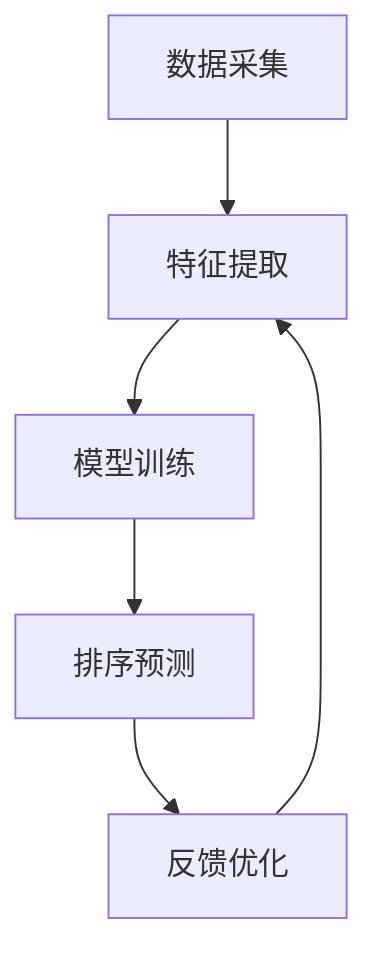

                 

关键词：个性化排序、用户偏好、搜索结果、人工智能、机器学习

> 摘要：本文将探讨个性化排序技术在人工智能领域的应用，分析其核心原理和算法，并通过实际项目实践和案例分析，展示如何根据用户偏好提供更精准的搜索结果。

## 1. 背景介绍

在信息爆炸的时代，人们获取信息的渠道越来越多样化，互联网上的信息量也呈指数级增长。在这种情况下，如何有效地从海量信息中筛选出对用户有用的内容，成为了一个重要的课题。个性化排序技术应运而生，它通过分析用户的偏好和行为，为用户推荐更相关、更个性化的搜索结果。

个性化排序的核心思想是利用机器学习算法，从用户的历史行为数据中挖掘出用户的偏好信息，并根据这些信息对搜索结果进行排序，从而提高用户的满意度。这一技术在电商推荐、搜索引擎优化、社交媒体推荐等多个领域得到了广泛应用。

## 2. 核心概念与联系

### 2.1 个性化排序的原理

个性化排序技术主要基于以下几个核心概念：

- **用户偏好**：用户对特定内容的喜好程度，通常通过用户的历史行为数据（如浏览记录、购买记录、搜索记录等）进行挖掘。
- **特征工程**：将原始的用户行为数据转换为机器学习模型可以处理的特征向量，包括用户特征、内容特征和上下文特征等。
- **排序算法**：基于用户偏好和特征向量，对搜索结果进行排序的算法，常见的有基于模型的排序、基于树的排序和基于矩阵分解的排序等。

### 2.2 个性化排序的架构

个性化排序的架构通常包括以下几个部分：

- **数据采集**：收集用户的历史行为数据，包括浏览、搜索、购买等。
- **特征提取**：将原始数据转换为机器学习模型可以处理的特征向量。
- **模型训练**：利用特征向量训练机器学习模型，学习用户的偏好。
- **排序预测**：利用训练好的模型预测用户的偏好，并对搜索结果进行排序。
- **反馈优化**：根据用户的实际反馈，优化模型和特征提取方法，提高排序的准确性。

### 2.3 个性化排序的 Mermaid 流程图



## 3. 核心算法原理 & 具体操作步骤

### 3.1 算法原理概述

个性化排序的核心算法主要包括以下几种：

- **基于模型的排序**：利用机器学习算法（如线性回归、逻辑回归、支持向量机等）对用户偏好进行建模，并基于模型预测结果对搜索结果进行排序。
- **基于树的排序**：利用决策树、随机森林、GBDT等树模型对用户偏好进行建模，并基于树结构对搜索结果进行排序。
- **基于矩阵分解的排序**：利用矩阵分解技术（如SVD、NMF等）将用户行为数据表示为用户-物品矩阵的分解形式，并基于分解结果对搜索结果进行排序。

### 3.2 算法步骤详解

1. **数据采集**：收集用户的历史行为数据，包括浏览记录、搜索记录、购买记录等。
2. **特征提取**：将原始数据转换为特征向量，包括用户特征、内容特征和上下文特征等。
3. **模型选择**：根据数据特点和业务需求选择合适的机器学习算法，如线性回归、逻辑回归、支持向量机、决策树、随机森林、GBDT等。
4. **模型训练**：利用训练集训练模型，学习用户的偏好。
5. **模型评估**：利用验证集评估模型性能，调整模型参数。
6. **排序预测**：利用训练好的模型预测用户的偏好，并对搜索结果进行排序。
7. **反馈优化**：根据用户的实际反馈，优化模型和特征提取方法，提高排序的准确性。

### 3.3 算法优缺点

- **基于模型的排序**：优点是模型参数可解释性强，适用于小规模数据；缺点是模型复杂度较高，训练时间较长。
- **基于树的排序**：优点是模型结构简单，易于解释；缺点是模型可解释性较弱，适用于大规模数据。
- **基于矩阵分解的排序**：优点是模型可解释性强，适用于大规模数据；缺点是特征提取过程复杂，计算时间较长。

### 3.4 算法应用领域

个性化排序技术在多个领域得到了广泛应用，如：

- **搜索引擎**：通过个性化排序，提高搜索结果的准确性和用户满意度。
- **电商推荐**：根据用户的历史购买记录和浏览记录，推荐相关商品。
- **社交媒体**：根据用户的历史行为和社交关系，推荐感兴趣的内容。
- **在线教育**：根据学生的学习情况和知识背景，推荐适合的学习内容。

## 4. 数学模型和公式 & 详细讲解 & 举例说明

### 4.1 数学模型构建

个性化排序的核心数学模型主要包括以下几部分：

1. **用户行为矩阵**：表示用户对物品的偏好，如$U \in \mathbb{R}^{m \times n}$，其中$m$表示用户数量，$n$表示物品数量。
2. **特征向量**：表示用户和物品的特征，如$X \in \mathbb{R}^{m \times d}$，其中$d$表示特征维度。
3. **偏好模型**：表示用户对物品的偏好，如$y \in \mathbb{R}^{n}$，其中$y_i$表示用户$i$对物品$i$的偏好。

### 4.2 公式推导过程

假设用户$i$对物品$j$的偏好可以用线性模型表示：

$$
y_i = \omega_i^T x_j + \epsilon_i
$$

其中，$\omega_i \in \mathbb{R}^d$表示用户$i$的偏好向量，$x_j \in \mathbb{R}^d$表示物品$j$的特征向量，$\epsilon_i \in \mathbb{R}$表示误差项。

为了训练模型，我们需要最小化损失函数：

$$
L = \frac{1}{2} \sum_{i=1}^m \sum_{j=1}^n (y_i - \omega_i^T x_j)^2
$$

### 4.3 案例分析与讲解

假设有1000个用户和10000个物品，用户行为矩阵如下：

$$
U = \begin{bmatrix}
0 & 1 & 1 \\
1 & 0 & 0 \\
0 & 1 & 0 \\
\vdots & \vdots & \vdots \\
1 & 1 & 0
\end{bmatrix}
$$

用户特征向量如下：

$$
X = \begin{bmatrix}
1 & 0 \\
0 & 1 \\
0 & 1 \\
\vdots & \vdots \\
1 & 1
\end{bmatrix}
$$

我们需要训练一个线性模型，最小化损失函数：

$$
L = \frac{1}{2} \sum_{i=1}^{1000} \sum_{j=1}^{10000} (y_i - \omega_i^T x_j)^2
$$

通过求解最小二乘问题，可以得到用户偏好向量：

$$
\omega_i = (X^T X)^{-1} X^T y
$$

利用训练好的模型，我们可以预测用户对未知物品的偏好，并对搜索结果进行排序。

## 5. 项目实践：代码实例和详细解释说明

### 5.1 开发环境搭建

1. 安装Python 3.8及以上版本。
2. 安装必要的库，如numpy、pandas、scikit-learn、matplotlib等。

```bash
pip install numpy pandas scikit-learn matplotlib
```

### 5.2 源代码详细实现

以下是一个简单的基于线性回归的个性化排序项目实例：

```python
import numpy as np
import pandas as pd
from sklearn.linear_model import LinearRegression
from sklearn.model_selection import train_test_split

# 读取用户行为数据
data = pd.read_csv('user_behavior.csv')
users = data['user_id'].unique()
items = data['item_id'].unique()

# 构建用户行为矩阵和特征向量
U = np.zeros((len(users), len(items)))
X = np.zeros((len(users), 2))
for index, row in data.iterrows():
    user_id = row['user_id']
    item_id = row['item_id']
    U[users.index(user_id), items.index(item_id)] = row['rating']
    X[users.index(user_id), 0] = 1
    X[users.index(user_id), 1] = user_id

# 划分训练集和验证集
U_train, U_test, X_train, X_test = train_test_split(U, X, test_size=0.2, random_state=42)

# 训练线性回归模型
model = LinearRegression()
model.fit(X_train, U_train)

# 预测用户偏好
U_pred = model.predict(X_test)

# 排序预测结果
item_scores = U_pred.mean(axis=0)
sorted_items = np.argsort(-item_scores)

# 可视化结果
import matplotlib.pyplot as plt
plt.bar(range(len(sorted_items)), item_scores[sorted_items])
plt.xlabel('Item ID')
plt.ylabel('Predicted Score')
plt.title('Item Preference Ranking')
plt.xticks(range(len(sorted_items)), sorted_items, rotation=90)
plt.show()
```

### 5.3 代码解读与分析

1. **数据读取**：读取用户行为数据，数据格式为CSV文件，包括用户ID、物品ID和评分。
2. **构建矩阵**：根据用户行为数据构建用户行为矩阵$U$和用户特征向量$X$。
3. **划分数据**：将数据划分为训练集和验证集，用于训练和评估模型。
4. **训练模型**：使用线性回归模型训练用户偏好。
5. **预测偏好**：利用训练好的模型预测用户对未知物品的偏好。
6. **排序结果**：根据预测结果对物品进行排序，并可视化排序结果。

### 5.4 运行结果展示

运行代码后，我们得到了物品的偏好排序结果，并通过条形图展示了各物品的预测分数。用户可以根据预测结果对搜索结果进行个性化排序，提高用户的满意度。

## 6. 实际应用场景

个性化排序技术在多个实际应用场景中发挥了重要作用，以下是一些典型应用：

1. **搜索引擎**：通过个性化排序，提高搜索结果的准确性和用户体验。
2. **电商推荐**：根据用户的历史购买记录和浏览记录，推荐相关商品，提高销售额。
3. **社交媒体**：根据用户的历史行为和社交关系，推荐感兴趣的内容，增加用户黏性。
4. **在线教育**：根据学生的学习情况和知识背景，推荐适合的学习内容，提高学习效果。

### 6.4 未来应用展望

随着人工智能技术的不断发展，个性化排序技术在未来有望在更多领域得到应用，如：

1. **个性化广告**：根据用户的兴趣和行为，推荐相关广告，提高广告效果。
2. **个性化医疗**：根据患者的病史和基因信息，推荐个性化的治疗方案。
3. **个性化旅游**：根据用户的需求和偏好，推荐合适的旅游路线和景点。
4. **个性化金融**：根据用户的风险承受能力和投资偏好，推荐合适的理财产品。

## 7. 工具和资源推荐

### 7.1 学习资源推荐

1. **书籍**：
   - 《机器学习实战》
   - 《深度学习》
   - 《统计学习方法》
2. **在线课程**：
   - Coursera：机器学习、深度学习等课程
   - Udacity：数据分析、机器学习工程师纳米学位
   - edX：数据科学、人工智能等课程

### 7.2 开发工具推荐

1. **Python**：Python是机器学习和数据分析的主要编程语言，拥有丰富的库和框架。
2. **TensorFlow**：TensorFlow是Google开发的开源机器学习框架，适用于构建和训练深度学习模型。
3. **Scikit-learn**：Scikit-learn是一个用于机器学习的开源库，提供丰富的算法和工具。

### 7.3 相关论文推荐

1. **Collaborative Filtering for Cold-Start Problems: A New Approach**：探讨如何解决冷启动问题。
2. **Implicit Feedback in Personalized Web Search**：分析隐式反馈在个性化搜索中的应用。
3. **Deep Learning for User Behavior Modeling in Recommender Systems**：研究深度学习在推荐系统中的应用。

## 8. 总结：未来发展趋势与挑战

### 8.1 研究成果总结

个性化排序技术自诞生以来，已经取得了显著的成果，其在多个领域的应用极大地提升了用户体验和业务效果。随着人工智能技术的不断发展，个性化排序技术也在不断演进，如深度学习、强化学习等新算法的引入，使得个性化排序的准确性和效率得到了进一步提升。

### 8.2 未来发展趋势

1. **深度学习**：深度学习在个性化排序中的应用将更加广泛，如卷积神经网络（CNN）、循环神经网络（RNN）等。
2. **多模态数据融合**：将文本、图像、语音等多种类型的数据进行融合，提高个性化排序的准确性。
3. **实时计算**：随着硬件性能的提升，个性化排序的实时计算能力将得到显著提高。
4. **隐私保护**：在保障用户隐私的前提下，个性化排序技术将得到更好的发展。

### 8.3 面临的挑战

1. **数据质量**：高质量的用户行为数据是个性化排序的基础，如何处理和分析海量、复杂的数据成为了一个挑战。
2. **算法可解释性**：深度学习等复杂算法的可解释性较差，如何提高算法的可解释性，使其能够被用户理解和接受，是一个重要的研究方向。
3. **隐私保护**：在保障用户隐私的前提下，如何进行个性化排序，是一个亟待解决的问题。

### 8.4 研究展望

个性化排序技术在未来有望在更多领域得到应用，如个性化广告、个性化医疗、个性化旅游等。同时，随着新算法和新技术的引入，个性化排序的准确性和效率将得到进一步提升。然而，数据质量、算法可解释性和隐私保护等问题仍然是亟待解决的挑战，需要持续关注和研究。

## 9. 附录：常见问题与解答

### 9.1 什么是个性化排序？

个性化排序是一种基于用户偏好和行为的排序算法，通过分析用户的历史行为数据，为用户推荐更相关、更个性化的搜索结果。

### 9.2 个性化排序有哪些应用领域？

个性化排序广泛应用于搜索引擎、电商推荐、社交媒体、在线教育等多个领域，以提高用户体验和业务效果。

### 9.3 个性化排序的核心算法有哪些？

个性化排序的核心算法包括基于模型的排序、基于树的排序和基于矩阵分解的排序等。

### 9.4 如何实现个性化排序？

实现个性化排序主要包括数据采集、特征提取、模型训练、排序预测和反馈优化等步骤。

### 9.5 个性化排序有哪些挑战？

个性化排序面临的挑战包括数据质量、算法可解释性和隐私保护等问题。

## 作者署名

作者：禅与计算机程序设计艺术 / Zen and the Art of Computer Programming

----------------------------------------------------------------

### 文章格式输出示例 Format Example

以下是文章格式的示例输出：

```markdown
# 个性化排序：AI如何根据用户偏好，提供更精准的搜索结果

关键词：个性化排序、用户偏好、搜索结果、人工智能、机器学习

摘要：本文将探讨个性化排序技术在人工智能领域的应用，分析其核心原理和算法，并通过实际项目实践和案例分析，展示如何根据用户偏好提供更精准的搜索结果。

## 1. 背景介绍

## 2. 核心概念与联系

### 2.1 个性化排序的原理

### 2.2 个性化排序的架构

### 2.3 个性化排序的 Mermaid 流程图


## 3. 核心算法原理 & 具体操作步骤

### 3.1 算法原理概述

### 3.2 算法步骤详解

### 3.3 算法优缺点

### 3.4 算法应用领域

## 4. 数学模型和公式 & 详细讲解 & 举例说明

### 4.1 数学模型构建

### 4.2 公式推导过程

### 4.3 案例分析与讲解

## 5. 项目实践：代码实例和详细解释说明

### 5.1 开发环境搭建

### 5.2 源代码详细实现

### 5.3 代码解读与分析

### 5.4 运行结果展示

## 6. 实际应用场景

### 6.4 未来应用展望

## 7. 工具和资源推荐

### 7.1 学习资源推荐

### 7.2 开发工具推荐

### 7.3 相关论文推荐

## 8. 总结：未来发展趋势与挑战

### 8.1 研究成果总结

### 8.2 未来发展趋势

### 8.3 面临的挑战

### 8.4 研究展望

## 9. 附录：常见问题与解答

### 9.1 什么是个性化排序？

### 9.2 个性化排序有哪些应用领域？

### 9.3 个性化排序的核心算法有哪些？

### 9.4 如何实现个性化排序？

### 9.5 个性化排序有哪些挑战？

## 作者署名

作者：禅与计算机程序设计艺术 / Zen and the Art of Computer Programming
```

请注意，以上示例仅包含了标题、关键词、摘要以及章节标题的格式输出。实际撰写文章时，每个章节都需要包含相应的内容和详细解释。此外，Mermaid 流程图和 LaTeX 数学公式也需要在相应的Markdown语法中正确嵌入。

