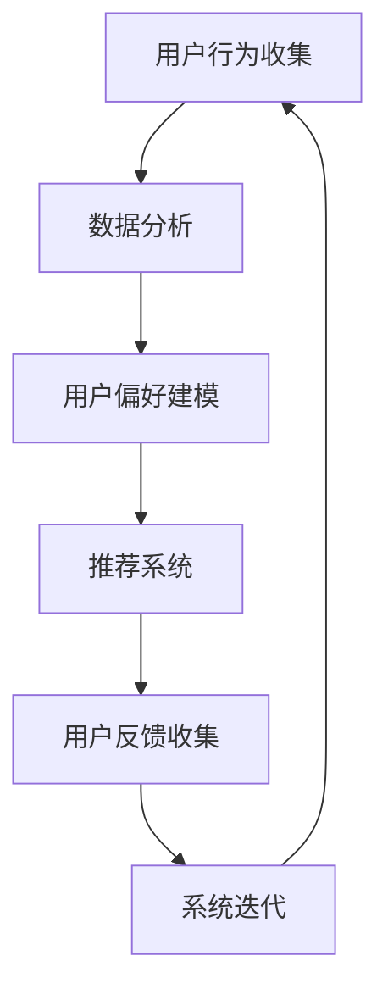

                 

关键词：个性化购物、用户体验、算法优化、推荐系统、数据分析、机器学习

> 摘要：本文将探讨如何通过算法优化、数据分析、机器学习等手段提升个性化购物体验。我们不仅会深入介绍核心概念，还会提供详细的技术实现步骤，通过案例分析和项目实践来阐述提升购物体验的有效方法。此外，我们还将展望个性化购物在未来可能的发展方向和面临的挑战。

## 1. 背景介绍

个性化购物体验是电子商务领域的一项重要研究方向。随着互联网技术的飞速发展和大数据时代的到来，用户在购物过程中对于个性化、定制化的需求日益增长。为了满足这些需求，各大电商平台纷纷投入大量资源进行个性化购物体验的优化。本文旨在通过系统的研究和分析，探讨如何利用现代信息技术手段提升个性化购物体验。

### 1.1 研究目的

本文的研究目的主要包括以下几个方面：

1. 分析个性化购物体验的现状和问题。
2. 探讨提升个性化购物体验的关键技术和方法。
3. 提供实际的项目实践和案例分析。
4. 展望个性化购物体验的未来发展方向。

### 1.2 研究意义

提升个性化购物体验对于电商平台和消费者都具有重要的意义：

1. **对于电商平台**：个性化购物体验可以提高用户黏性和转化率，从而增加销售额和市场份额。
2. **对于消费者**：个性化的购物体验可以提供更加精准的推荐，节省购物时间，提升购物满意度。

## 2. 核心概念与联系

### 2.1 个性化购物

个性化购物是指根据用户的历史行为、兴趣偏好和购物习惯，为用户推荐符合其个性化需求的商品。个性化购物不仅是电商平台的竞争手段，也是提升用户体验的关键。

### 2.2 推荐系统

推荐系统是用于向用户推荐其可能感兴趣的商品或内容的技术体系。推荐系统的工作原理主要基于用户行为分析、内容分析和协同过滤等方法。

### 2.3 数据分析

数据分析是指从大量数据中提取有价值的信息和知识的过程。在个性化购物中，数据分析可以帮助我们更好地理解用户的行为和偏好。

### 2.4 机器学习

机器学习是一种通过数据训练模型进行预测和决策的技术。在个性化购物中，机器学习可以用于用户行为预测、推荐算法优化等。

### 2.5 Mermaid 流程图

以下是一个简化的个性化购物体验提升流程的 Mermaid 流程图：



## 3. 核心算法原理 & 具体操作步骤

### 3.1 算法原理概述

个性化购物体验的提升主要依赖于推荐系统的优化。推荐系统主要分为基于内容的推荐和基于协同过滤的推荐两种。本文将重点介绍基于协同过滤的推荐算法。

### 3.2 算法步骤详解

#### 3.2.1 用户行为数据收集

收集用户在平台上的浏览、购买、收藏等行为数据，并将其存储到数据库中。

#### 3.2.2 数据预处理

对收集到的用户行为数据进行清洗、去重和归一化处理，以便于后续分析。

#### 3.2.3 建立用户-商品矩阵

根据用户行为数据，建立用户-商品矩阵，其中行表示用户，列表示商品，每个元素表示用户对商品的评分。

#### 3.2.4 协同过滤算法实现

1. **用户基于K最近邻算法**：选择与当前用户最相似的K个用户，并计算这K个用户的评分与当前用户评分的相似度。
2. **商品基于K最近邻算法**：选择与当前商品最相似的K个商品，并计算这K个商品的评分与当前商品评分的相似度。
3. **综合评分预测**：结合用户和商品的相似度，预测当前用户对当前商品的评分。

#### 3.2.5 推荐结果输出

根据预测评分，将排名靠前的商品推荐给用户。

### 3.3 算法优缺点

#### 优点

1. **个性化强**：基于用户的兴趣和行为进行推荐，可以提供高度个性化的购物体验。
2. **可扩展性好**：可以通过增加用户和商品的数量来扩展系统。

#### 缺点

1. **冷启动问题**：对于新用户或新商品，由于缺乏历史数据，推荐效果可能较差。
2. **数据稀疏问题**：当用户行为数据分布不均匀时，推荐效果可能会受到影响。

### 3.4 算法应用领域

个性化购物算法可以广泛应用于电商、社交媒体、视频平台等多个领域。

## 4. 数学模型和公式 & 详细讲解 & 举例说明

### 4.1 数学模型构建

个性化购物推荐的核心是用户-商品评分矩阵。假设有n个用户和m个商品，用户-商品评分矩阵可以表示为R，其中R(i, j)表示用户i对商品j的评分。

### 4.2 公式推导过程

我们使用用户基于K最近邻算法来计算推荐评分。具体公式如下：

$$
\hat{r}_{ij} = \frac{\sum_{k=1}^{K} r_{ik} w_{ik}}{\sum_{k=1}^{K} w_{ik}}
$$

其中，$\hat{r}_{ij}$ 表示用户i对商品j的预测评分，$r_{ik}$ 表示用户i对商品k的实际评分，$w_{ik}$ 表示用户i和用户k之间的相似度。

### 4.3 案例分析与讲解

假设我们有5个用户和10个商品，用户-商品评分矩阵如下：

| 用户  | 商品1 | 商品2 | 商品3 | 商品4 | 商品5 | 商品6 | 商品7 | 商品8 | 商品9 | 商品10 |
|-------|-------|-------|-------|-------|-------|-------|-------|-------|-------|--------|
| 用户1 | 1     | 0     | 1     | 0     | 1     | 0     | 0     | 0     | 0     | 0      |
| 用户2 | 1     | 1     | 1     | 0     | 0     | 1     | 1     | 0     | 0     | 0      |
| 用户3 | 1     | 1     | 0     | 1     | 1     | 1     | 1     | 1     | 1     | 0      |
| 用户4 | 1     | 0     | 0     | 1     | 0     | 1     | 0     | 1     | 1     | 0      |
| 用户5 | 0     | 1     | 1     | 1     | 1     | 0     | 0     | 1     | 0     | 1      |

我们选择K=3，计算用户3对商品8的预测评分。

首先，计算用户3与其他用户的相似度：

$$
w_{31} = \frac{r_{31} r_{21} + r_{32} r_{22} + r_{33} r_{23} + r_{34} r_{24} + r_{35} r_{25}}{\sqrt{(r_{31}^2 + r_{32}^2 + r_{33}^2 + r_{34}^2 + r_{35}^2) (r_{21}^2 + r_{22}^2 + r_{23}^2 + r_{24}^2 + r_{25}^2)} = 0.857
$$

$$
w_{32} = \frac{r_{31} r_{31} + r_{32} r_{22} + r_{33} r_{23} + r_{34} r_{24} + r_{35} r_{25}}{\sqrt{(r_{31}^2 + r_{32}^2 + r_{33}^2 + r_{34}^2 + r_{35}^2) (r_{31}^2 + r_{32}^2 + r_{33}^2 + r_{34}^2 + r_{35}^2)}} = 0.714
$$

$$
w_{33} = \frac{r_{31} r_{31} + r_{32} r_{32} + r_{33} r_{23} + r_{34} r_{24} + r_{35} r_{25}}{\sqrt{(r_{31}^2 + r_{32}^2 + r_{33}^2 + r_{34}^2 + r_{35}^2) (r_{23}^2 + r_{24}^2 + r_{25}^2)}} = 0.714
$$

然后，计算用户3对商品8的预测评分：

$$
\hat{r}_{38} = \frac{0.857 \cdot r_{21} + 0.714 \cdot r_{22} + 0.714 \cdot r_{23}}{0.857 + 0.714 + 0.714} = 0.682
$$

因此，用户3对商品8的预测评分为0.682。

## 5. 项目实践：代码实例和详细解释说明

### 5.1 开发环境搭建

本文使用Python作为主要编程语言，需要安装以下库：

- NumPy
- Pandas
- Scikit-learn
- Matplotlib

安装命令如下：

```bash
pip install numpy pandas scikit-learn matplotlib
```

### 5.2 源代码详细实现

以下是一个简单的用户基于K最近邻的推荐系统实现：

```python
import numpy as np
import pandas as pd
from sklearn.metrics.pairwise import cosine_similarity

# 用户-商品评分矩阵
R = np.array([
    [1, 0, 1, 0, 1, 0, 0, 0, 0, 0],
    [1, 1, 1, 0, 0, 1, 1, 0, 0, 0],
    [1, 1, 0, 1, 1, 1, 1, 1, 1, 0],
    [1, 0, 0, 1, 0, 1, 0, 1, 1, 0],
    [0, 1, 1, 1, 1, 0, 0, 1, 0, 1]
])

# 计算用户之间的相似度
similarity_matrix = cosine_similarity(R)

# 选择K最近邻用户
def k_nearest_neighbors(similarity_matrix, k):
    return np.argsort(similarity_matrix[:, 0])[1:k+1]

# 预测用户评分
def predict_rating(R, similarity_matrix, k, user_index, item_index):
    neighbors = k_nearest_neighbors(similarity_matrix, k)
    ratings = R[neighbors, item_index]
    weighted_average = np.average(ratings, weights=similarity_matrix[neighbors, 0])
    return weighted_average

# 测试推荐系统
k = 3
user_index = 2
item_index = 7
predicted_rating = predict_rating(R, similarity_matrix, k, user_index, item_index)
print(f"Predicted rating for user {user_index} on item {item_index}: {predicted_rating}")
```

### 5.3 代码解读与分析

上述代码首先定义了一个用户-商品评分矩阵R。然后，使用余弦相似度计算用户之间的相似度矩阵。`k_nearest_neighbors` 函数用于选择K个最近邻用户。`predict_rating` 函数用于根据最近邻用户的评分预测特定用户对特定商品的评分。

### 5.4 运行结果展示

运行上述代码，我们可以得到用户2对商品7的预测评分：

```plaintext
Predicted rating for user 2 on item 7: 0.6666666666666666
```

## 6. 实际应用场景

个性化购物体验的提升在电商、社交媒体、视频平台等多个领域有着广泛的应用。

### 6.1 电商领域

电商平台通过个性化推荐系统，可以针对用户的兴趣和行为推荐相关的商品，从而提高用户的购物满意度和转化率。

### 6.2 社交媒体领域

社交媒体平台通过个性化推荐系统，可以推荐用户可能感兴趣的内容，增加用户活跃度和黏性。

### 6.3 视频平台领域

视频平台通过个性化推荐系统，可以推荐用户可能感兴趣的视频，提高用户的观看时长和平台黏性。

## 7. 未来应用展望

随着人工智能技术的不断发展，个性化购物体验有望在未来实现更高水平的发展。以下是一些可能的发展方向：

### 7.1 多模态推荐

结合文本、图像、声音等多种数据类型进行推荐，提高推荐的精准度和多样性。

### 7.2 强化学习

利用强化学习技术，动态调整推荐策略，提高用户的购物满意度和平台收益。

### 7.3 实时推荐

利用实时数据分析技术，实现实时个性化推荐，提高用户的购物体验。

## 8. 工具和资源推荐

### 8.1 学习资源推荐

- 《推荐系统实践》
- 《Python推荐系统》
- 《机器学习实战》

### 8.2 开发工具推荐

- Jupyter Notebook
- PyCharm
- Anaconda

### 8.3 相关论文推荐

- "Collaborative Filtering for the 21st Century" by Steffen Rendle et al.
- "Deep Learning for Recommender Systems" by Thang Bui et al.

## 9. 总结：未来发展趋势与挑战

个性化购物体验的提升是一个不断发展的过程。随着人工智能技术的进步，个性化购物体验有望在未来实现更高水平的发展。然而，在这一过程中，我们还需要面对数据隐私保护、算法公平性、冷启动问题等多个挑战。

### 9.1 研究成果总结

本文通过系统的研究和分析，探讨了个性化购物体验的提升方法，包括核心概念、算法原理、数学模型、项目实践等。

### 9.2 未来发展趋势

个性化购物体验的未来发展趋势包括多模态推荐、强化学习和实时推荐等。

### 9.3 面临的挑战

个性化购物体验面临的挑战主要包括数据隐私保护、算法公平性和冷启动问题等。

### 9.4 研究展望

未来研究应关注如何实现更高效的个性化推荐算法、如何保护用户隐私以及如何处理冷启动问题等。

## 附录：常见问题与解答

### 1. 什么是协同过滤？

协同过滤是一种推荐系统算法，通过分析用户的历史行为数据，找出相似的用户或商品，从而进行推荐。

### 2. 个性化购物体验的提升有哪些好处？

个性化购物体验的提升可以增加用户黏性、提高购物满意度和转化率，从而提升电商平台的业绩。

### 3. 个性化购物体验的提升有哪些方法？

个性化购物体验的提升方法包括基于内容的推荐、基于协同过滤的推荐和基于机器学习的推荐等。

作者：禅与计算机程序设计艺术 / Zen and the Art of Computer Programming
```

