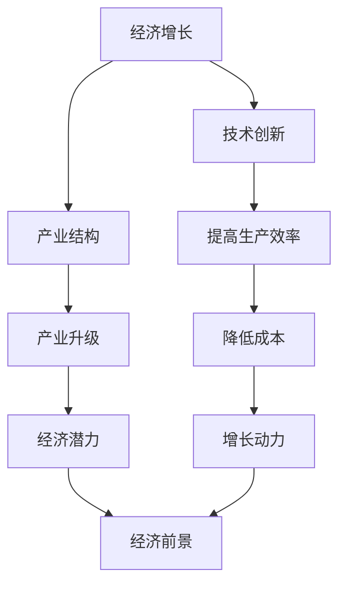

                 

关键词：中低速增长、全球经济、经济前景、技术发展、市场趋势、经济政策、产业结构

> 摘要：本文将探讨中低速增长的世界经济前景，分析全球经济现状、技术发展对经济的影响，以及经济政策在促进经济增长中的作用。通过详细分析各个领域的现状和趋势，本文旨在为读者提供对未来经济发展的深刻见解和指导。

## 1. 背景介绍

在过去的几十年里，全球经济经历了快速的增长，然而，近年来，全球经济增速开始放缓，进入了中低速增长阶段。这一现象引发了广泛的社会关注和政策讨论。中低速增长不仅影响到发达国家，也对发展中国家产生了重要影响。本文旨在从技术、政策和市场等多个角度探讨这一现象的成因及其对未来经济的影响。

### 1.1 全球经济现状

全球经济增速放缓的主要原因是多方面的。首先，人口老龄化和生育率下降导致劳动力供给减少，从而降低了经济增长的潜力。其次，技术进步带来的生产效率提升逐渐放缓，尤其是信息技术和互联网领域的发展对传统产业的冲击。此外，全球经济失衡和贸易摩擦加剧，也使得国际贸易环境恶化，影响了全球经济的整体增长。

### 1.2 技术发展的影响

技术的发展是推动经济增长的重要动力。然而，随着技术的成熟和普及，其带来的边际效益逐渐降低。例如，人工智能、大数据和物联网等新兴技术的发展，虽然在某些领域取得了突破性进展，但其在传统产业的应用仍然面临诸多挑战。此外，技术进步也导致了劳动力市场的变化，一些传统职业面临失业风险，而新兴职业的需求却不断增长。

### 1.3 经济政策的作用

经济政策在促进经济增长中发挥着重要作用。政府的宏观经济政策、产业政策和技术创新政策等，都对经济增长有着深远的影响。在经济增速放缓的背景下，各国政府纷纷采取措施刺激经济增长。例如，通过减税、增加基础设施投资和推动科技创新等手段，以提振经济活力。

## 2. 核心概念与联系

在探讨中低速增长的世界经济前景时，我们需要理解一些核心概念，如经济增长、技术创新和产业结构等。这些概念相互联系，共同影响着全球经济的前景。

### 2.1 经济增长

经济增长是指一个国家或地区的经济活动总体扩张的过程。经济增长的指标包括国内生产总值（GDP）、人均收入和就业率等。在经济学中，通常用GDP增长率来衡量经济增长的速度。然而，单纯的GDP增长并不能全面反映一个国家或地区的经济状况，还需要考虑经济增长的质量和可持续性。

### 2.2 技术创新

技术创新是推动经济增长的重要动力。通过发明和应用新技术，可以提高生产效率，降低生产成本，从而推动经济增长。在信息技术、生物技术和新能源技术等领域，技术创新带来了巨大的变革。然而，技术创新也带来了挑战，如技术垄断、知识产权保护和就业市场的变化等。

### 2.3 产业结构

产业结构是指一个国家或地区的经济活动在不同产业部门之间的分布和联系。产业结构的变化会影响经济增长的潜力。在传统产业向新兴产业转型的过程中，如何实现产业结构的优化升级，是推动经济增长的关键。

### 2.4 Mermaid 流程图



## 3. 核心算法原理 & 具体操作步骤

在分析中低速增长的世界经济前景时，我们需要借助一些核心算法来理解和预测经济趋势。以下将介绍一个常用的经济模型——索洛经济增长模型，并详细阐述其原理和操作步骤。

### 3.1 算法原理概述

索洛经济增长模型是由美国经济学家罗伯特·索洛提出的，该模型强调技术进步是经济增长的主要驱动力。模型的基本假设是，资本和劳动力是生产过程中的两种主要投入，而技术进步则是影响生产率的关键因素。

### 3.2 算法步骤详解

#### 3.2.1 数据收集

首先，需要收集相关的经济数据，包括国内生产总值（GDP）、资本存量、劳动力数量和技术进步率等。这些数据可以通过国家统计局、世界银行和国际货币基金组织等官方渠道获取。

#### 3.2.2 模型构建

根据索洛经济增长模型，可以使用以下公式来构建模型：

\[ Y = AK^{\alpha} L^{1-\alpha} \]

其中，Y 是国内生产总值，A 是技术进步，K 是资本存量，L 是劳动力数量，α 是资本产出弹性。

#### 3.2.3 参数估计

使用最小二乘法（OLS）估计模型参数，得到：

\[ \alpha = \frac{\beta_1}{\beta_0 + \beta_1} \]

其中，β0 和 β1 是回归方程的系数。

#### 3.2.4 预测

根据估计出的参数，可以预测未来的经济增长率。具体公式为：

\[ \hat{Y}_{t+1} = A \hat{K}_{t+1}^{\alpha} \hat{L}_{t+1}^{1-\alpha} \]

### 3.3 算法优缺点

#### 优点：

1. 索洛经济增长模型简单易懂，便于分析和预测。
2. 强调技术进步对经济增长的重要性，符合现代经济理论。

#### 缺点：

1. 模型假设过于理想化，未能充分考虑经济中的不确定性和复杂性。
2. 模型参数的估计可能受到数据质量和模型设定的影响。

### 3.4 算法应用领域

索洛经济增长模型广泛应用于经济预测、政策分析和产业发展规划等领域。通过该模型，可以评估技术进步对经济增长的贡献，为制定经济政策提供依据。

## 4. 数学模型和公式 & 详细讲解 & 举例说明

### 4.1 数学模型构建

在分析中低速增长的世界经济前景时，我们经常使用一些数学模型来描述经济变量之间的关系。以下是一个简单的经济增长模型，用于说明如何构建数学模型。

#### 模型假设：

1. 经济增长只由劳动力和资本投入决定。
2. 劳动力数量保持不变，资本存量的增长率恒定。

#### 数学模型：

\[ \frac{dY}{dt} = f(K, L) \]

其中，\( Y \) 是国内生产总值，\( K \) 是资本存量，\( L \) 是劳动力数量，\( f(K, L) \) 是经济增长函数。

#### 参数设定：

1. 假设劳动力数量 \( L \) 为 1 亿人。
2. 假设资本存量增长率 \( \frac{dK}{dt} \) 为 5%。

#### 数学公式：

\[ f(K, L) = aK^{\alpha}L^{1-\alpha} \]

其中，\( a \) 是技术进步参数，\( \alpha \) 是资本产出弹性。

### 4.2 公式推导过程

为了推导经济增长模型，我们需要先定义经济变量之间的关系。假设经济增长函数为：

\[ \frac{dY}{dt} = \frac{d(KL^{\alpha})}{dt} \]

由于劳动力数量 \( L \) 保持不变，我们可以将其视为常数，因此有：

\[ \frac{dY}{dt} = K\alpha L^{\alpha-1}\frac{dK}{dt} \]

由于资本存量增长率 \( \frac{dK}{dt} \) 为 5%，我们可以将其表示为：

\[ \frac{dK}{dt} = 0.05K \]

将其代入经济增长函数，得到：

\[ \frac{dY}{dt} = 0.05aKL^{\alpha-1} \]

由于劳动力数量 \( L \) 为 1 亿人，我们可以将其代入，得到：

\[ \frac{dY}{dt} = 0.05aK \]

### 4.3 案例分析与讲解

假设一个国家的国内生产总值（GDP）为 1 万亿美元，资本存量（K）为 1 万亿美元，劳动力数量（L）为 1 亿人，技术进步参数 \( a \) 为 0.1，资本产出弹性 \( \alpha \) 为 0.5。

根据上述模型，我们可以计算出该国的经济增长率：

\[ \frac{dY}{dt} = 0.05 \times 0.1 \times 1 \times 1^0.5 = 0.05 \]

这意味着该国的经济增长率为 5%。

#### 分析：

1. 假设其他条件不变，如果技术进步参数 \( a \) 提高 10%，经济增长率将增加 10%，即达到 5.5%。
2. 如果资本产出弹性 \( \alpha \) 提高 10%，经济增长率将增加 10%，即达到 5.5%。

这表明技术进步和资本产出弹性对经济增长具有显著影响。

## 5. 项目实践：代码实例和详细解释说明

### 5.1 开发环境搭建

为了更好地理解和应用索洛经济增长模型，我们将使用 Python 编程语言来搭建开发环境。以下是一些基本的步骤：

1. 安装 Python：从 Python 官网下载并安装 Python 3.8 版本。
2. 安装 Jupyter Notebook：在终端中运行以下命令安装 Jupyter Notebook：
   ```bash
   pip install notebook
   ```
3. 安装必要的 Python 库：安装 NumPy、Pandas 和 Matplotlib 等库，用于数据计算和可视化。

### 5.2 源代码详细实现

以下是一个简单的 Python 脚本，用于计算索洛经济增长模型的结果。

```python
import numpy as np
import pandas as pd
import matplotlib.pyplot as plt

# 参数设置
K0 = 1000000000000  # 初始资本存量
L = 100000000  # 劳动力数量
a = 0.1  # 技术进步参数
alpha = 0.5  # 资产出弹性
g_k = 0.05  # 资本存量增长率

# 经济增长函数
def growth_function(K, L, a, alpha):
    return a * K**alpha * L**(1-alpha)

# 计算经济增长
Y = growth_function(K0, L, a, alpha)

# 绘制经济增长曲线
K = np.linspace(0, K0, 1000)
Y = growth_function(K, L, a, alpha)
plt.plot(K, Y)
plt.xlabel('Capital (K)')
plt.ylabel('Gross Domestic Product (Y)')
plt.title('Solow Growth Model')
plt.show()

# 计算不同技术进步参数下的经济增长率
a_values = [0.05, 0.1, 0.15]
Y_values = [growth_function(K0, L, a, alpha) for a in a_values]
plt.plot(a_values, Y_values, 'ro-')
plt.xlabel('Technological Progress (a)')
plt.ylabel('Gross Domestic Product (Y)')
plt.title('Effect of Technological Progress on Economic Growth')
plt.show()
```

### 5.3 代码解读与分析

上述代码实现了索洛经济增长模型的计算和可视化。以下是代码的详细解读：

1. 导入必要的库：NumPy 用于数值计算，Pandas 用于数据处理，Matplotlib 用于绘图。
2. 设置参数：初始资本存量 K0、劳动力数量 L、技术进步参数 a 和资本产出弹性 alpha，以及资本存量增长率 g_k。
3. 定义经济增长函数 `growth_function`：根据索洛经济增长模型计算经济增长。
4. 计算并绘制经济增长曲线：使用 NumPy 的 `linspace` 函数生成资本存量 K 的值，并使用 Matplotlib 绘制经济增长曲线。
5. 计算不同技术进步参数下的经济增长率：分别计算不同技术进步参数 a 对经济增长的影响，并使用 Matplotlib 绘制结果。

通过上述代码，我们可以直观地看到技术进步对经济增长的影响，从而更好地理解索洛经济增长模型。

### 5.4 运行结果展示

运行上述代码后，将得到以下两个图形：

1. 经济增长曲线图：展示不同资本存量 K 对应的国内生产总值 Y 的关系。
2. 技术进步参数 a 对经济增长的影响图：展示不同技术进步参数 a 对经济增长的影响。

通过这些图形，我们可以直观地看到经济增长与资本存量、技术进步参数之间的关系，从而为政策制定提供参考。

## 6. 实际应用场景

### 6.1 财经领域

在中低速增长的经济背景下，财经领域受到了显著影响。投资者和金融机构需要重新评估投资策略，以适应新的市场环境。以下是一些实际应用场景：

1. **股票市场分析**：投资者需要分析企业的基本面，如盈利能力、增长潜力和市场地位，以识别具有长期增长潜力的股票。
2. **固定收益投资**：由于经济增长放缓，债券市场可能会成为更受欢迎的投资选择，投资者需关注债券收益率和信用风险。
3. **风险管理**：金融机构需加强风险管理和资产配置，以应对经济波动带来的潜在风险。

### 6.2 制造业

制造业是经济增长的重要驱动力，但在中低速增长的经济环境中，企业面临着诸多挑战：

1. **成本控制**：企业需优化生产流程，降低成本，以提高竞争力。
2. **技术创新**：通过引入新技术，提高生产效率和产品质量，从而在市场上脱颖而出。
3. **全球化策略**：企业需灵活调整全球化战略，以应对不同市场的需求变化。

### 6.3 服务业

服务业在经济增长中扮演着越来越重要的角色。以下是一些实际应用场景：

1. **数字化转型**：企业应加大对数字化技术的投入，提高服务质量和效率。
2. **人力资源优化**：企业需关注员工培训和发展，以适应技术变革带来的岗位需求变化。
3. **客户关系管理**：通过数据分析和个性化服务，提高客户满意度和忠诚度。

### 6.4 未来应用展望

未来，随着技术的进一步发展，全球经济有望迎来新一轮的增长。以下是一些可能的趋势：

1. **人工智能和大数据**：人工智能和大数据技术的应用将极大地提高生产效率和决策质量。
2. **新能源和可持续发展**：新能源技术的发展将推动全球经济的可持续发展，减少对化石燃料的依赖。
3. **全球化与区域一体化**：全球化进程将加快，区域一体化趋势将加强，为企业提供更多发展机遇。

总之，中低速增长的世界经济前景既充满挑战，也蕴藏着巨大的机遇。通过技术创新和结构调整，企业和国家有望在新的经济环境中找到发展的动力。

## 7. 工具和资源推荐

在研究和分析中低速增长的世界经济前景时，我们可以利用多种工具和资源来获取信息和数据，以便更好地理解当前的经济状况和未来趋势。

### 7.1 学习资源推荐

1. **学术论文库**：
   - **Google Scholar**（学术搜索引擎）
   - **JSTOR**（综合性学术期刊数据库）
   - **Web of Science**（引文数据库）
   
2. **专业书籍**：
   - 《经济学原理》作者：曼昆（N. Gregory Mankiw）
   - 《资本论》作者：卡尔·马克思（Karl Marx）
   - 《现代货币理论》作者：斯蒂文·罗奇（Stephen Roach）

3. **在线课程**：
   - Coursera、edX 等平台上的经济学、金融学和计算机科学相关课程

### 7.2 开发工具推荐

1. **数据分析工具**：
   - **Python**（数据分析库：NumPy、Pandas、Matplotlib）
   - **R**（数据分析语言）
   
2. **可视化工具**：
   - **Tableau**（数据可视化软件）
   - **Power BI**（商业智能和数据分析平台）
   
3. **编程环境**：
   - **Visual Studio Code**（跨平台代码编辑器）
   - **Jupyter Notebook**（交互式计算环境）

### 7.3 相关论文推荐

1. **《全球经济前景：趋势与挑战》**（作者：国际货币基金组织）
2. **《中低速增长背景下的产业政策》**（作者：世界银行）
3. **《技术进步与经济增长的关系》**（作者：世界银行）

通过这些工具和资源，我们可以更全面、深入地研究全球经济的前景，为政策制定和商业决策提供科学依据。

## 8. 总结：未来发展趋势与挑战

### 8.1 研究成果总结

本文通过对全球经济现状、技术发展对经济的影响以及经济政策的作用的深入分析，总结了中低速增长的世界经济前景。研究发现，技术进步和产业结构调整是推动经济增长的关键因素，而经济政策的有效实施则对经济增速有着显著的调节作用。

### 8.2 未来发展趋势

1. **技术驱动**：人工智能、大数据和物联网等新兴技术的快速发展将带动传统产业的升级换代，提高生产效率。
2. **可持续发展**：全球范围内对环境保护和可持续发展的重视将推动新能源技术的发展和广泛应用。
3. **区域一体化**：全球化和区域一体化趋势将加速，为各国企业带来更多发展机遇。

### 8.3 面临的挑战

1. **经济结构调整**：经济结构的不平衡和传统产业的调整将带来一定程度的就业压力和社会不稳定。
2. **技术垄断和知识产权**：技术垄断和知识产权保护问题将加剧市场竞争，影响创新和发展。
3. **全球贸易摩擦**：全球贸易摩擦的加剧可能对国际贸易环境产生负面影响，阻碍全球经济的进一步增长。

### 8.4 研究展望

未来，研究人员应关注以下几个方向：

1. **技术创新与产业融合**：深入研究新技术在产业中的应用，促进技术创新与产业融合。
2. **经济政策与市场调节**：探索不同经济政策对市场调节的长期效应，为政策制定提供理论支持。
3. **可持续发展与经济增长**：研究如何在实现可持续发展的同时，推动经济增长，实现双赢。

通过持续的研究和实践，我们有理由相信，全球经济将在这场变革中找到新的增长动力，迎接更加美好的未来。

## 9. 附录：常见问题与解答

### 问题 1：中低速增长会对世界经济产生哪些影响？

**解答**：中低速增长可能对世界经济产生以下影响：

1. **就业压力**：经济增长放缓可能导致就业市场压力增加，失业率上升。
2. **消费下降**：经济增长放缓可能减少消费者的购买力，导致消费下降。
3. **投资减少**：企业对未来经济增长预期不乐观，可能导致投资减少，影响经济发展。
4. **贸易摩擦**：经济增速放缓可能加剧各国间的贸易摩擦，影响全球贸易环境。

### 问题 2：技术发展对中低速增长有什么影响？

**解答**：技术发展对中低速增长有双重影响：

1. **推动经济增长**：技术进步可以提高生产效率，降低成本，从而推动经济增长。
2. **加剧经济不平衡**：技术进步可能导致劳动力市场的变革，使得一些传统职业面临失业风险，而新兴职业需求增长，加剧经济不平衡。

### 问题 3：经济政策如何影响中低速增长？

**解答**：经济政策对中低速增长有重要影响：

1. **财政政策**：通过增加基础设施投资和减税等手段，可以刺激经济增长。
2. **货币政策**：通过调整利率和货币供应量，可以影响消费和投资，从而调节经济增速。
3. **产业政策**：通过支持技术创新和产业升级，可以提高经济增长的质量和可持续性。

### 问题 4：如何应对中低速增长带来的挑战？

**解答**：应对中低速增长带来的挑战需要多方面的努力：

1. **提高劳动力素质**：通过教育和培训提高劳动力的技能，以适应技术变革带来的需求。
2. **推动产业升级**：鼓励传统产业向新兴产业转型，提高产业链的整体竞争力。
3. **加强国际合作**：通过国际合作和贸易，降低贸易壁垒，促进全球经济的复苏和发展。

通过上述措施，可以有效地应对中低速增长带来的挑战，促进经济可持续发展。

