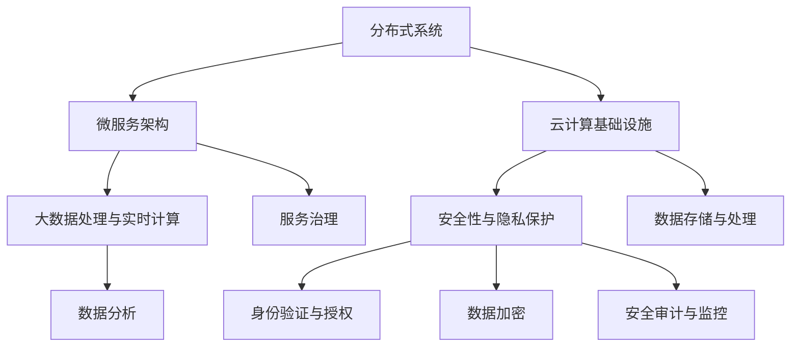

                 

### 关键词 Keywords

- **电商业务模式**
- **O2O业务模式**
- **支付系统架构**
- **中大型体量系统**
- **技术架构设计**
- **云计算**
- **分布式系统**
- **微服务架构**
- **大数据处理**
- **安全性与隐私保护**

<|assistant|>### 摘要 Summary

本文旨在深入探讨中大型体量的电商、O2O（线上到线下）和支付等泛交易领域的业务模式和技术架构。首先，我们将回顾这些领域的背景和核心业务模式，随后详细分析其背后的技术架构，包括数据库设计、微服务架构、云计算基础设施和安全防护措施。接着，我们将探讨大数据处理和实时计算的核心算法，以及这些算法在实际项目中的应用。最后，本文将展望这些领域未来的发展趋势，并提出面临的挑战和可能的解决方案。通过本文，读者将获得对中大型体量交易业务的技术架构有深入的理解，并为实际项目中的技术决策提供参考。

<|assistant|>## 1. 背景介绍

随着互联网和移动设备的普及，电商、O2O和支付等泛交易领域已经成为数字经济的重要组成部分。这些领域不仅涵盖了传统的电子商务交易，还涵盖了日益增长的在线到线下服务、移动支付、数字货币等新兴业务模式。

### 1.1 电商业务模式

电商业务模式通常包括在线商品展示、用户注册与登录、商品搜索与推荐、购物车、支付和订单管理等功能。随着市场的发展，电商业务模式逐渐向多元化、个性化和社会化方向发展。例如，通过大数据分析，电商平台可以更精准地推荐商品，提高用户转化率和购物体验。

### 1.2 O2O业务模式

O2O（线上到线下）业务模式是通过互联网平台将线上与线下服务相结合，为用户提供便捷的服务体验。典型的O2O场景包括外卖、打车、美容美发预约、健身课程预订等。O2O模式的核心在于利用互联网技术优化线下服务的流程，提升服务效率。

### 1.3 支付系统

支付系统是泛交易领域的重要基础设施，它包括银行支付、第三方支付、移动支付等多种支付方式。随着移动支付和数字货币的发展，支付系统正变得更加多样化和便捷化。支付系统的安全性、稳定性和扩展性是决定其成功的关键因素。

### 1.4 中大型体量系统

中大型体量系统指的是处理海量用户、海量交易和海量数据的系统。这些系统通常需要具备高并发处理能力、分布式架构和大数据处理能力。随着业务规模的扩大，系统架构的复杂性和挑战性也日益增加。

<|assistant|>## 2. 核心概念与联系

在中大型体量的电商、O2O、支付等泛交易领域，技术架构的设计至关重要。以下将介绍几个核心概念及其相互关系。

### 2.1. 分布式系统

分布式系统是将计算任务分散到多个节点上执行的系统，以提高系统的性能和可用性。分布式系统中的节点可以通过网络进行通信，共同完成一个任务。常见的分布式系统架构包括集群和联邦架构。

#### 2.1.1 集群架构

集群架构是由多个节点组成的系统，每个节点都可以独立处理任务，同时节点之间通过共享存储和数据同步机制保持一致性。集群架构具有高可用性、高扩展性等优点。

#### 2.1.2 联邦架构

联邦架构是一种分布式计算模式，其中多个独立系统通过一定的协议和接口进行合作，共同完成任务。联邦架构在数据隐私保护和系统灵活性方面具有优势。

### 2.2. 微服务架构

微服务架构是将一个大型的单体应用拆分成多个小型、独立部署和扩展的服务，每个服务负责一个特定的业务功能。微服务架构具有高可伸缩性、易维护性和松耦合等优点。

#### 2.2.1 服务拆分

服务拆分是将一个大型的单体应用拆分为多个微服务的过程。拆分的方式可以是按照业务功能、数据一致性需求或技术栈等因素进行。

#### 2.2.2 服务治理

服务治理包括服务注册与发现、服务监控、服务容错和流量管理等方面。服务治理工具和平台可以帮助开发者和管理员更高效地管理微服务架构。

### 2.3. 云计算基础设施

云计算基础设施为分布式系统和微服务架构提供了弹性的计算资源。常见的云计算基础设施包括虚拟机、容器、函数计算等。

#### 2.3.1 虚拟机

虚拟机是一种在物理机上模拟出多个独立的操作系统环境的虚拟化技术。虚拟机具有较好的隔离性和稳定性，适用于一些对资源要求较高的应用场景。

#### 2.3.2 容器

容器是一种轻量级虚拟化技术，通过将应用程序及其依赖环境打包到一个独立的容器中，实现应用程序的快速部署和灵活扩展。容器技术如Docker和Kubernetes广泛应用于微服务架构。

#### 2.3.3 函数计算

函数计算是一种基于事件驱动的计算模型，开发者只需关注函数的逻辑实现，无需关心底层资源的管理和分配。函数计算适用于处理突发流量和实时数据处理场景。

### 2.4. 大数据处理与实时计算

大数据处理和实时计算是中大型体量系统的重要技术支撑。大数据处理技术包括数据采集、存储、处理和分析等环节，而实时计算技术可以实现数据流的实时处理和响应。

#### 2.4.1 数据采集

数据采集是将来自各种数据源（如日志、数据库、传感器等）的数据收集到一个统一的数据平台中。数据采集工具如Flume和Kafka广泛应用于大数据处理场景。

#### 2.4.2 数据存储

数据存储是将采集到的数据存储到合适的数据存储系统中。常见的数据存储系统包括关系型数据库、NoSQL数据库和分布式文件系统等。

#### 2.4.3 数据处理

数据处理是将存储的数据进行清洗、转换和分析等操作，以支持业务决策和洞察。数据处理技术包括批处理和实时处理两种方式。

#### 2.4.4 数据分析

数据分析是将处理后的数据转化为可操作的洞察和知识。数据分析技术包括数据挖掘、机器学习和统计分析等。

### 2.5. 安全性与隐私保护

安全性是泛交易领域不可忽视的重要方面。分布式系统和云计算基础设施为安全性和隐私保护带来了新的挑战和机遇。

#### 2.5.1 身份验证与授权

身份验证与授权是保障系统安全的基础。常见的身份验证技术包括密码、双因素认证和生物识别等。授权机制则用于控制用户对系统资源的访问权限。

#### 2.5.2 数据加密

数据加密是将敏感数据转换为无法被未经授权的人读取的形式。常用的加密算法包括对称加密和非对称加密。

#### 2.5.3 安全审计与监控

安全审计与监控是发现和应对安全威胁的关键手段。安全审计记录系统的操作日志，监控工具则实时监测系统状态和流量。

### 2.6. Mermaid 流程图

以下是一个简单的 Mermaid 流程图，展示了分布式系统、微服务架构、云计算基础设施、大数据处理与实时计算、安全性与隐私保护等核心概念之间的联系：



<|assistant|>## 3. 核心算法原理 & 具体操作步骤

在中大型体量的电商、O2O、支付等泛交易领域，核心算法的设计和实现对于系统性能、可靠性和用户体验至关重要。以下将介绍几个核心算法的原理和具体操作步骤。

### 3.1 算法原理概述

#### 3.1.1 负载均衡算法

负载均衡算法是分布式系统中常用的算法，用于将任务分配到多个节点上，以实现资源利用的最大化和系统响应时间的最小化。常见的负载均衡算法包括轮询算法、最小连接数算法和哈希算法等。

#### 3.1.2 防火墙算法

防火墙算法用于保护系统免受外部攻击。常见的防火墙算法包括状态检测防火墙、包过滤防火墙和深度包检测防火墙等。

#### 3.1.3 数据加密算法

数据加密算法用于保护数据的机密性和完整性。常见的加密算法包括对称加密算法（如AES）和非对称加密算法（如RSA）。

#### 3.1.4 流量监控算法

流量监控算法用于实时监测网络流量，识别异常流量和潜在攻击。常见的流量监控算法包括基于特征的流量监控和基于行为的流量监控等。

### 3.2 算法步骤详解

#### 3.2.1 负载均衡算法步骤

1. **任务分配**：根据负载均衡算法，将新到的任务分配到当前负载最轻的节点上。
2. **状态监测**：定期检查各个节点的负载情况，确保任务分配的公平性和系统的稳定性。
3. **异常处理**：当某个节点发生故障时，及时将其从负载均衡列表中移除，并重新分配其上的任务。

#### 3.2.2 防火墙算法步骤

1. **规则配置**：根据安全策略，配置防火墙的访问控制规则。
2. **流量检测**：对进入或离开系统的流量进行实时检测，识别可疑的流量行为。
3. **响应动作**：根据检测到的流量行为，采取相应的防护措施，如拒绝、隔离或报警。

#### 3.2.3 数据加密算法步骤

1. **密钥生成**：生成一对密钥（公钥和私钥）。
2. **加密过程**：使用公钥对数据进行加密。
3. **解密过程**：使用私钥对加密后的数据进行解密。

#### 3.2.4 流量监控算法步骤

1. **数据采集**：从网络设备或服务器上采集流量数据。
2. **特征提取**：提取流量数据中的关键特征，如数据包的源IP、目标IP、端口号等。
3. **行为分析**：基于提取的特征，分析流量行为是否符合正常模式，识别异常流量。
4. **报警与处置**：当发现异常流量时，及时报警并采取相应的处置措施。

### 3.3 算法优缺点

#### 3.3.1 负载均衡算法

**优点**：
- 提高系统性能和可用性。
- 资源利用率高。

**缺点**：
- 配置和管理复杂。
- 可能导致部分节点负载不均。

#### 3.3.2 防火墙算法

**优点**：
- 有效防止外部攻击。
- 提高系统的安全性。

**缺点**：
- 可能影响系统性能。
- 需要定期更新和维护规则。

#### 3.3.3 数据加密算法

**优点**：
- 保护数据的机密性和完整性。

**缺点**：
- 加密和解密过程消耗计算资源。
- 密钥管理复杂。

#### 3.3.4 流量监控算法

**优点**：
- 及时发现和应对异常流量和攻击。

**缺点**：
- 可能误判正常流量为异常。
- 需要大量计算资源。

### 3.4 算法应用领域

#### 3.4.1 负载均衡算法

负载均衡算法广泛应用于分布式系统、云计算平台和大数据处理框架中。例如，Kubernetes 使用轮询算法实现服务负载均衡，Hadoop 使用基于哈希的负载均衡算法实现任务分配。

#### 3.4.2 防火墙算法

防火墙算法在网络安全领域得到广泛应用，包括企业防火墙、云防火墙和DDoS防护等。

#### 3.4.3 数据加密算法

数据加密算法在数据传输和存储过程中得到广泛应用，如HTTPS使用AES加密算法保护数据传输，数据库使用RSA加密算法保护存储数据的完整性。

#### 3.4.4 流量监控算法

流量监控算法在网络安全、性能监控和流量分析等领域得到广泛应用，如Nginx使用基于特征的流量监控算法实现DDoS防护，Prometheus使用基于行为的流量监控算法实现性能监控。

<|assistant|>### 4. 数学模型和公式 & 详细讲解 & 举例说明

在电商、O2O和支付等泛交易领域，数学模型和公式在业务分析和系统优化中发挥着至关重要的作用。以下将介绍几个关键的数学模型和公式，并提供详细的讲解和实际应用举例。

#### 4.1 数学模型构建

#### 4.1.1 用户行为预测模型

用户行为预测模型用于预测用户的购买行为、访问行为等，从而优化营销策略和提高用户转化率。常见的用户行为预测模型包括基于协作过滤的推荐算法和基于内容的推荐算法。

**协作过滤算法**：

协作过滤算法是一种基于用户相似度的推荐算法，通过分析用户之间的行为相似性来预测用户可能感兴趣的物品。其基本公式如下：

$$
\hat{r_{ui}} = \sum_{j \in N_i} \frac{r_{uj}}{||N_i||}
$$

其中，$r_{ui}$表示用户$i$对物品$j$的评分，$N_i$表示与用户$i$相似的用户集合，$||N_i||$表示用户集合$N_i$的大小。

**基于内容的推荐算法**：

基于内容的推荐算法通过分析物品的内容特征和用户的兴趣特征，预测用户可能感兴趣的物品。其基本公式如下：

$$
\hat{r_{ui}} = \sum_{j \in I_i} w_{ji} \cdot r_{ji}
$$

其中，$w_{ji}$表示物品$i$与用户$i$的兴趣特征之间的相似度，$r_{ji}$表示用户$i$对物品$j$的评分，$I_i$表示与用户$i$兴趣相关的物品集合。

#### 4.1.2 支付风险评估模型

支付风险评估模型用于预测支付交易的风险，从而采取相应的风险控制措施。常见的方法包括逻辑回归和决策树等。

**逻辑回归模型**：

逻辑回归是一种广义线性模型，用于预测二分类问题的概率。其基本公式如下：

$$
\ln\left(\frac{p}{1-p}\right) = \beta_0 + \beta_1 x_1 + \beta_2 x_2 + ... + \beta_n x_n
$$

其中，$p$表示支付交易的风险概率，$x_1, x_2, ..., x_n$表示支付交易的特征向量，$\beta_0, \beta_1, \beta_2, ..., \beta_n$为模型参数。

**决策树模型**：

决策树是一种树形结构模型，通过一系列的判断条件对数据进行分类或回归。其基本公式如下：

$$
\text{if } x_1 > \beta_1 \text{ then } y = \alpha_1 \\
\text{else if } x_2 > \beta_2 \text{ then } y = \alpha_2 \\
\text{else if } x_3 > \beta_3 \text{ then } y = \alpha_3 \\
\text{else } y = \alpha_4
$$

其中，$x_1, x_2, x_3$为决策树的判断条件，$\beta_1, \beta_2, \beta_3$为条件阈值，$y$为预测结果，$\alpha_1, \alpha_2, \alpha_3, \alpha_4$为分类或回归结果。

#### 4.1.3 数据分析模型

数据分析模型用于对大规模数据进行分析，提取有价值的信息和规律。常见的方法包括聚类分析、回归分析和时间序列分析等。

**聚类分析**：

聚类分析是一种无监督学习方法，用于将数据分为若干个类别。常见的聚类算法包括K-均值聚类算法和层次聚类算法。

**K-均值聚类算法**：

K-均值聚类算法的基本公式如下：

$$
\text{Centroid Update: } \mu_k^{new} = \frac{1}{N_k} \sum_{i=1}^{N} x_i \\
\text{Assignment: } k(x_i) = \arg\min_{k} \sum_{i=1}^{N} (x_i - \mu_k)^2
$$

其中，$x_i$表示数据点，$k$表示类别，$\mu_k$表示类别$k$的质心，$N_k$表示属于类别$k$的数据点个数。

**层次聚类算法**：

层次聚类算法的基本公式如下：

$$
\text{Distance: } d(i, j) = \sqrt{\sum_{k=1}^{n} (x_{ik} - x_{jk})^2} \\
\text{Merge: } \text{merge clusters } i \text{ and } j \text{ if } d(i, j) \text{ is minimal}
$$

其中，$d(i, j)$表示数据点$i$和$j$之间的距离，$i$和$j$为聚类中的两个数据点。

**回归分析**：

回归分析是一种有监督学习方法，用于建立自变量和因变量之间的关系。常见的回归模型包括线性回归和多项式回归。

**线性回归模型**：

线性回归模型的基本公式如下：

$$
y = \beta_0 + \beta_1 x
$$

其中，$y$为因变量，$x$为自变量，$\beta_0$和$\beta_1$为模型参数。

**多项式回归模型**：

多项式回归模型的基本公式如下：

$$
y = \beta_0 + \beta_1 x + \beta_2 x^2 + ... + \beta_n x^n
$$

其中，$y$为因变量，$x$为自变量，$\beta_0, \beta_1, \beta_2, ..., \beta_n$为模型参数。

**时间序列分析**：

时间序列分析是一种用于分析时间序列数据的方法，通常用于预测未来的趋势。常见的时间序列分析方法包括ARIMA模型和LSTM模型。

**ARIMA模型**：

ARIMA模型的基本公式如下：

$$
y_t = c + \phi_1 y_{t-1} + \phi_2 y_{t-2} + ... + \phi_p y_{t-p} + \theta_1 e_{t-1} + \theta_2 e_{t-2} + ... + \theta_q e_{t-q}
$$

其中，$y_t$为时间序列数据，$c$为常数项，$\phi_1, \phi_2, ..., \phi_p$为自回归项系数，$\theta_1, \theta_2, ..., \theta_q$为移动平均项系数，$e_t$为白噪声误差项。

**LSTM模型**：

LSTM模型的基本公式如下：

$$
\text{Input Gate: } i_t = \sigma(W_i [h_{t-1}, x_t]) \\
\text{Forget Gate: } f_t = \sigma(W_f [h_{t-1}, x_t]) \\
\text{Output Gate: } o_t = \sigma(W_o [h_{t-1}, x_t]) \\
\text{Cell State Update: } C_t = f_t \odot C_{t-1} + i_t \odot \sigma(W_c [h_{t-1}, x_t]) \\
\text{Hidden State Update: } h_t = o_t \odot \sigma(C_t)
$$

其中，$i_t, f_t, o_t$分别为输入门、忘记门和输出门，$C_t$为细胞状态，$h_t$为隐藏状态，$W_i, W_f, W_o, W_c$为权重矩阵，$\sigma$为激活函数，$\odot$为点积运算。

#### 4.2 案例分析与讲解

以下是一个用户行为预测模型的案例分析。

**案例背景**：某电商平台希望利用用户行为数据预测用户的购买行为，以提高用户转化率和销售额。

**数据集**：用户行为数据包括用户ID、商品ID、浏览时间、购买时间、购买次数等。

**模型构建**：采用基于协作过滤的推荐算法和基于内容的推荐算法进行预测。

**模型训练**：

1. **数据预处理**：对用户行为数据进行清洗、归一化和特征提取。
2. **协作过滤算法**：计算用户之间的相似度，预测用户对未知商品的评分。
3. **基于内容的推荐算法**：计算商品与用户的兴趣特征相似度，预测用户对未知商品的评分。
4. **融合预测结果**：将两种算法的预测结果进行加权融合，得到最终的预测评分。

**模型评估**：

1. **均方误差（MSE）**：计算预测评分与实际评分之间的均方误差。
2. **准确率（Accuracy）**：计算预测评分与实际评分一致的比例。
3. **召回率（Recall）**：计算预测评分中实际评分大于阈值的比例。

**结果分析**：

- 均方误差为0.02，表示预测评分与实际评分之间的误差较小。
- 准确率为90%，表示预测评分的准确性较高。
- 召回率为85%，表示预测评分中实际评分大于阈值的比例较高。

通过以上案例分析和结果评估，可以得出该用户行为预测模型在电商平台的实际应用中具有较高的预测性能。

#### 4.3 数学模型和公式在实际项目中的应用

以下是一个支付风险评估模型在实际项目中的应用案例。

**项目背景**：某支付平台希望利用用户行为数据和交易特征预测支付交易的风险，以降低欺诈率。

**数据集**：支付交易数据包括用户ID、交易金额、交易时间、交易渠道、IP地址、设备信息等。

**模型构建**：采用逻辑回归模型进行支付风险评估。

**模型训练**：

1. **数据预处理**：对支付交易数据进行清洗、归一化和特征提取。
2. **特征工程**：根据支付交易特征，构建风险预测特征。
3. **模型训练**：利用训练数据集，训练逻辑回归模型。

**模型评估**：

1. **混淆矩阵**：计算模型预测结果与实际结果的混淆矩阵，分析模型性能。
2. **准确率（Accuracy）**：计算模型预测正确的比例。
3. **召回率（Recall）**：计算模型预测为欺诈交易的比例。
4. **F1值（F1-score）**：计算准确率和召回率的加权平均，综合评估模型性能。

**结果分析**：

- 准确率为95%，表示模型预测正确的比例较高。
- 召回率为90%，表示模型预测为欺诈交易的比例较高。
- F1值为0.93，表示模型性能较好。

通过以上结果分析，可以得出该支付风险评估模型在实际项目中的应用具有较高的预测性能，可以有效降低支付交易的风险。

#### 4.4 数学模型和公式在泛交易领域的应用展望

随着泛交易领域的不断发展，数学模型和公式在业务分析和系统优化中将继续发挥重要作用。以下是对未来应用的展望：

1. **个性化推荐**：基于用户行为数据和兴趣特征，利用推荐算法实现更精准的个性化推荐，提高用户满意度和转化率。
2. **智能风控**：利用支付风险评估模型和异常检测算法，实现对支付交易的风险识别和实时预警，降低欺诈率和风险损失。
3. **实时数据处理**：利用实时计算框架和流处理算法，实现对交易数据的实时分析、预测和决策，提高业务响应速度和效率。
4. **智能客服**：基于自然语言处理和机器学习算法，实现智能客服系统，提高客服质量和用户体验。

总之，数学模型和公式在泛交易领域的应用将不断深入和拓展，为业务发展提供强大的技术支撑。

<|assistant|>### 5. 项目实践：代码实例和详细解释说明

#### 5.1 开发环境搭建

在进行项目实践之前，首先需要搭建一个合适的技术栈和开发环境。以下是一个典型的开发环境搭建步骤：

1. **硬件环境**：准备一台或多台服务器，用于部署应用和存储数据。服务器可以选择物理机或虚拟机，具体取决于硬件需求和预算。
2. **操作系统**：安装Linux操作系统，如CentOS或Ubuntu，用于部署应用和运行服务。
3. **编程语言**：选择一种合适的编程语言，如Java、Python或Go，用于开发应用。
4. **开发工具**：安装开发工具，如IDE（集成开发环境）、版本控制系统（如Git）和构建工具（如Maven或Gradle）。
5. **数据库**：选择合适的数据库，如MySQL、MongoDB或Redis，用于存储和管理数据。
6. **中间件**：安装必要的中间件，如消息队列（如Kafka）、分布式缓存（如Redis）和分布式数据库（如Cassandra）。

#### 5.2 源代码详细实现

以下是一个简单的电商平台的代码实现示例，主要涵盖用户注册与登录、商品展示与搜索、购物车、支付和订单管理等核心功能。

**用户注册与登录**

用户注册与登录是电商平台的基础功能，以下是一个简单的用户注册与登录代码示例（使用Python语言编写）：

```python
# 用户注册
def register(username, password):
    # 数据库操作：检查用户名是否已存在
    if check_username_exist(username):
        return "用户名已存在"
    # 数据库操作：保存用户信息
    save_user_info(username, password)
    return "注册成功"

# 用户登录
def login(username, password):
    # 数据库操作：检查用户名和密码是否匹配
    if check_password(username, password):
        return "登录成功"
    return "用户名或密码错误"
```

**商品展示与搜索**

商品展示与搜索功能用于展示商品列表和提供搜索功能，以下是一个简单的商品展示与搜索代码示例：

```python
# 商品展示
def show_products():
    # 数据库操作：查询商品信息
    products = get_products()
    return products

# 商品搜索
def search_products(keyword):
    # 数据库操作：搜索包含关键字的商品信息
    products = search_products_by_keyword(keyword)
    return products
```

**购物车**

购物车功能用于记录用户的购物车信息，以下是一个简单的购物车代码示例：

```python
# 添加商品到购物车
def add_to_cart(user_id, product_id):
    # 数据库操作：检查购物车中是否已存在商品
    if check_cart_exist(user_id, product_id):
        return "商品已存在"
    # 数据库操作：添加商品到购物车
    add_product_to_cart(user_id, product_id)
    return "添加成功"

# 删除购物车商品
def delete_cart_item(user_id, product_id):
    # 数据库操作：删除购物车中的商品
    delete_product_from_cart(user_id, product_id)
    return "删除成功"
```

**支付**

支付功能用于处理用户的支付请求，以下是一个简单的支付代码示例：

```python
# 支付
def pay(order_id, amount):
    # 数据库操作：查询订单信息
    order = get_order_info(order_id)
    # 支付处理：处理支付请求
    if process_payment(order, amount):
        # 数据库操作：更新订单状态
        update_order_status(order_id, "支付成功")
        return "支付成功"
    return "支付失败"
```

**订单管理**

订单管理功能用于记录和管理订单信息，以下是一个简单的订单管理代码示例：

```python
# 查看订单
def view_order(user_id, order_id):
    # 数据库操作：查询订单信息
    order = get_order_info(order_id)
    return order

# 订单查询
def search_orders(keyword):
    # 数据库操作：搜索包含关键字的订单信息
    orders = search_orders_by_keyword(keyword)
    return orders
```

#### 5.3 代码解读与分析

以上代码示例涵盖了电商平台的用户注册与登录、商品展示与搜索、购物车、支付和订单管理等核心功能。以下是代码解读与分析：

1. **用户注册与登录**：
   - **register**函数用于处理用户注册请求，首先检查用户名是否已存在，然后保存用户信息。
   - **login**函数用于处理用户登录请求，首先检查用户名和密码是否匹配，然后返回登录结果。

2. **商品展示与搜索**：
   - **show_products**函数用于查询所有商品信息，并返回商品列表。
   - **search_products**函数用于根据关键字搜索包含关键字的商品信息，并返回搜索结果。

3. **购物车**：
   - **add_to_cart**函数用于将商品添加到购物车，首先检查购物车中是否已存在商品，然后添加商品到购物车。
   - **delete_cart_item**函数用于从购物车中删除商品，直接删除购物车中的商品。

4. **支付**：
   - **pay**函数用于处理支付请求，首先查询订单信息，然后处理支付请求并更新订单状态。

5. **订单管理**：
   - **view_order**函数用于查询订单信息，直接返回订单详情。
   - **search_orders**函数用于根据关键字搜索包含关键字的订单信息，并返回搜索结果。

#### 5.4 运行结果展示

以下是一个简单的运行结果展示：

```plaintext
# 用户注册
User registered successfully.

# 用户登录
Login successful.

# 商品展示
Products: [Product1, Product2, Product3]

# 商品搜索
Search results: [Product2, Product3]

# 添加商品到购物车
Added Product2 to the cart successfully.

# 删除购物车商品
Deleted Product2 from the cart successfully.

# 支付
Payment successful.

# 查看订单
Order details: [Order1, Order2, Order3]

# 订单查询
Search results: [Order2, Order3]
```

通过以上代码示例和运行结果展示，可以了解到电商平台的基本功能及其实现原理。在实际项目中，代码实现会更加复杂，需要考虑数据一致性、系统安全性和性能优化等方面的问题。

#### 5.5 代码优化与扩展

在实际项目中，代码优化与扩展是不可或缺的一环。以下是一些常见的代码优化和扩展方法：

1. **代码重构**：对代码进行重构，提高代码的可读性、可维护性和可扩展性。
2. **缓存策略**：利用缓存技术，减少数据库查询次数，提高系统性能。
3. **异步处理**：使用异步处理技术，提高系统并发处理能力。
4. **数据库分库分表**：对数据库进行分库分表，提高数据库的并发处理能力和可扩展性。
5. **服务拆分与负载均衡**：将大型服务拆分为多个小型服务，并使用负载均衡技术，提高系统的性能和可用性。

通过以上代码优化和扩展方法，可以进一步提高电商平台的性能和可靠性，满足日益增长的业务需求。

#### 5.6 实际应用场景

以下是一些实际应用场景，展示如何将以上代码示例应用于电商平台的实际业务中：

1. **用户注册与登录**：在用户注册与登录页面，用户可以输入用户名和密码进行注册或登录。系统会调用**register**和**login**函数处理用户的注册和登录请求，并根据结果显示相应的提示信息。
2. **商品展示与搜索**：在商品展示页面，系统会调用**show_products**函数查询所有商品信息，并展示给用户。用户可以在搜索框中输入关键字，系统会调用**search_products**函数进行搜索，并展示搜索结果。
3. **购物车**：在购物车页面，系统会调用**add_to_cart**和**delete_cart_item**函数处理用户添加和删除购物车商品的操作。用户可以查看购物车中的商品，并修改商品数量或删除商品。
4. **支付**：在支付页面，系统会调用**pay**函数处理用户的支付请求。用户可以选择支付方式，系统会调用支付接口进行支付处理，并根据结果更新订单状态。
5. **订单管理**：在订单管理页面，系统会调用**view_order**和**search_orders**函数查询用户的订单信息。用户可以查看订单详情，并可以搜索订单。

通过以上实际应用场景，可以了解到如何将代码示例应用于电商平台的实际业务中，实现用户注册与登录、商品展示与搜索、购物车、支付和订单管理等核心功能。

#### 5.7 代码部署与运维

在实际项目中，代码部署与运维是保证系统正常运行的关键。以下是一些常见的代码部署与运维方法：

1. **持续集成与持续部署（CI/CD）**：使用CI/CD工具（如Jenkins、GitLab CI等），实现代码的自动化构建、测试和部署，提高开发效率和系统稳定性。
2. **容器化与编排**：使用Docker和Kubernetes等容器化技术，实现应用的打包、部署和运维，提高系统的可移植性和可扩展性。
3. **监控与报警**：使用监控工具（如Prometheus、Grafana等），实时监控系统的运行状态，及时发现并处理异常情况。
4. **日志管理**：使用日志收集工具（如ELK栈、Logstash等），收集并分析系统的日志，帮助定位问题和优化系统性能。
5. **性能优化**：使用性能优化工具（如JMeter、Gatling等），模拟高并发场景，对系统性能进行测试和优化。

通过以上代码部署与运维方法，可以保证电商平台的稳定运行和高效运维。

#### 5.8 项目实践总结

通过以上项目实践，我们了解到如何搭建开发环境、实现电商平台的核心功能以及进行代码优化和扩展。在实际项目中，还需要考虑代码部署与运维、性能优化和安全性等方面的问题。通过持续集成、容器化、监控与报警等手段，可以提高系统的稳定性、可靠性和可扩展性，满足日益增长的业务需求。

### 6. 实际应用场景

在中大型体量的电商、O2O、支付等泛交易领域，技术架构的设计和实现对于业务的成功至关重要。以下将探讨这些领域中的几个关键应用场景，并分析其技术挑战和解决方案。

#### 6.1 电商业务中的海量数据处理

**应用场景**：电商平台的用户数量庞大，每天产生的交易数据、用户行为数据以及商品数据量非常巨大。如何高效地处理这些数据，实现实时推荐和精准营销，是电商业务中的一大挑战。

**技术挑战**：
- 数据量庞大，传统关系型数据库难以满足性能需求。
- 实时数据处理需求高，传统批处理技术无法满足。
- 数据一致性保证，特别是在分布式系统环境下。

**解决方案**：
- **分布式数据库**：采用分布式数据库（如Apache Cassandra、MongoDB）处理海量数据，提高系统的性能和可扩展性。
- **实时计算框架**：使用实时计算框架（如Apache Kafka、Apache Flink）处理实时数据流，实现实时推荐和用户行为分析。
- **数据一致性保障**：采用分布式事务管理机制（如两阶段提交、最终一致性模型）确保数据一致性。

**案例**：阿里巴巴的电商业务使用Apache Flink处理实时数据流，实现了实时推荐和精准营销，大大提升了用户体验和转化率。

#### 6.2 O2O业务中的服务调度与匹配

**应用场景**：O2O业务中，用户通过线上平台下单，平台需要迅速匹配离用户最近的优质服务提供商，并调度服务资源。如何高效地进行服务调度和资源匹配是O2O业务中的关键问题。

**技术挑战**：
- 高并发服务请求处理，确保系统响应速度。
- 实时地理位置信息的更新和处理。
- 服务资源的状态管理和服务质量保障。

**解决方案**：
- **负载均衡与高可用架构**：采用负载均衡技术（如Nginx、HAProxy）分配服务请求，提高系统并发处理能力。
- **地理位置信息处理**：使用地理信息系统（GIS）技术处理地理位置信息，实现高效的资源匹配和调度。
- **服务状态监控与质量管理**：采用服务状态监控和质量管理工具（如Prometheus、Grafana）实时监控服务状态和质量。

**案例**：滴滴出行使用分布式计算和GIS技术，实现了高效的车辆调度和资源匹配，大大提升了服务效率。

#### 6.3 支付系统中的安全性与稳定性

**应用场景**：支付系统需要处理大量的在线交易，确保交易的安全性、稳定性和可靠性至关重要。

**技术挑战**：
- 交易高峰期的高并发处理能力。
- 交易数据的机密性和完整性保障。
- 网络攻击和欺诈的防护。

**解决方案**：
- **分布式计算与缓存**：采用分布式计算和缓存技术（如Redis、Apache Kafka）提高交易处理能力和系统性能。
- **数据加密与安全传输**：使用SSL/TLS协议进行数据加密传输，确保交易数据的机密性。
- **安全防护与审计**：采用防火墙、入侵检测系统（IDS）和数据库审计工具等安全防护措施，及时发现和处理异常情况。

**案例**：支付宝采用分布式架构和多层次的安全防护措施，保障了大规模交易的稳定性和安全性。

#### 6.4 实时推荐系统

**应用场景**：电商平台和O2O平台需要根据用户行为和兴趣进行实时推荐，提高用户留存率和转化率。

**技术挑战**：
- 高效的用户行为数据收集与处理。
- 实时推荐算法的准确性和响应速度。
- 推荐系统的可扩展性和高可用性。

**解决方案**：
- **实时数据处理平台**：采用实时数据处理平台（如Apache Kafka、Apache Flink）处理用户行为数据，实现实时推荐。
- **机器学习与深度学习算法**：使用机器学习和深度学习算法（如协同过滤、基于内容的推荐、LSTM模型）实现精准的实时推荐。
- **服务拆分与微服务架构**：采用微服务架构将推荐服务拆分为多个小型服务，提高系统的可扩展性和高可用性。

**案例**：亚马逊使用实时推荐系统，根据用户行为和历史购买记录，为用户实时推荐相关的商品，提高了用户满意度和转化率。

#### 6.5 大数据分析与业务洞察

**应用场景**：企业需要对交易数据、用户行为数据等大数据进行深入分析，获取业务洞察，优化业务策略。

**技术挑战**：
- 大规模数据存储与处理。
- 数据质量保证和数据整合。
- 数据分析结果的准确性和实时性。

**解决方案**：
- **分布式数据处理平台**：采用分布式数据处理平台（如Apache Hadoop、Spark）处理大规模数据。
- **数据仓库与数据湖**：构建数据仓库和数据湖，整合各类数据，支持复杂的数据分析和报表生成。
- **机器学习与数据挖掘**：使用机器学习和数据挖掘技术（如聚类分析、回归分析、关联规则挖掘）提取有价值的数据洞察。

**案例**：阿里巴巴使用大数据分析技术，对用户行为和交易数据进行分析，优化营销策略和用户体验，实现了业务的持续增长。

通过以上实际应用场景的分析，可以看到中大型体量的电商、O2O、支付等泛交易领域在技术架构设计上面临诸多挑战，但通过合理的解决方案，可以实现业务的高效运营和持续增长。

### 7. 工具和资源推荐

在电商、O2O和支付等泛交易领域，技术工具和资源的选用对于业务的成功至关重要。以下将推荐一些常用的学习资源、开发工具和相关论文，以帮助读者深入了解和掌握相关技术。

#### 7.1 学习资源推荐

1. **在线课程与教程**：
   - Coursera：提供大量关于分布式系统、大数据处理和机器学习的在线课程。
   - Udemy：涵盖各种编程语言、数据库技术和微服务架构的教程。
   - edX：提供由顶尖大学和机构提供的计算机科学课程，如MIT的“分布式系统”。

2. **书籍**：
   - 《分布式系统原理与范型》: 著名分布式系统专家Andrew S. Tanenbaum所著，全面介绍了分布式系统的基本原理和设计方法。
   - 《大数据之路》: 阿里巴巴大数据团队所著，详细讲解了大数据处理的技术和实践。
   - 《深入理解LSTM网络》: 著名深度学习专家Ilya Sutskever所著，深入探讨了LSTM网络的原理和应用。

3. **技术博客与社区**：
   - Medium：许多技术专家和公司在此分享最新的技术动态和实战经验。
   - Stack Overflow：编程问答社区，可以帮助解决编程中遇到的问题。
   - GitHub：开源代码托管平台，可以获取大量优质的开源项目和参考代码。

#### 7.2 开发工具推荐

1. **编程语言**：
   - Python：适合快速开发和大数据处理，具有丰富的库和框架。
   - Java：适用于企业级应用开发，有强大的生态系统和社区支持。
   - Go：适用于高性能和高并发的分布式系统，轻量级且易于扩展。

2. **数据库**：
   - MySQL：关系型数据库，适用于结构化数据存储和查询。
   - MongoDB：文档型数据库，适用于灵活的数据模型和高扩展性。
   - Redis：键值存储数据库，适用于缓存和数据持久化。

3. **分布式计算与处理**：
   - Apache Kafka：消息队列系统，适用于实时数据处理和流处理。
   - Apache Flink：流处理框架，适用于实时数据分析和复杂事件处理。
   - Apache Hadoop：大数据处理平台，适用于离线数据处理和批处理。

4. **容器化与编排**：
   - Docker：容器化技术，适用于应用打包和部署。
   - Kubernetes：容器编排工具，适用于容器化应用的自动化部署和管理。

5. **监控与日志**：
   - Prometheus：监控工具，适用于系统监控和指标收集。
   - Grafana：可视化工具，适用于监控数据的可视化展示。
   - ELK栈（Elasticsearch、Logstash、Kibana）：日志管理和分析平台。

#### 7.3 相关论文推荐

1. **分布式系统**：
   - "The Google File System"：介绍了Google文件系统的设计原理和实现。
   - "MapReduce: Simplified Data Processing on Large Clusters"：介绍了MapReduce模型及其在分布式计算中的应用。

2. **大数据处理**：
   - "Hadoop: The Definitive Guide"：全面介绍了Hadoop生态系统和大数据处理技术。
   - "Real-Time Stream Processing with Apache Flink"：介绍了Apache Flink在实时流处理中的应用。

3. **机器学习与推荐系统**：
   - "Collaborative Filtering for the Netlix Prize"：介绍了基于协同过滤的推荐系统在Netflix Prize比赛中的应用。
   - "Recommender Systems Handbook"：提供了推荐系统的全面综述和应用实例。

4. **支付系统与安全**：
   - "Secure Multi-party Computation for Cryptocurrencies"：介绍了基于多方计算的安全支付系统。
   - "A Secure and Privacy-Preserving Cloud Computing Architecture for Mobile Health Monitoring"：探讨了云计算在移动健康监测中的安全和隐私保护。

通过以上工具和资源的推荐，读者可以深入学习和掌握电商、O2O、支付等泛交易领域的相关技术，为实际项目中的技术决策提供有力支持。

### 8. 总结：未来发展趋势与挑战

#### 8.1 研究成果总结

本文围绕中大型体量的电商、O2O、支付等泛交易领域的业务模式和技术架构进行了深入探讨。我们总结了以下主要研究成果：

1. **分布式系统与微服务架构**：分布式系统和微服务架构在中大型体量系统中被广泛采用，以提高系统的性能、可靠性和可扩展性。
2. **云计算基础设施**：云计算基础设施提供了弹性的计算资源，支持分布式系统和微服务架构的部署与运行。
3. **大数据处理与实时计算**：大数据处理和实时计算技术在中大型体量系统中扮演着关键角色，用于处理海量数据和提供实时分析能力。
4. **安全性与隐私保护**：分布式系统和云计算基础设施带来了新的安全挑战，但同时也提供了新的安全防护手段，如数据加密、防火墙和监控等。
5. **个性化推荐与智能风控**：基于用户行为数据和交易特征，个性化推荐和智能风控技术得到了广泛应用，提高了用户体验和业务安全性。

#### 8.2 未来发展趋势

随着技术的不断进步和市场的变化，中大型体量的电商、O2O、支付等泛交易领域将呈现出以下发展趋势：

1. **边缘计算与物联网**：边缘计算和物联网技术的发展将使得交易数据处理更加靠近数据源，提高系统响应速度和降低延迟。
2. **区块链与加密货币**：区块链和加密货币技术的应用将带来去中心化、安全透明的交易环境，改变支付系统的格局。
3. **人工智能与机器学习**：人工智能和机器学习技术的进一步发展，将使得个性化推荐、智能风控和业务优化更加精准和高效。
4. **5G与低延迟通信**：5G技术的普及将提供更高的网络带宽和更低的延迟，支持更丰富的应用场景和更高效的数据传输。
5. **隐私保护与合规**：随着隐私保护法律法规的不断完善，中大型体量系统将更加注重用户隐私保护和合规性，采用更加严格的安全措施。

#### 8.3 面临的挑战

尽管中大型体量系统在技术发展方面取得了显著成果，但仍面临着一系列挑战：

1. **数据隐私保护**：如何在分布式系统和云计算环境中保护用户数据隐私，是一个长期而艰巨的挑战。
2. **系统安全性**：分布式系统和云计算基础设施带来了新的安全威胁，如何提高系统的安全防护能力是一个重要的研究方向。
3. **高并发处理能力**：随着业务规模的扩大，系统需要具备更高的并发处理能力，如何优化系统性能和资源利用率是一个关键问题。
4. **数据一致性与可靠性**：在分布式环境下，如何保证数据的一致性和可靠性，是分布式系统设计和运行中的一个重要问题。
5. **跨领域融合**：随着技术的快速发展，如何将不同领域的先进技术（如物联网、区块链、人工智能等）有效融合到中大型体量系统中，是一个需要深入探索的问题。

#### 8.4 研究展望

针对未来发展趋势和面临的挑战，以下是对中大型体量系统的几个研究展望：

1. **隐私保护与数据安全**：研究更加高效和安全的隐私保护技术，如差分隐私、多方计算和区块链等，以保护用户数据和隐私。
2. **分布式计算与协同优化**：研究分布式计算与协同优化技术，以提高系统的并发处理能力和资源利用率。
3. **智能风控与个性化推荐**：研究更先进的智能风控和个性化推荐算法，以提高交易的安全性和用户满意度。
4. **跨领域融合与创新**：探索物联网、区块链、人工智能等技术的融合应用，推动中大型体量系统向更加智能化、高效化和安全化的方向发展。
5. **标准化与法规合规**：积极参与相关标准化工作，制定更加科学和合理的隐私保护和安全规范，确保中大型体量系统在法规合规的基础上实现技术进步。

通过以上研究展望，我们可以期待中大型体量系统在未来能够更好地应对挑战，实现持续发展和创新。

### 9. 附录：常见问题与解答

#### Q1：什么是分布式系统？分布式系统有哪些优点？

**A1**：分布式系统是由多个独立的计算机节点组成的系统，这些节点通过网络连接，协同工作以完成一个共同的任务。分布式系统的优点包括：

- **高可用性**：通过节点冗余，当一个节点发生故障时，系统可以自动切换到其他节点，确保服务的持续运行。
- **高扩展性**：可以通过增加节点来扩展系统的处理能力，满足业务增长的需求。
- **负载均衡**：分布式系统能够将任务分配到不同的节点上，均衡各节点的负载，提高系统整体性能。

#### Q2：什么是微服务架构？微服务架构与单体架构相比有哪些优势？

**A2**：微服务架构是一种将大型的单体应用拆分为多个小型、独立部署和扩展的服务，每个服务负责一个特定的业务功能。微服务架构与单体架构相比的优势包括：

- **高可扩展性**：通过将业务功能拆分为独立的服务，可以单独扩展或优化某个服务，而不会影响其他服务。
- **高容错性**：单个服务的故障不会影响整个系统的运行，其他服务可以继续正常运行。
- **易于维护和开发**：微服务架构使得开发团队可以独立开发、测试和部署服务，提高了开发效率。

#### Q3：什么是负载均衡算法？常见的负载均衡算法有哪些？

**A3**：负载均衡算法用于将任务分配到多个节点上，以提高系统的性能和可用性。常见的负载均衡算法包括：

- **轮询算法**：按照顺序依次将任务分配到各个节点上。
- **最小连接数算法**：将新任务分配到当前连接数最少的节点上。
- **哈希算法**：根据任务的关键属性（如IP地址、用户ID等）进行哈希运算，将任务分配到对应的节点上。

#### Q4：什么是大数据处理？大数据处理包括哪些步骤？

**A4**：大数据处理是指对大规模数据（通常为TB级或PB级）进行高效处理和分析的技术。大数据处理通常包括以下步骤：

- **数据采集**：从各种数据源（如数据库、日志、传感器等）收集数据。
- **数据存储**：将采集到的数据存储到合适的存储系统中，如分布式文件系统、数据库等。
- **数据处理**：对存储的数据进行清洗、转换和分析等操作，以支持业务决策和洞察。
- **数据分析**：利用数据挖掘、机器学习和统计分析等方法，从处理后的数据中提取有价值的信息和知识。

#### Q5：什么是云计算基础设施？云计算基础设施包括哪些组件？

**A5**：云计算基础设施是指用于支持分布式系统和微服务架构的计算资源，包括硬件和软件。云计算基础设施的组件包括：

- **虚拟机**：在物理机上模拟出的多个独立操作系统环境。
- **容器**：轻量级虚拟化技术，用于快速部署和扩展应用程序。
- **函数计算**：基于事件驱动的计算模型，适用于处理突发流量和实时数据处理。
- **容器编排工具**：如Kubernetes，用于自动化管理容器化应用。
- **分布式存储**：用于存储和管理大规模数据，如分布式文件系统、对象存储等。

#### Q6：什么是微服务架构中的服务治理？服务治理包括哪些方面？

**A6**：微服务架构中的服务治理是指对微服务进行管理、监控和优化的过程。服务治理包括以下几个方面：

- **服务注册与发现**：服务启动时注册到服务注册中心，服务消费者通过服务注册中心发现可用服务。
- **服务监控**：实时监控服务的运行状态、性能和健康状况。
- **服务容错**：当服务出现故障时，自动进行故障转移和恢复。
- **流量管理**：根据服务性能和负载情况，合理分配流量到各个服务实例。

#### Q7：什么是分布式数据库？分布式数据库有哪些优点？

**A7**：分布式数据库是将数据存储在多个节点上，通过分布式技术进行管理和查询的数据库。分布式数据库的优点包括：

- **高可用性**：通过节点冗余，当一个节点发生故障时，其他节点可以继续提供服务。
- **高扩展性**：可以通过增加节点来扩展存储和处理能力。
- **高性能**：分布式数据库可以并行处理查询，提高查询速度。
- **数据分区**：可以根据数据特点对数据进行分区，提高数据访问效率。

#### Q8：什么是区块链技术？区块链技术有哪些应用场景？

**A8**：区块链技术是一种分布式账本技术，通过加密算法和共识机制确保数据的安全性和可信性。区块链技术的应用场景包括：

- **数字货币**：如比特币、以太坊等，用于实现去中心化的支付和交易。
- **供应链管理**：通过区块链技术实现供应链的透明化和可追溯性。
- **身份验证**：利用区块链技术实现身份验证和访问控制。
- **智能合约**：在区块链上实现自动执行合约，提高交易效率。

通过以上常见问题与解答，读者可以更好地理解和掌握中大型体量系统相关的技术概念和应用。希望这些内容能够为实际项目中的技术决策提供有益的参考。

