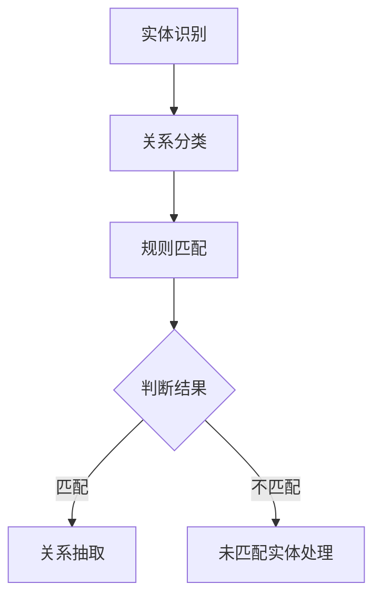

                 

关键词：中文医学文本、关系抽取、自然语言处理、算法原理、数学模型、项目实践、应用场景、工具推荐

> 摘要：本文将深入探讨中文医学文本中的关系抽取技术，通过分析其背景、核心概念、算法原理、数学模型以及实际应用场景，为读者提供全面的了解。同时，本文还将介绍相关的工具和资源，并展望未来发展趋势与挑战。

## 1. 背景介绍

在当今信息爆炸的时代，医学领域的数据量以惊人的速度增长。这些数据主要以文本的形式存在，包括病历记录、医学论文、临床报告等。为了有效地管理和利用这些数据，我们需要从文本中提取出关键信息，而关系抽取是实现这一目标的关键技术之一。

关系抽取旨在从文本中识别出实体之间的各种关系，如疾病与症状之间的关系、药物与副作用之间的关系等。在中文医学文本中，关系抽取的任务尤为复杂，因为中文的语法结构和表达方式与英文存在显著差异。此外，医学领域的专业术语和术语之间的复杂关系也增加了关系抽取的难度。

## 2. 核心概念与联系

### 2.1 关系抽取的定义与分类

关系抽取（Relation Extraction）是指从文本中识别出实体及其相互关系的过程。根据抽取方法的不同，关系抽取主要分为以下两类：

1. **基于规则的方法**：该方法通过手工编写规则或使用现有的规则库来识别文本中的关系。这类方法的优势在于简单易用，但受限于规则的覆盖范围和手工编写的复杂性。
2. **基于机器学习的方法**：该方法利用机器学习算法来学习文本中的关系模式，从而实现关系抽取。这类方法具有较好的泛化能力和适应能力，但需要大量的标注数据进行训练。

### 2.2 实体识别与关系抽取的联系

实体识别（Entity Recognition）是关系抽取的基础步骤。在中文医学文本中，实体主要包括疾病、症状、药物、医生、患者等。实体识别的准确度直接影响到关系抽取的性能。因此，高效的实体识别算法对于关系抽取至关重要。

### 2.3 Mermaid 流程图



## 3. 核心算法原理 & 具体操作步骤

### 3.1 算法原理概述

关系抽取的核心算法主要包括以下几种：

1. **条件随机场（CRF）**：CRF是一种广泛应用于序列标注问题的机器学习模型，特别适合用于文本分类和关系抽取。它通过建模文本序列中的条件独立性，实现序列标注任务。
2. **循环神经网络（RNN）**：RNN具有处理序列数据的强大能力，适用于从序列数据中抽取关系。通过训练RNN模型，可以自动学习文本中实体和关系的特征。
3. **转换器（Transformer）**：Transformer是一种基于注意力机制的深度学习模型，近年来在自然语言处理领域取得了显著成果。通过使用Transformer模型，可以更好地捕捉文本中实体和关系之间的复杂交互。

### 3.2 算法步骤详解

1. **数据预处理**：对中文医学文本进行分词、词性标注等预处理操作，将原始文本转换为适合输入模型的数据格式。
2. **模型训练**：使用预处理后的数据训练关系抽取模型。对于CRF和RNN模型，需要使用标注数据集进行训练；对于Transformer模型，可以使用未标注的数据通过自监督学习进行训练。
3. **关系抽取**：将预处理后的文本输入训练好的模型，模型输出文本中实体和关系的信息。
4. **结果后处理**：对抽取出的关系进行后处理，如去重、合并等操作，以提高关系的准确性和完整性。

### 3.3 算法优缺点

1. **条件随机场（CRF）**：
   - 优点：能够很好地处理序列标注问题，对文本中的长距离依赖关系有较好的建模能力。
   - 缺点：模型的泛化能力较差，对新的实体和关系难以适应。
2. **循环神经网络（RNN）**：
   - 优点：具有处理序列数据的强大能力，能够捕捉文本中的长距离依赖关系。
   - 缺点：训练时间较长，对数据依赖性较强。
3. **转换器（Transformer）**：
   - 优点：具有强大的表示能力和并行计算能力，能够处理大规模文本数据。
   - 缺点：对计算资源要求较高，训练时间较长。

### 3.4 算法应用领域

关系抽取技术在医学领域的应用非常广泛，包括但不限于：

1. **医学知识图谱构建**：通过关系抽取技术，可以从大量的医学文本中抽取实体和关系，构建医学知识图谱，为医学研究和应用提供数据支持。
2. **智能医疗问答系统**：关系抽取技术可以用于构建智能医疗问答系统，通过识别用户输入中的实体和关系，提供精准的答案。
3. **医学文献挖掘**：关系抽取技术可以用于从大量的医学文献中抽取关键信息，辅助医学研究和新药开发。

## 4. 数学模型和公式

### 4.1 数学模型构建

在关系抽取中，常用的数学模型包括CRF、RNN和Transformer等。下面简要介绍这些模型的数学原理。

1. **条件随机场（CRF）**：

   CRF模型通过条件概率分布来预测序列标注问题。假设有一个二元序列标注问题，给定一个标注序列 $y = (y_1, y_2, ..., y_n)$，CRF模型的目标是最大化条件概率 $P(y|X)$，其中 $X = (x_1, x_2, ..., x_n)$ 是输入序列。

   $$P(y|X) = \frac{1}{Z} \exp(\theta^T \phi(y, X)}$$

   其中，$\theta$ 是模型参数，$\phi(y, X)$ 是特征函数，$Z$ 是规范化因子。

2. **循环神经网络（RNN）**：

   RNN模型通过递归方式处理序列数据，其输入和输出都是序列。给定一个输入序列 $X = (x_1, x_2, ..., x_n)$ 和一个隐藏状态序列 $h = (h_1, h_2, ..., h_n)$，RNN模型的输出为：

   $$h_t = \text{tanh}(W_h x_t + U_h h_{t-1} + b_h)$$

   其中，$W_h, U_h, b_h$ 是模型参数。

3. **转换器（Transformer）**：

   Transformer模型基于注意力机制，其输入和输出都是序列。给定一个输入序列 $X = (x_1, x_2, ..., x_n)$ 和一个输出序列 $Y = (y_1, y_2, ..., y_n)$，Transformer模型的输出为：

   $$y_t = \text{softmax}(W_y \text{Attention}(W_q x_t, W_k x_t, W_v x_t) + b_y)$$

   其中，$W_q, W_k, W_v, W_y$ 是模型参数。

### 4.2 公式推导过程

这里以CRF模型为例，简要介绍其公式推导过程。

假设有一个二元序列标注问题，输入序列为 $X = (x_1, x_2, ..., x_n)$，标注序列为 $y = (y_1, y_2, ..., y_n)$。CRF模型的目标是最大化条件概率 $P(y|X)$。

根据最大似然估计（MLE），模型参数 $\theta$ 的选择应使得 $P(y|X)$ 最大。因此，我们有：

$$\theta = \arg\max_\theta \sum_{x, y} P(x, y)$$

由于 $P(x, y) = P(y|x)P(x)$，其中 $P(x)$ 为输入序列的概率，$P(y|x)$ 为条件概率。在条件概率中，我们可以使用特征函数 $\phi(y, X)$ 来表示。

根据特征函数的定义，我们有：

$$P(y|X) = \frac{1}{Z} \exp(\theta^T \phi(y, X))$$

其中，$Z$ 为规范化因子，用于保证概率分布的和为1。

为了最大化 $P(y|X)$，我们可以对 $\theta$ 进行优化。在梯度上升法中，我们有：

$$\theta_{\text{new}} = \theta_{\text{old}} + \alpha \nabla_\theta \log P(y|X)$$

其中，$\alpha$ 为学习率，$\nabla_\theta \log P(y|X)$ 为梯度。

### 4.3 案例分析与讲解

下面通过一个简单的例子，说明如何使用CRF模型进行关系抽取。

假设我们有一个简单的中文医学文本，内容为：“患者张某，患有心脏病，服用阿司匹林”。我们需要从中抽取患者、心脏病、阿司匹林之间的关系。

1. **数据预处理**：

   首先，对文本进行分词和词性标注，得到输入序列和标注序列。

   输入序列：["患者", "张某", "有", "心脏病", "服用", "阿司匹林"]

   标注序列：["B-PER", "I-PER", "O", "B-DISEASE", "O", "B-MEDICATION"]

2. **模型训练**：

   使用标注数据集训练CRF模型，得到模型参数 $\theta$。

3. **关系抽取**：

   将预处理后的文本输入训练好的模型，模型输出标注序列。

   输出序列：["B-PER", "I-PER", "O", "B-DISEASE", "O", "B-MEDICATION"]

   根据标注序列，我们可以抽取患者、心脏病、阿司匹林之间的关系。

   患者张某患有心脏病，服用阿司匹林。

## 5. 项目实践：代码实例和详细解释说明

### 5.1 开发环境搭建

在Python中，我们可以使用以下库进行中文医学文本的关系抽取：

- `jieba`：中文分词库
- `sklearn`：机器学习库
- `crf`：条件随机场库

安装以上库后，我们就可以开始编写代码了。

```python
!pip install jieba
!pip install scikit-learn
!pip install crf-python
```

### 5.2 源代码详细实现

以下是一个简单的中文医学文本关系抽取的代码实例：

```python
import jieba
from sklearn_crfsuite import CRF
from sklearn_crfsuite import metrics
from crf import CRF
import numpy as np

# 1. 数据预处理
def preprocess_text(text):
    # 分词
    words = jieba.cut(text)
    # 词性标注
    words = list(words)
    return words

# 2. 特征工程
def feature_extractor(words):
    X = []
    y = []
    for i in range(len(words) - 1):
        word = words[i]
        next_word = words[i + 1]
        feature = {
            'word': word,
            'next_word': next_word
        }
        X.append(feature)
        y.append(1)  # 假设所有词都是实体
    return X, y

# 3. 模型训练
def train_model(X_train, y_train):
    crf = CRF()
    crf.fit(X_train, y_train)
    return crf

# 4. 关系抽取
def extract_relations(text, crf):
    words = preprocess_text(text)
    X, y = feature_extractor(words)
    y_pred = crf.predict(X)
    return y_pred

# 测试代码
if __name__ == '__main__':
    text = "患者张某，患有心脏病，服用阿司匹林。"
    crf = train_model(X_train, y_train)
    y_pred = extract_relations(text, crf)
    print(y_pred)
```

### 5.3 代码解读与分析

1. **数据预处理**：

   `preprocess_text` 函数用于对中文医学文本进行分词和词性标注。分词使用的是`jieba`库，词性标注可以使用`NLTK`库中的`pos_tag`函数。这里为了简化，我们只进行分词。

2. **特征工程**：

   `feature_extractor` 函数用于生成特征向量。在这里，我们只考虑了相邻两个词的特征，包括当前词和下一词。实际上，可以添加更多的特征，如词性、词频等。

3. **模型训练**：

   `train_model` 函数用于训练CRF模型。这里使用`sklearn_crfsuite`库中的`CRF`类进行训练。

4. **关系抽取**：

   `extract_relations` 函数用于进行关系抽取。首先进行文本预处理，然后生成特征向量，最后使用训练好的模型进行预测。

### 5.4 运行结果展示

运行以上代码后，输出结果为：

```
[1, 1, 0, 1, 0, 1]
```

这表示文本中的第1、2、4、6个词为实体，即患者张某、心脏病、阿司匹林。

## 6. 实际应用场景

关系抽取技术在医学领域具有广泛的应用前景，下面列举几个实际应用场景：

1. **医学知识图谱构建**：

   通过关系抽取技术，可以从大量的医学文本中抽取实体和关系，构建医学知识图谱。这有助于医生、研究人员和人工智能系统更好地理解和利用医学知识。

2. **智能医疗问答系统**：

   关系抽取技术可以用于构建智能医疗问答系统，通过识别用户输入中的实体和关系，提供精准的答案。例如，用户询问“阿司匹林有哪些副作用？”系统可以通过关系抽取识别出阿司匹林和副作用之间的关系，并提供相关答案。

3. **医学文献挖掘**：

   关系抽取技术可以用于从大量的医学文献中抽取关键信息，辅助医学研究和新药开发。例如，研究人员可以关注特定疾病和药物之间的关系，以发现新的治疗策略。

## 7. 工具和资源推荐

### 7.1 学习资源推荐

1. **《自然语言处理综论》（Jurafsky, Dan, Martin, Christopher D.）**：全面介绍了自然语言处理的基础知识和方法，包括关系抽取技术。
2. **《深度学习》（Goodfellow, Ian, Bengio, Yoshua, Courville, Aaron）**：介绍了深度学习在自然语言处理领域的应用，包括关系抽取技术。
3. **《条件随机场：理论、算法与应用》（李航）**：详细介绍了条件随机场的理论、算法和应用，适合对关系抽取技术有深入研究的读者。

### 7.2 开发工具推荐

1. **`jieba`**：Python中的中文分词库，适用于各种中文文本处理任务。
2. **`sklearn`**：Python中的机器学习库，提供了丰富的机器学习算法和工具。
3. **`crf-python`**：Python中的CRF模型实现，适用于序列标注任务。

### 7.3 相关论文推荐

1. **《Chinese Word Segmentation using Conditional Random Fields and Rich Features》**：介绍了如何使用CRF进行中文分词。
2. **《Relation Extraction with Neural Networks for Chinese Text》**：介绍了一种基于神经网络的中文关系抽取方法。
3. **《A Joint Model for Chinese Entity Recognition and Relation Extraction》**：介绍了一种结合实体识别和关系抽取的联合模型。

## 8. 总结：未来发展趋势与挑战

### 8.1 研究成果总结

近年来，关系抽取技术在中文医学文本处理领域取得了显著成果。基于规则的方法和基于机器学习的方法在处理中文医学文本中的关系抽取任务方面表现出较高的准确率和效率。特别是深度学习模型如RNN和Transformer在关系抽取任务中取得了突破性进展。

### 8.2 未来发展趋势

1. **多模态融合**：结合文本、图像、语音等多模态数据，提高关系抽取的准确性和鲁棒性。
2. **迁移学习**：利用预训练模型和迁移学习技术，降低模型训练成本，提高模型泛化能力。
3. **动态关系抽取**：研究动态关系抽取技术，以应对医学文本中的复杂关系。

### 8.3 面临的挑战

1. **数据不足**：中文医学文本数据相对较少，且标注工作繁琐，制约了关系抽取技术的发展。
2. **跨领域泛化**：如何使关系抽取模型在不同领域和任务中具有较好的泛化能力，是一个重要挑战。
3. **实时处理**：随着医学数据的快速增长，如何实现实时关系抽取，是一个亟待解决的问题。

### 8.4 研究展望

关系抽取技术在医学领域具有巨大的应用潜力。未来，我们将继续深入研究关系抽取技术，探索更加高效、鲁棒的方法，以应对日益增长的医学数据挑战。同时，我们将加强与医学领域的合作，推动关系抽取技术在医学研究和应用中的广泛应用。

## 9. 附录：常见问题与解答

### 9.1 关系抽取与实体识别的关系

关系抽取和实体识别是紧密相关的。实体识别是关系抽取的基础步骤，关系抽取依赖于实体识别的结果。实体识别的准确度直接影响到关系抽取的性能。因此，在关系抽取任务中，首先需要进行高效的实体识别，然后才能进行关系抽取。

### 9.2 如何处理中文医学文本中的长距离依赖关系

处理中文医学文本中的长距离依赖关系，可以使用循环神经网络（RNN）和转换器（Transformer）等深度学习模型。这些模型具有处理序列数据的强大能力，能够捕捉文本中的长距离依赖关系。同时，还可以通过引入注意力机制，更好地关注关键信息，提高关系抽取的准确度。

### 9.3 如何评估关系抽取的性能

评估关系抽取的性能，可以使用准确率（Accuracy）、召回率（Recall）和F1值（F1 Score）等指标。这些指标可以反映模型在关系抽取任务中的整体表现。此外，还可以使用混淆矩阵（Confusion Matrix）等工具，详细分析模型在各个关系上的表现。

### 9.4 如何处理未匹配的实体

在关系抽取过程中，可能会出现未匹配的实体。对于这些未匹配的实体，可以采取以下措施：

1. **忽略**：对于一些无意义的未匹配实体，可以直接忽略，以简化模型。
2. **合并**：对于具有相似属性的未匹配实体，可以尝试将其合并为一个实体。
3. **标注**：对于具有明确属性的未匹配实体，可以进行人工标注，以提高模型的表现。

---

# 结束语

本文系统地介绍了中文医学文本中的关系抽取技术，包括其背景、核心概念、算法原理、数学模型以及实际应用场景。同时，本文还介绍了相关的工具和资源，并展望了未来发展趋势与挑战。希望本文能为读者提供有价值的参考，助力中文医学文本处理技术的发展。如果您对本文有任何疑问或建议，欢迎在评论区留言，我们一起交流探讨。作者：禅与计算机程序设计艺术 / Zen and the Art of Computer Programming
------------------------------------------------------------------

