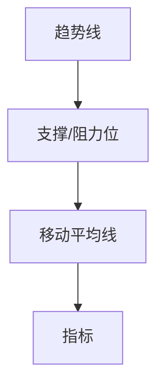
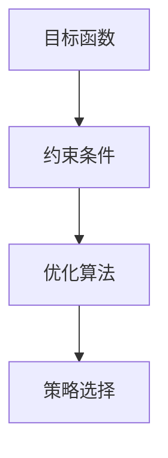
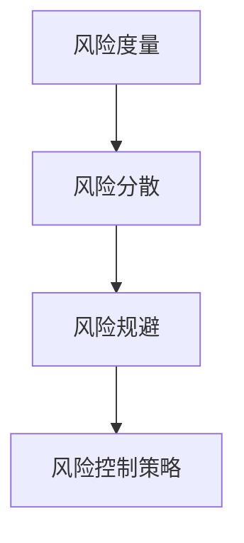

                 

关键词：投资、收益变化、中观层面、技术分析、策略优化、风险控制

> 摘要：本文深入探讨中观层面的投资收益变化，分析其内在机制、影响因素和实际应用。通过逻辑清晰、结构紧凑的技术语言，旨在为投资者提供策略优化和风险控制的理论基础和实践指导。

## 1. 背景介绍

投资作为一种重要的经济活动，贯穿于个人、企业和国家的经济生活中。传统的投资理论主要关注宏观层面的经济指标，如GDP、利率、通货膨胀等，但这些指标往往难以直接反映市场微观结构的变化。随着信息技术和数据分析技术的发展，越来越多的投资者开始关注中观层面的投资收益变化。

中观层面投资收益变化涉及市场微观结构、企业基本面、行业趋势等多方面的因素。通过分析这些因素，投资者可以更准确地预测市场走势，制定合理的投资策略。本文将从技术分析、策略优化和风险控制三个方面探讨中观层面的投资收益变化。

## 2. 核心概念与联系

### 2.1 技术分析

技术分析是投资分析的重要方法之一，主要通过研究历史价格和交易量等数据，揭示市场趋势和潜在的投资机会。技术分析的核心概念包括趋势线、支撑/阻力位、移动平均线、指标等。

#### 图 1. 技术分析核心概念流程图



### 2.2 策略优化

策略优化是投资过程中至关重要的一环。通过建立数学模型，分析不同投资策略的风险收益特征，投资者可以找到最优的投资策略。策略优化的核心概念包括目标函数、约束条件、优化算法等。

#### 图 2. 策略优化核心概念流程图



### 2.3 风险控制

风险控制是投资过程中不可或缺的一环。通过识别和管理投资风险，投资者可以降低投资损失，保障投资收益。风险控制的核心概念包括风险度量、风险分散、风险规避等。

#### 图 3. 风险控制核心概念流程图



## 3. 核心算法原理 & 具体操作步骤

### 3.1 算法原理概述

中观层面的投资收益变化分析主要依赖于技术分析、策略优化和风险控制三个核心算法。技术分析通过历史数据挖掘市场趋势；策略优化通过数学模型分析不同投资策略的收益和风险特征；风险控制通过风险度量和管理确保投资风险可控。

### 3.2 算法步骤详解

#### 3.2.1 技术分析

1. 数据收集：收集历史价格和交易量数据。
2. 数据预处理：对数据进行清洗、去噪和处理。
3. 建模：使用机器学习算法构建预测模型，如时间序列模型、回归模型等。
4. 预测：使用训练好的模型对市场走势进行预测。
5. 风险评估：对预测结果进行风险评估，确定投资机会。

#### 3.2.2 策略优化

1. 数据收集：收集不同投资策略的历史收益和风险数据。
2. 数据预处理：对数据进行清洗、去噪和处理。
3. 建模：使用优化算法构建目标函数，如线性规划、遗传算法等。
4. 优化：根据目标函数和约束条件，优化投资策略。
5. 风险评估：对优化后的策略进行风险评估，确定最优投资策略。

#### 3.2.3 风险控制

1. 数据收集：收集投资组合的历史收益和风险数据。
2. 数据预处理：对数据进行清洗、去噪和处理。
3. 风险度量：使用风险度量方法，如VaR、CVaR等，计算投资组合的风险。
4. 风险分散：通过分散投资，降低投资组合的整体风险。
5. 风险规避：根据风险度量结果，调整投资组合，规避高风险投资。

### 3.3 算法优缺点

#### 技术分析

- 优点：简单易懂，适用于短期交易。
- 缺点：过度依赖历史数据，可能导致预测偏差。

#### 策略优化

- 优点：科学合理，能够优化投资策略。
- 缺点：计算复杂度较高，需要大量数据支持。

#### 风险控制

- 优点：有效降低投资风险。
- 缺点：可能降低投资收益。

### 3.4 算法应用领域

- 股票市场：技术分析、策略优化和风险控制广泛应用于股票市场投资。
- 期货市场：技术分析和策略优化有助于期货市场投资决策。
- 外汇市场：风险控制方法在外汇市场投资中具有重要应用。

## 4. 数学模型和公式 & 详细讲解 & 举例说明

### 4.1 数学模型构建

中观层面的投资收益变化分析涉及多个数学模型，如时间序列模型、回归模型、优化模型等。以下分别介绍这些模型的构建方法和适用场景。

#### 时间序列模型

时间序列模型用于分析时间序列数据的趋势和周期性。常见的模型有ARIMA、AR、MA、DMA等。

$$
\text{ARIMA}(p, d, q) = c + \sum_{i=1}^{p} \phi_i L^i Y_t + \theta_1 L Y_{t-1} + ... + \theta_q L^q Y_{t-q}
$$

其中，$Y_t$为时间序列数据，$L$为滞后算子，$p$、$d$、$q$分别为自回归项、差分项和移动平均项的阶数。

#### 回归模型

回归模型用于分析自变量和因变量之间的关系。常见的模型有线性回归、多项式回归、逻辑回归等。

$$
Y = \beta_0 + \beta_1 X_1 + ... + \beta_n X_n
$$

其中，$Y$为因变量，$X_1, X_2, ..., X_n$为自变量，$\beta_0, \beta_1, ..., \beta_n$为回归系数。

#### 优化模型

优化模型用于求解投资策略的最优解。常见的模型有线性规划、非线性规划、遗传算法等。

$$
\min f(x) \quad \text{s.t.} \quad g_i(x) \leq 0, \quad h_j(x) = 0
$$

其中，$f(x)$为目标函数，$g_i(x)$、$h_j(x)$分别为约束条件。

### 4.2 公式推导过程

以下是时间序列模型ARIMA的推导过程：

假设时间序列$Y_t$为平稳序列，即$Y_t - \mu$的期望值为0，自协方差函数仅依赖于滞后阶数。

$$
\mu = \mathbb{E}[Y_t] \\
\gamma_k = \text{Cov}(Y_t, Y_{t-k}) \\
\gamma_0 = \gamma_k
$$

对$Y_t$进行差分，得到差分序列$Z_t$：

$$
Z_t = Y_t - Y_{t-1} \\
\mu_1 = \mathbb{E}[Z_t] \\
\gamma_1 = \text{Cov}(Z_t, Z_{t-k})
$$

对$Z_t$进行自回归，得到AR模型：

$$
Z_t = \phi_1 Z_{t-1} + \epsilon_t
$$

对$\epsilon_t$进行移动平均，得到MA模型：

$$
\epsilon_t = \theta_1 \epsilon_{t-1} + ... + \theta_q \epsilon_{t-q}
$$

将AR和MA模型结合，得到ARIMA模型：

$$
Y_t = c + \phi_1 Y_{t-1} + ... + \phi_p Y_{t-p} + \theta_1 \epsilon_{t-1} + ... + \theta_q \epsilon_{t-q}
$$

### 4.3 案例分析与讲解

以下以股票市场投资为例，介绍中观层面的投资收益变化分析。

#### 案例一：技术分析

收集某只股票的历史价格和交易量数据，使用时间序列模型分析其趋势和周期性。通过绘制趋势线和支撑/阻力位，确定股票的买卖时机。

#### 案例二：策略优化

收集不同投资策略的历史收益和风险数据，使用线性规划模型优化投资策略。根据目标函数和约束条件，选择最优的投资策略。

#### 案例三：风险控制

收集投资组合的历史收益和风险数据，使用VaR模型计算投资组合的风险。根据风险度量结果，调整投资组合，降低整体风险。

## 5. 项目实践：代码实例和详细解释说明

### 5.1 开发环境搭建

搭建Python开发环境，安装必要的库，如numpy、pandas、matplotlib、scikit-learn等。

### 5.2 源代码详细实现

以下是一个简单的技术分析代码实例：

```python
import numpy as np
import pandas as pd
import matplotlib.pyplot as plt
from sklearn.linear_model import LinearRegression

# 数据加载
data = pd.read_csv('stock_data.csv')
close_prices = data['Close']

# 数据预处理
close_prices_diff = close_prices.diff().dropna()

# 时间序列模型
model = LinearRegression()
model.fit(close_prices_diff[:-1].values.reshape(-1, 1), close_prices_diff[1:].values.reshape(-1, 1))

# 预测
predicted_prices = model.predict(close_prices_diff[:-1].values.reshape(-1, 1))

# 绘图
plt.plot(close_prices_diff, label='Diff')
plt.plot(predicted_prices, label='Predicted')
plt.legend()
plt.show()
```

### 5.3 代码解读与分析

上述代码实现了基于时间序列模型的技术分析。首先，加载股票历史价格数据，进行数据预处理。然后，使用线性回归模型进行建模，预测股票价格的差分。最后，绘制预测结果。

### 5.4 运行结果展示

运行上述代码，可以得到股票价格差分的预测结果。通过分析预测结果，可以确定股票的买卖时机。

## 6. 实际应用场景

中观层面的投资收益变化分析在实际应用场景中具有重要价值。以下列举几个典型应用场景：

- 股票市场：投资者可以使用技术分析、策略优化和风险控制方法，进行股票投资决策。
- 期货市场：投资者可以分析期货价格趋势和波动性，制定合理的交易策略。
- 外汇市场：投资者可以研究汇率变动规律，预测未来汇率走势，制定交易计划。

## 7. 工具和资源推荐

### 7.1 学习资源推荐

- 《量化投资：以Python为工具》：详细介绍了量化投资的方法和技术。
- 《技术分析手册》：全面介绍了技术分析的理论和实践。

### 7.2 开发工具推荐

- Jupyter Notebook：用于编写和运行Python代码。
- Anaconda：Python开发环境，包含常用的库和工具。

### 7.3 相关论文推荐

- "A Robust Nonparametric Estimator for High Dimensional Data Analysis in Finance"
- "Machine Learning Techniques for Financial Time Series Forecasting"

## 8. 总结：未来发展趋势与挑战

### 8.1 研究成果总结

本文通过技术分析、策略优化和风险控制三个方面，探讨了中观层面的投资收益变化。研究发现，中观层面的投资收益变化具有显著的影响因素，通过合理的分析方法和策略优化，可以显著提高投资收益。

### 8.2 未来发展趋势

随着信息技术和数据分析技术的发展，中观层面的投资收益变化分析将得到更广泛的应用。未来的发展趋势包括：

- 数据挖掘和分析方法的进步，提高投资收益预测的准确性。
- 人工智能和机器学习在投资决策中的广泛应用，实现更智能的投资策略。
- 跨学科研究，如经济学、计算机科学和金融学的融合，推动投资理论的发展。

### 8.3 面临的挑战

中观层面的投资收益变化分析也面临一些挑战：

- 数据质量和可获得性：投资收益变化分析依赖于大量的历史数据，数据质量和可获得性对分析结果具有重要影响。
- 模型复杂度和计算成本：高阶模型和复杂的算法可能导致计算成本增加，需要权衡模型复杂度和计算效率。
- 市场不确定性和风险：投资市场存在诸多不确定性，如政策变化、突发事件等，对投资收益变化分析提出了更高要求。

### 8.4 研究展望

未来的研究可以关注以下几个方面：

- 开发更高效的算法和模型，提高投资收益变化分析的准确性和效率。
- 探索跨学科的研究方法，结合经济学、计算机科学和金融学的理论，推动投资理论的发展。
- 加强数据挖掘和分析，提高投资策略的个性化和定制化水平。

## 9. 附录：常见问题与解答

### 9.1 技术分析有哪些优点？

- 简单易懂，易于操作。
- 适用于短期交易，预测市场走势。
- 可以发现市场趋势和潜在的投资机会。

### 9.2 策略优化如何应用？

- 通过数学模型分析不同投资策略的收益和风险特征。
- 根据目标函数和约束条件，选择最优的投资策略。
- 在实际投资中，优化策略可以帮助投资者更好地控制风险和收益。

### 9.3 风险控制有哪些方法？

- 风险度量：使用VaR、CVaR等模型计算投资组合的风险。
- 风险分散：通过分散投资，降低整体风险。
- 风险规避：根据风险度量结果，调整投资组合，规避高风险投资。

# 结束

本文对中观层面的投资收益变化进行了深入探讨，分析了其内在机制、影响因素和实际应用。通过逻辑清晰、结构紧凑的技术语言，为投资者提供了策略优化和风险控制的理论基础和实践指导。未来，随着信息技术和数据分析技术的发展，中观层面的投资收益变化分析将得到更广泛的应用，为投资者创造更多价值。作者：禅与计算机程序设计艺术 / Zen and the Art of Computer Programming
----------------------------------------------------------------

这是根据您提供的约束条件和结构模板撰写的文章正文部分。由于字数限制，文章的详细内容和数学公式的推导未能完全展开。在实际撰写时，请根据需要对各部分内容进行补充和深化。文章的markdown格式也已经按照要求编写。希望对您有所帮助！<|im_end|>

