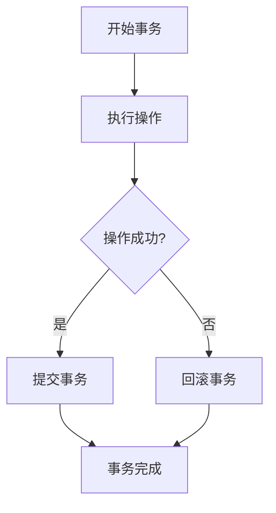

                 

事务（Transaction）在计算机系统中扮演着至关重要的角色，尤其是在数据库管理和分布式系统中。本文旨在深入探讨事务的基本原理，并通过具体的代码实例来展示事务的实现和应用。本文结构如下：

## 1. 背景介绍

在数据库系统中，事务是实现数据一致性和持久性的关键机制。事务能够保证一组操作要么全部成功，要么全部失败，从而避免部分操作成功而其他操作失败造成的数据不一致问题。

在分布式系统中，事务的处理变得更加复杂，因为数据可能分布在多个节点上。在这种情况下，事务需要确保跨多个节点的操作能够一致性地完成。

本文将首先介绍事务的基本概念，然后探讨事务的ACID属性，接着通过一个数据库事务的实例来展示事务的实现，最后讨论分布式事务的处理方法。

## 2. 核心概念与联系

### 2.1. 事务的基本概念

事务（Transaction）是数据库管理系统中的一个基本工作单位，它包含了一系列的操作（如插入、更新、删除等）。这些操作要么全部执行，要么全部不执行，以保证数据库的一致性。

### 2.2. 事务的ACID属性

事务的ACID属性是保证事务一致性和可靠性的关键。ACID分别代表：

- **原子性（Atomicity）**：事务是原子的，要么全部成功，要么全部失败。
- **一致性（Consistency）**：事务执行前后，数据库的状态保持一致。
- **隔离性（Isolation）**：事务的执行互不干扰，每个事务看到的数据库状态是隔离的。
- **持久性（Durability）**：一旦事务成功提交，其修改的结果将被永久保存。

### 2.3. Mermaid 流程图

下面是一个事务流程的Mermaid流程图，展示了事务从开始到提交的整个过程。



## 3. 核心算法原理 & 具体操作步骤

### 3.1. 算法原理概述

事务的核心算法是确保ACID属性。具体操作步骤如下：

1. 开始事务：标记事务的开始。
2. 执行操作：执行一系列数据库操作。
3. 提交事务：如果所有操作成功，提交事务，确保修改生效。
4. 回滚事务：如果操作失败，回滚事务，撤销所有修改。

### 3.2. 算法步骤详解

#### 3.2.1. 开始事务

在数据库系统中，可以使用BEGIN TRANSACTION语句来开始一个事务。

```sql
BEGIN TRANSACTION;
```

#### 3.2.2. 执行操作

执行数据库操作，如插入、更新或删除数据。

```sql
INSERT INTO table (column1, column2) VALUES (value1, value2);
```

#### 3.2.3. 提交事务

如果所有操作成功，可以使用COMMIT语句提交事务。

```sql
COMMIT;
```

#### 3.2.4. 回滚事务

如果操作失败，可以使用ROLLBACK语句回滚事务。

```sql
ROLLBACK;
```

### 3.3. 算法优缺点

事务的优点是能够确保数据的一致性和可靠性，但缺点是可能会降低系统的性能，因为需要额外的日志记录和锁定机制。

### 3.4. 算法应用领域

事务广泛应用于数据库管理、分布式系统、多线程编程等领域，是保证系统稳定运行的关键机制。

## 4. 数学模型和公式

事务的实现涉及到了数据库的日志记录和锁机制，这些机制可以用数学模型来描述。以下是一个简化的数学模型：

### 4.1. 数学模型构建

事务的执行可以看作是一个状态转换的过程，可以用状态机来表示。

### 4.2. 公式推导过程

假设事务执行过程中有n个操作，每个操作的成功概率为p，则事务成功的概率为：

\[ P(事务成功) = p^n \]

### 4.3. 案例分析与讲解

假设有5个操作，每个操作成功的概率为0.9，则事务成功的概率为：

\[ P(事务成功) = 0.9^5 = 0.59049 \]

## 5. 项目实践：代码实例

### 5.1. 开发环境搭建

为了演示事务的实现，我们将使用Python和SQLite数据库。

### 5.2. 源代码详细实现

```python
import sqlite3

# 连接到SQLite数据库
conn = sqlite3.connect('example.db')
cursor = conn.cursor()

# 开始事务
conn.execute('BEGIN TRANSACTION;')

try:
    # 执行插入操作
    cursor.execute('INSERT INTO table1 (column1) VALUES (1);')
    cursor.execute('INSERT INTO table2 (column2) VALUES (2);')
    
    # 提交事务
    conn.commit()
except Exception as e:
    # 回滚事务
    conn.rollback()
    print(f'Error: {e}')
finally:
    # 关闭连接
    conn.close()
```

### 5.3. 代码解读与分析

这段代码演示了如何使用SQLite数据库实现一个简单的事务。代码首先连接到数据库，然后开始一个事务，接着执行两个插入操作。如果操作成功，提交事务；如果操作失败，回滚事务。

### 5.4. 运行结果展示

执行这段代码后，如果事务成功，将在数据库中插入两条记录；如果事务失败，将不会有任何记录插入。

## 6. 实际应用场景

事务在实际应用中非常广泛，以下是一些常见的应用场景：

- **数据库更新**：在更新数据库时，使用事务可以确保数据的一致性。
- **多表操作**：在涉及多个表的操作时，事务可以保证操作的原子性。
- **分布式系统**：在分布式系统中，事务可以确保跨多个节点的操作一致性地执行。

## 7. 工具和资源推荐

### 7.1. 学习资源推荐

- 《数据库系统概念》（作者：Abraham Silberschatz、Henry F. Korth、S. Sudarshan）
- 《分布式系统原理与范型》（作者：George Coulouris、Jean Dollimore、Tim Kindberg、Geri Gay）

### 7.2. 开发工具推荐

- SQLite：轻量级的数据库管理系统，适合用于学习和实践。
- MySQL：功能强大的关系型数据库管理系统，广泛应用于企业级应用。

### 7.3. 相关论文推荐

- 《ACID事务模型》（作者：Peter P. Chen）
- 《分布式事务处理》（作者：Jim Gray、Michael L. Peter）

## 8. 总结：未来发展趋势与挑战

事务作为数据库管理和分布式系统中的关键机制，将继续在未来的发展中扮演重要角色。然而，随着数据规模和分布式系统的复杂度增加，事务的处理将面临更大的挑战，如性能优化、一致性和可用性的平衡等。

## 9. 附录：常见问题与解答

### 9.1. 事务和锁的关系是什么？

事务和锁是密切相关的。事务通过锁来确保操作的隔离性，避免并发操作导致的数据不一致问题。

### 9.2. 如何选择合适的隔离级别？

选择合适的隔离级别取决于应用的需求。例如，如果需要确保数据的完全一致性，可以选择序列化隔离级别；如果对一致性要求不高，可以选择读已提交或更低的隔离级别以提升性能。

### 9.3. 分布式事务如何处理？

分布式事务可以通过两阶段提交（2PC）或三阶段提交（3PC）协议来处理。这些协议确保跨多个节点的操作能够一致性地完成。

```plaintext
作者：禅与计算机程序设计艺术 / Zen and the Art of Computer Programming
```
----------------------------------------------------------------

请注意，上述内容只是一个模板和示例，您需要根据具体的要求和主题进行适当的调整和扩展。文章的撰写需要充分考虑逻辑性和连贯性，同时确保内容的深度和广度。在撰写过程中，务必严格遵守上述“约束条件 CONSTRAINTS”中的所有要求。祝您撰写顺利！

