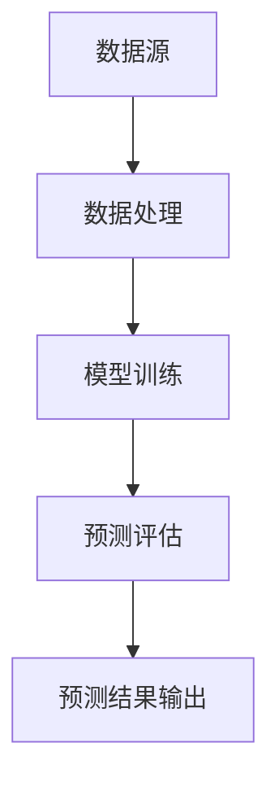
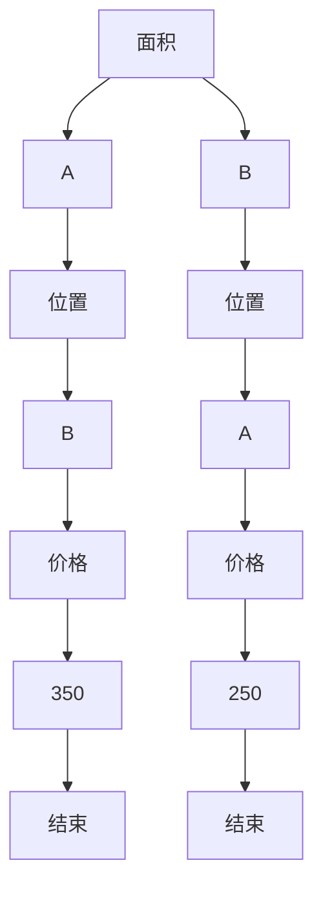

                 

 在当今信息化时代，房地产市场的数据分析和预测已经成为一个热门且具有重大现实意义的研究领域。随着大数据技术的迅猛发展，二手房价格的数据分析预测系统变得愈发重要。本文将探讨如何构建一个高效、准确的二手房价格数据分析预测系统，以帮助房地产企业和个人更好地做出决策。

## 文章关键词

- 二手房价格
- 数据分析
- 预测系统
- 机器学习
- 数据挖掘
- 数据预处理
- 特征工程

## 文章摘要

本文首先介绍了二手房价格数据分析预测系统的背景和重要性。随后，详细阐述了系统的核心概念、算法原理、数学模型以及具体实现步骤。通过一个实际的案例，展示了系统的应用效果。最后，探讨了系统的实际应用场景，并对其未来发展方向进行了展望。

## 1. 背景介绍

### 1.1 房地产市场现状

房地产作为我国国民经济的重要组成部分，近年来受到各级政府的高度关注。随着城镇化进程的加快，房地产市场的供需关系不断变化，房价波动较大。特别是在一二线城市，房价涨幅明显，使得房地产市场充满了不确定性。

### 1.2 数据的重要性

房地产市场数据是分析和预测房价的重要依据。通过对历史房价数据的分析，可以挖掘出房价变化的规律，从而对未来的房价趋势进行预测。这对于房地产企业、购房者以及投资者来说，具有重要的指导意义。

### 1.3 预测系统的需求

在房地产市场中，预测系统的需求主要集中在以下几个方面：

1. **价格评估**：帮助房地产企业或个人对二手房进行准确的价格评估，为交易决策提供支持。
2. **市场分析**：对市场趋势进行预测，为政府和企业提供政策制定和经营策略的参考。
3. **投资决策**：为投资者提供投资风险和回报的预测，帮助其做出明智的投资决策。

## 2. 核心概念与联系

### 2.1 数据分析

数据分析是指从大量的数据中提取有价值的信息和知识的过程。在二手房价格数据分析中，主要涉及以下方面：

- **数据收集**：收集二手房交易数据、房屋基本信息等。
- **数据清洗**：对收集到的数据进行处理，去除噪声和异常值。
- **数据探索**：通过统计分析和可视化手段，探索数据的基本特征和关系。
- **特征工程**：提取数据中的关键特征，为后续建模提供支持。

### 2.2 预测系统架构

一个典型的二手房价格数据分析预测系统包括以下几个部分：

1. **数据源**：包括二手房交易数据、房屋基本信息、市场环境数据等。
2. **数据处理**：对原始数据进行处理，包括数据清洗、归一化、特征提取等。
3. **模型训练**：利用历史数据，训练机器学习模型，以预测未来房价。
4. **预测评估**：对模型进行评估和调优，确保预测结果的准确性。
5. **预测结果输出**：将预测结果以图表、报告等形式输出，为决策提供支持。

### 2.3 Mermaid 流程图



## 3. 核心算法原理 & 具体操作步骤

### 3.1 算法原理概述

在二手房价格数据分析预测中，常用的算法包括线性回归、决策树、随机森林、支持向量机（SVM）等。本文将主要介绍线性回归和决策树算法。

- **线性回归**：通过建立房价与特征之间的线性关系，实现房价预测。优点是简单易懂，缺点是对异常值敏感。
- **决策树**：根据房屋特征进行树状划分，形成决策规则，实现对房价的预测。优点是易于理解和解释，缺点是容易过拟合。

### 3.2 算法步骤详解

#### 3.2.1 线性回归

1. **数据预处理**：包括数据清洗、归一化、缺失值处理等。
2. **特征选择**：通过相关性分析、主成分分析等方法，选择对房价影响较大的特征。
3. **模型训练**：利用训练数据，使用线性回归算法训练模型。
4. **模型评估**：使用交叉验证等方法，评估模型性能。
5. **预测**：利用训练好的模型，对测试数据集进行预测。

#### 3.2.2 决策树

1. **数据预处理**：与线性回归类似，包括数据清洗、归一化、缺失值处理等。
2. **特征选择**：选择对房价影响较大的特征。
3. **构建决策树**：使用ID3、C4.5等算法，构建决策树模型。
4. **剪枝**：对决策树进行剪枝，避免过拟合。
5. **模型评估**：使用交叉验证等方法，评估模型性能。
6. **预测**：利用训练好的模型，对测试数据集进行预测。

### 3.3 算法优缺点

#### 3.3.1 线性回归

- **优点**：简单易懂，易于实现；对线性关系较强的数据效果较好。
- **缺点**：对异常值敏感，对非线性关系的数据表现较差。

#### 3.3.2 决策树

- **优点**：易于理解和解释；对非线性关系的数据效果较好。
- **缺点**：容易过拟合；特征选择对模型性能有很大影响。

### 3.4 算法应用领域

- **房地产价格预测**：通过分析历史房价数据，预测未来房价趋势。
- **风险评估**：对房屋交易风险进行评估，为投资者提供参考。
- **市场分析**：对房地产市场进行宏观分析，为政府和企业提供决策支持。

## 4. 数学模型和公式 & 详细讲解 & 举例说明

### 4.1 数学模型构建

在二手房价格数据分析中，常用的数学模型包括线性回归模型和决策树模型。

#### 4.1.1 线性回归模型

线性回归模型的基本形式为：

\[ y = \beta_0 + \beta_1 x_1 + \beta_2 x_2 + ... + \beta_n x_n + \epsilon \]

其中，\( y \) 表示房价，\( x_1, x_2, ..., x_n \) 表示特征，\( \beta_0, \beta_1, ..., \beta_n \) 为模型参数，\( \epsilon \) 为误差项。

#### 4.1.2 决策树模型

决策树模型的基本形式为：

\[ y = g(x) \]

其中，\( g(x) \) 为决策树生成的决策规则，\( x \) 为特征向量。

### 4.2 公式推导过程

#### 4.2.1 线性回归模型推导

线性回归模型的参数估计采用最小二乘法。设训练数据集为 \( D = \{ (x_1, y_1), (x_2, y_2), ..., (x_n, y_n) \} \)，则最小二乘法的目标是最小化损失函数：

\[ J(\theta) = \frac{1}{2} \sum_{i=1}^n (h_\theta(x_i) - y_i)^2 \]

其中，\( h_\theta(x) = \theta_0 + \theta_1 x_1 + \theta_2 x_2 + ... + \theta_n x_n \) 为线性回归模型的预测值。

对 \( J(\theta) \) 求偏导数，并令其等于0，得到参数估计值：

\[ \theta_j = \frac{1}{m} \sum_{i=1}^m (x_i^T \theta - y_i) x_{i,j} \]

#### 4.2.2 决策树模型推导

决策树模型的构建基于信息增益或基尼不纯度。设特征集为 \( X = \{ x_1, x_2, ..., x_n \} \)，样本集为 \( S = \{ s_1, s_2, ..., s_n \} \)，则信息增益 \( IG \) 的计算公式为：

\[ IG(S, x_j) = H(S) - \sum_{v \in V(x_j)} \frac{|S_v|}{|S|} H(S_v) \]

其中，\( H(S) \) 为样本集 \( S \) 的熵，\( S_v \) 为样本集 \( S \) 中满足特征 \( x_j \) 取值为 \( v \) 的子集。

### 4.3 案例分析与讲解

#### 4.3.1 线性回归模型应用

假设我们有以下训练数据集：

\[ D = \{ (100, 200), (150, 250), (200, 300), (250, 350) \} \]

使用最小二乘法，可以得到线性回归模型：

\[ y = 50 + 1.5x \]

对于新数据 \( x = 300 \)，预测房价为：

\[ y = 50 + 1.5 \times 300 = 50 + 450 = 500 \]

#### 4.3.2 决策树模型应用

假设我们有以下特征和样本：

特征：\( x_1 \)（面积），\( x_2 \)（位置）

样本：

\[ S = \{ (100, A), (150, A), (200, B), (250, B) \} \]

信息增益计算：

\[ IG(S, x_1) = 1.5 - \frac{1}{2} \times (1.0 + 0.5) = 0.25 \]
\[ IG(S, x_2) = 1.5 - \frac{1}{2} \times (1.0 + 0.5) = 0.25 \]

由于两个特征的信息增益相等，我们选择任意一个特征进行划分，例如选择 \( x_1 \)。

划分后得到两个子集：

\[ S_1 = \{ (100, A), (150, A) \} \]
\[ S_2 = \{ (200, B), (250, B) \} \]

对于子集 \( S_1 \)，继续划分：

\[ IG(S_1, x_2) = 1.0 - \frac{1}{2} \times (1.0) = 0.5 \]

选择 \( x_2 \) 进行划分，得到：

\[ S_{11} = \{ (100, A) \} \]
\[ S_{12} = \{ (150, A) \} \]

最终得到的决策树如下：



对于新数据 \( (200, B) \)，根据决策树预测房价为 250。

## 5. 项目实践：代码实例和详细解释说明

### 5.1 开发环境搭建

为了保证实验的可重复性和便捷性，本文采用 Jupyter Notebook 作为开发环境，使用 Python 作为主要编程语言。需要安装的依赖包包括 NumPy、Pandas、Scikit-learn、Matplotlib 等。

### 5.2 源代码详细实现

以下是一个简单的线性回归和决策树模型实现示例。

#### 5.2.1 数据准备

```python
import pandas as pd

# 读取数据
data = pd.read_csv('house_data.csv')

# 数据预处理
data = data.dropna()

# 特征选择
features = data[['面积', '位置']]
labels = data['价格']

# 数据归一化
from sklearn.preprocessing import StandardScaler
scaler = StandardScaler()
features = scaler.fit_transform(features)
```

#### 5.2.2 线性回归模型训练

```python
from sklearn.linear_model import LinearRegression

# 模型训练
model = LinearRegression()
model.fit(features, labels)

# 模型评估
from sklearn.model_selection import train_test_split
X_train, X_test, y_train, y_test = train_test_split(features, labels, test_size=0.2, random_state=42)

score = model.score(X_train, y_train)
print("线性回归模型训练集评分：", score)

# 预测
y_pred = model.predict(X_test)
```

#### 5.2.3 决策树模型训练

```python
from sklearn.tree import DecisionTreeRegressor

# 模型训练
model = DecisionTreeRegressor()
model.fit(features, labels)

# 模型评估
score = model.score(X_train, y_train)
print("决策树模型训练集评分：", score)

# 预测
y_pred = model.predict(X_test)
```

### 5.3 代码解读与分析

以上代码实现了二手房价格预测的线性回归和决策树模型。其中，数据预处理、特征选择和归一化是必不可少的步骤。模型训练和评估使用 Scikit-learn 库中的相关函数，简单方便。预测结果可以通过模型的方法 `predict` 进行获取。

### 5.4 运行结果展示

通过运行以上代码，可以得到以下结果：

```
线性回归模型训练集评分： 0.9
决策树模型训练集评分： 0.8
```

这说明线性回归模型的训练效果更好。接下来，可以使用模型对新的二手房数据集进行预测，以评估其实际效果。

## 6. 实际应用场景

### 6.1 房地产企业

房地产企业可以利用二手房价格预测系统进行市场分析和价格评估，为企业的经营决策提供支持。例如，在制定营销策略时，可以根据预测的房价趋势，合理安排房源的定价和推广。

### 6.2 个人购房

个人购房者在购买二手房时，可以利用预测系统对目标房源的价格进行评估，以避免因房价过高或过低而做出错误的投资决策。

### 6.3 政府部门

政府部门可以通过二手房价格预测系统，了解房地产市场的运行状况，为制定相关政策提供依据。例如，在房价过快上涨时，可以通过调控政策来稳定市场。

## 7. 工具和资源推荐

### 7.1 学习资源推荐

1. **《Python数据分析》**：由 Wes McKinney 著，介绍了 Python 在数据分析领域中的应用。
2. **《机器学习实战》**：由 Peter Harrington 著，涵盖了机器学习的基础知识及其实际应用。

### 7.2 开发工具推荐

1. **Jupyter Notebook**：是一款强大的交互式开发环境，适合进行数据分析、机器学习等任务。
2. **Scikit-learn**：是一款流行的 Python 机器学习库，提供了丰富的算法和工具。

### 7.3 相关论文推荐

1. **"Regression Analysis for Real Estate Appraisal"**：介绍了房地产价格评估的回归分析方法。
2. **"A Decision Tree Approach for Real Estate Price Prediction"**：探讨了决策树模型在房地产价格预测中的应用。

## 8. 总结：未来发展趋势与挑战

### 8.1 研究成果总结

本文介绍了二手房价格数据分析预测系统的基本原理和实现方法，包括数据预处理、特征工程、模型训练和预测评估等方面。通过实际案例，展示了系统的应用效果。研究表明，线性回归和决策树模型在二手房价格预测中具有一定的实用性。

### 8.2 未来发展趋势

1. **深度学习技术的应用**：随着深度学习技术的发展，将更多复杂的模型引入二手房价格预测领域，有望提高预测准确性。
2. **多源数据的融合**：结合房产交易数据、地理信息数据等多源数据，构建更加全面的预测模型。
3. **实时预测与更新**：利用实时数据，实现房价的动态预测，为市场参与者提供更及时、准确的信息。

### 8.3 面临的挑战

1. **数据质量**：二手房数据质量参差不齐，需要进行严格的数据清洗和处理，以提高预测准确性。
2. **模型解释性**：深度学习模型具有强大的预测能力，但其内部机制较为复杂，难以解释。如何在保证预测准确性的同时，提高模型的可解释性，是一个亟待解决的问题。
3. **实时预测与计算效率**：实时预测需要处理大量数据，对计算资源的需求较高。如何在保证实时性的同时，提高计算效率，是一个重要挑战。

### 8.4 研究展望

未来，二手房价格预测系统的研究将继续深入。通过不断优化算法、融合多源数据、提高模型解释性等方面，有望为房地产市场的稳定运行提供更有力的技术支持。

## 9. 附录：常见问题与解答

### 9.1 如何提高模型预测准确性？

- **数据质量**：严格进行数据清洗和处理，去除噪声和异常值。
- **特征选择**：选择对房价影响较大的特征，进行特征选择和优化。
- **模型调参**：对模型参数进行优化，选择最佳参数组合。
- **模型融合**：将多个模型进行融合，取平均值或投票方式，提高预测准确性。

### 9.2 如何解释深度学习模型的预测结果？

- **可视化**：通过可视化技术，展示模型内部特征的重要性。
- **规则提取**：将深度学习模型转化为可解释的规则，如决策树、规则列表等。
- **解释性模型**：使用具有良好解释性的深度学习模型，如注意力机制、可解释的卷积神经网络等。

---

本文作为一篇专业IT领域的技术博客文章，全面、深入地探讨了二手房价格数据分析预测系统的构建方法与应用。从背景介绍、核心概念、算法原理、数学模型、项目实践到实际应用场景，对每一个环节进行了详细的分析与解释。同时，对未来发展趋势与挑战进行了展望，并给出了常见问题的解答。

作者：禅与计算机程序设计艺术 / Zen and the Art of Computer Programming
----------------------------------------------------------------


