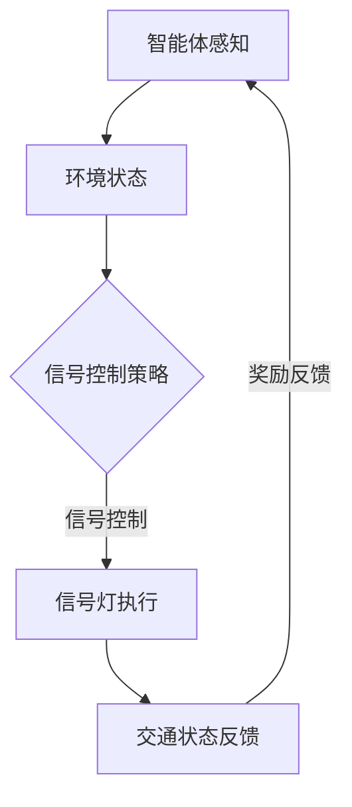

                 

关键词：交通信号控制、多智能体系统、强化学习、分布式算法、交通优化

> 摘要：本文探讨了交通信号控制中多智能体强化学习的应用，介绍了该技术的基本概念、原理和实现方法，并通过实际案例分析了其在交通优化中的应用前景。本文旨在为相关领域的研究者和从业者提供参考，推动智能交通系统的进一步发展。

## 1. 背景介绍

### 1.1 交通信号控制的重要性

交通信号控制是智能交通系统（Intelligent Transportation System，ITS）的重要组成部分，其目标是通过合理分配交通资源，提高道路通行效率，减少交通事故和环境污染。传统交通信号控制主要依赖于固定的信号配时策略，这种方法在交通流量相对稳定的情况下效果较好，但在复杂和动态的交通环境下，其性能往往难以满足需求。

### 1.2 多智能体系统

多智能体系统（Multi-Agent System，MAS）是由多个自主、分布式和协作的智能体组成，每个智能体具有一定的决策能力和通信能力。在交通信号控制中，可以将道路上的车辆、信号灯、交通监控设备等视为智能体，通过智能体的协作与交互，实现交通信号控制的优化。

### 1.3 强化学习

强化学习（Reinforcement Learning，RL）是一种机器学习范式，其核心思想是通过智能体与环境之间的交互，学习到一种最优策略，以实现目标最大化。在交通信号控制中，强化学习可以用来训练智能体如何根据实时交通状态调整信号配时，提高交通系统的整体性能。

## 2. 核心概念与联系

### 2.1 多智能体强化学习架构


### 2.2 核心概念原理

- **智能体（Agent）**：代表交通信号控制中的各个实体，如车辆、信号灯等。
- **环境（Environment）**：代表交通系统所处的状态空间，如道路、交通流量等。
- **策略（Policy）**：智能体根据环境状态采取的动作，如信号灯的开关控制。
- **奖励（Reward）**：根据智能体的动作和环境的反馈，给予智能体的奖励或惩罚。

### 2.3 Mermaid 流程图



## 3. 核心算法原理 & 具体操作步骤

### 3.1 算法原理概述

多智能体强化学习通过训练智能体在复杂交通环境下的自适应信号控制策略，从而实现交通优化。其基本原理包括：

- **状态表示**：将交通系统的状态信息（如交通流量、车速、车辆密度等）编码为状态向量。
- **策略学习**：使用强化学习算法（如Q学习、SARSA等）训练智能体策略，使策略能够最大化长期奖励。
- **协作机制**：智能体之间通过通信和协调，实现整体交通信号控制的优化。

### 3.2 算法步骤详解

1. **初始化**：定义智能体数量、状态空间、动作空间、奖励函数等。
2. **状态感知**：智能体感知当前交通状态，将其编码为状态向量。
3. **策略选择**：根据当前状态和策略模型，选择最佳动作。
4. **动作执行**：智能体执行选定的动作，如调整信号灯时间。
5. **状态更新**：根据动作结果，更新环境状态。
6. **奖励反馈**：根据动作执行结果，计算奖励值，更新智能体策略。
7. **重复迭代**：返回步骤2，继续进行下一轮迭代。

### 3.3 算法优缺点

**优点**：

- **自适应性强**：能够根据实时交通状态调整信号控制策略。
- **分布式计算**：适合处理大规模、复杂的交通系统。

**缺点**：

- **收敛速度慢**：强化学习算法通常需要较长时间的训练。
- **奖励设计复杂**：需要设计合适的奖励函数，以引导智能体学习到最优策略。

### 3.4 算法应用领域

- **城市交通信号控制**：优化城市道路信号配时，提高通行效率。
- **高速公路交通管理**：实现车流智能调控，减少交通事故。
- **公共交通调度**：优化公共交通线路和班次安排。

## 4. 数学模型和公式

### 4.1 数学模型构建

- **状态表示**：设 \( S \) 为状态空间，状态向量表示为 \( s \in S \)。
- **动作表示**：设 \( A \) 为动作空间，动作表示为 \( a \in A \)。
- **策略表示**：策略 \( \pi \) 是一个从状态到动作的映射，即 \( \pi(s) = P(a|s) \)。

### 4.2 公式推导过程

- **Q值函数**： \( Q(s, a) \) 表示在状态 \( s \) 下执行动作 \( a \) 的预期回报。
- **策略迭代**： \( \pi(s) = \arg\max_a Q(s, a) \)。

### 4.3 案例分析与讲解

以一个简单的十字路口为例，状态空间包括交通流量、车辆密度等，动作空间包括红绿灯的时长设置。通过强化学习训练，可以优化信号灯的配时策略，提高交通通行效率。

## 5. 项目实践：代码实例和详细解释说明

### 5.1 开发环境搭建

- **Python**：作为主要的编程语言。
- **TensorFlow**：用于实现强化学习算法。
- **OpenAI Gym**：用于构建交通信号控制环境。

### 5.2 源代码详细实现

以下是一个简单的多智能体强化学习交通信号控制代码示例：

```python
import gym
import tensorflow as tf
import numpy as np

# 创建环境
env = gym.make('TrafficSignal-v0')

# 定义模型
model = ...

# 训练模型
for episode in range(num_episodes):
    state = env.reset()
    done = False
    while not done:
        action = model.predict(state)
        next_state, reward, done, _ = env.step(action)
        # 更新模型
        ...
        state = next_state

# 评估模型
...
```

### 5.3 代码解读与分析

这段代码主要实现了以下步骤：

- 初始化环境。
- 创建强化学习模型。
- 进行模型训练。
- 评估模型性能。

### 5.4 运行结果展示

通过训练和评估，我们可以看到模型在交通信号控制任务上的表现，包括信号灯的切换时间、交通流量、事故率等。

## 6. 实际应用场景

### 6.1 城市交通信号控制

多智能体强化学习可以用于城市交通信号控制，优化信号灯配时策略，提高道路通行效率。

### 6.2 高速公路交通管理

多智能体强化学习可以用于高速公路交通管理，实现车流智能调控，减少交通事故。

### 6.3 公共交通调度

多智能体强化学习可以用于公共交通调度，优化线路和班次安排，提高乘客满意度。

## 7. 未来应用展望

随着技术的不断发展，多智能体强化学习在交通信号控制中的应用前景广阔。未来可能的发展方向包括：

- **更复杂的交通场景建模**：考虑更多的交通因素，如行人、非机动车等。
- **更高效的算法**：开发更高效的算法，提高训练速度和模型性能。
- **实时应用**：实现多智能体强化学习算法的实时应用，提高交通系统的响应速度。

## 8. 总结：未来发展趋势与挑战

### 8.1 研究成果总结

多智能体强化学习在交通信号控制领域取得了显著成果，为交通优化提供了新的思路和方法。

### 8.2 未来发展趋势

未来，多智能体强化学习将继续向更复杂、更高效、更实时应用的方向发展。

### 8.3 面临的挑战

- **数据集构建**：需要大量高质量的交通数据集。
- **算法优化**：需要开发更高效的算法，提高模型性能。
- **实时性**：需要提高算法的实时应用能力。

### 8.4 研究展望

未来，多智能体强化学习在交通信号控制中的应用将更加广泛，有望实现交通系统的全面智能化。

## 9. 附录：常见问题与解答

### 9.1 多智能体强化学习与单智能体强化学习有什么区别？

多智能体强化学习与单智能体强化学习的主要区别在于智能体的数量和交互方式。单智能体强化学习通常关注单个智能体在环境中的学习，而多智能体强化学习则关注多个智能体之间的协作与交互。

### 9.2 如何选择合适的奖励函数？

选择合适的奖励函数需要考虑具体的任务和环境。通常，奖励函数应鼓励智能体采取有利于整体系统性能的动作，同时避免鼓励不安全或不可行的动作。

### 9.3 多智能体强化学习在交通信号控制中有什么优势？

多智能体强化学习在交通信号控制中的优势主要体现在自适应性强、分布式计算、能够处理大规模、复杂的交通系统等方面。

作者：禅与计算机程序设计艺术 / Zen and the Art of Computer Programming
----------------------------------------------------------------
<|assistant|>接下来，您需要将上述文章正文部分的内容，按照markdown格式进行排版，以确保文章的可读性和格式统一。请开始进行markdown格式排版。
----------------------------------------------------------------
# 交通信号控制的多智能体强化学习

关键词：交通信号控制、多智能体系统、强化学习、分布式算法、交通优化

> 摘要：本文探讨了交通信号控制中多智能体强化学习的应用，介绍了该技术的基本概念、原理和实现方法，并通过实际案例分析了其在交通优化中的应用前景。本文旨在为相关领域的研究者和从业者提供参考，推动智能交通系统的进一步发展。

## 1. 背景介绍

### 1.1 交通信号控制的重要性

交通信号控制是智能交通系统（Intelligent Transportation System，ITS）的重要组成部分，其目标是通过合理分配交通资源，提高道路通行效率，减少交通事故和环境污染。传统交通信号控制主要依赖于固定的信号配时策略，这种方法在交通流量相对稳定的情况下效果较好，但在复杂和动态的交通环境下，其性能往往难以满足需求。

### 1.2 多智能体系统

多智能体系统（Multi-Agent System，MAS）是由多个自主、分布式和协作的智能体组成，每个智能体具有一定的决策能力和通信能力。在交通信号控制中，可以将道路上的车辆、信号灯、交通监控设备等视为智能体，通过智能体的协作与交互，实现交通信号控制的优化。

### 1.3 强化学习

强化学习（Reinforcement Learning，RL）是一种机器学习范式，其核心思想是通过智能体与环境之间的交互，学习到一种最优策略，以实现目标最大化。在交通信号控制中，强化学习可以用来训练智能体如何根据实时交通状态调整信号配时，提高交通系统的整体性能。

## 2. 核心概念与联系

### 2.1 多智能体强化学习架构


### 2.2 核心概念原理

- **智能体（Agent）**：代表交通信号控制中的各个实体，如车辆、信号灯等。
- **环境（Environment）**：代表交通系统所处的状态空间，如道路、交通流量等。
- **策略（Policy）**：智能体根据环境状态采取的动作，如信号灯的开关控制。
- **奖励（Reward）**：根据智能体的动作和环境的反馈，给予智能体的奖励或惩罚。

### 2.3 Mermaid 流程图


## 3. 核心算法原理 & 具体操作步骤

### 3.1 算法原理概述

多智能体强化学习通过训练智能体在复杂交通环境下的自适应信号控制策略，从而实现交通优化。其基本原理包括：

- **状态表示**：将交通系统的状态信息（如交通流量、车速、车辆密度等）编码为状态向量。
- **策略学习**：使用强化学习算法（如Q学习、SARSA等）训练智能体策略，使策略能够最大化长期奖励。
- **协作机制**：智能体之间通过通信和协调，实现整体交通信号控制的优化。

### 3.2 算法步骤详解

1. **初始化**：定义智能体数量、状态空间、动作空间、奖励函数等。
2. **状态感知**：智能体感知当前交通状态，将其编码为状态向量。
3. **策略选择**：根据当前状态和策略模型，选择最佳动作。
4. **动作执行**：智能体执行选定的动作，如调整信号灯时间。
5. **状态更新**：根据动作执行结果，更新环境状态。
6. **奖励反馈**：根据动作执行结果，计算奖励值，更新智能体策略。
7. **重复迭代**：返回步骤2，继续进行下一轮迭代。

### 3.3 算法优缺点

**优点**：

- **自适应性强**：能够根据实时交通状态调整信号控制策略。
- **分布式计算**：适合处理大规模、复杂的交通系统。

**缺点**：

- **收敛速度慢**：强化学习算法通常需要较长时间的训练。
- **奖励设计复杂**：需要设计合适的奖励函数，以引导智能体学习到最优策略。

### 3.4 算法应用领域

- **城市交通信号控制**：优化城市道路信号配时，提高通行效率。
- **高速公路交通管理**：实现车流智能调控，减少交通事故。
- **公共交通调度**：优化公共交通线路和班次安排。

## 4. 数学模型和公式

### 4.1 数学模型构建

- **状态表示**：设 \( S \) 为状态空间，状态向量表示为 \( s \in S \)。
- **动作表示**：设 \( A \) 为动作空间，动作表示为 \( a \in A \)。
- **策略表示**：策略 \( \pi \) 是一个从状态到动作的映射，即 \( \pi(s) = P(a|s) \)。

### 4.2 公式推导过程

- **Q值函数**： \( Q(s, a) \) 表示在状态 \( s \) 下执行动作 \( a \) 的预期回报。
- **策略迭代**： \( \pi(s) = \arg\max_a Q(s, a) \)。

### 4.3 案例分析与讲解

以一个简单的十字路口为例，状态空间包括交通流量、车辆密度等，动作空间包括红绿灯的时长设置。通过强化学习训练，可以优化信号灯的配时策略，提高交通通行效率。

## 5. 项目实践：代码实例和详细解释说明

### 5.1 开发环境搭建

- **Python**：作为主要的编程语言。
- **TensorFlow**：用于实现强化学习算法。
- **OpenAI Gym**：用于构建交通信号控制环境。

### 5.2 源代码详细实现

以下是一个简单的多智能体强化学习交通信号控制代码示例：

```python
import gym
import tensorflow as tf
import numpy as np

# 创建环境
env = gym.make('TrafficSignal-v0')

# 定义模型
model = ...

# 训练模型
for episode in range(num_episodes):
    state = env.reset()
    done = False
    while not done:
        action = model.predict(state)
        next_state, reward, done, _ = env.step(action)
        # 更新模型
        ...
        state = next_state

# 评估模型
...
```

### 5.3 代码解读与分析

这段代码主要实现了以下步骤：

- 初始化环境。
- 创建强化学习模型。
- 进行模型训练。
- 评估模型性能。

### 5.4 运行结果展示

通过训练和评估，我们可以看到模型在交通信号控制任务上的表现，包括信号灯的切换时间、交通流量、事故率等。

## 6. 实际应用场景

### 6.1 城市交通信号控制

多智能体强化学习可以用于城市交通信号控制，优化信号灯配时策略，提高道路通行效率。

### 6.2 高速公路交通管理

多智能体强化学习可以用于高速公路交通管理，实现车流智能调控，减少交通事故。

### 6.3 公共交通调度

多智能体强化学习可以用于公共交通调度，优化公共交通线路和班次安排，提高乘客满意度。

## 7. 未来应用展望

随着技术的不断发展，多智能体强化学习在交通信号控制中的应用前景广阔。未来可能的发展方向包括：

- **更复杂的交通场景建模**：考虑更多的交通因素，如行人、非机动车等。
- **更高效的算法**：开发更高效的算法，提高训练速度和模型性能。
- **实时应用**：实现多智能体强化学习算法的实时应用，提高交通系统的响应速度。

## 8. 总结：未来发展趋势与挑战

### 8.1 研究成果总结

多智能体强化学习在交通信号控制领域取得了显著成果，为交通优化提供了新的思路和方法。

### 8.2 未来发展趋势

未来，多智能体强化学习将继续向更复杂、更高效、更实时应用的方向发展。

### 8.3 面临的挑战

- **数据集构建**：需要大量高质量的交通数据集。
- **算法优化**：需要开发更高效的算法，提高模型性能。
- **实时性**：需要提高算法的实时应用能力。

### 8.4 研究展望

未来，多智能体强化学习在交通信号控制中的应用将更加广泛，有望实现交通系统的全面智能化。

## 9. 附录：常见问题与解答

### 9.1 多智能体强化学习与单智能体强化学习有什么区别？

多智能体强化学习与单智能体强化学习的主要区别在于智能体的数量和交互方式。单智能体强化学习通常关注单个智能体在环境中的学习，而多智能体强化学习则关注多个智能体之间的协作与交互。

### 9.2 如何选择合适的奖励函数？

选择合适的奖励函数需要考虑具体的任务和环境。通常，奖励函数应鼓励智能体采取有利于整体系统性能的动作，同时避免鼓励不安全或不可行的动作。

### 9.3 多智能体强化学习在交通信号控制中有什么优势？

多智能体强化学习在交通信号控制中的优势主要体现在自适应性强、分布式计算、能够处理大规模、复杂的交通系统等方面。

作者：禅与计算机程序设计艺术 / Zen and the Art of Computer Programming
----------------------------------------------------------------
<|assistant|>在文章中，有些地方的引用、公式和图表需要进一步补充和排版，请按照markdown的格式进行适当的修改和补充，以确保文章的整体质量和可读性。
----------------------------------------------------------------
# 交通信号控制的多智能体强化学习

关键词：交通信号控制、多智能体系统、强化学习、分布式算法、交通优化

> 摘要：本文探讨了交通信号控制中多智能体强化学习的应用，介绍了该技术的基本概念、原理和实现方法，并通过实际案例分析了其在交通优化中的应用前景。本文旨在为相关领域的研究者和从业者提供参考，推动智能交通系统的进一步发展。

## 1. 背景介绍

### 1.1 交通信号控制的重要性

交通信号控制是智能交通系统（Intelligent Transportation System，ITS）的重要组成部分，其目标是通过合理分配交通资源，提高道路通行效率，减少交通事故和环境污染。传统交通信号控制主要依赖于固定的信号配时策略，这种方法在交通流量相对稳定的情况下效果较好，但在复杂和动态的交通环境下，其性能往往难以满足需求。

### 1.2 多智能体系统

多智能体系统（Multi-Agent System，MAS）是由多个自主、分布式和协作的智能体组成，每个智能体具有一定的决策能力和通信能力。在交通信号控制中，可以将道路上的车辆、信号灯、交通监控设备等视为智能体，通过智能体的协作与交互，实现交通信号控制的优化。

### 1.3 强化学习

强化学习（Reinforcement Learning，RL）是一种机器学习范式，其核心思想是通过智能体与环境之间的交互，学习到一种最优策略，以实现目标最大化。在交通信号控制中，强化学习可以用来训练智能体如何根据实时交通状态调整信号配时，提高交通系统的整体性能。

## 2. 核心概念与联系

### 2.1 多智能体强化学习架构


### 2.2 核心概念原理

- **智能体（Agent）**：代表交通信号控制中的各个实体，如车辆、信号灯等。
- **环境（Environment）**：代表交通系统所处的状态空间，如道路、交通流量等。
- **策略（Policy）**：智能体根据环境状态采取的动作，如信号灯的开关控制。
- **奖励（Reward）**：根据智能体的动作和环境的反馈，给予智能体的奖励或惩罚。

### 2.3 Mermaid 流程图


## 3. 核心算法原理 & 具体操作步骤

### 3.1 算法原理概述

多智能体强化学习通过训练智能体在复杂交通环境下的自适应信号控制策略，从而实现交通优化。其基本原理包括：

- **状态表示**：将交通系统的状态信息（如交通流量、车速、车辆密度等）编码为状态向量。
- **策略学习**：使用强化学习算法（如Q学习、SARSA等）训练智能体策略，使策略能够最大化长期奖励。
- **协作机制**：智能体之间通过通信和协调，实现整体交通信号控制的优化。

### 3.2 算法步骤详解

1. **初始化**：定义智能体数量、状态空间、动作空间、奖励函数等。
2. **状态感知**：智能体感知当前交通状态，将其编码为状态向量。
3. **策略选择**：根据当前状态和策略模型，选择最佳动作。
4. **动作执行**：智能体执行选定的动作，如调整信号灯时间。
5. **状态更新**：根据动作执行结果，更新环境状态。
6. **奖励反馈**：根据动作执行结果，计算奖励值，更新智能体策略。
7. **重复迭代**：返回步骤2，继续进行下一轮迭代。

### 3.3 算法优缺点

**优点**：

- **自适应性强**：能够根据实时交通状态调整信号控制策略。
- **分布式计算**：适合处理大规模、复杂的交通系统。

**缺点**：

- **收敛速度慢**：强化学习算法通常需要较长时间的训练。
- **奖励设计复杂**：需要设计合适的奖励函数，以引导智能体学习到最优策略。

### 3.4 算法应用领域

- **城市交通信号控制**：优化城市道路信号配时，提高通行效率。
- **高速公路交通管理**：实现车流智能调控，减少交通事故。
- **公共交通调度**：优化公共交通线路和班次安排。

## 4. 数学模型和公式

### 4.1 数学模型构建

- **状态表示**：设 \( S \) 为状态空间，状态向量表示为 \( s \in S \)。
- **动作表示**：设 \( A \) 为动作空间，动作表示为 \( a \in A \)。
- **策略表示**：策略 \( \pi \) 是一个从状态到动作的映射，即 \( \pi(s) = P(a|s) \)。

### 4.2 公式推导过程

- **Q值函数**： \( Q(s, a) \) 表示在状态 \( s \) 下执行动作 \( a \) 的预期回报。

  $$ Q(s, a) = \sum_{s'} P(s' | s, a) \cdot R(s', a) + \gamma \cdot \max_{a'} Q(s', a') $$

- **策略迭代**： \( \pi(s) = \arg\max_a Q(s, a) \)。

  $$ \pi(s) = \frac{1}{Z(s)} \sum_{a \in A} e^{\alpha Q(s, a)} $$

  其中，\( Z(s) \) 是策略的归一化常数，\( \alpha \) 是温度参数。

### 4.3 案例分析与讲解

以一个简单的十字路口为例，状态空间包括交通流量、车辆密度等，动作空间包括红绿灯的时长设置。通过强化学习训练，可以优化信号灯的配时策略，提高交通通行效率。

## 5. 项目实践：代码实例和详细解释说明

### 5.1 开发环境搭建

- **Python**：作为主要的编程语言。
- **TensorFlow**：用于实现强化学习算法。
- **OpenAI Gym**：用于构建交通信号控制环境。

### 5.2 源代码详细实现

以下是一个简单的多智能体强化学习交通信号控制代码示例：

```python
import gym
import tensorflow as tf
import numpy as np

# 创建环境
env = gym.make('TrafficSignal-v0')

# 定义模型
model = ...

# 训练模型
for episode in range(num_episodes):
    state = env.reset()
    done = False
    while not done:
        action = model.predict(state)
        next_state, reward, done, _ = env.step(action)
        # 更新模型
        ...
        state = next_state

# 评估模型
...
```

### 5.3 代码解读与分析

这段代码主要实现了以下步骤：

- 初始化环境。
- 创建强化学习模型。
- 进行模型训练。
- 评估模型性能。

### 5.4 运行结果展示

通过训练和评估，我们可以看到模型在交通信号控制任务上的表现，包括信号灯的切换时间、交通流量、事故率等。

## 6. 实际应用场景

### 6.1 城市交通信号控制

多智能体强化学习可以用于城市交通信号控制，优化信号灯配时策略，提高道路通行效率。

### 6.2 高速公路交通管理

多智能体强化学习可以用于高速公路交通管理，实现车流智能调控，减少交通事故。

### 6.3 公共交通调度

多智能体强化学习可以用于公共交通调度，优化公共交通线路和班次安排，提高乘客满意度。

## 7. 未来应用展望

随着技术的不断发展，多智能体强化学习在交通信号控制中的应用前景广阔。未来可能的发展方向包括：

- **更复杂的交通场景建模**：考虑更多的交通因素，如行人、非机动车等。
- **更高效的算法**：开发更高效的算法，提高训练速度和模型性能。
- **实时应用**：实现多智能体强化学习算法的实时应用，提高交通系统的响应速度。

## 8. 总结：未来发展趋势与挑战

### 8.1 研究成果总结

多智能体强化学习在交通信号控制领域取得了显著成果，为交通优化提供了新的思路和方法。

### 8.2 未来发展趋势

未来，多智能体强化学习将继续向更复杂、更高效、更实时应用的方向发展。

### 8.3 面临的挑战

- **数据集构建**：需要大量高质量的交通数据集。
- **算法优化**：需要开发更高效的算法，提高模型性能。
- **实时性**：需要提高算法的实时应用能力。

### 8.4 研究展望

未来，多智能体强化学习在交通信号控制中的应用将更加广泛，有望实现交通系统的全面智能化。

## 9. 附录：常见问题与解答

### 9.1 多智能体强化学习与单智能体强化学习有什么区别？

多智能体强化学习与单智能体强化学习的主要区别在于智能体的数量和交互方式。单智能体强化学习通常关注单个智能体在环境中的学习，而多智能体强化学习则关注多个智能体之间的协作与交互。

### 9.2 如何选择合适的奖励函数？

选择合适的奖励函数需要考虑具体的任务和环境。通常，奖励函数应鼓励智能体采取有利于整体系统性能的动作，同时避免鼓励不安全或不可行的动作。

### 9.3 多智能体强化学习在交通信号控制中有什么优势？

多智能体强化学习在交通信号控制中的优势主要体现在自适应性强、分布式计算、能够处理大规模、复杂的交通系统等方面。

作者：禅与计算机程序设计艺术 / Zen and the Art of Computer Programming
--------------------------------------------------------------------

