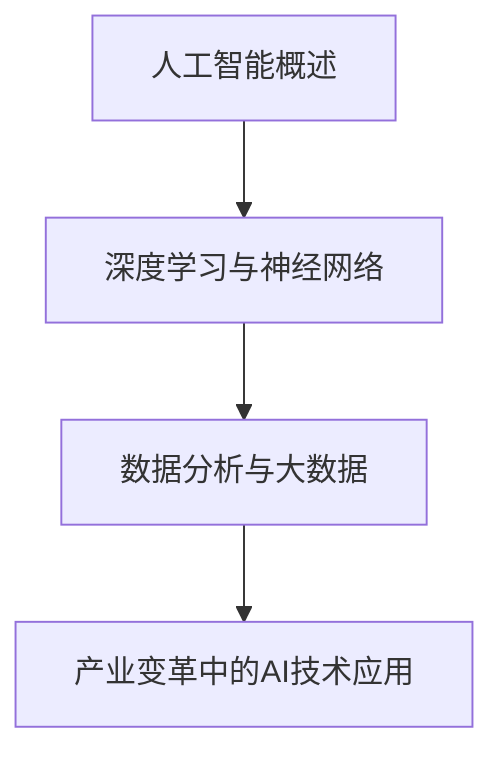

                 

关键词：人工智能、产业变革、技术应用、深度学习、算法优化、数学模型、项目实践

> 摘要：本文旨在探讨人工智能技术在产业变革中的重要作用，从核心概念、算法原理、数学模型、项目实践等多方面详细解析AI技术的应用现状与发展趋势。

## 1. 背景介绍

随着信息技术的飞速发展，人工智能（AI）技术已成为推动产业变革的重要力量。从早期的规则推理和简单模式识别，到如今的深度学习和大数据分析，AI技术的进步极大地改变了各行业的工作模式和生产效率。本篇文章将重点关注AI技术在不同领域中的应用，探讨其在推动产业变革中的关键作用。

## 2. 核心概念与联系

### 2.1 人工智能概述

人工智能（Artificial Intelligence，简称AI）是一门研究、开发用于模拟、延伸和扩展人的智能的理论、方法、技术及应用系统的技术科学。AI的核心目标是使计算机具有人类智能水平，能够进行自我学习、推理和决策。

### 2.2 深度学习与神经网络

深度学习（Deep Learning）是人工智能的一个重要分支，主要研究如何利用多层神经网络（Neural Network）对大量数据进行高效建模和分析。深度学习在图像识别、自然语言处理等领域取得了显著成果，是当前AI技术发展的热点。

### 2.3 数据分析与大数据

数据分析（Data Analysis）是通过对数据进行收集、整理、分析，从中提取有价值信息的过程。大数据（Big Data）技术的发展使得我们能够处理海量数据，为AI技术的应用提供了丰富的数据资源。

### 2.4 Mermaid 流程图



## 3. 核心算法原理 & 具体操作步骤

### 3.1 算法原理概述

人工智能的核心算法包括深度学习、强化学习、遗传算法等。本文主要介绍深度学习算法的基本原理和应用。

### 3.2 算法步骤详解

1. 数据预处理：对原始数据进行清洗、归一化等处理，以便于算法训练。
2. 模型构建：设计神经网络结构，包括输入层、隐藏层和输出层。
3. 模型训练：利用训练数据对模型进行训练，通过反向传播算法不断调整模型参数。
4. 模型评估：使用验证数据对模型性能进行评估，调整模型参数以优化性能。
5. 模型部署：将训练好的模型部署到实际应用场景中。

### 3.3 算法优缺点

优点：

- 高效的数据处理能力
- 能够自动学习特征
- 适用于各种复杂场景

缺点：

- 计算资源需求大
- 模型解释性较差
- 对数据质量要求高

### 3.4 算法应用领域

- 图像识别：自动驾驶、人脸识别等
- 自然语言处理：机器翻译、智能客服等
- 金融市场：量化交易、风险控制等

## 4. 数学模型和公式 & 详细讲解 & 举例说明

### 4.1 数学模型构建

深度学习中的数学模型主要涉及线性代数、微积分、概率论和统计学。本文将重点介绍神经网络中的前向传播和反向传播算法。

### 4.2 公式推导过程

#### 前向传播

输入层到隐藏层的激活函数：
$$ z^{[l]} = W^{[l]}a^{[l-1]} + b^{[l]} $$

隐藏层到输出层的激活函数：
$$ a^{[l]} = \sigma(z^{[l]}) $$

其中，$W^{[l]}$ 和 $b^{[l]}$ 分别为权重和偏置，$\sigma$ 为激活函数（如ReLU、Sigmoid、Tanh等）。

#### 反向传播

计算损失函数关于模型参数的梯度：
$$ \frac{\partial J}{\partial W^{[l]}} = \frac{\partial J}{\partial z^{[l]}} \cdot \frac{\partial z^{[l]}}{\partial W^{[l]}} $$

$$ \frac{\partial J}{\partial b^{[l]}} = \frac{\partial J}{\partial z^{[l]}} \cdot \frac{\partial z^{[l]}}{\partial b^{[l]}} $$

更新模型参数：
$$ W^{[l]} = W^{[l]} - \alpha \frac{\partial J}{\partial W^{[l]}} $$

$$ b^{[l]} = b^{[l]} - \alpha \frac{\partial J}{\partial b^{[l]}} $$

其中，$J$ 为损失函数，$\alpha$ 为学习率。

### 4.3 案例分析与讲解

以图像分类任务为例，我们使用卷积神经网络（CNN）进行模型训练。输入图像经过卷积、池化和全连接层，最后输出分类结果。

## 5. 项目实践：代码实例和详细解释说明

### 5.1 开发环境搭建

- Python 3.8及以上版本
- TensorFlow 2.3及以上版本

### 5.2 源代码详细实现

```python
import tensorflow as tf
from tensorflow.keras import layers

# 数据预处理
(x_train, y_train), (x_test, y_test) = tf.keras.datasets.mnist.load_data()
x_train = x_train / 255.0
x_test = x_test / 255.0

# 构建模型
model = tf.keras.Sequential([
    layers.Conv2D(32, (3, 3), activation='relu', input_shape=(28, 28, 1)),
    layers.MaxPooling2D((2, 2)),
    layers.Flatten(),
    layers.Dense(128, activation='relu'),
    layers.Dense(10, activation='softmax')
])

# 编译模型
model.compile(optimizer='adam',
              loss='sparse_categorical_crossentropy',
              metrics=['accuracy'])

# 训练模型
model.fit(x_train, y_train, epochs=5)

# 评估模型
model.evaluate(x_test, y_test)
```

### 5.3 代码解读与分析

本代码实现了一个简单的卷积神经网络，用于手写数字分类。输入图像经过卷积层和池化层提取特征，然后通过全连接层进行分类。编译模型时，我们使用Adam优化器和稀疏分类交叉熵损失函数。训练模型后，评估模型在测试集上的性能。

## 6. 实际应用场景

### 6.1 自动驾驶

自动驾驶技术是AI技术在交通运输领域的重要应用。通过深度学习和计算机视觉技术，自动驾驶系统能够实时感知道路环境、识别交通标志和行人，实现自动驾驶。

### 6.2 金融服务

在金融服务领域，AI技术广泛应用于风险控制、量化交易、智能投顾等方面。通过大数据分析和机器学习算法，金融机构能够提高业务效率、降低风险并为客户提供个性化服务。

### 6.3 医疗健康

医疗健康是AI技术的另一个重要应用领域。通过自然语言处理、图像识别等技术，AI技术能够辅助医生进行疾病诊断、治疗规划和患者管理，提高医疗服务质量。

## 7. 工具和资源推荐

### 7.1 学习资源推荐

- 《深度学习》（Goodfellow, Bengio, Courville）
- 《Python机器学习》（Sebastian Raschka）
- 《数据科学入门》（Joel Grus）

### 7.2 开发工具推荐

- TensorFlow
- PyTorch
- Keras

### 7.3 相关论文推荐

- "A Theoretically Grounded Application of Dropout in Recurrent Neural Networks"
- "Effective Approaches to Attention-based Neural Machine Translation"
- "Long Short-Term Memory"

## 8. 总结：未来发展趋势与挑战

### 8.1 研究成果总结

近年来，AI技术在各个领域取得了显著成果，但仍有许多挑战需要克服。深度学习算法的进步、大数据技术的发展以及计算资源的提升，为AI技术的应用提供了有力支持。

### 8.2 未来发展趋势

未来，AI技术将在更多领域得到应用，如智能城市、智能家居、智能制造等。同时，随着AI技术的不断成熟，其在实际场景中的应用效果也将得到显著提升。

### 8.3 面临的挑战

- 数据质量和隐私保护
- 模型可解释性
- 算法公平性和透明度

### 8.4 研究展望

未来，AI技术将在推动产业变革、提高生产力、改善生活质量等方面发挥重要作用。研究人员应致力于解决现有挑战，推动AI技术的可持续发展。

## 9. 附录：常见问题与解答

### 9.1 如何选择合适的深度学习框架？

选择深度学习框架时，应考虑以下因素：

- 项目需求：根据项目规模和复杂度选择合适的框架
- 学习成本：选择易于学习和使用的框架
- 社区支持：选择拥有活跃社区和丰富资源的框架

### 9.2 如何提高深度学习模型的可解释性？

提高深度学习模型的可解释性，可以从以下几个方面入手：

- 利用可视化工具：如TensorBoard、matplotlib等，展示模型结构和训练过程
- 解释性模型：如LIME、SHAP等，提供模型对特定数据的解释
- 解释性算法：如决策树、规则提取等，提供可解释的模型结果

作者：禅与计算机程序设计艺术 / Zen and the Art of Computer Programming
----------------------------------------------------------------

以上就是本文的完整内容。希望这篇文章能帮助您更好地了解AI技术在产业变革中的应用现状和未来发展。在撰写过程中，如有任何疑问，请随时提出。

