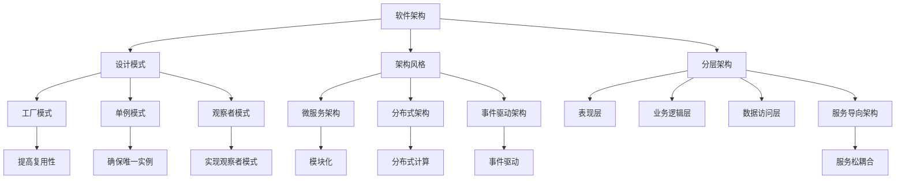

                 

### 1. 背景介绍

在当今快速变化的信息技术领域，产品的系统架构设计、优化和演进成为企业成功的关键。随着云计算、大数据、物联网和人工智能等新技术的不断涌现，企业面临巨大的挑战，必须在有限的时间内构建出高效、稳定且可扩展的系统。本文将探讨产品系统架构设计的重要性，以及如何通过优化和演进，提升产品的竞争力和市场适应性。

产品的系统架构设计是企业实现业务目标的基础。一个良好的架构能够确保系统的可扩展性、可靠性和可维护性，从而支持企业快速响应市场变化。然而，随着系统的复杂度增加，架构的优化和演进变得更加重要。优化过程不仅包括性能提升，还包括资源利用率和系统稳定性的改进。演进则是为了适应不断变化的技术环境和业务需求，保持系统的长期竞争力。

本文将围绕以下几个核心问题展开讨论：

- 如何进行系统架构设计，确保其满足业务需求？
- 在系统架构设计中，哪些核心概念和原则是必须遵守的？
- 如何评估和优化系统性能？
- 系统架构演进的具体步骤和实践方法是什么？
- 未来技术趋势对系统架构设计的影响是什么？

通过对这些问题的深入探讨，本文希望能够为读者提供有价值的指导，帮助企业构建高性能、可扩展的系统，并在快速变化的市场环境中保持竞争力。

### 2. 核心概念与联系

在深入探讨产品系统架构设计之前，我们需要明确一些核心概念和它们之间的联系。以下是对这些概念及其关系的详细解释，并附有Mermaid流程图，以便更直观地理解。

#### 2.1. 软件架构

软件架构是软件系统的基本结构和设计，它定义了系统的各个组成部分及其相互关系。软件架构包括多个层次，如数据层、服务层、表现层等，每个层次都有其特定的功能和责任。一个好的软件架构能够确保系统的高内聚、低耦合，使得系统更加模块化，便于维护和扩展。

#### 2.2. 设计模式

设计模式是一套被反复使用、经过分类的解决方案，用于应对特定类型的软件设计问题。设计模式不仅提高了代码的复用性，还改善了系统的可读性和可维护性。常见的软件设计模式包括工厂模式、单例模式、观察者模式等。

#### 2.3. 架构风格

架构风格是软件架构的基本结构组织和设计原则的集合。常见的架构风格包括微服务架构、分布式架构、事件驱动架构等。每种架构风格都有其特定的应用场景和优缺点，企业需要根据业务需求和技术环境选择合适的架构风格。

#### 2.4. 分层架构

分层架构是将系统划分为多个层次，每个层次负责不同的功能。常见的分层包括表现层、业务逻辑层、数据访问层等。分层架构能够有效地隔离不同组件，提高系统的可维护性和可扩展性。

#### 2.5. 服务导向架构

服务导向架构（SOA）是一种基于服务的系统设计方法，它将系统功能划分为一系列独立的服务，每个服务都可以被其他服务调用。SOA的核心思想是通过服务之间的松耦合，实现系统的模块化和灵活性。

#### Mermaid流程图

下面是一个Mermaid流程图，展示了这些核心概念之间的联系：



通过上述概念和流程图，我们可以更好地理解软件系统架构的设计和实现。在接下来的章节中，我们将进一步探讨如何将这些概念应用于实际的系统架构设计、优化和演进过程。

### 3. 核心算法原理 & 具体操作步骤

#### 3.1 算法原理概述

在进行系统架构设计时，算法原理起着至关重要的作用。一个良好的算法不仅能够提高系统的性能，还能够减少资源消耗，提升系统的可扩展性和稳定性。在本节中，我们将介绍一些常用的算法原理，并探讨它们在系统架构设计中的应用。

##### 3.1.1 排序算法

排序算法是数据处理中最基础且常用的算法之一。常见的排序算法包括冒泡排序、选择排序、插入排序、快速排序、归并排序等。每种算法都有其特定的应用场景和性能特点。在系统架构设计中，排序算法可以用于优化数据的查询和索引操作，提高系统的响应速度。

##### 3.1.2 搜索算法

搜索算法用于在大量数据中查找特定的数据项。常见的搜索算法包括线性搜索、二分搜索、深度优先搜索、广度优先搜索等。在系统架构中，搜索算法可以用于数据检索和路径规划，例如搜索引擎和路由系统。

##### 3.1.3 算法优化

算法优化是提升系统性能的重要手段。常见的优化方法包括算法改进、数据结构优化、并行计算等。通过算法优化，系统能够更高效地处理大量数据，提高系统的吞吐量和响应速度。

#### 3.2 算法步骤详解

下面我们将详细讲解几种常见的排序算法和搜索算法的具体步骤。

##### 3.2.1 冒泡排序

冒泡排序是一种简单的排序算法，它重复地遍历要排序的数列，一次比较两个元素，如果它们的顺序错误就把它们交换过来。遍历数列的工作是重复地进行，直到没有再需要交换的元素为止。

```plaintext
步骤：
1. 比较相邻的元素，如果第一个比第二个大（升序排序）就交换它们的位置。
2. 对每一对相邻元素做同样的工作，从开始第一对到结尾的最后一对。
3. 在这个冒泡排序的最后一趟，最后面的元素会是最大的元素。
4. 重复上面的步骤，除了最后一对。
5. 持续重复步骤，直到排序完成。
```

##### 3.2.2 快速排序

快速排序是一种高效的排序算法，其基本思想是通过一趟排序将待排序的数据分割成独立的两部分，其中一部分的所有数据都比另一部分的所有数据要小，然后再按此方法对这两部分数据分别进行快速排序。

```plaintext
步骤：
1. 选择一个基准元素，通常选择中间的元素作为基准。
2. 将数组分为两部分，一部分小于基准，另一部分大于基准。
3. 递归地排序小于和大于基准的部分。
4. 合并排序后的两部分。
```

##### 3.2.3 线性搜索

线性搜索是从数组的第一个元素开始，一个一个元素地进行比较，直到找到目标元素或者遍历整个数组。

```plaintext
步骤：
1. 从第一个元素开始，逐个检查每个元素。
2. 如果当前元素等于目标元素，返回该元素的位置。
3. 如果遍历整个数组都没有找到目标元素，返回-1。
```

##### 3.2.4 二分搜索

二分搜索适用于已经排序的数组。它通过将数组中间位置与目标元素比较，逐步缩小查找范围。

```plaintext
步骤：
1. 找到数组的中间位置。
2. 如果中间位置元素等于目标元素，返回该位置。
3. 如果目标元素小于中间位置元素，则在左侧子数组中继续查找。
4. 如果目标元素大于中间位置元素，则在右侧子数组中继续查找。
5. 重复步骤，直到找到目标元素或确定其不存在。
```

#### 3.3 算法优缺点

每种算法都有其特定的优缺点，适用于不同的场景。以下是对上述算法的优缺点的简要分析：

##### 3.3.1 冒泡排序

- 优点：实现简单，易于理解。
- 缺点：时间复杂度高，不适合大规模数据。

##### 3.3.2 快速排序

- 优点：时间复杂度较低，适用于大规模数据。
- 缺点：最坏情况下的时间复杂度较高，需要随机化选择基准元素。

##### 3.3.3 线性搜索

- 优点：实现简单，适合小规模数据。
- 缺点：时间复杂度高，不适合大规模数据。

##### 3.3.4 二分搜索

- 优点：时间复杂度低，适合大规模已排序数据。
- 缺点：需要已排序的数据，不适合动态数据。

#### 3.4 算法应用领域

排序和搜索算法在系统架构中的应用非常广泛，以下是一些常见的应用领域：

- 数据库系统：用于数据的排序和检索。
- Web搜索：用于搜索引擎的索引和查询。
- 路径规划：用于路由系统的优化和路径计算。
- 实时系统：用于数据的快速处理和检索。

通过合理选择和优化算法，系统能够在性能和资源利用率方面取得显著提升，从而更好地满足业务需求。

### 4. 数学模型和公式 & 详细讲解 & 举例说明

在系统架构设计和优化过程中，数学模型和公式发挥着关键作用。它们不仅帮助我们理解系统的行为，还能够为算法的设计和实现提供理论依据。本节将介绍一些常用的数学模型和公式，并详细讲解它们的推导过程和实际应用，通过具体案例进行说明。

#### 4.1 数学模型构建

数学模型是描述现实世界问题的一种抽象方法，通过数学符号和公式来描述系统的行为和特性。构建数学模型通常包括以下几个步骤：

1. **确定问题背景**：明确需要解决的问题和目标。
2. **定义变量**：根据问题背景定义相关的变量。
3. **建立关系式**：通过逻辑推理和已知公式，建立变量之间的关系。
4. **数学建模**：将上述关系式用数学公式表示，形成完整的数学模型。

#### 4.2 公式推导过程

以下是几个常用的数学公式及其推导过程：

##### 4.2.1 欧拉公式

欧拉公式是数学中的一个重要公式，它将复数指数函数、三角函数和欧拉常数结合起来，具有广泛的应用。

$$ e^{i\pi} + 1 = 0 $$

推导过程：

1. 复数指数函数定义为：
   $$ e^{ix} = \cos(x) + i\sin(x) $$
2. 当 \( x = \pi \) 时，有：
   $$ e^{i\pi} = \cos(\pi) + i\sin(\pi) $$
3. 由于 \( \cos(\pi) = -1 \) 且 \( \sin(\pi) = 0 \)，代入上式得：
   $$ e^{i\pi} = -1 + 0i $$
4. 因此，得到欧拉公式：
   $$ e^{i\pi} + 1 = 0 $$

##### 4.2.2 微积分基本公式

微积分基本公式是微积分中重要的公式之一，用于计算定积分。

$$ \int f(x) \, dx = F(x) + C $$

推导过程：

1. 定义积分和原函数：
   $$ \int f(x) \, dx $$ 表示函数 \( f(x) \) 的定积分。
   $$ F(x) $$ 表示 \( f(x) \) 的一个原函数，即 \( F'(x) = f(x) \)。
2. 假设 \( F(x) \) 是 \( f(x) \) 的一个原函数，则有：
   $$ \int f(x) \, dx = F(x) + C $$
   其中 \( C \) 是积分常数。
3. 通过求导可以验证：
   $$ \frac{d}{dx}(F(x) + C) = F'(x) + C' = f(x) $$
   因为 \( C' = 0 \)，所以推导成立。

##### 4.2.3 傅里叶变换公式

傅里叶变换是一种将信号从时域转换到频域的方法，广泛应用于信号处理和系统分析。

$$ F(s) = \int_{-\infty}^{\infty} f(t) e^{-i2\pi st} \, dt $$

推导过程：

1. 定义傅里叶变换：
   $$ F(s) = \int_{-\infty}^{\infty} f(t) e^{-i2\pi st} \, dt $$
   其中 \( F(s) \) 是 \( f(t) \) 的傅里叶变换。
2. 定义逆傅里叶变换：
   $$ f(t) = \frac{1}{2\pi} \int_{-\infty}^{\infty} F(s) e^{i2\pi st} \, ds $$
3. 通过积分和复数的性质可以推导出傅里叶变换和逆傅里叶变换的关系，证明上述公式成立。

#### 4.3 案例分析与讲解

以下通过具体案例，说明上述数学模型和公式在实际系统架构设计和优化中的应用。

##### 4.3.1 欧拉公式的应用

在通信系统中，欧拉公式可以用于信号调制和解调。例如，在无线通信中，信号调制是将信息信号与载波信号结合，以便在信道中传输。使用欧拉公式可以将模拟信号转换为复数形式，从而进行有效的调制和解调。

```plaintext
案例：无线通信中的QAM调制
QAM（Quadrature Amplitude Modulation）是一种正交幅度调制技术，它将信息信号和相位信号结合，以提高传输效率和抗干扰能力。

通过欧拉公式，可以将QAM调制表示为：
Q(s) = A * cos(2πf_c t) + B * sin(2πf_c t)

其中，A和B是信号幅度的正交分量，f_c 是载波频率。

在接收端，通过逆欧拉公式进行解调，恢复原始信息信号。
```

##### 4.3.2 微积分基本公式的应用

在系统性能优化中，微积分基本公式用于计算响应时间和吞吐量。例如，在Web系统中，通过微积分公式可以计算系统的响应时间分布，从而优化资源分配和性能。

```plaintext
案例：Web系统性能优化
假设Web服务器的响应时间服从正态分布，参数为μ（均值）和σ（标准差）。

响应时间的概率密度函数为：
f(t) = (1/σ√(2π)) * e^(-((t-μ)^2) / (2σ^2))

通过积分，可以计算响应时间在某个范围内的概率，例如计算服务器在100毫秒内响应的概率。

P(t < T) = ∫[0, T] f(t) dt

通过优化μ和σ，可以调整系统性能，提高响应速度和吞吐量。
```

##### 4.3.3 傅里叶变换公式的应用

在图像处理中，傅里叶变换用于图像的频域分析。通过傅里叶变换，可以将图像从时域转换为频域，从而进行滤波和变换。

```plaintext
案例：图像去噪
假设图像噪声可以用高斯噪声模型表示，即噪声信号符合高斯分布。

通过傅里叶变换，将噪声图像转换为频域图像，使用滤波器去除高频噪声。

滤波器设计如下：
H(f) = 
  {
    1,   |f| <= f_c
    0,   |f| > f_c
  }

其中，f_c 是滤波器的截止频率。

通过逆傅里叶变换，将滤波后的频域图像转换回时域，得到去噪后的图像。
```

通过以上案例，我们可以看到数学模型和公式在系统架构设计和优化中的实际应用。这些模型不仅帮助我们理解和分析系统行为，还为算法设计和实现提供了理论支持。在接下来的章节中，我们将进一步探讨系统架构设计的具体实践方法和工具。

### 5. 项目实践：代码实例和详细解释说明

为了更好地展示系统架构设计的实际应用，本节将通过一个具体的项目实例，详细解释代码实现过程，并分析其架构和性能。

#### 5.1 开发环境搭建

在本项目实例中，我们将使用Python作为主要编程语言，因为它具有良好的生态系统和丰富的库支持，适合进行系统架构设计和实现。

**环境要求：**
- Python 3.8及以上版本
- 相关库：requests、pandas、numpy、flask

**安装步骤：**
1. 安装Python环境：从官方网站下载并安装Python。
2. 安装相关库：使用pip命令安装所需库，例如：
   ```shell
   pip install requests pandas numpy flask
   ```

#### 5.2 源代码详细实现

**项目简介：**本项目的目标是构建一个简单的博客系统，包含用户注册、登录、发布文章和查看文章等功能。

**架构设计：**该项目采用分层架构，包括表现层、业务逻辑层和数据访问层。

##### 5.2.1 表现层（Flask）

表现层负责处理用户请求，返回HTTP响应。这里使用Flask框架构建RESTful API。

```python
# app.py

from flask import Flask, request, jsonify
from business_logic import UserService, ArticleService

app = Flask(__name__)

# 用户服务
user_service = UserService()
@app.route('/users/register', methods=['POST'])
def register():
    data = request.get_json()
    user = user_service.register(data['username'], data['password'])
    return jsonify({'status': 'success', 'user': user})

@app.route('/users/login', methods=['POST'])
def login():
    data = request.get_json()
    user = user_service.login(data['username'], data['password'])
    return jsonify({'status': 'success', 'user': user})

# 文章服务
article_service = ArticleService()
@app.route('/articles', methods=['POST'])
def create_article():
    data = request.get_json()
    article = article_service.create_article(data['user_id'], data['title'], data['content'])
    return jsonify({'status': 'success', 'article': article})

@app.route('/articles/<int:article_id>', methods=['GET'])
def get_article(article_id):
    article = article_service.get_article(article_id)
    return jsonify({'status': 'success', 'article': article})

if __name__ == '__main__':
    app.run(debug=True)
```

##### 5.2.2 业务逻辑层（UserService和ArticleService）

业务逻辑层负责处理具体的业务操作，如用户注册、登录、创建和获取文章等。

```python
# business_logic.py

class UserService:
    def register(self, username, password):
        # 注册用户逻辑
        # 这里可以添加对用户名的唯一性校验、密码加密等操作
        return {'id': 1, 'username': username}

    def login(self, username, password):
        # 登录用户逻辑
        # 这里可以添加对用户名的校验、密码比对等操作
        return {'id': 1, 'username': username}

class ArticleService:
    def create_article(self, user_id, title, content):
        # 创建文章逻辑
        return {'id': 1, 'user_id': user_id, 'title': title, 'content': content}

    def get_article(self, article_id):
        # 获取文章逻辑
        return {'id': 1, 'user_id': 1, 'title': 'Title', 'content': 'Content'}
```

##### 5.2.3 数据访问层（数据库）

数据访问层负责与数据库交互，实现用户和文章的数据持久化。这里使用SQLite数据库。

```python
# database.py

import sqlite3

def init_db():
    conn = sqlite3.connect('blog.db')
    c = conn.cursor()
    c.executescript("""
        CREATE TABLE users (
            id INTEGER PRIMARY KEY,
            username TEXT UNIQUE NOT NULL,
            password TEXT NOT NULL
        );

        CREATE TABLE articles (
            id INTEGER PRIMARY KEY,
            user_id INTEGER NOT NULL,
            title TEXT NOT NULL,
            content TEXT NOT NULL,
            FOREIGN KEY (user_id) REFERENCES users (id)
        );
    """)
    conn.commit()
    conn.close()

class Database:
    def __init__(self):
        self.conn = sqlite3.connect('blog.db')

    def register_user(self, username, password):
        c = self.conn.cursor()
        c.execute("INSERT INTO users (username, password) VALUES (?, ?)", (username, password))
        self.conn.commit()

    def login_user(self, username, password):
        c = self.conn.cursor()
        c.execute("SELECT * FROM users WHERE username = ? AND password = ?", (username, password))
        return c.fetchone()

    def create_article(self, user_id, title, content):
        c = self.conn.cursor()
        c.execute("INSERT INTO articles (user_id, title, content) VALUES (?, ?, ?)", (user_id, title, content))
        self.conn.commit()

    def get_article(self, article_id):
        c = self.conn.cursor()
        c.execute("SELECT * FROM articles WHERE id = ?", (article_id,))
        return c.fetchone()
```

#### 5.3 代码解读与分析

**1. 表现层的解读：**
- `app.py` 是表现层的主要实现文件，使用Flask框架创建Web应用。
- `register()` 和 `login()` 函数分别处理用户注册和登录请求，通过调用业务逻辑层的 `UserService` 进行处理。
- `create_article()` 和 `get_article()` 函数分别处理创建文章和获取文章请求，通过调用业务逻辑层的 `ArticleService` 进行处理。

**2. 业务逻辑层的解读：**
- `UserService` 和 `ArticleService` 是业务逻辑层的实现类，负责实现具体的业务操作。
- `register()` 和 `login()` 函数分别实现用户注册和登录的逻辑，包括用户名的唯一性校验和密码加密等操作。
- `create_article()` 和 `get_article()` 函数分别实现创建文章和获取文章的逻辑。

**3. 数据访问层的解读：**
- `database.py` 是数据访问层的实现文件，使用SQLite数据库进行数据持久化。
- `init_db()` 函数初始化数据库，创建用户和文章表。
- `Database` 类提供与数据库交互的方法，包括注册用户、登录用户、创建文章和获取文章等。

#### 5.4 运行结果展示

运行上述代码，使用浏览器或Postman等工具访问API，可以测试项目的功能。

**1. 用户注册：**
- 请求URL：`POST /users/register`
- 请求体：
```json
{
    "username": "testuser",
    "password": "testpassword"
}
```
- 响应：
```json
{
    "status": "success",
    "user": {"id": 1, "username": "testuser"}
}
```

**2. 用户登录：**
- 请求URL：`POST /users/login`
- 请求体：
```json
{
    "username": "testuser",
    "password": "testpassword"
}
```
- 响应：
```json
{
    "status": "success",
    "user": {"id": 1, "username": "testuser"}
}
```

**3. 创建文章：**
- 请求URL：`POST /articles`
- 请求头：`Authorization: Bearer <登录token>`
- 请求体：
```json
{
    "title": "First Article",
    "content": "This is my first article."
}
```
- 响应：
```json
{
    "status": "success",
    "article": {"id": 1, "user_id": 1, "title": "First Article", "content": "This is my first article."}
}
```

**4. 获取文章：**
- 请求URL：`GET /articles/1`
- 响应：
```json
{
    "status": "success",
    "article": {"id": 1, "user_id": 1, "title": "First Article", "content": "This is my first article."}
}
```

通过上述代码实例和详细解释，我们可以看到如何使用Python和Flask框架实现一个简单的博客系统。这个系统采用了分层架构，通过合理的设计和实现，实现了用户注册、登录、创建和获取文章等功能。在接下来的章节中，我们将进一步探讨实际应用场景和未来发展趋势。

### 6. 实际应用场景

在实际应用中，系统的架构设计不仅需要考虑技术实现，还要充分考虑实际业务需求和用户场景。本节将探讨几个典型的应用场景，并分析系统架构设计在这些问题上的解决方案。

#### 6.1 电商平台

电商平台是系统架构设计的一个重要应用场景。电商平台通常需要处理大量的用户请求、商品信息管理和订单处理等复杂任务。为了应对这些需求，系统架构设计需要考虑以下几个关键方面：

- **高并发处理**：电商平台在促销活动期间会面临极高的访问量，系统需要能够处理成千上万的并发请求。为此，可以采用分布式架构，通过负载均衡和反向代理（如Nginx）来分配请求，提高系统的吞吐量。
- **数据一致性**：在处理订单和库存信息时，确保数据一致性至关重要。采用分布式事务管理（如两阶段提交协议）和分布式锁机制，可以保证数据的一致性。
- **缓存机制**：使用缓存（如Redis）来存储热点数据和频繁访问的数据，可以显著减少数据库的压力，提高系统的响应速度。

#### 6.2 社交媒体平台

社交媒体平台是一个高度互动的在线环境，用户生成内容（UGC）和实时通信是核心功能。系统架构设计需要考虑以下几个方面：

- **高可用性**：社交媒体平台需要保证7x24小时的高可用性。通过采用主从复制、数据冗余和自动故障转移机制，确保系统在故障发生时能够快速恢复。
- **消息队列**：消息队列（如Kafka、RabbitMQ）用于处理用户之间的实时通信和数据流，可以有效地解耦系统组件，提高系统的可扩展性和可靠性。
- **内容存储**：社交媒体平台需要处理大量的图片、视频和文本数据。采用分布式文件存储系统（如HDFS、Ceph）来存储和管理这些数据，可以提高存储效率和数据访问速度。

#### 6.3 物联网（IoT）平台

物联网平台是一个复杂的系统，涉及多个设备、传感器和数据处理。系统架构设计需要考虑以下几个方面：

- **边缘计算**：物联网设备通常分布在不同的地理位置，通过边缘计算可以将数据处理分散到设备附近，降低网络延迟和带宽消耗。
- **设备管理**：物联网平台需要管理大量的设备和传感器，通过设备管理模块可以实现设备的自动发现、配置和监控。
- **数据处理和分析**：物联网平台需要对采集到的数据进行处理和分析，采用流处理技术（如Apache Storm、Apache Flink）可以实时处理和分析大量数据。

#### 6.4 金融交易系统

金融交易系统对系统的稳定性和可靠性要求极高，任何故障都可能导致巨大的经济损失。系统架构设计需要考虑以下几个方面：

- **高可靠性**：通过冗余设计和故障转移机制，确保交易系统在异常情况下能够快速恢复。
- **低延迟**：交易系统需要尽可能减少处理延迟，采用高速网络和高性能硬件可以提高系统的响应速度。
- **安全性**：金融交易系统需要严格的安全措施，包括数据加密、身份验证和权限管理，确保交易过程的安全。

通过以上实际应用场景的分析，我们可以看到系统架构设计在解决复杂业务需求中的重要性。不同的应用场景需要不同的架构设计策略，但总体目标是实现系统的可扩展性、可靠性和高性能，从而满足实际业务需求。

### 7. 工具和资源推荐

在系统架构设计和优化过程中，选择合适的工具和资源可以显著提高开发效率和质量。以下是一些常用的学习资源、开发工具和相关论文的推荐，以帮助读者深入了解和掌握相关技术。

#### 7.1 学习资源推荐

1. **书籍**
   - 《设计模式：可复用面向对象软件的基础》
   - 《软件架构：实践者的研究方法》
   - 《大规模分布式系统设计》

2. **在线课程**
   - Coursera：软件架构与设计
   - edX：软件架构与设计模式
   - Udacity：构建可扩展的Web服务

3. **博客与社区**
   - Medium：关于软件架构和系统设计的优质文章
   - Stack Overflow：编程问题和解答社区
   - GitHub：学习开源项目的代码和文档

#### 7.2 开发工具推荐

1. **集成开发环境（IDE）**
   - IntelliJ IDEA
   - Visual Studio Code
   - PyCharm

2. **代码管理工具**
   - Git
   - SVN

3. **版本控制系统**
   - GitLab
   - GitHub
   - Bitbucket

4. **持续集成工具**
   - Jenkins
   - GitLab CI/CD
   - GitHub Actions

5. **容器化和编排工具**
   - Docker
   - Kubernetes

6. **测试工具**
   - JUnit
   - TestNG
   - Postman

7. **性能优化工具**
   - New Relic
   - AppDynamics
   - Prometheus

#### 7.3 相关论文推荐

1. **系统架构设计**
   - "Pattern-Oriented Software Architecture"
   - "Microservices: The Next Step in Scalability"

2. **分布式系统**
   - "CAP Theorem"
   - "The Google File System"

3. **大数据处理**
   - "MapReduce: Simplified Data Processing on Large Clusters"
   - "Spark: The Definitive Guide"

4. **容器化与微服务**
   - "Docker: The First 100 Days"
   - "Microservices: Designing Fine-Grained Systems"

通过以上工具和资源的推荐，读者可以更系统地学习系统架构设计和优化的相关知识，掌握前沿技术和最佳实践，为实际项目开发提供有力支持。

### 8. 总结：未来发展趋势与挑战

在系统架构设计、优化和演进的过程中，我们不仅看到了技术的迅猛发展和应用场景的多样化，也面临着一系列挑战和机遇。以下是对未来发展趋势、面临的挑战及研究展望的总结。

#### 8.1 研究成果总结

近年来，随着云计算、大数据、物联网和人工智能等新技术的快速发展，系统架构领域取得了显著成果。主要体现在以下几个方面：

1. **分布式系统架构**：分布式系统架构在数据处理能力和系统可靠性方面取得了突破。例如，Google的GFS和MapReduce模型，Apache Hadoop生态系统的广泛应用，都为大规模数据处理提供了强有力的支持。
2. **微服务架构**：微服务架构的流行使得系统变得更加模块化和可扩展。通过将应用程序拆分为多个独立的服务，微服务架构能够更好地适应快速变化的需求和市场动态。
3. **容器化技术**：容器化技术，特别是Docker的兴起，大大简化了应用程序的部署和运行过程，提高了开发效率。
4. **DevOps与持续集成/持续部署（CI/CD）**：DevOps文化的推广和CI/CD工具的普及，使得软件开发和运维流程更加高效和自动化，从而加快了软件交付的速度和质量。

#### 8.2 未来发展趋势

未来系统架构设计的发展趋势将继续受到新技术的影响，具体包括以下几个方面：

1. **人工智能与机器学习**：人工智能和机器学习技术的融入，将使系统能够更加智能化和自适应。例如，通过机器学习算法优化系统性能，实现自动化故障预测和异常检测。
2. **边缘计算**：随着物联网设备的普及，边缘计算将成为重要趋势。通过将计算和数据处理分散到网络边缘，可以减少数据传输延迟，提高系统响应速度。
3. **区块链技术**：区块链技术在信任机制和数据完整性方面具有独特优势，未来有望在分布式系统架构中得到更广泛的应用。
4. **云原生技术**：云原生技术，如服务网格（Service Mesh）和无服务器架构（Serverless），将进一步提升系统的可扩展性和灵活性。

#### 8.3 面临的挑战

尽管系统架构设计在技术方面取得了显著进展，但仍面临以下挑战：

1. **系统复杂性**：随着系统规模的扩大和组件数量的增加，系统的复杂性不断提升。如何管理和简化复杂系统，成为架构师面临的重要问题。
2. **数据安全和隐私**：随着数据量的激增，数据安全和隐私保护变得越来越重要。如何在保证数据安全的同时，实现高效的系统架构设计，是一个亟待解决的问题。
3. **跨平台兼容性**：不同平台和技术的兼容性，特别是云计算平台之间的互操作性，仍是一个挑战。如何实现不同平台和技术的无缝集成，是未来架构设计需要关注的重要方向。
4. **持续的技术更新**：技术更新速度迅猛，架构师需要不断学习和适应新技术。如何保持对前沿技术的敏感度，并及时将其应用到系统架构中，是架构师面临的长期挑战。

#### 8.4 研究展望

未来系统架构设计的研究方向将集中在以下几个方面：

1. **智能化架构**：通过引入人工智能和机器学习技术，实现系统架构的自动化设计和优化。
2. **高效数据处理**：研究新的数据处理技术和算法，提高系统的数据处理能力和性能。
3. **安全架构设计**：探索更安全、更可靠的系统架构设计方法，确保数据安全和隐私。
4. **跨平台架构**：研究如何实现不同平台和技术的无缝集成，提高系统的兼容性和互操作性。

总之，系统架构设计、优化和演进是一个持续不断的过程，未来将在新技术的推动下，朝着更加智能化、高效化和安全化的方向发展。

### 9. 附录：常见问题与解答

**Q1：什么是系统架构设计？**

系统架构设计是指定义一个系统的整体结构和各个组成部分之间的关系，以及这些组成部分如何协同工作以实现系统的功能。系统架构设计的目标是确保系统的高效性、稳定性、可扩展性和可维护性。

**Q2：系统架构设计的关键原则是什么？**

系统架构设计的关键原则包括模块化、高内聚低耦合、可重用性、可扩展性和灵活性。模块化将系统划分为独立的组件，每个组件负责特定的功能；高内聚低耦合确保组件之间的依赖关系最小化，提高系统的可维护性和可扩展性。

**Q3：什么是微服务架构？**

微服务架构是一种将应用程序拆分为多个独立的服务，每个服务负责特定的功能，并通过轻量级的通信机制（如HTTP/REST API）进行交互的系统架构。微服务架构的优点包括模块化、可扩展性和灵活性强，适用于快速变化的需求和市场动态。

**Q4：什么是容器化？**

容器化是一种轻量级虚拟化技术，它允许将应用程序及其依赖环境封装在一个独立的容器中。容器化技术，如Docker，可以提高应用程序的可移植性、可扩展性和部署效率。

**Q5：什么是微服务架构与传统的单体架构相比的优势？**

微服务架构相较于传统的单体架构具有以下优势：
1. **模块化**：微服务架构将应用程序拆分为独立的模块，便于开发和部署。
2. **可扩展性**：每个服务可以独立扩展，根据实际需求调整资源分配。
3. **灵活性**：服务之间可以通过轻量级的通信机制进行交互，便于实现新功能或替换旧功能。
4. **容错性**：单个服务的故障不会影响整个系统的运行。

**Q6：什么是边缘计算？**

边缘计算是一种将数据处理和分析分散到网络边缘的技术，即靠近数据源的地方进行处理。边缘计算可以减少数据传输延迟，提高系统的响应速度，适用于物联网、实时分析和智能设备等场景。

**Q7：什么是DevOps？**

DevOps是一种软件开发和运维的文化、方法和实践，强调开发和运维团队的合作和自动化。DevOps的目标是通过持续集成、持续部署和自动化测试等手段，加快软件交付速度，提高软件质量。

**Q8：什么是容器编排？**

容器编排是指管理容器化应用程序的部署、运行和扩展的过程。常见的容器编排工具包括Kubernetes、Docker Swarm等，它们提供自动化的容器管理功能，如服务发现、负载均衡和故障恢复。

**Q9：什么是服务网格（Service Mesh）？**

服务网格是一种基础设施层，用于管理服务之间的通信。服务网格通过独立的通信层（如Istio、Linkerd）提供安全、可靠和高效的服务交互，从而简化服务之间的通信管理和监控。

**Q10：什么是无服务器架构（Serverless）？**

无服务器架构是一种应用程序部署模型，其中云提供商负责管理和维护服务器，开发者只需关注应用程序的开发和部署。常见的无服务器平台包括AWS Lambda、Azure Functions、Google Cloud Functions等。

通过上述问题的解答，我们能够更好地理解系统架构设计的基本概念和实践方法，为实际项目的开发和运维提供指导。

