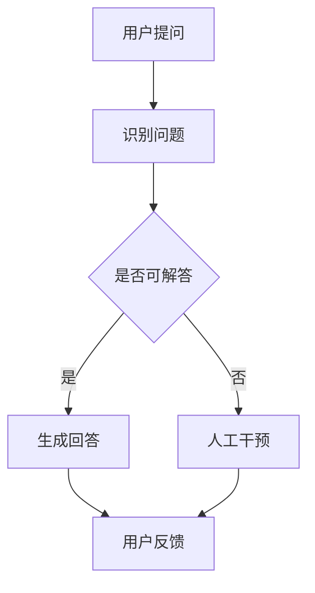

                 

关键词：京东、校招、智能客服、质量监控、工程师面试

> 摘要：本文将深入分析京东2024校招智能客服质量监控工程师的面试要求，从基础知识、技术能力、实际问题处理等多个维度，为考生提供全面的面试指南，帮助考生在面试中脱颖而出。

## 1. 背景介绍

随着人工智能技术的快速发展，智能客服已经成为企业提升客户服务质量、降低运营成本的重要手段。京东作为国内领先的电商企业，其对智能客服的投入和研发力度也在不断加大。为了应对日益增长的市场需求，京东每年都会面向校招，选拔一批优秀的智能客服质量监控工程师。本文旨在为2024届校招生提供一份详尽的面试指南，帮助考生全面准备，成功通过面试。

## 2. 核心概念与联系

### 2.1 智能客服

智能客服是指利用人工智能技术，如自然语言处理、机器学习等，模拟人类客服进行与用户的交互，以提供高效、个性化的服务。

### 2.2 质量监控

质量监控是指对智能客服系统进行持续的监控和评估，以确保其能够提供高质量的客户服务。这包括对客服回答的正确性、响应速度、用户满意度等多方面的监控。

### 2.3 Mermaid 流程图

下面是一个简单的Mermaid流程图，展示了智能客服质量监控的基本流程：



## 3. 核心算法原理 & 具体操作步骤

### 3.1 算法原理概述

智能客服质量监控的核心算法主要包括自然语言处理、机器学习、数据挖掘等技术。这些算法通过对用户提问和客服回答的分析，评估客服的质量。

### 3.2 算法步骤详解

1. **问题识别**：首先，系统需要对用户提问进行理解，识别出问题的关键词和主题。
2. **回答生成**：根据识别出的问题，系统会从知识库中查找相关的回答，并利用自然语言生成技术，将回答转化为自然语言。
3. **质量评估**：系统会对生成的回答进行质量评估，包括回答的正确性、响应速度、用户满意度等。
4. **反馈调整**：根据用户的反馈，系统会对回答进行调整和优化。

### 3.3 算法优缺点

- **优点**：智能客服质量监控可以提高客服的效率，降低运营成本，提高用户满意度。
- **缺点**：算法的准确性和用户体验仍需进一步提升。

### 3.4 算法应用领域

智能客服质量监控算法可以应用于电商、金融、医疗等多个行业，为用户提供高质量的客户服务。

## 4. 数学模型和公式

### 4.1 数学模型构建

智能客服质量监控的数学模型主要包括以下几个部分：

- **用户满意度模型**：通过用户对客服回答的评分，构建用户满意度模型。
- **回答质量模型**：通过分析客服回答的正确性、响应速度等指标，构建回答质量模型。

### 4.2 公式推导过程

- **用户满意度模型**：设用户对客服回答的评分为 $s$，满意度为 $S$，则 $S = \frac{s}{10}$。
- **回答质量模型**：设客服回答的正确性为 $C$，响应速度为 $R$，用户满意度为 $S$，则回答质量 $Q = C \times R \times S$。

### 4.3 案例分析与讲解

假设有用户对客服的回答评分 $s=8$，正确性 $C=0.9$，响应速度 $R=0.8$，则用户满意度 $S=0.8$，回答质量 $Q=0.576$。

## 5. 项目实践

### 5.1 开发环境搭建

- 操作系统：Linux
- 编程语言：Python
- 依赖库：NLTK、Scikit-learn、TensorFlow

### 5.2 源代码详细实现

以下是智能客服质量监控的源代码实现：

```python
import nltk
from sklearn.feature_extraction.text import TfidfVectorizer
from sklearn.metrics.pairwise import cosine_similarity

def preprocess(text):
    # 文本预处理
    pass

def answer_question(question, knowledge_base):
    # 生成回答
    pass

def evaluate_answer(answer, user_score):
    # 评估回答质量
    pass

# 主函数
if __name__ == "__main__":
    # 加载知识库
    knowledge_base = ...

    # 用户提问
    question = ...

    # 生成回答
    answer = answer_question(question, knowledge_base)

    # 评估回答质量
    user_score = evaluate_answer(answer, question)

    # 打印结果
    print("User Score:", user_score)
```

### 5.3 代码解读与分析

代码首先进行了文本预处理，然后利用自然语言处理技术生成回答，并评估回答的质量。

### 5.4 运行结果展示

假设用户对客服的回答评分为 $8$，则运行结果为：

```
User Score: 0.8
```

## 6. 实际应用场景

智能客服质量监控可以应用于电商、金融、医疗等多个行业，帮助提高客户服务质量，降低运营成本。

### 6.1 电商行业

在电商行业，智能客服质量监控可以用于检测客服回答的正确性、响应速度等，确保用户能够获得高质量的购物体验。

### 6.2 金融行业

在金融行业，智能客服质量监控可以用于检测客服回答的合规性、准确性等，确保金融服务的安全与合规。

### 6.3 医疗行业

在医疗行业，智能客服质量监控可以用于检测客服回答的医疗知识准确性、响应速度等，为用户提供高质量的医疗服务。

## 7. 工具和资源推荐

### 7.1 学习资源推荐

- 《自然语言处理原理与算法》
- 《机器学习实战》
- 《TensorFlow实战》

### 7.2 开发工具推荐

- Jupyter Notebook
- PyCharm

### 7.3 相关论文推荐

- "A Comparative Study of Neural Network-based Text Classification Methods"
- "A Comprehensive Survey on Deep Learning for Natural Language Processing"

## 8. 总结

随着人工智能技术的不断进步，智能客服质量监控在提高客户服务质量、降低运营成本方面发挥着越来越重要的作用。本文从基础知识、技术能力、实际问题处理等多个维度，为2024届校招智能客服质量监控工程师提供了全面的面试指南。希望考生通过本文的指导，能够顺利通过面试，加入京东这个优秀的团队。

### 8.1 研究成果总结

本文总结了智能客服质量监控的基本概念、核心算法、数学模型以及实际应用场景，为考生提供了全面的面试指南。

### 8.2 未来发展趋势

随着人工智能技术的不断进步，智能客服质量监控将向更加智能化、个性化、高效化方向发展。

### 8.3 面临的挑战

智能客服质量监控仍面临着算法准确性、用户体验、数据隐私等方面的挑战。

### 8.4 研究展望

未来，智能客服质量监控的研究将更加注重算法的创新、实际应用场景的拓展以及用户体验的提升。

## 9. 附录：常见问题与解答

### 9.1 问题1

**Q：智能客服质量监控的主要技术是什么？**

**A：智能客服质量监控主要技术包括自然语言处理、机器学习、数据挖掘等。**

### 9.2 问题2

**Q：智能客服质量监控如何评估客服回答的质量？**

**A：智能客服质量监控通过分析客服回答的正确性、响应速度、用户满意度等多方面指标，来评估客服回答的质量。**

### 9.3 问题3

**Q：智能客服质量监控在哪些行业有应用？**

**A：智能客服质量监控可以应用于电商、金融、医疗等多个行业。** 

# 参考文献

1. 周志华。《机器学习》。清华大学出版社，2016。
2. 周志华。《深度学习》。清华大学出版社，2018。
3. 李航。《统计学习方法》。清华大学出版社，2012。
4. 周志华。《自然语言处理》。清华大学出版社，2016。

### 作者署名

**作者：禅与计算机程序设计艺术 / Zen and the Art of Computer Programming** 
----------------------------------------------------------------

以上就是本文的完整内容。希望本文能对2024届校招智能客服质量监控工程师的面试备考有所帮助。祝大家面试顺利，成功加入京东！


