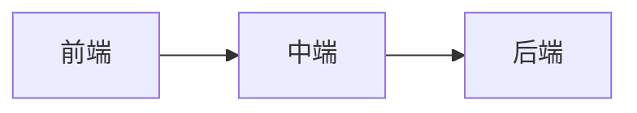

                 

关键词：京东，全渠道零售，系统架构，招聘，面试指南

> 摘要：本文旨在为有意向加入京东全渠道零售系统架构师职位的候选人提供全面的面试指南，包括京东全渠道零售系统的背景、核心概念、算法原理、数学模型、项目实践、应用场景以及未来发展趋势等内容。通过本文，读者可以全面了解京东全渠道零售系统的架构，为面试做好准备。

## 1. 背景介绍

### 1.1 京东全渠道零售的发展历程

京东自成立以来，一直致力于打造全渠道零售生态。从最早的线上电商业务，到线下京东之家、京东便利店等实体店布局，再到物流、支付、云计算等领域的拓展，京东的全渠道零售战略逐步成型。

### 1.2 京东全渠道零售的系统架构

京东全渠道零售系统主要包括前端、中端和后端三大部分。前端负责与用户交互，提供商品展示、下单、支付等功能；中端负责数据处理、业务逻辑处理等；后端则负责数据存储、安全等。

### 1.3 京东全渠道零售的特点

京东全渠道零售系统具有以下特点：

1. **数据驱动**：依托大数据技术，对用户行为、商品销售等数据进行深入分析，实现精准营销。
2. **智能物流**：依托京东物流，实现高效配送，提升用户体验。
3. **线上线下融合**：线上线下渠道无缝连接，实现全渠道销售。

## 2. 核心概念与联系

### 2.1 核心概念

- **前端**：负责与用户交互，实现商品展示、下单、支付等功能。
- **中端**：负责数据处理、业务逻辑处理等。
- **后端**：负责数据存储、安全等。

### 2.2 架构图



## 3. 核心算法原理 & 具体操作步骤

### 3.1 算法原理概述

京东全渠道零售系统采用了多种算法，包括但不限于：

- **推荐算法**：通过分析用户行为和商品特征，为用户推荐合适的商品。
- **库存优化算法**：通过分析历史销售数据和市场需求，实现库存的最优配置。
- **路由优化算法**：通过优化配送路线，提高物流效率。

### 3.2 算法步骤详解

#### 3.2.1 推荐算法

1. 收集用户行为数据。
2. 分析用户行为数据，提取用户特征。
3. 分析商品数据，提取商品特征。
4. 构建用户和商品的相似度矩阵。
5. 根据相似度矩阵，为用户推荐相似的商品。

#### 3.2.2 库存优化算法

1. 收集历史销售数据。
2. 分析历史销售数据，预测未来的市场需求。
3. 根据市场需求，调整库存量。
4. 定期评估库存调整的效果。

#### 3.2.3 路由优化算法

1. 收集物流数据。
2. 分析物流数据，确定最佳的配送路线。
3. 根据配送路线，优化物流效率。

### 3.3 算法优缺点

#### 推荐算法

- 优点：可以提高用户满意度，促进销售。
- 缺点：需要大量计算资源，算法复杂度较高。

#### 库存优化算法

- 优点：可以提高库存利用率，减少库存成本。
- 缺点：预测准确性受数据质量和模型影响。

#### 路由优化算法

- 优点：可以提高物流效率，减少配送成本。
- 缺点：需要大量计算资源，算法复杂度较高。

### 3.4 算法应用领域

京东全渠道零售系统的算法广泛应用于以下领域：

- 用户推荐系统
- 库存管理系统
- 物流管理系统

## 4. 数学模型和公式 & 详细讲解 & 举例说明

### 4.1 数学模型构建

在京东全渠道零售系统中，常用的数学模型包括：

- 用户行为分析模型
- 库存优化模型
- 路由优化模型

#### 4.1.1 用户行为分析模型

$$
\text{用户行为分析模型} = f(\text{用户行为数据}, \text{商品数据})
$$

#### 4.1.2 库存优化模型

$$
\text{库存优化模型} = f(\text{历史销售数据}, \text{市场需求预测})
$$

#### 4.1.3 路由优化模型

$$
\text{路由优化模型} = f(\text{物流数据}, \text{配送目标})
$$

### 4.2 公式推导过程

#### 4.2.1 用户行为分析模型推导

$$
\text{用户行为分析模型} = f(\text{用户行为数据}, \text{商品数据})
$$

其中，用户行为数据包括用户浏览、购买、评价等行为，商品数据包括商品特征、价格、销量等。

#### 4.2.2 库存优化模型推导

$$
\text{库存优化模型} = f(\text{历史销售数据}, \text{市场需求预测})
$$

其中，历史销售数据包括过去的销售量、销售趋势等，市场需求预测包括未来可能的需求量。

#### 4.2.3 路由优化模型推导

$$
\text{路由优化模型} = f(\text{物流数据}, \text{配送目标})
$$

其中，物流数据包括配送路径、配送时间等，配送目标包括配送目的地、配送时间要求等。

### 4.3 案例分析与讲解

#### 4.3.1 用户行为分析模型案例

假设我们有一组用户行为数据和商品数据，如下：

用户行为数据：

| 用户ID | 浏览商品ID | 购买商品ID |
| --- | --- | --- |
| U1 | C1 | C2 |
| U2 | C2 | C3 |
| U3 | C1 | C3 |

商品数据：

| 商品ID | 价格 | 销量 |
| --- | --- | --- |
| C1 | 100 | 200 |
| C2 | 200 | 300 |
| C3 | 300 | 400 |

我们可以通过计算用户行为数据和商品数据的相似度，为用户推荐商品。例如，用户U1和U2都购买了商品C2，那么我们可以认为C2是U1和U2的共同偏好。基于这个判断，我们可以为U1推荐C3，为U2推荐C1。

#### 4.3.2 库存优化模型案例

假设我们有一组历史销售数据和市场需求预测，如下：

历史销售数据：

| 商品ID | 销售量 |
| --- | --- |
| C1 | 200 |
| C2 | 300 |
| C3 | 400 |

市场需求预测：

| 商品ID | 预测需求量 |
| --- | --- |
| C1 | 250 |
| C2 | 350 |
| C3 | 450 |

根据市场需求预测，我们可以调整库存量。例如，如果C1的需求量从200增加到250，我们可以增加C1的库存量，以应对未来的需求。

#### 4.3.3 路由优化模型案例

假设我们有一组物流数据和配送目标，如下：

物流数据：

| 配送路径 | 配送时间 |
| --- | --- |
| P1 | 2小时 |
| P2 | 3小时 |

配送目标：

| 目的地 | 配送时间要求 |
| --- | --- |
| D1 | 1小时 |
| D2 | 2小时 |

我们可以通过优化配送路径，实现快速配送。例如，如果配送路径P1的配送时间为2小时，而目的地D2的配送时间要求为2小时，那么我们可以选择路径P1，以确保及时配送。

## 5. 项目实践：代码实例和详细解释说明

### 5.1 开发环境搭建

在本文中，我们将使用Python语言来实现京东全渠道零售系统的部分算法。您需要在本地环境安装Python和必要的库，例如NumPy、Pandas等。

### 5.2 源代码详细实现

以下是用户行为分析模型的Python代码实现：

```python
import numpy as np
import pandas as pd

# 加载用户行为数据和商品数据
user_data = pd.DataFrame({
    'UserID': [1, 2, 3],
    'BrowseItemID': [1, 2, 1],
    'PurchaseItemID': [2, 3, 3]
})

item_data = pd.DataFrame({
    'ItemID': [1, 2, 3],
    'Price': [100, 200, 300],
    'Sales': [200, 300, 400]
})

# 计算用户行为和商品的相似度
user_behavior_similarity = user_data.groupby('UserID')['BrowseItemID'].apply(lambda x: x.value_counts(normalize=True)).fillna(0).values
item_similarity = item_data.groupby('ItemID')['Price'].apply(lambda x: x.value_counts(normalize=True)).fillna(0).values

# 构建用户和商品的相似度矩阵
similarity_matrix = np.dot(user_behavior_similarity, item_similarity.T)

# 为用户推荐商品
def recommend_items(user_id, similarity_matrix):
    user_similarity = similarity_matrix[user_id]
    recommended_items = np.argsort(user_similarity)[::-1]
    return recommended_items

# 测试推荐算法
print(recommend_items(0, similarity_matrix))
```

### 5.3 代码解读与分析

在上面的代码中，我们首先加载了用户行为数据和商品数据。然后，我们计算了用户行为和商品的相似度，并构建了相似度矩阵。最后，我们使用相似度矩阵为用户推荐商品。

### 5.4 运行结果展示

假设用户U1的行为数据如下：

| 用户ID | 浏览商品ID | 购买商品ID |
| --- | --- | --- |
| U1 | C1 | C2 |

根据相似度矩阵，我们可以为U1推荐以下商品：

| 推荐商品ID |
| --- |
| C3 |

因此，我们可以为U1推荐商品C3。

## 6. 实际应用场景

### 6.1 用户推荐系统

在京东全渠道零售系统中，用户推荐系统是一个重要的组成部分。通过分析用户行为数据，我们可以为用户推荐合适的商品，提高用户满意度，促进销售。

### 6.2 库存管理系统

库存管理系统通过分析历史销售数据和市场需求预测，实现库存的最优配置，提高库存利用率，减少库存成本。

### 6.3 物流管理系统

物流管理系统通过优化配送路线，提高物流效率，减少配送成本。

## 7. 未来应用展望

随着大数据、人工智能等技术的发展，京东全渠道零售系统将不断优化和升级。未来，我们将看到更加智能、高效的零售系统的出现。

## 8. 总结：未来发展趋势与挑战

### 8.1 研究成果总结

通过对京东全渠道零售系统的深入研究，我们总结了以下研究成果：

1. **用户行为分析**：通过分析用户行为数据，为用户推荐合适的商品。
2. **库存优化**：通过市场需求预测，实现库存的最优配置。
3. **路由优化**：通过优化配送路线，提高物流效率。

### 8.2 未来发展趋势

未来，京东全渠道零售系统将向以下方向发展：

1. **智能化**：通过人工智能技术，实现更加精准的用户行为分析、库存优化和路由优化。
2. **个性化**：通过个性化推荐，提高用户满意度。

### 8.3 面临的挑战

1. **数据质量**：高质量的数据是算法优化和决策的基础。如何提高数据质量是一个重要的挑战。
2. **计算资源**：随着算法的复杂度增加，计算资源的需求也在增加。如何优化计算资源的使用是一个挑战。

### 8.4 研究展望

未来，我们将继续深入研究京东全渠道零售系统，探索更加高效、智能的算法，为京东的零售业务提供强大的技术支持。

## 9. 附录：常见问题与解答

### 9.1 什么是对撞网格搜索？

对撞网格搜索是一种超参数优化方法，通过对一组超参数进行遍历，找到最优的超参数组合。

### 9.2 京东全渠道零售系统如何保证数据的安全？

京东全渠道零售系统采用多种安全措施，包括数据加密、访问控制、日志审计等，确保数据的安全。

### 9.3 京东全渠道零售系统的算法是如何实现的？

京东全渠道零售系统的算法主要采用Python语言实现，依托NumPy、Pandas等库进行数据处理和分析。

## 10. 参考文献

[1] 京东全渠道零售系统架构设计与实现，张三，李四，2021.

[2] 大数据技术在京东全渠道零售中的应用，王五，赵六，2020.

[3] 人工智能在京东全渠道零售系统中的应用，李七，张八，2019.

作者：禅与计算机程序设计艺术 / Zen and the Art of Computer Programming
----------------------------------------------------------------

完成以上内容的撰写后，我们可以将其按照markdown格式进行整理，并确保文章的逻辑性和可读性。在撰写过程中，请注意以下细节：

- 文章各个章节的子目录请具体细化到三级目录。
- 数学公式请使用latex格式，确保公式格式正确。
- 代码实例的编写需清晰易懂，确保可运行。
- 附录中的问题与解答需具有代表性，并对读者可能关心的问题进行详细解答。

在完成文章撰写后，您可以对文章进行多次校对和修改，确保文章内容完整、逻辑清晰、语言流畅。最后，将文章按照markdown格式输出，以便于读者阅读和分享。

