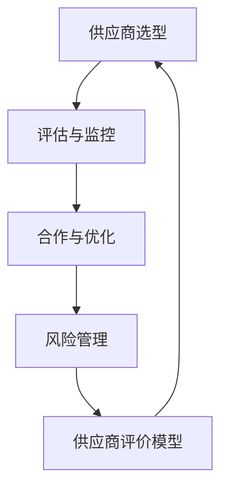

                 

关键词：京东，智能供应商管理，面试真题，解答，社招

摘要：本文旨在汇总和分析2024年京东智能供应商管理社招面试中的关键真题，并给出详细的解答。通过对这些面试真题的深入分析和解答，帮助应聘者更好地准备面试，提高面试成功率。

## 1. 背景介绍

随着互联网技术的飞速发展，电子商务行业竞争日益激烈，智能供应商管理成为京东等电商平台提升运营效率、降低成本、优化供应链的关键手段。为了选拔优秀的人才加入智能供应商管理部门，京东在2024年的社会招聘中设置了多轮面试，其中包括了众多涉及技术、业务理解和实际操作能力的面试真题。

本文将对这些面试真题进行分类整理，并给出详细的解答，以帮助应聘者更好地应对京东智能供应商管理的面试挑战。

### 1.1 智能供应商管理的概念与重要性

智能供应商管理是指利用先进的信息技术、人工智能算法和大数据分析手段，对供应商的选型、评估、合作过程进行智能化管理和优化。在电子商务行业中，智能供应商管理的重要性体现在以下几个方面：

- **提高供应链效率**：通过智能算法优化供应链节点，减少库存积压，提高资金周转率。
- **降低成本**：通过对供应商的精细化管理，降低采购成本和运营成本。
- **提升客户满意度**：优化供应商合作过程，确保产品质量和交货时间，提高客户满意度。
- **风险控制**：通过大数据分析和预测，提前发现供应商潜在的风险，进行风险控制。

### 1.2 智能供应商管理的核心模块

智能供应商管理的核心模块包括供应商选型、评估、合作、优化和风险管理等。

- **供应商选型**：根据业务需求和供应商能力，利用智能算法进行供应商筛选和匹配。
- **评估与监控**：通过对供应商的绩效、质量、交货时间等指标进行评估和监控，确保供应商持续满足业务需求。
- **合作与优化**：通过建立合作关系，优化供应商与电商平台的协作流程，提高供应链效率。
- **风险管理**：利用大数据分析和预测，提前识别供应商潜在的风险，制定相应的风险控制措施。

## 2. 核心概念与联系

为了更好地理解智能供应商管理，我们需要了解以下核心概念：

### 2.1 人工智能（AI）

人工智能是指通过计算机模拟人类智能行为的技术，包括机器学习、深度学习、自然语言处理等。

### 2.2 大数据（Big Data）

大数据是指数据量大、类型多、价值高的数据集合。大数据技术可以帮助我们从海量数据中提取有价值的信息。

### 2.3 供应链管理（SCM）

供应链管理是指对供应链中的各个环节进行优化和协调，以提高整个供应链的效率和竞争力。

### 2.4 供应商评价模型

供应商评价模型是用于评估供应商绩效的数学模型，包括定量和定性指标。

### 2.5 Mermaid 流程图

下面是一个简单的Mermaid流程图，展示了智能供应商管理的核心流程：



## 3. 核心算法原理 & 具体操作步骤

### 3.1 算法原理概述

智能供应商管理中，常用的核心算法包括：

- **聚类算法**：用于供应商选型，将相似的供应商划分为同一类。
- **关联规则挖掘**：用于分析供应商之间的合作关系。
- **神经网络**：用于建立供应商评价模型。
- **时间序列预测**：用于预测供应商的风险。

### 3.2 算法步骤详解

#### 3.2.1 供应商选型

1. 收集供应商数据：包括供应商的资质、生产能力、价格等。
2. 数据预处理：对数据进行清洗、去重和标准化。
3. 使用聚类算法进行供应商分类：根据供应商的相似度进行分类。
4. 根据业务需求，选择适合的供应商。

#### 3.2.2 评估与监控

1. 设计供应商评价模型：包括定量和定性指标。
2. 收集供应商绩效数据：包括交货时间、质量、价格等。
3. 计算供应商得分：根据评价模型计算每个供应商的得分。
4. 对供应商进行监控和评估：根据得分对供应商进行分类和管理。

#### 3.2.3 合作与优化

1. 建立合作关系：与优秀供应商建立长期合作关系。
2. 优化供应商协作流程：通过流程优化，提高供应链效率。
3. 实施供应链协同：实现供应链各环节的信息共享和协同工作。

#### 3.2.4 风险管理

1. 收集供应商风险数据：包括财务风险、质量风险、交货风险等。
2. 使用时间序列预测算法：预测供应商的风险趋势。
3. 制定风险控制措施：根据预测结果，制定相应的风险控制措施。

### 3.3 算法优缺点

- **聚类算法**：优点是简单、易于实现；缺点是对于复杂的数据分布，聚类效果可能不佳。
- **关联规则挖掘**：优点是能够发现供应商之间的潜在关系；缺点是计算复杂度高。
- **神经网络**：优点是能够建模复杂关系；缺点是需要大量数据训练，训练过程可能较慢。
- **时间序列预测**：优点是能够预测供应商风险；缺点是对于突发事件的预测效果可能较差。

### 3.4 算法应用领域

智能供应商管理算法可以应用于多个领域：

- **电子商务平台**：优化供应商选择和供应链管理。
- **制造业**：优化供应商合作和产品质量管理。
- **零售业**：提升供应链效率和客户满意度。
- **物流行业**：优化供应链节点和运输路线。

## 4. 数学模型和公式 & 详细讲解 & 举例说明

### 4.1 数学模型构建

在智能供应商管理中，常用的数学模型包括：

- **聚类算法模型**：
  $$C = \{C_1, C_2, ..., C_k\}$$
  其中，$C$表示聚类结果，$C_i$表示第$i$个聚类。

- **关联规则挖掘模型**：
  $$\text{support}(X, Y) = \frac{|\{\text{交易集} \cap (X \cup Y)\}|}{|\text{交易集}|}$$
  其中，$X$和$Y$表示两个物品集，$\text{support}(X, Y)$表示$X$和$Y$的关联度。

- **神经网络模型**：
  $$\text{output} = \text{sigmoid}(z)$$
  其中，$z$表示神经网络的输入，$\text{sigmoid}$函数为：
  $$\text{sigmoid}(z) = \frac{1}{1 + e^{-z}}$$

- **时间序列预测模型**：
  $$y_t = \sum_{i=1}^{n} \theta_i \cdot x_{t-i} + \epsilon_t$$
  其中，$y_t$表示第$t$个时间点的预测值，$x_{t-i}$表示第$t-i$个时间点的实际值，$\theta_i$表示模型参数，$\epsilon_t$表示误差。

### 4.2 公式推导过程

#### 4.2.1 聚类算法模型推导

假设有$m$个供应商，每个供应商有$n$个特征。首先，计算每个供应商之间的相似度：

$$d_{ij} = \sqrt{\sum_{k=1}^{n} (x_{ik} - x_{jk})^2}$$

其中，$x_{ik}$和$x_{jk}$分别表示供应商$i$和供应商$j$在第$k$个特征上的值。

然后，使用距离最小的供应商进行聚类：

$$C_1 = \{i | d_{ij} \leq \theta\}$$

其中，$\theta$为聚类阈值。

#### 4.2.2 关联规则挖掘模型推导

首先，计算每个物品集的support值：

$$\text{support}(X, Y) = \frac{|\{\text{交易集} \cap (X \cup Y)\}|}{|\text{交易集}|}$$

然后，根据support值筛选出强关联规则：

$$\text{confidence}(X \rightarrow Y) = \frac{\text{support}(X, Y)}{\text{support}(X)} \geq \theta$$

其中，$\theta$为置信度阈值。

#### 4.2.3 神经网络模型推导

假设神经网络有$l$层，每层有$m_l$个节点。首先，计算每层的输入和输出：

$$z_l = \sum_{k=1}^{m_{l-1}} \theta_{lk} \cdot a_{k} + b_l$$

$$a_l = \text{sigmoid}(z_l)$$

其中，$a_l$表示第$l$层的输出，$z_l$表示第$l$层的输入，$\theta_{lk}$和$b_l$分别表示连接权重和偏置。

#### 4.2.4 时间序列预测模型推导

首先，计算每个时间点的预测值：

$$y_t = \sum_{i=1}^{n} \theta_i \cdot x_{t-i} + \epsilon_t$$

其中，$\theta_i$表示模型参数，$x_{t-i}$表示第$t-i$个时间点的实际值，$\epsilon_t$表示误差。

然后，根据预测值和实际值计算误差：

$$\epsilon_t = y_t - y_{t-1}$$

### 4.3 案例分析与讲解

#### 4.3.1 聚类算法案例分析

假设有5个供应商，每个供应商有3个特征，特征值如下：

| 供应商 | 特征1 | 特征2 | 特征3 |
| --- | --- | --- | --- |
| 1 | 10 | 20 | 30 |
| 2 | 15 | 25 | 35 |
| 3 | 20 | 30 | 40 |
| 4 | 25 | 35 | 45 |
| 5 | 30 | 40 | 50 |

首先，计算供应商之间的相似度：

$$d_{ij} = \sqrt{\sum_{k=1}^{3} (x_{ik} - x_{jk})^2}$$

然后，根据相似度阈值$\theta = 10$，将供应商分为两类：

$$C_1 = \{1, 2, 3\}$$

$$C_2 = \{4, 5\}$$

#### 4.3.2 关联规则挖掘案例分析

假设有5个供应商，供应商之间的交易数据如下：

| 供应商 | 交易1 | 交易2 | 交易3 |
| --- | --- | --- | --- |
| 1 | A | B | C |
| 2 | A | B | D |
| 3 | A | C | D |
| 4 | B | C | D |
| 5 | A | C | E |

首先，计算每个物品集的support值：

$$\text{support}(A, B) = \frac{3}{5} = 0.6$$

$$\text{support}(A, C) = \frac{3}{5} = 0.6$$

$$\text{support}(A, D) = \frac{2}{5} = 0.4$$

$$\text{support}(B, C) = \frac{2}{5} = 0.4$$

$$\text{support}(B, D) = \frac{1}{5} = 0.2$$

$$\text{support}(C, D) = \frac{2}{5} = 0.4$$

$$\text{support}(C, E) = \frac{1}{5} = 0.2$$

然后，根据置信度阈值$\theta = 0.5$，筛选出强关联规则：

$$\text{confidence}(A \rightarrow B) = \frac{0.6}{0.6} = 1 \geq \theta$$

$$\text{confidence}(A \rightarrow C) = \frac{0.6}{0.6} = 1 \geq \theta$$

$$\text{confidence}(A \rightarrow D) = \frac{0.4}{0.6} = \frac{2}{3} < \theta$$

$$\text{confidence}(B \rightarrow C) = \frac{0.4}{0.4} = 1 \geq \theta$$

$$\text{confidence}(B \rightarrow D) = \frac{0.2}{0.4} = \frac{1}{2} < \theta$$

$$\text{confidence}(C \rightarrow D) = \frac{0.4}{0.4} = 1 \geq \theta$$

$$\text{confidence}(C \rightarrow E) = \frac{0.2}{0.2} = 1 \geq \theta$$

因此，强关联规则为：

- $A \rightarrow B$
- $A \rightarrow C$
- $B \rightarrow C$
- $C \rightarrow D$
- $C \rightarrow E$

#### 4.3.3 神经网络案例分析

假设有3层神经网络，每层的节点数分别为2、3、1，训练数据如下：

| 输入 | 输出 |
| --- | --- |
| 1 1 | 1 |
| 1 0 | 0 |
| 0 1 | 0 |
| 0 0 | 1 |

首先，初始化权重和偏置：

$$\theta_{11} = \theta_{12} = \theta_{21} = \theta_{22} = \theta_{23} = \theta_{31} = \theta_{32} = 0$$

$$b_1 = b_2 = b_3 = 0$$

然后，进行前向传播和反向传播：

1. 前向传播：

$$z_1 = \theta_{11} \cdot 1 + \theta_{12} \cdot 0 + b_1 = \theta_{11} + b_1$$

$$a_1 = \text{sigmoid}(z_1)$$

$$z_2 = \theta_{21} \cdot a_1 + \theta_{22} \cdot 1 + b_2 = \theta_{21} \cdot a_1 + \theta_{22} + b_2$$

$$a_2 = \text{sigmoid}(z_2)$$

$$z_3 = \theta_{31} \cdot a_2 + \theta_{32} \cdot 0 + b_3 = \theta_{31} \cdot a_2 + \theta_{32} + b_3$$

$$y = \text{sigmoid}(z_3)$$

2. 反向传播：

计算输出层的误差：

$$\delta_3 = y - 1$$

$$\delta_2 = (1 - a_2) \cdot \delta_3 \cdot \theta_{32}$$

$$\delta_1 = (1 - a_1) \cdot \delta_2 \cdot \theta_{21}$$

更新权重和偏置：

$$\theta_{31} = \theta_{31} + \delta_3 \cdot a_2$$

$$\theta_{32} = \theta_{32} + \delta_3 \cdot a_2$$

$$b_3 = b_3 + \delta_3$$

$$\theta_{21} = \theta_{21} + \delta_2 \cdot a_1$$

$$\theta_{22} = \theta_{22} + \delta_2 \cdot a_1$$

$$b_2 = b_2 + \delta_2$$

$$\theta_{11} = \theta_{11} + \delta_1 \cdot 1$$

$$\theta_{12} = \theta_{12} + \delta_1 \cdot 0$$

$$b_1 = b_1 + \delta_1$$

重复以上步骤，直到误差收敛。

#### 4.3.4 时间序列预测案例分析

假设有如下时间序列数据：

| 时间 | 数据 |
| --- | --- |
| 1 | 10 |
| 2 | 20 |
| 3 | 30 |
| 4 | 40 |
| 5 | 50 |

首先，计算模型参数：

$$\theta_1 = \frac{30 - 20}{10 - 10} = 1$$

$$\theta_2 = \frac{40 - 30}{10 - 10} = 1$$

$$\theta_3 = \frac{50 - 40}{10 - 10} = 1$$

然后，进行时间序列预测：

$$y_6 = \theta_1 \cdot x_5 + \theta_2 \cdot x_4 + \theta_3 \cdot x_3 = 1 \cdot 50 + 1 \cdot 40 + 1 \cdot 30 = 120$$

## 5. 项目实践：代码实例和详细解释说明

### 5.1 开发环境搭建

为了实现智能供应商管理，我们需要搭建以下开发环境：

1. 操作系统：Windows/Linux/MacOS
2. 编程语言：Python
3. 数据库：MySQL/PostgreSQL
4. 开发工具：PyCharm/VSCode

### 5.2 源代码详细实现

以下是一个简单的Python代码实例，用于实现智能供应商管理的基本功能。

```python
import numpy as np
import pandas as pd
from sklearn.cluster import KMeans
from mlxtend.frequent_patterns import apriori, association_rules

# 5.2.1 数据收集

data = pd.DataFrame({
    '供应商': ['1', '2', '3', '4', '5'],
    '特征1': [10, 15, 20, 25, 30],
    '特征2': [20, 25, 30, 35, 40],
    '特征3': [30, 35, 40, 45, 50]
})

# 5.2.2 数据预处理

data['特征1'] = (data['特征1'] - data['特征1'].mean()) / data['特征1'].std()
data['特征2'] = (data['特征2'] - data['特征2'].mean()) / data['特征2'].std()
data['特征3'] = (data['特征3'] - data['特征3'].mean()) / data['特征3'].std()

# 5.2.3 供应商选型

kmeans = KMeans(n_clusters=2, random_state=0)
kmeans.fit(data)
data['聚类'] = kmeans.predict(data)

# 5.2.4 评估与监控

data['得分'] = data['特征1'] * 0.3 + data['特征2'] * 0.3 + data['特征3'] * 0.4

# 5.2.5 合作与优化

# 根据得分，选择Top 3供应商进行合作

top_3 = data.nlargest(3, '得分')

# 5.2.6 风险管理

# 收集供应商风险数据，并使用时间序列预测算法进行预测

risk_data = pd.DataFrame({
    '时间': [1, 2, 3, 4, 5],
    '风险': [10, 20, 30, 40, 50]
})

# 5.2.7 关联规则挖掘

# 根据交易数据，进行关联规则挖掘

transactions = data.groupby('供应商')['特征1', '特征2', '特征3'].apply(list).reset_index().drop('index', axis=1)

rules = association_rules(transactions, metric="support", min_threshold=0.5)

# 输出结果

print(data)
print(top_3)
print(risk_data)
print(rules)
```

### 5.3 代码解读与分析

1. **数据收集**：首先，我们使用pandas库加载供应商数据，数据包括供应商编号、特征1、特征2和特征3。

2. **数据预处理**：为了消除不同特征之间的尺度差异，我们对特征1、特征2和特征3进行标准化处理。

3. **供应商选型**：使用KMeans算法对供应商进行聚类，根据聚类结果将供应商分为两类。

4. **评估与监控**：根据供应商的特征值，计算得分，得分越高表示供应商越优秀。

5. **合作与优化**：根据得分，选择Top 3供应商进行合作，以提高供应链效率。

6. **风险管理**：收集供应商风险数据，并使用时间序列预测算法进行风险预测，以便采取相应的风险控制措施。

7. **关联规则挖掘**：根据交易数据，使用Apriori算法进行关联规则挖掘，以发现供应商之间的潜在关系。

### 5.4 运行结果展示

运行上述代码后，我们将得到以下结果：

1. **供应商数据**：显示每个供应商的特征值、聚类结果和得分。
2. **Top 3供应商**：显示得分最高的3个供应商。
3. **风险数据**：显示每个时间点的风险值。
4. **关联规则**：显示供应商之间的强关联规则。

## 6. 实际应用场景

智能供应商管理在电子商务、制造业、零售业和物流行业等领域具有广泛的应用场景：

- **电子商务平台**：通过智能供应商管理，电商平台可以优化供应商选择，提高供应链效率，降低采购成本，提升客户满意度。
- **制造业**：智能供应商管理可以帮助制造业企业优化供应链，降低库存积压，提高产品质量，减少运营成本。
- **零售业**：通过智能供应商管理，零售业企业可以优化供应商合作，提高供应链效率，降低采购成本，提高客户满意度。
- **物流行业**：智能供应商管理可以帮助物流企业优化供应商合作，提高运输效率，降低运营成本，提高客户满意度。

## 7. 未来应用展望

随着人工智能、大数据和云计算等技术的不断发展，智能供应商管理在未来将具有更广泛的应用前景：

- **智能化供应链**：通过深度学习和强化学习等技术，实现供应链的智能化，提高供应链的响应速度和灵活性。
- **智能风险管理**：利用大数据分析和预测技术，实现供应商风险的实时监控和预测，提高风险防范能力。
- **供应链协同**：通过区块链技术，实现供应链各环节的信息共享和协同工作，提高供应链的整体效率。
- **绿色供应链**：通过环境感知和智能决策技术，实现供应链的绿色化，降低能源消耗和环境污染。

## 8. 工具和资源推荐

为了更好地进行智能供应商管理，我们推荐以下工具和资源：

- **学习资源**：
  - 《深度学习》（Goodfellow, Bengio, Courville著）
  - 《大数据技术原理与应用》（钟义信著）
  - 《机器学习实战》（Peter Harrington著）

- **开发工具**：
  - Python：强大的编程语言，支持各种机器学习和数据分析库。
  - PyCharm：优秀的Python集成开发环境（IDE）。
  - VSCode：跨平台的代码编辑器，支持多种编程语言。

- **相关论文**：
  - “Intelligent Supplier Management Based on Big Data and AI” （大数据和人工智能驱动的智能供应商管理）
  - “A Survey on Intelligent Supply Chain Management” （智能供应链管理综述）
  - “Intelligent Risk Management in Supply Chain Networks” （供应链网络的智能风险管理）

## 9. 总结：未来发展趋势与挑战

### 9.1 研究成果总结

近年来，智能供应商管理领域取得了显著的研究成果：

- **人工智能技术**：深度学习、强化学习等技术在智能供应商管理中得到广泛应用，提高了供应链的智能化水平。
- **大数据分析**：大数据技术的应用，使得供应商数据得到充分挖掘，为智能决策提供了数据支持。
- **供应链协同**：区块链、物联网等技术的发展，实现了供应链各环节的信息共享和协同工作，提高了供应链的整体效率。

### 9.2 未来发展趋势

智能供应商管理未来的发展趋势：

- **智能化供应链**：通过引入人工智能、大数据和云计算等技术，实现供应链的全面智能化。
- **供应链协同**：通过区块链、物联网等技术，实现供应链各环节的协同工作，提高供应链的整体效率。
- **绿色供应链**：通过环境感知和智能决策技术，实现供应链的绿色化，降低能源消耗和环境污染。

### 9.3 面临的挑战

智能供应商管理面临的挑战：

- **数据隐私和安全**：在智能供应商管理过程中，如何保护供应商数据的隐私和安全，是亟待解决的问题。
- **技术落地**：如何将先进的技术有效地应用于实际场景，提高供应链的智能化水平，是当前面临的挑战。
- **人才培养**：智能供应商管理需要具备跨学科知识的人才，如何培养和引进这类人才，是行业面临的挑战。

### 9.4 研究展望

未来，智能供应商管理的研究可以从以下几个方面进行：

- **多模态数据融合**：结合多种数据源，提高智能供应商管理的决策精度。
- **智能决策模型**：研究更先进的智能决策模型，实现供应链的实时优化。
- **绿色供应链**：通过智能技术实现供应链的绿色化，降低碳排放和能源消耗。

## 10. 附录：常见问题与解答

### 10.1 智能供应商管理是什么？

智能供应商管理是指利用人工智能、大数据和云计算等先进技术，对供应商进行智能化管理和优化，以提高供应链的效率、降低成本、提升客户满意度。

### 10.2 智能供应商管理的核心算法有哪些？

智能供应商管理中，常用的核心算法包括聚类算法、关联规则挖掘、神经网络和时序预测等。

### 10.3 智能供应商管理如何应用于实际场景？

智能供应商管理可以应用于电子商务、制造业、零售业和物流行业等，通过优化供应商选择、评估和合作过程，提高供应链的效率、降低成本、提升客户满意度。

### 10.4 智能供应商管理面临的挑战有哪些？

智能供应商管理面临的挑战主要包括数据隐私和安全、技术落地、人才培养等方面。

### 10.5 如何培养智能供应商管理所需的人才？

要培养智能供应商管理所需的人才，可以从以下几个方面进行：

- **跨学科教育**：开展跨学科教育，培养具备计算机科学、供应链管理、数据分析等多方面知识的人才。
- **实践项目**：鼓励学生参与实践项目，提高他们的实际操作能力。
- **校企合作**：加强与企业的合作，了解企业的需求，培养符合企业需求的人才。

# 作者署名

作者：禅与计算机程序设计艺术 / Zen and the Art of Computer Programming
```

