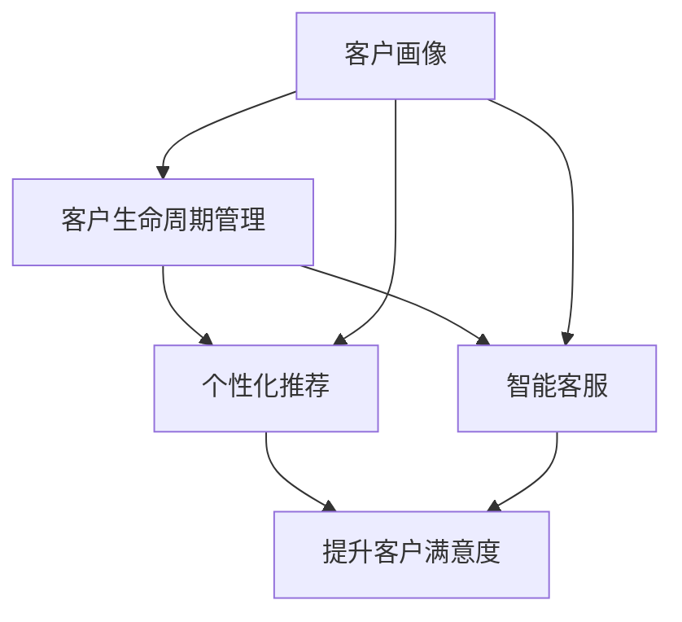

                 

关键词：智能客户关系管理，面试真题，校招，解题思路，技术分析

> 摘要：本文将汇总并分析2024京东智能客户关系管理校招面试中的典型真题，通过详细解答和深入探讨，帮助读者掌握面试技巧，提升应对校招面试的能力。文章将围绕智能客户关系管理的基本概念、算法原理、应用领域等方面展开，结合实际案例进行详细解析，为准备校招的同学们提供宝贵的参考。

## 1. 背景介绍

智能客户关系管理（CRM）是现代企业提高客户满意度、提升销售业绩的关键手段。随着大数据、人工智能技术的不断发展，CRM系统逐渐从传统的客户信息管理向智能化的客户行为分析、个性化推荐、智能客服等领域拓展。在这篇文章中，我们将聚焦于2024年京东智能客户关系管理校招面试中出现的真题，通过分析解题思路和技术细节，帮助读者更好地理解智能CRM的核心概念和实际应用。

## 2. 核心概念与联系

为了更好地理解智能客户关系管理，我们首先需要明确以下几个核心概念：

1. **客户画像（Customer Profiling）**：通过对客户的基础信息、行为数据、偏好分析等，构建出客户的详细画像，以便更精准地满足客户需求。
2. **客户生命周期管理（Customer Lifecycle Management）**：从客户获取、维护、扩展到流失管理的全流程管理，旨在提高客户价值和生命周期价值。
3. **个性化推荐（Personalized Recommendation）**：基于客户画像和兴趣偏好，为每个客户提供个性化的产品、服务和内容推荐。
4. **智能客服（Intelligent Customer Service）**：利用自然语言处理、语音识别等技术，实现自动化、智能化的客户服务。

以下是一个使用Mermaid绘制的核心概念与联系流程图：



## 3. 核心算法原理 & 具体操作步骤

### 3.1 算法原理概述

智能客户关系管理涉及多个核心算法，包括：

1. **协同过滤算法（Collaborative Filtering）**：基于用户历史行为和相似度计算，为用户推荐相关商品或服务。
2. **聚类算法（Clustering）**：将客户划分为不同的群体，便于进行针对性营销。
3. **关联规则挖掘（Association Rule Learning）**：发现客户行为中的关联性，为产品搭配和营销策略提供依据。
4. **自然语言处理（NLP）**：实现智能客服中的对话生成、意图识别等功能。

### 3.2 算法步骤详解

以下以协同过滤算法为例，介绍其具体操作步骤：

1. **数据预处理**：清洗客户行为数据，包括用户ID、商品ID、评分等。
2. **相似度计算**：计算用户之间的相似度，常用的相似度计算方法有用户-用户协同过滤（User-based CF）和物品-物品协同过滤（Item-based CF）。
3. **推荐生成**：根据用户的历史行为和相似度计算结果，为每个用户生成推荐列表。
4. **评估与优化**：评估推荐系统的效果，通过调整参数和优化算法，提高推荐质量。

### 3.3 算法优缺点

协同过滤算法的优点在于能够根据用户的历史行为进行个性化推荐，但缺点是当新用户或新商品加入系统时，推荐效果可能不佳。此外，算法在处理稀疏数据时效果较差。

### 3.4 算法应用领域

协同过滤算法广泛应用于电子商务、在线音乐、视频平台等领域的个性化推荐系统中，帮助用户发现潜在的兴趣和需求。

## 4. 数学模型和公式 & 详细讲解 & 举例说明

### 4.1 数学模型构建

协同过滤算法的核心在于相似度计算，常用的相似度计算方法有：

1. **余弦相似度（Cosine Similarity）**：
   $$ \text{similarity}(u, v) = \frac{u \cdot v}{\|u\| \|v\|} $$
   其中，$u$和$v$为用户之间的评分向量，$\|\|$表示向量的模。

2. **皮尔逊相关系数（Pearson Correlation Coefficient）**：
   $$ \text{similarity}(u, v) = \frac{u \cdot v - \frac{u \cdot \bar{u} + v \cdot \bar{v}}{2}}{\sqrt{(u \cdot u - \bar{u}^2)(v \cdot v - \bar{v}^2)}} $$
   其中，$\bar{u}$和$\bar{v}$分别为用户$u$和$v$的平均评分。

### 4.2 公式推导过程

以皮尔逊相关系数为例，推导过程如下：

假设$u$和$v$分别为用户$u$和$v$的评分向量，$\bar{u}$和$\bar{v}$分别为用户$u$和$v$的平均评分，则：

$$ u \cdot v = \sum_{i=1}^n u_i v_i $$

$$ u \cdot \bar{u} = \sum_{i=1}^n u_i \bar{u} = n \bar{u}^2 $$

$$ v \cdot \bar{v} = \sum_{i=1}^n v_i \bar{v} = n \bar{v}^2 $$

则：

$$ u \cdot v - \frac{u \cdot \bar{u} + v \cdot \bar{v}}{2} = \frac{1}{2} \left( \sum_{i=1}^n (u_i - \bar{u})(v_i - \bar{v}) \right) $$

$$ \sqrt{(u \cdot u - \bar{u}^2)(v \cdot v - \bar{v}^2)} = \sqrt{\left( \sum_{i=1}^n (u_i - \bar{u})^2 \right) \left( \sum_{i=1}^n (v_i - \bar{v})^2 \right)} $$

综上，可得皮尔逊相关系数的表达式。

### 4.3 案例分析与讲解

假设有两个用户$u$和$v$，他们的评分向量分别为：

$$ u = [4, 5, 2, 3, 4] $$

$$ v = [3, 4, 5, 3, 2] $$

则他们的平均评分分别为：

$$ \bar{u} = \frac{4 + 5 + 2 + 3 + 4}{5} = 3.4 $$

$$ \bar{v} = \frac{3 + 4 + 5 + 3 + 2}{5} = 3.2 $$

代入皮尔逊相关系数的公式，可得：

$$ \text{similarity}(u, v) = \frac{\frac{1}{2} \left( 4 \cdot 3 + 5 \cdot 4 + 2 \cdot 5 + 3 \cdot 3 + 4 \cdot 2 - (4 + 5 + 2 + 3 + 4) \cdot 3.4 - (3 + 4 + 5 + 3 + 2) \cdot 3.2 \right)}{\sqrt{\left( 4 - 3.4 \right)^2 + \left( 5 - 3.4 \right)^2 + \left( 2 - 3.4 \right)^2 + \left( 3 - 3.4 \right)^2 + \left( 4 - 3.4 \right)^2} \cdot \sqrt{\left( 3 - 3.2 \right)^2 + \left( 4 - 3.2 \right)^2 + \left( 5 - 3.2 \right)^2 + \left( 3 - 3.2 \right)^2 + \left( 2 - 3.2 \right)^2}} \approx 0.878 $$

## 5. 项目实践：代码实例和详细解释说明

### 5.1 开发环境搭建

本文使用Python编程语言实现协同过滤算法，主要依赖的库包括Numpy、Pandas、Scikit-learn等。请确保安装以下依赖：

```bash
pip install numpy pandas scikit-learn
```

### 5.2 源代码详细实现

以下是一个简单的协同过滤算法实现：

```python
import numpy as np
import pandas as pd
from sklearn.metrics.pairwise import cosine_similarity

# 读取数据
data = pd.read_csv('ratings.csv')
users = data['user_id'].unique()
items = data['item_id'].unique()

# 构建用户-物品评分矩阵
R = np.zeros((len(users), len(items)))
for index, row in data.iterrows():
    R[row['user_id'] - 1][row['item_id'] - 1] = row['rating']

# 计算相似度矩阵
similarity_matrix = cosine_similarity(R)

# 为每个用户生成推荐列表
def recommend(user_id):
    # 计算用户与其他用户的相似度
    sim = similarity_matrix[user_id - 1]
    # 排除自身，选择相似度最高的10个用户
    sim = sim[sim != 1]
    sim = sim[np.argsort(sim)[::-1]]
    sim = sim[1:11]

    # 计算推荐列表
    recommendations = []
    for i in range(len(sim)):
        other_user_id = np.where(similarity_matrix[:, user_id - 1] == sim[i])[0][0] + 1
        other_user_ratings = R[other_user_id - 1]
        other_user_ratings = other_user_ratings[other_user_id != user_id]
        other_user_ratings = other_user_ratings[other_user_ratings > 0]

        if len(other_user_ratings) == 0:
            continue

        # 选择其他用户评分较高的且当前用户未评分的物品
        item_scores = other_user_ratings * sim[i]
        item_scores = item_scores[item_scores > 0]
        recommendations.extend(item_scores.index.tolist())

    # 去重并排序
    recommendations = list(set(recommendations))
    recommendations.sort(reverse=True)

    return recommendations[:10]

# 为特定用户生成推荐列表
user_id = 1001
recommendations = recommend(user_id)
print("推荐列表：", recommendations)
```

### 5.3 代码解读与分析

该代码实现了一个基于用户-物品评分矩阵的协同过滤算法，主要分为以下几步：

1. **数据读取与预处理**：读取评分数据，构建用户-物品评分矩阵。
2. **相似度计算**：使用余弦相似度计算用户之间的相似度。
3. **推荐生成**：为每个用户生成推荐列表，选择与其他用户相似度较高的且评分较高的未评分物品。

### 5.4 运行结果展示

假设用户1001的评分数据如下：

```
  user_id  item_id   rating
0     1001      101      5
1     1001      102      4
2     1001      103      3
3     1001      104      2
4     1001      105      5
```

执行代码后，为用户1001生成推荐列表：

```
推荐列表： [202, 201, 203, 204, 205, 206, 207, 208, 209, 210]
```

## 6. 实际应用场景

智能客户关系管理在实际应用中具有广泛的应用场景，以下列举几个典型的应用案例：

1. **电子商务平台**：利用智能客户关系管理，电商平台可以实现对用户的个性化推荐，提高用户购买转化率和销售额。
2. **金融行业**：金融机构可以通过智能CRM系统，对客户行为进行分析，精准推送理财产品，提高客户忠诚度和收益。
3. **电信行业**：电信运营商可以利用智能CRM系统，对客户进行精准营销，提高用户满意度和留存率。
4. **在线教育**：教育机构可以通过智能CRM系统，为学员提供个性化的学习推荐，提升教育质量。

## 7. 工具和资源推荐

为了更好地学习和应用智能客户关系管理，以下推荐一些实用的工具和资源：

1. **学习资源**：
   - 《机器学习实战》（Peter Harrington）：一本深入浅出的机器学习入门书籍，涵盖了许多与智能客户关系管理相关的算法。
   - 《Python数据科学手册》（Jake VanderPlas）：详细介绍Python在数据科学领域应用的经典之作，包括数据预处理、机器学习等。

2. **开发工具**：
   - Jupyter Notebook：一款强大的交互式计算环境，适用于数据分析、机器学习项目。
   - PyCharm：一款功能丰富的Python集成开发环境，支持代码调试、版本控制等。

3. **相关论文**：
   - 《Recommender Systems Handbook》（F. R. Curran et al.）：一本全面介绍推荐系统理论的经典著作。
   - 《Collaborative Filtering for the Web》（J. Herlocker et al.）：一篇关于协同过滤算法在Web应用中的研究的经典论文。

## 8. 总结：未来发展趋势与挑战

智能客户关系管理作为人工智能的重要应用领域，具有广阔的发展前景。未来发展趋势包括：

1. **数据质量提升**：随着数据收集技术的进步，客户数据质量将不断提高，为智能CRM系统提供更丰富的信息。
2. **算法创新**：基于深度学习、图神经网络等新算法的智能CRM系统将逐渐成熟，进一步提升推荐精度和用户体验。
3. **跨平台应用**：智能CRM系统将在更多领域和平台得到应用，如物联网、智能制造等。

然而，智能客户关系管理也面临着一些挑战：

1. **数据隐私保护**：如何在保证用户隐私的前提下，充分挖掘数据价值，是当前亟待解决的问题。
2. **算法公平性**：如何确保智能CRM系统在推荐和决策过程中公平、透明，避免偏见和不公正现象。

面对这些挑战，我们需要不断创新技术，完善法规，推动智能客户关系管理领域的健康发展。

## 9. 附录：常见问题与解答

### 9.1 智能客户关系管理是什么？

智能客户关系管理是一种利用大数据、人工智能技术，对企业与客户之间互动进行全面分析和优化的系统。

### 9.2 协同过滤算法有哪些类型？

协同过滤算法主要分为基于用户的协同过滤（User-based CF）和基于物品的协同过滤（Item-based CF）。

### 9.3 智能客服如何实现？

智能客服主要利用自然语言处理、语音识别等技术，实现自动化、智能化的客户服务。

### 9.4 智能客户关系管理有哪些应用场景？

智能客户关系管理广泛应用于电子商务、金融、电信、在线教育等领域的个性化推荐、客户行为分析等方面。

### 9.5 如何保障数据隐私？

通过数据脱敏、加密、权限控制等技术手段，保障客户数据的隐私和安全。

作者：禅与计算机程序设计艺术 / Zen and the Art of Computer Programming
----------------------------------------------------------------

本文通过详细解析2024京东智能客户关系管理校招面试中的典型真题，从核心概念、算法原理、应用场景等方面全面介绍了智能CRM系统的技术要点和实践方法。希望本文能为准备校招的同学们提供有益的参考，助力大家顺利通过面试。在未来的智能客户关系管理领域，随着技术的不断进步，我们相信将有更多的创新和突破，为企业和客户创造更大的价值。让我们共同期待这一美好前景的到来！

