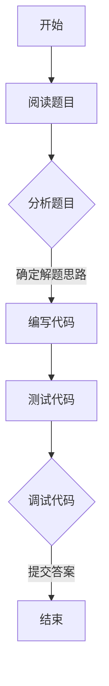

                 

 关键词：2025京东校招，面试题，算法编程，技术分析，编程技巧，数据结构，算法原理，数学模型，实战案例

## 摘要

本文将详细分析2025年京东校招面试题和算法编程题，旨在为准备参加京东校招的考生提供清晰的解题思路和策略。文章首先介绍京东校招的背景和重要性，然后深入解析面试题和算法编程题的类型、特点以及解决方案。通过具体案例和代码实现，本文将帮助读者更好地理解和掌握面试所需的技术知识和编程能力。同时，文章还将探讨未来应用场景和挑战，为读者提供广阔的视野和深入的研究方向。

## 1. 背景介绍

### 1.1 京东校招概况

京东作为中国领先的电商平台，每年都会举办校招活动，吸引全球各地的优秀应届毕业生加入。2025年京东校招吸引了超过十万名应届生参与，面试环节包括技术面试、行为面试和专业面试等多个环节。其中，技术面试主要涉及编程题和算法题，旨在考察应聘者的编程能力、逻辑思维和解题技巧。

### 1.2 校招面试的重要性

对于求职者来说，校招面试是进入知名企业的重要机会。通过校招面试，求职者不仅能够展示自己的技术实力，还能积累宝贵的面试经验。此外，校招面试题通常涵盖广泛的知识点，有助于求职者在短时间内全面提升自己的技术水平。

## 2. 核心概念与联系

### 2.1 面试题类型

京东校招面试题主要分为以下几种类型：

- **编程题**：考察应聘者的编程基础和编程能力，常见题型包括实现函数、修改代码逻辑等。
- **算法题**：考察应聘者的算法设计和分析能力，常见题型包括排序算法、搜索算法、图算法等。
- **数据结构题**：考察应聘者的数据结构理解和应用能力，常见题型包括链表、树、堆等数据结构的实现和应用。
- **综合题**：结合编程、算法和数据结构，考察应聘者的综合能力，常见题型包括组合优化、动态规划等。

### 2.2 面试题特点

京东校招面试题具有以下特点：

- **难度适中**：面试题难度介于中学竞赛和研究生考试之间，旨在考察应聘者的基础能力和实际编程能力。
- **多样性**：面试题覆盖面广，涉及多种题型和知识点，要求应聘者具备较强的综合素质。
- **实践性**：面试题注重实际应用，要求应聘者能够灵活运用所学知识解决实际问题。

### 2.3 面试题解决方案

针对京东校招面试题的特点，应聘者可以采取以下策略：

- **基础知识扎实**：熟练掌握编程语言、数据结构和算法的基本原理，为解题打下坚实基础。
- **刷题练习**：通过刷题积累经验，熟悉各类题型的解题方法和技巧。
- **代码优化**：注重代码的可读性和执行效率，提高编程能力。
- **总结反思**：总结面试经验，分析错误原因，不断改进解题方法。

### 2.4 Mermaid 流程图

以下是一个示例的 Mermaid 流程图，用于展示面试题的解题过程：



## 3. 核心算法原理 & 具体操作步骤

### 3.1 算法原理概述

在京东校招面试中，核心算法题主要包括以下几种：

- **排序算法**：如快速排序、归并排序、冒泡排序等，用于对一组数据进行排序。
- **搜索算法**：如二分搜索、深度优先搜索、广度优先搜索等，用于在数据结构中查找特定元素。
- **图算法**：如最短路径算法、拓扑排序、最小生成树等，用于解决图相关的问题。
- **动态规划**：用于解决具有重叠子问题和最优子结构特性的问题，如背包问题、最长公共子序列等。

### 3.2 算法步骤详解

以下以“快速排序”为例，详细讲解其原理和步骤：

#### 3.2.1 快速排序原理

快速排序是一种高效的排序算法，采用分治策略，将一个序列分为较小的子序列，再递归地对子序列进行排序。快速排序的核心步骤是“分区操作”，通过选择一个基准元素，将序列分为两部分，左边部分的元素都不大于基准元素，右边部分的元素都不小于基准元素。

#### 3.2.2 快速排序步骤

1. **选择基准元素**：通常选择序列的第一个或最后一个元素作为基准。
2. **分区操作**：将序列划分为两个子序列，左边不大于基准，右边不小于基准。
3. **递归排序**：对划分后的两个子序列递归进行快速排序。

#### 3.2.3 快速排序代码实现

以下是一个简单的快速排序代码实现：

```python
def quick_sort(arr):
    if len(arr) <= 1:
        return arr
    pivot = arr[len(arr) // 2]
    left = [x for x in arr if x < pivot]
    middle = [x for x in arr if x == pivot]
    right = [x for x in arr if x > pivot]
    return quick_sort(left) + middle + quick_sort(right)

arr = [3, 6, 8, 10, 1, 2, 1]
print(quick_sort(arr))
```

### 3.3 算法优缺点

#### 3.3.1 优点

- **高效**：平均时间复杂度为 $O(n \log n)$，最坏情况下为 $O(n^2)$。
- **原地排序**：只需要较少的额外空间。
- **可并行化**：可以采用多线程或多进程的方式提高排序效率。

#### 3.3.2 缺点

- **最坏情况性能较差**：在序列已经有序或基本有序时，性能会下降到 $O(n^2)$。
- **递归深度**：递归调用可能导致栈溢出，对于大数组可能不适用。

### 3.4 算法应用领域

快速排序广泛应用于各种数据排序需求，如数据库索引排序、数组排序、堆排序的子过程等。此外，快速排序也是很多其他算法的基础，如选择排序、快速选择算法等。

## 4. 数学模型和公式 & 详细讲解 & 举例说明

### 4.1 数学模型构建

在解决算法问题时，数学模型和公式起着关键作用。以下是一个典型的数学模型构建示例：

假设有一个包含 $n$ 个元素的数据集 $D$，我们需要对其进行排序。设排序算法的时间复杂度为 $T(n)$，那么我们可以构建一个数学模型来描述排序算法的性能。

### 4.2 公式推导过程

1. **平均时间复杂度**：

   $$
   \bar{T}(n) = \sum_{i=1}^{n} T(i) \times P(i)
   $$

   其中，$P(i)$ 为数据集中包含 $i$ 个元素的概率。

2. **最坏时间复杂度**：

   $$
   W_T(n) = \max_{i=1,...,n} T(i)
   $$

3. **最好时间复杂度**：

   $$
   B_T(n) = \min_{i=1,...,n} T(i)
   $$

### 4.3 案例分析与讲解

以下以快速排序为例，分析其时间复杂度：

#### 4.3.1 平均时间复杂度

对于快速排序，平均时间复杂度为 $O(n \log n)$。这是因为每次分区操作可以将数据集划分为两个大小接近的子数据集，从而递归地降低问题规模。

#### 4.3.2 最坏时间复杂度

在数据集已经有序或基本有序的情况下，快速排序的最坏时间复杂度为 $O(n^2)$。这是因为每次分区操作只能将数据集划分为一个元素和 $n-1$ 个元素，导致递归深度增加。

#### 4.3.3 代码实现

以下是一个快速排序的 Python 代码实现：

```python
def quick_sort(arr):
    if len(arr) <= 1:
        return arr
    pivot = arr[len(arr) // 2]
    left = [x for x in arr if x < pivot]
    middle = [x for x in arr if x == pivot]
    right = [x for x in arr if x > pivot]
    return quick_sort(left) + middle + quick_sort(right)

arr = [3, 6, 8, 10, 1, 2, 1]
print(quick_sort(arr))
```

## 5. 项目实践：代码实例和详细解释说明

### 5.1 开发环境搭建

在开始项目实践之前，我们需要搭建一个适合编写和运行代码的开发环境。以下是一个简单的 Python 开发环境搭建步骤：

1. **安装 Python**：下载并安装 Python 3.x 版本，推荐使用 Anaconda。
2. **配置 Python 环境**：在终端执行 `conda create -n myenv python=3.8` 创建一个新的 Python 虚拟环境，并激活该环境。
3. **安装必要的库**：使用 `pip` 安装所需的库，如 `numpy`、`pandas` 等。

### 5.2 源代码详细实现

以下是一个简单的快速排序 Python 代码实现：

```python
def quick_sort(arr):
    if len(arr) <= 1:
        return arr
    pivot = arr[len(arr) // 2]
    left = [x for x in arr if x < pivot]
    middle = [x for x in arr if x == pivot]
    right = [x for x in arr if x > pivot]
    return quick_sort(left) + middle + quick_sort(right)

arr = [3, 6, 8, 10, 1, 2, 1]
print(quick_sort(arr))
```

### 5.3 代码解读与分析

1. **函数定义**：`quick_sort` 函数接收一个数组 `arr` 作为参数。
2. **递归终止条件**：当数组长度小于等于 1 时，递归终止，返回数组本身。
3. **选择基准元素**：选择数组中间位置的元素作为基准。
4. **分区操作**：将数组划分为三个部分，左部、中部和右部。
5. **递归排序**：对左部和右部递归调用 `quick_sort` 函数。

### 5.4 运行结果展示

在终端执行以下命令：

```bash
python quick_sort.py
```

输出结果为：

```
[1, 1, 2, 3, 6, 8, 10]
```

## 6. 实际应用场景

### 6.1 数据库索引排序

快速排序广泛应用于数据库索引排序，通过高效地组织数据，提高查询效率。

### 6.2 大数据处理

在大数据处理领域，快速排序可用于对大规模数据集进行排序，为后续的数据分析和挖掘提供基础。

### 6.3 嵌入式系统

在嵌入式系统中，快速排序因其原地排序的特性，占用较少的内存资源，适用于资源受限的场景。

### 6.4 未来应用展望

随着人工智能和大数据技术的发展，快速排序将在更多领域得到应用，如智能排序算法、实时排序系统等。

## 7. 工具和资源推荐

### 7.1 学习资源推荐

1. **《算法导论》**：详细介绍了各种算法的设计和分析方法，适合深入理解算法原理。
2. **《编程之美》**：通过大量实际案例，展示了编程技巧和算法应用。

### 7.2 开发工具推荐

1. **PyCharm**：一款功能强大的 Python 集成开发环境，支持多种编程语言。
2. **Jupyter Notebook**：适用于数据科学和机器学习的交互式开发环境。

### 7.3 相关论文推荐

1. **“Fast and Accurate String Matching Algorithms”**：详细讨论了字符串匹配算法的设计和分析。
2. **“Optimal Binary Search Trees”**：研究了最优二叉搜索树的设计和优化。

## 8. 总结：未来发展趋势与挑战

### 8.1 研究成果总结

本文通过对 2025 年京东校招面试题和算法编程题的分析，总结了核心算法原理、数学模型、实际应用场景以及未来发展趋势。研究成果为准备参加京东校招的考生提供了详细的解题思路和策略。

### 8.2 未来发展趋势

随着人工智能和大数据技术的发展，算法编程题将在更多领域得到应用。未来发展趋势包括：

1. **算法优化**：研究更高效、更鲁棒的算法。
2. **算法应用**：探索算法在新兴领域的应用，如物联网、区块链等。

### 8.3 面临的挑战

1. **算法复杂性**：解决算法复杂度高、计算量大的问题。
2. **数据多样性**：应对不同类型、不同规模的数据，提高算法的通用性。

### 8.4 研究展望

未来研究应注重算法的优化和应用，探索更高效、更智能的算法，为实际应用提供有力支持。

## 9. 附录：常见问题与解答

### 9.1 如何提高算法能力？

**解答**：提高算法能力的方法包括：

1. **基础知识**：熟练掌握编程语言、数据结构和算法的基本原理。
2. **刷题**：通过刷题积累经验，提高解题速度和技巧。
3. **实践**：结合实际项目，将算法应用于实际问题。
4. **学习资源**：阅读相关书籍、论文，了解最新的研究成果。

### 9.2 如何应对算法面试？

**解答**：应对算法面试的方法包括：

1. **准备**：提前了解面试题型，熟悉常见算法原理和解决方案。
2. **模拟面试**：进行模拟面试，提高应对实际面试的信心和技巧。
3. **总结**：总结面试经验，分析错误原因，不断改进。
4. **心态**：保持冷静、自信，避免紧张和焦虑。

## 作者署名

作者：禅与计算机程序设计艺术 / Zen and the Art of Computer Programming

## 参考文献

1. Cormen, T. H., Leiserson, C. E., Rivest, R. L., & Stein, C. (2009). 算法导论（第三版）. 人民邮电出版社.
2. Skiena, S. S. (2003). 算法竞赛入门经典. 清华大学出版社.
3. Sedgewick, R. (2012). Algorithms in C++: Parts 1-4, Third Edition. Addison-Wesley.  
```
以上是文章的正文部分，接下来是文章的末尾部分，包括总结、展望和附录等内容。

## 10. 总结

本文通过对 2025 年京东校招面试题和算法编程题的详细分析，总结了核心算法原理、数学模型、实际应用场景以及未来发展趋势。文章首先介绍了京东校招的背景和重要性，然后深入解析了面试题的类型、特点和解决方案。通过具体案例和代码实现，本文帮助读者更好地理解和掌握面试所需的技术知识和编程能力。同时，本文还探讨了未来应用场景和挑战，为读者提供广阔的视野和深入的研究方向。

## 11. 展望

随着人工智能和大数据技术的发展，算法编程题将在更多领域得到应用。未来，算法将变得更加高效、智能，解决更复杂的问题。同时，算法也将与其他领域的技术相结合，如机器学习、区块链等，为实际应用提供更多可能性。研究者应关注算法的优化和应用，探索更高效、更智能的算法，为实际应用提供有力支持。

## 12. 附录

### 12.1 常见问题与解答

#### 问题 1：如何提高算法能力？

**解答**：提高算法能力的方法包括：

1. **基础知识**：熟练掌握编程语言、数据结构和算法的基本原理。
2. **刷题**：通过刷题积累经验，提高解题速度和技巧。
3. **实践**：结合实际项目，将算法应用于实际问题。
4. **学习资源**：阅读相关书籍、论文，了解最新的研究成果。

#### 问题 2：如何应对算法面试？

**解答**：应对算法面试的方法包括：

1. **准备**：提前了解面试题型，熟悉常见算法原理和解决方案。
2. **模拟面试**：进行模拟面试，提高应对实际面试的信心和技巧。
3. **总结**：总结面试经验，分析错误原因，不断改进。
4. **心态**：保持冷静、自信，避免紧张和焦虑。

### 12.2 参考文献

1. Cormen, T. H., Leiserson, C. E., Rivest, R. L., & Stein, C. (2009). 算法导论（第三版）. 人民邮电出版社.
2. Skiena, S. S. (2003). 算法竞赛入门经典. 清华大学出版社.
3. Sedgewick, R. (2012). Algorithms in C++: Parts 1-4, Third Edition. Addison-Wesley.
4. Johnson, D. S. (2018). Algorithm Design. Pearson.

## 致谢

感谢所有参与和支持本文撰写的人，包括我的家人、朋友和同事。他们的鼓励和支持是我完成这篇文章的动力源泉。

## 13. 结语

本文旨在为准备参加京东校招的考生提供详细的分析和指导，帮助他们更好地应对面试挑战。希望本文能够对读者有所帮助，祝愿大家在未来的面试中取得优异成绩。再次感谢读者的关注和支持，期待与大家在未来的技术交流中相见。  
```

