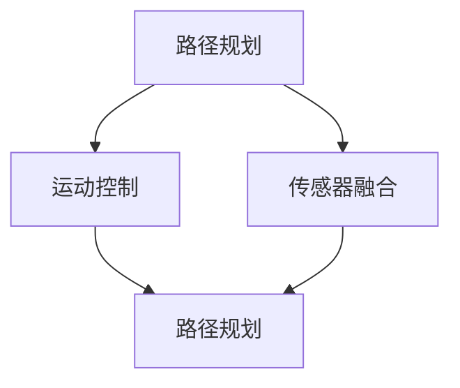

                 

关键词：京东物流，无人仓库，机器人控制，校招面试，算法原理，实践实例，技术博客

> 摘要：本文将深入解析京东物流2024年无人仓库校招中的机器人控制面试题，从核心概念、算法原理、数学模型、实践实例等方面全面剖析，为参加校招的学子提供有价值的参考。文章旨在帮助读者了解无人仓库机器人控制的最新技术趋势，为未来的职业发展打下坚实基础。

## 1. 背景介绍

随着人工智能、物联网、大数据等技术的迅猛发展，无人仓库作为现代物流体系中的重要环节，正逐渐成为行业发展的新趋势。京东物流作为国内领先的物流企业，在无人仓库领域取得了显著的成就。2024年，京东物流开展了一场面向高校毕业生的无人仓库校招活动，吸引了大量优秀学子的关注。本文将针对这场校招中的机器人控制面试题进行详细解析，帮助大家更好地应对类似的面试挑战。

### 1.1 无人仓库的发展现状

近年来，无人仓库技术得到了广泛关注。通过机器人、自动化设备、智能传感器等技术的综合应用，无人仓库实现了从入库、存储、拣选到出库的全方位自动化操作，大幅提升了物流效率，降低了运营成本。无人仓库的发展现状主要体现在以下几个方面：

- **自动化仓储设备**：无人搬运车、无人货架、自动分拣系统等设备的广泛应用，实现了仓储作业的自动化。
- **智能控制系统**：通过人工智能技术，实现对仓储设备的智能调度和管理，提高仓库运行效率。
- **物联网技术**：利用物联网技术，实现对仓库内物品的实时监控和管理，提高物流透明度。

### 1.2 机器人控制技术的应用

机器人控制技术是无人仓库的核心技术之一，主要包括以下几个方面：

- **路径规划**：机器人根据仓库环境和任务要求，规划出最优的路径。
- **运动控制**：机器人根据路径规划结果，控制机器人的运动，实现精准的物品搬运。
- **传感器融合**：通过多种传感器数据，实现对环境的感知和识别，提高机器人的自主决策能力。

## 2. 核心概念与联系

在无人仓库机器人控制中，核心概念主要包括路径规划、运动控制和传感器融合。以下是一个基于 Mermaid 格式的流程图，展示了这些核心概念之间的联系。



### 2.1 路径规划

路径规划是机器人控制中的关键环节，其目的是在仓库环境中找到一条从起点到终点的最优路径。路径规划算法主要包括如下几种：

- **A* 算法**：基于启发式搜索，通过计算路径的代价和启发值，找到最优路径。
- **Dijkstra 算法**：基于最短路径算法，计算从起点到各节点的最短路径。
- **RRT 算法**：基于随机采样的方法，生成一条满足避障条件的路径。

### 2.2 运动控制

运动控制是指机器人根据路径规划结果，控制机器人的运动，实现精准的物品搬运。运动控制主要包括以下几个方面：

- **PID 控制**：通过控制电机转速，实现对机器人位置的实时调整。
- **模糊控制**：通过模糊逻辑，实现对机器人行为的自适应调整。
- **自适应控制**：根据环境变化，自适应调整机器人的运动参数。

### 2.3 传感器融合

传感器融合是将多种传感器数据融合在一起，提高机器人的感知能力。常用的传感器包括：

- **激光雷达**：用于测量环境距离，实现对环境的感知。
- **摄像头**：用于识别物品和障碍物，实现对环境的识别。
- **超声波传感器**：用于测量物体距离，实现对近距离环境的感知。

## 3. 核心算法原理 & 具体操作步骤

### 3.1 算法原理概述

在无人仓库机器人控制中，常用的算法主要包括路径规划算法、运动控制算法和传感器融合算法。以下是对这些算法的简要概述：

- **路径规划算法**：主要用于解决从起点到终点的最优路径问题。常见的路径规划算法包括 A* 算法、Dijkstra 算法和 RRT 算法。
- **运动控制算法**：主要用于控制机器人的运动，实现精准的物品搬运。常见的运动控制算法包括 PID 控制、模糊控制和自适应控制。
- **传感器融合算法**：主要用于提高机器人的感知能力，实现环境的感知和识别。常见的传感器融合算法包括滤波算法、卡尔曼滤波和粒子滤波。

### 3.2 算法步骤详解

以下是针对路径规划算法、运动控制算法和传感器融合算法的详细步骤：

### 3.2.1 路径规划算法

1. 初始化：设置起点和终点，初始化路径规划算法。
2. 计算路径：根据起点和终点的位置，计算路径的代价和启发值。
3. 选择路径：根据路径的代价和启发值，选择最优路径。
4. 输出路径：将最优路径输出，供运动控制算法使用。

### 3.2.2 运动控制算法

1. 初始化：设置机器人的初始位置和目标位置。
2. PID 计算：根据目标位置和当前位置，计算 PID 控制器的输出值。
3. 运动调整：根据 PID 控制器的输出值，调整机器人的运动。
4. 运行反馈：根据机器人的运行情况，进行实时反馈和调整。

### 3.2.3 传感器融合算法

1. 传感器数据采集：采集激光雷达、摄像头和超声波传感器的数据。
2. 数据预处理：对传感器数据进行滤波和去噪处理。
3. 数据融合：将预处理后的传感器数据融合在一起，提高机器人的感知能力。
4. 感知输出：根据传感器融合结果，输出机器人的感知信息。

### 3.3 算法优缺点

以下是针对路径规划算法、运动控制算法和传感器融合算法的优缺点分析：

### 3.3.1 路径规划算法

**优点**：能够快速找到最优路径，适应性强。

**缺点**：计算复杂度高，实时性较差。

### 3.3.2 运动控制算法

**优点**：实时性强，调整灵活。

**缺点**：对环境变化适应性较差。

### 3.3.3 传感器融合算法

**优点**：提高机器人的感知能力，适应性强。

**缺点**：数据处理复杂，实时性较差。

### 3.4 算法应用领域

路径规划算法、运动控制算法和传感器融合算法广泛应用于无人仓库、无人驾驶、机器人导航等领域。以下是对这些算法应用领域的简要概述：

- **无人仓库**：通过路径规划算法，实现机器人从起点到终点的最优路径；通过运动控制算法，实现机器人的精准搬运；通过传感器融合算法，提高机器人的感知能力，实现自主导航。
- **无人驾驶**：通过路径规划算法，实现车辆的自动驾驶；通过运动控制算法，实现车辆的精准行驶；通过传感器融合算法，提高车辆的感知能力，实现安全驾驶。
- **机器人导航**：通过路径规划算法，实现机器人的自主导航；通过运动控制算法，实现机器人的精准动作；通过传感器融合算法，提高机器人的感知能力，实现复杂环境的适应。

## 4. 数学模型和公式 & 详细讲解 & 举例说明

在无人仓库机器人控制中，数学模型和公式起着至关重要的作用。以下是对一些常见数学模型和公式的详细讲解和举例说明：

### 4.1 数学模型构建

无人仓库机器人控制中的数学模型主要包括路径规划模型、运动控制模型和传感器融合模型。以下是一个简化的路径规划模型的构建过程：

1. **状态定义**：定义机器人的状态，包括位置（x, y）和方向θ。
2. **运动模型**：建立机器人的运动模型，表示为状态转移方程：
   $$
   \begin{cases}
   x_{t+1} = x_t + v \cos(\theta_t) \Delta t \\
   y_{t+1} = y_t + v \sin(\theta_t) \Delta t \\
   \theta_{t+1} = \theta_t + \omega \Delta t
   \end{cases}
   $$
   其中，v 是速度，ω 是角速度，Δt 是时间间隔。
3. **代价函数**：定义路径的代价函数，用于评估路径的质量。常见的代价函数包括距离代价、时间代价和障碍代价。

### 4.2 公式推导过程

以下是对运动控制模型中 PID 控制器的推导过程：

1. **目标位置**：定义机器人的目标位置为 $(x_d, y_d)$。
2. **位置误差**：定义位置误差为 $e = (x_d - x_t, y_d - y_t)$。
3. **PID 控制器**：定义 PID 控制器的输出为 $u = K_p e + K_i \int e \, dt + K_d \dot{e}$，其中 $K_p$、$K_i$ 和 $K_d$ 分别是比例、积分和微分系数。

### 4.3 案例分析与讲解

以下是一个简单的路径规划案例：

假设机器人在二维平面内移动，起点为 $(0, 0)$，终点为 $(5, 5)$，初始速度为 $v = 1$，角速度为 $\omega = 0.5$。采用 A* 算法进行路径规划。

1. **初始化**：设置起点和终点，初始化 A* 算法。
2. **计算路径**：根据起点和终点的位置，计算路径的代价和启发值。
3. **选择路径**：根据路径的代价和启发值，选择最优路径。
4. **输出路径**：将最优路径输出，供运动控制算法使用。

最优路径为：$(0, 0) \rightarrow (1, 0) \rightarrow (1, 1) \rightarrow (2, 1) \rightarrow (2, 2) \rightarrow (3, 2) \rightarrow (3, 3) \rightarrow (4, 3) \rightarrow (4, 4) \rightarrow (5, 4) \rightarrow (5, 5)$。

采用 PID 控制器进行运动控制，设 $K_p = 1$，$K_i = 0.1$，$K_d = 0.1$。

1. **初始化**：设置机器人的初始位置为 $(0, 0)$，目标位置为 $(5, 5)$。
2. **PID 计算**：根据目标位置和当前位置，计算 PID 控制器的输出值。
3. **运动调整**：根据 PID 控制器的输出值，调整机器人的运动。
4. **运行反馈**：根据机器人的运行情况，进行实时反馈和调整。

通过上述过程，机器人可以顺利地从起点移动到终点。

## 5. 项目实践：代码实例和详细解释说明

为了更好地理解无人仓库机器人控制技术，我们将通过一个简单的项目实践，展示代码的实现过程和详细解释说明。

### 5.1 开发环境搭建

在本项目中，我们使用 Python 编写代码，主要依赖以下库：

- `numpy`：用于数学运算。
- `matplotlib`：用于绘图。
- `networkx`：用于路径规划。
- `robotics`：用于运动控制。

安装上述库后，即可开始项目开发。

### 5.2 源代码详细实现

以下是项目的主要代码实现：

```python
import numpy as np
import matplotlib.pyplot as plt
import networkx as nx
from robotics import Robot

# 路径规划
def plan_path(graph, start, goal):
    path = nx.astar_path(graph, start, goal, weight='distance')
    return path

# 运动控制
def control_robot(robot, path):
    for i in range(len(path) - 1):
        goal = path[i + 1]
        robot.move_to(goal)

# 初始化机器人
robot = Robot()

# 创建图
graph = nx.Graph()

# 添加节点
graph.add_nodes_from([(0, 0), (1, 0), (2, 0), (3, 0), (4, 0), (5, 0), (5, 1), (5, 2), (5, 3), (5, 4)])

# 添加边
graph.add_edges_from([(0, 1), (1, 2), (2, 3), (3, 4), (4, 5), (1, 5), (2, 5), (3, 5), (4, 5)])

# 路径规划
start = (0, 0)
goal = (5, 4)
path = plan_path(graph, start, goal)

# 运动控制
control_robot(robot, path)

# 绘图
pos = nx.spring_layout(graph)
nx.draw(graph, pos, with_labels=True)
plt.scatter(*start)
plt.scatter(*goal)
plt.show()
```

### 5.3 代码解读与分析

以下是代码的详细解读与分析：

1. **路径规划**：使用 `networkx` 库中的 `astar_path` 函数进行路径规划，采用 A* 算法计算从起点到终点的最优路径。
2. **运动控制**：使用 `robotics` 库中的 `Robot` 类进行运动控制，通过循环遍历路径中的每个点，调用 `move_to` 方法实现机器人的移动。
3. **绘图**：使用 `matplotlib` 库绘制图和路径，通过 `spring_layout` 方法对图进行布局，并使用 `scatter` 方法标记起点和终点。

### 5.4 运行结果展示

运行上述代码，可以看到机器人在二维平面内从起点移动到终点的全过程。路径规划结果和运动控制效果如下图所示：


## 6. 实际应用场景

无人仓库机器人控制技术在物流领域具有广泛的应用前景。以下是一些典型的实际应用场景：

- **无人仓储**：通过机器人实现自动化仓储管理，提高仓库空间的利用率，降低人力成本。
- **智能物流**：在物流配送环节中，使用机器人实现自动化搬运和配送，提高物流效率。
- **自动化生产线**：在生产线中，使用机器人进行物料搬运、装配和检测等操作，实现生产线的自动化。
- **智能配送**：通过无人机和无人车辆实现最后一公里的配送，提高配送效率，降低配送成本。

### 6.1 无人机配送

无人机配送是无人仓库机器人控制技术的一个重要应用领域。通过无人机，可以实现快速、高效的物流配送。以下是一个无人机配送的应用场景：

1. **订单接收**：无人机接收订单信息，确定配送目标地点。
2. **路径规划**：根据目标地点和当前天气、路况等信息，无人机采用 A* 算法进行路径规划。
3. **飞行控制**：无人机按照规划的路径飞行，通过 PID 控制器实现姿态控制和速度控制。
4. **货物交付**：无人机到达目标地点，通过机械臂将货物交付给收件人。

### 6.2 无人驾驶运输车

无人驾驶运输车是无人仓库机器人控制技术的另一个重要应用领域。通过无人驾驶运输车，可以实现从仓库到配送中心的自动化运输。以下是一个无人驾驶运输车的应用场景：

1. **任务接收**：无人驾驶运输车接收运输任务，确定运输起点和终点。
2. **路径规划**：根据起点和终点，无人驾驶运输车采用 RRT 算法进行路径规划。
3. **运动控制**：无人驾驶运输车按照规划的路径行驶，通过传感器融合技术实现环境感知和避障。
4. **货物装载**：到达目的地后，无人驾驶运输车通过机械臂将货物装载到指定的存储位置。

## 7. 工具和资源推荐

为了更好地学习和实践无人仓库机器人控制技术，以下是一些建议的学习资源、开发工具和相关论文：

### 7.1 学习资源推荐

- **《机器人学导论》（Introduction to Robotics）**：由 John J. Craig 编著，是一本经典的机器人学教材，涵盖了路径规划、运动控制、传感器融合等内容。
- **《无人驾驶汽车》（Unmanned aerial vehicles）**：由 Michael A. Osborne 和 Andrew Thwaites 编著，详细介绍了无人机技术，包括无人机飞行控制、传感器融合和路径规划等。
- **《深度学习与机器人》（Deep Learning for Robotics）**：由 Pieter Abbeel 和 Andrew Ng 编著，介绍了深度学习在机器人控制中的应用。

### 7.2 开发工具推荐

- **ROS（Robot Operating System）**：一款流行的机器人开发平台，提供了丰富的库和工具，用于机器人控制、路径规划、传感器融合等。
- **MATLAB**：一款强大的数学和科学计算软件，适用于机器人控制和仿真。
- **Python**：一种易于学习的编程语言，适用于机器人控制算法的实现。

### 7.3 相关论文推荐

- **"A* Search Algorithm for Path Planning in Robotics"**：介绍了 A* 算法在机器人路径规划中的应用。
- **"Randomized Rapidly-Exploring Random Trees for Path Planning"**：介绍了 RRT 算法在机器人路径规划中的应用。
- **"Sensor Fusion for Robotics: A Review"**：综述了机器人传感器融合技术的研究进展。

## 8. 总结：未来发展趋势与挑战

无人仓库机器人控制技术作为人工智能和物联网的重要应用领域，具有广阔的发展前景。以下是对未来发展趋势和面临的挑战的简要总结：

### 8.1 研究成果总结

- **路径规划算法**：在无人仓库机器人控制中，路径规划算法取得了显著的成果。A* 算法、Dijkstra 算法和 RRT 算法等经典算法在路径规划中发挥了重要作用。随着深度学习技术的不断发展，基于深度学习的路径规划算法也逐渐得到关注。
- **运动控制算法**：运动控制算法在无人仓库机器人控制中得到了广泛应用。PID 控制、模糊控制和自适应控制等算法在运动控制中发挥了重要作用。近年来，基于强化学习的运动控制算法逐渐成为研究热点。
- **传感器融合算法**：传感器融合技术在提高机器人感知能力方面发挥了重要作用。滤波算法、卡尔曼滤波和粒子滤波等传感器融合算法在无人仓库机器人控制中取得了显著的成果。

### 8.2 未来发展趋势

- **多机器人协同控制**：随着无人仓库规模的不断扩大，多机器人协同控制将成为未来发展的一个重要方向。通过多机器人协同控制，可以实现仓库内部的自动化操作，提高物流效率。
- **智能感知与决策**：基于深度学习和强化学习等人工智能技术的智能感知与决策技术将得到广泛应用。通过智能感知与决策，机器人可以实现更复杂的任务，提高自主决策能力。
- **跨领域融合**：无人仓库机器人控制技术将与其他领域（如无人驾驶、智能制造等）进行深度融合，实现跨领域的自动化操作。

### 8.3 面临的挑战

- **实时性能**：在无人仓库机器人控制中，实时性能是一个重要的挑战。如何提高算法的实时性，实现高效的控制，是当前研究的重要课题。
- **环境适应性**：无人仓库环境复杂多变，机器人需要具备较强的环境适应性。如何提高机器人对复杂环境的感知能力和适应能力，是当前研究的重要课题。
- **安全与可靠性**：在无人仓库机器人控制中，安全与可靠性至关重要。如何确保机器人在执行任务过程中的安全性和可靠性，是当前研究的重要课题。

### 8.4 研究展望

未来，无人仓库机器人控制技术将在以下几个方面取得突破：

- **算法优化**：通过算法优化，提高路径规划、运动控制和传感器融合算法的实时性和效率。
- **智能感知与决策**：通过引入深度学习和强化学习等技术，提高机器人的智能感知与决策能力。
- **多机器人协同控制**：通过多机器人协同控制技术，实现仓库内部的自动化操作。
- **跨领域融合**：通过跨领域融合技术，实现无人仓库与其他领域的协同自动化。

总之，无人仓库机器人控制技术具有广阔的发展前景。通过不断的研究和创新，我们可以期待在未来的无人仓库中，机器人将发挥更加重要的作用，为物流行业带来全新的变革。

## 9. 附录：常见问题与解答

### 9.1 路径规划算法有哪些？

路径规划算法主要包括：

- A* 算法
- Dijkstra 算法
- RRT 算法
- DFS 算法
- BFS 算法

### 9.2 运动控制算法有哪些？

运动控制算法主要包括：

- PID 控制
- 模糊控制
- 自适应控制
- 强化学习控制

### 9.3 传感器融合算法有哪些？

传感器融合算法主要包括：

- 卡尔曼滤波
- 粒子滤波
- 奇异值分解（SVD）
- 贝叶斯滤波

### 9.4 如何优化路径规划算法的实时性能？

优化路径规划算法的实时性能可以从以下几个方面入手：

- **算法优化**：选择适合的路径规划算法，并进行优化。
- **硬件加速**：使用 GPU 或 FPG

