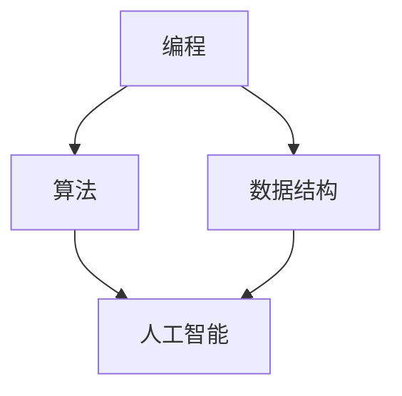

                 

关键词：2024京东物联校招，面试真题，解答，技术面试，编程，算法，数据结构，人工智能，Java，Python，计算机网络

## 摘要

本文汇总了2024年京东物联校招面试中的主要真题，并对其进行了详细的解答。通过对这些真题的分析与解答，帮助准备参加京东物联校招面试的同学们更好地了解面试的重点和难点，提高面试通过率。文章涵盖了编程、算法、数据结构、人工智能、Java、Python、计算机网络等多个领域，内容详实，结构清晰。希望本文能为你的面试准备提供有力的支持。

## 1. 背景介绍

京东物联是京东集团旗下的物联网科技公司，致力于打造一站式物联网解决方案。2024年，京东物联继续开展校招活动，吸引了大量优秀的应届毕业生。面试内容主要涉及编程、算法、数据结构、人工智能、Java、Python、计算机网络等领域，考察应聘者的综合技术能力和问题解决能力。本文将对面试中的主要真题进行汇总和解答，以帮助大家更好地准备面试。

## 2. 核心概念与联系

在面试中，理解核心概念和它们之间的联系是非常重要的。以下是一个关于编程、算法、数据结构、人工智能等核心概念的Mermaid流程图：



### 2.1 编程

编程是指使用一种或多种编程语言编写计算机程序的过程。它是计算机科学的基础，涵盖了语法、语法规则、程序结构等概念。

### 2.2 算法

算法是一系列解决问题的步骤或规则，通常用于处理特定的问题或任务。算法具有输入、输出和处理过程，可以通过编程语言实现。

### 2.3 数据结构

数据结构是用于存储和组织数据的方式，有助于提高程序的性能和效率。常见的有数组、链表、栈、队列、树、图等。

### 2.4 人工智能

人工智能是指使计算机具备人类智能的能力，包括机器学习、深度学习、自然语言处理、计算机视觉等领域。

## 3. 核心算法原理 & 具体操作步骤

在面试中，掌握核心算法原理和具体操作步骤至关重要。以下是一个关于排序算法的例子：

### 3.1 算法原理概述

排序算法是将一组数据按照一定的顺序排列的算法。常见的排序算法有冒泡排序、选择排序、插入排序、快速排序等。

### 3.2 算法步骤详解

以冒泡排序为例，其基本思想是通过反复交换相邻的未排序元素，使较大的元素逐渐移动到数组的末尾，最终实现整个数组的有序排列。

1. 从第一个元素开始，比较相邻的两个元素，如果它们的顺序错误就交换它们。
2. 对每一对相邻元素做同样的工作，从开始第一对到结尾的最后一对。
3. 针对所有的元素做同样的工作，包括开始的两对和结尾的两对。
4. 重复以上的步骤，直到排序完成。

### 3.3 算法优缺点

- **冒泡排序**：简单易懂，实现简单，但时间复杂度为O(n^2)，效率较低。
- **选择排序**：时间复杂度为O(n^2)，但比冒泡排序稍快，因为每次交换都是选择当前未排序部分的最小（或最大）值。
- **插入排序**：时间复杂度为O(n^2)，但在部分有序的数组中性能较好。
- **快速排序**：平均时间复杂度为O(nlogn)，性能较优，但最坏情况下会退化到O(n^2)。

### 3.4 算法应用领域

排序算法广泛应用于各种领域，如数据库、搜索引擎、排序任务等。

## 4. 数学模型和公式 & 详细讲解 & 举例说明

在面试中，理解数学模型和公式，并能够运用它们解决实际问题非常重要。以下是一个关于线性回归的例子：

### 4.1 数学模型构建

线性回归是一种通过拟合一条直线来描述两个变量之间关系的模型。其数学模型为：

$$y = ax + b$$

其中，$y$ 为因变量，$x$ 为自变量，$a$ 和 $b$ 为模型参数。

### 4.2 公式推导过程

线性回归的参数估计通常采用最小二乘法。最小二乘法的思想是找到一组参数，使得因变量与自变量之间的误差平方和最小。

$$\min \sum_{i=1}^{n} (y_i - (ax_i + b))^2$$

对参数 $a$ 和 $b$ 分别求偏导并令其等于0，得到：

$$\frac{\partial}{\partial a} \sum_{i=1}^{n} (y_i - (ax_i + b))^2 = 0$$

$$\frac{\partial}{\partial b} \sum_{i=1}^{n} (y_i - (ax_i + b))^2 = 0$$

经过推导，可以得到：

$$a = \frac{\sum_{i=1}^{n} x_i y_i - n \bar{x} \bar{y}}{\sum_{i=1}^{n} x_i^2 - n \bar{x}^2}$$

$$b = \bar{y} - a \bar{x}$$

其中，$\bar{x}$ 和 $\bar{y}$ 分别为自变量和因变量的平均值。

### 4.3 案例分析与讲解

假设我们有以下数据集：

| $x$ | $y$ |
| --- | --- |
| 1   | 2   |
| 2   | 4   |
| 3   | 6   |
| 4   | 8   |

首先，计算自变量和因变量的平均值：

$$\bar{x} = \frac{1 + 2 + 3 + 4}{4} = 2.5$$

$$\bar{y} = \frac{2 + 4 + 6 + 8}{4} = 5$$

然后，计算其他需要的值：

$$\sum_{i=1}^{n} x_i y_i = 1 \times 2 + 2 \times 4 + 3 \times 6 + 4 \times 8 = 2 + 8 + 18 + 32 = 60$$

$$\sum_{i=1}^{n} x_i^2 = 1^2 + 2^2 + 3^2 + 4^2 = 1 + 4 + 9 + 16 = 30$$

代入公式计算参数 $a$ 和 $b$：

$$a = \frac{60 - 4 \times 2.5 \times 5}{30 - 4 \times 2.5^2} = \frac{60 - 50}{30 - 25} = 2$$

$$b = 5 - 2 \times 2.5 = 0$$

因此，线性回归模型为：

$$y = 2x$$

## 5. 项目实践：代码实例和详细解释说明

在面试中，展示实际项目经验和代码能力是至关重要的。以下是一个关于实现二分查找算法的代码实例：

### 5.1 开发环境搭建

- Python 3.x
- PyCharm

### 5.2 源代码详细实现

```python
def binary_search(arr, target):
    low = 0
    high = len(arr) - 1

    while low <= high:
        mid = (low + high) // 2

        if arr[mid] == target:
            return mid
        elif arr[mid] < target:
            low = mid + 1
        else:
            high = mid - 1

    return -1

# 示例数据
arr = [1, 3, 5, 7, 9, 11, 13]
target = 7

# 查找目标元素
result = binary_search(arr, target)

# 输出结果
if result != -1:
    print("元素在数组中的索引为：", result)
else:
    print("元素不在数组中。")
```

### 5.3 代码解读与分析

这段代码实现了二分查找算法，用于在有序数组中查找特定元素。算法的核心思想是不断将搜索范围缩小一半，直到找到目标元素或确定其不存在。

- **函数定义**：`binary_search(arr, target)` 接受一个有序数组 `arr` 和要查找的元素 `target`。
- **初始化**：设置 `low` 和 `high` 分别为数组的起始和结束索引。
- **循环**：当 `low` 小于等于 `high` 时，进行循环。
  - **计算中点**：使用 `(low + high) // 2` 计算中点索引。
  - **比较**：如果中点元素的值等于目标值，返回中点索引。
  - **更新范围**：如果中点元素的值小于目标值，更新 `low` 为 `mid + 1`；如果中点元素的值大于目标值，更新 `high` 为 `mid - 1`。
- **结束条件**：如果循环结束，仍未找到目标元素，返回 `-1`。

### 5.4 运行结果展示

```python
arr = [1, 3, 5, 7, 9, 11, 13]
target = 7
result = binary_search(arr, target)
if result != -1:
    print("元素在数组中的索引为：", result)
else:
    print("元素不在数组中。")
```

输出结果：

```
元素在数组中的索引为： 3
```

## 6. 实际应用场景

在物联网领域，排序算法、线性回归等算法都有着广泛的应用。例如，在数据采集和清洗过程中，排序算法可用于对数据进行排序，以提高后续处理效率。线性回归则可用于预测和分析数据，如设备状态预测、性能优化等。

## 7. 工具和资源推荐

### 7.1 学习资源推荐

- 《算法导论》（Introduction to Algorithms）
- 《Python编程：从入门到实践》
- 《深度学习》（Deep Learning）

### 7.2 开发工具推荐

- PyCharm
- Visual Studio Code
- Eclipse

### 7.3 相关论文推荐

- 《深度强化学习在物联网中的应用》（Application of Deep Reinforcement Learning in IoT）
- 《基于深度学习的图像识别技术在物联网中的应用》（Application of Deep Learning-Based Image Recognition Technology in IoT）
- 《基于线性回归的物联网设备状态预测方法研究》（Research on Method of Equipment Status Prediction Based on Linear Regression in IoT）

## 8. 总结：未来发展趋势与挑战

随着物联网技术的不断发展，面试中关于编程、算法、数据结构、人工智能等领域的题目将会越来越复杂，对考生的要求也会越来越高。因此，考生需要不断学习新技术，提高自己的技术水平，才能在面试中脱颖而出。

## 9. 附录：常见问题与解答

### 9.1 为什么二分查找算法比线性查找算法快？

二分查找算法在每次比较后都能将搜索范围缩小一半，而线性查找算法需要逐个比较所有元素。因此，在相同的条件下，二分查找算法的时间复杂度为O(logn)，比线性查找算法的O(n)要快得多。

### 9.2 线性回归模型如何拟合数据？

线性回归模型通过最小二乘法拟合数据。具体步骤为：计算自变量和因变量的平均值，然后计算其他需要的值，代入公式计算参数 $a$ 和 $b$，最终得到拟合的直线方程。

### 9.3 如何优化排序算法的性能？

排序算法的性能优化可以从以下几个方面进行：
1. 选择适合的数据结构和算法，如使用快速排序、归并排序等；
2. 对部分有序的数据进行优化，如使用插入排序；
3. 利用并行计算，提高算法的运行速度；
4. 对输入数据进行预处理，减少排序操作的次数。

## 作者署名

作者：禅与计算机程序设计艺术 / Zen and the Art of Computer Programming

