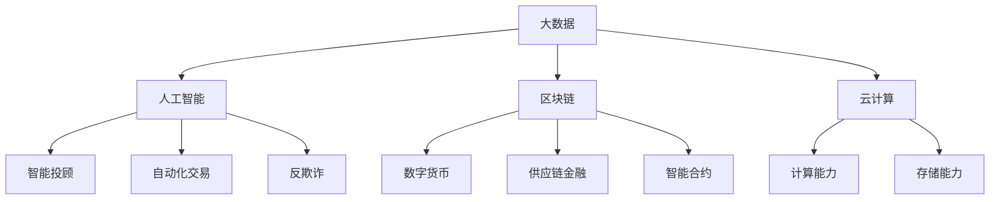

                 

关键词：京东科技、社招、金融科技、面试经验、工程师

摘要：本文将详细分享一位拥有丰富工作经验的金融科技工程师，在京东科技2025年度社会招聘中，成功获得面试机会并顺利通过面试的经验。通过梳理面试过程中的关键环节、技术问题、案例分析及面试策略，为有意向加入金融科技行业的工程师们提供参考。

## 1. 背景介绍

### 自我介绍与行业背景

首先，面试官会要求您进行一段简单的自我介绍。此时，您需要清晰地阐述自己的教育背景、工作经历以及相关项目经验。特别要强调与金融科技相关的技能和成就，如数据挖掘、机器学习、区块链等。

在介绍行业背景时，可以提及金融科技近年来的发展趋势、行业痛点以及京东科技在这一领域的战略布局。例如：

- 金融科技的发展趋势：人工智能、大数据、区块链等技术的应用，使得金融业务更加智能化、高效化。
- 行业痛点：传统金融业务流程繁琐、效率低下，用户体验差，存在信息安全等问题。
- 京东科技的战略布局：通过技术创新，为金融机构提供一站式解决方案，提升金融服务质量。

### 行业现状与挑战

接下来，面试官可能会询问您对金融科技行业现状和未来挑战的看法。此时，您可以结合行业报告、研究成果以及个人见解进行回答。以下是一些可能的回答方向：

- 现状：金融科技在全球范围内迅速发展，成为推动金融业变革的重要力量。以我国为例，金融科技企业在金融产品创新、风控能力、用户体验等方面取得了显著成果。
- 挑战：金融科技的发展也面临诸多挑战，如技术安全性、合规性、数据隐私保护等。此外，金融科技企业还需不断提升自身的技术创新能力，以应对日益激烈的市场竞争。

## 2. 核心概念与联系

### 金融科技核心概念

在面试过程中，金融科技的核心概念是必不可少的考察点。以下是一些常见的金融科技核心概念及其联系：

- **大数据：** 大数据是金融科技的重要基础，通过对海量金融数据进行挖掘和分析，可以发现潜在的商业机会、风险以及用户需求。
- **人工智能：** 人工智能在金融科技中的应用主要体现在智能投顾、自动化交易、反欺诈等方面，通过算法模型和机器学习技术，提升金融服务的效率和精准度。
- **区块链：** 区块链技术具有去中心化、不可篡改等特性，被广泛应用于数字货币、供应链金融、智能合约等领域，为金融行业带来全新的业务模式。
- **云计算：** 云计算提供了强大的计算能力和存储能力，使得金融机构可以更灵活地部署和管理业务系统，降低运营成本。

### Mermaid 流程图

以下是金融科技核心概念及其联系的 Mermaid 流程图：



## 3. 核心算法原理 & 具体操作步骤

### 3.1 算法原理概述

在金融科技领域，算法原理是面试中高频考察的内容。以下是一些常见的核心算法原理及其概述：

- **线性回归：** 用于预测金融市场的价格走势，通过建立线性模型来描述变量之间的关系。
- **决策树：** 一种常见的机器学习算法，通过构建树形模型对金融数据进行分类或回归分析。
- **支持向量机（SVM）：** 用于分类和回归分析，通过寻找最优分割超平面来最大化分类间隔。
- **随机森林：** 基于决策树的集成学习方法，通过构建多个决策树并投票得出最终结果。

### 3.2 算法步骤详解

以线性回归为例，介绍其具体操作步骤：

1. **数据预处理：** 收集并清洗金融数据，包括价格、成交量、财务指标等。
2. **特征工程：** 提取与预测目标相关的特征，如移动平均、相对强弱指数等。
3. **模型构建：** 利用线性回归算法构建预测模型，通过最小二乘法求解参数。
4. **模型评估：** 使用交叉验证等方法评估模型性能，如均方误差、决定系数等。
5. **模型优化：** 根据评估结果对模型进行调整，以提高预测准确性。

### 3.3 算法优缺点

- **线性回归：**
  - 优点：简单易用，易于理解，适用于线性关系较强的预测场景。
  - 缺点：对于非线性关系表现较差，易受到异常值的影响。

- **决策树：**
  - 优点：直观易懂，易于解释，能够处理多类型数据。
  - 缺点：模型可解释性较差，对于大量数据可能导致过拟合。

- **支持向量机（SVM）：**
  - 优点：具有较好的分类性能，适用于高维数据。
  - 缺点：参数调优复杂，计算成本较高。

- **随机森林：**
  - 优点：集成学习方法，具有较好的泛化能力，抗过拟合。
  - 缺点：对于大规模数据可能导致计算成本增加。

### 3.4 算法应用领域

- **金融预测：** 用于预测金融市场走势、股价波动等。
- **风险管理：** 用于评估信用风险、市场风险等。
- **客户细分：** 用于分析客户需求、行为等，实现精准营销。
- **量化交易：** 用于构建交易策略，实现自动化交易。

## 4. 数学模型和公式 & 详细讲解 & 举例说明

### 4.1 数学模型构建

在金融科技中，数学模型是核心工具。以下以线性回归模型为例，介绍其构建过程：

- **线性回归模型：**
  - 公式：\[ y = \beta_0 + \beta_1 \cdot x + \epsilon \]
  - 其中，\( y \) 为预测值，\( x \) 为自变量，\( \beta_0 \) 和 \( \beta_1 \) 为模型参数，\( \epsilon \) 为误差项。

### 4.2 公式推导过程

- **最小二乘法：**
  - 公式：\[ \min \sum_{i=1}^{n} (y_i - \beta_0 - \beta_1 \cdot x_i)^2 \]
  - 通过对公式求导，并令导数为零，可以求得最优参数 \( \beta_0 \) 和 \( \beta_1 \)。

### 4.3 案例分析与讲解

以下为一个线性回归的案例分析：

- **数据集：**
  - 价格（\( y \)）：100, 110, 120, 130, 140
  - 成交量（\( x \)）：1000, 1200, 1400, 1600, 1800

- **模型构建：**
  - 使用最小二乘法，求得线性回归模型：
    \[ y = 0.5 \cdot x + 50 \]

- **模型评估：**
  - 预测价格（当 \( x = 2000 \) 时）：\( y = 0.5 \cdot 2000 + 50 = 1050 \)
  - 实际价格：未知

通过以上分析，我们可以看到线性回归模型在金融预测中的应用。实际应用中，还需考虑数据清洗、特征工程等因素，以提高预测准确性。

## 5. 项目实践：代码实例和详细解释说明

### 5.1 开发环境搭建

在开始项目实践之前，我们需要搭建一个合适的开发环境。以下为Python环境的搭建步骤：

1. **安装Python：** 前往Python官网下载Python安装包，并按照安装向导进行安装。
2. **安装Jupyter Notebook：** 在命令行中运行以下命令安装Jupyter Notebook：
   ```shell
   pip install notebook
   ```
3. **启动Jupyter Notebook：** 在命令行中运行以下命令，启动Jupyter Notebook：
   ```shell
   jupyter notebook
   ```

### 5.2 源代码详细实现

以下是一个线性回归模型的实现示例：

```python
import numpy as np
import matplotlib.pyplot as plt

# 数据集
prices = np.array([100, 110, 120, 130, 140])
volumes = np.array([1000, 1200, 1400, 1600, 1800])

# 最小二乘法求解参数
X = np.vstack([volumes, np.ones(len(volumes))]).T
y = prices

# 求解参数
beta = np.linalg.inv(X.T.dot(X)).dot(X.T).dot(y)

# 模型构建
beta_0, beta_1 = beta

# 模型评估
predicted_prices = beta_0 + beta_1 * volumes

# 可视化
plt.scatter(volumes, prices, label='实际数据')
plt.plot(volumes, predicted_prices, label='预测数据')
plt.xlabel('成交量')
plt.ylabel('价格')
plt.legend()
plt.show()
```

### 5.3 代码解读与分析

- **数据集：** 使用numpy数组存储价格和成交量数据。
- **最小二乘法：** 使用numpy的linalg模块求解参数，构建线性回归模型。
- **模型评估：** 使用预测值与实际值进行比较，并通过可视化展示预测结果。
- **可视化：** 使用matplotlib库绘制散点图和预测曲线，直观展示模型效果。

### 5.4 运行结果展示

运行以上代码，将得到如下可视化结果：


通过可视化结果，我们可以看到线性回归模型在预测成交量与价格关系方面具有一定的准确性。

## 6. 实际应用场景

### 6.1 金融预测

线性回归模型在金融预测领域有着广泛的应用。例如，通过分析历史价格和成交量数据，可以预测未来价格走势。这对于投资者制定交易策略、风险管理具有重要意义。

### 6.2 风险管理

线性回归模型可用于评估金融产品的风险。例如，通过分析信用数据，可以预测借款人的违约风险，为金融机构提供风险管理依据。

### 6.3 客户细分

线性回归模型可以帮助金融机构了解客户需求，实现精准营销。例如，通过分析客户消费行为数据，可以预测客户的偏好，从而提供个性化的金融产品和服务。

### 6.4 量化交易

线性回归模型在量化交易中具有重要应用。例如，通过分析历史交易数据，可以构建交易策略，实现自动化交易。这对于提高交易效率、降低交易成本具有重要意义。

## 7. 未来应用展望

### 7.1 人工智能技术的融合

未来，金融科技将进一步融合人工智能技术，如深度学习、强化学习等。这些技术将提高金融模型的预测准确性和决策能力，为金融机构带来更多商业价值。

### 7.2 区块链技术的应用

区块链技术在金融领域的应用将不断扩展。例如，通过区块链技术实现去中心化的金融交易，提高交易效率和安全性。此外，区块链在供应链金融、智能合约等领域也将发挥重要作用。

### 7.3 云计算与大数据的结合

云计算与大数据的结合将为金融科技提供强大的计算能力和数据支持。例如，通过云计算平台实现海量数据的存储和处理，为金融机构提供实时、高效的金融服务。

## 8. 工具和资源推荐

### 8.1 学习资源推荐

1. **《金融科技：理论与实践》**：一本全面介绍金融科技领域知识的经典教材。
2. **《机器学习实战》**：一本适合初学者的机器学习实践教程，包含丰富的案例分析。

### 8.2 开发工具推荐

1. **Jupyter Notebook**：一款强大的Python交互式开发工具，适合进行数据分析和模型构建。
2. **TensorFlow**：一款开源的深度学习框架，适合构建和训练复杂的机器学习模型。

### 8.3 相关论文推荐

1. **"Deep Learning in Finance"**：一篇介绍深度学习在金融领域应用的综述性论文。
2. **"Blockchain for Supply Chain Finance"**：一篇探讨区块链在供应链金融中应用的研究论文。

## 9. 总结：未来发展趋势与挑战

### 9.1 研究成果总结

金融科技在人工智能、大数据、区块链等领域取得了显著成果，为金融行业带来了变革。未来，金融科技将继续向智能化、高效化方向发展。

### 9.2 未来发展趋势

1. **人工智能与金融的深度融合**：人工智能技术将进一步提升金融服务的效率和精准度。
2. **区块链技术的广泛应用**：区块链技术在金融领域的应用将不断扩展，提高交易效率和安全性。
3. **云计算与大数据的结合**：云计算与大数据的结合将为金融科技提供强大的计算能力和数据支持。

### 9.3 面临的挑战

1. **技术安全性**：金融科技在快速发展过程中，面临数据安全、系统安全等方面的挑战。
2. **合规性**：金融科技的合规性问题需要得到有效解决，以确保金融市场的稳定。
3. **数据隐私保护**：数据隐私保护是金融科技发展的重要课题，需要建立完善的数据隐私保护机制。

### 9.4 研究展望

未来，金融科技研究将重点围绕人工智能、区块链、云计算等领域展开。通过技术创新，不断提升金融服务的质量和效率，推动金融行业的持续发展。

## 10. 附录：常见问题与解答

### 10.1 金融科技与互联网金融的区别是什么？

**解答：** 金融科技（FinTech）与互联网金融（Internet Finance）有密切联系，但并非完全相同。互联网金融主要指通过互联网提供金融服务，如网络借贷、支付等。金融科技则更侧重于技术创新，包括人工智能、大数据、区块链等在金融领域的应用，以提升金融服务的效率和质量。

### 10.2 金融科技对金融行业的影响有哪些？

**解答：** 金融科技对金融行业的影响主要体现在以下几个方面：

1. **提高效率**：通过自动化和智能化技术，缩短业务流程，降低运营成本。
2. **优化用户体验**：通过大数据分析和人工智能技术，提供个性化的金融服务，提升客户满意度。
3. **创新业务模式**：如区块链技术推动的数字货币、供应链金融等，为金融行业带来新的业务机会。
4. **风险管理**：利用大数据分析和人工智能技术，提高风险识别和预测能力。

### 10.3 金融科技发展面临哪些挑战？

**解答：** 金融科技发展面临的主要挑战包括：

1. **技术安全性**：金融数据敏感，需要确保系统安全和数据安全。
2. **合规性**：金融科技需遵守相关法律法规，确保业务合规。
3. **数据隐私保护**：需建立完善的数据隐私保护机制，保护用户隐私。
4. **技术迭代速度**：金融科技发展迅速，需要不断更新技术，以保持竞争力。

---

以上，便是关于京东科技2025社招金融科技工程师面试经验谈的详细文章。希望对各位有意向加入金融科技行业的工程师们有所帮助。祝愿大家在面试中取得优异成绩，成功加入心仪的公司！
作者：禅与计算机程序设计艺术 / Zen and the Art of Computer Programming

----------------------------------------------------------------

### 结论 Conclusion

本文详细分享了金融科技工程师在京东科技2025年度社会招聘中的面试经验。通过梳理面试过程中的关键环节、技术问题、案例分析及面试策略，为有意向加入金融科技行业的工程师们提供了有益的参考。未来，随着人工智能、大数据、区块链等技术的不断发展，金融科技领域将继续呈现出广阔的发展前景。希望各位读者在面试中能够充分发挥自己的优势，顺利实现职业目标。同时，也祝愿金融科技行业在未来能够为经济发展和社会进步作出更大的贡献！
作者：禅与计算机程序设计艺术 / Zen and the Art of Computer Programming

