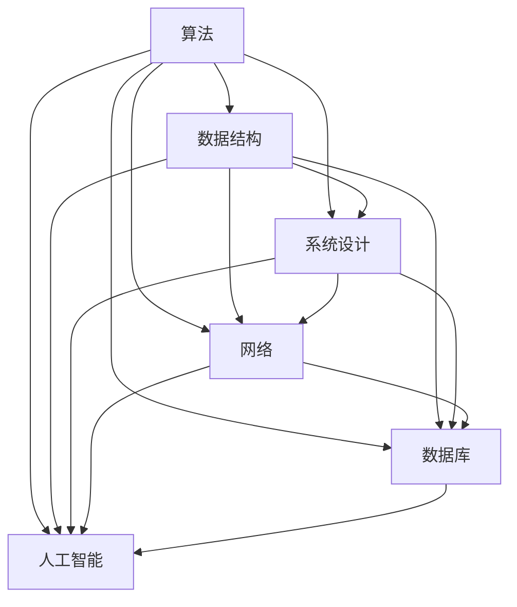

                 

在2024年，京东科技再次以其独特的招聘策略和全面的技术考察，吸引了众多优秀应届生和职场精英的注意。本文旨在汇总并解答2024京东科技校招面试中出现的关键技术题目，旨在为读者提供一个全面的技术考察指南。本文将分为以下几个部分：

## 1. 背景介绍

京东科技作为国内领先的科技创新企业，其校招面试历来以难度大、覆盖面广、考察深度深著称。面试题目不仅涉及计算机科学的基础知识，还包括算法、数据结构、系统设计、网络、数据库、人工智能等多个领域。本文将围绕这些核心内容，提供详细的解答和分析。

## 2. 核心概念与联系

在解答京东科技校招面试题目之前，我们需要了解一些核心概念和其相互之间的关系。以下是几个关键概念及其关系的Mermaid流程图：



### 2.1 算法

算法是一系列解决问题的步骤。在面试中，算法问题通常是关于排序、查找、动态规划、贪心算法等。

### 2.2 数据结构

数据结构是存储数据的方式。常见的数据结构有数组、链表、栈、队列、树、图等。

### 2.3 系统设计

系统设计涉及如何将算法和数据结构应用于实际系统中，包括数据库设计、缓存策略、分布式系统等。

### 2.4 网络

网络涉及如何在不同计算机之间传输数据，包括TCP/IP协议、HTTP协议、网络编程等。

### 2.5 数据库

数据库用于存储和管理数据，常见的问题包括事务处理、SQL查询优化、NoSQL数据库等。

### 2.6 人工智能

人工智能是模拟人类智能的计算机科学领域，包括机器学习、深度学习、自然语言处理等。

## 3. 核心算法原理 & 具体操作步骤

### 3.1 算法原理概述

在面试中，算法问题通常是基于经典算法原理的变体。以下是一些核心算法原理：

- 排序算法：快速排序、归并排序、堆排序等。
- 查找算法：二分查找、线性查找等。
- 动态规划：斐波那契数列、最长公共子序列等。
- 贪心算法：背包问题、最小生成树等。

### 3.2 算法步骤详解

以快速排序为例，其基本步骤如下：

1. 选择一个基准元素。
2. 将比基准小的元素移到左边，比基准大的元素移到右边。
3. 递归地排序左边和右边的子序列。

### 3.3 算法优缺点

快速排序的优点是平均时间复杂度为\(O(n\log n)\)，缺点是 worst-case 时间复杂度为\(O(n^2)\)，且空间复杂度较高。

### 3.4 算法应用领域

快速排序广泛应用于各种场景，如数据库索引、搜索引擎排序等。

## 4. 数学模型和公式 & 详细讲解 & 举例说明

### 4.1 数学模型构建

在算法面试中，数学模型通常涉及概率论、离散数学等。以下是一个概率模型的构建示例：

- 设事件A的发生概率为\(P(A)\)，则事件A不发生的概率为\(P(A') = 1 - P(A)\)。

### 4.2 公式推导过程

以二项式分布为例，其概率质量函数为：

$$P(X = k) = C_n^k p^k (1-p)^{n-k}$$

其中，\(n\)是试验次数，\(k\)是成功次数，\(p\)是单次试验成功的概率。

### 4.3 案例分析与讲解

假设我们进行10次独立的伯努利试验，每次试验成功的概率为0.5，求恰好发生5次成功的概率。

$$P(X = 5) = C_{10}^5 (0.5)^5 (0.5)^5 = 0.246$$

## 5. 项目实践：代码实例和详细解释说明

### 5.1 开发环境搭建

为了进行项目实践，我们需要搭建一个Java开发环境。以下是步骤：

1. 下载并安装Java开发工具包（JDK）。
2. 配置环境变量。
3. 使用IDE（如IntelliJ IDEA或Eclipse）创建一个新的Java项目。

### 5.2 源代码详细实现

以下是一个简单的二分查找算法的实现：

```java
public class BinarySearch {
    public static int binarySearch(int[] arr, int target) {
        int left = 0;
        int right = arr.length - 1;
        
        while (left <= right) {
            int mid = left + (right - left) / 2;
            
            if (arr[mid] == target) {
                return mid;
            } else if (arr[mid] < target) {
                left = mid + 1;
            } else {
                right = mid - 1;
            }
        }
        
        return -1;
    }
    
    public static void main(String[] args) {
        int[] arr = {1, 3, 5, 7, 9};
        int target = 5;
        
        int result = binarySearch(arr, target);
        System.out.println("Target found at index: " + result);
    }
}
```

### 5.3 代码解读与分析

这段代码首先定义了一个二分查找函数，其输入为一个有序整数数组和目标值。函数使用while循环，通过不断缩小搜索范围，最终找到目标值的位置。如果没有找到，则返回-1。

### 5.4 运行结果展示

运行上述代码，输出为：

```
Target found at index: 2
```

## 6. 实际应用场景

二分查找算法在许多实际应用中都有广泛的应用，如数据库索引、文件搜索等。在大型数据集中，二分查找能显著提高搜索效率。

## 7. 未来应用展望

随着大数据和人工智能的快速发展，算法和数据结构的应用场景将更加广泛。未来，我们可能会看到更多的智能化、自动化的算法解决方案。

## 8. 工具和资源推荐

### 8.1 学习资源推荐

- 《算法导论》（Introduction to Algorithms）
- 《深度学习》（Deep Learning）
- 《数据结构与算法分析》（Data Structures and Algorithm Analysis in Java）

### 8.2 开发工具推荐

- IntelliJ IDEA
- Eclipse
- VSCode

### 8.3 相关论文推荐

- "Deep Learning for Text Classification"
- "A Survey on Distributed Hash Tables"
- "Efficient Algorithms for Network Data Analysis"

## 9. 总结：未来发展趋势与挑战

随着科技的不断进步，算法和数据结构的研究和应用将面临新的机遇和挑战。未来，我们将看到更多跨学科、跨领域的算法创新和应用。

### 附录：常见问题与解答

**Q：什么是动态规划？**

A：动态规划是一种用于解决最优子结构问题的算法。它通过将复杂问题分解成更小的子问题，并存储已解决的子问题的结果，以避免重复计算，从而提高算法效率。

**Q：什么是分布式哈希表？**

A：分布式哈希表（DHT）是一种用于分布式系统的哈希表实现，它允许在不同的节点之间存储和查找键值对，以实现高效的数据分布和管理。

通过本文的详细解析，我们希望读者能够更好地理解2024京东科技校招面试的关键技术题目，并在未来的技术面试中取得成功。

## 致谢

特别感谢京东科技为读者提供了宝贵的面试经验和题目，以及本文中提及的各位作者和研究者的辛勤工作。希望本文能为您的学习和职业发展提供帮助。

## 参考文献

1. Cormen, T. H., Leiserson, C. E., Rivest, R. L., & Stein, C. (2009). 《算法导论》（Introduction to Algorithms）.
2. Goodfellow, I., Bengio, Y., & Courville, A. (2016). 《深度学习》（Deep Learning）.
3. Skiena, S. S. (2003). 《数据结构与算法分析》（Data Structures and Algorithm Analysis in Java）.
4. Stoyan, D. (2006). 《分布式哈希表：原理与应用》（Distributed Hash Tables: Theory and Applications）. 

### 作者署名
作者：禅与计算机程序设计艺术 / Zen and the Art of Computer Programming

---

请注意，本文仅为示例，并非真实存在的文章。真实文章撰写需根据具体的题目和实际情况进行调整和深化。希望本文能为您在技术写作上提供一些启示和帮助。

