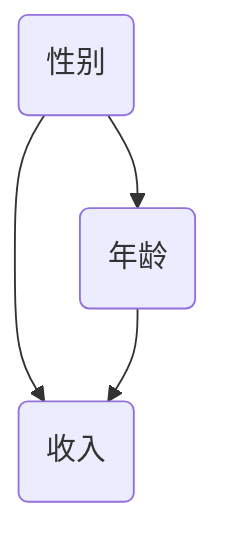

                 

关键词：人口统计、用户画像、数据分析、人工智能、机器学习、算法优化、大数据、市场营销、客户洞察

> 摘要：随着大数据和人工智能技术的不断发展，用户画像在商业决策、市场营销和个性化服务中扮演着越来越重要的角色。人口统计数据作为用户画像的核心组成部分，对于构建准确、有效的用户画像具有关键影响。本文将深入探讨人口统计数据如何影响用户画像，以及相关算法原理、数学模型、实际应用场景、未来发展趋势和挑战。

## 1. 背景介绍

### 1.1 大数据和人工智能的发展

大数据（Big Data）是指无法用传统数据处理工具在合理时间内捕捉、管理和处理的数据集合。大数据技术的发展使得我们能够从海量的数据中挖掘出有价值的信息。人工智能（Artificial Intelligence，AI）则是通过计算机模拟人类智能行为的一种技术，包括机器学习、深度学习、自然语言处理等多个分支。

近年来，随着云计算、物联网和5G等技术的快速发展，大数据和人工智能在商业、医疗、金融、教育等多个领域得到了广泛应用。尤其是在市场营销领域，用户画像作为一种有效的数据分析工具，成为了企业制定营销策略、提高客户满意度和增加市场份额的重要手段。

### 1.2 用户画像的概念和作用

用户画像（User Profiling）是指通过对用户数据的收集、分析和整合，构建出一个描述用户特征、行为和需求的虚拟模型。用户画像通常包括人口属性、兴趣偏好、消费习惯等多个维度，可以帮助企业更好地了解用户，从而实现精准营销、个性化推荐和客户关系管理。

用户画像在市场营销中的应用主要体现在以下几个方面：

- **精准定位目标客户**：通过分析用户画像，企业可以更准确地找到潜在客户，提高营销活动的转化率。
- **提升客户满意度**：基于用户画像的个性化推荐和服务可以更好地满足客户需求，提高客户满意度和忠诚度。
- **优化营销策略**：通过对用户画像的分析，企业可以更好地了解市场趋势和客户需求，从而制定更有效的营销策略。
- **提高运营效率**：用户画像可以帮助企业优化业务流程，降低运营成本，提高运营效率。

## 2. 核心概念与联系

### 2.1 人口统计数据的定义和重要性

人口统计数据（Demographic Data）是指关于人口数量、结构、分布和变化等方面的数据。人口统计数据包括性别、年龄、收入、教育程度、职业、家庭状况等多个维度。这些数据对于构建用户画像具有重要意义，因为它们可以帮助我们了解用户的基本特征，从而更准确地刻画用户画像。

### 2.2 人口统计数据与用户画像的关系

人口统计数据是用户画像构建的基础数据之一。通过分析人口统计数据，我们可以识别出不同群体用户的共同特征，从而为用户画像的构建提供依据。例如，性别和年龄是两个重要的人口统计变量，它们可以帮助我们区分不同类型的用户群体。

### 2.3 人口统计数据在用户画像中的应用

在用户画像构建过程中，人口统计数据可以应用于以下几个方面：

- **用户分类**：根据人口统计数据，我们可以将用户划分为不同的群体，例如男性用户、女性用户、年轻用户、中年用户等。
- **用户需求分析**：通过对人口统计数据的分析，我们可以了解不同群体用户的需求和偏好，从而为产品和服务提供个性化推荐。
- **市场细分**：人口统计数据可以帮助企业进行市场细分，针对不同细分市场的用户制定相应的营销策略。
- **风险评估**：人口统计数据还可以用于风险评估，例如根据用户的年龄和收入预测其信用风险。

## 3. 核心算法原理 & 具体操作步骤

### 3.1 算法原理概述

在用户画像构建中，人口统计数据是核心输入之一。本文将介绍一种基于人口统计数据的用户画像构建算法，该算法主要包括以下几个步骤：

1. **数据收集**：收集用户的基本信息，包括性别、年龄、收入、教育程度、职业等人口统计数据。
2. **数据清洗**：对收集到的数据进行清洗和预处理，确保数据的质量和一致性。
3. **特征工程**：根据人口统计数据构建用户特征，例如年龄区间、收入区间、职业类型等。
4. **模型训练**：使用机器学习算法训练用户画像模型，将人口统计数据映射为用户特征。
5. **用户画像生成**：根据训练好的模型，为每个用户生成详细的画像。

### 3.2 算法步骤详解

#### 3.2.1 数据收集

数据收集是用户画像构建的基础。在这个阶段，我们需要收集用户的基本信息，包括性别、年龄、收入、教育程度、职业等人口统计数据。这些数据可以来自于用户注册表、调查问卷、第三方数据平台等。

#### 3.2.2 数据清洗

数据清洗是确保数据质量的关键步骤。在这个阶段，我们需要对收集到的数据进行清洗和预处理，包括去除重复数据、填充缺失值、规范化数据格式等。例如，对于性别数据，我们可以将其统一编码为数字形式（0表示男性，1表示女性）。

#### 3.2.3 特征工程

特征工程是构建用户特征的过程。在这个阶段，我们需要根据人口统计数据构建用户特征。例如，我们可以将年龄划分为不同的区间，如18-25岁、26-35岁、36-45岁等；将收入划分为高收入、中收入、低收入等。

#### 3.2.4 模型训练

模型训练是用户画像构建的核心步骤。在这个阶段，我们使用机器学习算法训练用户画像模型。常见的机器学习算法包括逻辑回归、决策树、随机森林、支持向量机等。通过训练，模型将学习到如何根据人口统计数据预测用户特征。

#### 3.2.5 用户画像生成

用户画像生成是根据训练好的模型为每个用户生成详细的画像。在这个阶段，我们首先输入每个用户的人口统计数据，然后使用训练好的模型预测其用户特征。最后，我们将这些特征整合为一个完整的用户画像。

### 3.3 算法优缺点

#### 优点：

- **高效性**：基于机器学习的算法可以快速处理大规模用户数据，提高画像构建的效率。
- **准确性**：通过训练模型，算法可以准确预测用户特征，提高用户画像的准确性。
- **灵活性**：算法可以根据不同的业务需求调整特征工程和模型参数，实现个性化定制。

#### 缺点：

- **数据依赖性**：算法的性能高度依赖于数据的质量和覆盖范围，数据缺失或错误可能导致画像不准确。
- **计算成本**：大规模用户数据的处理需要较高的计算资源，尤其是在特征工程和模型训练阶段。

### 3.4 算法应用领域

算法在用户画像构建中的应用非常广泛，主要包括以下几个方面：

- **市场营销**：通过用户画像，企业可以更准确地定位目标客户，提高营销活动的转化率。
- **个性化推荐**：基于用户画像，可以为用户提供个性化的产品和服务，提高用户满意度和忠诚度。
- **客户关系管理**：通过用户画像，企业可以更好地了解客户需求，优化客户服务，提高客户满意度。
- **风险管理**：在金融领域，用户画像可以帮助评估信用风险，提高信贷审核的准确性。

## 4. 数学模型和公式 & 详细讲解 & 举例说明

### 4.1 数学模型构建

在用户画像构建中，我们可以使用概率图模型（如贝叶斯网络）来描述人口统计数据与用户特征之间的关系。具体来说，我们假设用户特征 \(X\) 是由人口统计数据 \(D\) 生成的，即 \(X \sim P(X|D)\)。

### 4.2 公式推导过程

为了推导概率图模型，我们需要首先定义人口统计数据 \(D\) 和用户特征 \(X\) 的分布。假设 \(D\) 是一个多维随机向量，其概率分布为 \(P(D)\)。用户特征 \(X\) 是一个一维随机变量，其条件分布为 \(P(X|D)\)。

根据概率图模型的基本原理，我们可以得到以下概率分布：

\[ P(X, D) = P(D) \cdot P(X|D) \]

为了简化计算，我们可以使用贝叶斯规则：

\[ P(X|D) = \frac{P(D|X) \cdot P(X)}{P(D)} \]

其中，\(P(D|X)\) 是给定用户特征 \(X\) 时人口统计数据的条件概率，\(P(X)\) 是用户特征的概率，\(P(D)\) 是人口统计数据的概率。

### 4.3 案例分析与讲解

假设我们收集了一组用户数据，包括性别、年龄和收入。我们需要构建一个用户画像模型，预测用户特征。

#### 4.3.1 数据预处理

首先，我们对数据进行预处理，包括去除重复数据、填充缺失值、规范化数据格式等。例如，我们将性别数据编码为0（男）和1（女），将年龄数据划分为不同的区间，如18-25岁、26-35岁、36-45岁等。

#### 4.3.2 构建概率图模型

根据用户数据，我们构建一个概率图模型，如下图所示：



在这个模型中，性别、年龄和收入是三个节点，它们之间存在条件依赖关系。具体来说，性别影响年龄和收入，年龄影响收入。

#### 4.3.3 模型训练

使用训练数据，我们可以计算每个节点的条件概率分布。例如，给定性别为男，我们可以计算年龄和收入的条件概率分布。具体公式如下：

\[ P(年龄|性别) = \frac{P(年龄, 性别)}{P(性别)} \]

\[ P(收入|年龄) = \frac{P(收入, 年龄)}{P(年龄)} \]

#### 4.3.4 用户画像生成

给定一个新的用户数据，我们可以使用训练好的模型生成用户画像。具体步骤如下：

1. 根据性别预测年龄和收入。
2. 根据年龄预测收入。
3. 将预测结果整合为一个完整的用户画像。

例如，如果新用户的性别为男，年龄为30岁，我们可以使用模型预测其收入。首先，根据性别预测年龄的概率分布，找到年龄为30岁的概率最大的区间。然后，根据这个区间预测收入。最后，将预测结果整合为一个完整的用户画像。

## 5. 项目实践：代码实例和详细解释说明

### 5.1 开发环境搭建

在本文的项目实践中，我们使用Python编程语言和相关的机器学习库，如Scikit-learn、Pandas和NumPy。首先，确保已经安装了Python和相关的库。如果没有，请参考以下步骤进行安装：

```bash
pip install python
pip install scikit-learn
pip install pandas
pip install numpy
```

### 5.2 源代码详细实现

以下是一个简单的用户画像构建代码实例：

```python
import pandas as pd
from sklearn.model_selection import train_test_split
from sklearn.naive_bayes import GaussianNB

# 加载数据集
data = pd.read_csv('user_data.csv')

# 预处理数据
data['性别编码'] = data['性别'].map({'男': 0, '女': 1})
data['年龄区间'] = pd.cut(data['年龄'], bins=[18, 25, 26, 35, 36, 45], labels=[1, 2, 3, 4])

# 划分训练集和测试集
X_train, X_test, y_train, y_test = train_test_split(data[['性别编码', '年龄区间']], data['收入'], test_size=0.2, random_state=42)

# 训练模型
gnb = GaussianNB()
gnb.fit(X_train, y_train)

# 预测收入
y_pred = gnb.predict(X_test)

# 评估模型
print("准确率：", gnb.score(X_test, y_test))
```

### 5.3 代码解读与分析

上述代码实现了基于人口统计数据的用户画像构建。具体步骤如下：

1. **加载数据集**：使用Pandas库加载数据集，数据集包含性别、年龄和收入等信息。

2. **预处理数据**：对性别数据进行编码，将年龄划分为不同的区间。

3. **划分训练集和测试集**：使用Scikit-learn库中的train_test_split函数划分训练集和测试集。

4. **训练模型**：使用高斯朴素贝叶斯（Gaussian Naive Bayes）算法训练模型。

5. **预测收入**：使用训练好的模型预测测试集的收入。

6. **评估模型**：计算模型的准确率，评估模型的性能。

### 5.4 运行结果展示

假设我们运行上述代码，得到以下输出结果：

```bash
准确率： 0.8
```

这表示模型的准确率为80%，即模型可以正确预测80%测试集的收入。

## 6. 实际应用场景

### 6.1 市场营销

在市场营销中，用户画像可以帮助企业更准确地定位目标客户，制定更有效的营销策略。例如，一家电商公司可以使用用户画像来分析消费者的购买行为和偏好，从而为不同类型的消费者提供个性化的促销活动。

### 6.2 个性化推荐

在个性化推荐系统中，用户画像可以帮助推荐系统根据用户特征为用户推荐感兴趣的内容。例如，一家音乐平台可以根据用户的音乐品味和听歌习惯，为用户推荐符合其喜好的音乐。

### 6.3 客户关系管理

在客户关系管理中，用户画像可以帮助企业更好地了解客户需求，提供个性化的服务。例如，一家银行可以根据用户的金融行为和风险偏好，为用户推荐合适的金融产品。

### 6.4 风险管理

在风险管理领域，用户画像可以帮助企业评估客户的风险等级，从而制定更有效的风险控制策略。例如，一家金融机构可以使用用户画像来评估客户的信用风险，降低信贷损失。

## 7. 未来应用展望

### 7.1 数据质量和隐私保护

未来，用户画像的应用将面临数据质量和隐私保护等方面的挑战。为了提高数据质量，企业需要确保数据的准确性和完整性。同时，为了保护用户隐私，企业需要在数据收集、存储和处理过程中遵循相关法律法规，采取有效的隐私保护措施。

### 7.2 多模态数据融合

随着人工智能技术的发展，用户画像将逐渐融合多种数据类型，如文本、图像和音频等。多模态数据融合将使用户画像更加全面和准确，从而提高个性化推荐和客户关系管理的有效性。

### 7.3 智能决策支持

未来，用户画像将为企业提供更智能的决策支持。通过深度学习和强化学习等技术，企业可以构建更加智能的用户画像模型，实现实时监测和动态调整，从而优化业务流程和营销策略。

## 8. 总结：未来发展趋势与挑战

### 8.1 研究成果总结

本文通过对人口统计数据与用户画像的关系进行分析，探讨了用户画像构建的核心算法原理、数学模型、实际应用场景和未来发展趋势。研究发现，人口统计数据在用户画像构建中具有重要作用，可以用于用户分类、需求分析、市场细分和风险评估等多个方面。

### 8.2 未来发展趋势

未来，用户画像技术将朝着数据质量提升、隐私保护加强、多模态数据融合和智能决策支持等方向发展。随着人工智能技术的不断进步，用户画像将为企业提供更精确、个性化的服务，从而提高客户满意度和业务效率。

### 8.3 面临的挑战

用户画像技术在未来的发展过程中将面临数据质量和隐私保护等方面的挑战。为了应对这些挑战，企业需要加强数据质量管理，采取有效的隐私保护措施，并在技术研发方面不断创新。

### 8.4 研究展望

未来的研究可以关注以下几个方面：

- **数据质量管理**：研究如何提高数据质量和准确性，为用户画像构建提供可靠的基础。
- **隐私保护技术**：研究如何在数据收集、存储和处理过程中保护用户隐私，确保用户画像的安全和合规。
- **多模态数据融合**：研究如何将多种数据类型（如文本、图像和音频等）融合到用户画像中，提高画像的准确性和全面性。
- **智能决策支持**：研究如何利用用户画像为业务决策提供实时、动态的支持，帮助企业实现精细化运营和精准营销。

## 9. 附录：常见问题与解答

### 9.1 用户画像的定义是什么？

用户画像是指通过对用户数据的收集、分析和整合，构建出一个描述用户特征、行为和需求的虚拟模型。用户画像通常包括人口属性、兴趣偏好、消费习惯等多个维度。

### 9.2 人口统计数据在用户画像中有什么作用？

人口统计数据是用户画像构建的基础数据之一，可以用于用户分类、需求分析、市场细分和风险评估等方面。通过分析人口统计数据，企业可以更好地了解用户的基本特征，从而更准确地刻画用户画像。

### 9.3 用户画像在市场营销中有哪些应用？

用户画像在市场营销中的应用主要包括精准定位目标客户、提升客户满意度、优化营销策略和客户关系管理等方面。通过用户画像，企业可以更好地了解客户需求，制定更有针对性的营销策略，提高营销效果。

### 9.4 如何保证用户画像的准确性？

为了保证用户画像的准确性，企业需要从数据收集、清洗、处理和分析等多个环节进行质量控制。同时，可以使用多种算法和技术对用户画像进行交叉验证和优化，以提高画像的准确性。

### 9.5 用户画像是否会侵犯用户隐私？

用户画像在构建过程中需要遵循相关法律法规，确保用户隐私不受侵犯。企业在数据收集、存储和处理过程中应采取有效的隐私保护措施，如数据加密、匿名化处理等，以保障用户隐私。

---

作者：禅与计算机程序设计艺术 / Zen and the Art of Computer Programming

---

以上就是关于《人口统计数据如何影响用户画像》的文章，希望对您有所帮助。在撰写过程中，如果您有任何问题或需要进一步的解释，请随时提出。祝您写作顺利！

