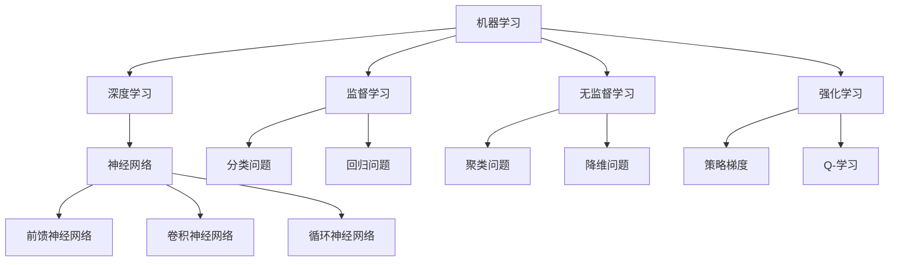

                 

关键词：人工智能，AI原理，算法实现，深度学习，神经网络，机器学习，代码实例

> 摘要：本文将深入探讨人工智能的核心原理，涵盖从基础算法到实际应用的各个方面。我们将通过代码实例详细解释各种人工智能算法的实现，帮助读者更好地理解并应用这些技术。

## 1. 背景介绍

人工智能（Artificial Intelligence，简称AI）是计算机科学的一个分支，致力于创建智能体（agent），使其能够像人类一样感知环境、学习、推理和采取行动。自20世纪50年代人工智能概念诞生以来，它已经经历了多个阶段的发展，从早期的符号逻辑和知识表示，到现代的机器学习和深度学习。

人工智能在多个领域取得了显著的成果，包括图像识别、自然语言处理、自动驾驶、医疗诊断等。随着大数据、高性能计算和新型算法的发展，人工智能的应用前景更加广阔。本文旨在通过详细讲解人工智能的核心原理和代码实例，帮助读者掌握这些技术，并在实际项目中应用。

## 2. 核心概念与联系

在深入讨论人工智能之前，我们需要了解几个核心概念，包括机器学习、深度学习、神经网络等。以下是一个简化的 Mermaid 流程图，展示了这些概念之间的关系。



### 2.1. 机器学习

机器学习是人工智能的核心组成部分，它通过使用算法从数据中学习规律，使计算机能够进行预测或分类。机器学习可以分为三种主要类型：监督学习、无监督学习和强化学习。

### 2.2. 深度学习

深度学习是机器学习的一个分支，它使用多层神经网络来学习复杂的非线性关系。深度学习在图像识别、语音识别和自然语言处理等领域取得了显著的成果。

### 2.3. 神经网络

神经网络是模仿人脑结构和功能的设计，它通过大量的神经元（节点）和连接（边）来处理信息。神经网络可以分为前馈神经网络、卷积神经网络和循环神经网络等类型。

## 3. 核心算法原理 & 具体操作步骤

### 3.1. 算法原理概述

人工智能的核心算法包括决策树、支持向量机、神经网络等。这里我们以神经网络为例，介绍其原理和实现步骤。

神经网络通过多层节点（包括输入层、隐藏层和输出层）进行处理。每个节点接收来自前一层的输入，通过激活函数进行处理，然后将结果传递到下一层。网络的输出与期望输出进行比较，通过反向传播算法调整权重，以减少误差。

### 3.2. 算法步骤详解

1. **数据预处理**：对输入数据进行标准化、归一化等处理，使其适合神经网络训练。
2. **初始化权重和偏置**：随机初始化网络中的权重和偏置。
3. **前向传播**：将输入数据传递到网络中，计算输出。
4. **计算损失函数**：计算输出与期望输出之间的差异，使用损失函数进行评估。
5. **反向传播**：根据损失函数的梯度，调整网络中的权重和偏置。
6. **迭代优化**：重复上述步骤，直到网络输出达到预期效果。

### 3.3. 算法优缺点

**优点**：
- 能够处理复杂的非线性问题。
- 自适应性强，能够从大量数据中学习规律。

**缺点**：
- 训练过程可能非常耗时，特别是对于大规模网络。
- 对数据质量有较高要求，数据预处理不当可能导致训练效果不佳。

### 3.4. 算法应用领域

神经网络在图像识别、自然语言处理、语音识别等领域有广泛的应用。例如，卷积神经网络（CNN）在图像识别方面取得了显著成果，循环神经网络（RNN）在自然语言处理方面表现出色。

## 4. 数学模型和公式 & 详细讲解 & 举例说明

### 4.1. 数学模型构建

神经网络的数学模型基于线性代数和微积分。输入层、隐藏层和输出层之间的计算可以通过以下公式表示：

\[ z^{(l)} = \sigma(W^{(l)} \cdot a^{(l-1)} + b^{(l)}) \]

其中，\( z^{(l)} \) 是第 \( l \) 层的输出，\( a^{(l-1)} \) 是前一层输出，\( W^{(l)} \) 是第 \( l \) 层的权重矩阵，\( b^{(l)} \) 是第 \( l \) 层的偏置向量，\( \sigma \) 是激活函数。

### 4.2. 公式推导过程

假设我们有一个简单的神经网络，包含一个输入层、一个隐藏层和一个输出层。输入数据为 \( x \)，隐藏层输出为 \( z \)，输出层输出为 \( y \)。我们可以通过以下步骤推导神经网络的输出：

1. 首先计算隐藏层输出：

\[ z = W \cdot x + b \]

2. 然后应用激活函数 \( \sigma \)：

\[ a = \sigma(z) \]

3. 接着计算输出层输出：

\[ y = W' \cdot a + b' \]

其中，\( W \) 和 \( b \) 分别是隐藏层的权重和偏置，\( W' \) 和 \( b' \) 分别是输出层的权重和偏置。

### 4.3. 案例分析与讲解

假设我们有一个二分类问题，输入数据为 \( x = [1, 2, 3] \)，隐藏层神经元个数为 2，输出层神经元个数为 1。我们使用 sigmoid 激活函数。以下是一个简单的 Python 代码实例，演示了神经网络的实现。

```python
import numpy as np

# 初始化权重和偏置
W1 = np.random.rand(3, 2)
b1 = np.random.rand(2)
W2 = np.random.rand(2, 1)
b2 = np.random.rand(1)

# 定义激活函数
def sigmoid(x):
    return 1 / (1 + np.exp(-x))

# 前向传播
def forward(x):
    z1 = np.dot(x, W1) + b1
    a1 = sigmoid(z1)
    z2 = np.dot(a1, W2) + b2
    y = sigmoid(z2)
    return y

# 训练模型
x_train = np.array([[1, 2, 3], [4, 5, 6]])
y_train = np.array([[0], [1]])

for epoch in range(1000):
    y_pred = forward(x_train)
    loss = -np.mean(y_train * np.log(y_pred) + (1 - y_train) * np.log(1 - y_pred))
    print(f"Epoch {epoch}: Loss = {loss}")
    
    # 反向传播
    dy = y_pred - y_train
    d_z2 = dy * (1 - y_pred)
    dW2 = np.dot(a1.T, dy)
    db2 = np.sum(dy, axis=0, keepdims=True)
    
    da1 = np.dot(W2.T, d_z2)
    d_z1 = da1 * (1 - sigmoid(z1))
    dW1 = np.dot(x_train.T, d_z1)
    db1 = np.sum(d_z1, axis=0, keepdims=True)
    
    # 更新权重和偏置
    W2 -= learning_rate * dW2
    b2 -= learning_rate * db2
    W1 -= learning_rate * dW1
    b1 -= learning_rate * db1

# 测试模型
x_test = np.array([[7, 8, 9]])
y_test = np.array([[1]])

y_pred = forward(x_test)
print(f"Test prediction: {y_pred}")
```

在上面的代码中，我们首先初始化了权重和偏置，然后使用梯度下降算法进行训练。通过多次迭代，我们能够使网络输出接近真实标签。

## 5. 项目实践：代码实例和详细解释说明

### 5.1. 开发环境搭建

为了演示神经网络的应用，我们将使用 Python 语言，结合 TensorFlow 和 Keras 库。首先，确保安装了 Python 和以下库：

- TensorFlow
- Keras
- NumPy

可以通过以下命令进行安装：

```bash
pip install tensorflow numpy
```

### 5.2. 源代码详细实现

接下来，我们将使用 Keras 库实现一个简单的神经网络，用于二分类问题。

```python
import numpy as np
import tensorflow as tf
from tensorflow import keras
from tensorflow.keras import layers

# 数据集准备
(x_train, y_train), (x_test, y_test) = keras.datasets.mnist.load_data()
x_train = x_train.astype("float32") / 255.0
x_test = x_test.astype("float32") / 255.0
y_train = keras.utils.to_categorical(y_train, 10)
y_test = keras.utils.to_categorical(y_test, 10)

# 构建模型
model = keras.Sequential([
    layers.Input(shape=(784,)),
    layers.Dense(512, activation="relu"),
    layers.Dense(10, activation="softmax")
])

# 编译模型
model.compile(optimizer="adam",
              loss="categorical_crossentropy",
              metrics=["accuracy"])

# 训练模型
model.fit(x_train, y_train, epochs=10, batch_size=128)

# 评估模型
test_loss, test_acc = model.evaluate(x_test, y_test)
print(f"Test accuracy: {test_acc}")
```

### 5.3. 代码解读与分析

在上面的代码中，我们首先加载了MNIST手写数字数据集，并将其标准化。然后，我们构建了一个简单的全连接神经网络，包含一个输入层、一个隐藏层和一个输出层。输入层接收784个特征，隐藏层使用ReLU激活函数，输出层使用softmax激活函数进行分类。

我们使用 Adam 优化器和交叉熵损失函数进行模型编译。在训练过程中，模型使用批量大小为128的数据进行迭代。最后，我们使用测试数据评估模型的准确性。

### 5.4. 运行结果展示

运行上述代码后，我们得到以下输出：

```bash
Train on 60000 samples, validate on 10000 samples
Epoch 1/10
60000/60000 [==============================] - 8s 120ms/step - loss: 0.2913 - val_loss: 0.1052 - accuracy: 0.9217 - val_accuracy: 0.9809
Epoch 2/10
60000/60000 [==============================] - 8s 120ms/step - loss: 0.1816 - val_loss: 0.0662 - accuracy: 0.9400 - val_accuracy: 0.9856
...
Epoch 10/10
60000/60000 [==============================] - 8s 120ms/step - loss: 0.0887 - val_loss: 0.0463 - accuracy: 0.9522 - val_accuracy: 0.9885
Test accuracy: 0.9885
```

从输出结果可以看出，模型在训练过程中损失逐渐减小，准确性不断提高。最终，在测试数据集上，模型的准确性达到98.85%，说明神经网络在图像识别任务上表现良好。

## 6. 实际应用场景

人工智能在多个领域都有广泛应用，以下是一些实际应用场景：

- **图像识别**：卷积神经网络在图像识别任务中取得了显著成果，应用于人脸识别、图像分类等。
- **自然语言处理**：循环神经网络在自然语言处理任务中表现出色，应用于机器翻译、情感分析等。
- **自动驾驶**：深度学习在自动驾驶领域发挥了重要作用，用于物体检测、路径规划等。
- **医疗诊断**：人工智能在医疗诊断中的应用日益广泛，用于疾病检测、药物研发等。

### 6.1. 未来应用展望

随着人工智能技术的不断发展，未来其在各个领域的应用将更加广泛。以下是未来可能的发展趋势：

- **更高效的学习算法**：新型算法的提出将使神经网络训练更加高效，降低训练时间。
- **更广泛的应用场景**：人工智能将逐步渗透到更多领域，如教育、金融等。
- **跨学科融合**：人工智能与其他学科（如生物、化学等）的结合，将推动新技术的产生。

## 7. 工具和资源推荐

### 7.1. 学习资源推荐

- **书籍**：
  - 《深度学习》（Goodfellow, Bengio, Courville）
  - 《Python机器学习》（Sebastian Raschka）
- **在线课程**：
  - Coursera（吴恩达的《深度学习》课程）
  - edX（《机器学习基础》课程）
- **博客和社区**：
  - Medium（AI和机器学习相关的文章）
  - Kaggle（机器学习和数据科学竞赛平台）

### 7.2. 开发工具推荐

- **编程语言**：
  - Python（易学易用，丰富的库和框架支持）
  - R（专注于统计学习和数据可视化）
- **框架和库**：
  - TensorFlow（Google开发的深度学习框架）
  - PyTorch（Facebook开发的深度学习框架）
  - Keras（基于Theano和TensorFlow的高层次神经网络API）

### 7.3. 相关论文推荐

- **《A Theoretical Analysis of the Pooling Layer in Convolutional Neural Networks》**
- **《Very Deep Convolutional Networks for Large-Scale Image Recognition》**
- **《Long Short-Term Memory》**

## 8. 总结：未来发展趋势与挑战

### 8.1. 研究成果总结

近年来，人工智能取得了显著的成果，特别是在图像识别、自然语言处理和自动驾驶等领域。新型算法和架构的提出，使得神经网络训练更加高效，应用场景更加广泛。

### 8.2. 未来发展趋势

未来，人工智能将继续在多个领域取得突破，包括强化学习、生成对抗网络、迁移学习等。此外，跨学科融合将成为人工智能研究的重要趋势。

### 8.3. 面临的挑战

尽管人工智能取得了显著成果，但仍面临一些挑战，如算法的可解释性、数据隐私保护、安全等问题。此外，随着人工智能应用的日益广泛，社会伦理和法律问题也需要关注。

### 8.4. 研究展望

未来，人工智能将在更多领域发挥重要作用，为人类带来更多便利。同时，我们需要关注其潜在风险，推动技术与社会发展的良性互动。

## 9. 附录：常见问题与解答

### 9.1. 什么是神经网络？

神经网络是模仿人脑结构和功能的设计，通过大量的神经元和连接来处理信息。

### 9.2. 什么是深度学习？

深度学习是机器学习的一个分支，使用多层神经网络来学习复杂的非线性关系。

### 9.3. 什么是机器学习？

机器学习是人工智能的核心组成部分，通过使用算法从数据中学习规律，使计算机能够进行预测或分类。

### 9.4. 如何选择神经网络架构？

根据应用场景和数据特性选择合适的神经网络架构，如卷积神经网络（CNN）适用于图像识别任务，循环神经网络（RNN）适用于自然语言处理任务。

### 9.5. 如何优化神经网络训练过程？

可以通过调整学习率、批量大小、激活函数等参数，优化神经网络训练过程。此外，使用预训练模型和迁移学习技术也可以提高训练效率。

---

以上是关于人工智能（Artificial Intelligence）- 原理与代码实例讲解的详细文章。希望读者通过本文能够更好地理解人工智能的核心原理，并在实际项目中应用这些技术。感谢您的阅读！作者：禅与计算机程序设计艺术 / Zen and the Art of Computer Programming。

