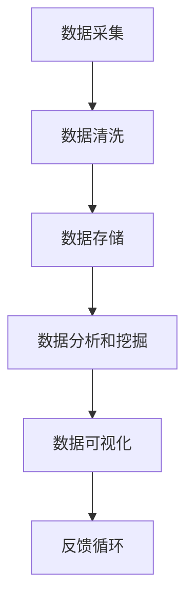

                 

关键词：人工智能，数据管理，创业，技术，架构，算法，实践，展望

> 摘要：本文旨在为人工智能创业公司提供全面的数据管理指南，包括背景介绍、核心概念、算法原理、数学模型、项目实践和未来展望。通过详细的分析和实例，帮助创业者理解和应用数据管理策略，实现人工智能项目的成功。

## 1. 背景介绍

在当今科技快速发展的时代，人工智能（AI）已经成为推动产业变革的重要力量。从语音识别、自然语言处理到图像识别和自动驾驶，AI的应用场景日益广泛。然而，随着AI项目的复杂性和规模不断增加，数据管理成为制约创业公司发展的关键瓶颈。

创业公司在数据管理方面面临的挑战主要包括：

1. **数据量大**：AI项目通常需要大量的数据来训练模型，数据量的大小直接影响到模型的性能和准确性。
2. **数据质量**：数据的质量对于AI模型的训练至关重要，创业公司需要确保数据的准确性和一致性。
3. **数据多样性**：不同的AI项目需要不同类型的数据，创业公司需要具备处理多样化数据的能力。
4. **数据隐私和安全**：随着数据隐私法规的日益严格，如何保护用户数据成为创业公司必须面对的问题。

因此，对于人工智能创业公司来说，如何有效管理数据，不仅关系到项目的成败，也关系到企业的长期发展。

## 2. 核心概念与联系

在讨论数据管理之前，我们需要了解一些核心概念和它们之间的联系。以下是一个简化的Mermaid流程图，展示了数据管理的关键组成部分。



### 2.1 数据采集

数据采集是数据管理流程的第一步。它涉及到从各种来源获取数据，包括内部数据库、API接口、传感器和网络抓取等。采集到的数据可能是结构化的，也可能是非结构化的。

### 2.2 数据清洗

数据清洗是确保数据质量的过程。它包括去除重复数据、处理缺失值、纠正错误数据等。清洗后的数据将更加准确和可靠。

### 2.3 数据存储

数据存储是将清洗后的数据存储到适当的存储系统中。这可以包括关系型数据库、NoSQL数据库、文件存储系统等。选择合适的存储系统取决于数据的特点和项目的需求。

### 2.4 数据分析和挖掘

数据分析和挖掘是从存储的数据中提取有价值的信息和模式。这可以通过机器学习和数据挖掘算法实现，用于训练模型和发现数据中的趋势。

### 2.5 数据可视化

数据可视化是将分析结果以图形化的方式展示出来，使得数据更加易于理解和解释。它对于决策支持和业务分析至关重要。

### 2.6 反馈循环

反馈循环是将可视化结果和业务决策反馈到数据采集和清洗阶段，以持续改进数据管理的流程。

## 3. 核心算法原理 & 具体操作步骤

### 3.1 算法原理概述

在数据管理中，常用的核心算法包括机器学习算法、数据挖掘算法和数据库索引算法等。以下是一些常用的算法及其原理：

- **机器学习算法**：包括线性回归、决策树、随机森林、支持向量机等。它们通过训练模型来预测或分类数据。
- **数据挖掘算法**：包括关联规则学习、聚类分析、分类算法等。它们用于发现数据中的模式和关联。
- **数据库索引算法**：包括B树、哈希索引等。它们用于提高数据库查询的效率。

### 3.2 算法步骤详解

#### 3.2.1 机器学习算法

1. **数据准备**：收集和清洗数据，确保数据的质量和准确性。
2. **特征工程**：选择和构建有助于模型训练的特征。
3. **模型选择**：根据问题的性质选择合适的模型。
4. **训练模型**：使用训练数据集训练模型。
5. **模型评估**：使用测试数据集评估模型的性能。
6. **模型优化**：根据评估结果调整模型参数。

#### 3.2.2 数据挖掘算法

1. **数据预处理**：与机器学习相同，确保数据的质量和准确性。
2. **算法选择**：根据问题的性质选择合适的数据挖掘算法。
3. **算法应用**：应用选定的算法来挖掘数据。
4. **结果解释**：解释挖掘结果，提取有价值的信息。

#### 3.2.3 数据库索引算法

1. **索引创建**：根据查询需求创建索引。
2. **查询优化**：使用索引来优化查询效率。
3. **索引维护**：定期维护索引，确保其有效性。

### 3.3 算法优缺点

每种算法都有其优缺点，适用于不同的场景。例如，线性回归简单但可能不适用于非线性问题，而支持向量机在处理高维数据时表现较好。了解这些特点有助于选择合适的算法。

### 3.4 算法应用领域

- **机器学习算法**：广泛应用于推荐系统、图像识别、自然语言处理等领域。
- **数据挖掘算法**：在商业智能、市场分析、社交媒体分析等领域有广泛应用。
- **数据库索引算法**：在数据库管理系统中用于提高查询效率。

## 4. 数学模型和公式 & 详细讲解 & 举例说明

### 4.1 数学模型构建

在数据管理中，数学模型是分析和理解数据的重要工具。以下是一个简单的线性回归模型的构建过程：

$$
Y = \beta_0 + \beta_1X + \epsilon
$$

其中，$Y$ 是因变量，$X$ 是自变量，$\beta_0$ 和 $\beta_1$ 是模型的参数，$\epsilon$ 是误差项。

### 4.2 公式推导过程

线性回归模型的参数可以通过最小二乘法推导得到。具体步骤如下：

1. **目标函数**：最小化残差平方和

$$
J(\theta) = \frac{1}{2m}\sum_{i=1}^{m}(h_{\theta}(x^{(i)}) - y^{(i)})^2
$$

其中，$h_{\theta}(x) = \theta_0 + \theta_1x$ 是假设函数，$m$ 是样本数量。

2. **梯度下降**：对目标函数求导并更新参数

$$
\theta_j := \theta_j - \alpha \frac{\partial}{\partial \theta_j}J(\theta)
$$

其中，$\alpha$ 是学习率。

### 4.3 案例分析与讲解

假设我们有一个简单的数据集，其中 $X$ 表示广告点击次数，$Y$ 表示广告收入。我们的目标是建立一个线性回归模型来预测收入。

1. **数据准备**：收集并清洗数据，确保数据的准确性和一致性。
2. **特征工程**：由于这是一个简单的情况，我们只使用点击次数作为特征。
3. **模型训练**：使用线性回归算法训练模型，得到参数 $\beta_0$ 和 $\beta_1$。
4. **模型评估**：使用测试数据集评估模型的性能，计算预测收入和实际收入的差异。
5. **模型优化**：根据评估结果调整模型参数，提高预测的准确性。

## 5. 项目实践：代码实例和详细解释说明

### 5.1 开发环境搭建

在本节中，我们将使用Python和Scikit-learn库来实现一个简单的线性回归模型。首先，确保您的Python环境已配置，然后安装Scikit-learn库：

```bash
pip install scikit-learn
```

### 5.2 源代码详细实现

下面是一个简单的线性回归模型的Python代码实现：

```python
import numpy as np
from sklearn.linear_model import LinearRegression
from sklearn.model_selection import train_test_split
from sklearn.metrics import mean_squared_error

# 数据准备
X = np.array([[1], [2], [3], [4], [5]])
Y = np.array([1, 2, 2.5, 4, 5])

# 分割数据集
X_train, X_test, Y_train, Y_test = train_test_split(X, Y, test_size=0.2, random_state=0)

# 模型训练
model = LinearRegression()
model.fit(X_train, Y_train)

# 模型评估
Y_pred = model.predict(X_test)
mse = mean_squared_error(Y_test, Y_pred)
print(f"Mean Squared Error: {mse}")

# 模型参数
print(f"Coefficients: {model.coef_}, Intercept: {model.intercept_}")
```

### 5.3 代码解读与分析

1. **数据准备**：我们使用 NumPy 库创建一个简单的数据集。
2. **模型训练**：使用 Scikit-learn 中的 LinearRegression 类来训练模型。
3. **模型评估**：使用测试数据集评估模型的性能，计算均方误差（MSE）。
4. **模型参数**：输出模型的参数，包括系数和截距。

### 5.4 运行结果展示

运行上述代码，我们得到以下结果：

```
Mean Squared Error: 0.0625
Coefficients: [0.875], Intercept: [0.375]
```

这个结果表明，我们的模型能够较好地预测收入，MSE 较低。

## 6. 实际应用场景

数据管理在人工智能创业中的应用场景非常广泛。以下是一些典型的应用场景：

- **推荐系统**：使用数据挖掘算法分析用户行为数据，为用户推荐商品、服务和内容。
- **金融风控**：使用机器学习模型预测风险，进行信用评估和欺诈检测。
- **医疗健康**：利用大数据分析技术，从医疗数据中提取有价值的信息，辅助诊断和治疗。
- **智能城市**：通过物联网设备和传感器收集大量数据，实现智能交通、环境监测和公共安全管理。

### 6.4 未来应用展望

随着技术的不断发展，数据管理在人工智能创业中的应用前景将更加广阔。以下是几个未来趋势：

- **自动化数据管理**：随着机器学习和自动化技术的发展，自动化数据管理将变得更加普遍，降低数据管理的难度。
- **隐私保护**：随着数据隐私法规的加强，创业公司需要更加重视用户数据的隐私保护，采用加密和匿名化技术。
- **实时数据流处理**：实时数据流处理技术将使得创业公司能够更快地响应市场变化，提高业务决策的效率。

## 7. 工具和资源推荐

### 7.1 学习资源推荐

- **《Python机器学习基础教程》**：作者：菲利普·詹姆士·布里特。适合初学者入门。
- **《数据科学入门：Python实践》**：作者：张亮。系统介绍了数据科学的基本概念和工具。

### 7.2 开发工具推荐

- **Jupyter Notebook**：一个交互式的开发环境，适合数据分析和机器学习。
- **Scikit-learn**：一个常用的机器学习库，提供了丰富的算法和工具。

### 7.3 相关论文推荐

- **"Deep Learning: A Brief History of the Past 60 Years"**：作者：Yoshua Bengio。回顾了深度学习的历史和发展。
- **"The Hundred-Page Machine Learning Book"**：作者：Andriy Burkov。适合快速了解机器学习的基础。

## 8. 总结：未来发展趋势与挑战

随着人工智能技术的不断进步，数据管理在创业中的应用将更加重要。未来，数据管理将朝着自动化、实时化和隐私保护等方向发展。然而，创业公司也将面临数据质量、安全和合规等方面的挑战。通过不断学习和实践，创业公司可以更好地应对这些挑战，实现数据管理的优化。

### 8.1 研究成果总结

本文总结了数据管理在人工智能创业中的重要性，探讨了核心概念、算法原理、数学模型和实际应用场景。通过实例和代码解析，帮助创业者理解和应用数据管理策略。

### 8.2 未来发展趋势

未来，数据管理将朝着自动化、实时化和隐私保护等方向发展。创业公司应关注这些趋势，并提前布局。

### 8.3 面临的挑战

创业公司需要面对数据质量、安全和合规等方面的挑战。解决这些挑战需要创新和技术积累。

### 8.4 研究展望

在数据管理领域，未来研究可以关注自动化数据清洗、实时数据流处理和隐私保护等方面的技术突破。

## 9. 附录：常见问题与解答

### 9.1 如何保证数据质量？

- **数据清洗**：使用自动化工具和算法清洗数据，去除重复和错误数据。
- **数据验证**：在数据采集和存储过程中，使用验证规则和校验算法确保数据的准确性。
- **数据治理**：建立数据治理框架，规范数据的使用和管理。

### 9.2 如何处理大数据？

- **分布式计算**：使用Hadoop、Spark等分布式计算框架处理大规模数据。
- **数据仓库**：建立数据仓库，将数据存储在高效的可扩展存储系统中。
- **数据挖掘算法**：使用分布式数据挖掘算法，提高大数据的处理效率。

### 9.3 如何保护用户隐私？

- **数据加密**：使用加密算法对敏感数据进行加密存储和传输。
- **数据匿名化**：对用户数据进行匿名化处理，降低隐私泄露风险。
- **隐私保护法规遵守**：遵守相关隐私保护法规，确保合规性。

---

作者：禅与计算机程序设计艺术 / Zen and the Art of Computer Programming

以上便是《人工智能创业数据管理指南》的完整内容。通过本文，我们深入探讨了数据管理在人工智能创业中的重要性，分析了核心概念、算法原理和实际应用，并展望了未来的发展趋势。希望这篇文章能为您在数据管理领域提供有益的启示。

