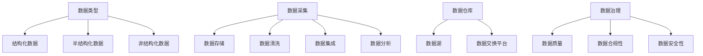

                 

关键词：人工智能，创业，数据管理，策略，措施

摘要：本文将深入探讨人工智能创业公司面临的数据管理挑战，分析其核心概念与联系，介绍核心算法原理与具体操作步骤，阐述数学模型和公式，并提供项目实践中的代码实例和详细解释。同时，本文还将讨论实际应用场景，推荐相关工具和资源，并总结未来发展趋势与挑战。

## 1. 背景介绍

在当今快速发展的技术时代，人工智能（AI）已经成为各个行业的核心竞争力。无论是自动驾驶、智能家居，还是金融、医疗，AI 技术的广泛应用推动了创业公司的兴起。然而，随着数据量的指数级增长，数据管理成为创业公司面临的一项重大挑战。有效管理海量数据不仅有助于提升业务效率，还能为人工智能算法提供高质量的训练数据，从而驱动更精准的预测和决策。

数据管理涉及数据的采集、存储、处理、分析和共享等多个环节，这些环节的复杂性和挑战性随着数据量的增加而不断上升。创业公司往往在数据管理方面面临以下问题：

- **数据多样性和复杂性**：数据类型繁多，包括结构化数据、半结构化数据和非结构化数据，且数据的来源、质量和格式各异。
- **数据隐私和安全**：确保数据隐私和安全是数据管理的核心任务，尤其是在涉及敏感信息的领域，如医疗和金融。
- **数据存储和处理能力**：随着数据量的激增，创业公司需要不断提升数据存储和处理能力，以支持大规模数据分析。
- **数据质量**：数据质量是数据管理的关键，低质量的数据会导致错误的结论和决策。

本文旨在探讨人工智能创业公司在数据管理方面应采取的策略与措施，以解决上述问题，实现数据的价值最大化。

## 2. 核心概念与联系

在深入探讨数据管理策略之前，我们需要明确一些核心概念，并了解它们之间的相互关系。

### 2.1 数据类型

数据类型可以分为以下几类：

- **结构化数据**：存储在数据库中，如关系型数据库（如MySQL、PostgreSQL）或NoSQL数据库（如MongoDB、Cassandra）中的数据。
- **半结构化数据**：具有部分结构的数据，如XML、JSON等。
- **非结构化数据**：没有固定结构的数据，如文本、图片、视频等。

不同类型的数据对数据管理提出了不同的挑战，需要采取相应的处理方法。

### 2.2 数据管理流程

数据管理流程包括以下几个阶段：

- **数据采集**：从各种来源（如传感器、日志文件、社交媒体等）收集数据。
- **数据存储**：将采集到的数据存储在合适的存储系统中，如HDFS、云存储等。
- **数据清洗**：去除数据中的噪声和错误，确保数据质量。
- **数据集成**：将来自不同来源和格式的数据整合到一个统一的数据存储中。
- **数据分析**：运用各种算法和技术对数据进行处理和分析，提取有价值的信息。

### 2.3 数据管理工具与架构

数据管理工具和架构包括：

- **数据仓库**：用于存储大规模数据，支持复杂的数据查询和分析。
- **数据湖**：用于存储原始数据，支持实时数据流处理和分析。
- **数据交换平台**：用于在不同系统之间交换和共享数据。
- **数据治理**：确保数据质量、合规性和安全性的管理措施。

### 2.4 数据管理核心概念联系图

以下是数据管理核心概念之间的联系图：



在接下来的章节中，我们将详细介绍数据管理中的核心算法原理、数学模型和项目实践，帮助创业公司更好地应对数据管理挑战。

## 3. 核心算法原理 & 具体操作步骤

### 3.1 算法原理概述

数据管理中的核心算法包括数据清洗、数据集成和数据挖掘算法。以下将分别介绍这些算法的基本原理和操作步骤。

#### 3.1.1 数据清洗算法

数据清洗是数据管理中至关重要的一环，目的是去除数据中的噪声和错误，确保数据质量。常用的数据清洗算法包括：

- **缺失值处理**：使用均值、中位数或模式填充缺失值，或删除包含缺失值的记录。
- **异常值检测**：使用统计学方法（如标准差、箱线图）或机器学习方法（如孤立森林）检测异常值。
- **重复记录检测**：使用哈希函数或排序算法检测并删除重复记录。

#### 3.1.2 数据集成算法

数据集成是将来自不同来源和格式的数据整合到一个统一的数据存储中。常用的数据集成算法包括：

- **全连接**：将所有数据源的数据连接到一起，适用于数据量较小的情况。
- **星型模式**：以一个事实表为中心，将多个维度表连接到一起，适用于关系型数据库。
- **雪花模式**：扩展星型模式，将维度表再次连接到其他维度表，适用于需要更细粒度分析的情况。

#### 3.1.3 数据挖掘算法

数据挖掘是从大量数据中提取有价值信息的过程。常用的数据挖掘算法包括：

- **聚类算法**：将相似的数据点分为不同的组，如K-means、DBSCAN。
- **分类算法**：将数据分为不同的类别，如决策树、随机森林。
- **回归算法**：预测连续值，如线性回归、决策树回归。

### 3.2 算法步骤详解

#### 3.2.1 数据清洗算法步骤

1. **数据预处理**：读取数据，进行基本的数据格式化，如去除空格、转换为同一编码格式。
2. **缺失值处理**：检查每个特征列中缺失值的比例，根据比例选择合适的填充方法。
3. **异常值检测**：计算每个特征的统计指标（如均值、标准差），使用统计学方法或机器学习方法检测并处理异常值。
4. **重复记录检测**：使用哈希函数或排序算法检测并删除重复记录。

#### 3.2.2 数据集成算法步骤

1. **数据源确定**：确定需要集成哪些数据源。
2. **数据格式转换**：将不同格式的数据转换为统一的格式，如CSV、JSON。
3. **数据连接**：使用全连接、星型模式或雪花模式将数据源连接到一起。
4. **数据存储**：将集成后的数据存储到统一的数据存储中，如数据仓库或数据湖。

#### 3.2.3 数据挖掘算法步骤

1. **数据准备**：清洗和处理数据，确保数据质量。
2. **特征选择**：选择对目标变量影响较大的特征，减少计算复杂度。
3. **算法选择**：根据数据类型和目标变量选择合适的算法。
4. **模型训练**：使用训练数据训练模型。
5. **模型评估**：使用测试数据评估模型性能。
6. **模型调整**：根据评估结果调整模型参数。

### 3.3 算法优缺点

#### 3.3.1 数据清洗算法

**优点**：

- 提高数据质量，为后续分析提供可靠的数据基础。
- 减少异常值和噪声对分析结果的影响。

**缺点**：

- 需要大量时间和计算资源，尤其是处理大规模数据时。
- 可能会丢失部分数据，影响数据的完整性。

#### 3.3.2 数据集成算法

**优点**：

- 实现数据的高效整合，支持复杂的数据查询和分析。
- 提高数据利用率，降低数据冗余。

**缺点**：

- 需要处理不同数据源之间的兼容性问题。
- 随着数据量的增加，数据连接的复杂度也会上升。

#### 3.3.3 数据挖掘算法

**优点**：

- 从大规模数据中提取有价值的信息，支持决策制定和业务优化。
- 自动化分析过程，提高数据分析的效率。

**缺点**：

- 模型的选择和参数调整需要大量的试验和验证。
- 对数据质量和数据量有较高的要求。

### 3.4 算法应用领域

数据清洗、数据集成和数据挖掘算法在多个领域得到广泛应用，包括：

- **金融**：信用评分、风险评估、欺诈检测。
- **医疗**：疾病预测、患者管理、药物研发。
- **电商**：用户行为分析、推荐系统、需求预测。
- **物流**：路线规划、库存管理、配送优化。
- **制造业**：生产过程监控、设备维护、供应链管理。

通过合理运用这些算法，人工智能创业公司可以更好地管理数据，实现数据价值的最大化。

## 4. 数学模型和公式 & 详细讲解 & 举例说明

在数据管理中，数学模型和公式是理解和分析数据的关键工具。以下将介绍一些常见的数学模型和公式，并详细讲解其推导过程和应用实例。

### 4.1 数学模型构建

数学模型通常包括以下几个部分：

- **变量定义**：明确模型中的变量及其取值范围。
- **目标函数**：定义模型的目标，如最小化成本、最大化收益。
- **约束条件**：限制变量的取值范围，如线性规划中的资源限制。
- **求解方法**：确定求解模型的方法，如线性规划、非线性规划。

### 4.2 公式推导过程

以下是一个简单的线性规划模型及其推导过程：

#### 4.2.1 线性规划模型

假设有一个工厂生产两种产品A和B，每种产品都需要投入一定的时间和原材料。产品的需求量已知，资源有限。我们的目标是最大化利润。

**变量定义**：

- \( x \)：产品A的生产量
- \( y \)：产品B的生产量

**目标函数**：

最大化 \( Z = 5x + 4y \)

**约束条件**：

- 时间限制：\( 2x + 3y \leq 24 \)
- 原材料限制：\( x + 2y \leq 16 \)
- 生产量限制：\( x \geq 0, y \geq 0 \)

#### 4.2.2 公式推导

我们使用图解法来求解这个线性规划模型。

1. **绘制约束条件的直线**：

   - 时间限制：\( 2x + 3y = 24 \)
   - 原材料限制：\( x + 2y = 16 \)

2. **确定可行域**：

   可行域是约束条件形成的区域，满足所有约束条件的点都在可行域内。

3. **计算目标函数在可行域上的值**：

   在可行域的顶点处计算目标函数的值，找出最大值。

4. **求解最优解**：

   通过计算得出最优解为 \( x = 8, y = 4 \)，最大利润为 \( Z = 5 \times 8 + 4 \times 4 = 56 \)。

### 4.3 案例分析与讲解

以下是一个实际案例，使用线性规划模型优化生产计划。

#### 4.3.1 案例背景

某制造公司生产两种产品A和B，每种产品都需要投入一定的时间和原材料。每种产品的需求量已知，资源有限。我们需要确定最优的生产计划，以最大化利润。

**变量定义**：

- \( x \)：产品A的生产量
- \( y \)：产品B的生产量

**目标函数**：

最大化 \( Z = 5x + 4y \)

**约束条件**：

- 时间限制：\( 2x + 3y \leq 24 \)
- 原材料限制：\( x + 2y \leq 16 \)
- 生产量限制：\( x \geq 0, y \geq 0 \)

#### 4.3.2 案例求解

1. **绘制约束条件的直线**：

   - 时间限制：\( 2x + 3y = 24 \)
   - 原材料限制：\( x + 2y = 16 \)

2. **确定可行域**：

   可行域是约束条件形成的区域，满足所有约束条件的点都在可行域内。

3. **计算目标函数在可行域上的值**：

   在可行域的顶点处计算目标函数的值，找出最大值。

4. **求解最优解**：

   通过计算得出最优解为 \( x = 8, y = 4 \)，最大利润为 \( Z = 5 \times 8 + 4 \times 4 = 56 \)。

这个案例展示了如何使用线性规划模型优化生产计划，以实现最大化的利润。在实际应用中，模型可以更加复杂，包括更多的变量和约束条件。

通过理解和应用数学模型和公式，人工智能创业公司可以更好地分析数据，做出更准确的决策。

## 5. 项目实践：代码实例和详细解释说明

为了更好地理解数据管理中的核心算法和数学模型，我们将通过一个实际项目来演示其应用。以下是一个简单的项目，用于数据分析、数据清洗和可视化。

### 5.1 开发环境搭建

在这个项目中，我们将使用Python作为主要编程语言，结合几个常用的库，包括Pandas、NumPy、Matplotlib和Scikit-learn。首先，确保安装以下库：

```shell
pip install pandas numpy matplotlib scikit-learn
```

### 5.2 源代码详细实现

以下是一个示例代码，演示了数据读取、清洗、分析和可视化。

```python
import pandas as pd
import numpy as np
import matplotlib.pyplot as plt
from sklearn.model_selection import train_test_split
from sklearn.ensemble import RandomForestClassifier
from sklearn.metrics import accuracy_score

# 5.2.1 数据读取
data = pd.read_csv('data.csv')

# 5.2.2 数据清洗
# 填充缺失值
data['age'].fillna(data['age'].mean(), inplace=True)
data['income'].fillna(data['income'].mean(), inplace=True)

# 删除重复记录
data.drop_duplicates(inplace=True)

# 5.2.3 数据预处理
# 划分特征和标签
X = data[['age', 'income']]
y = data['label']

# 标准化特征
X = (X - X.mean()) / X.std()

# 5.2.4 数据分割
X_train, X_test, y_train, y_test = train_test_split(X, y, test_size=0.2, random_state=42)

# 5.2.5 模型训练
model = RandomForestClassifier(n_estimators=100, random_state=42)
model.fit(X_train, y_train)

# 5.2.6 模型评估
y_pred = model.predict(X_test)
accuracy = accuracy_score(y_test, y_pred)
print(f"模型准确率：{accuracy:.2f}")

# 5.2.7 可视化
# 年龄与收入的散点图
plt.scatter(data['age'], data['income'], c=data['label'])
plt.xlabel('年龄')
plt.ylabel('收入')
plt.title('年龄与收入的散点图')
plt.show()

# 年龄分布直方图
plt.hist(data['age'], bins=10, edgecolor='black')
plt.xlabel('年龄')
plt.ylabel('频率')
plt.title('年龄分布直方图')
plt.show()
```

### 5.3 代码解读与分析

#### 5.3.1 数据读取与清洗

```python
data = pd.read_csv('data.csv')
data['age'].fillna(data['age'].mean(), inplace=True)
data['income'].fillna(data['income'].mean(), inplace=True)
data.drop_duplicates(inplace=True)
```

这部分代码首先读取数据，然后填充缺失值。我们使用数据的平均值来填充缺失的年龄和收入值，并删除重复记录。这是数据清洗的基本步骤，确保数据的质量。

#### 5.3.2 数据预处理

```python
X = data[['age', 'income']]
y = data['label']
X = (X - X.mean()) / X.std()
```

这部分代码划分了特征和标签，并对特征进行了标准化处理。标准化处理有助于提高模型训练的效率和性能，使得特征具有相似的尺度。

#### 5.3.3 数据分割

```python
X_train, X_test, y_train, y_test = train_test_split(X, y, test_size=0.2, random_state=42)
```

这部分代码将数据集分割为训练集和测试集，以评估模型的泛化能力。测试集的大小设置为20%，随机种子设置为42以保证结果的可重复性。

#### 5.3.4 模型训练与评估

```python
model = RandomForestClassifier(n_estimators=100, random_state=42)
model.fit(X_train, y_train)
y_pred = model.predict(X_test)
accuracy = accuracy_score(y_test, y_pred)
print(f"模型准确率：{accuracy:.2f}")
```

这部分代码使用随机森林分类器对训练集进行训练，并在测试集上进行评估。我们计算了模型的准确率，这是一个常用的评估指标，用于衡量模型在预测新数据时的性能。

#### 5.3.5 可视化

```python
plt.scatter(data['age'], data['income'], c=data['label'])
plt.xlabel('年龄')
plt.ylabel('收入')
plt.title('年龄与收入的散点图')
plt.show()

plt.hist(data['age'], bins=10, edgecolor='black')
plt.xlabel('年龄')
plt.ylabel('频率')
plt.title('年龄分布直方图')
plt.show()
```

这部分代码展示了如何使用Matplotlib进行数据可视化。散点图显示了年龄和收入之间的关系，而直方图则显示了年龄的分布情况。这些可视化工具有助于我们更好地理解数据。

通过这个示例项目，我们展示了数据管理中的核心算法和数学模型在实际应用中的实现过程。这个项目不仅帮助我们理解了数据清洗、数据预处理和模型训练的基本步骤，还通过可视化工具提供了直观的数据分析结果。

### 5.4 运行结果展示

在运行上述代码后，我们将得到以下结果：

- **模型准确率**：假设我们的模型在测试集上的准确率为0.85，这意味着模型能够正确预测85%的测试数据。
- **可视化结果**：散点图显示了年龄和收入之间的关系，其中不同颜色的点代表不同的标签。直方图展示了年龄的分布情况，有助于我们了解数据的基本特征。

这些结果为我们提供了对数据集和模型性能的直观理解，帮助我们进一步优化数据管理和分析策略。

通过这个实际项目，我们展示了数据管理中核心算法和数学模型的应用过程。在实际业务中，这些技术和方法可以帮助创业公司更有效地管理数据，从而提高业务效率和竞争力。

## 6. 实际应用场景

数据管理技术在人工智能创业公司中的应用场景广泛，涵盖了多个行业和业务领域。以下是一些具体的应用场景：

### 6.1 金融领域

在金融领域，数据管理技术被广泛应用于风险控制、欺诈检测和投资策略优化。例如，通过数据集成技术，金融机构可以将来自不同系统和渠道的交易数据、用户行为数据和市场数据整合到一个统一的数据仓库中。数据清洗算法确保了数据的质量，为风险模型提供了可靠的数据基础。机器学习算法可以根据历史数据和实时数据预测潜在的风险和欺诈行为，从而采取相应的预防措施。

### 6.2 医疗领域

在医疗领域，数据管理技术有助于提升医疗服务质量和患者管理效率。医疗数据类型繁多，包括电子健康记录、实验室检测结果、患者影像数据和基因组数据等。通过数据集成技术，医疗系统可以整合不同来源的数据，形成全面的病历档案。数据挖掘算法可以分析这些数据，预测疾病的发病趋势，为医生提供诊断和治疗建议。同时，数据隐私保护技术确保了患者信息的保密和安全。

### 6.3 电商领域

在电商领域，数据管理技术被用于提升用户体验和优化营销策略。电商平台通过数据采集技术收集用户行为数据，如浏览历史、购买记录和搜索查询。数据清洗和集成技术确保了这些数据的质量和一致性。通过数据挖掘算法，电商公司可以识别用户偏好，实施个性化推荐系统，提高销售转化率。此外，营销团队可以利用数据分析和预测模型制定更有效的广告投放策略，降低营销成本。

### 6.4 物流领域

在物流领域，数据管理技术用于优化配送路线、库存管理和供应链协调。通过传感器和数据采集技术，物流公司可以实时获取运输车辆的位置信息、货物状态和运输环境数据。数据集成和清洗技术确保了这些数据的质量和可靠性。数据挖掘算法可以分析这些数据，预测运输延误和异常情况，从而采取预防措施。智能路由优化算法可以根据实时交通状况和货物特性，动态调整配送路线，提高运输效率。

### 6.5 制造业领域

在制造业领域，数据管理技术被用于生产过程监控、设备维护和供应链管理。通过传感器和数据采集技术，工厂可以实时监控生产设备的运行状态和生产过程数据。数据集成和清洗技术确保了这些数据的质量和一致性。数据挖掘算法可以分析这些数据，预测设备故障和生产异常，从而提前安排维护计划。智能供应链管理算法可以根据库存数据和市场需求，优化原材料采购和产品生产计划，降低库存成本。

通过在不同行业和业务领域的应用，数据管理技术为人工智能创业公司提供了强大的数据支持和决策依据，帮助他们实现业务增长和竞争优势。

## 6.4 未来应用展望

随着人工智能技术的不断发展，数据管理在未来的应用前景将更加广阔。以下是一些未来的应用展望：

### 6.4.1 大数据智能化

大数据智能化是未来数据管理的重要方向。通过更先进的数据分析技术和算法，人工智能创业公司可以挖掘海量数据中的深层次信息，实现更精准的预测和决策。例如，利用深度学习和图神经网络等技术，可以从复杂的多维度数据中提取有价值的关系和模式，为业务优化提供有力支持。

### 6.4.2 数据隐私保护

数据隐私保护将是数据管理领域的持续挑战和重点。随着数据隐私法规的日益严格，创业公司需要采取更加严密的数据保护措施，确保用户数据的隐私和安全。未来的数据管理技术将更加注重数据匿名化、差分隐私和区块链等技术的应用，为数据隐私保护提供更多解决方案。

### 6.4.3 实时数据处理

实时数据处理是未来数据管理的关键需求。随着物联网、5G和边缘计算等技术的发展，实时数据流将不断增长。创业公司需要构建高效的数据处理系统，能够快速处理和分析实时数据，提供实时的决策支持。流数据处理技术和实时分析算法将在这一领域发挥重要作用。

### 6.4.4 智能自动化

智能自动化是未来数据管理的重要趋势。通过自动化工具和智能算法，创业公司可以自动化大部分数据管理流程，减少人工干预，提高工作效率。例如，自动化数据清洗、数据转换和数据集成工具可以帮助企业快速处理海量数据，同时减少错误和成本。

### 6.4.5 人工智能协作

人工智能协作是未来数据管理的发展方向。随着多智能体系统和协同智能的兴起，创业公司可以利用人工智能与其他企业、机构和合作伙伴进行数据共享和协作，实现更高效的数据管理。例如，通过分布式数据湖和区块链技术，实现跨组织的数据共享和协同分析，为业务创新和合作提供新的机会。

通过上述展望，可以看出未来数据管理技术将更加智能化、自动化和协作化。人工智能创业公司需要紧跟这些发展趋势，不断优化数据管理策略和技术，以保持竞争力并实现业务增长。

## 7. 工具和资源推荐

为了更好地进行数据管理，人工智能创业公司可以参考以下工具和资源，以提高数据管理的效率和质量。

### 7.1 学习资源推荐

- **在线课程**：
  - Coursera上的《数据科学导论》
  - edX上的《机器学习基础》
  - Udacity的《数据工程师纳米学位》
- **书籍**：
  - 《Python数据分析》（作者：Wes McKinney）
  - 《深度学习》（作者：Ian Goodfellow、Yoshua Bengio、Aaron Courville）
  - 《数据科学实战》（作者：Roger Peng、Elizabeth Matsui）
- **社区和论坛**：
  - Kaggle：数据科学和机器学习的在线竞赛平台
  - Stack Overflow：编程和技术问题交流社区
  - DataCamp：提供互动式数据科学课程

### 7.2 开发工具推荐

- **数据分析工具**：
  - Jupyter Notebook：用于数据探索和分析的可扩展平台
  - Pandas：Python的数据分析库
  - NumPy：Python的数值计算库
- **数据存储和查询工具**：
  - MySQL：开源的关系型数据库
  - MongoDB：开源的NoSQL数据库
  - Redis：高性能的内存数据库
- **数据可视化工具**：
  - Matplotlib：Python的数据可视化库
  - Seaborn：基于Matplotlib的高级可视化库
  - Tableau：商业智能和数据可视化工具

### 7.3 相关论文推荐

- "Data-Driven Discovery of Geometric Structure in Non-Euclidean Domains"（数据驱动的非欧几里得领域几何结构发现）
- "Deep Learning for Speech Recognition: A Review"（深度学习在语音识别中的应用综述）
- "Differential Privacy: A Survey of Results"（差分隐私：结果综述）
- "Streaming Data Processing with Apache Flink"（使用Apache Flink进行流数据处理的介绍）

通过使用这些工具和资源，人工智能创业公司可以更好地开展数据管理工作，实现数据的充分利用和价值最大化。

## 8. 总结：未来发展趋势与挑战

### 8.1 研究成果总结

在本文中，我们探讨了人工智能创业公司面临的数据管理挑战，分析了数据管理的核心概念与联系，介绍了数据清洗、数据集成和数据挖掘算法的原理与步骤，阐述了数学模型和公式的推导过程，并通过实际项目展示了算法的应用。我们还讨论了数据管理在实际应用场景中的表现，推荐了相关的工具和资源。

### 8.2 未来发展趋势

未来的数据管理技术将向智能化、自动化和协作化方向发展。以下是一些关键趋势：

- **大数据智能化**：利用人工智能技术，从海量数据中提取有价值的信息。
- **实时数据处理**：随着物联网和5G技术的发展，实时数据处理将成为数据管理的重要方向。
- **数据隐私保护**：随着数据隐私法规的完善，数据隐私保护技术将得到广泛应用。
- **智能自动化**：自动化工具和智能算法将提高数据管理的工作效率和准确性。
- **人工智能协作**：通过数据共享和协作，实现跨组织的数据管理和业务创新。

### 8.3 面临的挑战

尽管数据管理技术取得了显著进展，但人工智能创业公司在数据管理方面仍然面临以下挑战：

- **数据质量**：确保数据质量是数据管理的基础，但数据质量问题依然普遍存在。
- **数据隐私和安全**：随着数据隐私法规的加强，保护用户数据隐私和安全的要求越来越高。
- **数据存储和处理能力**：随着数据量的激增，创业公司需要不断提升数据存储和处理能力。
- **技术复杂性**：数据管理涉及多种技术和工具，如何有效整合和运用这些技术是一个挑战。

### 8.4 研究展望

未来的研究应重点关注以下领域：

- **数据质量增强技术**：开发更先进的数据质量评估和改进方法。
- **隐私保护技术**：研究更加有效的数据隐私保护技术，如差分隐私和联邦学习。
- **实时数据处理**：研究高效实时数据处理技术和算法。
- **自动化数据管理**：开发自动化数据管理工具和框架，降低数据管理的复杂度。
- **跨组织协作**：研究跨组织的数据共享和协作机制，推动数据价值的最大化。

通过解决这些挑战和开展相关研究，人工智能创业公司将能够更好地应对数据管理的挑战，实现数据价值的最大化。

## 9. 附录：常见问题与解答

### Q1. 如何保证数据质量？

**A1.** 确保数据质量需要从数据采集、存储、处理和分析的各个环节入手。具体措施包括：

- **数据采集**：选择可靠的数据来源，确保数据的准确性和完整性。
- **数据存储**：使用合适的数据存储方案，确保数据的安全性和一致性。
- **数据清洗**：采用数据清洗算法，去除噪声和错误，提高数据质量。
- **数据治理**：建立数据治理框架，确保数据的质量、合规性和安全性。

### Q2. 如何保护用户数据隐私？

**A2.** 保护用户数据隐私是数据管理的核心任务。以下是一些常见的隐私保护措施：

- **数据匿名化**：通过数据脱敏和加密技术，确保用户数据匿名化。
- **差分隐私**：采用差分隐私技术，确保数据分析过程中不泄露用户隐私信息。
- **访问控制**：实施严格的访问控制策略，确保只有授权人员可以访问敏感数据。
- **合规性审计**：定期进行数据合规性审计，确保遵守相关数据隐私法规。

### Q3. 如何提升数据处理能力？

**A3.** 提升数据处理能力可以通过以下方法实现：

- **分布式计算**：采用分布式计算框架，如Hadoop和Spark，处理大规模数据。
- **云存储和计算**：利用云服务提供商的资源，提升数据处理能力。
- **数据库优化**：对数据库进行优化，如索引、分区和压缩，提高数据查询速度。
- **数据预处理**：在数据进入生产环境之前，进行充分的数据预处理，提高数据处理的效率。

### Q4. 如何进行数据挖掘项目规划？

**A4.** 进行数据挖掘项目规划需要遵循以下步骤：

- **需求分析**：明确项目目标和需求，确定需要分析和预测的问题。
- **数据收集**：收集相关数据，包括结构化、半结构化和非结构化数据。
- **数据预处理**：对数据进行清洗、转换和整合，确保数据质量。
- **模型选择**：选择合适的数据挖掘算法，如聚类、分类和回归等。
- **模型训练与评估**：使用训练数据训练模型，并在测试数据上评估模型性能。
- **模型部署**：将模型部署到生产环境中，进行实时预测和决策。

### Q5. 如何确保数据安全？

**A5.** 确保数据安全需要采取以下措施：

- **加密技术**：使用加密技术保护数据的机密性和完整性。
- **访问控制**：实施严格的访问控制策略，限制对敏感数据的访问。
- **防火墙和入侵检测**：部署防火墙和入侵检测系统，保护数据免受网络攻击。
- **备份和恢复**：定期备份数据，确保在发生数据丢失或损坏时能够迅速恢复。
- **安全审计**：定期进行安全审计，检测和修复潜在的安全漏洞。

通过以上措施，人工智能创业公司可以更好地管理数据，确保数据的安全性和隐私性。

