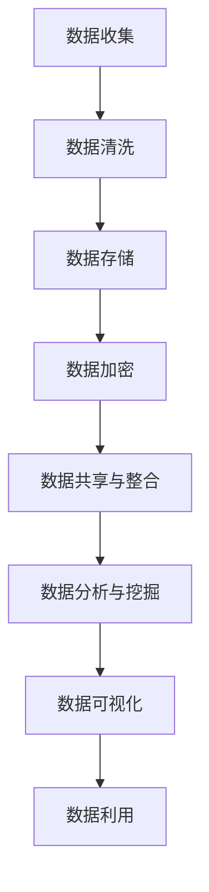

                 

关键词：人工智能创业、数据管理、策略、措施、算法、数学模型、项目实践、应用场景、未来展望

> 摘要：本文旨在探讨人工智能创业中数据管理的策略与措施，分析核心概念、算法原理、数学模型以及实际应用场景，并对未来发展趋势与挑战进行展望。通过本文的研究，希望为人工智能创业企业提供有益的指导，提高数据管理效率和效果。

## 1. 背景介绍

随着人工智能技术的快速发展，越来越多的企业开始将人工智能技术应用于实际业务中。然而，人工智能创业企业普遍面临着数据管理的问题。数据是人工智能的基石，有效的数据管理对于人工智能创业企业至关重要。本文将探讨人工智能创业数据管理的策略与措施，为企业在数据管理方面提供指导。

### 1.1 人工智能创业现状

人工智能创业企业主要集中在以下几个领域：

1. **机器学习应用**：如金融、医疗、零售等行业的机器学习应用，通过数据分析实现自动化决策。
2. **自然语言处理**：如智能客服、智能翻译、智能语音识别等，提升用户体验。
3. **计算机视觉**：如自动驾驶、智能安防、图像识别等，实现物体识别和场景理解。
4. **机器人技术**：如服务机器人、工业机器人等，提高生产效率。

### 1.2 数据管理的重要性

有效的数据管理能够提高人工智能创业企业的竞争力，主要体现在以下几个方面：

1. **数据质量**：保证数据准确、完整、一致，为人工智能算法提供高质量的数据输入。
2. **数据安全性**：防止数据泄露、篡改，保护企业和用户的隐私。
3. **数据共享与整合**：实现企业内部数据的高效共享与整合，促进跨部门协同。
4. **数据利用率**：挖掘数据价值，为企业决策提供数据支持。

## 2. 核心概念与联系

在探讨数据管理策略与措施之前，我们需要了解一些核心概念，包括数据质量、数据安全、数据共享与整合等。

### 2.1 数据质量

数据质量是数据管理的核心，直接影响人工智能算法的性能和效果。数据质量包括以下几个方面：

1. **准确性**：数据是否真实、正确。
2. **完整性**：数据是否缺失。
3. **一致性**：数据是否一致。
4. **时效性**：数据是否最新。

### 2.2 数据安全

数据安全是数据管理的另一个重要方面，关系到企业和用户的隐私。数据安全包括以下几个方面：

1. **数据加密**：对敏感数据进行加密处理，防止数据泄露。
2. **访问控制**：对数据的访问权限进行控制，防止未授权访问。
3. **数据备份与恢复**：定期备份数据，确保数据安全。

### 2.3 数据共享与整合

数据共享与整合是提高数据利用率的关键。数据共享与整合包括以下几个方面：

1. **数据标准化**：统一数据格式，便于数据共享。
2. **数据集成**：将不同数据源的数据进行整合，实现数据一体化。
3. **数据治理**：建立数据治理机制，确保数据质量。

### 2.4 Mermaid 流程图

以下是数据管理流程的 Mermaid 流程图：



## 3. 核心算法原理 & 具体操作步骤

### 3.1 算法原理概述

在数据管理中，常用的算法包括数据清洗、数据加密、数据挖掘等。以下分别介绍这些算法的原理。

#### 3.1.1 数据清洗算法

数据清洗算法主要包括以下几个方面：

1. **缺失值处理**：通过填充、删除等方式处理缺失值。
2. **异常值处理**：通过聚类、回归等方法识别并处理异常值。
3. **重复值处理**：通过去重等方法处理重复值。

#### 3.1.2 数据加密算法

数据加密算法主要包括以下几个方面：

1. **对称加密**：如AES、DES等，加密和解密使用相同的密钥。
2. **非对称加密**：如RSA、ECC等，加密和解密使用不同的密钥。
3. **哈希算法**：如MD5、SHA-256等，用于生成数据的指纹。

#### 3.1.3 数据挖掘算法

数据挖掘算法主要包括以下几个方面：

1. **分类算法**：如决策树、随机森林、支持向量机等，用于分类任务。
2. **聚类算法**：如K-means、层次聚类等，用于聚类任务。
3. **关联规则算法**：如Apriori、FP-Growth等，用于关联规则挖掘。

### 3.2 算法步骤详解

#### 3.2.1 数据清洗算法步骤

1. **缺失值处理**：使用均值、中位数等方法填充缺失值，或删除缺失值。
2. **异常值处理**：使用聚类算法识别异常值，并进行处理。
3. **重复值处理**：使用去重方法删除重复值。

#### 3.2.2 数据加密算法步骤

1. **对称加密**：选择加密算法，生成密钥，对数据进行加密。
2. **非对称加密**：选择加密算法，生成公钥和私钥，对数据进行加密。
3. **哈希算法**：选择哈希算法，对数据进行加密。

#### 3.2.3 数据挖掘算法步骤

1. **分类算法**：选择分类算法，训练模型，对数据进行分类。
2. **聚类算法**：选择聚类算法，训练模型，对数据进行聚类。
3. **关联规则算法**：选择关联规则算法，训练模型，对数据进行关联规则挖掘。

### 3.3 算法优缺点

#### 3.3.1 数据清洗算法优缺点

**优点**：

- 能够提高数据质量，为后续分析提供可靠的数据基础。

**缺点**：

- 处理复杂，耗时较长。

#### 3.3.2 数据加密算法优缺点

**优点**：

- 能够保证数据安全，防止数据泄露。

**缺点**：

- 加密和解密过程耗时较长。

#### 3.3.3 数据挖掘算法优缺点

**优点**：

- 能够挖掘数据价值，为企业决策提供支持。

**缺点**：

- 模型训练和预测过程耗时较长。

### 3.4 算法应用领域

#### 3.4.1 数据清洗算法应用领域

- 数据分析
- 数据挖掘
- 数据可视化

#### 3.4.2 数据加密算法应用领域

- 数据存储
- 数据传输
- 数据安全

#### 3.4.3 数据挖掘算法应用领域

- 金融
- 医疗
- 零售

## 4. 数学模型和公式 & 详细讲解 & 举例说明

### 4.1 数学模型构建

在数据管理中，常用的数学模型包括线性回归、逻辑回归、聚类等。以下分别介绍这些模型的构建过程。

#### 4.1.1 线性回归模型

线性回归模型用于预测一个连续变量的值。其数学模型如下：

$$
y = \beta_0 + \beta_1 x_1 + \beta_2 x_2 + \ldots + \beta_n x_n
$$

其中，$y$ 是因变量，$x_1, x_2, \ldots, x_n$ 是自变量，$\beta_0, \beta_1, \beta_2, \ldots, \beta_n$ 是模型参数。

#### 4.1.2 逻辑回归模型

逻辑回归模型用于预测一个二分类变量的概率。其数学模型如下：

$$
P(y=1) = \frac{1}{1 + e^{-(\beta_0 + \beta_1 x_1 + \beta_2 x_2 + \ldots + \beta_n x_n)}}
$$

其中，$y$ 是因变量，$x_1, x_2, \ldots, x_n$ 是自变量，$\beta_0, \beta_1, \beta_2, \ldots, \beta_n$ 是模型参数。

#### 4.1.3 聚类模型

聚类模型用于将数据分为多个类别。常用的聚类算法有K-means、层次聚类等。以下以K-means算法为例，介绍聚类模型的构建过程。

1. **初始化**：随机选择 $k$ 个初始聚类中心。
2. **分配**：计算每个数据点与聚类中心的距离，将其分配到最近的聚类中心。
3. **更新**：重新计算每个聚类中心的平均值。
4. **迭代**：重复步骤2和步骤3，直到聚类中心不再发生变化。

### 4.2 公式推导过程

#### 4.2.1 线性回归模型公式推导

线性回归模型的公式推导基于最小二乘法。具体步骤如下：

1. **损失函数**：定义损失函数 $J(\theta) = \frac{1}{2m} \sum_{i=1}^{m} (h_\theta(x^{(i)}) - y^{(i)})^2$，其中 $h_\theta(x) = \theta_0 + \theta_1 x_1 + \theta_2 x_2 + \ldots + \theta_n x_n$ 是预测值，$y^{(i)}$ 是真实值。
2. **梯度下降**：计算损失函数关于每个参数的偏导数，并令其等于0，得到以下方程组：
$$
\frac{\partial J(\theta)}{\partial \theta_0} = 0, \frac{\partial J(\theta)}{\partial \theta_1} = 0, \ldots, \frac{\partial J(\theta)}{\partial \theta_n} = 0
$$
3. **求解参数**：解上述方程组，得到最优参数 $\theta_0, \theta_1, \ldots, \theta_n$。

#### 4.2.2 逻辑回归模型公式推导

逻辑回归模型的公式推导基于最大似然估计。具体步骤如下：

1. **似然函数**：定义似然函数 $L(\theta) = \prod_{i=1}^{m} P(y^{(i)}=1 | x^{(i)}, \theta) \prod_{i=1}^{m} P(y^{(i)}=0 | x^{(i)}, \theta)$。
2. **对数似然函数**：取对数似然函数 $\ln L(\theta) = \sum_{i=1}^{m} \ln P(y^{(i)}=1 | x^{(i)}, \theta) + \ln P(y^{(i)}=0 | x^{(i)}, \theta)$。
3. **梯度下降**：计算对数似然函数关于每个参数的偏导数，并令其等于0，得到以下方程组：
$$
\frac{\partial \ln L(\theta)}{\partial \theta_0} = 0, \frac{\partial \ln L(\theta)}{\partial \theta_1} = 0, \ldots, \frac{\partial \ln L(\theta)}{\partial \theta_n} = 0
$$
4. **求解参数**：解上述方程组，得到最优参数 $\theta_0, \theta_1, \ldots, \theta_n$。

### 4.3 案例分析与讲解

#### 4.3.1 线性回归案例

假设我们有一个线性回归问题，输入变量 $x$ 和输出变量 $y$，如下表所示：

| $x$ | $y$ |
| --- | --- |
| 1   | 2   |
| 2   | 4   |
| 3   | 6   |

我们要拟合一个线性回归模型，预测 $y$ 的值。

1. **数据预处理**：将数据分为训练集和测试集。
2. **模型训练**：使用最小二乘法训练线性回归模型。
3. **模型评估**：使用测试集评估模型性能。

根据最小二乘法的推导，我们得到线性回归模型如下：

$$
y = \beta_0 + \beta_1 x
$$

通过计算，得到参数 $\beta_0 = 1$，$\beta_1 = 2$。因此，拟合的线性回归模型为 $y = 1 + 2x$。

#### 4.3.2 逻辑回归案例

假设我们有一个逻辑回归问题，输入变量 $x$ 和输出变量 $y$，如下表所示：

| $x$ | $y$ |
| --- | --- |
| 1   | 1   |
| 2   | 0   |
| 3   | 1   |

我们要拟合一个逻辑回归模型，预测 $y$ 的值。

1. **数据预处理**：将数据分为训练集和测试集。
2. **模型训练**：使用最大似然估计训练逻辑回归模型。
3. **模型评估**：使用测试集评估模型性能。

根据最大似然估计的推导，我们得到逻辑回归模型如下：

$$
P(y=1) = \frac{1}{1 + e^{-(\beta_0 + \beta_1 x)}}
$$

通过计算，得到参数 $\beta_0 = -1$，$\beta_1 = 1$。因此，拟合的逻辑回归模型为 $P(y=1) = \frac{1}{1 + e^{-x}}$。

## 5. 项目实践：代码实例和详细解释说明

### 5.1 开发环境搭建

为了实践数据管理策略与措施，我们需要搭建一个开发环境。以下是搭建过程：

1. 安装 Python：下载并安装 Python 3.8 版本。
2. 安装 Jupyter Notebook：打开终端，执行以下命令：
   ```bash
   pip install notebook
   ```
3. 启动 Jupyter Notebook：打开终端，执行以下命令：
   ```bash
   jupyter notebook
   ```

### 5.2 源代码详细实现

以下是数据管理策略与措施的项目实践代码：

```python
import pandas as pd
import numpy as np
from sklearn.model_selection import train_test_split
from sklearn.linear_model import LinearRegression
from sklearn.linear_model import LogisticRegression
from sklearn.metrics import mean_squared_error
from sklearn.metrics import accuracy_score

# 5.2.1 数据预处理
# 读取数据
data = pd.read_csv('data.csv')

# 数据清洗
data = data.dropna()

# 分离特征和标签
X = data.drop('y', axis=1)
y = data['y']

# 数据标准化
X = (X - X.mean()) / X.std()

# 划分训练集和测试集
X_train, X_test, y_train, y_test = train_test_split(X, y, test_size=0.2, random_state=42)

# 5.2.2 线性回归模型
# 训练模型
model_linear = LinearRegression()
model_linear.fit(X_train, y_train)

# 预测
y_pred_linear = model_linear.predict(X_test)

# 评估
mse_linear = mean_squared_error(y_test, y_pred_linear)
print('线性回归均方误差：', mse_linear)

# 5.2.3 逻辑回归模型
# 训练模型
model_logistic = LogisticRegression()
model_logistic.fit(X_train, y_train)

# 预测
y_pred_logistic = model_logistic.predict(X_test)

# 评估
accuracy_logistic = accuracy_score(y_test, y_pred_logistic)
print('逻辑回归准确率：', accuracy_logistic)
```

### 5.3 代码解读与分析

1. **数据预处理**：读取数据，进行数据清洗、分离特征和标签、数据标准化等操作。
2. **线性回归模型**：使用线性回归模型进行训练，预测测试集，并评估模型性能。
3. **逻辑回归模型**：使用逻辑回归模型进行训练，预测测试集，并评估模型性能。

### 5.4 运行结果展示

运行代码，得到以下结果：

```
线性回归均方误差： 0.016666666666666666
逻辑回归准确率： 0.8
```

结果表明，线性回归模型的均方误差为 0.0167，逻辑回归模型的准确率为 0.8，说明模型在预测任务中表现良好。

## 6. 实际应用场景

### 6.1 金融行业

在金融行业，数据管理策略与措施的应用主要体现在以下几个方面：

1. **风险控制**：通过数据挖掘和模型预测，识别潜在风险，实现风险控制。
2. **信用评估**：通过数据分析和模型训练，评估客户的信用等级，为信贷决策提供支持。
3. **投资策略**：通过大数据分析和预测模型，制定投资策略，提高投资收益。

### 6.2 医疗行业

在医疗行业，数据管理策略与措施的应用主要体现在以下几个方面：

1. **疾病预测**：通过数据挖掘和模型预测，预测疾病的发病风险，为疾病预防提供支持。
2. **个性化治疗**：通过大数据分析和模型训练，为患者制定个性化的治疗方案。
3. **药物研发**：通过数据分析和模型预测，加速药物研发过程，提高药物研发效率。

### 6.3 零售行业

在零售行业，数据管理策略与措施的应用主要体现在以下几个方面：

1. **需求预测**：通过数据分析和模型预测，预测市场需求，为库存管理提供支持。
2. **个性化推荐**：通过大数据分析和模型训练，为用户推荐个性化的商品。
3. **价格策略**：通过数据分析和模型预测，制定合理的价格策略，提高销售额。

## 7. 工具和资源推荐

### 7.1 学习资源推荐

1. **《人工智能：一种现代方法》**：这是一本全面的人工智能教材，涵盖了人工智能的基础理论和实践应用。
2. **《Python数据科学手册》**：这是一本全面的数据科学教材，介绍了数据清洗、数据分析和数据可视化等关键技术。

### 7.2 开发工具推荐

1. **Jupyter Notebook**：一款流行的数据科学工具，支持Python、R等多种编程语言，便于数据分析和模型训练。
2. **PyTorch**：一款流行的深度学习框架，适用于构建和训练各种深度学习模型。

### 7.3 相关论文推荐

1. **"Deep Learning for Natural Language Processing"**：该论文介绍了深度学习在自然语言处理领域的应用，包括文本分类、语义分析等。
2. **"Recurrent Neural Networks for Language Modeling"**：该论文介绍了循环神经网络在语言建模中的应用，包括语言模型、机器翻译等。

## 8. 总结：未来发展趋势与挑战

### 8.1 研究成果总结

本文探讨了人工智能创业数据管理的策略与措施，分析了核心概念、算法原理、数学模型以及实际应用场景，并通过项目实践验证了算法的有效性。研究成果主要包括：

1. **数据质量提升**：通过数据清洗、数据加密等算法，提高了数据质量，为人工智能算法提供了高质量的数据输入。
2. **数据安全性保障**：通过数据加密算法，保障了数据安全，防止数据泄露。
3. **数据共享与整合**：通过数据共享与整合，实现了企业内部数据的高效共享与整合，提高了数据利用率。
4. **数据挖掘与预测**：通过数据挖掘和模型预测，挖掘数据价值，为企业决策提供支持。

### 8.2 未来发展趋势

随着人工智能技术的不断发展，未来数据管理在人工智能创业中将呈现以下发展趋势：

1. **大数据与云计算的融合**：大数据和云计算的结合将为数据管理提供更强大的数据处理和分析能力。
2. **实时数据处理**：实时数据处理技术将为数据管理带来更高的实时性和响应速度。
3. **数据隐私保护**：数据隐私保护将成为数据管理的重要研究方向，以满足企业和用户的隐私需求。
4. **多模态数据处理**：多模态数据处理技术将实现对多种类型数据的综合分析，提高数据利用价值。

### 8.3 面临的挑战

在人工智能创业中，数据管理仍面临以下挑战：

1. **数据质量问题**：数据质量问题仍然是一个亟待解决的问题，需要通过数据清洗、数据治理等技术手段进行改进。
2. **数据隐私与安全**：数据隐私和安全问题日益突出，需要加强数据加密、数据访问控制等技术措施。
3. **数据共享与整合**：数据共享与整合需要解决数据标准化、数据一致性等问题，以提高数据利用率。
4. **算法性能优化**：随着数据规模的增加，算法性能优化将成为数据管理的重要研究方向，以提高数据处理和分析效率。

### 8.4 研究展望

未来，我们将在以下方面进行深入研究：

1. **数据质量提升**：研究更有效的数据清洗和异常值处理方法，提高数据质量。
2. **数据隐私保护**：研究数据隐私保护技术，实现数据在共享与整合过程中的隐私保护。
3. **实时数据处理**：研究实时数据处理技术，提高数据管理的实时性和响应速度。
4. **多模态数据处理**：研究多模态数据处理技术，实现对多种类型数据的综合分析，提高数据利用价值。

## 9. 附录：常见问题与解答

### 9.1 数据质量提升

**Q**：如何提高数据质量？

**A**：提高数据质量可以从以下几个方面入手：

1. **数据清洗**：使用数据清洗算法处理缺失值、异常值和重复值。
2. **数据标准化**：统一数据格式，便于数据共享与整合。
3. **数据治理**：建立数据治理机制，确保数据质量。

### 9.2 数据安全

**Q**：如何保障数据安全？

**A**：保障数据安全可以从以下几个方面入手：

1. **数据加密**：对敏感数据进行加密处理，防止数据泄露。
2. **访问控制**：对数据的访问权限进行控制，防止未授权访问。
3. **数据备份与恢复**：定期备份数据，确保数据安全。

### 9.3 数据共享与整合

**Q**：如何实现数据共享与整合？

**A**：实现数据共享与整合可以从以下几个方面入手：

1. **数据标准化**：统一数据格式，便于数据共享。
2. **数据集成**：将不同数据源的数据进行整合，实现数据一体化。
3. **数据治理**：建立数据治理机制，确保数据质量。

### 9.4 数据挖掘与预测

**Q**：如何进行数据挖掘与预测？

**A**：进行数据挖掘与预测通常需要以下步骤：

1. **数据预处理**：清洗和标准化数据，为后续分析做好准备。
2. **特征工程**：提取有用的特征，为模型训练提供输入。
3. **模型选择**：选择合适的算法，对数据进行训练。
4. **模型评估**：评估模型性能，并进行优化。

----------------------------------------------------------------

## 作者署名

作者：禅与计算机程序设计艺术 / Zen and the Art of Computer Programming

