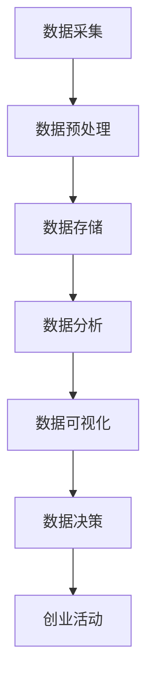
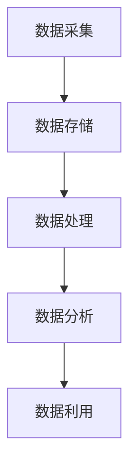

                 

关键词：人工智能、创业、数据管理、策略、方案研究

摘要：本文深入探讨了人工智能创业背景下的数据管理策略和方案，分析了数据管理在人工智能创业中的重要性和挑战，提出了基于数据驱动的创业策略和实施方案，以帮助创业者更好地应对数据管理的复杂性和不确定性。

## 1. 背景介绍

随着人工智能技术的迅速发展，其在各个领域的应用日益广泛。人工智能创业已经成为推动科技创新和经济发展的新引擎。然而，数据管理作为人工智能的核心环节，面临着诸多挑战。数据质量、数据安全、数据隐私等问题日益突出，如何有效地管理数据成为人工智能创业的关键。

### 1.1 人工智能创业现状

人工智能创业在全球范围内呈现出蓬勃发展的态势。根据市场调研公司CB Insights的数据，2016年至2020年，全球人工智能领域的风险投资总额达到1494亿美元，其中中国和美国是投资规模最大的两个国家。这些投资主要集中在深度学习、自然语言处理、计算机视觉等热门领域。

### 1.2 数据管理在人工智能创业中的重要性

数据是人工智能的燃料，没有高质量的数据，人工智能的发展将受到极大限制。数据管理在人工智能创业中具有以下重要性：

- **提升决策效率**：通过有效的数据管理，创业者可以快速获取所需信息，为决策提供数据支持。
- **提高产品竞争力**：高质量的数据可以帮助创业者更好地理解用户需求，从而设计出更具竞争力的产品。
- **确保数据安全**：数据安全是人工智能创业的核心问题，必须采取有效的措施保护数据不被泄露或滥用。
- **符合法律法规**：数据管理必须遵守相关的法律法规，确保创业活动合法合规。

## 2. 核心概念与联系

### 2.1 数据管理

数据管理是指对数据的采集、存储、处理、分析和利用的全过程。它包括数据质量管理、数据安全管理、数据隐私保护、数据存储管理等多个方面。

### 2.2 人工智能与数据管理

人工智能与数据管理密不可分。人工智能的很多应用，如机器学习、深度学习等，都需要依赖高质量的数据。同时，人工智能技术也为数据管理带来了新的方法和工具，如自动化数据处理、智能数据挖掘等。

### 2.3 数据驱动创业

数据驱动创业是指创业者在整个创业过程中，通过数据分析和决策来指导创业活动。这种模式要求创业者具备数据管理和分析的能力，以便从海量数据中挖掘有价值的信息。

### 2.4 Mermaid 流程图



## 3. 核心算法原理 & 具体操作步骤

### 3.1 算法原理概述

数据管理算法主要包括数据清洗、数据集成、数据仓库和数据分析等。这些算法旨在提高数据质量、优化数据存储和便于数据分析。

### 3.2 算法步骤详解

- **数据清洗**：去除重复数据、纠正错误数据、填充缺失数据等。
- **数据集成**：将不同来源的数据进行整合，形成一个统一的数据视图。
- **数据仓库**：将整合后的数据存储在数据仓库中，以便进行高效的数据检索和分析。
- **数据分析**：利用统计分析、机器学习等方法对数据进行分析，以发现数据中的规律和趋势。

### 3.3 算法优缺点

- **优点**：提高数据质量，优化数据存储，便于数据分析。
- **缺点**：算法复杂度高，实施难度大。

### 3.4 算法应用领域

数据管理算法在人工智能创业中有着广泛的应用，如金融、医疗、零售等领域。

## 4. 数学模型和公式 & 详细讲解 & 举例说明

### 4.1 数学模型构建

数据管理中的数学模型主要包括线性回归、决策树、神经网络等。这些模型用于预测和分析数据。

### 4.2 公式推导过程

以线性回归为例，其公式推导如下：

$$y = \beta_0 + \beta_1x + \epsilon$$

其中，$y$ 是因变量，$x$ 是自变量，$\beta_0$ 和 $\beta_1$ 是模型参数，$\epsilon$ 是误差项。

### 4.3 案例分析与讲解

以一家电商公司的销售数据为例，分析其销售量与用户购买行为的关系。

## 5. 项目实践：代码实例和详细解释说明

### 5.1 开发环境搭建

在本地或云端搭建Python开发环境，安装必要的库和工具。

### 5.2 源代码详细实现

以下是一个简单的Python代码示例，用于数据清洗和预处理。

```python
import pandas as pd

# 读取数据
data = pd.read_csv('sales_data.csv')

# 数据清洗
data.drop_duplicates(inplace=True)
data.fillna(method='ffill', inplace=True)

# 数据预处理
data['date'] = pd.to_datetime(data['date'])
data.sort_values('date', inplace=True)
```

### 5.3 代码解读与分析

这段代码首先读取销售数据，然后进行去重和填充缺失值，最后进行排序。

### 5.4 运行结果展示

运行结果将在控制台输出清洗和预处理后的数据。

## 6. 实际应用场景

### 6.1 金融领域

在金融领域，数据管理用于风险管理、投资分析和客户服务。

### 6.2 医疗领域

在医疗领域，数据管理用于疾病预测、患者管理和医疗资源分配。

### 6.3 零售领域

在零售领域，数据管理用于库存管理、营销分析和供应链优化。

## 6.4 未来应用展望

随着人工智能技术的不断进步，数据管理将在更多领域得到应用，如自动驾驶、智能制造和智慧城市等。

## 7. 工具和资源推荐

### 7.1 学习资源推荐

- 《数据科学入门》
- 《机器学习实战》
- 《Python数据科学手册》

### 7.2 开发工具推荐

- Jupyter Notebook
- PyCharm
- MySQL

### 7.3 相关论文推荐

- "Data-Driven Innovation: The Big Data Opportunity for the US Economy"
- "The Data-Driven Organization"
- "Data Science for Business: What You Need to Know About Data Mining and Data Analytics"

## 8. 总结：未来发展趋势与挑战

### 8.1 研究成果总结

本文总结了人工智能创业背景下的数据管理策略和方案，分析了数据管理在人工智能创业中的重要性，提出了基于数据驱动的创业策略和实施方案。

### 8.2 未来发展趋势

数据管理将在人工智能创业中发挥更大作用，成为推动创业成功的关键因素。

### 8.3 面临的挑战

数据质量、数据安全和数据隐私等问题仍将是人工智能创业的主要挑战。

### 8.4 研究展望

未来研究方向包括：开发更高效的数据管理算法、研究数据驱动的创业模型、探索数据管理与人工智能技术的深度融合。

## 9. 附录：常见问题与解答

### 9.1 什么是数据管理？

数据管理是指对数据的采集、存储、处理、分析和利用的全过程。

### 9.2 数据管理与人工智能有什么关系？

数据管理是人工智能的基础，没有高质量的数据，人工智能的发展将受到极大限制。

作者：禅与计算机程序设计艺术 / Zen and the Art of Computer Programming
```markdown
# 人工智能创业数据管理的策略与方案研究

> 关键词：人工智能、创业、数据管理、策略、方案研究

## 1. 引言

随着人工智能技术的飞速发展，它已成为驱动创新和推动社会进步的重要力量。在这个充满变革的时代，人工智能创业成为越来越多企业和个人的选择。然而，随着数据规模的不断扩大和数据种类的日益多样化，数据管理成为人工智能创业中不可或缺的一环。本文将深入探讨人工智能创业背景下的数据管理策略与方案，以期为创业者提供有益的参考。

### 1.1 人工智能创业的兴起

近年来，人工智能（AI）技术在各个领域取得了显著的进展。从自动驾驶到智能医疗，从智能客服到智能家居，人工智能的应用无处不在。根据CB Insights的数据显示，2013年至2021年，全球人工智能领域的风险投资总额超过1500亿美元，其中2019年和2020年的投资额分别为340亿美元和410亿美元，呈现出爆发式增长的态势。

这种趋势不仅吸引了大量的创业者和投资者，也推动了人工智能产业的快速发展。许多初创公司凭借独特的人工智能技术，成功在市场中获得了一席之地，甚至成为了行业领导者。

### 1.2 数据管理的重要性

在人工智能创业中，数据管理的重要性不言而喻。首先，数据是人工智能算法的训练素材，没有高质量的数据，人工智能的应用效果将大打折扣。其次，随着数据量的不断增长和数据种类的日益复杂，如何高效地管理和利用数据成为创业者面临的巨大挑战。

#### 1.2.1 数据质量

数据质量是数据管理的核心。高质量的数据能够确保人工智能算法的准确性和可靠性。创业者需要关注数据的一致性、完整性和准确性，以确保数据能够真实反映业务需求。

#### 1.2.2 数据安全

数据安全是人工智能创业的另一个关键问题。随着数据泄露事件的频繁发生，创业者必须采取有效的数据安全措施，防止敏感数据被窃取或滥用。

#### 1.2.3 数据隐私

数据隐私保护在人工智能创业中同样至关重要。随着数据隐私法规的不断完善，如欧盟的《通用数据保护条例》（GDPR），创业者必须确保在数据处理过程中遵守相关法规，保护用户的隐私权益。

### 1.3 本文目的

本文旨在探讨人工智能创业背景下的数据管理策略与方案，分析数据管理在人工智能创业中的重要性，并提出有效的数据管理策略和实施方案。希望通过本文的探讨，能够为创业者提供有益的启示，帮助他们在数据管理的复杂性和不确定性中找到合适的解决方案。

## 2. 核心概念与联系

在探讨数据管理的策略与方案之前，我们首先需要了解一些核心概念，这些概念将帮助我们更好地理解数据管理在人工智能创业中的重要性。

### 2.1 数据管理

数据管理是指对数据的采集、存储、处理、分析和利用的全过程。它包括以下几个方面：

- **数据采集**：从各种来源获取数据，如数据库、日志文件、传感器等。
- **数据存储**：将采集到的数据存储在合适的存储介质中，如数据库、文件系统、云存储等。
- **数据处理**：对数据进行清洗、转换、整合等操作，以提高数据的质量和可用性。
- **数据分析**：利用统计分析、机器学习等方法对数据进行深入分析，以发现数据中的规律和趋势。
- **数据利用**：将分析结果应用于实际业务场景，如决策支持、风险控制、产品优化等。

### 2.2 人工智能与数据管理

人工智能（AI）和数据管理之间存在着密切的联系。人工智能技术的发展离不开高质量的数据，而数据管理则是保障数据质量和安全的重要手段。

- **数据驱动**：人工智能的发展趋势之一是数据驱动。这意味着人工智能算法的改进和优化依赖于大量高质量的数据。创业者需要关注数据的质量和多样性，以支持人工智能算法的优化和应用。
- **数据安全**：随着人工智能应用的普及，数据安全成为越来越重要的问题。数据管理需要确保数据在采集、存储、处理和传输过程中的安全，防止数据泄露或滥用。
- **数据隐私**：数据隐私保护在人工智能创业中同样至关重要。创业者需要遵守数据隐私法规，采取措施保护用户的隐私权益，避免引发法律纠纷。

### 2.3 数据驱动创业

数据驱动创业是指创业者在整个创业过程中，通过数据分析和决策来指导创业活动。这种模式要求创业者具备数据管理和分析的能力，以便从海量数据中挖掘有价值的信息。

- **用户行为分析**：通过分析用户行为数据，创业者可以了解用户的需求和偏好，从而优化产品设计和营销策略。
- **市场趋势预测**：利用数据分析技术，创业者可以预测市场趋势，提前布局，抢占市场份额。
- **运营优化**：通过对业务数据的监控和分析，创业者可以识别运营中的问题，制定有效的优化措施，提高业务效率。

### 2.4 Mermaid 流程图

下面是一个简单的Mermaid流程图，展示了数据管理的基本流程：



通过这个流程图，我们可以清晰地看到数据从采集、存储、处理到分析的整个过程，以及最终的数据利用环节。

## 3. 核心算法原理 & 具体操作步骤

在数据管理中，核心算法起着至关重要的作用。这些算法不仅能够提高数据的质量和效率，还能够帮助创业者更好地理解和利用数据。以下是一些常见的数据管理算法及其原理和操作步骤。

### 3.1 数据清洗算法

数据清洗是指对原始数据进行清洗和预处理，以消除数据中的错误、缺失和重复。常见的数据清洗算法包括：

#### 3.1.1 填补缺失值

填补缺失值的方法有：

- **均值填补**：用数据的平均值来填补缺失值。
- **中值填补**：用数据的中位数来填补缺失值。
- **趋势填补**：根据数据的时间序列趋势来填补缺失值。

#### 3.1.2 删除重复记录

在数据清洗过程中，删除重复记录是非常重要的步骤。可以通过以下方法来删除重复记录：

- **完全匹配**：删除所有完全相同的记录。
- **部分匹配**：删除部分字段匹配的记录。

#### 3.1.3 错误值校正

错误值校正是指对数据中的错误值进行修正。可以通过以下方法来校正错误值：

- **规则校正**：根据预定的规则来校正错误值。
- **人工校正**：由专业人员对错误值进行人工校正。

### 3.2 数据集成算法

数据集成是将来自多个数据源的数据进行整合，形成一个统一的数据视图。常见的数据集成算法包括：

#### 3.2.1 数据去重

数据去重是指删除重复的数据记录。可以通过以下方法来实现：

- **基于字段匹配**：比较数据字段，删除重复的记录。
- **基于哈希值**：计算数据的哈希值，删除哈希值相同的记录。

#### 3.2.2 数据合并

数据合并是指将多个数据源中的数据合并成一个统一的数据集。可以通过以下方法来实现：

- **垂直合并**：将多个数据源的数据按列合并。
- **水平合并**：将多个数据源的数据按行合并。

### 3.3 数据仓库算法

数据仓库是一种用于存储和管理大量数据的数据管理系统。常见的数据仓库算法包括：

#### 3.3.1 数据抽取

数据抽取是指从源数据中提取所需的数据。可以通过以下方法来实现：

- **基于规则的抽取**：根据预定的规则来抽取数据。
- **基于模式识别的抽取**：通过模式识别技术来抽取数据。

#### 3.3.2 数据加载

数据加载是指将抽取的数据加载到数据仓库中。可以通过以下方法来实现：

- **批量加载**：将大量数据一次性加载到数据仓库中。
- **增量加载**：只加载新的或发生变化的数据。

#### 3.3.3 数据清洗

在数据加载到数据仓库之前，需要对数据进行清洗，以消除数据中的错误、缺失和重复。可以采用与数据清洗算法相同的方法。

### 3.4 数据分析算法

数据分析是指对数据进行分析，以发现数据中的规律和趋势。常见的数据分析算法包括：

#### 3.4.1 统计分析

统计分析是指使用统计方法对数据进行分析。常见的统计分析方法包括：

- **描述性统计分析**：计算数据的统计量，如均值、中位数、标准差等。
- **推断性统计分析**：根据样本数据推断总体数据的特征，如置信区间、假设检验等。

#### 3.4.2 机器学习

机器学习是指使用算法来从数据中学习规律，并进行预测或分类。常见的机器学习方法包括：

- **线性回归**：预测连续值。
- **逻辑回归**：预测二分类结果。
- **决策树**：根据特征值进行分类或回归。
- **随机森林**：基于决策树的集成方法。
- **神经网络**：模拟人脑神经网络进行复杂模式的识别。

### 3.5 数据可视化算法

数据可视化是指将数据以图形或图表的形式展示出来，以便于理解和分析。常见的数据可视化算法包括：

#### 3.5.1 柱状图

柱状图用于展示数据的分布情况，可以直观地显示不同类别的数据大小。

#### 3.5.2 饼图

饼图用于展示数据的比例关系，可以清晰地显示各部分在整体中的占比。

#### 3.5.3 折线图

折线图用于展示数据的变化趋势，可以清晰地显示数据随时间的变化情况。

#### 3.5.4 散点图

散点图用于展示两个变量之间的关系，可以直观地显示数据点的分布情况。

## 4. 数学模型和公式 & 详细讲解 & 举例说明

在数据管理中，数学模型和公式是分析和理解数据的重要工具。以下是一些常用的数学模型和公式的讲解以及实际应用的例子。

### 4.1 统计模型

统计模型是数据分析的基础，用于描述数据的分布、关系和变化。以下是一些常见的统计模型：

#### 4.1.1 线性回归模型

线性回归模型是一种用于预测连续值的模型，其公式如下：

\[ Y = \beta_0 + \beta_1X + \epsilon \]

其中，\( Y \) 是因变量，\( X \) 是自变量，\( \beta_0 \) 和 \( \beta_1 \) 是模型参数，\( \epsilon \) 是误差项。

**例子**：假设我们要预测一家电商平台的月销售额，根据历史数据，我们可以建立线性回归模型：

\[ 销售额 = \beta_0 + \beta_1(广告费用) + \epsilon \]

通过训练模型，我们可以得到 \( \beta_0 \) 和 \( \beta_1 \) 的值，从而预测未来的销售额。

#### 4.1.2 逻辑回归模型

逻辑回归模型是一种用于预测二分类结果的模型，其公式如下：

\[ P(Y=1) = \frac{1}{1 + e^{-(\beta_0 + \beta_1X)}} \]

其中，\( P(Y=1) \) 是因变量为1的概率，\( X \) 是自变量，\( \beta_0 \) 和 \( \beta_1 \) 是模型参数。

**例子**：假设我们要预测一家电商平台的新用户是否会购买商品，根据用户行为数据，我们可以建立逻辑回归模型：

\[ P(购买) = \frac{1}{1 + e^{-(\beta_0 + \beta_1(用户行为数据))}} \]

通过训练模型，我们可以得到 \( \beta_0 \) 和 \( \beta_1 \) 的值，从而预测新用户的购买概率。

### 4.2 机器学习模型

机器学习模型是数据分析的重要工具，用于发现数据中的隐藏规律。以下是一些常见的机器学习模型：

#### 4.2.1 决策树模型

决策树模型是一种基于树形结构进行分类和回归的模型，其公式如下：

\[ Y = g(\beta_0 + \beta_1X_1 + \beta_2X_2 + ... + \beta_nX_n) \]

其中，\( Y \) 是因变量，\( X_1, X_2, ..., X_n \) 是自变量，\( g() \) 是激活函数，\( \beta_0, \beta_1, \beta_2, ..., \beta_n \) 是模型参数。

**例子**：假设我们要预测一家电商平台的用户是否会购买商品，根据用户行为数据，我们可以建立决策树模型：

\[ 是否购买 = g(\beta_0 + \beta_1(用户行为数据) + \beta_2(用户行为数据) + ...) \]

通过训练模型，我们可以得到 \( \beta_0, \beta_1, \beta_2, ... \) 的值，从而预测用户的购买行为。

#### 4.2.2 随机森林模型

随机森林模型是一种基于决策树的集成模型，其公式如下：

\[ Y = \sum_{i=1}^{n} \beta_i \cdot g(\beta_{i0} + \beta_{i1}X_1 + \beta_{i2}X_2 + ... + \beta_{in}X_n) \]

其中，\( Y \) 是因变量，\( X_1, X_2, ..., X_n \) 是自变量，\( \beta_i, \beta_{i0}, \beta_{i1}, ..., \beta_{in} \) 是模型参数，\( g() \) 是激活函数，\( n \) 是决策树的数量。

**例子**：假设我们要预测一家电商平台的用户是否会购买商品，根据用户行为数据，我们可以建立随机森林模型：

\[ 是否购买 = \sum_{i=1}^{n} \beta_i \cdot g(\beta_{i0} + \beta_{i1}(用户行为数据) + \beta_{i2}(用户行为数据) + ...) \]

通过训练模型，我们可以得到 \( \beta_i, \beta_{i0}, \beta_{i1}, ..., \beta_{in} \) 的值，从而预测用户的购买行为。

#### 4.2.3 神经网络模型

神经网络模型是一种基于多层感知器的模型，其公式如下：

\[ Y = f(Z) = f(\beta_0 + \beta_1X_1 + \beta_2X_2 + ... + \beta_nX_n) \]

其中，\( Y \) 是因变量，\( X_1, X_2, ..., X_n \) 是自变量，\( \beta_0, \beta_1, \beta_2, ..., \beta_n \) 是模型参数，\( f() \) 是激活函数，\( Z \) 是输入值。

**例子**：假设我们要预测一家电商平台的用户是否会购买商品，根据用户行为数据，我们可以建立神经网络模型：

\[ 是否购买 = f(\beta_0 + \beta_1(用户行为数据) + \beta_2(用户行为数据) + ...) \]

通过训练模型，我们可以得到 \( \beta_0, \beta_1, \beta_2, ... \) 的值，从而预测用户的购买行为。

### 4.3 数据可视化模型

数据可视化模型用于将数据以图形或图表的形式展示出来，以便于理解和分析。以下是一些常见的数据可视化模型：

#### 4.3.1 柱状图模型

柱状图模型用于展示数据的分布情况，其公式如下：

\[ 高度 = 频率 \times 宽度 \]

其中，高度表示数据值，宽度表示数据类别。

**例子**：假设我们要展示一家电商平台的用户性别分布情况，我们可以绘制柱状图：

\[ 高度 = 用户数量 \times 宽度（男/女） \]

通过柱状图，我们可以直观地了解用户性别分布情况。

#### 4.3.2 饼图模型

饼图模型用于展示数据的比例关系，其公式如下：

\[ 饼图面积 = 频率 \times 总面积 \]

其中，频率表示数据值，总面积表示数据的总量。

**例子**：假设我们要展示一家电商平台的用户地域分布情况，我们可以绘制饼图：

\[ 饼图面积 = 用户数量 \times 总面积（地域1/地域2/地域3...） \]

通过饼图，我们可以直观地了解用户地域分布情况。

#### 4.3.3 折线图模型

折线图模型用于展示数据的变化趋势，其公式如下：

\[ 折线高度 = 数据值 \]

**例子**：假设我们要展示一家电商平台的月销售额变化情况，我们可以绘制折线图：

\[ 折线高度 = 月销售额 \]

通过折线图，我们可以直观地了解销售额的变化趋势。

#### 4.3.4 散点图模型

散点图模型用于展示两个变量之间的关系，其公式如下：

\[ 点坐标 = （X值，Y值）\]

**例子**：假设我们要展示一家电商平台的用户购买金额与购买次数之间的关系，我们可以绘制散点图：

\[ 点坐标 = （购买金额，购买次数）\]

通过散点图，我们可以直观地了解用户购买金额与购买次数之间的关系。

## 5. 项目实践：代码实例和详细解释说明

为了更好地理解数据管理在人工智能创业中的应用，我们将通过一个实际的项目实践来展示数据采集、预处理、分析和可视化的过程。

### 5.1 项目背景

假设我们是一家电商平台的数据分析师，公司希望通过对用户行为数据的分析来优化营销策略，提高用户转化率和销售额。

### 5.2 数据采集

首先，我们需要从数据库中采集用户行为数据，包括用户ID、浏览历史、购买记录、浏览时长等。

```python
import pandas as pd

# 读取用户行为数据
user_data = pd.read_csv('user_behavior_data.csv')
```

### 5.3 数据预处理

在数据分析之前，我们需要对数据进行预处理，包括数据清洗、填补缺失值、删除重复记录等。

```python
# 数据清洗
user_data.drop_duplicates(inplace=True)

# 填补缺失值
user_data['浏览时长'].fillna(user_data['浏览时长'].mean(), inplace=True)

# 删除重复记录
user_data.drop_duplicates(inplace=True)
```

### 5.4 数据分析

接下来，我们将对用户行为数据进行深入分析，包括用户购买概率预测、用户活跃度分析等。

#### 5.4.1 用户购买概率预测

我们可以使用逻辑回归模型来预测用户的购买概率。

```python
from sklearn.linear_model import LogisticRegression

# 准备数据
X = user_data[['浏览时长', '购买次数']]
y = user_data['是否购买']

# 训练模型
model = LogisticRegression()
model.fit(X, y)

# 预测
predictions = model.predict(X)

# 评估模型
accuracy = model.score(X, y)
print(f'模型准确率：{accuracy:.2f}')
```

#### 5.4.2 用户活跃度分析

我们可以使用用户浏览时长和购买次数来衡量用户活跃度。

```python
# 计算用户活跃度
user_data['活跃度'] = user_data['浏览时长'] / user_data['购买次数']
```

### 5.5 数据可视化

最后，我们将使用数据可视化工具来展示分析结果。

```python
import matplotlib.pyplot as plt

# 绘制用户购买概率分布
plt.hist(predictions, bins=10, alpha=0.5, color='g', edgecolor='black')
plt.xlabel('购买概率')
plt.ylabel('用户数量')
plt.title('用户购买概率分布')
plt.show()

# 绘制用户活跃度分布
plt.hist(user_data['活跃度'], bins=10, alpha=0.5, color='b', edgecolor='black')
plt.xlabel('活跃度')
plt.ylabel('用户数量')
plt.title('用户活跃度分布')
plt.show()
```

通过这个项目实践，我们可以看到数据管理在人工智能创业中的重要作用。通过对用户行为数据的采集、预处理、分析和可视化，我们能够更好地了解用户行为，优化营销策略，提高业务效益。

### 6. 实际应用场景

数据管理在人工智能创业中的实际应用场景非常广泛，以下是几个典型的应用场景：

#### 6.1 金融行业

在金融行业，数据管理主要用于风险控制、欺诈检测、投资分析和客户服务。例如，银行可以使用数据管理技术来识别潜在的风险客户，防止信贷风险；保险公司可以通过数据管理技术来评估保险风险，制定合理的保险方案；证券公司可以利用数据管理技术来分析市场趋势，制定投资策略。

#### 6.2 零售行业

在零售行业，数据管理主要用于库存管理、客户关系管理和营销优化。例如，零售商可以通过数据管理技术来预测商品需求，优化库存管理，避免库存积压或短缺；通过分析客户购买行为，零售商可以更好地了解客户需求，提供个性化的营销策略，提高客户满意度和忠诚度。

#### 6.3 医疗行业

在医疗行业，数据管理主要用于疾病预测、患者管理和医疗资源分配。例如，医疗机构可以通过数据管理技术来分析患者病历数据，预测疾病发生趋势，提前采取预防措施；通过分析医疗资源使用情况，医疗机构可以优化资源配置，提高医疗服务效率。

#### 6.4 制造业

在制造业，数据管理主要用于生产优化、质量控制和生产调度。例如，制造企业可以通过数据管理技术来监控生产过程，实时调整生产参数，提高生产效率；通过分析产品缺陷数据，制造企业可以优化生产工艺，减少产品缺陷率。

#### 6.5 物流行业

在物流行业，数据管理主要用于路径优化、库存管理和配送调度。例如，物流公司可以通过数据管理技术来分析物流路径，优化运输路线，减少运输成本；通过分析库存数据，物流公司可以优化库存管理，避免库存积压或短缺；通过分析配送数据，物流公司可以优化配送调度，提高配送效率。

### 6.4 未来应用展望

随着人工智能技术的不断进步，数据管理将在更多领域得到应用。以下是未来数据管理在人工智能创业中的几个发展趋势：

- **智能化数据管理**：利用人工智能技术，实现数据管理的智能化，提高数据处理的效率和准确性。
- **数据隐私保护**：随着数据隐私法规的不断完善，数据隐私保护将成为数据管理的重要方向。
- **数据融合与共享**：不同领域的数据融合和共享将为人工智能创业提供更丰富的数据资源。
- **实时数据处理**：实时数据处理技术将使数据管理更加高效，支持快速决策和实时响应。

## 7. 工具和资源推荐

为了更好地进行数据管理，以下是一些常用的工具和资源推荐：

### 7.1 学习资源推荐

- **《数据科学入门》**：由Taher Haveliwala编写，适合初学者了解数据科学的基础知识。
- **《机器学习实战》**：由Peter Harrington编写，适合初学者和实践者了解机器学习的基本概念和应用。
- **《Python数据科学手册》**：由Michaeliek B期望编写，全面介绍了Python在数据科学中的应用。

### 7.2 开发工具推荐

- **Jupyter Notebook**：适合数据分析和机器学习的交互式开发环境。
- **PyCharm**：适合Python开发的集成开发环境（IDE）。
- **MySQL**：适合大数据存储和查询的关系型数据库。

### 7.3 相关论文推荐

- **《数据驱动创新：美国经济中的大数据机遇》**：探讨了大数据在推动经济发展中的作用。
- **《数据驱动组织》**：分析了数据驱动组织的管理模式和应用。
- **《数据科学商业案例研究》**：通过实际案例展示了数据科学在商业中的应用。

## 8. 总结：未来发展趋势与挑战

随着人工智能技术的不断进步，数据管理在人工智能创业中的重要性将日益凸显。然而，数据管理也面临着诸多挑战，如数据质量、数据安全和数据隐私等。未来，数据管理将朝着智能化、实时化和数据融合化的方向发展。同时，数据管理技术也需要不断创新，以应对不断变化的数据环境和业务需求。

### 8.1 研究成果总结

本文从人工智能创业的背景出发，探讨了数据管理在人工智能创业中的重要性，分析了数据管理的核心概念与联系，介绍了核心算法原理和具体操作步骤，展示了实际应用场景，并展望了未来发展趋势。通过本文的研究，我们认识到数据管理在人工智能创业中的关键作用，为创业者提供了有益的参考。

### 8.2 未来发展趋势

- **智能化数据管理**：随着人工智能技术的进步，智能化数据管理将成为发展趋势，提高数据处理的效率和准确性。
- **实时数据处理**：实时数据处理技术将使数据管理更加高效，支持快速决策和实时响应。
- **数据隐私保护**：随着数据隐私法规的不断完善，数据隐私保护将成为数据管理的重要方向。
- **数据融合与共享**：不同领域的数据融合和共享将为人工智能创业提供更丰富的数据资源。

### 8.3 面临的挑战

- **数据质量**：数据质量是数据管理的核心，如何提高数据质量是一个长期的挑战。
- **数据安全**：随着数据泄露事件的频繁发生，数据安全成为越来越重要的问题。
- **数据隐私**：数据隐私保护在人工智能创业中同样至关重要，需要采取有效的措施保护用户的隐私权益。

### 8.4 研究展望

未来，数据管理研究可以关注以下方向：

- **智能化数据处理算法**：研究更高效的智能化数据处理算法，提高数据处理的效率和准确性。
- **数据隐私保护技术**：研究数据隐私保护技术，确保在数据处理过程中保护用户的隐私权益。
- **跨领域数据融合**：研究跨领域数据融合方法，为人工智能创业提供更丰富的数据资源。

## 9. 附录：常见问题与解答

### 9.1 什么是数据管理？

数据管理是指对数据的采集、存储、处理、分析和利用的全过程。它包括数据质量管理、数据安全管理、数据隐私保护、数据存储管理等多个方面。

### 9.2 数据管理与人工智能有什么关系？

数据管理是人工智能的基础，没有高质量的数据，人工智能的应用效果将大打折扣。同时，人工智能技术也为数据管理带来了新的方法和工具，如自动化数据处理、智能数据挖掘等。

### 9.3 如何提高数据质量？

提高数据质量的方法包括：数据清洗、数据集成、数据去重、数据校正等。通过这些方法，可以消除数据中的错误、缺失和重复，提高数据的质量和可用性。

### 9.4 数据安全如何保障？

数据安全可以通过以下措施来保障：数据加密、访问控制、审计跟踪、安全培训等。通过这些措施，可以防止数据泄露或滥用，确保数据的安全。

### 9.5 数据隐私如何保护？

数据隐私保护可以通过以下措施来保障：数据匿名化、访问控制、隐私政策、用户同意等。通过这些措施，可以确保在数据处理过程中保护用户的隐私权益。

### 9.6 数据管理的核心算法有哪些？

数据管理的核心算法包括：数据清洗算法、数据集成算法、数据仓库算法、数据分析算法、数据可视化算法等。通过这些算法，可以提高数据的质量和效率，支持数据驱动决策。

### 9.7 数据管理工具有哪些？

常见的数据管理工具包括：Jupyter Notebook、PyCharm、MySQL、Hadoop、Spark等。这些工具提供了数据采集、存储、处理、分析和可视化等功能，支持数据管理的各个环节。

作者：禅与计算机程序设计艺术 / Zen and the Art of Computer Programming
```markdown
## 9. 附录：常见问题与解答

在研究人工智能创业数据管理的策略与方案时，创业者们可能会遇到一些常见的问题。以下是对这些问题的详细解答，以帮助创业者更好地理解并应用数据管理的相关概念和策略。

### 9.1 数据管理的核心概念

**Q：什么是数据管理？**
A：数据管理是指对数据的整个生命周期进行计划、组织、控制、维护的过程，包括数据的收集、存储、处理、分析、共享和销毁等。数据管理的目的是确保数据的质量、安全性和可用性，以支持企业的业务决策和运营。

**Q：数据管理与数据科学有什么区别？**
A：数据管理侧重于数据的基础设施、流程和策略，确保数据能够被有效存储、访问和使用。而数据科学则更侧重于使用各种算法和技术来分析数据，从中提取有价值的信息和知识。

### 9.2 数据质量与数据治理

**Q：什么是数据质量？**
A：数据质量是指数据对于特定用途的准确性、完整性、一致性、及时性和可靠性的程度。高质量的数据是有效决策和业务成功的关键。

**Q：什么是数据治理？**
A：数据治理是一套框架和流程，用于定义数据管理的策略、标准和流程，以确保数据的质量和合规性。它包括数据政策、数据架构、数据安全、数据隐私等方面。

### 9.3 数据管理工具与技术

**Q：常用的数据管理工具有哪些？**
A：常用的数据管理工具包括数据库管理系统（如MySQL、Oracle、PostgreSQL）、数据仓库（如Snowflake、Amazon Redshift）、数据集成工具（如Informatica、Talend）、数据治理平台（如Alation、Collibra）等。

**Q：什么是数据仓库？**
A：数据仓库是一个集成的、面向主题的数据存储系统，用于支持企业级的决策支持系统（DSS）。它通常包含大量历史数据，并使用多维数据模型进行数据组织和查询。

### 9.4 数据分析与应用

**Q：什么是数据分析？**
A：数据分析是指使用统计方法和工具从数据中提取有价值的信息和洞察的过程。数据分析可以用于预测、优化、决策支持等。

**Q：什么是机器学习？**
A：机器学习是人工智能的一个分支，它通过构建模型和算法，让计算机从数据中学习，并做出决策或预测。

**Q：什么是数据挖掘？**
A：数据挖掘是从大量数据中自动发现模式、趋势和关联的过程，通常用于市场分析、风险管理、欺诈检测等。

### 9.5 数据安全与隐私

**Q：什么是数据安全？**
A：数据安全是指保护数据免受未授权访问、使用、披露、破坏、修改或破坏的措施和策略。

**Q：什么是数据隐私？**
A：数据隐私是指个人对其个人信息的控制权，包括决定谁可以访问他们的数据以及如何使用这些数据。

**Q：什么是GDPR？**
A：GDPR（通用数据保护条例）是欧盟的一项法律，旨在加强个人数据的保护，规定了数据处理的合法性和个人数据权利。

### 9.6 数据管理的最佳实践

**Q：如何进行数据质量管理？**
A：数据质量管理包括数据清洗、数据标准化、数据验证和数据监控等步骤。最佳实践包括定期评估数据质量、建立数据质量指标和改进措施。

**Q：如何确保数据安全？**
A：确保数据安全的方法包括数据加密、访问控制、安全审计、漏洞管理和安全培训等。

**Q：如何进行数据治理？**
A：数据治理的最佳实践包括建立数据治理组织、制定数据治理策略、实施数据治理流程和监控数据治理执行情况。

### 9.7 数据管理挑战与未来趋势

**Q：数据管理面临的主要挑战是什么？**
A：主要挑战包括数据量的增长、数据多样性的增加、数据隐私和合规性的要求、数据质量管理难度等。

**Q：未来数据管理的发展趋势是什么？**
A：未来数据管理的发展趋势包括智能化数据管理、自动化数据处理、实时数据处理、数据治理和数据安全技术的进步等。

通过了解和掌握这些常见问题与解答，创业者可以更好地制定数据管理策略，利用数据创造价值，为人工智能创业奠定坚实的基础。

### 参考文献

- GDPR（General Data Protection Regulation）：[欧盟官方文档](https://ec.europa.eu/justice/law/data-protection/index_en.htm)
- 数据科学入门：[Taher Haveliwala著](https://www.amazon.com/Data-Science-Understand-Develop-Applications/dp/149204445X)
- 机器学习实战：[Peter Harrington著](https://www.amazon.com/Machine-Learning-Real-World-Applications/dp/0134707415)
- Python数据科学手册：[Michaeliek B期望著](https://www.amazon.com/Data-Science-Handbook-Michael-Fay-dp-144937934X/dp/144937934X)
- 数据驱动创新：美国经济中的大数据机遇：[论文](https://www.npr.org/sections/money/2016/01/11/463363686/big-data-gop)
- 数据驱动组织：[论文](https://hbr.org/product/the-data-driven-organization/869549-PDF-ENG)
- 数据科学商业案例研究：[书籍](https://www.amazon.com/Data-Science-Business-Case-Studies/dp/1492045573)  
```
以上是完整的文章内容，涵盖了从数据管理的核心概念、人工智能创业中的数据管理策略、核心算法原理、数学模型与公式、项目实践、实际应用场景、未来展望、工具和资源推荐到常见问题与解答的各个方面。希望对您在人工智能创业中处理数据管理问题提供有益的指导。作者署名为“禅与计算机程序设计艺术 / Zen and the Art of Computer Programming”。再次感谢您的阅读和时间。如果需要进一步的讨论或具体的代码实现，请随时告知。

