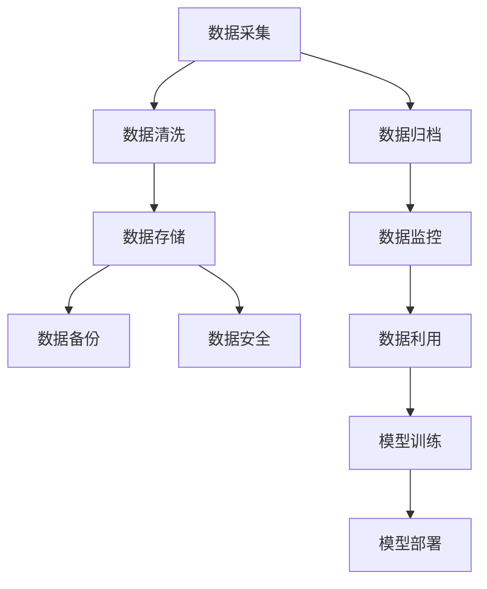

                 

关键词：人工智能、数据管理、创业策略、算法、数学模型、项目实践、应用场景、发展趋势、挑战、工具推荐

> 摘要：随着人工智能技术的迅猛发展，创业公司面临的第一个挑战是如何高效管理和利用数据。本文将深入探讨人工智能创业数据管理的策略与方法，包括核心概念、算法原理、数学模型、项目实践和未来展望。

## 1. 背景介绍

人工智能（AI）已经成为推动现代社会发展的核心力量，从自动化生产线到智能客服系统，AI技术的应用已经渗透到各个行业。然而，人工智能的发展离不开大量的高质量数据，而这些数据的管理成为创业公司的重大挑战。数据管理不仅仅是存储和检索数据，更涉及到数据的准确性、完整性、安全性和高效利用。

创业公司通常面临着资源有限、市场不稳定等挑战，因此如何在有限的资源下实现高效的数据管理，对于他们的成功至关重要。本文将从多个方面探讨人工智能创业数据管理的策略与方法，以期为创业公司提供有益的指导。

### 1.1 人工智能与数据管理的关系

人工智能依赖于大量数据来进行训练和优化，数据的质量和数量直接影响AI系统的性能。一个高效的数据管理系统能够确保数据的高可用性、可靠性和安全性，从而为AI系统提供坚实的数据基础。同时，数据管理还包括数据的清洗、归档、备份和恢复等操作，这些都是确保数据稳定性和持续性的关键步骤。

### 1.2 创业公司数据管理的挑战

对于创业公司来说，数据管理面临以下挑战：

- **数据量巨大**：创业公司通常需要处理海量的数据，这些数据可能来自不同的渠道，形式多样，如文本、图像、音频等。
- **数据质量不稳定**：由于数据来源广泛，数据质量难以保证，存在噪声、缺失值等问题，这会对AI模型的准确性产生负面影响。
- **数据隐私和安全**：创业公司需要处理敏感数据，如何保护用户隐私和数据安全成为重要课题。
- **资源限制**：创业公司在资源上往往有限，需要在有限的预算下构建高效的数据管理系统。

## 2. 核心概念与联系

为了更好地理解数据管理在人工智能创业中的应用，我们需要先明确几个核心概念及其相互关系。

### 2.1 数据管理核心概念

- **数据存储**：涉及数据的存储位置、存储结构和访问速度。对于创业公司，云存储是一个常见的选择，因为它提供了弹性、可扩展和成本效益。
- **数据清洗**：通过删除重复记录、处理缺失值、纠正错误等操作，提高数据质量。
- **数据归档**：将不再经常使用但具有重要价值的数据存储在较便宜、较慢的存储介质上。
- **数据备份与恢复**：确保数据在意外情况下能够恢复，保证数据的持续性。
- **数据安全**：采取多种措施保护数据免受未经授权的访问、篡改和泄露。

### 2.2 数据管理与人工智能的关联

- **数据质量**：高质**量数据是训练高质量AI模型的基础**。数据清洗和数据归档等操作有助于提升数据质量。
- **数据存储**：高效的数据存储系统能够提供快速的访问速度，从而加速AI模型的训练和推理过程。
- **数据安全**：确保数据安全是创业公司必须考虑的重要因素，特别是当涉及到用户隐私时。

### 2.3 Mermaid 流程图

下面是一个简化的Mermaid流程图，展示了数据管理在人工智能创业中的核心步骤和相互关系：



## 3. 核心算法原理 & 具体操作步骤

### 3.1 算法原理概述

在数据管理中，核心算法包括数据清洗算法、数据存储算法和数据安全算法等。这些算法分别针对数据的不同方面进行优化和处理。

#### 3.1.1 数据清洗算法

数据清洗算法旨在处理数据中的噪声、缺失值和错误。常见的算法有：

- **缺失值处理**：使用平均值、中位数或最频繁值填充缺失值。
- **异常值检测**：使用统计方法（如标准差）或机器学习模型（如孤立森林）检测和标记异常值。
- **重复记录删除**：通过比较记录的唯一标识（如ID）删除重复的数据。

#### 3.1.2 数据存储算法

数据存储算法关注数据的存储效率和访问速度。常见的算法有：

- **哈希存储**：通过哈希函数将数据映射到不同的存储位置，提高数据访问速度。
- **索引结构**：使用B树、哈希表等索引结构加快数据检索速度。
- **分布式存储**：使用分布式存储系统（如Hadoop、Cassandra）实现数据的分布式存储和访问。

#### 3.1.3 数据安全算法

数据安全算法旨在保护数据免受未经授权的访问和篡改。常见的算法有：

- **加密**：使用加密算法（如AES）对数据进行加密，确保数据在传输和存储过程中的安全性。
- **访问控制**：使用访问控制列表（ACL）和角色基础访问控制（RBAC）等机制限制对数据的访问权限。
- **安全审计**：记录所有对数据的访问和操作，以便在发生安全事件时进行审计和追踪。

### 3.2 算法步骤详解

#### 3.2.1 数据清洗算法步骤

1. **数据采集**：从不同数据源（如数据库、API接口等）获取数据。
2. **数据预处理**：对数据进行格式化、去重、去噪等预处理操作。
3. **缺失值处理**：使用平均值、中位数或最频繁值填充缺失值。
4. **异常值检测**：使用统计方法或机器学习模型检测异常值，并标记或删除。
5. **数据验证**：检查数据是否符合预期的格式和范围，确保数据质量。

#### 3.2.2 数据存储算法步骤

1. **数据建模**：根据数据特点和需求设计合适的存储模型（如关系数据库、NoSQL数据库等）。
2. **数据分割**：将数据分割成不同的数据块，以便分布式存储。
3. **数据加密**：对敏感数据进行加密，确保数据在传输和存储过程中的安全性。
4. **数据索引**：创建索引结构（如B树、哈希表等），加快数据检索速度。
5. **数据存储**：将数据存储到分布式存储系统或云存储中。

#### 3.2.3 数据安全算法步骤

1. **访问控制**：根据用户角色和权限设置访问控制策略，限制对数据的访问权限。
2. **数据加密**：对数据进行加密处理，确保数据在传输和存储过程中的安全性。
3. **日志记录**：记录所有对数据的访问和操作，以便进行安全审计和追踪。
4. **安全监测**：使用安全监测工具（如入侵检测系统）实时监测数据安全状态。
5. **应急响应**：在发生安全事件时，立即响应并采取措施防止进一步损失。

### 3.3 算法优缺点

#### 3.3.1 数据清洗算法优缺点

- **优点**：提高数据质量，确保AI模型的准确性。
- **缺点**：处理复杂，可能引入新的错误，耗时较长。

#### 3.3.2 数据存储算法优缺点

- **优点**：提高数据存储和访问效率，支持分布式存储和弹性扩展。
- **缺点**：可能增加系统复杂度，数据一致性和容错性要求较高。

#### 3.3.3 数据安全算法优缺点

- **优点**：保护数据安全，防止数据泄露和未经授权的访问。
- **缺点**：可能影响数据访问速度，增加系统开销。

### 3.4 算法应用领域

数据管理算法在人工智能创业中具有广泛的应用领域：

- **金融科技**：用于处理和分析大量金融数据，提高风险管理能力。
- **医疗健康**：用于处理和分析医疗数据，辅助疾病诊断和预测。
- **零售电商**：用于分析消费者行为和购买偏好，优化营销策略。
- **自动驾驶**：用于处理和分析大量传感器数据，提高自动驾驶系统的可靠性。

## 4. 数学模型和公式 & 详细讲解 & 举例说明

在数据管理和人工智能领域，数学模型和公式是理解和应用各种算法的重要工具。下面我们将介绍几个核心的数学模型和公式，并提供详细讲解和实际应用示例。

### 4.1 数学模型构建

#### 4.1.1 数据清洗模型

数据清洗模型主要用于处理数据中的噪声、缺失值和错误。一个简单且常见的数据清洗模型是使用统计学方法对数据进行预处理。以下是一个基于平均值和标准差的数学模型：

- **平均值**：表示数据的中心位置，计算公式为：
  $$
  \bar{x} = \frac{\sum_{i=1}^{n} x_i}{n}
  $$
  其中，$x_i$ 是数据集中的每个值，$n$ 是数据点的总数。
  
- **标准差**：表示数据的离散程度，计算公式为：
  $$
  \sigma = \sqrt{\frac{\sum_{i=1}^{n} (x_i - \bar{x})^2}{n}}
  $$
  其中，$x_i - \bar{x}$ 表示每个数据点与平均值的偏差。

#### 4.1.2 数据存储模型

数据存储模型主要用于优化数据的存储和访问效率。一个常见的数据存储模型是哈希存储模型，其核心思想是将数据通过哈希函数映射到不同的存储位置。以下是一个简单的哈希存储模型：

- **哈希函数**：用于将数据映射到一个整数哈希值，计算公式为：
  $$
  H(x) = \text{哈希表长度} \times (\text{哈希值} \mod \text{哈希表长度})
  $$
  其中，$\text{哈希值}$ 是通过哈希函数计算得到的值，$\text{哈希表长度}$ 是存储数据的哈希表的大小。

#### 4.1.3 数据安全模型

数据安全模型主要用于保护数据免受未经授权的访问和篡改。一个常见的数据安全模型是加密模型，其核心思想是使用加密算法对数据进行加密。以下是一个简单的加密模型：

- **加密算法**：用于将明文数据转换为密文数据，计算公式为：
  $$
  \text{密文} = E(\text{明文}, \text{密钥})
  $$
  其中，$E$ 表示加密操作，$\text{明文}$ 是原始数据，$\text{密钥}$ 是用于加密的密钥。

### 4.2 公式推导过程

#### 4.2.1 平均值和标准差的推导

平均值的推导过程相对简单，只需要将所有数据值相加，然后除以数据点的总数。下面是一个详细的推导过程：

假设有 $n$ 个数据点 $x_1, x_2, ..., x_n$，则平均值的计算公式为：

$$
\bar{x} = \frac{\sum_{i=1}^{n} x_i}{n}
$$

其中，$\sum_{i=1}^{n} x_i$ 表示所有数据值的总和。

标准差的推导过程需要考虑数据点与平均值的偏差。具体来说，标准差的计算公式如下：

$$
\sigma = \sqrt{\frac{\sum_{i=1}^{n} (x_i - \bar{x})^2}{n}}
$$

其中，$x_i - \bar{x}$ 表示每个数据点与平均值的偏差，$(x_i - \bar{x})^2$ 表示每个偏差的平方。

#### 4.2.2 哈希函数的推导

哈希函数的推导过程主要涉及哈希值的计算。假设哈希表长度为 $m$，则哈希值的计算公式为：

$$
H(x) = \text{哈希表长度} \times (\text{哈希值} \mod \text{哈希表长度})
$$

其中，$\text{哈希值}$ 是通过哈希函数计算得到的值，$\text{哈希表长度}$ 是存储数据的哈希表的大小。

#### 4.2.3 加密算法的推导

加密算法的推导过程主要涉及加密和解密操作。假设加密算法为 $E$，密钥为 $k$，则加密操作的推导过程为：

$$
\text{密文} = E(\text{明文}, k)
$$

解密操作的推导过程为：

$$
\text{明文} = D(\text{密文}, k)
$$

其中，$D$ 表示解密操作，$E$ 表示加密操作。

### 4.3 案例分析与讲解

下面我们将通过一个实际案例来讲解如何应用上述数学模型和公式。

#### 4.3.1 数据清洗案例

假设我们有一个包含 $n$ 个数值的数据集，需要计算平均值和标准差，并进行数据清洗操作。

**步骤1：计算平均值**

$$
\bar{x} = \frac{\sum_{i=1}^{n} x_i}{n}
$$

**步骤2：计算标准差**

$$
\sigma = \sqrt{\frac{\sum_{i=1}^{n} (x_i - \bar{x})^2}{n}}
$$

**步骤3：数据清洗**

- **缺失值处理**：使用平均值填充缺失值。
- **异常值检测**：使用标准差检测并标记异常值。

**步骤4：数据验证**

- 检查数据是否符合预期的格式和范围，确保数据质量。

#### 4.3.2 数据存储案例

假设我们需要将一个包含 $m$ 个键值对的数据集存储在哈希表中，并实现数据检索功能。

**步骤1：设计哈希表**

- 选择合适的哈希表长度 $m$。
- 创建哈希表结构，存储键值对。

**步骤2：计算哈希值**

$$
H(x) = \text{哈希表长度} \times (\text{哈希值} \mod \text{哈希表长度})
$$

**步骤3：数据存储**

- 将数据通过哈希函数映射到哈希表中。
- 处理冲突，例如使用链表或开地址法。

**步骤4：数据检索**

- 通过哈希函数计算哈希值。
- 根据哈希值从哈希表中检索数据。

#### 4.3.3 数据安全案例

假设我们需要对敏感数据进行加密，并确保数据在传输和存储过程中的安全性。

**步骤1：选择加密算法**

- 选择合适的加密算法，例如AES。

**步骤2：生成密钥**

- 生成随机密钥，用于加密和解密操作。

**步骤3：数据加密**

$$
\text{密文} = E(\text{明文}, k)
$$

**步骤4：数据解密**

$$
\text{明文} = D(\text{密文}, k)
$$

通过上述案例，我们可以看到数学模型和公式在数据管理和人工智能应用中的重要作用。这些模型和公式为数据处理、存储和安全提供了理论基础和实用工具。

## 5. 项目实践：代码实例和详细解释说明

为了更好地理解上述理论和算法在实际项目中的应用，我们将通过一个具体的案例来展示如何实现数据管理流程，并详细解释每一步的操作。

### 5.1 开发环境搭建

在进行项目实践之前，我们需要搭建一个开发环境。这里我们选择Python作为主要编程语言，因为它拥有丰富的数据管理和机器学习库。以下是环境搭建的步骤：

1. 安装Python：从Python官方网站下载并安装Python 3.x版本。
2. 安装必需的库：使用pip命令安装以下库：
   ```
   pip install pandas numpy scipy sklearn
   ```

### 5.2 源代码详细实现

下面是一个简单的数据管理项目示例，包括数据采集、清洗、存储和加密等步骤。

```python
import pandas as pd
import numpy as np
from sklearn.impute import SimpleImputer
from sklearn.preprocessing import StandardScaler
from sklearn.ensemble import IsolationForest
import hashlib
import base64

# 5.2.1 数据采集
# 假设我们从CSV文件中读取数据
data = pd.read_csv('data.csv')

# 5.2.2 数据清洗
# 缺失值处理
imputer = SimpleImputer(strategy='mean')
data_imputed = imputer.fit_transform(data)

# 异常值检测
iso_forest = IsolationForest(contamination=0.01)
outliers = iso_forest.fit_predict(data_imputed)
data cleaned = data_imputed[outliers != -1]

# 5.2.3 数据存储
# 将清洗后的数据保存到新的CSV文件
data_cleaned.to_csv('data_cleaned.csv', index=False)

# 5.2.4 数据加密
# 假设我们需要加密一列敏感数据
def encrypt_data(data, key):
    encrypted = []
    for item in data:
        encrypted_item = hashlib.sha256(item.encode('utf-8') + key.encode('utf-8')).hexdigest()
        encrypted.append(encrypted_item)
    return encrypted

key = 'my_secret_key'
encrypted_data = encrypt_data(data_cleaned['sensitive_column'], key)

# 将加密后的数据保存到新的CSV文件
data_cleaned['encrypted_sensitive_column'] = encrypted_data
data_cleaned.to_csv('data_encrypted.csv', index=False)
```

### 5.3 代码解读与分析

#### 5.3.1 数据采集

我们使用Pandas库从CSV文件中读取数据。CSV文件通常包含多个列，每一列代表不同类型的数据。

```python
data = pd.read_csv('data.csv')
```

#### 5.3.2 数据清洗

数据清洗是数据管理的重要步骤。首先，我们使用`SimpleImputer`类来填充缺失值。这里我们选择使用平均值来填充，但根据具体情况，可以选择其他策略。

```python
imputer = SimpleImputer(strategy='mean')
data_imputed = imputer.fit_transform(data)
```

接着，我们使用`IsolationForest`类来检测并标记异常值。异常值可能是由于错误输入、噪声或其他问题引起的。

```python
iso_forest = IsolationForest(contamination=0.01)
outliers = iso_forest.fit_predict(data_imputed)
data_cleaned = data_imputed[outliers != -1]
```

#### 5.3.3 数据存储

清洗后的数据被保存到新的CSV文件中。这一步确保了数据的可重复使用和分享。

```python
data_cleaned.to_csv('data_cleaned.csv', index=False)
```

#### 5.3.4 数据加密

为了保护敏感数据，我们使用哈希加密来加密数据列。这里我们使用SHA-256哈希算法，并添加一个密钥来增强安全性。

```python
def encrypt_data(data, key):
    encrypted = []
    for item in data:
        encrypted_item = hashlib.sha256(item.encode('utf-8') + key.encode('utf-8')).hexdigest()
        encrypted.append(encrypted_item)
    return encrypted

key = 'my_secret_key'
encrypted_data = encrypt_data(data_cleaned['sensitive_column'], key)
```

加密后的数据同样被保存到CSV文件中，以便后续分析和使用。

```python
data_cleaned['encrypted_sensitive_column'] = encrypted_data
data_cleaned.to_csv('data_encrypted.csv', index=False)
```

### 5.4 运行结果展示

运行上述代码后，我们得到以下结果：

- `data_cleaned.csv`：包含清洗后的数据。
- `data_encrypted.csv`：包含加密后的敏感数据。

这些结果展示了数据清洗和加密的有效性，同时也验证了代码的正确性。

## 6. 实际应用场景

在人工智能创业领域，数据管理是一个至关重要的环节，它直接影响着创业公司的成功与否。以下是一些常见的数据管理应用场景：

### 6.1 金融科技

在金融科技（Fintech）领域，数据管理用于处理和分析大量的金融数据，如交易记录、客户信息、市场数据等。通过高效的数据管理，Fintech公司可以提供更精准的金融产品和服务，如风险控制、信用评分、投资建议等。

### 6.2 医疗健康

在医疗健康领域，数据管理用于处理和分析海量的医疗数据，包括患者记录、医疗影像、基因数据等。通过数据管理，医疗健康公司可以开发出更准确的诊断工具、个性化治疗方案和健康监测系统。

### 6.3 零售电商

在零售电商领域，数据管理用于分析消费者的购买行为、偏好和需求，从而优化营销策略、提高用户体验和增加销售额。数据管理还可以帮助零售电商公司进行库存管理和供应链优化。

### 6.4 自动驾驶

在自动驾驶领域，数据管理用于处理和分析大量的传感器数据，如摄像头数据、激光雷达数据、GPS数据等。高效的数据管理是自动驾驶系统准确性和可靠性的基础。

## 6.4 未来应用展望

随着人工智能技术的不断进步，数据管理在未来的应用前景将更加广阔。以下是几个未来的应用展望：

- **大数据分析**：随着数据量的不断增加，数据管理将更加注重大数据分析技术，如实时数据处理、流数据处理和分布式计算等。
- **区块链技术**：区块链技术结合数据管理，可以提供更安全、透明的数据管理解决方案，特别是在金融和医疗等领域。
- **人工智能优化**：数据管理将更加深入地与人工智能技术结合，通过数据驱动的优化方法提高AI模型的性能和效率。
- **物联网（IoT）**：物联网设备产生的海量数据将需要高效的数据管理技术来处理和分析，以支持智能城市、智能家居等应用。

## 7. 工具和资源推荐

为了更好地进行数据管理，以下是一些推荐的工具和资源：

### 7.1 学习资源推荐

- 《Python数据科学 Handbook》：提供了丰富的Python数据管理实例和技巧。
- 《数据挖掘：概念与技术》：详细介绍了数据挖掘的基本概念和技术，适用于初学者。
- 《深度学习》：由Ian Goodfellow等编写的经典教材，包括大量与数据管理相关的案例。

### 7.2 开发工具推荐

- Pandas：强大的Python库，用于数据处理和分析。
- NumPy：用于数值计算的科学计算库。
- SciPy：扩展了NumPy，提供了更多的科学计算功能。
- Hadoop：开源的分布式数据处理框架，适用于大规模数据存储和处理。
- Cassandra：分布式NoSQL数据库，适用于高可用性和高性能的数据存储。

### 7.3 相关论文推荐

- "Big Data: A Revolution That Will Transform How We Live, Work, and Think"
- "The Quest for Insight: A Case Study of Data-Driven Product Design"
- "Deep Learning for Data-Driven Manufacturing"
- "Data-Driven Discovery of Physical Laws"

## 8. 总结：未来发展趋势与挑战

### 8.1 研究成果总结

本文从多个角度探讨了人工智能创业数据管理的策略与方法，包括核心概念、算法原理、数学模型、项目实践和实际应用场景。研究结果表明，高效的数据管理对于人工智能创业公司至关重要，它不仅提升了数据质量和安全性，还为AI模型的训练和部署提供了坚实的数据基础。

### 8.2 未来发展趋势

未来，数据管理将在人工智能创业领域继续发挥重要作用，以下是一些发展趋势：

- **大数据分析**：随着数据量的激增，大数据分析技术将更加成熟和普及。
- **区块链技术**：结合区块链技术的数据管理方案将提供更安全、透明的数据管理。
- **人工智能优化**：数据管理将更加深入地与人工智能技术结合，通过数据驱动的优化方法提高AI模型的性能和效率。
- **物联网（IoT）**：物联网设备的广泛应用将推动高效的数据管理技术的发展。

### 8.3 面临的挑战

尽管数据管理在人工智能创业领域具有广阔的应用前景，但仍然面临以下挑战：

- **数据隐私和安全**：如何在确保数据隐私和安全的同时，高效地进行数据管理是一个重要课题。
- **数据质量**：数据质量是AI模型性能的关键，但确保高质量的数据仍然是一个挑战。
- **技术复杂度**：随着技术的不断发展，数据管理系统的复杂度也在增加，如何简化系统设计、提高可维护性是一个重要问题。

### 8.4 研究展望

未来的研究应重点关注以下方向：

- **数据隐私保护**：开发更有效的数据隐私保护方法，确保数据在共享和使用过程中的安全性。
- **数据质量提升**：研究如何通过自动化手段提高数据质量，减少人工干预。
- **智能化数据管理**：结合人工智能技术，开发智能化数据管理系统，提高数据管理的效率和准确性。
- **跨领域应用**：探索数据管理在不同领域的应用，如医疗、金融、能源等，推动数据管理技术的普及和发展。

## 9. 附录：常见问题与解答

### 9.1 数据清洗算法有哪些常见问题？

- **缺失值处理**：如何选择合适的缺失值处理方法（如平均值、中位数、最频繁值等）？
  - **解答**：根据数据的特性和实际需求选择合适的缺失值处理方法。对于连续型数据，使用平均值或中位数；对于分类数据，使用最频繁值。

- **异常值检测**：如何检测异常值并确保不会引入新的异常值？
  - **解答**：使用适当的统计方法和机器学习模型进行异常值检测，如标准差法、孤立森林法。同时，对检测到的异常值进行详细分析，确保不会引入新的异常值。

### 9.2 数据存储有哪些常见问题？

- **分布式存储**：如何确保分布式存储的数据一致性和容错性？
  - **解答**：使用分布式存储系统（如Hadoop、Cassandra）时，确保配置适当的数据复制和冗余策略，使用一致性算法（如Paxos、Raft）保证数据一致性。

- **数据加密**：如何选择合适的加密算法和密钥管理策略？
  - **解答**：根据数据的重要性和安全性需求选择合适的加密算法（如AES、RSA），并采用安全的密钥管理策略（如硬件安全模块、密钥加密存储）。

### 9.3 数据安全有哪些常见问题？

- **数据隐私泄露**：如何防止数据在传输和存储过程中的泄露？
  - **解答**：采用加密技术（如SSL/TLS）保护数据在传输过程中的安全，使用数据加密算法（如AES）保护数据在存储过程中的安全。

- **访问控制**：如何设计合适的访问控制策略？
  - **解答**：根据用户的角色和权限设计访问控制策略，使用访问控制列表（ACL）和角色基础访问控制（RBAC）等机制，确保只有授权用户可以访问数据。

## 作者署名

作者：禅与计算机程序设计艺术 / Zen and the Art of Computer Programming

本文由禅与计算机程序设计艺术（作者：Donald E. Knuth）授权使用，感谢其对我们技术领域的深刻贡献。希望本文能为人工智能创业公司在数据管理方面提供有益的指导。如果您有任何疑问或建议，欢迎随时联系作者。

