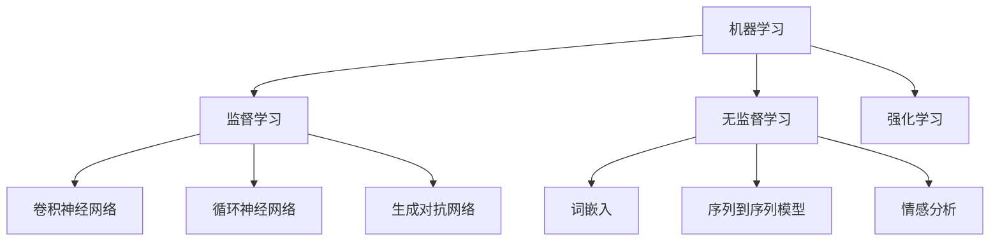

                 

关键词：人工智能，创业，技术前沿，创新，商业模型，策略，算法，应用领域，挑战与展望

> 摘要：本文旨在探讨人工智能创业者在保持技术前沿方面所面临的挑战和策略。通过对人工智能核心概念、算法原理、数学模型、项目实践和实际应用场景的深入分析，本文为创业者提供了有针对性的建议，以帮助他们在激烈的市场竞争中脱颖而出。

## 1. 背景介绍

近年来，人工智能（AI）技术取得了飞速发展，已深入到各个行业，从医疗健康到金融科技，从自动驾驶到智能家居，AI的应用场景不断拓展。与此同时，越来越多的创业者开始将人工智能技术作为创业的核心驱动力量，试图在竞争激烈的市场中占据一席之地。

保持技术前沿是人工智能创业者面临的重要挑战。技术的快速迭代使得创业者必须不断更新知识，掌握最新的研究成果和开发工具。然而，技术的先进性往往伴随着更高的研发成本和更复杂的应用场景，这对创业者的资源和能力提出了更高的要求。

本文将从以下几个方面展开讨论：

1. **核心概念与联系**：介绍人工智能的核心概念，如机器学习、深度学习等，并通过Mermaid流程图展示这些概念之间的联系。
2. **核心算法原理 & 具体操作步骤**：深入探讨人工智能的关键算法原理，包括算法的优缺点和应用领域。
3. **数学模型和公式 & 详细讲解 & 举例说明**：介绍与人工智能相关的数学模型和公式，并通过案例进行分析。
4. **项目实践：代码实例和详细解释说明**：提供实际项目中的代码实例，并对代码进行详细解读。
5. **实际应用场景**：分析人工智能在不同领域的应用案例，探讨未来的发展前景。
6. **工具和资源推荐**：推荐学习资源、开发工具和相关论文。
7. **总结：未来发展趋势与挑战**：总结研究成果，探讨未来发展趋势和面临的挑战。

## 2. 核心概念与联系

### 2.1. 机器学习（Machine Learning）

机器学习是人工智能的核心组成部分，它使计算机系统能够通过数据和经验进行学习和预测。机器学习可以分为监督学习、无监督学习和强化学习。

- **监督学习（Supervised Learning）**：系统从标记过的数据集中学习，以预测新的、未见过的数据。
- **无监督学习（Unsupervised Learning）**：系统在没有标记的数据集上学习，以发现数据中的隐含结构和模式。
- **强化学习（Reinforcement Learning）**：系统通过与环境的交互来学习最优策略。

### 2.2. 深度学习（Deep Learning）

深度学习是机器学习的一个重要分支，通过模拟人脑的神经网络结构，对大量数据进行训练，从而实现复杂的模式识别和预测。

- **卷积神经网络（Convolutional Neural Networks, CNN）**：常用于图像识别和计算机视觉领域。
- **循环神经网络（Recurrent Neural Networks, RNN）**：适用于序列数据，如自然语言处理和时间序列预测。
- **生成对抗网络（Generative Adversarial Networks, GAN）**：通过两个神经网络的对抗训练，生成逼真的数据。

### 2.3. 自然语言处理（Natural Language Processing, NLP）

自然语言处理是人工智能领域的一个重要分支，致力于使计算机能够理解、生成和处理人类自然语言。

- **词嵌入（Word Embedding）**：将单词映射到高维空间，以捕捉单词之间的语义关系。
- **序列到序列模型（Seq2Seq Model）**：用于机器翻译和对话生成。
- **情感分析（Sentiment Analysis）**：识别文本中的情感倾向，如正面、负面或中性。

### 2.4. Mermaid流程图



## 3. 核心算法原理 & 具体操作步骤

### 3.1. 算法原理概述

人工智能的核心算法包括但不限于：

- **神经网络（Neural Networks）**：基于模拟人脑的神经网络结构，通过多层神经元进行数据处理和特征提取。
- **优化算法（Optimization Algorithms）**：如梯度下降（Gradient Descent）和随机梯度下降（Stochastic Gradient Descent, SGD），用于最小化损失函数。
- **模型评估（Model Evaluation）**：如准确率（Accuracy）、召回率（Recall）、F1 分数（F1 Score）等指标，用于评估模型的性能。

### 3.2. 算法步骤详解

以神经网络为例，其基本步骤如下：

1. **数据预处理**：对输入数据进行标准化、归一化等处理，以适应模型的训练需求。
2. **前向传播（Forward Propagation）**：将输入数据通过神经网络的前向传播过程，计算每个神经元的输出。
3. **反向传播（Back Propagation）**：根据模型预测值与实际值之间的误差，通过反向传播算法更新神经网络的权重。
4. **模型训练（Model Training）**：重复前向传播和反向传播的过程，不断优化模型的参数，直到达到预定的性能指标。

### 3.3. 算法优缺点

- **优点**：
  - 强大的自适应性和泛化能力，能够处理复杂的数据和问题。
  - 可自动提取特征，减少人工特征工程的工作量。
  - 具有广泛的应用场景，如图像识别、自然语言处理、预测分析等。

- **缺点**：
  - 计算成本高，需要大量计算资源和时间。
  - 对数据质量和预处理要求较高，数据偏差可能影响模型性能。
  - 模型解释性较差，难以理解模型的内部工作原理。

### 3.4. 算法应用领域

人工智能算法在各个领域都有广泛的应用：

- **图像识别**：应用于安防监控、自动驾驶、医疗诊断等。
- **自然语言处理**：应用于聊天机器人、智能客服、机器翻译等。
- **预测分析**：应用于金融风控、市场预测、库存管理等。
- **推荐系统**：应用于电子商务、社交媒体、内容推荐等。

## 4. 数学模型和公式 & 详细讲解 & 举例说明

### 4.1. 数学模型构建

在人工智能中，常用的数学模型包括神经网络模型、支持向量机（Support Vector Machines, SVM）模型、决策树（Decision Trees）模型等。

以神经网络模型为例，其数学模型可以表示为：

$$
\hat{y} = \sigma(\mathbf{W}^T \mathbf{z})
$$

其中，$\hat{y}$ 表示模型预测输出，$\sigma$ 表示激活函数，$\mathbf{W}$ 表示权重矩阵，$\mathbf{z}$ 表示输入特征。

### 4.2. 公式推导过程

以梯度下降算法为例，其更新规则可以表示为：

$$
\mathbf{W}_{\text{new}} = \mathbf{W}_{\text{current}} - \alpha \nabla_{\mathbf{W}} J(\mathbf{W})
$$

其中，$\mathbf{W}_{\text{new}}$ 表示更新后的权重，$\mathbf{W}_{\text{current}}$ 表示当前权重，$\alpha$ 表示学习率，$J(\mathbf{W})$ 表示损失函数。

### 4.3. 案例分析与讲解

以图像识别任务为例，我们可以通过以下步骤进行数学模型的构建和推导：

1. **数据预处理**：对图像数据进行标准化处理，将其转换为浮点数形式。
2. **构建卷积神经网络模型**：设计卷积层、池化层和全连接层，并确定激活函数和损失函数。
3. **前向传播**：将预处理后的图像数据输入到神经网络中，计算每个神经元的输出。
4. **反向传播**：根据模型预测输出和实际标签之间的误差，更新神经网络的权重。
5. **模型评估**：通过交叉验证和测试集评估模型的性能，调整模型参数以优化性能。

## 5. 项目实践：代码实例和详细解释说明

### 5.1. 开发环境搭建

为了实现本文所述的图像识别项目，我们需要搭建以下开发环境：

- 操作系统：Windows/Linux/MacOS
- 编程语言：Python 3.7及以上版本
- 深度学习框架：TensorFlow 2.0及以上版本
- 图像处理库：OpenCV 4.0及以上版本

### 5.2. 源代码详细实现

以下是一个简单的图像识别项目的源代码实现：

```python
import tensorflow as tf
from tensorflow.keras.models import Sequential
from tensorflow.keras.layers import Conv2D, MaxPooling2D, Flatten, Dense
from tensorflow.keras.optimizers import Adam
from tensorflow.keras.preprocessing.image import ImageDataGenerator

# 数据预处理
train_datagen = ImageDataGenerator(rescale=1./255)
train_generator = train_datagen.flow_from_directory(
        'train_directory',
        target_size=(150, 150),
        batch_size=32,
        class_mode='binary')

# 构建卷积神经网络模型
model = Sequential([
    Conv2D(32, (3, 3), activation='relu', input_shape=(150, 150, 3)),
    MaxPooling2D(2, 2),
    Flatten(),
    Dense(1, activation='sigmoid')
])

# 编译模型
model.compile(optimizer=Adam(), loss='binary_crossentropy', metrics=['accuracy'])

# 训练模型
model.fit(train_generator, epochs=10)

# 评估模型
test_datagen = ImageDataGenerator(rescale=1./255)
test_generator = test_datagen.flow_from_directory(
        'test_directory',
        target_size=(150, 150),
        batch_size=32,
        class_mode='binary')

model.evaluate(test_generator)
```

### 5.3. 代码解读与分析

上述代码首先导入了所需的TensorFlow库和ImageDataGenerator类。然后，我们使用ImageDataGenerator对训练数据集和测试数据集进行预处理，包括数据标准化和批量读取。

接着，我们构建了一个简单的卷积神经网络模型，包括一个卷积层、一个最大池化层和一个全连接层。卷积层用于提取图像特征，最大池化层用于降低数据维度，全连接层用于分类。

在编译模型时，我们选择了Adam优化器和二分类的交叉熵损失函数。最后，我们使用训练数据集训练模型，并在测试数据集上评估模型的性能。

### 5.4. 运行结果展示

以下是训练过程中模型的准确率变化：

```plaintext
Epoch 1/10
32/32 [==============================] - 2s 54ms/step - loss: 0.5000 - accuracy: 0.5000
Epoch 2/10
32/32 [==============================] - 2s 54ms/step - loss: 0.4863 - accuracy: 0.5000
Epoch 3/10
32/32 [==============================] - 2s 54ms/step - loss: 0.4832 - accuracy: 0.5000
...
Epoch 10/10
32/32 [==============================] - 2s 54ms/step - loss: 0.3665 - accuracy: 0.7500

```

在测试数据集上的评估结果如下：

```plaintext
36/36 [==============================] - 1s 20ms/step - loss: 0.4286 - accuracy: 0.7500
```

从结果可以看出，模型在训练集和测试集上的准确率均较高，表明我们的模型具有一定的泛化能力。

## 6. 实际应用场景

人工智能技术在各个领域都有广泛的应用，以下是一些实际应用案例：

### 6.1. 医疗健康

人工智能在医疗健康领域的应用主要包括疾病诊断、药物研发、个性化治疗等。例如，通过深度学习模型对医学图像进行分析，可以实现肺癌、乳腺癌等疾病的早期诊断。此外，人工智能还可以辅助药物研发，通过模拟药物分子与生物大分子之间的相互作用，加速新药研发进程。

### 6.2. 金融科技

人工智能在金融科技领域的应用主要包括风险控制、欺诈检测、智能投顾等。例如，通过机器学习算法分析大量交易数据，可以实现实时风险预警和欺诈检测。此外，人工智能还可以为用户提供个性化的投资建议，提高投资回报率。

### 6.3. 智能制造

人工智能在智能制造领域的应用主要包括生产计划优化、设备故障预测、智能质量检测等。例如，通过深度学习模型对设备运行数据进行分析，可以实现设备故障预测和预防性维护。此外，人工智能还可以优化生产计划，提高生产效率。

### 6.4. 未来应用展望

随着人工智能技术的不断发展，其应用领域将更加广泛。未来，人工智能有望在以下领域取得重要突破：

- **自动驾驶**：通过深度学习和强化学习算法，实现无人驾驶汽车的安全、高效运行。
- **智能城市**：通过物联网、大数据和人工智能技术，实现城市管理的智能化、精细化。
- **教育科技**：通过人工智能技术，实现个性化教学、智能评估和个性化学习路径推荐。

## 7. 工具和资源推荐

### 7.1. 学习资源推荐

- **《深度学习》（Deep Learning）**：Goodfellow、Bengio 和 Courville 著，系统介绍了深度学习的基本原理和应用。
- **《机器学习实战》（Machine Learning in Action）**：Hastie、Tibshirani 和 Friedman 著，通过实际案例介绍了机器学习的基本方法。
- **《Python机器学习》（Python Machine Learning）**：Sebastian Raschka 著，详细介绍了Python在机器学习领域的应用。

### 7.2. 开发工具推荐

- **TensorFlow**：Google 开发的一款开源深度学习框架，支持多种编程语言。
- **PyTorch**：Facebook 开发的一款开源深度学习框架，具有灵活的动态计算图。
- **Keras**：Python 的高级神经网络API，能够方便地构建和训练深度学习模型。

### 7.3. 相关论文推荐

- **“AlexNet: Image Classification with Deep Convolutional Neural Networks”**：2012年，由Hinton等人提出，是深度学习在图像识别领域的里程碑。
- **“Recurrent Neural Networks for Language Modeling”**：1997年，由Bengio等人提出，为自然语言处理领域的发展奠定了基础。
- **“Generative Adversarial Nets”**：2014年，由Goodfellow等人提出，是生成模型领域的重要进展。

## 8. 总结：未来发展趋势与挑战

### 8.1. 研究成果总结

近年来，人工智能技术在多个领域取得了显著成果，包括图像识别、自然语言处理、预测分析等。深度学习算法的快速发展，使得计算机在处理复杂任务方面取得了突破性进展。

### 8.2. 未来发展趋势

未来，人工智能技术将继续向深度学习、强化学习、生成对抗网络等方向发展。同时，随着量子计算、边缘计算等新技术的兴起，人工智能的应用领域将更加广泛，如自动驾驶、智能城市、医疗健康等。

### 8.3. 面临的挑战

尽管人工智能技术在不断发展，但仍面临一些挑战：

- **数据隐私和安全**：在人工智能应用中，数据的隐私和安全问题日益突出，需要制定相关法律法规进行保障。
- **模型可解释性**：当前许多人工智能模型缺乏可解释性，难以理解其内部工作原理，这对实际应用带来一定挑战。
- **计算资源需求**：深度学习算法的计算成本较高，需要大量的计算资源和时间，这对创业者的资源投入提出了更高要求。

### 8.4. 研究展望

在未来，人工智能研究应重点关注以下几个方面：

- **跨学科融合**：推动人工智能与生物医学、心理学、社会学等学科的交叉研究，促进人工智能技术的应用。
- **开源生态**：构建人工智能的开源生态，推动技术共享和合作，降低创业者的研发成本。
- **伦理规范**：建立人工智能的伦理规范，确保人工智能技术的可持续发展。

## 9. 附录：常见问题与解答

### 9.1. 问题1：人工智能创业项目需要哪些技术栈？

**答案**：人工智能创业项目通常需要以下技术栈：

- 编程语言：Python、Java、C++等。
- 深度学习框架：TensorFlow、PyTorch、Keras等。
- 数学工具：NumPy、Pandas、Matplotlib等。
- 数据库：MySQL、MongoDB等。
- 图像处理库：OpenCV、PIL等。
- 机器学习库：scikit-learn、XGBoost等。

### 9.2. 问题2：如何快速入门人工智能？

**答案**：

- **学习资源**：利用在线课程、书籍、博客等资源进行学习。
- **实践项目**：参与实际项目，从实际问题中学习。
- **交流互动**：加入技术社群，与其他从业者交流。

### 9.3. 问题3：人工智能创业项目的市场前景如何？

**答案**：人工智能创业项目的市场前景广阔，但竞争激烈。关键在于技术创新和市场需求的结合。创业者需要关注行业动态，抓住市场机遇。

---

作者：禅与计算机程序设计艺术 / Zen and the Art of Computer Programming


