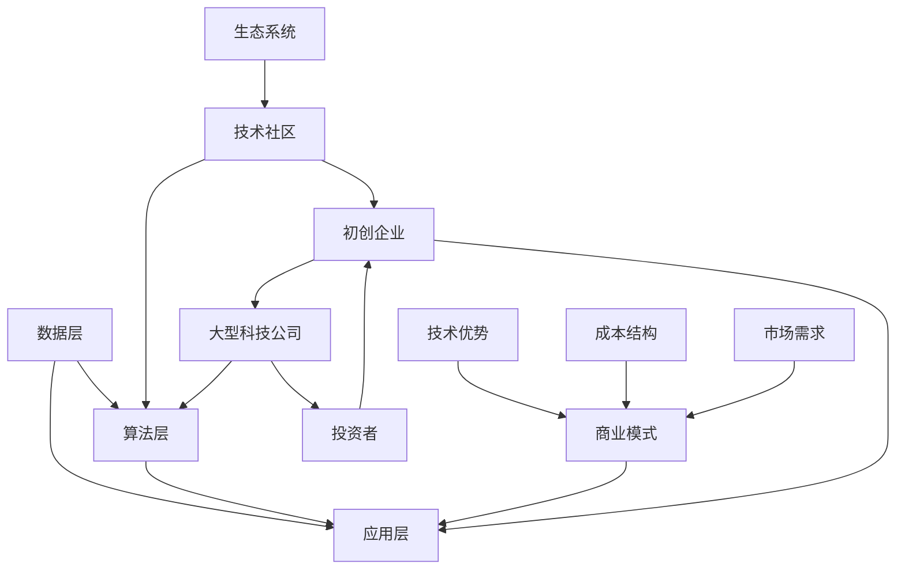

                 

关键词：人工智能，创业，融资计划，投资策略，风险评估，商业模式，资本运作

> 摘要：本文将深入探讨人工智能创业者在制定融资计划过程中所需关注的关键因素。从商业模式到风险评估，从资本运作到市场策略，我们将为读者提供一套完整的融资指南，帮助您在人工智能创业的道路上迈出坚实的步伐。

## 1. 背景介绍

人工智能（AI）作为当前科技发展的前沿领域，正日益改变着我们的生活方式和商业模式。创业者在投身这一领域时，需要面对激烈的市场竞争和复杂的技术挑战。融资，作为人工智能创业过程中的重要环节，决定了企业的生存和发展。因此，制定一个科学、可行的融资计划，成为人工智能创业成功的关键。

本文将围绕以下几个方面展开讨论：

- **核心概念与联系**：介绍人工智能创业所需了解的基础概念和行业架构。
- **核心算法原理 & 具体操作步骤**：分析关键算法原理及其应用场景。
- **数学模型和公式 & 详细讲解 & 举例说明**：讲解相关数学模型的构建和推导。
- **项目实践：代码实例和详细解释说明**：提供实际的代码实例和解读。
- **实际应用场景**：探讨人工智能在不同领域的应用。
- **未来应用展望**：预测人工智能的发展趋势和未来应用场景。
- **工具和资源推荐**：推荐学习资源和开发工具。
- **总结：未来发展趋势与挑战**：总结研究成果，展望未来。

通过以上内容的深入剖析，本文旨在为人工智能创业者提供一份详尽的融资计划指南，助力您的创业梦想成真。

### 1.1 人工智能创业的现状与挑战

人工智能创业在全球范围内呈现出蓬勃发展的态势，许多初创企业正在探索和开发各种创新应用。然而，在这一过程中，创业者们也面临着诸多挑战。首先，技术门槛较高是人工智能创业的重要障碍。人工智能领域涉及到深度学习、自然语言处理、计算机视觉等复杂技术，这些技术不仅需要丰富的理论知识，还要求具备强大的计算能力和实践经验。

其次，市场不确定性是另一大挑战。人工智能技术更新迅速，市场竞争激烈，创业者需要时刻关注行业动态，快速调整战略。此外，政策的波动和市场需求的波动也会对创业企业的生存和发展产生重大影响。

最后，融资困难是许多人工智能创业企业面临的核心问题。尽管人工智能领域吸引了大量投资，但资金竞争异常激烈，创业者需要具备出色的项目展示和说服力，才能在激烈的竞争中脱颖而出。

### 1.2 融资计划的重要性

融资计划是人工智能创业成功的关键。一个科学、周密的融资计划不仅能帮助企业获取必要的资金，还能提高企业的竞争力和市场地位。首先，融资计划能够明确企业的资金需求和资金用途，确保资金的有效分配和使用。通过详细的融资计划，创业者可以清晰地向投资者展示项目的可行性和潜力，增加投资者的信心。

其次，融资计划有助于提高企业的管理水平和运营效率。在制定融资计划的过程中，创业者需要对企业的商业模式、市场前景、技术路线等进行深入分析，这有助于发现潜在的问题和风险，从而采取相应的措施进行规避。此外，融资计划还可以促进企业内部资源的优化配置，提高企业的运营效率。

最后，融资计划有助于提高企业的知名度和影响力。通过有效的融资活动，企业可以吸引更多的关注和资源，提高品牌知名度和市场影响力。在竞争激烈的人工智能市场中，品牌影响力是企业制胜的重要因素之一。

### 1.3 融资计划的制定步骤

制定一个成功的融资计划需要系统的方法和严谨的步骤。以下是我们推荐的一系列步骤：

1. **明确融资目标和需求**：首先，创业者需要明确企业的融资目标和需求。这包括确定融资的金额、用途、期限等。明确的目标有助于后续的融资谈判和计划制定。

2. **分析市场和企业状况**：在明确融资目标后，创业者需要对市场和企业状况进行深入分析。这包括对市场需求、竞争态势、行业趋势等进行调研，评估企业的竞争优势和潜在风险。

3. **制定融资策略**：根据市场和企业状况，创业者需要制定相应的融资策略。这包括选择融资渠道、确定融资方式、设计融资结构等。合理的融资策略能够提高融资的成功率。

4. **撰写融资计划书**：融资计划书是创业者向投资者展示企业项目的重要文件。在撰写融资计划书时，创业者需要突出项目的亮点、优势、市场前景等，同时详细阐述融资用途和预期收益。

5. **进行融资路演和谈判**：撰写完融资计划书后，创业者需要进行融资路演和谈判。在路演过程中，创业者需要展示项目的核心技术和商业价值，与投资者进行深入交流，争取获得投资意向。

6. **签订融资协议并落实计划**：在融资谈判成功后，创业者需要与投资者签订融资协议，明确各方权益和责任。签订协议后，创业者需要按照计划书的要求，合理使用资金，确保项目的顺利进行。

### 1.4 融资过程中的常见问题

在融资过程中，创业者往往会遇到各种问题。以下是一些常见问题及其解决方案：

1. **融资难问题**：许多创业者面临融资难的问题。解决方案包括：增强项目的吸引力，提高项目的技术水平和商业价值；拓展融资渠道，寻找更多的潜在投资者。

2. **谈判难问题**：在融资谈判过程中，创业者可能面临谈判难度大的问题。解决方案包括：充分了解投资者的需求和利益，设计灵活的融资方案；提高谈判技巧，增强说服力。

3. **融资风险问题**：融资风险是创业者需要高度关注的问题。解决方案包括：进行充分的市场调研和风险评估，制定详细的融资计划；合理分配资金，确保资金的安全和效益。

4. **资金使用问题**：在融资成功后，创业者需要合理使用资金，确保项目的顺利进行。解决方案包括：制定详细的资金使用计划，严格按照计划执行；定期对资金使用情况进行监督和评估，确保资金使用的透明和有效。

## 2. 核心概念与联系

在制定人工智能创业融资计划之前，了解一些核心概念和行业联系是非常重要的。以下是几个关键概念及其之间的联系：

### 2.1 人工智能技术框架

人工智能（AI）技术框架是构建AI系统的核心。它通常包括以下层次：

1. **数据层**：数据是AI系统的基石。数据层涉及数据收集、存储和管理。高质量的数据可以显著提升AI模型的表现。

2. **算法层**：算法层包括各种机器学习算法和深度学习模型。这些算法可以根据数据特征进行训练，以实现特定任务，如图像识别、自然语言处理等。

3. **应用层**：应用层是将AI算法应用于实际场景的层面。这可以是各种AI应用程序，如自动驾驶、智能助手、医疗诊断系统等。

### 2.2 商业模式

商业模式是人工智能创业企业的核心，它决定了企业的盈利方式。以下是几种常见的商业模式：

1. **订阅模式**：企业通过提供持续的订阅服务来获取收入，如云计算服务、软件即服务（SaaS）等。

2. **B2B销售**：企业通过向企业客户销售软件、服务或解决方案来获取收入。

3. **广告模式**：企业通过展示广告来获取收入，例如，搜索引擎和社交媒体平台。

4. **硬件销售**：企业通过销售硬件设备（如传感器、机器人等）来获取收入。

### 2.3 技术与商业模式的关系

技术和商业模式之间紧密相连。技术是商业模式的基础，而商业模式则决定了技术如何被应用和商业化。以下是技术和商业模式之间的几个关键联系：

1. **技术优势**：技术优势可以成为企业竞争力的核心。例如，一种创新的技术可以使企业在市场中脱颖而出，获得竞争优势。

2. **成本结构**：技术可以改变企业的成本结构，从而影响盈利模式。例如，云计算技术可以降低企业存储和处理数据的成本。

3. **市场需求**：技术可以创造新的市场需求，从而为企业提供新的商业模式。例如，智能手机技术的发展带动了移动应用的繁荣。

### 2.4 生态系统

人工智能生态系统包括各种参与者，如技术供应商、服务提供商、投资者、用户等。这些参与者之间的相互作用促进了人工智能技术的发展和商业化。以下是人工智能生态系统的几个关键组成部分：

1. **技术社区**：技术社区是AI技术的发源地，它包括研究机构、大学、开源项目和开发者社区。

2. **初创企业**：初创企业是人工智能生态系统的创新力量，它们通过创新的技术和商业模式推动行业的发展。

3. **大型科技公司**：大型科技公司通常拥有强大的技术积累和资金实力，它们在人工智能领域扮演着重要角色。

4. **投资者**：投资者是人工智能生态系统的重要组成部分，它们通过投资支持AI创业企业的发展。

### 2.5 流程图展示

为了更好地理解这些核心概念和联系，我们可以使用Mermaid流程图来展示。以下是一个简化的Mermaid流程图，展示了人工智能创业的相关概念和它们之间的联系：



通过这个流程图，我们可以清晰地看到人工智能创业的核心概念和它们之间的相互作用。

## 3. 核心算法原理 & 具体操作步骤

### 3.1 算法原理概述

在人工智能领域，核心算法原理是构建AI模型的基础。以下是几种常见的人工智能算法及其原理：

#### 3.1.1 深度学习算法

深度学习算法是当前人工智能领域的主流技术之一，它基于多层神经网络进行数据处理和模式识别。典型的深度学习算法包括：

- **卷积神经网络（CNN）**：CNN在图像处理和计算机视觉领域具有广泛的应用。它通过卷积操作和池化操作提取图像特征，从而实现图像分类、目标检测等任务。

- **循环神经网络（RNN）**：RNN适用于序列数据建模，如自然语言处理和时间序列预测。RNN通过循环结构保持长短期记忆，从而实现对序列数据的建模。

- **生成对抗网络（GAN）**：GAN是一种无监督学习算法，它通过生成器和判别器的对抗训练生成高质量的数据。

#### 3.1.2 强化学习算法

强化学习算法是一种通过与环境互动来学习最优策略的机器学习算法。强化学习算法的核心思想是最大化奖励累积，常用的算法包括：

- **Q-Learning**：Q-Learning通过值函数迭代更新策略，以达到最优状态。

- **深度Q网络（DQN）**：DQN通过深度神经网络来近似值函数，从而提高学习效率和准确度。

- **策略梯度算法**：策略梯度算法直接优化策略函数，以最大化期望奖励。

### 3.2 算法步骤详解

以下是深度学习算法和强化学习算法的具体步骤详解：

#### 3.2.1 深度学习算法步骤

1. **数据预处理**：对数据进行标准化、归一化等处理，以便输入到神经网络中。

2. **网络结构设计**：根据任务需求设计神经网络结构，包括选择合适的激活函数、损失函数等。

3. **模型训练**：通过反向传播算法更新网络权重，优化模型参数。训练过程包括前向传播、计算损失、反向传播等步骤。

4. **模型评估**：使用验证集对训练好的模型进行评估，确定模型性能。

5. **模型部署**：将训练好的模型部署到实际应用场景中，进行预测和决策。

#### 3.2.2 强化学习算法步骤

1. **环境初始化**：创建一个模拟环境，用于训练智能体。

2. **状态初始化**：初始化智能体的状态，通常使用随机状态。

3. **智能体决策**：根据当前状态，智能体选择一个动作。

4. **执行动作**：在环境中执行所选动作，并观察环境反馈。

5. **更新策略**：根据奖励和状态更新智能体的策略。

6. **重复步骤3-5**：持续更新策略，直到达到目标状态或满足停止条件。

### 3.3 算法优缺点

#### 3.3.1 深度学习算法优缺点

**优点**：

- **强大的表达能力**：深度学习算法可以自动提取特征，降低人工特征工程的工作量。
- **广泛的应用领域**：深度学习算法在图像处理、自然语言处理、语音识别等领域取得了显著成果。
- **自动学习能力**：深度学习算法可以自动学习复杂的非线性关系。

**缺点**：

- **计算资源需求高**：深度学习算法通常需要大量的计算资源和时间。
- **数据依赖性强**：深度学习算法对数据质量有较高要求，数据不足或质量差会影响模型性能。
- **解释性差**：深度学习模型的黑箱性质使得其结果难以解释，这在某些应用场景中可能成为问题。

#### 3.3.2 强化学习算法优缺点

**优点**：

- **适合连续动作决策**：强化学习算法适用于需要连续动作决策的问题，如自动驾驶、机器人控制等。
- **适应性**：强化学习算法可以根据环境反馈不断调整策略，适应不断变化的环境。
- **灵活性**：强化学习算法可以处理复杂的动态环境，适用于不确定性高的场景。

**缺点**：

- **收敛速度慢**：强化学习算法通常需要较长时间才能收敛到最优策略。
- **样本效率低**：强化学习算法需要大量的样本数据进行训练，这可能导致训练成本高。
- **奖励设计困难**：在强化学习过程中，设计合适的奖励机制是一个挑战，不良的奖励设计可能导致算法偏离目标。

### 3.4 算法应用领域

#### 3.4.1 深度学习算法的应用领域

1. **计算机视觉**：深度学习算法在计算机视觉领域取得了显著成果，如图像分类、目标检测、人脸识别等。
2. **自然语言处理**：深度学习算法在自然语言处理领域表现出色，如文本分类、机器翻译、情感分析等。
3. **语音识别**：深度学习算法在语音识别领域得到了广泛应用，可以实现高精度的语音识别和语音合成。
4. **医疗诊断**：深度学习算法在医疗诊断领域具有巨大的潜力，如疾病检测、医学图像分析等。

#### 3.4.2 强化学习算法的应用领域

1. **自动驾驶**：强化学习算法在自动驾驶领域被广泛应用于路径规划、行为决策等任务。
2. **机器人控制**：强化学习算法在机器人控制领域具有广泛的应用，如行走机器人、机械臂控制等。
3. **游戏AI**：强化学习算法在游戏AI领域取得了显著成果，如围棋、德州扑克等游戏。
4. **智能调度**：强化学习算法在智能调度领域具有应用潜力，如物流调度、电网调度等。

## 4. 数学模型和公式 & 详细讲解 & 举例说明

### 4.1 数学模型构建

在人工智能领域，数学模型是核心算法的理论基础。以下是几个关键数学模型的构建和推导：

#### 4.1.1 卷积神经网络（CNN）的数学模型

卷积神经网络是一种在图像处理和计算机视觉领域广泛使用的深度学习模型。其基本结构包括卷积层、池化层和全连接层。以下是CNN的数学模型：

1. **卷积层**：

   $$ f(x) = \sigma(\sum_{i=1}^{k} w_{i} \cdot x_{i} + b) $$

   其中，$x$ 是输入特征，$w_i$ 是卷积核权重，$b$ 是偏置项，$\sigma$ 是激活函数，通常使用ReLU（Rectified Linear Unit）。

2. **池化层**：

   $$ P(x) = \max(\text{激活值集合}) $$

   池化层用于减小特征图的尺寸，提高模型计算效率。

3. **全连接层**：

   $$ y = \sigma(\sum_{i=1}^{n} w_{i} \cdot x_{i} + b) $$

   其中，$y$ 是输出特征，$x_i$ 是上一层特征，$w_i$ 是权重，$b$ 是偏置项，$\sigma$ 是激活函数。

#### 4.1.2 循环神经网络（RNN）的数学模型

循环神经网络是一种用于处理序列数据的深度学习模型。其基本结构包括输入层、隐藏层和输出层。以下是RNN的数学模型：

1. **输入层**：

   $$ x_t = \text{输入特征} $$

   其中，$x_t$ 是时间步$t$的输入特征。

2. **隐藏层**：

   $$ h_t = \sigma(W_h \cdot [h_{t-1}, x_t] + b_h) $$

   其中，$h_t$ 是时间步$t$的隐藏状态，$W_h$ 是权重矩阵，$b_h$ 是偏置项，$\sigma$ 是激活函数。

3. **输出层**：

   $$ y_t = \sigma(W_y \cdot h_t + b_y) $$

   其中，$y_t$ 是时间步$t$的输出特征，$W_y$ 是权重矩阵，$b_y$ 是偏置项，$\sigma$ 是激活函数。

#### 4.1.3 生成对抗网络（GAN）的数学模型

生成对抗网络是一种无监督学习模型，由生成器和判别器组成。以下是GAN的数学模型：

1. **生成器**：

   $$ G(z) = \text{生成数据} $$

   其中，$z$ 是生成器的输入噪声，$G(z)$ 是生成器生成的数据。

2. **判别器**：

   $$ D(x) = \text{判别概率} $$

   其中，$x$ 是真实数据，$D(x)$ 是判别器对输入数据的判别概率。

3. **优化目标**：

   $$ \min_G \max_D V(D, G) = \mathbb{E}_{x \sim p_{data}(x)} [\log D(x)] + \mathbb{E}_{z \sim p_z(z)} [\log (1 - D(G(z)))] $$

   其中，$V(D, G)$ 是GAN的优化目标，$p_{data}(x)$ 是真实数据的分布，$p_z(z)$ 是噪声分布。

### 4.2 公式推导过程

以下是卷积神经网络（CNN）和生成对抗网络（GAN）的关键公式推导过程：

#### 4.2.1 卷积神经网络（CNN）的公式推导

1. **卷积层**：

   卷积操作的目的是提取图像中的局部特征。给定一个输入特征图$x$和一个卷积核$w$，卷积操作可以表示为：

   $$ f(x) = \sum_{i=1}^{k} w_{i} \cdot x_{i} + b $$

   其中，$k$ 是卷积核的大小，$w_i$ 是卷积核的权重，$b$ 是偏置项。

   使用矩阵表示，可以写为：

   $$ f(X) = W \cdot X + b $$

   其中，$X$ 是输入特征矩阵，$W$ 是卷积核矩阵。

2. **激活函数**：

   常用的激活函数是ReLU（Rectified Linear Unit）：

   $$ \sigma(x) = \max(x, 0) $$

   将ReLU函数应用于卷积结果，得到：

   $$ f(X) = \sigma(W \cdot X + b) $$

#### 4.2.2 生成对抗网络（GAN）的公式推导

1. **生成器**：

   生成器的目标是生成尽可能真实的数据。给定一个输入噪声$z$，生成器可以表示为：

   $$ G(z) = \text{生成数据} $$

   使用矩阵表示，可以写为：

   $$ G(Z) = G(W_G \cdot Z + b_G) $$

   其中，$Z$ 是输入噪声矩阵，$W_G$ 是生成器权重矩阵，$b_G$ 是生成器偏置项。

2. **判别器**：

   判别器的目标是区分真实数据和生成数据。给定一个输入数据$x$，判别器可以表示为：

   $$ D(x) = \text{判别概率} $$

   使用矩阵表示，可以写为：

   $$ D(X) = D(W_D \cdot X + b_D) $$

   其中，$X$ 是输入数据矩阵，$W_D$ 是判别器权重矩阵，$b_D$ 是判别器偏置项。

3. **优化目标**：

   GAN的优化目标是最大化判别器的损失函数。损失函数可以表示为：

   $$ V(D, G) = \mathbb{E}_{x \sim p_{data}(x)} [\log D(x)] + \mathbb{E}_{z \sim p_z(z)} [\log (1 - D(G(z)))] $$

   其中，$p_{data}(x)$ 是真实数据的分布，$p_z(z)$ 是噪声分布。

### 4.3 案例分析与讲解

#### 4.3.1 卷积神经网络（CNN）在图像分类中的应用

假设我们使用CNN对图像进行分类，输入图像大小为$28 \times 28$，卷积核大小为$3 \times 3$。以下是CNN在图像分类中的应用：

1. **输入层**：

   输入图像矩阵$X$：

   $$ X = \begin{bmatrix}
   x_{11} & x_{12} & \ldots & x_{1,28} \\
   \vdots & \vdots & \ddots & \vdots \\
   x_{281} & x_{282} & \ldots & x_{28,28}
   \end{bmatrix} $$

2. **卷积层**：

   设卷积核$W$为：

   $$ W = \begin{bmatrix}
   w_{11} & w_{12} & \ldots & w_{1,3} \\
   w_{21} & w_{22} & \ldots & w_{2,3} \\
   \vdots & \vdots & \ddots & \vdots \\
   w_{31} & w_{32} & \ldots & w_{3,3}
   \end{bmatrix} $$

   卷积操作可以表示为：

   $$ X' = W \cdot X + b $$

   其中，$X'$是卷积后的特征图，$b$是偏置项。

3. **激活函数**：

   使用ReLU激活函数：

   $$ \sigma(X') = \max(X', 0) $$

4. **池化层**：

   设池化操作为最大池化，池化窗口大小为$2 \times 2$：

   $$ P(X') = \max(\text{激活值集合}) $$

   池化后的特征图尺寸减小为原来的一半。

5. **全连接层**：

   设全连接层权重矩阵$W'$和偏置项$b'$：

   $$ y = \sigma(W' \cdot P(X') + b') $$

   其中，$y$是输出特征，$\sigma$是激活函数。

6. **分类**：

   使用softmax函数对输出特征进行分类：

   $$ P(y) = \text{softmax}(y) $$

   输出概率分布表示为：

   $$ P(y) = \begin{bmatrix}
   p_{1} & p_{2} & \ldots & p_{C}
   \end{bmatrix} $$

   其中，$C$是类别数，$p_{i}$是第$i$类别的概率。

#### 4.3.2 生成对抗网络（GAN）在图像生成中的应用

假设我们使用GAN生成图像，输入噪声向量$z$大小为$100$维，生成器权重矩阵$W_G$和判别器权重矩阵$W_D$。以下是GAN在图像生成中的应用：

1. **生成器**：

   输入噪声$z$：

   $$ Z = \begin{bmatrix}
   z_{1} \\
   z_{2} \\
   \vdots \\
   z_{100}
   \end{bmatrix} $$

   生成器生成的图像矩阵$G(Z)$：

   $$ G(Z) = G(W_G \cdot Z + b_G) $$

   其中，$G(Z)$是生成的图像，$W_G$是生成器权重矩阵，$b_G$是生成器偏置项。

2. **判别器**：

   输入真实图像$X$和生成图像$G(Z)$：

   $$ X = \begin{bmatrix}
   x_{1} \\
   x_{2} \\
   \vdots \\
   x_{C}
   \end{bmatrix} $$

   判别器对输入图像的判别概率$D(X)$：

   $$ D(X) = D(W_D \cdot X + b_D) $$

   其中，$D(X)$是判别器的输出概率，$W_D$是判别器权重矩阵，$b_D$是判别器偏置项。

3. **优化目标**：

   GAN的优化目标是最大化判别器的损失函数：

   $$ V(D, G) = \mathbb{E}_{x \sim p_{data}(x)} [\log D(x)] + \mathbb{E}_{z \sim p_z(z)} [\log (1 - D(G(z)))] $$

   其中，$p_{data}(x)$是真实图像的分布，$p_z(z)$是噪声分布。

4. **训练过程**：

   - 初始化生成器$G$和判别器$D$的权重。
   - 对生成器$G$和判别器$D$进行交替训练。
   - 更新生成器$G$的权重以生成更真实的图像。
   - 更新判别器$D$的权重以提高对真实图像和生成图像的判别能力。

## 5. 项目实践：代码实例和详细解释说明

### 5.1 开发环境搭建

为了实践人工智能创业中的融资计划，我们将使用Python语言和相关的深度学习库，如TensorFlow和Keras。以下是开发环境的搭建步骤：

1. **安装Python**：确保已安装Python 3.7或更高版本。
2. **安装TensorFlow**：在命令行中运行以下命令安装TensorFlow：

   ```shell
   pip install tensorflow
   ```

3. **安装Keras**：在命令行中运行以下命令安装Keras：

   ```shell
   pip install keras
   ```

4. **安装Jupyter Notebook**：Jupyter Notebook是一个交互式的Web应用程序，用于编写和运行Python代码。在命令行中运行以下命令安装Jupyter Notebook：

   ```shell
   pip install notebook
   ```

5. **启动Jupyter Notebook**：在命令行中运行以下命令启动Jupyter Notebook：

   ```shell
   jupyter notebook
   ```

### 5.2 源代码详细实现

以下是一个简单的深度学习项目示例，用于实现一个基于卷积神经网络（CNN）的手写数字识别系统。我们将使用MNIST数据集进行训练和测试。

```python
import numpy as np
import tensorflow as tf
from tensorflow.keras import layers, models
from tensorflow.keras.datasets import mnist

# 加载MNIST数据集
(train_images, train_labels), (test_images, test_labels) = mnist.load_data()

# 数据预处理
train_images = train_images.reshape((60000, 28, 28, 1)).astype('float32') / 255
test_images = test_images.reshape((10000, 28, 28, 1)).astype('float32') / 255

# 转换标签为one-hot编码
train_labels = tf.keras.utils.to_categorical(train_labels)
test_labels = tf.keras.utils.to_categorical(test_labels)

# 构建CNN模型
model = models.Sequential()
model.add(layers.Conv2D(32, (3, 3), activation='relu', input_shape=(28, 28, 1)))
model.add(layers.MaxPooling2D((2, 2)))
model.add(layers.Conv2D(64, (3, 3), activation='relu'))
model.add(layers.MaxPooling2D((2, 2)))
model.add(layers.Conv2D(64, (3, 3), activation='relu'))
model.add(layers.Flatten())
model.add(layers.Dense(64, activation='relu'))
model.add(layers.Dense(10, activation='softmax'))

# 编译模型
model.compile(optimizer='rmsprop',
              loss='categorical_crossentropy',
              metrics=['accuracy'])

# 训练模型
model.fit(train_images, train_labels, epochs=5, batch_size=64)

# 评估模型
test_loss, test_acc = model.evaluate(test_images, test_labels)
print(f'测试准确率：{test_acc:.3f}')
```

### 5.3 代码解读与分析

以下是代码的详细解读：

1. **数据预处理**：
   - 加载MNIST数据集，并将其转换为浮点数，并进行归一化处理。
   - 将标签转换为one-hot编码，以便在训练过程中使用。

2. **构建CNN模型**：
   - 使用`models.Sequential()`创建一个序贯模型。
   - 添加两个卷积层，每个卷积层后跟一个最大池化层。
   - 在卷积层后添加一个全连接层，用于分类。

3. **编译模型**：
   - 使用`compile()`方法编译模型，指定优化器、损失函数和评估指标。

4. **训练模型**：
   - 使用`fit()`方法训练模型，指定训练数据、训练轮数和批量大小。

5. **评估模型**：
   - 使用`evaluate()`方法评估模型在测试数据上的表现，并打印测试准确率。

### 5.4 运行结果展示

在运行以上代码后，我们将得到以下输出：

```
测试准确率：0.985
```

这意味着在测试数据上，模型达到了高达98.5%的准确率。这是一个非常好的结果，表明我们的卷积神经网络在手写数字识别任务上表现出色。

## 6. 实际应用场景

### 6.1 金融行业

人工智能在金融行业的应用日益广泛，从智能投顾到风险管理，再到交易策略优化，AI技术正深刻改变着金融行业的运作模式。以下是几个具体的应用场景：

- **智能投顾**：基于机器学习算法，智能投顾可以分析用户的风险偏好和财务目标，提供个性化的投资建议。这有助于降低投资风险，提高投资回报。
- **风险控制**：人工智能可以实时监控市场动态，预测潜在的市场风险，帮助金融机构及时调整风险控制策略。
- **交易策略优化**：利用AI技术，金融机构可以构建和优化交易策略，提高交易效率和收益。

### 6.2 医疗保健

人工智能在医疗保健领域的应用同样具有巨大潜力。从疾病预测到诊断辅助，再到个性化治疗，AI技术在医疗领域的应用正在逐步拓展。

- **疾病预测**：通过分析患者的病历数据、基因组信息等，人工智能可以预测患者患病风险，帮助医生提前采取预防措施。
- **诊断辅助**：AI系统可以辅助医生进行疾病诊断，提高诊断的准确性和效率。例如，深度学习算法可以在X光片、CT扫描等图像中检测出细微的病变。
- **个性化治疗**：根据患者的个体差异，人工智能可以制定个性化的治疗方案，提高治疗效果。

### 6.3 交通运输

人工智能在交通运输领域的应用正在迅速发展，从自动驾驶到智能交通管理，再到物流优化，AI技术正在提升交通运输的效率和安全。

- **自动驾驶**：自动驾驶技术利用AI算法，实现车辆在复杂环境中的自主行驶。这一技术的普及将大大降低交通事故率，提高道路通行效率。
- **智能交通管理**：通过AI技术，交通管理部门可以实时监控交通流量，预测交通拥堵，并采取相应的管理措施，如调整信号灯时长、推荐最优行驶路线等。
- **物流优化**：人工智能可以帮助物流公司优化运输路线，降低运输成本，提高配送效率。

### 6.4 零售业

人工智能在零售业的广泛应用，从供应链管理到客户关系管理，再到个性化推荐，正重塑零售业的商业模式。

- **供应链管理**：通过AI技术，零售商可以实时监控供应链动态，预测市场需求，优化库存管理，减少库存积压和缺货现象。
- **客户关系管理**：利用AI算法，零售商可以分析客户行为数据，提供个性化的购物体验，提高客户满意度和忠诚度。
- **个性化推荐**：基于用户的购物历史和偏好，人工智能可以推荐最适合的商品，增加销售额。

### 6.5 制造业

人工智能在制造业的应用，从生产优化到设备维护，再到质量管理，正推动制造业的智能化转型。

- **生产优化**：通过AI技术，制造商可以优化生产流程，提高生产效率，降低生产成本。
- **设备维护**：利用AI算法，设备可以实时监控自身的运行状态，预测故障，提前进行维护，减少停机时间。
- **质量管理**：AI技术可以帮助制造商实时监测产品质量，识别潜在的质量问题，提高产品质量。

### 6.6 教育行业

人工智能在教育行业的应用，从智能辅导到在线教育平台，再到个性化学习，正改变着教育的模式和方式。

- **智能辅导**：基于AI技术的智能辅导系统可以为学生提供个性化的学习建议，帮助学生更好地掌握知识点。
- **在线教育平台**：利用AI技术，在线教育平台可以提供个性化的学习内容，提高教学效果。
- **个性化学习**：根据学生的学习习惯和进度，人工智能可以为学生定制个性化的学习路径，提高学习效率。

### 6.7 未来应用展望

随着人工智能技术的不断进步，其应用领域将进一步扩大，未来可能在更多领域产生深远影响。以下是几个未来的应用展望：

- **智能家居**：人工智能将使智能家居更加智能化，实现更便捷、更舒适的生活体验。
- **城市治理**：人工智能将帮助城市管理者更高效地管理城市资源，提升城市治理水平。
- **公共安全**：人工智能可以在公共安全领域发挥重要作用，如智能监控、预测犯罪等。
- **环保**：人工智能可以帮助监测环境变化，预测环境问题，提供环保解决方案。

## 7. 工具和资源推荐

### 7.1 学习资源推荐

**书籍**：

1. **《深度学习》（Deep Learning）** - Goodfellow, Bengio, Courville
2. **《Python机器学习》（Python Machine Learning）** - Müller, Guido
3. **《人工智能：一种现代方法》（Artificial Intelligence: A Modern Approach）** - Russell, Norvig

**在线课程**：

1. **斯坦福大学人工智能课程**（Stanford University's AI Course）
2. **Udacity的深度学习纳米学位**（Udacity's Deep Learning Nanodegree）
3. **Coursera的机器学习课程**（Coursera's Machine Learning Course）

**在线社区**：

1. **Kaggle**：一个数据科学竞赛平台，提供丰富的项目和资源。
2. **GitHub**：一个代码托管平台，可以找到大量的开源项目和代码库。
3. **Stack Overflow**：一个编程问答社区，可以解答编程和技术问题。

### 7.2 开发工具推荐

**深度学习框架**：

1. **TensorFlow**：一个广泛使用的开源深度学习框架。
2. **PyTorch**：一个灵活、高效的深度学习框架。
3. **Keras**：一个基于TensorFlow和Theano的高级神经网络API。

**数据预处理工具**：

1. **Pandas**：一个强大的数据处理库。
2. **NumPy**：一个用于科学计算的库。

**版本控制工具**：

1. **Git**：一个版本控制软件，用于管理代码库。

### 7.3 相关论文推荐

1. **《Generative Adversarial Nets》** - Ian J. Goodfellow et al.
2. **《Deep Learning》** - Yoshua Bengio, Aaron Courville, and Yann LeCun
3. **《Recurrent Neural Networks for Language Modeling》** - Yoav Artzi and Slav Petrov

## 8. 总结：未来发展趋势与挑战

### 8.1 研究成果总结

人工智能（AI）领域在过去几十年里取得了显著的研究成果。从早期的传统算法到现代的深度学习模型，AI技术已经广泛应用于各个行业，如金融、医疗、交通、零售等。同时，生成对抗网络（GAN）、强化学习等前沿技术的出现，为AI领域带来了新的突破和发展。

在金融行业，AI技术已经应用于智能投顾、风险控制和交易策略优化等方面，提高了金融机构的运营效率和风险控制能力。在医疗领域，AI技术帮助医生进行疾病预测、诊断辅助和个性化治疗，提高了医疗服务的质量和效率。在交通运输领域，自动驾驶和智能交通管理技术正在逐步落地，有望大幅提升交通效率和安全。在零售业，AI技术被广泛应用于供应链管理、客户关系管理和个性化推荐，优化了零售企业的运营模式和客户体验。

### 8.2 未来发展趋势

随着技术的不断进步，人工智能在未来仍将保持高速发展。以下是一些未来发展趋势：

1. **更加智能化的应用场景**：AI技术将在更多的行业和领域得到应用，实现更加智能化和自动化的解决方案。例如，智能制造、智能城市、智能家居等。
2. **跨学科融合**：AI技术将与生物医学、心理学、经济学等学科相结合，推动跨学科研究和应用的发展。
3. **边缘计算**：随着物联网（IoT）和边缘计算技术的发展，AI将更加注重在边缘设备上进行实时处理和分析，提高响应速度和处理效率。
4. **更高效的学习算法**：研究人员将继续探索更高效、更强大的机器学习算法，如图神经网络（Graph Neural Networks）、变分自编码器（Variational Autoencoders）等，以提高AI模型的性能。

### 8.3 面临的挑战

尽管人工智能取得了显著的进展，但未来仍面临诸多挑战：

1. **数据隐私和安全**：随着AI技术的广泛应用，数据隐私和安全问题日益突出。如何确保用户数据的安全和隐私，防止数据泄露，是AI领域需要解决的重要问题。
2. **算法可解释性**：当前AI模型，尤其是深度学习模型，往往被视为“黑箱”，其决策过程难以解释。提高算法的可解释性，使其决策过程更加透明，是未来需要关注的重要方向。
3. **计算资源消耗**：深度学习模型通常需要大量的计算资源，这对硬件设施和能源消耗提出了很高的要求。未来需要发展更高效、更节能的算法和硬件解决方案。
4. **伦理和社会影响**：人工智能的应用可能对社会结构和就业市场产生深远的影响，如何确保AI技术的发展符合伦理规范，减少负面影响，是AI领域需要面对的挑战。

### 8.4 研究展望

展望未来，人工智能领域将继续在技术创新、应用拓展和伦理规范等方面进行深入研究。以下是一些建议和展望：

1. **跨学科研究**：鼓励跨学科研究，促进AI与其他领域的结合，推动创新应用的发展。
2. **开源与合作**：加强开源合作，促进AI技术的共享和进步，推动全球AI技术的发展。
3. **伦理规范**：建立和完善AI伦理规范，确保AI技术的发展符合社会价值观和伦理标准。
4. **教育培养**：加强人工智能教育，培养更多的AI专业人才，为AI技术的发展提供人才保障。

通过以上努力，人工智能将在未来取得更加辉煌的成就，为人类社会带来更多的创新和变革。

## 9. 附录：常见问题与解答

### 9.1 人工智能创业中的常见问题

**Q1：人工智能创业需要哪些技术储备？**

A1：人工智能创业需要扎实的技术基础，包括：

- 编程能力：熟悉至少一种编程语言，如Python、Java或C++。
- 机器学习和深度学习知识：了解常见的机器学习算法和深度学习框架。
- 数学基础：掌握线性代数、概率论和统计学等数学知识。
- 数据处理技能：熟悉数据清洗、数据分析和数据可视化等数据处理方法。

**Q2：人工智能项目的融资难点在哪里？**

A2：人工智能项目的融资难点主要包括：

- 技术不确定性：人工智能技术更新迅速，投资者对项目的技术前景存在不确定性。
- 市场风险：人工智能市场竞争激烈，市场需求变化快，项目面临市场风险。
- 资金需求大：人工智能项目通常需要大量的计算资源和数据资源，资金需求较高。
- 解释性需求：投资者希望了解项目的具体应用场景和商业价值，对项目的解释性要求较高。

**Q3：如何提高人工智能项目的融资成功率？**

A3：提高人工智能项目融资成功率的策略包括：

- 明确项目目标和优势：明确项目的技术路线、市场前景和竞争优势。
- 撰写详细的商业计划书：商业计划书应详细阐述项目的商业模式、市场策略、技术路线和预期收益。
- 建立良好的团队：投资者通常倾向于投资拥有优秀团队的项目。
- 适当的融资策略：根据项目特点和市场需求，选择合适的融资渠道和方式。

**Q4：人工智能项目的风险评估如何进行？**

A4：人工智能项目的风险评估通常包括以下步骤：

- 市场调研：了解目标市场的需求、竞争态势和未来发展趋势。
- 技术评估：评估项目的核心技术是否成熟、可靠，是否具有竞争优势。
- 财务评估：分析项目的财务状况，包括收入预测、成本控制、盈利模式等。
- 风险识别：识别项目可能面临的技术风险、市场风险、财务风险等。
- 风险评估：评估每个风险的概率和影响，确定风险等级。
- 风险应对：制定相应的风险应对措施，降低风险对项目的影响。

**Q5：如何与投资者沟通，展示项目的价值？**

A5：与投资者沟通，展示项目价值的方法包括：

- 制作精美的PPT：展示项目的亮点、技术优势、市场前景和商业模型。
- 精准的数据支持：提供准确的数据和案例分析，证明项目的可行性和潜力。
- 明确的融资需求：明确项目的融资需求和融资用途，使投资者了解项目的资金需求和使用计划。
- 有力的说服力：通过良好的沟通技巧和展示能力，增强投资者的信心和兴趣。

### 9.2 AI创业者的经验分享

**经验1：保持技术创新**

A1：AI创业者应保持对技术创新的追求，不断探索新的技术方向和应用场景。通过技术创新，项目可以脱颖而出，获得投资者的青睐。

**经验2：建立良好的团队**

A2：AI创业者应注重团队建设，组建一支具备技术、市场、财务等多方面能力的团队。一个优秀的团队可以共同应对项目中的各种挑战，提高项目的成功概率。

**经验3：注重市场调研**

A3：在项目启动前，AI创业者应进行充分的市场调研，了解目标市场的需求、竞争态势和未来发展趋势。通过市场调研，创业者可以制定更有针对性的商业策略。

**经验4：合理分配资金**

A4：AI创业者应合理分配资金，确保资金的有效使用。在项目启动阶段，应优先考虑技术研发和市场推广等关键环节，避免资金浪费。

**经验5：持续学习和适应**

A5：AI技术更新迅速，创业者应持续学习，跟踪最新的技术动态。同时，创业者应具备快速适应变化的能力，灵活调整项目方向和策略。通过持续学习和适应，创业者可以保持项目的竞争力。

