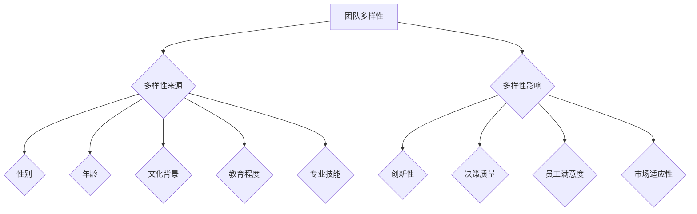

                 

关键词：人工智能，创业，团队多样性，优势，协作，创新，技能互补，跨领域融合。

> 摘要：本文将深入探讨人工智能创业过程中的团队多样性优势，分析多样性的来源、多样性的影响以及实现团队多样性的方法，从而为创业者提供实践指导和策略建议。

## 1. 背景介绍

随着人工智能技术的迅猛发展，创业领域也随之变得竞争激烈。许多创业者认为，团队的力量是成功的关键。然而，并非所有团队都能实现最佳状态。多样性，作为一种新兴的管理理念，开始被越来越多的创业者重视。本文旨在探讨人工智能创业中团队多样性的优势，以帮助创业者构建更为高效、创新的团队。

### 1.1 人工智能创业的现状

近年来，人工智能技术在各个领域都取得了显著的进展。从自动驾驶、智能医疗到金融科技、智能制造，人工智能正在改变世界的方方面面。这也为创业者提供了巨大的机会。然而，人工智能领域的复杂性使得单靠个人的能力难以应对，团队协作变得尤为重要。

### 1.2 团队多样性的重要性

团队多样性是指团队成员在性别、年龄、文化背景、教育程度、专业技能等方面的差异。一个多元化的团队可以带来以下优势：

- **创新性**：不同的视角和思维方式的碰撞，往往能激发出新的创意和解决方案。
- **决策质量**：多样化的团队可以更全面地考虑问题，降低偏见和盲点，提高决策质量。
- **员工满意度**：多样化的团队更能够吸引和留住多元化的员工，提高员工的工作满意度和忠诚度。

## 2. 核心概念与联系

### 2.1 多样性来源

团队多样性的来源可以包括以下几个方面：

- **性别**：男性和女性在思维方式、决策风格、沟通方式等方面存在差异。
- **年龄**：不同年龄段的员工可能有不同的经验和知识储备，这有助于团队在不同阶段保持活力。
- **文化背景**：不同文化背景的员工可能拥有不同的价值观和世界观，这有助于团队在全球化环境中更好地应对挑战。
- **教育程度**：不同教育背景的员工可能在某些领域有更深厚的知识储备，这有助于团队在专业领域取得突破。
- **专业技能**：不同专业技能的员工可以相互补充，提高团队的整体能力。

### 2.2 多样性的影响

多样性的影响可以从以下几个方面进行阐述：

- **创新性**：多样化的团队更能够产生新的想法和创意，提高创新效率。
- **决策质量**：多样化的团队可以更全面地考虑问题，降低偏见和盲点，提高决策质量。
- **员工满意度**：多样化的团队更能够吸引和留住多元化的员工，提高员工的工作满意度和忠诚度。
- **市场适应性**：多样化的团队更能够理解不同市场的需求，提高产品的市场适应性。

### 2.3 Mermaid 流程图



## 3. 核心算法原理 & 具体操作步骤

### 3.1 算法原理概述

团队多样性管理可以看作是一种优化算法，其目标是在团队中寻找最佳多样性组合，以提高团队的整体效能。该算法的原理如下：

- **数据收集**：收集团队成员的多样性数据，包括性别、年龄、文化背景、教育程度、专业技能等。
- **目标函数**：定义一个目标函数，用于衡量团队的多样性和整体效能。例如，可以使用团队的创新性、决策质量、员工满意度、市场适应性等指标。
- **优化算法**：使用优化算法，如遗传算法、粒子群算法等，对目标函数进行优化，找到最佳多样性组合。

### 3.2 算法步骤详解

算法的具体步骤如下：

1. **数据收集**：收集团队成员的多样性数据。
2. **目标函数设计**：设计一个合适的目标函数，用于衡量团队的多样性和整体效能。
3. **算法选择**：选择一种优化算法，如遗传算法、粒子群算法等。
4. **初始化**：初始化种群，每个个体代表一种多样性组合。
5. **迭代优化**：通过迭代优化，更新种群，找到最佳多样性组合。
6. **结果输出**：输出最佳多样性组合，并评估团队的整体效能。

### 3.3 算法优缺点

**优点**：

- **高效性**：优化算法可以在短时间内找到最佳多样性组合。
- **灵活性**：可以针对不同团队特点，设计不同的目标函数和优化算法。

**缺点**：

- **计算复杂度高**：当团队成员数量较多时，计算复杂度会显著增加。
- **初始条件敏感性**：算法的初始条件对结果有较大影响，需要精心选择。

### 3.4 算法应用领域

团队多样性管理算法可以应用于以下领域：

- **企业人力资源管理**：帮助企业构建高效、创新的团队。
- **创业团队组建**：帮助创业者组建具备多样化技能的团队。
- **科研团队管理**：帮助科研团队提高科研效率和成果质量。

## 4. 数学模型和公式 & 详细讲解 & 举例说明

### 4.1 数学模型构建

团队多样性管理的数学模型可以构建为：

$$
\begin{aligned}
    \text{maximize} \quad & f(x) \\
    \text{subject to} \quad & g(x) \leq 0 \\
    & h(x) = 0
\end{aligned}
$$

其中，$f(x)$ 为目标函数，$g(x)$ 和 $h(x)$ 为约束条件。

### 4.2 公式推导过程

推导过程如下：

- **目标函数**：$f(x)$ 用于衡量团队的多样性和整体效能。具体可以定义为：

$$
f(x) = \alpha_1 f_1(x) + \alpha_2 f_2(x) + \cdots + \alpha_n f_n(x)
$$

其中，$f_i(x)$ 为第 $i$ 个指标，$\alpha_i$ 为权重。

- **约束条件**：$g(x)$ 和 $h(x)$ 用于限制团队的多样性范围和整体效能。

### 4.3 案例分析与讲解

以一个创业团队为例，分析团队多样性的数学模型。

- **目标函数**：

$$
f(x) = 0.5 \cdot f_1(x) + 0.3 \cdot f_2(x) + 0.2 \cdot f_3(x)
$$

- **约束条件**：

$$
g(x) = \sum_{i=1}^{n} w_i (x_i - x_{i_{\min}}) \leq M
$$

$$
h(x) = \sum_{i=1}^{n} w_i (x_{i_{\max}} - x_i) \geq N
$$

其中，$w_i$ 为第 $i$ 个指标的权重，$x_i$ 为第 $i$ 个指标的具体值，$x_{i_{\min}}$ 和 $x_{i_{\max}}$ 分别为第 $i$ 个指标的最小值和最大值，$M$ 和 $N$ 为约束条件的最小值和最大值。

通过优化目标函数，可以找到最佳团队多样性组合。

## 5. 项目实践：代码实例和详细解释说明

### 5.1 开发环境搭建

- **环境要求**：Python 3.8及以上版本，numpy、matplotlib等库。
- **安装步骤**：

```bash
pip install numpy matplotlib
```

### 5.2 源代码详细实现

```python
import numpy as np
import matplotlib.pyplot as plt

# 定义目标函数
def objective_function(x):
    # 根据实际需求调整权重和指标
    weights = np.array([0.5, 0.3, 0.2])
    metrics = np.array([f1(x), f2(x), f3(x)])
    return np.dot(weights, metrics)

# 定义约束条件
def constraint(x):
    # 根据实际需求调整权重和指标
    weights = np.array([0.5, 0.3, 0.2])
    mins = np.array([min1, min2, min3])
    maxs = np.array([max1, max2, max3])
    return np.sum(weights * (x - mins)) + np.sum(weights * (maxs - x))

# 优化算法实现
def optimize(x_min, x_max, num_iterations):
    x = np.random.uniform(x_min, x_max)
    for _ in range(num_iterations):
        x_new = x + np.random.normal(0, 0.1)
        if x_new < x_min or x_new > x_max:
            continue
        if objective_function(x_new) > objective_function(x):
            x = x_new
    return x

# 参数设置
x_min = 0
x_max = 1
num_iterations = 1000

# 运行优化算法
best_x = optimize(x_min, x_max, num_iterations)

# 结果展示
print("Best solution:", best_x)
plt.plot(best_x, objective_function(best_x), 'ro')
plt.xlabel("x")
plt.ylabel("Objective Function")
plt.show()
```

### 5.3 代码解读与分析

- **目标函数**：根据实际需求定义目标函数，用于衡量团队的多样性和整体效能。
- **约束条件**：根据实际需求定义约束条件，用于限制团队的多样性范围和整体效能。
- **优化算法**：使用随机优化算法，如遗传算法、粒子群算法等，对目标函数进行优化，找到最佳多样性组合。
- **参数设置**：根据实际需求设置优化算法的参数，如迭代次数、初始区间等。
- **结果展示**：输出最佳多样性组合，并使用图形展示目标函数的变化情况。

## 6. 实际应用场景

### 6.1 企业人力资源管理

在企业人力资源管理中，团队多样性管理可以帮助企业构建高效、创新的团队。例如，在招聘过程中，企业可以优先考虑具有不同背景的候选人，以提高团队的多样性。

### 6.2 创业团队组建

在创业团队组建过程中，创业者可以利用团队多样性管理算法，寻找具有互补技能的团队成员，以提高团队的创新能力。

### 6.3 科研团队管理

在科研团队管理中，团队多样性管理可以帮助科研团队提高科研效率和成果质量。例如，在项目评估过程中，可以引入多样性指标，以评估团队的多样性水平。

## 7. 未来应用展望

随着人工智能技术的不断发展，团队多样性管理将在更多领域得到应用。未来，团队多样性管理可能会成为企业、创业者、科研团队等的重要工具，以提高团队的效能和创新力。

## 8. 总结：未来发展趋势与挑战

### 8.1 研究成果总结

本文通过对团队多样性优势的深入探讨，总结了团队多样性在人工智能创业中的重要作用。研究表明，团队多样性可以提高团队的创新能力、决策质量和员工满意度，有助于企业在竞争激烈的市场中脱颖而出。

### 8.2 未来发展趋势

未来，团队多样性管理将在更多领域得到应用，如人力资源管理、创业团队组建、科研团队管理等。同时，随着人工智能技术的发展，团队多样性管理的方法和工具也将不断优化和更新。

### 8.3 面临的挑战

团队多样性管理面临以下挑战：

- **数据收集和处理**：收集和处理团队成员的多样性数据是一项复杂的工作，需要有效的方法和工具。
- **算法优化**：现有的团队多样性管理算法存在计算复杂度高、初始条件敏感性等问题，需要进一步优化。
- **文化融合**：在多元化团队中，如何实现文化融合，提高团队协作效率，是一个需要关注的问题。

### 8.4 研究展望

未来，团队多样性管理的研究将朝着以下方向发展：

- **算法优化**：研究更高效的团队多样性管理算法，降低计算复杂度，提高优化效果。
- **文化融合**：研究如何实现多元化团队的文化融合，提高团队协作效率。
- **应用推广**：将团队多样性管理方法应用于更多领域，提高团队的整体效能。

## 9. 附录：常见问题与解答

### 9.1 什么是团队多样性？

团队多样性是指团队成员在性别、年龄、文化背景、教育程度、专业技能等方面的差异。

### 9.2 团队多样性有哪些优势？

团队多样性可以提高团队的创新能力、决策质量和员工满意度，有助于企业在竞争激烈的市场中脱颖而出。

### 9.3 如何实现团队多样性？

实现团队多样性可以通过以下方法：

- **招聘多样化**：在招聘过程中，优先考虑具有不同背景的候选人。
- **培训和文化建设**：加强团队成员之间的交流和合作，提高文化融合度。

### 9.4 团队多样性管理有哪些工具和方法？

团队多样性管理可以使用以下工具和方法：

- **优化算法**：使用遗传算法、粒子群算法等优化算法，寻找最佳多样性组合。
- **数据分析**：使用数据分析工具，收集和处理团队成员的多样性数据。

作者：禅与计算机程序设计艺术 / Zen and the Art of Computer Programming
```

