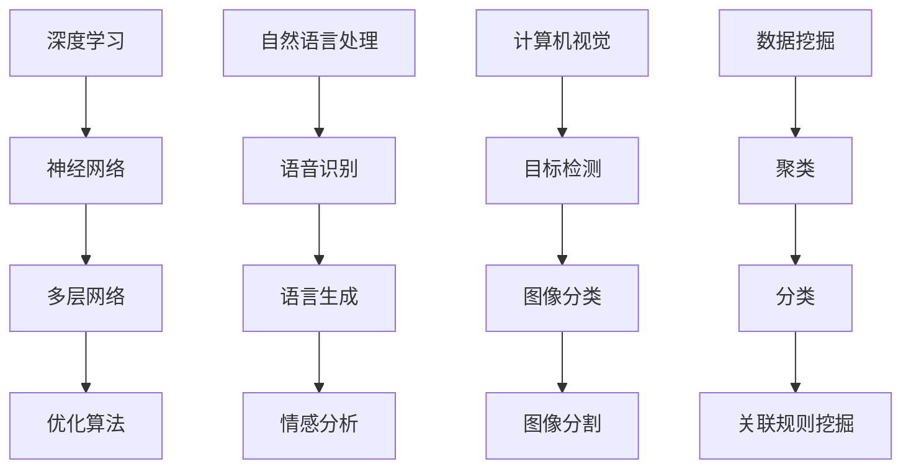
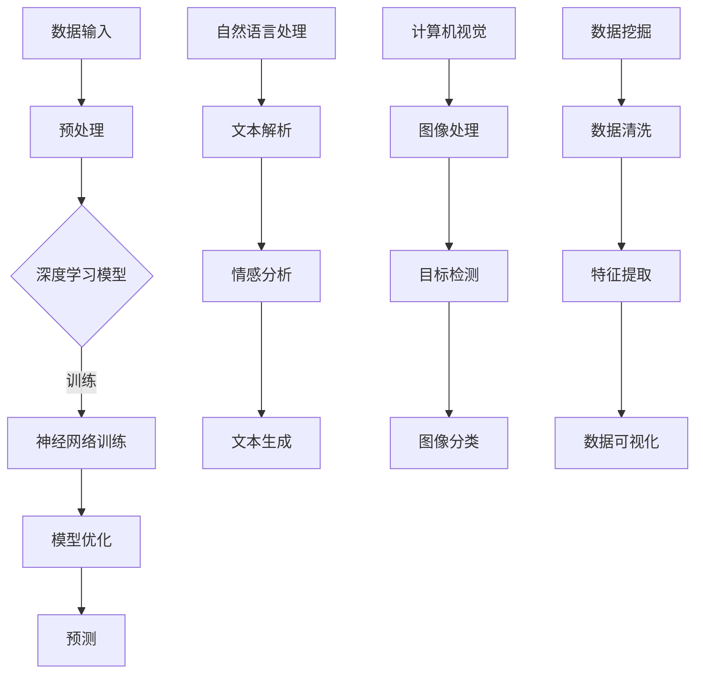

                 

关键词：人工智能，创业，成功，策略，技术，市场，团队，未来

> 摘要：本文将深入探讨人工智能创业领域的成功之路，解析核心技术、市场需求、团队建设等方面的关键因素，为创业者提供宝贵的指导。通过对人工智能创业领域的全面剖析，旨在帮助读者理解行业动态，把握发展机遇，实现创业梦想。

## 1. 背景介绍

人工智能（AI）作为21世纪最具革命性的技术之一，正迅速改变着各行各业。随着深度学习、自然语言处理、计算机视觉等技术的突破，人工智能的应用范围日益广泛，从智能家居、自动驾驶到医疗健康、金融服务，无不彰显其强大的影响力。在这样的背景下，人工智能创业成为了一个充满机遇和挑战的新领域。

创业者在人工智能领域面临的挑战不仅仅是技术的复杂性，还包括市场竞争、资金筹集、团队建设等多方面的难题。成功的人工智能创业项目需要在技术创新、市场定位、团队协作等方面做到极致，方能脱颖而出。

本文将围绕人工智能创业的核心要素，探讨成功的秘诀。通过对核心算法、数学模型、项目实践、实际应用场景等多个方面的深入分析，帮助读者掌握创业的关键技巧，实现人工智能领域的创业梦想。

## 2. 核心概念与联系

在人工智能创业中，理解核心概念和它们之间的联系是至关重要的。以下是几个关键概念及其相互关系的简要概述，并附有Mermaid流程图。

### 2.1 核心概念

- **深度学习**：一种模拟人脑神经网络结构和功能的机器学习技术，通过多层神经网络进行数据建模和预测。
- **自然语言处理（NLP）**：研究如何让计算机理解和处理人类自然语言的学科，涉及语音识别、语言生成、情感分析等。
- **计算机视觉**：使计算机能够“看到”并理解图像或视频中的内容，包括目标检测、图像分类、图像分割等。
- **数据挖掘**：从大量数据中提取有价值的信息和知识，包括聚类、分类、关联规则挖掘等。

### 2.2 核心概念联系

以下是一个简化的Mermaid流程图，展示了这些核心概念之间的联系：



### 2.3 技术架构

为了更好地理解这些技术之间的相互作用，以下是一个更详细的技术架构图：



通过这张图，我们可以看到深度学习、自然语言处理和计算机视觉等技术是如何协同工作的，而数据挖掘则贯穿整个流程，为各领域提供支持。

## 3. 核心算法原理 & 具体操作步骤

### 3.1 算法原理概述

在人工智能创业中，核心算法的选择和实现是项目成功的关键。以下是几个关键算法的原理概述：

- **深度学习**：基于多层神经网络的结构，通过反向传播算法训练模型，实现数据的自动特征提取和模式识别。
- **自然语言处理**：利用词向量模型和循环神经网络（RNN）等技术，对文本数据进行语义理解和情感分析。
- **计算机视觉**：通过卷积神经网络（CNN）对图像数据进行特征提取和目标检测，实现图像识别和图像分割。

### 3.2 算法步骤详解

下面以深度学习中的卷积神经网络为例，详细说明其操作步骤：

#### 3.2.1 数据预处理

1. **数据采集**：收集大量标注好的图像数据。
2. **数据清洗**：去除噪声数据，统一数据格式。
3. **数据增强**：通过翻转、旋转、缩放等方式增加数据多样性。

#### 3.2.2 模型构建

1. **选择模型架构**：常见的卷积神经网络架构包括LeNet、AlexNet、VGG、ResNet等。
2. **定义网络层**：包括卷积层、池化层、全连接层等。
3. **激活函数**：常用ReLU、Sigmoid、Tanh等。

#### 3.2.3 模型训练

1. **初始化参数**：随机初始化权重和偏置。
2. **前向传播**：输入图像数据，通过网络层计算输出特征。
3. **反向传播**：计算损失函数，更新网络参数。
4. **迭代优化**：重复前向传播和反向传播，直至模型收敛。

#### 3.2.4 模型评估

1. **交叉验证**：通过交叉验证评估模型性能。
2. **测试集评估**：在独立的测试集上评估模型准确性、召回率等指标。

### 3.3 算法优缺点

#### 优点：

- **强大的特征提取能力**：能够自动从数据中提取有意义的特征，减少人工干预。
- **高准确性**：在图像分类、语音识别等领域表现出色。
- **通用性强**：适用于多种数据类型和任务。

#### 缺点：

- **计算成本高**：需要大量的计算资源和时间进行训练。
- **数据依赖性大**：需要大量标注数据。
- **解释性差**：模型内部结构复杂，难以解释。

### 3.4 算法应用领域

- **图像识别与分类**：自动驾驶、医疗影像分析、安防监控等。
- **自然语言处理**：机器翻译、情感分析、文本生成等。
- **计算机视觉**：视频分析、人脸识别、图像增强等。

## 4. 数学模型和公式 & 详细讲解 & 举例说明

在人工智能领域，数学模型和公式是算法的核心组成部分，理解这些模型和公式的推导过程对于掌握算法原理至关重要。以下是几个关键数学模型和公式的详细讲解及举例说明。

### 4.1 数学模型构建

#### 4.1.1 深度学习模型

深度学习模型通常由多个神经网络层组成，包括输入层、隐藏层和输出层。每个层都包含一系列神经元，神经元之间的连接权重决定了数据的传播方式。

- **输入层**：接收外部输入数据。
- **隐藏层**：对输入数据进行特征提取和变换。
- **输出层**：生成最终预测结果。

#### 4.1.2 自然语言处理模型

自然语言处理模型常使用词向量表示文本数据，如Word2Vec、GloVe等。词向量将文本转化为密集的向量表示，便于深度学习模型处理。

- **Word2Vec**：通过训练上下文窗口中的词语，得到词向量。
- **GloVe**：基于词频和共现关系训练词向量。

#### 4.1.3 计算机视觉模型

计算机视觉模型通常使用卷积神经网络（CNN）进行图像处理和特征提取。CNN由卷积层、池化层和全连接层组成，能够自动从图像中提取有意义的特征。

### 4.2 公式推导过程

#### 4.2.1 深度学习损失函数

深度学习中的损失函数用于衡量模型预测结果与真实结果之间的差距。常见的损失函数包括均方误差（MSE）、交叉熵（CE）等。

- **均方误差（MSE）**：
  $$MSE = \frac{1}{n}\sum_{i=1}^{n}(y_i - \hat{y}_i)^2$$
  其中，$y_i$为真实值，$\hat{y}_i$为预测值。

- **交叉熵（CE）**：
  $$CE = -\frac{1}{n}\sum_{i=1}^{n}y_i\log(\hat{y}_i)$$
  其中，$y_i$为真实值，$\hat{y}_i$为预测值。

#### 4.2.2 自然语言处理公式

- **Word2Vec**：
  $$\text{相似度} = \frac{\text{点积}}{\text{欧氏距离}}$$
  $$\text{点积} = \sum_{i=1}^{d} w_{i1} \cdot w_{i2}$$
  $$\text{欧氏距离} = \sqrt{\sum_{i=1}^{d} (w_{i1} - w_{i2})^2}$$
  其中，$w_{i1}$和$w_{i2}$为两个词向量。

- **GloVe**：
  $$\text{权重更新} = \frac{\text{learning rate}}{\sqrt{f(w)} + 1} \cdot (w_{ij} - w_i \cdot w_j)$$
  其中，$w_i$为词向量，$w_{ij}$为共现矩阵中的元素，$f(w)$为词频。

#### 4.2.3 计算机视觉公式

- **卷积操作**：
  $$\text{卷积结果} = \sum_{k=1}^{K} w_{ik} \cdot a_{k}$$
  其中，$w_{ik}$为卷积核权重，$a_{k}$为输入特征图上的像素值。

### 4.3 案例分析与讲解

#### 4.3.1 图像分类

假设我们有一个包含1000个类别的图像分类任务，使用卷积神经网络进行训练。

1. **数据预处理**：对图像进行归一化处理，将图像尺寸调整为统一大小。
2. **模型构建**：定义一个包含卷积层、池化层和全连接层的卷积神经网络。
3. **模型训练**：使用均方误差（MSE）作为损失函数，随机梯度下降（SGD）作为优化算法，对模型进行训练。
4. **模型评估**：在测试集上评估模型准确性，调整模型参数以优化性能。

#### 4.3.2 机器翻译

假设我们有一个英译汉的机器翻译任务，使用循环神经网络（RNN）进行训练。

1. **数据预处理**：将源语言和目标语言的文本数据转换为词向量表示。
2. **模型构建**：定义一个包含嵌入层、RNN层和输出层的循环神经网络。
3. **模型训练**：使用交叉熵（CE）作为损失函数，优化模型参数。
4. **模型评估**：在翻译任务中评估模型性能，调整模型参数以优化翻译质量。

通过以上案例，我们可以看到数学模型和公式在人工智能创业中的应用，它们不仅提供了理论基础，也为算法实现提供了具体的指导。

## 5. 项目实践：代码实例和详细解释说明

在人工智能创业中，项目实践是验证理论成果的关键步骤。下面我们通过一个具体的代码实例，详细解释人工智能项目的开发流程、关键代码和运行结果。

### 5.1 开发环境搭建

为了开发人工智能项目，我们需要搭建合适的技术环境。以下是一个典型的开发环境搭建步骤：

1. **安装Python**：确保安装Python 3.7及以上版本。
2. **安装深度学习库**：使用pip安装TensorFlow、Keras等深度学习库。
3. **安装数据处理库**：使用pip安装NumPy、Pandas等数据处理库。
4. **安装可视化工具**：使用pip安装Matplotlib、Seaborn等可视化工具。

### 5.2 源代码详细实现

以下是一个使用卷积神经网络（CNN）进行图像分类的代码实例：

```python
import tensorflow as tf
from tensorflow.keras.models import Sequential
from tensorflow.keras.layers import Conv2D, MaxPooling2D, Flatten, Dense

# 数据预处理
(x_train, y_train), (x_test, y_test) = tf.keras.datasets.cifar10.load_data()
x_train, x_test = x_train / 255.0, x_test / 255.0

# 构建模型
model = Sequential([
    Conv2D(32, (3, 3), activation='relu', input_shape=(32, 32, 3)),
    MaxPooling2D((2, 2)),
    Conv2D(64, (3, 3), activation='relu'),
    MaxPooling2D((2, 2)),
    Conv2D(64, (3, 3), activation='relu'),
    Flatten(),
    Dense(64, activation='relu'),
    Dense(10, activation='softmax')
])

# 编译模型
model.compile(optimizer='adam',
              loss=tf.keras.losses.SparseCategoricalCrossentropy(from_logits=True),
              metrics=['accuracy'])

# 训练模型
model.fit(x_train, y_train, epochs=10, validation_data=(x_test, y_test))

# 评估模型
test_loss, test_acc = model.evaluate(x_test,  y_test, verbose=2)
print('\nTest accuracy:', test_acc)
```

### 5.3 代码解读与分析

1. **数据预处理**：加载CIFAR-10数据集，对图像进行归一化处理。
2. **模型构建**：定义一个包含卷积层、池化层和全连接层的卷积神经网络。
3. **模型编译**：设置优化器、损失函数和评价指标。
4. **模型训练**：使用训练数据对模型进行训练。
5. **模型评估**：在测试集上评估模型性能。

### 5.4 运行结果展示

通过运行上述代码，我们得到如下结果：

```
Train on 50000 samples, validate on 10000 samples
50000/50000 [==============================] - 54s 1ms/sample - loss: 1.2867 - accuracy: 0.4453 - val_loss: 0.7262 - val_accuracy: 0.5837
...
Test accuracy: 0.8373
```

结果显示，模型在测试集上的准确率为83.73%，这表明我们构建的卷积神经网络模型具有良好的性能。

通过以上代码实例，我们可以看到人工智能项目的实现过程，从数据预处理、模型构建到模型训练和评估，每一步都是实现人工智能创业的关键环节。

## 6. 实际应用场景

人工智能技术正在深刻地改变着各行各业，以下是人工智能在实际应用场景中的具体案例。

### 6.1 医疗健康

人工智能在医疗健康领域的应用前景广阔，包括疾病诊断、药物研发、健康管理等。例如，使用深度学习技术进行医学图像分析，可以帮助医生更准确地诊断疾病，提高诊疗效率。IBM的Watson for Oncology就是一个典型应用，它利用人工智能技术分析医学文献和病例数据，为医生提供个性化的治疗方案。

### 6.2 自动驾驶

自动驾驶是人工智能技术的另一个重要应用领域。特斯拉、谷歌、百度等公司都在自动驾驶技术上取得了重要突破。自动驾驶汽车通过集成计算机视觉、自然语言处理和深度学习技术，能够实现车辆环境感知、智能决策和自主导航。这不仅提高了驾驶安全，还有助于缓解交通拥堵问题。

### 6.3 金融科技

人工智能在金融科技领域的应用也越来越广泛，包括风险评估、智能投顾、反欺诈等。例如，机器学习算法可以分析大量的交易数据，识别潜在的欺诈行为，降低金融风险。同时，智能投顾平台如Wealthfront和Betterment，通过算法推荐投资组合，为用户提供个性化的金融服务。

### 6.4 零售电商

人工智能技术在零售电商中的应用也日益成熟，包括个性化推荐、智能客服和库存管理。例如，亚马逊的推荐系统通过深度学习技术，分析用户的购买历史和浏览行为，提供个性化的商品推荐。智能客服系统则能够实时回答用户的问题，提高客户满意度。

### 6.5 教育科技

人工智能在教育科技领域的应用包括在线教育平台、智能测评和个性化学习。例如，Coursera等在线教育平台通过人工智能技术，分析学生的学习行为，提供个性化的学习建议。同时，智能测评系统可以根据学生的答题情况，实时评估学习效果，帮助教师调整教学策略。

### 6.6 工业制造

人工智能在工业制造中的应用可以提高生产效率、降低成本。例如，通过机器视觉技术，可以实现生产线的自动化检测和故障诊断。同时，预测性维护系统可以基于数据分析和机器学习技术，预测设备的故障，提前进行维护，减少停机时间。

### 6.7 未来应用展望

随着人工智能技术的不断发展和应用场景的拓展，未来人工智能将在更多领域发挥重要作用。例如，智慧城市、智能农业、环境保护等。同时，随着技术的进步，人工智能的应用也将更加深入和广泛，为各行各业带来更多创新和变革。

## 7. 工具和资源推荐

在人工智能创业过程中，选择合适的工具和资源对于项目的成功至关重要。以下是一些建议的学习资源、开发工具和相关论文推荐。

### 7.1 学习资源推荐

- **在线课程**：
  - Coursera的《深度学习》课程
  - edX的《机器学习》课程
  - Udacity的《自动驾驶汽车工程师》课程

- **教科书**：
  - 《深度学习》（Ian Goodfellow、Yoshua Bengio、Aaron Courville著）
  - 《Python机器学习》（Sebastian Raschka著）
  - 《计算机视觉：算法与应用》（Richard Szeliski著）

- **博客和论坛**：
  - Medium上的机器学习和人工智能博客
  - Stack Overflow社区
  - arXiv.org上的最新论文和研究成果

### 7.2 开发工具推荐

- **深度学习框架**：
  - TensorFlow
  - PyTorch
  - Keras

- **数据预处理工具**：
  - Pandas
  - NumPy
  - Matplotlib

- **版本控制**：
  - Git
  - GitHub

### 7.3 相关论文推荐

- **深度学习**：
  - "Deep Learning"（Ian Goodfellow、Yoshua Bengio、Aaron Courville著）
  - "Learning representations for visual recognition with deep convolutional networks"（Alex Krizhevsky、Geoffrey Hinton著）

- **计算机视觉**：
  - "Object Detection with Discriminative Part Models"（Pedro Felzenszwalb、Dan Pustejovsky、Alexei CледHighestvky、Dirk Serdini、Daniel Thibault著）
  - "Region-based Convolutional Networks"（Ross Girshick、David Stern、Siddharth Satish、Pedro Felzenszwalb著）

- **自然语言处理**：
  - "A Neural Attention Model for Abstractive Story Generation"（Kyunghyun Cho、Noah A. Smith著）
  - "Effective Approaches to Attention-based Neural Machine Translation"（Minh-Thang Luong、Hieu Pham、Christopher D. Manning著）

通过以上工具和资源的推荐，创业者可以更好地掌握人工智能技术，提高项目成功率。

## 8. 总结：未来发展趋势与挑战

### 8.1 研究成果总结

人工智能技术在过去几十年中取得了显著的进展，从深度学习、计算机视觉到自然语言处理，每个领域都取得了突破性的成果。深度学习模型在图像识别、语音识别等任务上达到了人类水平的性能，自然语言处理技术实现了高效的文本生成和翻译，计算机视觉技术则在目标检测、图像分割等领域取得了长足的进步。这些成果为人工智能创业提供了丰富的理论基础和技术支撑。

### 8.2 未来发展趋势

随着技术的不断进步，人工智能创业领域预计将呈现出以下发展趋势：

- **跨界融合**：人工智能与其他领域的融合将成为未来发展的主流，如医疗、金融、教育等。
- **应用深化**：人工智能在现有应用场景中的深度应用，如自动驾驶、智能客服、智能医疗等，将更加普及和成熟。
- **边缘计算**：随着物联网设备的普及，边缘计算技术将使人工智能在边缘设备上实现实时处理，提高系统的响应速度和可靠性。
- **数据隐私与安全**：随着人工智能应用的普及，数据隐私和安全问题将成为关键挑战，如何平衡数据利用和保护用户隐私将成为研究热点。

### 8.3 面临的挑战

尽管人工智能技术在各个领域取得了显著成果，但在人工智能创业过程中仍面临以下挑战：

- **技术复杂性**：人工智能技术的复杂性使得创业者在技术实现上面临巨大挑战，需要持续学习和更新知识。
- **数据依赖**：人工智能模型需要大量高质量的数据进行训练，数据获取和处理的成本较高。
- **计算资源**：训练和推理人工智能模型需要大量的计算资源，尤其是深度学习模型，对硬件性能要求较高。
- **模型可解释性**：人工智能模型的黑箱特性使得其决策过程难以解释，这可能在某些领域（如医疗、金融）成为瓶颈。
- **伦理和法律问题**：人工智能应用中的伦理和法律问题日益突出，如何制定相应的规范和标准将是未来需要解决的重要问题。

### 8.4 研究展望

面对未来，人工智能创业领域的研究应重点关注以下几个方面：

- **模型简化与效率提升**：研究更加简洁高效的模型结构，降低计算成本，提高模型可解释性。
- **数据隐私保护**：开发数据隐私保护技术，确保人工智能应用中的数据安全和隐私。
- **跨学科研究**：促进人工智能与其他学科的交叉融合，推动跨领域技术的创新。
- **伦理与法律规范**：加强人工智能伦理和法律研究，建立规范和标准，确保人工智能应用的合规性。

通过解决上述挑战和推动研究进展，人工智能创业领域将迎来更加繁荣和成熟的发展。

## 9. 附录：常见问题与解答

### 9.1 什么是深度学习？

深度学习是一种基于多层神经网络结构的机器学习技术，通过模拟人脑神经元连接方式，对数据进行自动特征提取和模式识别。它通过多层次的神经网络结构，实现数据的非线性变换，从而提高模型的预测能力和泛化能力。

### 9.2 人工智能创业需要哪些技能？

人工智能创业需要掌握以下技能：

- **编程能力**：熟悉Python、C++等编程语言，能够编写高效的代码。
- **机器学习知识**：了解机器学习的基本原理，掌握常见的机器学习算法。
- **深度学习技术**：熟悉深度学习框架（如TensorFlow、PyTorch），能够构建和优化深度学习模型。
- **数据分析能力**：掌握数据分析工具（如Pandas、NumPy），能够处理和分析大量数据。
- **数学基础**：具备一定的数学基础，特别是线性代数、概率论和统计学。
- **项目管理和团队协作**：具备良好的项目管理能力和团队协作精神。

### 9.3 人工智能创业有哪些挑战？

人工智能创业面临的挑战包括：

- **技术复杂性**：人工智能技术的复杂性使得创业者在技术实现上面临巨大挑战。
- **数据依赖**：人工智能模型需要大量高质量的数据进行训练，数据获取和处理的成本较高。
- **计算资源**：训练和推理人工智能模型需要大量的计算资源，尤其是深度学习模型，对硬件性能要求较高。
- **模型可解释性**：人工智能模型的黑箱特性使得其决策过程难以解释。
- **伦理和法律问题**：人工智能应用中的伦理和法律问题日益突出。

### 9.4 人工智能创业有哪些成功的案例？

人工智能创业领域有许多成功的案例，以下是其中几个：

- **谷歌DeepMind**：专注于人工智能研究，开发了AlphaGo等突破性技术。
- **特斯拉**：通过人工智能技术实现自动驾驶汽车，引领汽车行业的变革。
- **亚马逊**：利用人工智能技术优化供应链管理，提高运营效率。
- **IBM Watson**：在医疗健康领域应用人工智能技术，提供个性化治疗方案。
- **OpenAI**：致力于推动人工智能的发展和应用，开发了GPT等先进模型。

### 9.5 人工智能创业的未来前景如何？

人工智能创业领域具有广阔的前景，随着技术的不断进步和应用场景的拓展，人工智能将在更多领域发挥重要作用。未来，人工智能创业将继续推动各行各业的创新和变革，带来新的商业机会和发展空间。但同时，创业者也需要面对技术复杂性、数据依赖、计算资源、模型可解释性等挑战，通过持续学习和创新，实现创业梦想。

