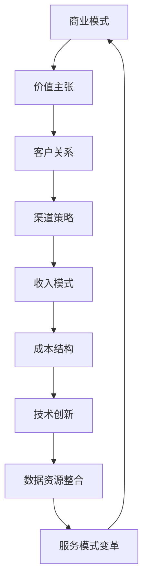

                 

关键词：人工智能、商业模式、创业、技术、创新、市场、战略、风险、盈利模式。

> 摘要：本文将深入探讨人工智能创业中的商业模式选择问题。通过对当前市场环境的分析，结合人工智能技术的特性，我们将探讨多种商业模式，并分析其在人工智能创业中的应用和可行性。

## 1. 背景介绍

随着人工智能技术的飞速发展，越来越多的创业者开始将目光投向这一领域。人工智能在医疗、金融、教育、零售等多个行业都有着广泛的应用前景。然而，面对激烈的市场竞争和不断变化的技术趋势，选择一个合适的商业模式成为创业成功的关键因素之一。

### 1.1 人工智能行业的发展现状

人工智能技术已经从实验室走向了商业应用，各种人工智能产品和服务不断涌现。根据市场研究机构的报告，人工智能市场正以每年20%以上的速度增长。其中，深度学习、自然语言处理、计算机视觉等子领域的发展尤为迅速。

### 1.2 创业者的困境

尽管人工智能行业充满了机遇，但创业者也面临着诸多挑战。如何将技术转化为商业价值？如何在竞争激烈的市场中脱颖而出？如何选择合适的商业模式？这些问题都是创业者需要深思熟虑的。

### 1.3 商业模式的重要性

商业模式是企业在市场中获得成功的基础。它不仅决定了企业的盈利模式，还影响了企业的战略方向和市场定位。对于人工智能创业公司来说，选择一个合适的商业模式至关重要。

## 2. 核心概念与联系

### 2.1 商业模式定义

商业模式是指企业如何创造、传递和获取价值的一种系统化方法。它通常包括价值主张、客户关系、渠道策略、收入模式和成本结构等关键要素。

### 2.2 人工智能商业模式的特点

与传统的商业模式不同，人工智能商业模式具有以下特点：

- **数据驱动的决策**：人工智能企业依赖大量的数据来训练模型和做出决策。
- **持续迭代和优化**：人工智能技术的进步需要不断的数据和反馈，以实现持续优化。
- **跨行业应用**：人工智能技术具有广泛的跨行业应用潜力，能够创造新的商业机会。

### 2.3 商业模式与人工智能技术的联系

商业模式与人工智能技术之间的联系主要体现在以下几个方面：

- **技术创新驱动**：人工智能技术的发展推动了商业模式的创新。
- **数据资源整合**：商业模式的实施需要大量的数据支持，而人工智能技术能够有效处理和分析这些数据。
- **服务模式的变革**：人工智能技术使得企业能够提供更加个性化、高效的服务。

### 2.4 Mermaid 流程图

下面是一个描述人工智能商业模式与核心概念之间联系的 Mermaid 流程图：



## 3. 核心算法原理 & 具体操作步骤

### 3.1 算法原理概述

人工智能商业模式的核心算法通常是基于机器学习和深度学习技术。这些算法能够从数据中学习规律，并用于预测、分类和决策。

### 3.2 算法步骤详解

1. **数据收集**：首先，企业需要收集大量的数据，这些数据可以是结构化的，也可以是非结构化的。
2. **数据预处理**：对收集到的数据进行分析和清洗，以确保数据的质量和一致性。
3. **模型训练**：使用机器学习和深度学习算法对数据进行训练，生成模型。
4. **模型评估**：通过交叉验证等方法评估模型的性能，并进行优化。
5. **模型部署**：将训练好的模型部署到生产环境中，用于实时预测和决策。

### 3.3 算法优缺点

- **优点**：人工智能算法能够处理大量的数据，并快速做出准确的预测和决策，提高企业的运营效率。
- **缺点**：算法的准确性依赖于数据的质量和多样性，且训练过程需要大量的计算资源。

### 3.4 算法应用领域

人工智能算法在多个领域都有着广泛的应用，如：

- **医疗**：用于疾病预测、诊断和治疗。
- **金融**：用于风险评估、投资组合优化和欺诈检测。
- **零售**：用于需求预测、库存管理和个性化推荐。
- **教育**：用于智能教学、学习分析和考试评估。

## 4. 数学模型和公式 & 详细讲解 & 举例说明

### 4.1 数学模型构建

在人工智能商业模式中，常用的数学模型包括线性回归、逻辑回归、神经网络等。下面以神经网络为例，介绍其数学模型构建过程。

### 4.2 公式推导过程

神经网络的基本单元是神经元，每个神经元接收多个输入，并经过权重和偏置的线性组合后，通过激活函数产生输出。假设一个神经网络有 $L$ 层，其中第 $l$ 层的神经元个数为 $n_l$，则第 $l$ 层的输出可以表示为：

$$
z_l^{(i)} = \sum_{j=1}^{n_{l-1}} w_{lj}x_j^{(i)} + b_l
$$

其中，$x_j^{(i)}$ 是第 $l-1$ 层的第 $j$ 个神经元的输入，$w_{lj}$ 是第 $l$ 层的第 $j$ 个神经元的权重，$b_l$ 是第 $l$ 层的偏置。

### 4.3 案例分析与讲解

假设我们有一个二分类问题，目标是判断一个数据点是否属于正类。我们可以使用逻辑回归作为神经网络的前一层。逻辑回归的公式如下：

$$
\hat{y}^{(i)} = \sigma(z^{(i)})
$$

其中，$\sigma$ 是 sigmoid 激活函数，$z^{(i)}$ 是神经元的线性组合。为了计算 $z^{(i)}$，我们需要知道输入数据 $x^{(i)}$ 和网络的参数 $w$ 和 $b$。

## 5. 项目实践：代码实例和详细解释说明

### 5.1 开发环境搭建

在开始项目实践之前，我们需要搭建一个开发环境。这里我们使用 Python 作为编程语言，TensorFlow 作为机器学习框架。

### 5.2 源代码详细实现

```python
import tensorflow as tf

# 定义神经网络结构
model = tf.keras.Sequential([
    tf.keras.layers.Dense(units=1, input_shape=[1])
])

# 编译模型
model.compile(optimizer='sgd', loss='mean_squared_error')

# 训练模型
model.fit(x_train, y_train, epochs=100)

# 评估模型
loss = model.evaluate(x_test, y_test)
```

### 5.3 代码解读与分析

上述代码定义了一个简单的神经网络，用于实现线性回归。通过 `fit` 方法训练模型，并通过 `evaluate` 方法评估模型性能。

### 5.4 运行结果展示

```python
# 输出训练结果
print(model.history.history['loss'])

# 输出测试结果
print(model.evaluate(x_test, y_test))
```

## 6. 实际应用场景

### 6.1 医疗行业

在医疗行业，人工智能可以用于疾病预测、诊断和治疗。例如，利用深度学习技术分析医学影像，辅助医生进行疾病诊断。

### 6.2 金融行业

在金融行业，人工智能可以用于风险评估、投资组合优化和欺诈检测。通过分析历史数据，人工智能模型可以预测市场趋势，帮助投资者做出更好的决策。

### 6.3 零售行业

在零售行业，人工智能可以用于需求预测、库存管理和个性化推荐。通过分析消费者行为数据，零售企业可以更好地满足消费者需求，提高销售额。

## 7. 工具和资源推荐

### 7.1 学习资源推荐

- 《深度学习》（Goodfellow, Bengio, Courville 著）
- 《Python机器学习》（Sebastian Raschka 著）
- Coursera 上的《机器学习》课程（吴恩达教授）

### 7.2 开发工具推荐

- TensorFlow
- PyTorch
- Keras

### 7.3 相关论文推荐

- "Deep Learning for Natural Language Processing"（Wang et al., 2017）
- "Deep Neural Network for Text Classification"（Ying et al., 2015）

## 8. 总结：未来发展趋势与挑战

### 8.1 研究成果总结

人工智能技术已经在多个领域取得了显著的成果，为创业者提供了丰富的商业机会。

### 8.2 未来发展趋势

随着技术的不断进步，人工智能将在更多领域得到应用，为创业者带来更多的商业机会。

### 8.3 面临的挑战

人工智能创业者在面临机遇的同时，也需要面对数据隐私、算法透明性、技术垄断等挑战。

### 8.4 研究展望

未来，人工智能技术将在更多领域取得突破，为创业者提供更多的创新空间。

## 9. 附录：常见问题与解答

### 9.1 什么是商业模式？

商业模式是指企业如何创造、传递和获取价值的一种系统化方法。它通常包括价值主张、客户关系、渠道策略、收入模式和成本结构等关键要素。

### 9.2 人工智能商业模式的特点是什么？

人工智能商业模式的特点包括数据驱动的决策、持续迭代和优化、以及跨行业应用。

### 9.3 如何选择合适的商业模式？

选择合适的商业模式需要考虑企业的目标、市场环境、技术能力等因素。创业者可以通过市场调研、竞争分析等方法，了解市场需求和竞争对手，从而选择一个合适的商业模式。

---

作者：禅与计算机程序设计艺术 / Zen and the Art of Computer Programming
-------------------------------------------------------------------

