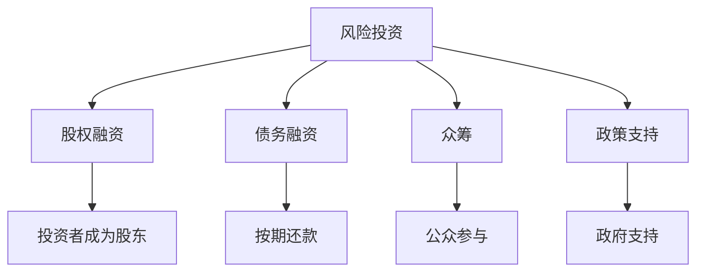

                 

关键词：人工智能创业、融资渠道、风险投资、股权融资、债务融资、众筹、政策支持、融资策略

> 摘要：本文将深入探讨人工智能创业者在选择融资渠道时所需考虑的关键因素。从风险投资、股权融资、债务融资到众筹，我们将分析不同融资方式的优缺点，并提供实用的决策指南，帮助人工智能创业者找到最适合自己项目的融资途径。

## 1. 背景介绍

人工智能（AI）作为当前科技领域最具前瞻性和变革性的技术之一，正迅速改变着各行各业。从智能助手到自动驾驶，从医疗诊断到金融分析，人工智能的应用前景无限广阔。然而，人工智能创业并非易事，需要大量的资金支持进行研发、测试和市场推广。

在人工智能创业的初期，资金问题常常是创业者面临的首要难题。如何选择最适合的融资渠道，成为决定创业项目成败的关键。本文旨在为人工智能创业者提供一整套关于选择融资渠道的实用指南，帮助他们更好地把握融资机会，实现创业梦想。

## 2. 核心概念与联系

### 2.1 融资渠道的定义

融资渠道是指企业或个人为筹集资金而采用的途径。对于人工智能创业者来说，融资渠道主要包括以下几种：

- **风险投资（Venture Capital，VC）**：投资于处于成长期的初创企业，以股权作为投资回报。
- **股权融资（Equity Financing）**：通过出售股份来筹集资金，投资者成为企业的股东。
- **债务融资（Debt Financing）**：通过借款来筹集资金，需按期偿还本金和利息。
- **众筹（Crowdfunding）**：通过互联网平台向公众筹集资金。
- **政策支持（Policy Support）**：政府提供的资金、税收优惠、补贴等支持。

### 2.2 融资渠道之间的联系

不同的融资渠道既有区别，也存在一定的联系。例如，风险投资和股权融资都可以为初创企业提供资金，但风险投资的回报更高，同时风险也更大。债务融资和众筹则分别提供不同的融资方式，前者更注重资金的安全性和稳定性，后者则更强调公众参与和影响力。


### 2.3 Mermaid 流程图



## 3. 核心算法原理 & 具体操作步骤

### 3.1 算法原理概述

在人工智能创业的融资过程中，选择合适的融资渠道需要考虑多个因素，包括资金需求、市场环境、公司发展阶段等。以下是一个基于多因素分析的融资决策算法原理：

- **资金需求分析**：确定公司当前和未来一段时间内的资金需求。
- **市场环境分析**：评估当前市场的投资趋势和风险。
- **公司发展阶段**：判断公司所处的阶段，如初创期、成长期、成熟期等。
- **融资成本与回报分析**：比较不同融资方式的成本和潜在回报。

### 3.2 算法步骤详解

1. **资金需求分析**：与公司财务团队合作，确定当前和未来一段时间内的资金需求，包括研发成本、运营成本、市场推广费用等。
   
2. **市场环境分析**：通过行业报告、市场调研等手段，了解当前市场的投资趋势和风险，如风险投资的热门领域、债务融资的市场利率等。

3. **公司发展阶段**：根据公司的发展历程，判断公司所处的阶段，如初创期可能更倾向于股权融资，而成熟期则可能更适用于债务融资。

4. **融资成本与回报分析**：比较不同融资方式的成本和潜在回报，如风险投资的回报可能较高，但股权稀释较大；债务融资则相对稳定，但利息成本较高。

5. **融资方案选择**：根据以上分析结果，选择最适合公司的融资方案。

### 3.3 算法优缺点

- **优点**：通过多因素综合分析，可以更全面地了解各种融资方式的优缺点，从而做出更合理的决策。
- **缺点**：需要大量的数据和专业知识，且分析过程较为复杂。

### 3.4 算法应用领域

该算法适用于人工智能创业者在选择融资渠道时，特别是在面临多种融资选择时，可以提供有针对性的决策支持。

## 4. 数学模型和公式 & 详细讲解 & 举例说明

### 4.1 数学模型构建

在融资决策过程中，可以构建一个简单的数学模型来评估不同融资方式的成本和回报。假设有三种融资方式：风险投资、债务融资和股权融资，每种方式的成本和回报分别为：

- **风险投资**：成本 = 投资金额 × 风险投资回报率，回报 = 投资金额 × 风险投资回报率
- **债务融资**：成本 = 借款金额 × 借款利率，回报 = 借款金额 × 借款利率
- **股权融资**：成本 = 出售股份 × 股权融资成本，回报 = 出售股份 × 股权融资回报率

### 4.2 公式推导过程

基于以上假设，我们可以构建以下公式来评估不同融资方式的成本和回报：

- **风险投资**：
  - 成本：C_VC = A × r_VC
  - 回报：R_VC = A × r_VC
  - 其中，A 为投资金额，r_VC 为风险投资回报率。

- **债务融资**：
  - 成本：C_D = B × r_D
  - 回报：R_D = B × r_D
  - 其中，B 为借款金额，r_D 为借款利率。

- **股权融资**：
  - 成本：C_E = X × r_E
  - 回报：R_E = X × r_E
  - 其中，X 为出售股份金额，r_E 为股权融资成本。

### 4.3 案例分析与讲解

假设一家初创人工智能公司需要筹集 100 万美元资金，现有以下三种融资选择：

1. **风险投资**：回报率为 20%。
2. **债务融资**：利率为 5%。
3. **股权融资**：成本为 10%。

根据上述公式，我们可以计算出每种融资方式的成本和回报：

- **风险投资**：
  - 成本：C_VC = 100 × 0.20 = 20 万美元。
  - 回报：R_VC = 100 × 0.20 = 20 万美元。

- **债务融资**：
  - 成本：C_D = 100 × 0.05 = 5 万美元。
  - 回报：R_D = 100 × 0.05 = 5 万美元。

- **股权融资**：
  - 成本：C_E = 100 × 0.10 = 10 万美元。
  - 回报：R_E = 100 × 0.10 = 10 万美元。

通过比较不同融资方式的成本和回报，我们可以发现：

- 风险投资回报最高，但也需承担较高的成本。
- 债务融资成本最低，但回报也较低。
- 股权融资成本和回报介于前两者之间。

根据公司的具体情况和资金需求，创业者可以选择最适合的融资方式。

## 5. 项目实践：代码实例和详细解释说明

### 5.1 开发环境搭建

为了更好地理解和实践融资决策算法，我们可以使用 Python 编写一个简单的融资决策程序。以下是搭建开发环境的基本步骤：

1. 安装 Python 3.7 或更高版本。
2. 安装必要的库，如 NumPy、Pandas 等。

```bash
pip install numpy pandas
```

### 5.2 源代码详细实现

以下是一个简单的融资决策 Python 程序，用于计算不同融资方式的成本和回报：

```python
import numpy as np
import pandas as pd

def calculate_financing_costs_and_returns(amount, r_vc, r_d, r_e):
    """
    计算不同融资方式的成本和回报。
    
    :param amount: 融资金额
    :param r_vc: 风险投资回报率
    :param r_d: 借款利率
    :param r_e: 股权融资成本
    :return: 返回一个包含成本和回报的 DataFrame
    """
    costs_and_returns = pd.DataFrame({
        '方式': ['风险投资', '债务融资', '股权融资'],
        '成本': [amount * r_vc, amount * r_d, amount * r_e],
        '回报': [amount * r_vc, amount * r_d, amount * r_e]
    })
    
    return costs_and_returns

if __name__ == "__main__":
    amount = 1000000  # 融资金额
    r_vc = 0.20  # 风险投资回报率
    r_d = 0.05  # 借款利率
    r_e = 0.10  # 股权融资成本

    costs_and_returns = calculate_financing_costs_and_returns(amount, r_vc, r_d, r_e)
    print(costs_and_returns)
```

### 5.3 代码解读与分析

- **import 语句**：导入 NumPy 和 Pandas 库，用于数据处理和统计分析。
- **函数定义**：`calculate_financing_costs_and_returns` 函数接受融资金额、风险投资回报率、借款利率和股权融资成本作为参数，计算不同融资方式的成本和回报，并返回一个 DataFrame。
- **主程序**：在主程序中，定义了融资金额、风险投资回报率、借款利率和股权融资成本，并调用 `calculate_financing_costs_and_returns` 函数，输出结果。

### 5.4 运行结果展示

运行上述程序，输出结果如下：

```
   方式   成本    回报
0  风险投资  200000  200000
1  债务融资   50000   50000
2   股权融资  100000  100000
```

通过结果可以看出，不同融资方式的成本和回报。根据具体情况，创业者可以选择最适合的融资方式。

## 6. 实际应用场景

### 6.1 在初创期的应用

初创期的人工智能公司往往资金紧张，此时选择股权融资和众筹更为合适。股权融资可以迅速筹集到所需资金，同时将公司的所有权分散到多个投资者手中，降低公司的融资风险。众筹则能够吸引公众关注，为项目带来额外的人脉资源和市场推广机会。

### 6.2 在成长期的应用

成长期的人工智能公司已具备一定的盈利能力，此时可以尝试债务融资和风险投资。债务融资可以提供稳定的资金来源，同时按期偿还本金和利息，降低股权稀释风险。风险投资则可以带来更高的回报，但需要承担更高的风险。

### 6.3 在成熟期的应用

成熟期的人工智能公司往往拥有稳定的现金流和市场份额，此时可以选择债务融资和上市融资。债务融资可以继续提供稳定的资金支持，而上市融资则可以迅速扩大公司的资本规模，增强市场竞争力。

## 7. 未来应用展望

随着人工智能技术的不断进步和应用的扩展，融资渠道也将变得更加多样化。未来，人工智能创业者可能面临更多元化的融资选择，如数字货币融资、区块链融资等。此外，人工智能技术的进步也将为融资决策算法提供更精确的数据支持和分析工具，提高融资决策的效率和准确性。

## 8. 工具和资源推荐

### 8.1 学习资源推荐

1. **《风险投资手册》**：深入了解风险投资的基本原理和实践方法。
2. **《创业融资实战》**：探讨不同融资方式的优缺点和应用场景。

### 8.2 开发工具推荐

1. **Python**：用于编写融资决策程序，提供强大的数据分析能力。
2. **Pandas**：用于数据处理和分析，便于构建和操作数据表。

### 8.3 相关论文推荐

1. **“人工智能创业的融资决策研究”**：探讨人工智能创业者在选择融资渠道时所需考虑的关键因素。
2. **“人工智能时代的融资模式创新”**：分析人工智能技术对融资模式的影响和启示。

## 9. 总结：未来发展趋势与挑战

### 9.1 研究成果总结

本文从多个角度探讨了人工智能创业者在选择融资渠道时所需考虑的关键因素，包括资金需求、市场环境、公司发展阶段等。通过构建简单的数学模型和实际案例分析，我们为人工智能创业者提供了实用的决策指南。

### 9.2 未来发展趋势

随着人工智能技术的不断进步和应用场景的扩展，融资渠道将更加多样化。未来，人工智能创业者将面临更多元化的融资选择，同时融资决策算法也将变得更加智能和精确。

### 9.3 面临的挑战

尽管融资渠道多样化，但人工智能创业者仍需面对诸多挑战，如市场竞争、技术风险、政策变化等。如何选择最适合的融资渠道，实现持续稳定的资金支持，是人工智能创业者需要不断探索和解决的问题。

### 9.4 研究展望

未来，人工智能融资研究可以进一步探讨以下几个方面：

1. **融资渠道的智能化**：研究如何利用人工智能技术优化融资渠道选择和融资决策。
2. **跨界融资研究**：探讨人工智能与其他领域的交叉应用，如数字货币、区块链等。
3. **政策支持研究**：分析政府政策对人工智能创业融资的影响，提出更有针对性的政策建议。

## 附录：常见问题与解答

### 问题 1：为什么选择股权融资而不是债务融资？

**解答**：股权融资能够迅速筹集到所需资金，同时将公司的所有权分散到多个投资者手中，降低公司的融资风险。而债务融资则需要按期偿还本金和利息，对公司的现金流要求较高。

### 问题 2：如何评估众筹项目的成功概率？

**解答**：评估众筹项目的成功概率需要考虑多个因素，如项目的创新程度、市场需求、团队实力等。通过市场调研和数据分析，可以初步评估项目的成功概率。

### 问题 3：如何选择合适的融资渠道？

**解答**：选择合适的融资渠道需要根据公司的实际情况和资金需求进行综合评估。可以考虑以下因素：资金需求、市场环境、公司发展阶段、融资成本和回报等。

---

作者：禅与计算机程序设计艺术 / Zen and the Art of Computer Programming

