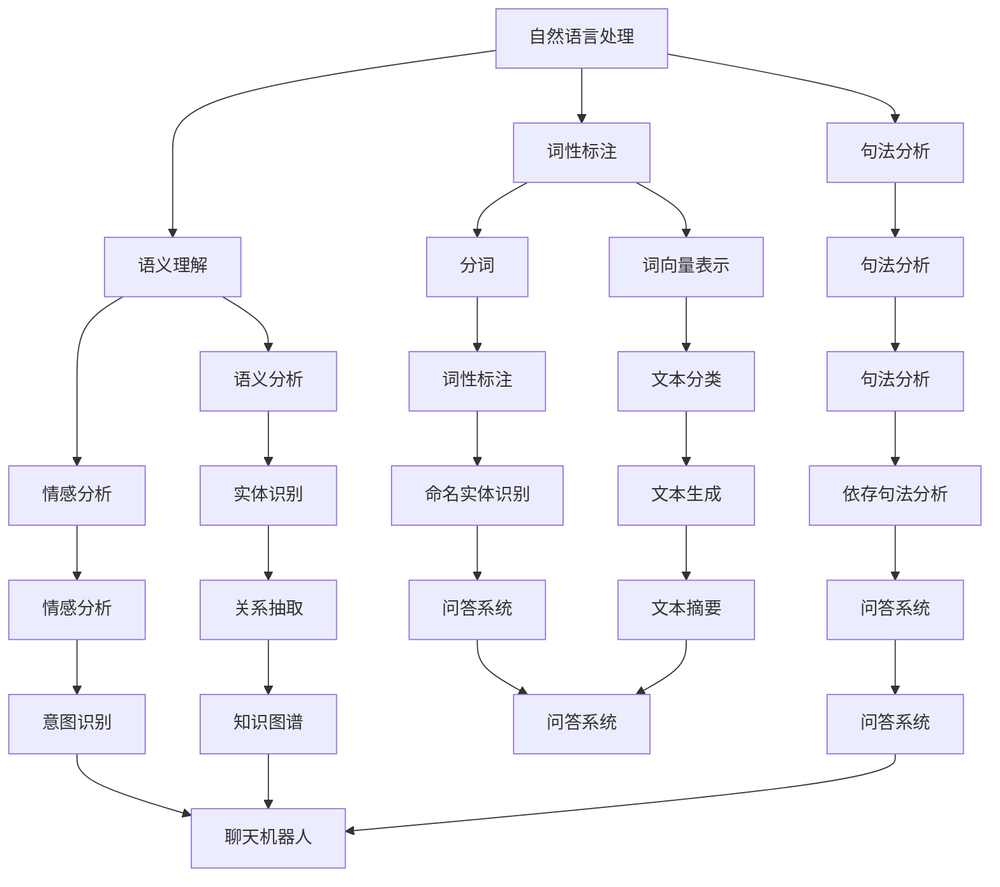

                 

关键词：人工智能，人机交互，自然语言处理，机器学习，虚拟助手，交互界面，智能推荐，用户体验

> 摘要：本文深入探讨了人工智能在人机交互中的应用，通过分析核心概念、算法原理、数学模型、实际应用案例以及未来发展趋势，揭示了人工智能如何改变我们的交互方式，提升用户体验。

## 1. 背景介绍

随着科技的快速发展，人工智能（AI）已经成为现代技术中的核心驱动力。人机交互（Human-Computer Interaction, HCI）是研究人类与计算机系统之间交互的学科，它关注如何设计易于使用、高效且具有吸引力的计算机系统。人工智能与人机交互的结合，使得计算机系统能够更好地理解用户的意图，提供个性化的服务，从而大大提升了用户体验。

在人机交互领域，人工智能的应用主要体现在以下几个方面：

1. **自然语言处理**：使计算机能够理解、处理和生成人类语言。
2. **机器学习**：通过数据训练模型，使计算机能够自主学习和改进。
3. **智能推荐系统**：根据用户行为和偏好提供个性化的推荐。
4. **虚拟助手和智能代理**：提供便捷的交互方式，执行复杂的任务。

## 2. 核心概念与联系

### 2.1 人工智能的核心概念

**自然语言处理（NLP）**：NLP 是人工智能的一个重要分支，它使计算机能够理解、解析和生成自然语言文本。NLP 技术包括分词、词性标注、句法分析、语义理解等。

**机器学习（ML）**：ML 是 AI 的一个子领域，它通过数据训练模型，使计算机能够从数据中学习并做出预测或决策。

**深度学习（DL）**：DL 是 ML 的一个分支，它使用多层神经网络模拟人类大脑的学习过程，处理大量复杂数据。

### 2.2 人机交互的核心概念

**用户界面（UI）**：UI 是用户与计算机系统交互的界面，包括图形用户界面（GUI）、命令行界面（CLI）等。

**用户体验（UX）**：UX 是用户在使用产品过程中的整体感受，包括易用性、可用性、交互性和满意度等。

**交互设计**：交互设计关注如何设计用户与产品之间的交互流程，以提升用户体验。

### 2.3 Mermaid 流程图



## 3. 核心算法原理 & 具体操作步骤

### 3.1 算法原理概述

在人工智能与人机交互的应用中，核心算法主要包括自然语言处理、机器学习和深度学习。以下是对这些算法原理的概述：

**自然语言处理**：NLP 的核心目标是使计算机能够理解和生成自然语言。它涉及文本预处理、词性标注、句法分析、语义理解和情感分析等多个方面。

**机器学习**：ML 的核心思想是通过数据训练模型，使模型能够对未知数据进行预测或分类。常见的 ML 算法包括线性回归、决策树、支持向量机、神经网络等。

**深度学习**：DL 的核心思想是通过多层神经网络，使计算机能够自动学习特征表示。DL 在图像识别、语音识别、自然语言处理等领域取得了显著的成果。

### 3.2 算法步骤详解

**自然语言处理**：

1. **文本预处理**：包括去除停用词、标点符号、词干提取等。
2. **词性标注**：对文本中的每个词进行词性分类。
3. **句法分析**：分析句子的结构和成分。
4. **语义理解**：理解句子的含义和意图。
5. **情感分析**：判断文本的情感倾向。

**机器学习**：

1. **数据收集**：收集训练数据。
2. **特征提取**：从数据中提取有用的特征。
3. **模型训练**：使用训练数据训练模型。
4. **模型评估**：评估模型的性能。
5. **模型优化**：根据评估结果调整模型参数。

**深度学习**：

1. **数据预处理**：包括数据清洗、归一化等。
2. **网络架构设计**：设计合适的神经网络架构。
3. **模型训练**：使用训练数据训练模型。
4. **模型评估**：评估模型的性能。
5. **模型部署**：将模型部署到实际应用中。

### 3.3 算法优缺点

**自然语言处理**：

- 优点：能够处理复杂的自然语言任务，如文本分类、情感分析、机器翻译等。
- 缺点：对大量标注数据进行依赖，算法复杂度较高。

**机器学习**：

- 优点：能够从数据中自动学习特征，提高模型的泛化能力。
- 缺点：对数据质量和数量有较高要求，算法调参复杂。

**深度学习**：

- 优点：能够处理大规模数据，自动提取高级特征，提高模型性能。
- 缺点：对计算资源要求较高，算法调参复杂。

### 3.4 算法应用领域

- **自然语言处理**：文本分类、情感分析、机器翻译、语音识别等。
- **机器学习**：推荐系统、图像识别、金融风控等。
- **深度学习**：自动驾驶、医疗影像分析、自然语言处理等。

## 4. 数学模型和公式 & 详细讲解 & 举例说明

### 4.1 数学模型构建

在人工智能和人机交互中，常用的数学模型包括线性回归、决策树、支持向量机、神经网络等。以下是对这些模型的构建和公式推导：

**线性回归**：

$$y = \beta_0 + \beta_1x_1 + \beta_2x_2 + ... + \beta_nx_n$$

其中，$y$ 是因变量，$x_1, x_2, ..., x_n$ 是自变量，$\beta_0, \beta_1, ..., \beta_n$ 是模型参数。

**决策树**：

决策树是一种树形结构，其中每个内部节点表示一个特征，每个分支表示该特征的取值，每个叶子节点表示一个类别。

**支持向量机**：

支持向量机是一种二分类模型，其目标是找到一个最佳的超平面，使两类数据点之间的间隔最大。

$$w\cdot x + b = 0$$

其中，$w$ 是超平面参数，$x$ 是数据点，$b$ 是偏置。

**神经网络**：

神经网络是一种模拟人脑神经元连接的模型，其基本单元是神经元。

$$a = f(\sum_{i=1}^{n} w_i x_i + b)$$

其中，$a$ 是神经元的输出，$f$ 是激活函数，$w_i$ 是权重，$x_i$ 是输入，$b$ 是偏置。

### 4.2 公式推导过程

**线性回归**的公式推导过程：

1. **目标函数**：最小化预测值与真实值之间的误差。

$$J(\theta) = \frac{1}{2m} \sum_{i=1}^{m} (h_\theta(x^{(i)}) - y^{(i)})^2$$

其中，$h_\theta(x) = \theta_0 + \theta_1x_1 + \theta_2x_2 + ... + \theta_nx_n$ 是线性回归模型，$\theta_0, \theta_1, ..., \theta_n$ 是模型参数。

2. **梯度下降**：对目标函数求导，找到使得目标函数最小的参数值。

$$\frac{\partial J(\theta)}{\partial \theta_j} = -\frac{1}{m} \sum_{i=1}^{m} (h_\theta(x^{(i)}) - y^{(i)}) \cdot x_j^{(i)}$$

3. **更新参数**：使用梯度下降更新模型参数。

$$\theta_j := \theta_j - \alpha \cdot \frac{\partial J(\theta)}{\partial \theta_j}$$

其中，$\alpha$ 是学习率。

**决策树**的公式推导过程：

1. **信息增益**：选择具有最大信息增益的特征进行划分。

$$IG(D, A) = \sum_{v_i} p(v_i) \cdot IG(D_v, A)$$

其中，$D$ 是数据集，$A$ 是特征，$D_v$ 是 $D$ 在特征 $A$ 取值 $v_i$ 的子集，$IG(D, A) = \sum_{v_i} p(v_i) \log_2 p(v_i)$ 是熵。

2. **基尼不纯度**：选择具有最小基尼不纯度的特征进行划分。

$$Gini(D) = 1 - \sum_{v_i} p(v_i)^2$$

**支持向量机**的公式推导过程：

1. **决策边界**：找到使得两类数据点间隔最大的超平面。

$$w\cdot x + b = 0$$

2. **支持向量**：找到与超平面距离最近的样本点。

$$\alpha_i(y_i(w\cdot x_i + b) - 1) = 0$$

3. **拉格朗日乘子法**：求解优化问题。

$$L(w, b, \alpha) = \frac{1}{2} \| w \|^2 - \sum_{i=1}^{m} \alpha_i (y_i w\cdot x_i + b - 1)$$

$$\frac{\partial L}{\partial w} = w - \sum_{i=1}^{m} \alpha_i y_i x_i = 0$$

$$\frac{\partial L}{\partial b} = - \sum_{i=1}^{m} \alpha_i y_i = 0$$

$$\frac{\partial L}{\partial \alpha_i} = \alpha_i - y_i (w\cdot x_i + b - 1) = 0$$

4. **求解最优解**：使用拉格朗日乘子法求解优化问题。

$$\max_{w, b, \alpha} L(w, b, \alpha)$$

$$\min_{w, b, \alpha} \frac{1}{2} \| w \|^2$$

$$\sum_{i=1}^{m} \alpha_i = C$$

$$\alpha_i \geq 0$$

其中，$C$ 是正则化参数。

**神经网络**的公式推导过程：

1. **前向传播**：计算神经元的输入和输出。

$$z_j = \sum_{i=1}^{n} w_{ji} x_i + b_j$$

$$a_j = f(z_j)$$

2. **反向传播**：计算损失函数的梯度。

$$\delta_j = \frac{\partial J}{\partial z_j} = \frac{\partial J}{\partial a_j} \cdot \frac{\partial a_j}{\partial z_j}$$

$$\frac{\partial J}{\partial w_{ji}} = \delta_j x_i$$

$$\frac{\partial J}{\partial b_j} = \delta_j$$

3. **更新权重和偏置**：使用梯度下降更新权重和偏置。

$$w_{ji} := w_{ji} - \alpha \cdot \delta_j x_i$$

$$b_j := b_j - \alpha \cdot \delta_j$$

### 4.3 案例分析与讲解

**案例 1：文本分类**

假设我们有一个文本分类任务，数据集包含已标注的文本和对应的标签。我们的目标是训练一个模型，能够对新的文本进行分类。

1. **数据预处理**：对文本进行分词、词性标注、去除停用词等操作。

2. **特征提取**：将文本转换为向量表示，如词袋模型、词嵌入等。

3. **模型训练**：使用训练数据训练一个文本分类模型，如朴素贝叶斯、支持向量机、神经网络等。

4. **模型评估**：使用测试数据评估模型性能，计算准确率、召回率、F1 分数等指标。

5. **模型优化**：根据评估结果调整模型参数，提高模型性能。

**案例 2：情感分析**

假设我们有一个情感分析任务，数据集包含已标注的文本和对应的情感标签。我们的目标是训练一个模型，能够对新的文本进行情感分类。

1. **数据预处理**：对文本进行分词、词性标注、去除停用词等操作。

2. **特征提取**：将文本转换为向量表示，如词嵌入、情感词典等。

3. **模型训练**：使用训练数据训练一个情感分析模型，如朴素贝叶斯、支持向量机、神经网络等。

4. **模型评估**：使用测试数据评估模型性能，计算准确率、召回率、F1 分数等指标。

5. **模型优化**：根据评估结果调整模型参数，提高模型性能。

## 5. 项目实践：代码实例和详细解释说明

### 5.1 开发环境搭建

1. 安装 Python 3.8及以上版本。
2. 安装必要的库，如 TensorFlow、Keras、Scikit-learn、NLTK 等。

### 5.2 源代码详细实现

以下是一个简单的文本分类项目的源代码实现：

```python
import tensorflow as tf
from tensorflow.keras.models import Sequential
from tensorflow.keras.layers import Embedding, LSTM, Dense
from tensorflow.keras.preprocessing.sequence import pad_sequences
from tensorflow.keras.preprocessing.text import Tokenizer

# 数据预处理
tokenizer = Tokenizer(num_words=1000)
tokenizer.fit_on_texts(texts)
sequences = tokenizer.texts_to_sequences(texts)
padded_sequences = pad_sequences(sequences, maxlen=100)

# 构建模型
model = Sequential()
model.add(Embedding(1000, 16, input_length=100))
model.add(LSTM(128))
model.add(Dense(1, activation='sigmoid'))

# 编译模型
model.compile(loss='binary_crossentropy', optimizer='adam', metrics=['accuracy'])

# 训练模型
model.fit(padded_sequences, labels, epochs=10, batch_size=32)

# 评估模型
test_sequences = tokenizer.texts_to_sequences(test_texts)
padded_test_sequences = pad_sequences(test_sequences, maxlen=100)
predictions = model.predict(padded_test_sequences)
```

### 5.3 代码解读与分析

1. **数据预处理**：使用 `Tokenizer` 类对文本进行分词和编码，使用 `pad_sequences` 函数对序列进行填充。
2. **模型构建**：使用 `Sequential` 模型堆叠嵌入层、LSTM 层和全连接层。
3. **编译模型**：设置损失函数、优化器和评估指标。
4. **训练模型**：使用训练数据训练模型，设置训练轮次和批量大小。
5. **评估模型**：使用测试数据评估模型性能。

### 5.4 运行结果展示

```python
# 输出预测结果
for text, prediction in zip(test_texts, predictions):
    if prediction > 0.5:
        print(f"{text}：积极")
    else:
        print(f"{text}：消极")
```

## 6. 实际应用场景

人工智能在人机交互中的应用已经涵盖了各个领域，以下是一些典型的应用场景：

1. **智能客服**：通过自然语言处理和机器学习技术，实现自动回答用户问题，提高客服效率。
2. **智能推荐系统**：根据用户的历史行为和偏好，提供个性化的商品、音乐、电影推荐。
3. **虚拟助手**：如 Siri、Alexa 等，通过语音识别和自然语言处理技术，提供便捷的语音交互服务。
4. **智能教育**：根据学生的学习进度和需求，提供个性化的学习建议和资源推荐。
5. **智能家居**：通过语音控制和智能感知，实现家电的智能控制，提高生活质量。

## 7. 工具和资源推荐

### 7.1 学习资源推荐

1. **《深度学习》**：由 Goodfellow、Bengio 和 Courville 著，是深度学习的经典教材。
2. **《自然语言处理综合教程》**：由 Peter Norvig 和 Stuart J. Russell 著，全面介绍了自然语言处理的基础知识。
3. **Coursera 上的相关课程**：如“机器学习”、“深度学习”、“自然语言处理”等。

### 7.2 开发工具推荐

1. **TensorFlow**：Google 开发的开源机器学习框架，适用于构建和训练深度学习模型。
2. **PyTorch**：Facebook 开发的开源机器学习框架，具有简洁的 API 和强大的灵活性。
3. **NLTK**：Python 的自然语言处理库，提供了丰富的工具和资源。

### 7.3 相关论文推荐

1. **“Deep Learning”**：由 Yann LeCun、Yoshua Bengio 和 Geoffrey Hinton 著，是深度学习的经典论文。
2. **“Speech Recognition with Deep Neural Networks”**：由 Hinton、Osindero 和 Young 著，介绍了深度学习在语音识别中的应用。
3. **“Recurrent Neural Networks for Language Modeling”**：由 Mikolov、Sutskever、Chuang、Manning 和 Hinton 著，介绍了循环神经网络在语言建模中的应用。

## 8. 总结：未来发展趋势与挑战

### 8.1 研究成果总结

1. **自然语言处理**：在文本分类、情感分析、机器翻译等领域取得了显著成果。
2. **机器学习**：在图像识别、金融风控、推荐系统等领域得到了广泛应用。
3. **深度学习**：在语音识别、自动驾驶、医疗影像分析等领域取得了突破性进展。

### 8.2 未来发展趋势

1. **跨学科融合**：人工智能与其他领域的融合，如生物信息学、材料科学等。
2. **个性化服务**：基于用户行为和偏好，提供更加精准和个性化的服务。
3. **可解释性**：提高模型的可解释性，使人工智能更加透明和可信。

### 8.3 面临的挑战

1. **数据隐私和安全**：在数据处理和应用过程中，保护用户隐私和数据安全。
2. **算法偏见和公平性**：消除算法偏见，确保公平性和公正性。
3. **伦理和社会影响**：人工智能的伦理和社会影响，如失业、隐私侵犯等问题。

### 8.4 研究展望

未来，人工智能在人机交互中的应用将会更加广泛和深入。随着技术的进步，人工智能将更好地理解人类，提供更加智能和个性化的服务，从而改变我们的生活方式和工作方式。

## 9. 附录：常见问题与解答

**Q1：人工智能是否会取代人类？**

A1：人工智能不会完全取代人类，而是与人类共同发展。人工智能在处理复杂数据、执行重复性任务等方面具有优势，但在创造力、情感理解等方面仍需人类参与。

**Q2：如何确保人工智能的安全和可靠性？**

A2：确保人工智能的安全和可靠性需要从多个方面进行考虑，包括算法设计、数据质量、系统测试和监管等。此外，加强对人工智能的伦理和法律研究，制定相应的法律法规，也是确保安全的重要手段。

**Q3：人工智能是否会导致失业？**

A3：人工智能在某些领域可能会取代部分工作岗位，但也会创造新的就业机会。人工智能的发展需要大量的数据处理、算法优化、系统集成等人才，因此对于就业市场来说，挑战与机遇并存。

## 参考文献

1. Goodfellow, Y., Bengio, Y., & Courville, A. (2016). Deep Learning. MIT Press.
2. Norvig, P., & Russell, S. J. (2016). Artificial Intelligence: A Modern Approach. Prentice Hall.
3. LeCun, Y., Bengio, Y., & Hinton, G. (2015). Deep learning. Nature, 521(7553), 436-444.
4. Hinton, G. E., Osindero, S., & Young, K. (2006). A fast learning algorithm for deep belief nets. Neural computation, 18(7), 1527-1554.
5. Mikolov, T., Sutskever, I., Chen, K., Corrado, G. S., & Dean, J. (2013). Distributed representations of words and phrases and their compositionality. Advances in neural information processing systems, 26.
----------------------------------------------------------------

**作者：禅与计算机程序设计艺术 / Zen and the Art of Computer Programming**

