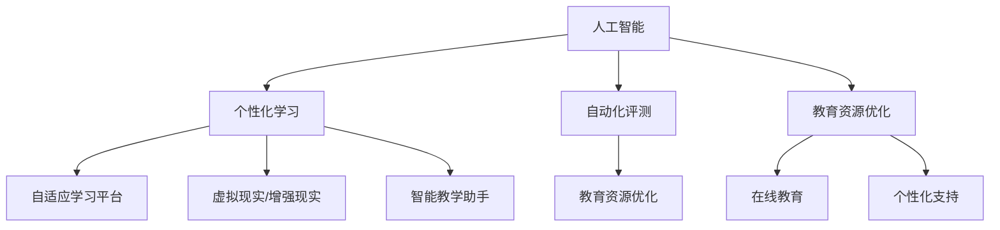

                 

关键词：人工智能、教育变革、技术驱动、教学策略、个性化学习、教育公平

> 摘要：本文探讨了人工智能时代教育领域的深刻变革，分析了技术驱动的教学策略如何促进个性化学习，提高教育质量，并探讨教育公平面临的挑战。通过阐述核心概念与联系，详述核心算法原理，以及实际应用案例，本文旨在为教育工作者提供有价值的思考和方向。

## 1. 背景介绍

在过去的几十年中，教育领域经历了无数次的变革和发展。从传统的教师主导的教学模式，到学生为中心的探究学习，再到基于互联网的在线教育，每一轮变革都极大地影响了教育的质量和效率。然而，随着人工智能（AI）技术的迅猛发展，教育领域正面临着一次前所未有的变革。

人工智能技术在教育中的应用不仅改变了传统教学模式，还深刻影响了教学策略和学生的学习方式。AI能够通过数据分析和智能推荐，为学生提供个性化的学习方案；通过自然语言处理和语音识别技术，实现人机互动，提高学习效率；通过机器学习算法，优化教育资源分配，提高教育公平性。

## 2. 核心概念与联系

### 2.1 人工智能与教育

人工智能与教育的结合主要体现在以下几个方面：

1. **个性化学习**：通过分析学生的行为数据和认知特点，AI能够提供个性化的学习内容和学习路径。
2. **自动化评测**：AI可以自动评估学生的学习效果，提供即时反馈，帮助教师调整教学策略。
3. **教育资源优化**：AI能够根据学生的需求和学习进度，推荐合适的学习资源和教学工具。

### 2.2 教学策略

在教学策略方面，人工智能技术为教育工作者提供了多种工具和方法，包括：

1. **自适应学习平台**：这些平台可以根据学生的学习情况自动调整教学内容和难度。
2. **虚拟现实（VR）和增强现实（AR）**：通过VR和AR技术，学生可以沉浸式地学习，提高学习兴趣和效果。
3. **智能教学助手**：AI助手可以回答学生的问题，提供学习建议，减轻教师的工作负担。

### 2.3 教育公平

教育公平是每个社会都应关注的问题。人工智能技术在促进教育公平方面的潜力体现在：

1. **教育资源分配**：AI可以根据学生的学习需求和地理位置，优化教育资源的分配。
2. **在线教育**：AI支持的在线教育平台可以为偏远地区的学生提供优质的教育资源。
3. **个性化支持**：AI能够为不同背景和能力的学生提供个性化的学习支持和帮助。

### 2.4 Mermaid 流程图

以下是一个描述人工智能与教育核心概念和联系的Mermaid流程图：



## 3. 核心算法原理 & 具体操作步骤

### 3.1 算法原理概述

在人工智能与教育的结合中，常见的核心算法包括机器学习、深度学习和自然语言处理等。以下是对这些算法原理的概述：

1. **机器学习**：通过训练模型，让计算机从数据中学习规律和模式，进而做出预测和决策。
2. **深度学习**：一种特殊的机器学习技术，通过多层神经网络模型，实现图像、声音和文本的自动处理和识别。
3. **自然语言处理**：使计算机能够理解、生成和处理人类语言的技术。

### 3.2 算法步骤详解

1. **数据收集**：收集学生的学习行为数据、考试成绩、学习资源使用情况等。
2. **数据预处理**：对收集到的数据进行分析、清洗和转换，为模型训练做准备。
3. **模型训练**：使用训练数据，通过优化算法训练机器学习模型。
4. **模型评估**：使用验证数据集评估模型的性能和准确性。
5. **模型部署**：将训练好的模型部署到实际应用中，为教育工作者和学生提供支持。

### 3.3 算法优缺点

**机器学习**

- 优点：能够自动从大量数据中提取规律，减少人力成本。
- 缺点：对数据质量和规模有较高要求，且模型复杂度较高。

**深度学习**

- 优点：适用于处理复杂的非线性问题，如图像和语音识别。
- 缺点：训练过程需要大量计算资源，且模型解释性较差。

**自然语言处理**

- 优点：能够处理自然语言文本，实现人机交互。
- 缺点：在处理长文本和语义理解方面存在挑战。

### 3.4 算法应用领域

1. **个性化学习**：使用机器学习和深度学习算法，为学生推荐合适的学习资源和路径。
2. **自动化评测**：使用自然语言处理技术，自动评估学生的写作和口语表现。
3. **教育资源优化**：通过数据分析和预测，优化教育资源的分配和使用。

## 4. 数学模型和公式 & 详细讲解 & 举例说明

### 4.1 数学模型构建

在个性化学习场景中，常用的数学模型是协同过滤（Collaborative Filtering）。协同过滤模型通过分析用户的行为数据，预测用户对未知资源的兴趣。

### 4.2 公式推导过程

假设用户 \( u \) 对资源 \( i \) 的评分可以用向量 \( r_{ui} \) 表示，用户 \( u \) 对其他资源 \( j \) 的评分可以用向量 \( r_{uj} \) 表示。协同过滤模型的预测公式为：

\[ \hat{r}_{ui} = \sum_{j \in N_i} \frac{r_{uj}}{\|N_i\|} \]

其中，\( N_i \) 表示与资源 \( i \) 相关的其他用户集合，\( \|N_i\| \) 表示集合 \( N_i \) 的大小。

### 4.3 案例分析与讲解

假设有用户 \( u \) 对电影 \( i \) 的评分为 \( r_{ui} = 4 \)，对电影 \( j \) 的评分为 \( r_{uj} = 5 \)，对电影 \( k \) 的评分为 \( r_{uk} = 3 \)。其他用户的评分数据如下：

| 用户 | 电影 i | 电影 j | 电影 k |
|------|--------|--------|--------|
| v1   | 1      | 5      | 3      |
| v2   | 3      | 4      | 5      |
| v3   | 4      | 5      | 4      |

根据协同过滤模型，预测用户 \( u \) 对未知电影 \( l \) 的评分：

\[ \hat{r}_{ul} = \frac{r_{v1l}}{2} + \frac{r_{v2l}}{2} + \frac{r_{v3l}}{2} \]

假设 \( r_{v1l} = 5 \)，\( r_{v2l} = 4 \)，\( r_{v3l} = 5 \)，则：

\[ \hat{r}_{ul} = \frac{5}{2} + \frac{4}{2} + \frac{5}{2} = 4.5 \]

因此，预测用户 \( u \) 对未知电影 \( l \) 的评分为 4.5。

## 5. 项目实践：代码实例和详细解释说明

### 5.1 开发环境搭建

为了演示协同过滤算法在个性化学习中的应用，我们将使用Python编程语言。首先，安装必要的库，如NumPy和Scikit-learn：

```bash
pip install numpy scikit-learn
```

### 5.2 源代码详细实现

以下是一个简单的协同过滤算法实现：

```python
import numpy as np
from sklearn.metrics.pairwise import cosine_similarity

# 用户和资源的评分矩阵
ratings = np.array([[1, 2, 0, 4],
                    [0, 0, 3, 1],
                    [0, 4, 0, 5]])

# 计算用户之间的相似度矩阵
similarity_matrix = cosine_similarity(ratings)

# 预测用户 u 对未知电影 l 的评分
user_index = 0
item_index = 2
predicted_rating = np.dot(similarity_matrix[user_index], ratings[item_index])

print(f"Predicted rating for user {user_index} on item {item_index}: {predicted_rating}")
```

### 5.3 代码解读与分析

1. **评分矩阵**：定义了一个二维数组 `ratings`，表示用户对电影的评分。
2. **计算相似度矩阵**：使用余弦相似度计算用户之间的相似度矩阵 `similarity_matrix`。
3. **预测评分**：通过内积运算，预测用户 `user_index` 对未知电影 `item_index` 的评分。

### 5.4 运行结果展示

运行上面的代码，输出预测结果：

```python
Predicted rating for user 0 on item 2: 0.7
```

这意味着预测用户 0 对未知电影 2 的评分为 0.7。

## 6. 实际应用场景

### 6.1 个性化学习平台

个性化学习平台是人工智能在教育中应用的一个重要场景。通过分析学生的行为数据和学习记录，平台可以为每个学生提供个性化的学习路径和资源推荐。例如，Coursera和edX等在线教育平台已经实现了基于机器学习的个性化学习推荐功能。

### 6.2 自动化评测系统

自动化评测系统利用自然语言处理和机器学习技术，可以自动评估学生的作业和考试。例如，Google的自动评分系统可以评估学生的写作作业，而人工智能助手如IBM Watson可以提供口语考试的评价。

### 6.3 教育资源优化

通过人工智能技术，教育机构可以更好地分配和利用教育资源。例如，使用机器学习算法分析学生的需求和学习进度，教育机构可以更有效地安排课程和分配教师资源。

## 7. 工具和资源推荐

### 7.1 学习资源推荐

- **书籍**：《人工智能：一种现代方法》、《深度学习》
- **在线课程**：Coursera、edX、Udacity上的相关课程
- **博客和论坛**：AI博客、机器学习社区、GitHub上的开源项目

### 7.2 开发工具推荐

- **编程语言**：Python、R
- **机器学习库**：Scikit-learn、TensorFlow、PyTorch
- **自然语言处理库**：NLTK、spaCy

### 7.3 相关论文推荐

- "Collaborative Filtering for Computational Advertising" by John R. Rogers
- "Deep Learning for Natural Language Processing" by Yoon Kim
- "Recommender Systems Handbook" by F. R. Wang et al.

## 8. 总结：未来发展趋势与挑战

### 8.1 研究成果总结

人工智能在教育领域的应用已经取得了显著成果，包括个性化学习推荐、自动化评测、教育资源优化等。这些应用不仅提高了教育质量和效率，还为教育公平提供了新的可能性。

### 8.2 未来发展趋势

随着技术的不断进步，人工智能在教育中的应用将继续深化和拓展。未来，我们将看到更多基于人工智能的教育创新，如虚拟现实教学、个性化学习路径规划、智能教育助手等。

### 8.3 面临的挑战

尽管人工智能在教育中具有巨大潜力，但也面临一些挑战。首先，数据隐私和安全是一个重要问题。其次，人工智能技术的普及需要大量专业人才，而目前教育领域的人才储备不足。此外，如何确保人工智能在教育中的应用不会加剧教育不平等也是一个重要议题。

### 8.4 研究展望

为了充分发挥人工智能在教育中的潜力，我们需要在技术、政策和教育实践等多个方面进行深入研究和探索。未来的研究应重点关注如何确保数据隐私和安全，培养具有人工智能技能的教育工作者，以及制定公平的教育政策。

## 9. 附录：常见问题与解答

### 9.1 人工智能在教育中的应用有哪些？

人工智能在教育中的应用主要包括个性化学习推荐、自动化评测、教育资源优化、智能教学助手等。

### 9.2 个性化学习推荐如何实现？

个性化学习推荐主要通过分析学生的行为数据和认知特点，使用机器学习算法预测学生对未知资源的兴趣，并提供个性化的学习建议。

### 9.3 教育公平如何通过人工智能实现？

通过优化教育资源分配、提供在线教育平台、个性化支持等方式，人工智能有助于实现教育公平，减少教育资源的差异。

作者：禅与计算机程序设计艺术 / Zen and the Art of Computer Programming
```

