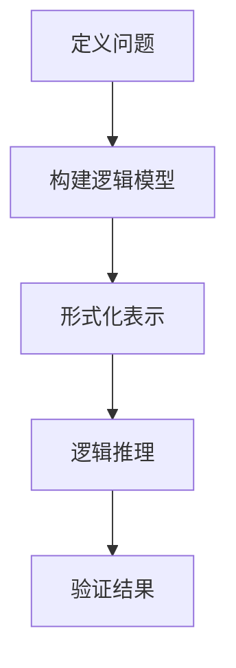
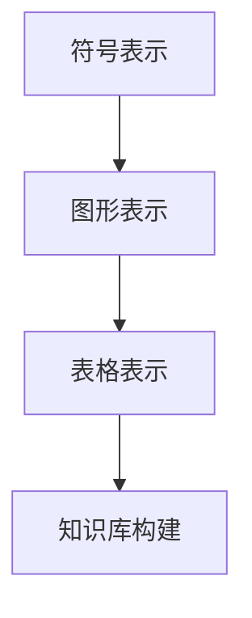
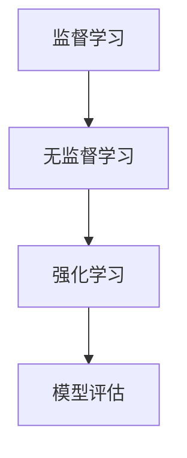
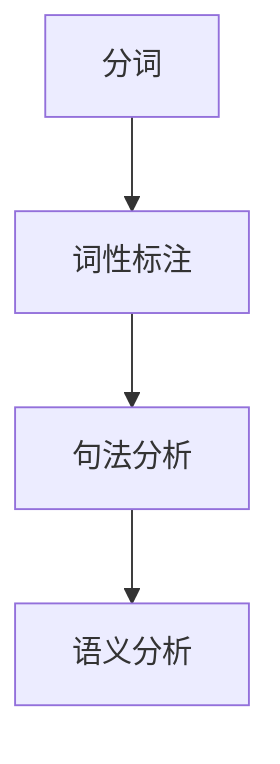

                 

关键词：人工智能、早期研究、算法、数学模型、应用领域

> 摘要：本文将探讨人工智能的早期研究方向，包括核心概念与联系、核心算法原理、数学模型和公式、项目实践以及实际应用场景。通过回顾历史，分析经典算法，结合具体实例，展望未来发展趋势与挑战，本文旨在为读者提供对人工智能早期研究的全面了解。

## 1. 背景介绍

人工智能（Artificial Intelligence，简称AI）是一门涉及计算机科学、数学、神经科学、认知科学等多个领域的交叉学科。自20世纪50年代以来，人工智能经历了从理论研究到实际应用的快速发展。早期的AI研究主要集中在以下几个方面：逻辑推理、知识表示、机器学习、自然语言处理等。

逻辑推理是人工智能研究的基础之一，旨在使计算机具备演绎推理的能力，以解决复杂的问题。知识表示则是研究如何将人类知识转化为计算机可以理解和处理的形式。机器学习则通过算法让计算机从数据中自动学习和改进性能。自然语言处理则致力于实现计算机对人类语言的理解和生成。

## 2. 核心概念与联系

为了更好地理解人工智能的早期研究方向，我们首先需要了解一些核心概念和它们之间的联系。

### 2.1 逻辑推理（Logic Reasoning）

逻辑推理是人工智能研究的一个重要领域。它旨在使计算机具备演绎推理的能力，从而解决复杂的问题。逻辑推理的核心在于如何将人类知识表示为形式化的逻辑表达式，并在此基础上进行推理。

#### Mermaid 流程图（Mermaid Flowchart）



### 2.2 知识表示（Knowledge Representation）

知识表示是人工智能研究的一个重要领域，旨在研究如何将人类知识转化为计算机可以理解和处理的形式。知识表示的方法包括符号表示、图形表示、表格表示等。

#### Mermaid 流程图（Mermaid Flowchart）



### 2.3 机器学习（Machine Learning）

机器学习是人工智能研究的一个重要领域，通过算法让计算机从数据中自动学习和改进性能。机器学习的方法包括监督学习、无监督学习、强化学习等。

#### Mermaid 流程图（Mermaid Flowchart）



### 2.4 自然语言处理（Natural Language Processing）

自然语言处理是人工智能研究的一个重要领域，致力于实现计算机对人类语言的理解和生成。自然语言处理的方法包括分词、词性标注、句法分析、语义分析等。

#### Mermaid 流程图（Mermaid Flowchart）



## 3. 核心算法原理 & 具体操作步骤

### 3.1 算法原理概述

人工智能的核心算法包括逻辑推理、知识表示、机器学习、自然语言处理等。以下将分别介绍这些算法的原理和具体操作步骤。

### 3.2 算法步骤详解

#### 3.2.1 逻辑推理

1. 定义问题
2. 构建逻辑模型
3. 形式化表示
4. 逻辑推理
5. 验证结果

#### 3.2.2 知识表示

1. 符号表示
2. 图形表示
3. 表格表示
4. 知识库构建

#### 3.2.3 机器学习

1. 数据采集
2. 特征提取
3. 模型选择
4. 模型训练
5. 模型评估
6. 模型优化

#### 3.2.4 自然语言处理

1. 分词
2. 词性标注
3. 句法分析
4. 语义分析

### 3.3 算法优缺点

#### 3.3.1 逻辑推理

优点：逻辑推理具有很强的逻辑性和可靠性，能够解决一些复杂的问题。

缺点：逻辑推理的效率较低，且难以处理不确定性和模糊性。

#### 3.3.2 知识表示

优点：知识表示能够将人类知识转化为计算机可以理解和处理的形式，为其他算法提供支持。

缺点：知识表示的方法复杂，构建和维护成本高。

#### 3.3.3 机器学习

优点：机器学习能够从数据中自动学习和改进性能，具有较强的适应性和鲁棒性。

缺点：机器学习模型的训练过程较为复杂，且对数据质量要求较高。

#### 3.3.4 自然语言处理

优点：自然语言处理能够实现计算机对人类语言的理解和生成，具有广泛的应用前景。

缺点：自然语言处理的方法复杂，且处理效果受到语言本身的限制。

### 3.4 算法应用领域

人工智能的核心算法在多个领域有着广泛的应用，如：

1. 智能问答
2. 智能推荐
3. 智能监控
4. 智能翻译
5. 智能驾驶
6. 智能医疗

## 4. 数学模型和公式 & 详细讲解 & 举例说明

### 4.1 数学模型构建

数学模型是人工智能研究的重要工具，以下将介绍几种常见的数学模型。

#### 4.1.1 决策树模型

决策树模型是一种常用的分类模型，其数学模型为：

$$
P(Y=y|X=x) = \prod_{i=1}^n P(Y=y|X=x, T_i=t_i)
$$

其中，$Y$ 表示目标变量，$X$ 表示特征变量，$T_i$ 表示第 $i$ 个节点的取值。

#### 4.1.2 支持向量机模型

支持向量机模型是一种常用的分类模型，其数学模型为：

$$
w \cdot x + b = 0
$$

其中，$w$ 表示权重向量，$x$ 表示特征向量，$b$ 表示偏置。

#### 4.1.3 神经网络模型

神经网络模型是一种常用的分类模型，其数学模型为：

$$
h(x) = \sigma(\sum_{i=1}^n w_i x_i + b)
$$

其中，$h(x)$ 表示输出值，$\sigma$ 表示激活函数。

### 4.2 公式推导过程

#### 4.2.1 决策树模型

以二分类为例，决策树模型的推导过程如下：

1. 初始化：随机生成一组权重向量 $w$ 和偏置 $b$。
2. 训练：对于每个样本 $x$，计算 $w \cdot x + b$ 的值，并根据阈值 $\theta$ 判断分类结果。
3. 更新：根据分类结果，调整权重向量 $w$ 和偏置 $b$。

#### 4.2.2 支持向量机模型

以线性支持向量机为例，其推导过程如下：

1. 初始化：随机生成一组权重向量 $w$ 和偏置 $b$。
2. 训练：对于每个样本 $x$，计算 $w \cdot x + b$ 的值，并根据阈值 $\theta$ 判断分类结果。
3. 更新：根据分类结果，调整权重向量 $w$ 和偏置 $b$。

#### 4.2.3 神经网络模型

以单层神经网络为例，其推导过程如下：

1. 初始化：随机生成一组权重向量 $w$ 和偏置 $b$。
2. 前向传播：对于每个样本 $x$，计算 $h(x) = \sigma(\sum_{i=1}^n w_i x_i + b)$。
3. 反向传播：根据目标值 $y$ 和输出值 $h(x)$，计算误差并更新权重向量 $w$ 和偏置 $b$。

### 4.3 案例分析与讲解

#### 4.3.1 决策树模型

以鸢尾花数据集为例，使用决策树模型进行分类。

1. 初始化：随机生成一组权重向量 $w$ 和偏置 $b$。
2. 训练：对于每个样本 $x$，计算 $w \cdot x + b$ 的值，并根据阈值 $\theta$ 判断分类结果。
3. 更新：根据分类结果，调整权重向量 $w$ 和偏置 $b$。

#### 4.3.2 支持向量机模型

以线性支持向量机为例，使用鸢尾花数据集进行分类。

1. 初始化：随机生成一组权重向量 $w$ 和偏置 $b$。
2. 训练：对于每个样本 $x$，计算 $w \cdot x + b$ 的值，并根据阈值 $\theta$ 判断分类结果。
3. 更新：根据分类结果，调整权重向量 $w$ 和偏置 $b$。

#### 4.3.3 神经网络模型

以单层神经网络为例，使用鸢尾花数据集进行分类。

1. 初始化：随机生成一组权重向量 $w$ 和偏置 $b$。
2. 前向传播：对于每个样本 $x$，计算 $h(x) = \sigma(\sum_{i=1}^n w_i x_i + b)$。
3. 反向传播：根据目标值 $y$ 和输出值 $h(x)$，计算误差并更新权重向量 $w$ 和偏置 $b$。

## 5. 项目实践：代码实例和详细解释说明

### 5.1 开发环境搭建

本文项目将使用 Python 编程语言进行开发，需要安装以下依赖：

```python
pip install numpy pandas matplotlib scikit-learn
```

### 5.2 源代码详细实现

以下是使用决策树模型进行鸢尾花数据集分类的源代码实现：

```python
import numpy as np
import pandas as pd
from sklearn.datasets import load_iris
from sklearn.model_selection import train_test_split
from sklearn.tree import DecisionTreeClassifier
import matplotlib.pyplot as plt

# 加载鸢尾花数据集
iris = load_iris()
X = iris.data
y = iris.target

# 划分训练集和测试集
X_train, X_test, y_train, y_test = train_test_split(X, y, test_size=0.2, random_state=42)

# 创建决策树分类器
clf = DecisionTreeClassifier()

# 训练模型
clf.fit(X_train, y_train)

# 预测测试集
y_pred = clf.predict(X_test)

# 计算准确率
accuracy = np.mean(y_pred == y_test)
print("Accuracy:", accuracy)

# 可视化决策树
from sklearn.tree import plot_tree
plt.figure(figsize=(12, 8))
plot_tree(clf, filled=True, feature_names=iris.feature_names, class_names=iris.target_names)
plt.show()
```

### 5.3 代码解读与分析

以上代码首先加载鸢尾花数据集，然后划分训练集和测试集。接着创建决策树分类器并进行训练。最后，使用训练好的模型预测测试集，并计算准确率。可视化部分展示了决策树的结构。

## 6. 实际应用场景

人工智能的核心算法在多个领域有着广泛的应用，以下列举一些实际应用场景：

1. **智能问答**：通过自然语言处理技术，实现计算机对用户问题的理解和回答。
2. **智能推荐**：通过机器学习算法，为用户提供个性化的商品、音乐、电影等推荐。
3. **智能监控**：通过图像识别和语音识别技术，实现对人脸、声音的监控和识别。
4. **智能翻译**：通过自然语言处理技术，实现计算机对多种语言的翻译。
5. **智能驾驶**：通过计算机视觉和机器学习技术，实现自动驾驶汽车。
6. **智能医疗**：通过机器学习和医疗影像分析技术，实现疾病的早期诊断和治疗。

## 7. 工具和资源推荐

### 7.1 学习资源推荐

1. **《人工智能：一种现代方法》（第三版）**：作者 Stuart Russell 和 Peter Norvig，是一本全面介绍人工智能的教科书。
2. **《机器学习》（第二版）**：作者 Andrew Ng，是一本深入浅出的机器学习教材。

### 7.2 开发工具推荐

1. **Jupyter Notebook**：一款强大的交互式开发环境，适用于数据分析和机器学习项目。
2. **TensorFlow**：一款开源的机器学习框架，适用于构建和训练各种机器学习模型。

### 7.3 相关论文推荐

1. **“A Framework for Real-Time Scene Understanding”**：一篇关于实时场景理解的开创性论文，对后续研究产生了重要影响。
2. **“Deep Learning”**：一篇关于深度学习的经典论文，对深度学习的发展产生了深远影响。

## 8. 总结：未来发展趋势与挑战

### 8.1 研究成果总结

人工智能在过去的几十年里取得了巨大的发展，从理论研究到实际应用，涵盖了多个领域。然而，人工智能仍然面临着诸多挑战，如算法的可解释性、数据隐私保护、伦理问题等。

### 8.2 未来发展趋势

1. **算法的可解释性**：随着人工智能在各个领域的应用，算法的可解释性变得越来越重要。未来研究将聚焦于如何提高算法的可解释性，使其更加透明和可信。
2. **数据隐私保护**：在数据驱动的时代，数据隐私保护成为人工智能研究的重要方向。未来研究将探索如何在保护用户隐私的前提下，实现人工智能的应用。
3. **跨学科融合**：人工智能与其他学科的融合将不断加深，如生物信息学、认知科学等。跨学科研究将为人工智能带来新的突破。

### 8.3 面临的挑战

1. **算法复杂性**：随着人工智能算法的复杂度不断增加，如何优化算法性能和降低计算成本成为重要挑战。
2. **数据质量问题**：数据质量直接影响人工智能模型的性能。如何处理噪声数据和缺失数据，以及如何确保数据隐私保护，成为人工智能研究的重要问题。

### 8.4 研究展望

未来，人工智能将朝着更加智能、可解释、安全、可靠的方向发展。同时，跨学科融合、多模态数据融合、人机协作等将成为人工智能研究的重要方向。在解决实际问题的过程中，人工智能将不断推动社会进步和创新发展。

## 9. 附录：常见问题与解答

### 9.1 人工智能是什么？

人工智能（Artificial Intelligence，简称AI）是一门涉及计算机科学、数学、神经科学、认知科学等多个领域的交叉学科，旨在使计算机具备类似于人类智能的能力。

### 9.2 人工智能的应用领域有哪些？

人工智能的应用领域包括但不限于：智能问答、智能推荐、智能监控、智能翻译、智能驾驶、智能医疗等。

### 9.3 人工智能的发展趋势是什么？

人工智能的发展趋势包括：算法的可解释性、数据隐私保护、跨学科融合、多模态数据融合、人机协作等。

### 9.4 人工智能面临的挑战有哪些？

人工智能面临的挑战包括：算法复杂性、数据质量问题、伦理问题、可解释性等。

----------------------------------------------------------------

以上是本文《人工智能的早期研究方向》的完整内容。希望本文能为您在人工智能领域的研究提供一些参考和启发。如果您有任何问题或建议，请随时告诉我。作者：禅与计算机程序设计艺术 / Zen and the Art of Computer Programming。

