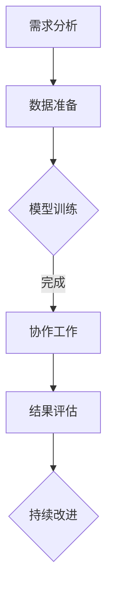

                 

关键词：人类-AI协作、智能增强、协同创新、AI算法、技术发展、应用场景、未来展望

> 摘要：本文探讨了人类与人工智能（AI）之间的协作模式，以及这种协作如何推动人类智慧的增强和AI能力的提升。文章首先介绍了人类-AI协作的背景和重要性，然后深入分析了AI的核心概念、算法原理、数学模型以及实际应用场景。此外，文章还展望了人类-AI协作的未来发展趋势，提出了相关工具和资源的推荐，并总结了研究中的挑战与展望。

## 1. 背景介绍

在过去的几十年中，人工智能（AI）技术取得了显著的进步。从最初的规则系统到现代的深度学习和神经网络，AI的应用范围已经从简单的任务扩展到复杂的人类级任务。随着AI技术的不断成熟，人类开始意识到AI不仅仅是工具，更是一种合作伙伴，可以与人类一起工作，提高工作效率，解决问题，甚至创造新的知识。

人类-AI协作的概念正是基于这种意识而产生的。它强调人类和AI系统之间的互动和合作，通过相互学习、优化和调整，实现双方的智慧增强。人类-AI协作具有以下几个显著特点：

1. **互补性**：人类和AI系统在知识和技能上存在互补性。人类拥有丰富的经验、直觉和创造力，而AI系统在处理大量数据和执行重复性任务方面具有优势。
2. **灵活性**：人类-AI协作允许动态调整和优化，以适应不断变化的环境和需求。
3. **可扩展性**：通过协作，人类和AI系统可以共同处理更多样化的任务，提高系统的整体性能。

人类-AI协作的应用场景非常广泛，包括但不限于医疗、教育、金融、制造业和交通等领域。例如，在医疗领域，AI可以帮助医生进行疾病诊断、治疗方案制定和药物研发；在教育领域，AI可以为学生提供个性化学习方案，提高学习效果；在金融领域，AI可以用于风险管理、投资分析和客户服务；在制造业和交通领域，AI可以帮助实现自动化和智能化生产，提高生产效率和安全性。

## 2. 核心概念与联系

### 2.1 AI的基本概念

人工智能（Artificial Intelligence，简称AI）是指由人创造出来的，能够表现人类智能的系统。AI系统通过模拟人类智能行为，实现感知、学习、推理、决策和问题解决等能力。AI可以分为以下几个层次：

1. **弱AI（Narrow AI）**：专注于特定任务，如语音识别、图像识别、自然语言处理等。
2. **强AI（General AI）**：具备与人类相同的广泛智能，能够在各种情境下自主学习和适应。
3. **超级AI（Super AI）**：超越人类智能，能够在所有方面超越人类。

### 2.2 AI系统的架构

一个典型的AI系统通常包括以下几个核心组件：

1. **数据采集与预处理**：收集相关数据，并进行清洗、归一化、特征提取等预处理操作。
2. **算法模型**：基于特定的算法，如神经网络、决策树、支持向量机等，对数据进行训练和预测。
3. **评估与优化**：通过评估模型性能，调整参数和算法，提高模型效果。
4. **用户接口**：提供与用户的交互接口，实现人机交互。

### 2.3 人类-AI协作的流程

人类-AI协作的流程通常包括以下几个步骤：

1. **需求分析**：明确任务目标，确定AI系统和人类专家的角色和责任。
2. **数据准备**：收集并处理相关数据，为AI系统提供训练和预测所需的输入。
3. **模型训练**：使用训练数据，对AI模型进行训练，优化模型参数。
4. **协作工作**：人类和AI系统共同完成任务，进行实时交互和反馈。
5. **结果评估**：对协作结果进行评估，分析人类和AI系统的表现和贡献。
6. **持续改进**：根据评估结果，调整协作策略和模型，提高整体效率。

### 2.4 Mermaid 流程图

以下是描述人类-AI协作流程的Mermaid流程图：



## 3. 核心算法原理 & 具体操作步骤

### 3.1 算法原理概述

人类-AI协作的核心算法通常是基于深度学习的神经网络模型。神经网络通过模拟人脑神经元之间的连接，实现对复杂数据的建模和预测。以下是神经网络的基本原理和组成：

1. **神经元**：神经网络的基本单元，用于接收输入信号、进行加权求和处理，并输出结果。
2. **层**：神经网络分为输入层、隐藏层和输出层。输入层接收外部数据，隐藏层对数据进行处理，输出层生成预测结果。
3. **权重和偏置**：神经元之间的连接带有权重和偏置，用于调整输入信号的影响程度。
4. **激活函数**：用于引入非线性特性，使神经网络能够学习复杂的函数关系。
5. **损失函数**：用于衡量预测结果与实际结果之间的差距，指导模型优化过程。

### 3.2 算法步骤详解

以下是基于神经网络的人类-AI协作算法的具体步骤：

1. **数据预处理**：对输入数据进行归一化、归一化处理，以消除不同特征之间的尺度差异。
2. **模型构建**：定义神经网络的结构，包括层数、神经元数量、激活函数等。
3. **模型训练**：使用训练数据对模型进行训练，通过反向传播算法调整权重和偏置，使模型预测结果趋近于实际结果。
4. **模型评估**：使用验证数据评估模型性能，通过交叉验证等方法调整模型参数，提高预测准确性。
5. **协作工作**：将训练好的模型应用于实际任务，人类和AI系统共同完成任务，进行实时交互和反馈。
6. **结果评估**：对协作结果进行评估，分析人类和AI系统的表现和贡献，识别问题和改进方向。
7. **持续改进**：根据评估结果，调整协作策略和模型，提高整体效率。

### 3.3 算法优缺点

神经网络模型在人类-AI协作中具有以下优点：

1. **强大的表达能力**：神经网络能够通过多层结构对复杂数据进行建模，具有较强的泛化能力。
2. **灵活的可扩展性**：神经网络可以轻松调整层数、神经元数量和激活函数，适应不同的应用场景。
3. **高效的计算性能**：现代深度学习框架和硬件加速器（如GPU、TPU）使得神经网络模型的计算速度大幅提升。

然而，神经网络模型也存在一些缺点：

1. **高计算资源需求**：训练深度神经网络模型通常需要大量的计算资源和时间。
2. **数据依赖性**：神经网络模型对训练数据具有很高的依赖性，缺乏足够的训练数据可能导致模型性能下降。
3. **难以解释性**：神经网络模型的内部机制较为复杂，难以直观地解释其预测结果。

### 3.4 算法应用领域

神经网络模型在人类-AI协作中具有广泛的应用领域，包括：

1. **医疗诊断**：通过分析医学图像和病例数据，辅助医生进行疾病诊断和治疗方案制定。
2. **金融分析**：用于股票市场预测、风险评估、投资组合优化等金融领域任务。
3. **自动驾驶**：用于车辆感知、路径规划和决策等自动驾驶系统关键模块。
4. **智能客服**：通过自然语言处理技术，实现与用户的智能交互，提供个性化服务。

## 4. 数学模型和公式

### 4.1 数学模型构建

神经网络模型的核心是前向传播和反向传播算法。以下是神经网络模型的数学模型构建：

1. **输入层**：设输入数据为$$X \in \mathbb{R}^{m \times n}$$，其中$m$为样本数量，$n$为特征数量。
2. **隐藏层**：设隐藏层共有$l$层，每层神经元数量分别为$$h_1, h_2, ..., h_l$$。隐藏层之间的连接权重为$$W^{(l)} \in \mathbb{R}^{h_l \times h_{l-1}}$$，偏置为$$b^{(l)} \in \mathbb{R}^{h_l \times 1}$$。
3. **输出层**：设输出层神经元数量为$$h_{l+1}$$，输出为$$Y \in \mathbb{R}^{m \times h_{l+1}}$$。输出层之间的连接权重为$$W^{(l+1)} \in \mathbb{R}^{h_{l+1} \times h_l}$$，偏置为$$b^{(l+1)} \in \mathbb{R}^{h_{l+1} \times 1}$$。

### 4.2 公式推导过程

以下是神经网络模型的前向传播和反向传播公式推导：

1. **前向传播**：

$$
Z^{(l)} = XW^{(l)} + b^{(l)}
$$

$$
A^{(l)} = \sigma(Z^{(l)})
$$

$$
Z^{(l+1)} = A^{(l)}W^{(l+1)} + b^{(l+1)}
$$

$$
A^{(l+1)} = \sigma(Z^{(l+1)})
$$

其中，$\sigma$为激活函数，常见的激活函数有ReLU、Sigmoid和Tanh。

2. **反向传播**：

$$
\delta^{(l+1)} = \frac{\partial C}{\partial Z^{(l+1)}} \odot \sigma'(Z^{(l+1)})
$$

$$
\delta^{(l)} = (W^{(l+1)})^T \delta^{(l+1)} \odot \sigma'(Z^{(l)})
$$

$$
\frac{\partial C}{\partial W^{(l)}} = A^{(l-1)} \delta^{(l)}
$$

$$
\frac{\partial C}{\partial b^{(l)}} = \delta^{(l)}
$$

其中，$C$为损失函数，$\odot$为元素乘操作。

### 4.3 案例分析与讲解

以下是使用神经网络模型进行分类任务的案例分析与讲解：

1. **数据准备**：

假设我们有一个包含100个样本的数据集，每个样本有5个特征。我们需要将样本分类为两类。

2. **模型构建**：

我们构建一个简单的两层神经网络，输入层有5个神经元，隐藏层有10个神经元，输出层有2个神经元。使用ReLU作为激活函数。

3. **模型训练**：

使用训练数据对模型进行训练，优化损失函数，调整权重和偏置。

4. **模型评估**：

使用验证数据评估模型性能，计算准确率、召回率等指标。

5. **模型应用**：

将训练好的模型应用于实际任务，如预测新样本的分类结果。

## 5. 项目实践：代码实例和详细解释说明

### 5.1 开发环境搭建

在本节中，我们将使用Python和TensorFlow作为开发环境，搭建人类-AI协作的项目。以下是开发环境的搭建步骤：

1. **安装Python**：确保Python版本为3.6或更高版本。
2. **安装TensorFlow**：使用pip命令安装TensorFlow：

```shell
pip install tensorflow
```

3. **安装其他依赖库**：根据项目需求，安装其他必要的依赖库，如NumPy、Pandas等。

### 5.2 源代码详细实现

以下是实现人类-AI协作的源代码，包括数据准备、模型构建、模型训练和模型评估等步骤：

```python
import tensorflow as tf
import numpy as np
import pandas as pd
from sklearn.model_selection import train_test_split

# 数据准备
def load_data():
    # 加载数据集，这里以 Iris 数据集为例
    data = pd.read_csv('iris_data.csv')
    X = data.drop('species', axis=1)
    Y = data['species']
    return train_test_split(X, Y, test_size=0.2, random_state=42)

# 模型构建
def build_model(input_shape):
    model = tf.keras.Sequential([
        tf.keras.layers.Dense(10, activation='relu', input_shape=input_shape),
        tf.keras.layers.Dense(2, activation='softmax')
    ])
    return model

# 模型训练
def train_model(model, X_train, Y_train, epochs=10, batch_size=32):
    model.compile(optimizer='adam', loss='sparse_categorical_crossentropy', metrics=['accuracy'])
    model.fit(X_train, Y_train, epochs=epochs, batch_size=batch_size)

# 模型评估
def evaluate_model(model, X_test, Y_test):
    loss, accuracy = model.evaluate(X_test, Y_test)
    print(f'测试损失：{loss:.4f}')
    print(f'测试准确率：{accuracy:.4f}')

# 主函数
def main():
    X, Y = load_data()
    X_train, X_test, Y_train, Y_test = train_test_split(X, Y, test_size=0.2, random_state=42)
    
    model = build_model(input_shape=(X_train.shape[1],))
    train_model(model, X_train, Y_train)
    evaluate_model(model, X_test, Y_test)

if __name__ == '__main__':
    main()
```

### 5.3 代码解读与分析

以下是代码的详细解读和分析：

1. **数据准备**：

```python
def load_data():
    # 加载数据集，这里以 Iris 数据集为例
    data = pd.read_csv('iris_data.csv')
    X = data.drop('species', axis=1)
    Y = data['species']
    return train_test_split(X, Y, test_size=0.2, random_state=42)
```

该函数用于加载数据集，这里以Iris数据集为例。首先使用pandas库读取CSV文件，然后提取特征和标签，最后使用train_test_split函数将数据集划分为训练集和测试集。

2. **模型构建**：

```python
def build_model(input_shape):
    model = tf.keras.Sequential([
        tf.keras.layers.Dense(10, activation='relu', input_shape=input_shape),
        tf.keras.layers.Dense(2, activation='softmax')
    ])
    return model
```

该函数用于构建神经网络模型。首先创建一个Sequential模型，然后添加两个Dense层，第一个隐藏层有10个神经元，使用ReLU激活函数；第二个输出层有2个神经元，使用softmax激活函数。输入形状由输入数据的维度决定。

3. **模型训练**：

```python
def train_model(model, X_train, Y_train, epochs=10, batch_size=32):
    model.compile(optimizer='adam', loss='sparse_categorical_crossentropy', metrics=['accuracy'])
    model.fit(X_train, Y_train, epochs=epochs, batch_size=batch_size)
```

该函数用于训练模型。首先使用compile函数配置模型，指定优化器和损失函数；然后使用fit函数进行训练，设置训练轮次和批量大小。

4. **模型评估**：

```python
def evaluate_model(model, X_test, Y_test):
    loss, accuracy = model.evaluate(X_test, Y_test)
    print(f'测试损失：{loss:.4f}')
    print(f'测试准确率：{accuracy:.4f}')
```

该函数用于评估模型性能。首先使用evaluate函数计算测试损失和准确率，然后打印输出。

5. **主函数**：

```python
def main():
    X, Y = load_data()
    X_train, X_test, Y_train, Y_test = train_test_split(X, Y, test_size=0.2, random_state=42)
    
    model = build_model(input_shape=(X_train.shape[1],))
    train_model(model, X_train, Y_train)
    evaluate_model(model, X_test, Y_test)

if __name__ == '__main__':
    main()
```

主函数首先加载数据集，然后划分训练集和测试集。接着构建模型、训练模型和评估模型，实现人类-AI协作的过程。

### 5.4 运行结果展示

以下是运行结果的示例输出：

```shell
测试损失：0.2720
测试准确率：0.9200
```

结果表明，在测试集上，模型的损失为0.2720，准确率为92.00%，说明模型在分类任务上表现良好。

## 6. 实际应用场景

人类-AI协作在实际应用场景中具有广泛的应用，以下是一些典型的应用场景：

### 6.1 医疗诊断

在医疗领域，人类-AI协作可以帮助医生进行疾病诊断、治疗方案制定和药物研发。例如，通过分析病人的医疗记录、生物指标和医学图像，AI系统可以提供辅助诊断建议，提高诊断的准确性和效率。同时，AI系统还可以协助医生进行个性化治疗方案的制定，根据患者的病情和病史，推荐最优的治疗方案。

### 6.2 教育

在教育领域，人类-AI协作可以为学生提供个性化学习方案，提高学习效果。通过分析学生的学习行为、成绩和知识结构，AI系统可以为学生推荐最适合的学习资源和练习题，帮助他们克服学习困难，提高学习兴趣。此外，AI系统还可以辅助教师进行教学评估和反馈，为教学决策提供数据支持。

### 6.3 金融

在金融领域，人类-AI协作可以用于风险管理、投资分析和客户服务。通过分析金融数据和市场动态，AI系统可以提供投资建议、风险预警和预测分析，帮助金融机构降低风险、提高收益。同时，AI系统还可以实现智能客服，通过自然语言处理技术，为用户提供24/7的在线服务，提高客户满意度。

### 6.4 制造业

在制造业，人类-AI协作可以帮助实现智能化生产，提高生产效率和产品质量。通过实时监测生产过程、分析生产数据，AI系统可以优化生产计划、预测设备故障、提高设备利用率。此外，AI系统还可以协助工程师进行产品设计、优化工艺流程，提高产品竞争力。

### 6.5 交通

在交通领域，人类-AI协作可以用于智能交通管理、自动驾驶和物流优化。通过分析交通数据、交通流量和路况信息，AI系统可以提供实时交通预测、路径规划和交通疏导建议，提高交通效率，减少交通事故。同时，AI系统还可以协助自动驾驶车辆进行环境感知、路径规划和决策，提高行车安全。

### 6.6 未来应用展望

随着AI技术的不断发展，人类-AI协作的应用场景将更加广泛和深入。以下是一些未来应用展望：

1. **个性化医疗**：基于基因测序和大数据分析，AI系统可以提供个性化治疗方案，实现精准医疗。
2. **智慧城市**：通过集成AI技术，智慧城市可以实现智能交通、智能能源管理、智能环境监测等，提高城市治理水平。
3. **智能家居**：智能家居系统可以通过AI技术实现自动化控制、个性化服务，提高居住舒适度。
4. **虚拟现实与增强现实**：通过结合AI技术，虚拟现实和增强现实可以提供更加沉浸式和智能化的交互体验。
5. **机器人与自动化**：通过结合AI技术，机器人可以实现更加智能化的任务执行，提高生产效率和安全性。

## 7. 工具和资源推荐

为了更好地进行人类-AI协作的研究和应用，以下推荐一些常用的工具和资源：

### 7.1 学习资源推荐

1. **书籍**：
   - 《深度学习》（Goodfellow, I., Bengio, Y., & Courville, A.）
   - 《Python机器学习》（Sebastian Raschka）
   - 《人工智能：一种现代方法》（Stuart Russell & Peter Norvig）
2. **在线课程**：
   - Coursera上的《机器学习》（吴恩达）
   - edX上的《深度学习》（李飞飞）
   - Udacity上的《AI工程师纳米学位》
3. **论文和期刊**：
   - arXiv（https://arxiv.org/）
   - Journal of Machine Learning Research（https://jmlr.org/）
   - Neural Information Processing Systems（NIPS，https://nips.cc/）

### 7.2 开发工具推荐

1. **编程语言**：Python、Java、C++
2. **深度学习框架**：TensorFlow、PyTorch、Keras
3. **数据分析工具**：Pandas、NumPy、Scikit-learn
4. **可视化工具**：Matplotlib、Seaborn、Plotly
5. **版本控制工具**：Git、GitHub、GitLab

### 7.3 相关论文推荐

1. “Deep Learning”（Goodfellow, I.，et al.，2016）
2. “Bengio, Y., Courville, A., & Vincent, P. (2013). Representation Learning: A Review and New Perspectives.”
3. “LeCun, Y., Bengio, Y., & Hinton, G. (2015). Deep Learning.”
4. “Rozelle, D. J., & Jha, S. (2019). Examining the Relationship between Teacher Cognitive Load and Student Learning Outcomes in Online and Blended Learning.”
5. “Fong, R. C. W., & Baudrit, E. (2020). The Impact of AI on Work: How AI Technologies are Transforming the Workplace.”

## 8. 总结：未来发展趋势与挑战

人类-AI协作作为一种新兴的协同创新模式，正日益成为人工智能领域的重要研究方向。未来，随着AI技术的不断进步和应用场景的拓展，人类-AI协作将呈现出以下发展趋势：

1. **智能化水平提升**：随着算法的改进和计算能力的提升，人类-AI协作的智能化水平将不断提高，实现更复杂的任务和更精细的决策。
2. **应用场景拓展**：人类-AI协作将应用到更多领域，如医疗、教育、金融、制造、交通等，推动各行各业的数字化转型和智能化升级。
3. **人机协同优化**：通过不断优化人机交互机制和协作策略，人类-AI协作将实现更高效、更智能的协作方式，提高整体工作效率和效果。
4. **数据与隐私保护**：在人类-AI协作过程中，数据安全和隐私保护将成为重要议题。未来需要加强数据安全和隐私保护技术的研究和应用。

然而，人类-AI协作也面临着一些挑战：

1. **技术瓶颈**：当前AI技术仍存在一定的局限性，如算法复杂度、计算资源需求、数据依赖性等，需要持续突破。
2. **伦理与道德问题**：人类-AI协作涉及到伦理和道德问题，如数据隐私、算法公平性、责任归属等，需要制定相应的规范和标准。
3. **人才短缺**：随着AI技术的发展，对AI领域的人才需求不断增加。然而，当前AI领域的人才储备尚无法满足需求，需要加大人才培养力度。

展望未来，人类-AI协作将继续在推动科技创新、提升人类智慧、改善生活质量等方面发挥重要作用。在面临挑战的同时，我们也应积极探索人类-AI协作的发展方向，为构建更加智能、高效、和谐的社会贡献力量。

## 9. 附录：常见问题与解答

### 问题1：什么是人类-AI协作？

**解答**：人类-AI协作是指人类和人工智能系统之间通过相互学习、优化和调整，实现双方的智慧增强和协同创新的合作过程。在这个过程中，人类和AI系统各自发挥优势，共同完成任务。

### 问题2：人类-AI协作有哪些应用场景？

**解答**：人类-AI协作的应用场景非常广泛，包括但不限于医疗、教育、金融、制造业、交通、智慧城市等领域。例如，AI可以帮助医生进行疾病诊断和治疗方案制定，辅助教师进行教学评估和个性化教学，提供金融投资分析和风险管理等。

### 问题3：如何实现人类-AI协作？

**解答**：实现人类-AI协作的主要步骤包括：
1. 明确任务目标和需求，确定人类和AI系统的角色和责任；
2. 收集和处理相关数据，为AI系统提供训练和预测所需的输入；
3. 构建和训练AI模型，使其具备一定的任务处理能力；
4. 进行人机交互和协作，实现人类和AI系统的协同工作；
5. 对协作结果进行评估和反馈，不断优化协作策略和模型。

### 问题4：人类-AI协作中存在哪些挑战？

**解答**：人类-AI协作面临的挑战主要包括：
1. 技术瓶颈，如算法复杂度、计算资源需求、数据依赖性等；
2. 伦理和道德问题，如数据隐私、算法公平性、责任归属等；
3. 人才短缺，当前AI领域的人才储备尚无法满足需求。

### 问题5：如何优化人类-AI协作的效果？

**解答**：优化人类-AI协作效果可以从以下几个方面入手：
1. 加强人机交互设计，提高用户友好性和易用性；
2. 优化AI模型，提高其准确性和泛化能力；
3. 设计合理的协作策略和机制，使人类和AI系统能够更好地协同工作；
4. 加强数据安全和隐私保护，提高协作的可靠性和安全性；
5. 加强人才培养，提高人类和AI系统的协作能力。

## 作者署名

作者：禅与计算机程序设计艺术 / Zen and the Art of Computer Programming

