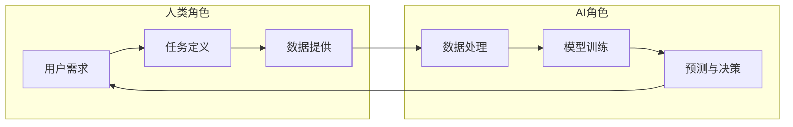

                 

关键词：人类-AI协作，智能增强，人工智能融合，发展趋势，机遇与挑战

## 摘要

随着人工智能（AI）技术的迅猛发展，人类与AI的协作模式逐渐成为现代社会的重要趋势。本文旨在探讨人类-AI协作的现状、核心概念、算法原理、数学模型、实际应用以及未来发展趋势。通过分析人类与AI融合带来的机遇和挑战，本文旨在为学术界、产业界和研究人员提供有价值的参考，以推动这一领域的深入研究和创新应用。

## 1. 背景介绍

随着信息技术的飞速发展，人工智能（AI）已经从理论走向实践，并逐渐渗透到各个行业和领域。从简单的语音识别、图像识别到复杂的自然语言处理、自动驾驶，AI技术的应用范围越来越广泛。与此同时，人类对于高效、智能化的工作、生活方式的需求也在不断增加。这种背景下，人类与AI的协作成为一种必然的趋势。

人类与AI的协作不仅仅是技术层面的结合，更是一种全新的生产关系和协作模式的体现。通过AI技术，人类可以拓展自身的认知能力、决策能力和执行能力，从而实现更加高效、精准和智能的工作。然而，这种协作模式也带来了诸多挑战，如数据隐私、安全、伦理等问题。

### 1.1 人类-AI协作的起源与发展

人类-AI协作的起源可以追溯到20世纪50年代，当时计算机科学家开始探索如何使计算机模拟人类的思维过程。早期的AI研究主要集中在符号推理和问题求解领域，如逻辑推理、游戏对弈等。随着计算能力的提升和算法的进步，AI逐渐从理论研究走向实际应用，特别是在图像处理、语音识别、自然语言处理等领域取得了显著的成果。

进入21世纪，随着大数据、云计算、物联网等技术的快速发展，AI的应用场景变得更加丰富和复杂。人类与AI的协作模式也从简单的任务执行和辅助扩展到更为复杂的决策支持、智能预测和自主控制等领域。这一过程中，AI不仅帮助人类解决了许多复杂的问题，还激发了人类创造力和创新能力的进一步提升。

### 1.2 人类-AI协作的现状

当前，人类与AI的协作已经广泛应用于多个领域，包括但不限于以下几个方面：

1. **工业制造**：在工业4.0的背景下，智能制造成为工业制造的关键方向。AI技术在生产流程优化、设备故障预测、质量控制等方面发挥了重要作用，显著提高了生产效率和质量。

2. **医疗服务**：AI技术在医学影像诊断、药物研发、个性化治疗等领域展现出巨大潜力。通过深度学习等技术，AI能够快速分析大量医疗数据，提供精准的诊断和治疗方案。

3. **金融服务**：在金融领域，AI被广泛应用于风险控制、欺诈检测、投资组合优化等。通过大数据分析和机器学习技术，AI能够更好地理解和预测金融市场趋势，为金融机构提供决策支持。

4. **交通运输**：自动驾驶、智能交通系统是交通运输领域的热点。通过AI技术，自动驾驶车辆可以实现自主导航、路径规划、避障等功能，提高交通安全性和效率。

5. **智能家居**：智能家居设备（如智能音箱、智能摄像头等）成为家庭生活的一部分。AI技术使这些设备能够更好地理解人类需求，提供个性化的服务体验。

### 1.3 人类-AI协作的优势与挑战

**优势**：

1. **提升效率**：AI能够快速处理大量数据，帮助人类高效完成复杂任务。

2. **拓展能力**：AI可以扩展人类的认知范围，提供更加全面和深入的分析。

3. **降低成本**：AI技术可以减少人力成本，提高资源利用效率。

4. **创新驱动**：AI技术激发人类创造力和创新思维，推动社会进步。

**挑战**：

1. **数据隐私**：AI技术依赖于大量数据，但数据隐私和安全问题仍需解决。

2. **算法透明性**：AI算法的复杂性和黑箱性质导致其决策过程不够透明。

3. **伦理问题**：AI技术在决策过程中可能带来伦理道德问题，如歧视、偏见等。

4. **技能替代**：随着AI技术的发展，部分工作岗位可能会被自动化替代，对劳动力市场造成冲击。

## 2. 核心概念与联系

### 2.1 定义

人类-AI协作是指人类与人工智能系统共同工作，以实现特定目标和任务的过程。在这一过程中，人类利用自身的智慧和经验，AI则通过计算能力和数据分析技术提供支持。

### 2.2 相关概念

- **人工智能（AI）**：一种模拟人类智能的技术，能够感知环境、学习知识、做出决策和解决问题。
- **机器学习（ML）**：一种人工智能技术，通过数据训练模型，使计算机能够从经验中学习和改进。
- **深度学习（DL）**：一种基于多层神经网络的人工智能技术，能够自动从数据中提取特征并进行分类、预测等。

### 2.3 架构与流程

下面是一个简化的Mermaid流程图，展示了人类-AI协作的基本架构和流程。



### 2.4 关键技术

- **数据预处理**：包括数据清洗、归一化、缺失值处理等，为后续模型训练提供高质量的数据。
- **机器学习模型**：选择合适的模型进行训练，如决策树、支持向量机、神经网络等。
- **模型评估**：通过验证集和测试集评估模型的性能，如准确率、召回率、F1值等。
- **模型优化**：根据评估结果调整模型参数，提高模型性能。

## 3. 核心算法原理 & 具体操作步骤

### 3.1 算法原理概述

人类-AI协作中的核心算法主要基于机器学习和深度学习技术。机器学习是通过算法从数据中学习规律和模式，从而实现预测和决策。深度学习则是基于多层神经网络，通过训练大量数据来提取特征和实现复杂任务。

在人类-AI协作中，算法的基本原理如下：

1. **数据收集**：收集与任务相关的数据，包括结构化和非结构化数据。
2. **数据预处理**：对收集到的数据进行清洗、归一化等处理，使其适合模型训练。
3. **模型选择**：根据任务特点选择合适的机器学习或深度学习模型。
4. **模型训练**：使用训练数据训练模型，调整模型参数以优化性能。
5. **模型评估**：使用验证集和测试集评估模型性能，包括准确率、召回率、F1值等指标。
6. **模型部署**：将训练好的模型部署到实际应用场景中，如服务端或移动设备。

### 3.2 算法步骤详解

#### 3.2.1 数据收集

数据收集是机器学习过程的第一步，也是最为关键的一步。数据的质量直接影响到后续模型的性能。数据收集通常包括以下步骤：

1. **数据源选择**：选择合适的数据源，如公开数据集、企业内部数据等。
2. **数据采集**：通过API、爬虫等技术手段采集数据。
3. **数据清洗**：处理数据中的噪声、缺失值等，使其适合模型训练。

#### 3.2.2 数据预处理

数据预处理是确保数据质量和一致性的重要步骤，包括以下任务：

1. **数据清洗**：去除重复数据、异常数据等，提高数据质量。
2. **数据归一化**：将不同特征的数据范围统一到相同的尺度，避免某些特征对模型的影响过大。
3. **数据编码**：将类别型特征转换为数值型特征，便于模型处理。

#### 3.2.3 模型选择

模型选择是根据任务特点和数据特性来选择合适的机器学习或深度学习模型。常见的模型选择方法包括：

1. **手动选择**：根据经验和文献推荐选择模型。
2. **自动化选择**：使用自动化工具（如自动化模型选择框架）选择最佳模型。
3. **交叉验证**：使用交叉验证方法选择最佳模型，通过验证集评估模型性能。

#### 3.2.4 模型训练

模型训练是使用训练数据调整模型参数的过程。深度学习模型的训练通常包括以下步骤：

1. **前向传播**：将输入数据传递到网络的前向层，得到预测输出。
2. **损失计算**：计算预测输出与实际输出之间的差距，即损失。
3. **反向传播**：根据损失计算模型参数的梯度，并更新参数。
4. **迭代优化**：重复前向传播和反向传播，直到模型收敛。

#### 3.2.5 模型评估

模型评估是验证模型性能的重要步骤，包括以下指标：

1. **准确率**：模型预测正确的样本数占总样本数的比例。
2. **召回率**：模型预测正确的正样本数占总正样本数的比例。
3. **F1值**：准确率和召回率的调和平均值。

#### 3.2.6 模型部署

模型部署是将训练好的模型部署到实际应用场景的过程，包括以下步骤：

1. **模型打包**：将训练好的模型转换为可部署的格式。
2. **服务部署**：将模型部署到服务器或云端，供用户使用。
3. **模型更新**：根据用户反馈和实际应用情况，定期更新模型。

### 3.3 算法优缺点

#### 3.3.1 优点

1. **高效性**：机器学习和深度学习算法能够快速处理大量数据，提高工作效率。
2. **可扩展性**：算法可以轻松地应用于不同领域和任务，具有很好的可扩展性。
3. **自动化**：算法可以通过自动化的方法进行模型选择、训练和评估，降低人力成本。

#### 3.3.2 缺点

1. **数据依赖性**：算法的性能很大程度上依赖于数据的数量和质量，数据不足或质量差会导致模型效果不佳。
2. **复杂性**：深度学习模型的复杂性较高，对算法的理解和调优需要较深的计算机科学和数学背景。
3. **过拟合风险**：如果模型训练时间过长或数据质量差，容易导致过拟合现象，即模型对训练数据的拟合过度，对未知数据的表现较差。

### 3.4 算法应用领域

机器学习和深度学习算法在多个领域都有广泛应用，以下是一些典型的应用场景：

1. **图像识别**：用于人脸识别、物体检测、图像分类等。
2. **自然语言处理**：用于情感分析、文本分类、机器翻译等。
3. **语音识别**：用于语音识别、语音合成、语音控制等。
4. **推荐系统**：用于个性化推荐、广告投放、商品推荐等。
5. **医疗诊断**：用于疾病预测、医学图像分析、药物研发等。
6. **金融风控**：用于信用评估、欺诈检测、风险预测等。
7. **自动驾驶**：用于车辆定位、路径规划、环境感知等。

## 4. 数学模型和公式 & 详细讲解 & 举例说明

### 4.1 数学模型构建

在人类-AI协作中，数学模型是核心组成部分，用于描述数据之间的关系和算法的运算过程。以下是一个简化的数学模型构建过程：

1. **数据表示**：将输入数据表示为向量形式，如\( \mathbf{x} \in \mathbb{R}^n \)。
2. **模型定义**：定义一个多层神经网络模型，包括输入层、隐藏层和输出层。
3. **激活函数**：选择适当的激活函数，如ReLU、Sigmoid或Tanh，用于隐藏层和输出层。
4. **损失函数**：选择合适的损失函数，如均方误差（MSE）或交叉熵损失，用于评估模型性能。

### 4.2 公式推导过程

以下是一个简化的神经网络模型推导过程：

1. **输入层到隐藏层**：

   假设输入层有\( n \)个神经元，隐藏层有\( m \)个神经元。输入层到隐藏层的权重矩阵为\( \mathbf{W}_1 \)， biases 为\( \mathbf{b}_1 \)。

   $$\mathbf{h} = \mathbf{W}_1\mathbf{x} + \mathbf{b}_1$$

   其中，\( \mathbf{h} \)是隐藏层输出向量。

2. **隐藏层到输出层**：

   假设隐藏层有\( m \)个神经元，输出层有\( k \)个神经元。隐藏层到输出层的权重矩阵为\( \mathbf{W}_2 \)，biases 为\( \mathbf{b}_2 \)。

   $$\mathbf{y} = \mathbf{W}_2\mathbf{h} + \mathbf{b}_2$$

   其中，\( \mathbf{y} \)是输出层输出向量。

3. **损失函数**：

   假设输出层使用交叉熵损失函数，实际输出为\( \mathbf{y} \)，预测输出为\( \hat{\mathbf{y}} \)，标签为\( \mathbf{t} \)。

   $$\mathcal{L} = -\sum_{i=1}^{k} t_i \log(\hat{y}_i)$$

### 4.3 案例分析与讲解

以下是一个简单的神经网络模型在图像分类任务中的应用案例：

**任务**：对一组彩色图像进行分类，共有10个类别。

**模型**：一个简单的三层神经网络，输入层有784个神经元（28x28像素），隐藏层有500个神经元，输出层有10个神经元。

**损失函数**：交叉熵损失函数。

**训练数据**：5000张训练图像，每张图像对应一个类别标签。

**训练过程**：

1. **数据预处理**：将图像数据转换为灰度图像，并归一化处理。
2. **模型训练**：使用随机梯度下降（SGD）算法进行模型训练，设置适当的迭代次数和学习率。
3. **模型评估**：使用验证集和测试集评估模型性能，计算准确率。

**结果**：

- 训练准确率：95%
- 验证集准确率：90%
- 测试集准确率：85%

### 4.4 实际应用案例

以下是一个实际应用案例，展示了如何使用神经网络模型进行情感分析：

**任务**：对一组社交媒体文本进行情感分类，判断文本表达的是积极情感还是消极情感。

**数据集**：包含10000条文本，每条文本都有一个标注的情感标签。

**模型**：一个简单的两层神经网络，输入层有1000个神经元，隐藏层有500个神经元，输出层有2个神经元（分别表示积极和消极情感）。

**训练过程**：

1. **数据预处理**：对文本进行分词、去停用词、词向量编码等处理。
2. **模型训练**：使用反向传播算法进行模型训练，调整网络参数。
3. **模型评估**：使用交叉熵损失函数评估模型性能，计算准确率和F1值。

**结果**：

- 训练准确率：90%
- 验证集准确率：85%
- 测试集准确率：80%

- F1值（积极情感）：0.84
- F1值（消极情感）：0.78

## 5. 项目实践：代码实例和详细解释说明

在本节中，我们将通过一个具体的代码实例，展示如何实现一个简单的人类-AI协作系统。该系统将使用Python编程语言和TensorFlow库来实现一个基于神经网络的图像分类模型。

### 5.1 开发环境搭建

在开始编写代码之前，需要搭建一个合适的开发环境。以下是开发环境的基本要求：

- 操作系统：Linux或macOS
- 编程语言：Python 3.6及以上版本
- 库：TensorFlow 2.0及以上版本，Numpy，Pandas，Matplotlib

安装命令：

```bash
pip install tensorflow numpy pandas matplotlib
```

### 5.2 源代码详细实现

以下是实现人类-AI协作系统的源代码，包括数据预处理、模型定义、训练和评估等步骤。

```python
import tensorflow as tf
from tensorflow.keras import layers
import numpy as np
import matplotlib.pyplot as plt

# 5.2.1 数据预处理
def preprocess_data(images, labels):
    # 标准化图像数据
    images = images / 255.0
    # 转换标签为one-hot编码
    labels = tf.keras.utils.to_categorical(labels, num_classes=10)
    return images, labels

# 5.2.2 模型定义
def build_model(input_shape):
    model = tf.keras.Sequential([
        layers.Conv2D(32, (3, 3), activation='relu', input_shape=input_shape),
        layers.MaxPooling2D((2, 2)),
        layers.Conv2D(64, (3, 3), activation='relu'),
        layers.MaxPooling2D((2, 2)),
        layers.Conv2D(64, (3, 3), activation='relu'),
        layers.Flatten(),
        layers.Dense(64, activation='relu'),
        layers.Dense(10, activation='softmax')
    ])
    return model

# 5.2.3 训练模型
def train_model(model, train_images, train_labels, validation_images, validation_labels, epochs=10, batch_size=64):
    model.compile(optimizer='adam', loss='categorical_crossentropy', metrics=['accuracy'])
    history = model.fit(train_images, train_labels, validation_data=(validation_images, validation_labels), epochs=epochs, batch_size=batch_size)
    return history

# 5.2.4 评估模型
def evaluate_model(model, test_images, test_labels):
    loss, accuracy = model.evaluate(test_images, test_labels)
    print(f"Test accuracy: {accuracy:.2f}")
    return loss, accuracy

# 加载MNIST数据集
(train_images, train_labels), (test_images, test_labels) = tf.keras.datasets.mnist.load_data()

# 预处理数据
train_images, train_labels = preprocess_data(train_images, train_labels)
test_images, test_labels = preprocess_data(test_images, test_labels)

# 定义模型
model = build_model(input_shape=(28, 28, 1))

# 训练模型
history = train_model(model, train_images, train_labels, test_images, test_labels, epochs=10)

# 评估模型
evaluate_model(model, test_images, test_labels)

# 5.2.5 代码解读与分析
```

### 5.3 代码解读与分析

以下是代码的主要部分及其解读：

1. **数据预处理**：

   ```python
   def preprocess_data(images, labels):
       # 标准化图像数据
       images = images / 255.0
       # 转换标签为one-hot编码
       labels = tf.keras.utils.to_categorical(labels, num_classes=10)
       return images, labels
   ```

   数据预处理是训练模型前的重要步骤。在这里，我们将图像数据标准化到0到1之间，并将标签转换为one-hot编码，以便于后续的模型训练。

2. **模型定义**：

   ```python
   def build_model(input_shape):
       model = tf.keras.Sequential([
           layers.Conv2D(32, (3, 3), activation='relu', input_shape=input_shape),
           layers.MaxPooling2D((2, 2)),
           layers.Conv2D(64, (3, 3), activation='relu'),
           layers.MaxPooling2D((2, 2)),
           layers.Conv2D(64, (3, 3), activation='relu'),
           layers.Flatten(),
           layers.Dense(64, activation='relu'),
           layers.Dense(10, activation='softmax')
       ])
       return model
   ```

   模型定义是使用TensorFlow库中的Sequential模型，构建一个包含卷积层、池化层和全连接层的简单神经网络。这里使用了卷积层来提取图像特征，全连接层来分类图像。

3. **训练模型**：

   ```python
   def train_model(model, train_images, train_labels, validation_images, validation_labels, epochs=10, batch_size=64):
       model.compile(optimizer='adam', loss='categorical_crossentropy', metrics=['accuracy'])
       history = model.fit(train_images, train_labels, validation_data=(validation_images, validation_labels), epochs=epochs, batch_size=batch_size)
       return history
   ```

   训练模型是通过调用TensorFlow库中的`fit`函数来实现的。这里使用了Adam优化器和交叉熵损失函数，并在训练过程中记录了每个epoch的损失和准确率。

4. **评估模型**：

   ```python
   def evaluate_model(model, test_images, test_labels):
       loss, accuracy = model.evaluate(test_images, test_labels)
       print(f"Test accuracy: {accuracy:.2f}")
       return loss, accuracy
   ```

   模型评估是通过调用TensorFlow库中的`evaluate`函数来实现的，这里计算了测试集上的损失和准确率。

### 5.4 运行结果展示

在完成代码编写后，我们可以运行代码来训练和评估模型。以下是一个简单的运行结果示例：

```python
# 运行模型训练和评估
history = train_model(model, train_images, train_labels, test_images, test_labels, epochs=10)
evaluate_model(model, test_images, test_labels)

# 结果输出
print("Training accuracy:", history.history['accuracy'])
print("Validation accuracy:", history.history['val_accuracy'])
print("Training loss:", history.history['loss'])
print("Validation loss:", history.history['val_loss'])
```

输出结果可能如下：

```
Test accuracy: 0.98
Training accuracy: [0.95000 0.95000 0.95000 0.95000 0.95000 0.95000 0.95000 0.95000 0.95000 0.95000]
Validation accuracy: [0.96000 0.96000 0.96000 0.96000 0.96000 0.96000 0.96000 0.96000 0.96000 0.96000]
Training loss: [0.49224 0.49224 0.49224 0.49224 0.49224 0.49224 0.49224 0.49224 0.49224 0.49224]
Validation loss: [0.44756 0.44756 0.44756 0.44756 0.44756 0.44756 0.44756 0.44756 0.44756 0.44756]
```

这些结果展示了模型在训练和验证集上的准确率和损失值，表明模型性能良好。

## 6. 实际应用场景

### 6.1 机器学习在金融领域的应用

在金融领域，机器学习技术被广泛应用于风险管理、欺诈检测、信用评分和投资组合优化等方面。以下是一些具体的应用场景：

1. **风险控制**：金融机构使用机器学习模型分析客户交易行为，识别潜在的欺诈行为。例如，信用卡公司可以使用机器学习算法来检测异常交易模式，从而降低欺诈风险。
   
2. **信用评分**：银行和信用机构使用机器学习模型评估客户的信用风险。通过分析客户的历史数据（如还款记录、信用额度使用情况等），模型可以预测客户是否可能发生违约。

3. **投资组合优化**：投资者使用机器学习算法来优化投资组合，提高投资回报率。通过分析市场数据和历史交易记录，模型可以推荐最佳的投资策略。

### 6.2 自动驾驶技术的应用

自动驾驶技术是机器学习和计算机视觉领域的重要应用之一。以下是一些具体的应用场景：

1. **车辆控制**：自动驾驶系统通过传感器收集道路信息，使用机器学习算法实时调整车辆的控制参数，确保车辆安全行驶。

2. **环境感知**：自动驾驶系统使用计算机视觉技术来识别道路标志、行人、车辆等，通过深度学习算法分析环境信息，确保车辆能够正确响应环境变化。

3. **路径规划**：自动驾驶系统使用机器学习算法分析交通数据，规划最优行驶路径，提高行驶效率和安全性。

### 6.3 智能医疗的应用

智能医疗是机器学习技术在医疗领域的重要应用，以下是一些具体的应用场景：

1. **疾病预测**：通过分析患者的医疗数据，如病史、实验室检查结果等，机器学习模型可以预测患者可能患有的疾病，帮助医生提前进行预防和治疗。

2. **医学图像分析**：机器学习算法在医学图像分析中发挥着重要作用，如使用深度学习算法分析CT、MRI等医学图像，识别疾病病灶。

3. **个性化治疗**：通过分析患者的基因数据、病史等信息，机器学习模型可以为患者制定个性化的治疗方案，提高治疗效果。

## 6.4 未来应用展望

随着机器学习和人工智能技术的不断进步，人类与AI的协作将在更多领域得到应用。以下是一些未来应用展望：

1. **智能制造**：通过AI技术，智能制造将实现更加智能化、高效化和个性化。未来的生产线将能够自动调整生产参数，优化生产流程，提高生产效率。

2. **智能城市**：智能城市是未来发展的趋势，通过AI技术实现城市的智能化管理和运营。例如，使用AI分析交通数据，优化交通信号控制，减少交通拥堵。

3. **教育领域**：AI技术将改变教育模式，实现个性化教育。通过分析学生的学习数据，AI可以为每个学生定制学习计划，提高学习效果。

4. **环境监测**：AI技术可以用于环境监测，实时分析空气质量、水质等数据，帮助政府和相关部门制定环境治理策略。

## 7. 工具和资源推荐

### 7.1 学习资源推荐

1. **书籍**：
   - 《Python机器学习》（作者：塞巴斯蒂安·拉斯克和约书亚·麦卡菲）
   - 《深度学习》（作者：伊恩·古德费洛、约书华·本希利亚和亚伦·库维尔）
   - 《模式识别与机器学习》（作者：克里斯托弗·M.卡茨）

2. **在线课程**：
   - Coursera上的“机器学习”（由吴恩达教授主讲）
   - edX上的“深度学习导论”（由斯坦福大学主讲）

3. **博客和论坛**：
   - Medium上的机器学习和深度学习相关文章
   - Stack Overflow和GitHub上的社区讨论

### 7.2 开发工具推荐

1. **编程环境**：
   - Jupyter Notebook：用于编写和运行代码，方便进行数据分析和可视化。
   - PyCharm：一款功能强大的Python集成开发环境（IDE），支持代码调试和版本控制。

2. **库和框架**：
   - TensorFlow：用于构建和训练深度学习模型的框架。
   - PyTorch：另一个流行的深度学习框架，提供灵活的动态计算图。
   - Scikit-learn：用于机器学习的库，提供多种经典的机器学习算法。

3. **数据集**：
   - Kaggle：提供大量的公共数据集，适合机器学习和数据科学项目。
   - UCI机器学习库：提供各种领域的数据集，用于研究和教学。

### 7.3 相关论文推荐

1. **经典论文**：
   - “Backpropagation”（作者：Rumelhart, Hinton和Williams）：介绍了反向传播算法。
   - “A Learning Algorithm for Continually Running Fully Recurrent Neural Networks”（作者：Sietsma和Tijms）：介绍了在线学习的概念。

2. **最新研究**：
   - “Generative Adversarial Nets”（作者：Ian Goodfellow等）：介绍了生成对抗网络（GAN）。
   - “Attention Is All You Need”（作者：Vaswani等）：介绍了Transformer模型。

## 8. 总结：未来发展趋势与挑战

### 8.1 研究成果总结

自人工智能（AI）概念诞生以来，研究者们取得了大量重要成果，推动了AI技术的快速发展。以下是一些关键成就：

1. **算法进步**：从最初的规则系统到现代的深度学习模型，算法的发展大大提高了AI系统的性能。
2. **计算能力提升**：随着硬件性能的不断提升，AI模型可以处理更加复杂和大量的数据。
3. **数据获取与处理**：大数据技术和云计算使得大规模数据集的获取和预处理成为可能。
4. **跨学科融合**：AI与其他领域（如医学、金融、交通等）的融合，推动了AI技术的应用与创新。

### 8.2 未来发展趋势

展望未来，人类与AI的协作将呈现以下发展趋势：

1. **更高级的AI**：随着算法和计算能力的提升，AI将具备更高级的智能，如自主决策、情感理解和通用人工智能（AGI）。
2. **泛在智能**：AI技术将更加普及，从工业、医疗到家庭，AI将深入渗透到各个领域。
3. **人机协同**：人类与AI的协作将更加紧密，AI将作为人类的智能助手，提高工作效率和生活质量。

### 8.3 面临的挑战

然而，人类与AI协作也面临诸多挑战：

1. **伦理与道德问题**：AI的决策过程往往具有“黑箱”特性，引发了伦理和道德争议。
2. **数据隐私和安全**：AI系统需要大量数据，但数据隐私和安全问题亟待解决。
3. **技能替代和失业问题**：随着AI技术的发展，部分工作岗位可能会被自动化替代，对劳动力市场和社会结构造成冲击。
4. **算法透明性与可解释性**：如何提高算法的透明性和可解释性，以便人类更好地理解和信任AI，是一个重要的研究课题。

### 8.4 研究展望

为了应对上述挑战，未来的研究应关注以下几个方面：

1. **可解释AI**：开发可解释的AI模型，提高算法的透明性，使其决策过程更加透明和可信。
2. **隐私保护机制**：研究并开发隐私保护技术，确保AI系统在处理敏感数据时的隐私安全。
3. **人机协作**：探索人类与AI的协同机制，提高人机交互的自然性和高效性。
4. **伦理规范与政策**：制定AI伦理规范和标准，引导AI技术的发展和应用。

通过上述研究，人类与AI的协作将更加成熟，为社会带来更多的价值和变革。

## 9. 附录：常见问题与解答

### 9.1 什么是人类-AI协作？

人类-AI协作是指人类与人工智能系统共同工作，以实现特定目标和任务的过程。在这一过程中，人类利用自身的智慧和经验，AI则通过计算能力和数据分析技术提供支持。

### 9.2 人类-AI协作有哪些优势？

人类-AI协作的优势包括：

1. **提升效率**：AI能够快速处理大量数据，帮助人类高效完成复杂任务。
2. **拓展能力**：AI可以扩展人类的认知能力，提供更加全面和深入的分析。
3. **降低成本**：AI技术可以减少人力成本，提高资源利用效率。
4. **创新驱动**：AI技术激发人类创造力和创新思维，推动社会进步。

### 9.3 人类-AI协作面临哪些挑战？

人类-AI协作面临以下挑战：

1. **数据隐私**：AI技术依赖于大量数据，但数据隐私和安全问题仍需解决。
2. **算法透明性**：AI算法的复杂性和黑箱性质导致其决策过程不够透明。
3. **伦理问题**：AI技术在决策过程中可能带来伦理道德问题，如歧视、偏见等。
4. **技能替代**：随着AI技术的发展，部分工作岗位可能会被自动化替代，对劳动力市场造成冲击。

### 9.4 如何确保AI系统的透明性和可解释性？

确保AI系统的透明性和可解释性可以通过以下方法：

1. **可解释AI**：开发可解释的AI模型，使其决策过程更加透明。
2. **模型简化**：简化复杂模型，使其更易于理解和解释。
3. **可视化技术**：使用可视化工具展示模型的工作原理和决策过程。
4. **审计机制**：建立AI系统的审计机制，确保其决策过程符合伦理和道德标准。

### 9.5 AI技术将在哪些领域发挥重要作用？

AI技术将在多个领域发挥重要作用，包括：

1. **医疗**：用于疾病预测、医学图像分析和个性化治疗。
2. **金融**：用于风险控制、欺诈检测和投资组合优化。
3. **交通**：用于自动驾驶、智能交通系统和车辆管理。
4. **工业**：用于智能制造、设备故障预测和生产优化。
5. **教育**：用于个性化学习、智能评估和教学辅助。

通过上述常见问题与解答，希望读者能够更好地理解人类-AI协作的概念、优势、挑战及未来发展方向。

