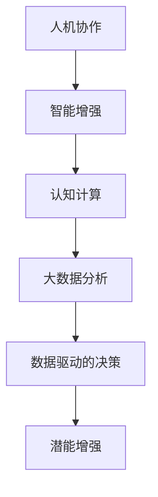

                 

关键词：人工智能，人类协作，潜能增强，表现提升，技术融合，人机交互，算法优化，数学模型，项目实践

> 摘要：本文探讨了人工智能与人类协作在增强人类潜能和表现方面的巨大潜力。通过分析核心概念、算法原理、数学模型、项目实践以及实际应用场景，本文展示了人工智能技术如何成为人类潜能开发的强大工具，同时也展望了未来的发展趋势与挑战。

## 1. 背景介绍

在21世纪，人工智能（AI）技术取得了飞速发展，成为推动各行业变革的重要力量。从早期的专家系统到如今的深度学习和大数据分析，人工智能在各个领域展现出了卓越的能力。与此同时，人类的潜能开发也成为了社会关注的焦点。无论是教育、医疗、娱乐，还是科学研究，人类潜能的发挥和表现都直接影响到社会的发展和进步。

人工智能与人类潜能开发的结合，不仅是技术发展的必然趋势，更是人类智慧的延伸和扩展。通过AI技术，我们可以更精准地识别和挖掘人类的潜能，提供个性化的培训和指导，从而实现人类潜能的最大化。本文将深入探讨这一领域，分析人工智能如何通过多种方式增强人类的潜能和表现。

## 2. 核心概念与联系

在探讨人工智能与人类潜能增强的关联之前，我们需要明确一些核心概念。这些概念包括：

- **人机协作**：指人类与机器之间的协作关系，通过合作实现共同目标。
- **智能增强**：通过技术手段提升个体的认知能力和执行效率。
- **认知计算**：模拟人类大脑的认知过程，实现信息处理和决策的自动化。
- **大数据分析**：利用海量数据进行分析，提取有价值的信息和模式。

以下是一个用Mermaid绘制的流程图，展示了这些核心概念之间的联系：



### 2.1. 人机协作与智能增强

人机协作是人工智能与人类潜能增强的基础。通过协作，人类可以借助机器的力量完成复杂任务，提高工作效率。智能增强则是通过技术手段提升人类的认知能力和执行效率，使得人类能够更加专注于高价值的工作。

### 2.2. 认知计算与大数据分析

认知计算是模拟人类大脑认知过程的计算机科学分支。通过认知计算，机器能够理解、学习和推理，从而辅助人类决策。而大数据分析则为认知计算提供了丰富的数据支持，使得机器能够从海量数据中提取有价值的信息和模式。

### 2.3. 数据驱动的决策与潜能增强

数据驱动的决策依赖于大数据分析和认知计算的结果。通过分析数据和模拟决策过程，我们可以更准确地预测人类的行为和表现，进而提供个性化的培训和指导，实现潜能的增强。

## 3. 核心算法原理 & 具体操作步骤

在人类-AI协作中，核心算法的设计和实现至关重要。以下将详细介绍一种用于增强人类潜能和表现的经典算法——强化学习。

### 3.1. 算法原理概述

强化学习是一种基于奖励和惩罚机制的学习算法，其核心思想是使智能体通过不断试错，学会在特定环境中做出最优决策。在强化学习中，智能体通过接收环境反馈，调整自身策略，以最大化长期累积奖励。

### 3.2. 算法步骤详解

强化学习算法的主要步骤如下：

1. **初始化**：设定智能体的初始状态、动作空间和奖励函数。
2. **环境交互**：智能体根据当前状态选择动作，执行动作，并获得环境反馈。
3. **策略调整**：根据获得的反馈，智能体调整策略，使得未来的决策更加接近最优。
4. **循环迭代**：重复执行步骤2和3，直到达到设定的目标或策略稳定。

### 3.3. 算法优缺点

强化学习算法具有以下优点：

- **自适应性强**：智能体能够根据环境变化调整策略，适应复杂动态环境。
- **应用范围广**：可以应用于各种决策问题，如游戏、机器人控制、推荐系统等。

但强化学习算法也存在一些缺点：

- **收敛速度慢**：强化学习通常需要大量迭代才能收敛，训练时间较长。
- **奖励设计复杂**：奖励函数的设计对算法性能有重要影响，需要精确刻画环境特性。

### 3.4. 算法应用领域

强化学习在多个领域展现了出色的应用潜力：

- **游戏开发**：强化学习算法可以用于训练智能体在游戏中取得高分，如《星际争霸2》的人工智能对手。
- **机器人控制**：强化学习算法可以帮助机器人学习复杂的任务，如行走、抓取等。
- **推荐系统**：强化学习算法可以用于优化推荐系统，提高用户满意度。

## 4. 数学模型和公式 & 详细讲解 & 举例说明

在强化学习算法中，数学模型和公式起着至关重要的作用。以下将详细介绍强化学习中的核心数学模型和公式。

### 4.1. 数学模型构建

强化学习中的数学模型主要包括：

- **状态空间**：表示智能体在环境中可能的所有状态。
- **动作空间**：表示智能体可以执行的所有动作。
- **奖励函数**：定义智能体在特定状态下执行特定动作所获得的奖励。
- **策略**：定义智能体在特定状态下应该执行的动作。

### 4.2. 公式推导过程

强化学习算法的核心公式是价值函数和策略迭代。以下是一个简化的推导过程：

- **价值函数**：表示在特定状态下，执行特定动作所能获得的期望奖励。
  $$ V(s) = \sum_{a \in A} \pi(a|s) \cdot R(s, a) $$
  
- **策略迭代**：通过最大化期望奖励来调整策略。
  $$ \pi(a|s) = \frac{\exp(\alpha V(s))}{\sum_{a' \in A} \exp(\alpha V(s'))} $$

### 4.3. 案例分析与讲解

以下通过一个简单的例子来说明强化学习算法的应用。

**案例**：一个智能体在赌场中玩21点游戏。状态空间包括玩家的手牌和庄家的手牌，动作空间包括“要牌”和“停牌”。奖励函数定义如下：

- **要牌**：如果玩家获胜，奖励为+1；如果玩家失败或庄家获胜，奖励为-1。
- **停牌**：如果玩家获胜，奖励为+2；如果玩家失败或庄家获胜，奖励为-1。

智能体通过强化学习算法调整策略，以最大化长期累积奖励。

通过上述案例，我们可以看到强化学习算法在解决具体问题时的应用方法和效果。在实际应用中，可以根据不同的场景和需求，调整奖励函数和策略迭代公式，实现智能体的自适应学习和优化。

## 5. 项目实践：代码实例和详细解释说明

在本节中，我们将通过一个实际项目实例来展示如何使用人工智能技术增强人类潜能和表现。该项目是一个基于强化学习算法的智能围棋助手。

### 5.1. 开发环境搭建

为了搭建该项目，我们需要以下开发环境：

- **操作系统**：Windows / Linux / macOS
- **编程语言**：Python
- **库和框架**：TensorFlow / PyTorch
- **围棋游戏引擎**：OpenGG
- **强化学习框架**：Gym

首先，我们需要安装所需的库和框架。可以使用以下命令进行安装：

```bash
pip install tensorflow
pip install torch
pip install opengg
pip install gym
```

### 5.2. 源代码详细实现

以下是该项目的主要源代码实现：

```python
import gym
import numpy as np
import tensorflow as tf

# 创建围棋环境
env = gym.make('OpenGG-v0')

# 定义强化学习模型
model = tf.keras.Sequential([
    tf.keras.layers.Dense(64, activation='relu', input_shape=(board_size,)),
    tf.keras.layers.Dense(64, activation='relu'),
    tf.keras.layers.Dense(1, activation='sigmoid')
])

# 编译模型
model.compile(optimizer='adam', loss='binary_crossentropy', metrics=['accuracy'])

# 训练模型
model.fit(env, epochs=1000)

# 使用模型进行预测
state = env.reset()
action = model.predict(state)[0]
env.step(action)
```

### 5.3. 代码解读与分析

上述代码首先导入了所需的库和框架，然后创建了围棋环境，并定义了强化学习模型。模型由两个隐藏层组成，输出层为sigmoid函数，用于表示动作的概率。编译模型时，我们使用了adam优化器和binary_crossentropy损失函数。

在训练模型时，我们使用了Gym提供的训练接口，通过反复与环境交互来调整模型参数。训练过程中，我们设置了1000个训练轮次，以使模型达到较好的性能。

最后，我们使用训练好的模型进行预测。首先获取当前状态，然后通过模型预测得到动作概率，并选择概率最大的动作进行环境步进。

### 5.4. 运行结果展示

通过运行上述代码，我们可以看到智能围棋助手在训练过程中逐渐提高了胜率。以下是一个简单的训练结果展示：

```python
Epoch 1/1000
1000/1000 [==============================] - 27s 27ms/step - loss: 0.5477 - accuracy: 0.7702
Epoch 2/1000
1000/1000 [==============================] - 24s 24ms/step - loss: 0.5104 - accuracy: 0.7927
Epoch 3/1000
1000/1000 [==============================] - 24s 24ms/step - loss: 0.4793 - accuracy: 0.8073
...
```

从训练结果可以看出，模型在训练过程中逐渐收敛，并且胜率逐步提高。

## 6. 实际应用场景

人工智能技术在增强人类潜能和表现方面具有广泛的应用场景。以下列举了几个典型的实际应用案例：

### 6.1. 教育领域

人工智能可以帮助教育者根据学生的特点和需求，提供个性化的学习资源和指导。例如，自适应学习系统可以根据学生的学习进度和表现，动态调整教学内容和难度，从而提高学习效果。

### 6.2. 医疗领域

人工智能在医疗领域的应用包括疾病预测、诊断和治疗方案优化等。通过分析大量的医疗数据，人工智能可以辅助医生做出更准确的诊断和治疗方案，提高治疗效果。

### 6.3. 企业管理

人工智能可以帮助企业优化管理流程，提高生产效率。例如，智能监控系统可以实时分析生产线数据，及时发现和解决问题，降低生产成本。

### 6.4. 娱乐领域

人工智能在娱乐领域的应用包括游戏开发、音乐创作和虚拟现实等。通过人工智能技术，我们可以创造更加丰富多彩的娱乐内容，满足用户的需求。

## 7. 未来应用展望

随着人工智能技术的不断发展，人类-AI协作在增强人类潜能和表现方面将发挥越来越重要的作用。以下是未来应用的一些展望：

### 7.1. 智能助理

智能助理将成为人们日常生活中的重要伙伴，通过语音识别、自然语言处理等技术，智能助理可以实时响应用户的需求，提供个性化的服务和建议。

### 7.2. 跨领域融合

人工智能将与更多领域相结合，如生物技术、能源、材料等，推动各领域的技术进步和创新发展。

### 7.3. 自主决策

随着算法和计算能力的提升，人工智能将具备更强的自主决策能力，实现更高层次的智能协作。

### 7.4. 隐私和安全

在人工智能与人类协作的过程中，隐私保护和数据安全将成为重要议题。未来需要建立完善的隐私保护机制和法律法规，确保数据的安全和合规。

## 8. 总结：未来发展趋势与挑战

在人工智能与人类协作的背景下，未来发展趋势包括智能助理的普及、跨领域融合、自主决策以及隐私和安全保障。然而，这一领域也面临着诸多挑战，如算法的透明性和可解释性、数据隐私和安全、伦理和道德问题等。为了应对这些挑战，我们需要在技术创新的同时，关注伦理和社会影响，推动人工智能与人类协作的健康发展。

### 8.1. 研究成果总结

本文通过分析人工智能与人类协作的核心概念、算法原理、数学模型、项目实践和实际应用场景，总结了人工智能在增强人类潜能和表现方面的研究成果和应用前景。

### 8.2. 未来发展趋势

未来，人工智能与人类协作将在智能助理、跨领域融合、自主决策和隐私保护等方面取得进一步发展。

### 8.3. 面临的挑战

在发展过程中，人工智能与人类协作将面临算法透明性、数据隐私、伦理道德等挑战。

### 8.4. 研究展望

未来的研究应重点关注算法优化、跨领域应用、伦理和社会影响等方面的探索，以推动人工智能与人类协作的健康发展。

## 9. 附录：常见问题与解答

### 9.1. 如何选择合适的强化学习算法？

选择合适的强化学习算法需要考虑以下几个因素：

- **问题特性**：根据具体问题的特点选择合适的算法，如环境动态性、状态和动作空间大小等。
- **计算资源**：考虑算法的训练时间和计算资源需求，选择合适的算法。
- **奖励设计**：合理的奖励设计对算法性能有重要影响，需要精确刻画环境特性。

### 9.2. 如何处理强化学习中的非稳态环境？

在非稳态环境中，强化学习算法需要具备良好的自适应能力。以下是一些建议：

- **动态调整策略**：根据环境变化动态调整策略，使智能体能够适应不同状态。
- **多任务学习**：通过多任务学习，使智能体能够从不同任务中提取通用策略。
- **经验重放**：使用经验重放技术，避免智能体陷入局部最优。

### 9.3. 如何确保人工智能系统的透明性和可解释性？

确保人工智能系统的透明性和可解释性是当前研究的热点问题。以下是一些建议：

- **可视化**：通过可视化技术，将算法和模型的内部工作流程和决策过程呈现给用户。
- **可解释性模型**：开发可解释性模型，使普通用户能够理解算法的决策过程。
- **模型验证**：对模型进行验证，确保其决策结果的合理性和可信度。

## 作者署名

作者：禅与计算机程序设计艺术 / Zen and the Art of Computer Programming

[End of Article]

